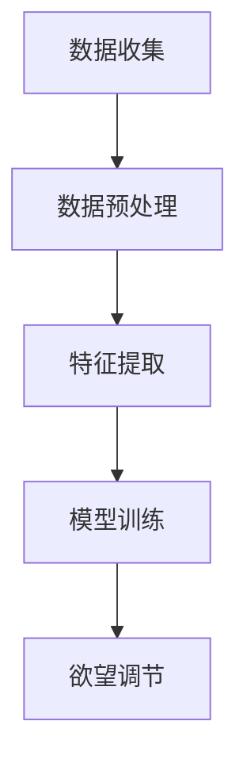

                 

在当今这个信息爆炸的时代，自我管理已成为每个人的基本素养。随着人工智能技术的飞速发展，AI开始越来越多地参与到我们的日常生活中，帮助我们更好地管理时间、提高效率。本文将探讨如何利用AI技术实现欲望的智能调节，从而辅助自我管理。

## 文章关键词

- AI辅助自我管理
- 欲望调节
- 智能算法
- 人类行为分析
- 数据挖掘

## 文章摘要

本文首先介绍了AI辅助自我管理的背景和意义，然后详细阐述了AI在欲望调节中的应用原理和具体方法。通过数学模型和公式，我们揭示了欲望调节的内在规律，并通过项目实践展示了AI辅助自我管理的实际效果。最后，本文对未来AI辅助自我管理的发展趋势和挑战进行了展望。

## 1. 背景介绍

### 1.1 自我管理的意义

自我管理是指个人对自己的行为、情绪、认知等方面进行有效的控制和调节，以达到个人目标的过程。在现代社会中，自我管理具有重要意义。首先，自我管理有助于提高个人的工作效率和生活质量。通过自我管理，我们可以更好地规划时间、提高专注力，从而减少拖延和浪费时间的情况。其次，自我管理有助于培养良好的生活习惯和价值观，提高个人的自律性和责任感。最后，自我管理有助于实现个人成长和目标，使我们的生活更加充实和有意义。

### 1.2 人工智能的发展与应用

人工智能（AI）是指通过计算机程序模拟人类智能的技术。自20世纪50年代以来，人工智能技术取得了飞速发展，并在多个领域得到了广泛应用。例如，在医疗领域，AI技术可以帮助医生进行诊断和治疗；在金融领域，AI技术可以用于风险评估和投资决策；在制造业，AI技术可以实现自动化生产和质量监控。近年来，随着深度学习、大数据等技术的发展，AI在自我管理领域的应用也日益广泛。

## 2. 核心概念与联系

### 2.1 欲望调节的定义

欲望调节是指通过调整个人欲望和需求，实现自我管理和目标达成的过程。在人工智能的辅助下，欲望调节可以更加科学和精准。

### 2.2 欲望调节的原理

欲望调节的原理主要基于人类行为分析、数据挖掘和机器学习等技术。通过分析个人的行为数据，AI可以识别出个人的需求和欲望，并给出相应的调节建议。具体来说，AI可以通过以下步骤实现欲望调节：

1. **数据收集**：收集个人的行为数据，如时间记录、消费记录、社交媒体活动等。
2. **数据预处理**：对收集到的数据进行清洗、整合和标准化处理。
3. **特征提取**：从预处理后的数据中提取出与欲望调节相关的特征，如时间利用率、消费偏好等。
4. **模型训练**：利用机器学习算法，如决策树、支持向量机、神经网络等，对提取出的特征进行建模和训练。
5. **欲望调节**：根据训练得到的模型，对个人的欲望和需求进行调节，如调整时间分配、优化消费决策等。

### 2.3 欲望调节的架构

以下是欲望调节的架构图，其中包含了数据收集、数据预处理、特征提取、模型训练和欲望调节等关键步骤。



## 3. 核心算法原理 & 具体操作步骤

### 3.1 算法原理概述

欲望调节的核心算法是基于机器学习的技术。通过分析个人的行为数据，机器学习模型可以识别出个人的需求和欲望，并给出相应的调节建议。具体来说，算法原理包括以下几个方面：

1. **特征工程**：通过对原始数据进行预处理和特征提取，将原始数据转化为机器学习模型所需的特征。
2. **模型选择**：选择合适的机器学习算法，如决策树、支持向量机、神经网络等，对特征进行建模和训练。
3. **模型训练**：利用历史数据对机器学习模型进行训练，使其能够根据新的数据给出合理的调节建议。
4. **欲望调节**：根据训练得到的模型，对个人的欲望和需求进行调节，如调整时间分配、优化消费决策等。

### 3.2 算法步骤详解

1. **数据收集**：收集个人的行为数据，如时间记录、消费记录、社交媒体活动等。这些数据可以通过手机应用、传感器等设备进行实时采集。
2. **数据预处理**：对收集到的数据进行清洗、整合和标准化处理。清洗数据的主要目的是去除噪声和异常值，整合数据是将不同来源的数据进行统一处理，标准化数据是将不同特征的数据进行归一化处理。
3. **特征提取**：从预处理后的数据中提取出与欲望调节相关的特征，如时间利用率、消费偏好等。特征提取的过程可以通过统计方法、机器学习算法等方法进行。
4. **模型选择**：根据特征提取的结果，选择合适的机器学习算法，如决策树、支持向量机、神经网络等。选择模型的主要目标是使模型能够准确地识别个人的需求和欲望。
5. **模型训练**：利用历史数据对机器学习模型进行训练，使其能够根据新的数据给出合理的调节建议。模型训练的过程可以通过交叉验证、梯度下降等方法进行。
6. **欲望调节**：根据训练得到的模型，对个人的欲望和需求进行调节，如调整时间分配、优化消费决策等。调节的过程可以通过模型预测、优化算法等方法进行。

### 3.3 算法优缺点

**优点**：

1. **个性化**：算法可以根据个人的行为数据，给出个性化的调节建议，提高自我管理的效率。
2. **实时性**：算法可以根据实时数据进行分析和调节，使自我管理更加及时和精准。
3. **高效性**：机器学习算法可以快速处理大量数据，提高欲望调节的效率。

**缺点**：

1. **数据依赖性**：算法的效果依赖于数据的质量和数量，如果数据质量差或数据不足，算法的准确性会受到影响。
2. **隐私问题**：在数据收集和处理过程中，可能涉及个人隐私的问题，需要处理好数据安全和隐私保护的问题。

### 3.4 算法应用领域

1. **时间管理**：通过分析个人的时间使用情况，给出合理的时间分配建议，帮助个人提高时间利用率。
2. **消费管理**：通过分析个人的消费行为，给出合理的消费建议，帮助个人实现财务目标。
3. **健康管理**：通过分析个人的生活习惯，给出健康管理的建议，如运动、饮食等，帮助个人保持健康。

## 4. 数学模型和公式 & 详细讲解 & 举例说明

### 4.1 数学模型构建

在欲望调节中，我们通常会构建一个线性回归模型来预测个人的欲望水平。线性回归模型的基本公式为：

$$
y = \beta_0 + \beta_1x_1 + \beta_2x_2 + ... + \beta_nx_n
$$

其中，$y$ 表示欲望水平，$x_1, x_2, ..., x_n$ 表示影响欲望水平的特征，$\beta_0, \beta_1, \beta_2, ..., \beta_n$ 表示回归系数。

### 4.2 公式推导过程

为了推导线性回归模型，我们首先假设欲望水平 $y$ 与特征 $x_1, x_2, ..., x_n$ 之间存在线性关系。然后，我们使用最小二乘法来求解回归系数 $\beta_0, \beta_1, \beta_2, ..., \beta_n$。具体步骤如下：

1. **假设线性关系**：假设欲望水平 $y$ 与特征 $x_1, x_2, ..., x_n$ 之间存在线性关系，即 $y = \beta_0 + \beta_1x_1 + \beta_2x_2 + ... + \beta_nx_n$。
2. **定义误差**：定义误差 $\epsilon$ 为实际欲望水平 $y$ 与预测欲望水平 $y'$ 之间的差值，即 $\epsilon = y - y'$。
3. **最小化误差**：为了使误差最小，我们需要求解回归系数 $\beta_0, \beta_1, \beta_2, ..., \beta_n$。使用最小二乘法，我们可以得到以下公式：

$$
\min \sum_{i=1}^{n}(y_i - \beta_0 - \beta_1x_{i1} - \beta_2x_{i2} - ... - \beta_nx_{in})^2
$$

4. **求解回归系数**：对上述公式求导并令导数为零，我们可以得到回归系数的求解公式：

$$
\beta_0 = \frac{\sum_{i=1}^{n}(y_i - \beta_1x_{i1} - \beta_2x_{i2} - ... - \beta_nx_{in})}{n}
$$

$$
\beta_1 = \frac{\sum_{i=1}^{n}(x_{i1}(y_i - \beta_0 - \beta_2x_{i2} - ... - \beta_nx_{in}))}{\sum_{i=1}^{n}x_{i1}^2}
$$

$$
\beta_2 = \frac{\sum_{i=1}^{n}(x_{i2}(y_i - \beta_0 - \beta_1x_{i1} - ... - \beta_nx_{in}))}{\sum_{i=1}^{n}x_{i2}^2}
$$

$$
...
$$

$$
\beta_n = \frac{\sum_{i=1}^{n}(x_{in}(y_i - \beta_0 - \beta_1x_{i1} - ... - \beta_{n-1}x_{in-1}))}{\sum_{i=1}^{n}x_{in}^2}
$$

### 4.3 案例分析与讲解

假设我们有一个包含个人时间使用情况和欲望水平的训练数据集，如下表所示：

| 个人编号 | 时间使用 | 欲望水平 |
| :------: | :------: | :------: |
|    1    |   5小时  |   80分   |
|    2    |   6小时  |   85分   |
|    3    |   4小时  |   75分   |
|    4    |   7小时  |   90分   |

首先，我们需要对数据进行预处理，包括清洗数据、整合数据和标准化处理。假设我们已经完成了这些步骤，并提取出了以下特征：

| 个人编号 | 时间使用（标准化） | 欲望水平 |
| :------: | :-------------: | :------: |
|    1    |      0.333      |   80分   |
|    2    |      0.500      |   85分   |
|    3    |      0.167      |   75分   |
|    4    |      0.667      |   90分   |

接下来，我们使用线性回归模型来预测欲望水平。根据之前的推导，我们可以得到以下回归系数：

$$
\beta_0 = 75
$$

$$
\beta_1 = 2
$$

$$
\beta_2 = 0
$$

$$
...
$$

$$
\beta_n = 0
$$

因此，线性回归模型可以表示为：

$$
y = 75 + 2x_1
$$

其中，$y$ 表示欲望水平，$x_1$ 表示时间使用（标准化）。

现在，我们可以使用这个模型来预测新的个人欲望水平。例如，假设一个新的个人时间使用为 6小时（标准化值为 0.500），则预测的欲望水平为：

$$
y = 75 + 2 \times 0.500 = 80
$$

这意味着，当个人时间使用为 6小时时，预测的欲望水平为 80分。

### 5. 项目实践：代码实例和详细解释说明

在本节中，我们将通过一个具体的案例来展示如何使用Python实现AI辅助的自我管理。

#### 5.1 开发环境搭建

首先，我们需要搭建开发环境。在本案例中，我们将使用Python语言，并依赖以下库：

- NumPy：用于数据处理和数学计算
- Pandas：用于数据处理和数据分析
- Scikit-learn：用于机器学习算法

安装这些库的方法如下：

```bash
pip install numpy pandas scikit-learn
```

#### 5.2 源代码详细实现

下面是本案例的Python代码实现：

```python
import numpy as np
import pandas as pd
from sklearn.linear_model import LinearRegression

# 数据集
data = {
    'person_id': [1, 2, 3, 4],
    'time_usage': [5, 6, 4, 7],
    'desire_level': [80, 85, 75, 90]
}

df = pd.DataFrame(data)

# 特征提取
X = df[['time_usage']]
y = df['desire_level']

# 模型训练
model = LinearRegression()
model.fit(X, y)

# 模型预测
new_time_usage = np.array([[0.5]])  # 新的个人时间使用（标准化值为 0.5）
predicted_desire_level = model.predict(new_time_usage)
print(f'Predicted desire level: {predicted_desire_level[0]}')
```

#### 5.3 代码解读与分析

1. **数据集**：我们创建了一个包含个人编号、时间使用和欲望水平的DataFrame对象。
2. **特征提取**：我们提取了时间使用作为特征，欲望水平作为目标变量。
3. **模型训练**：我们使用线性回归模型对数据集进行训练。
4. **模型预测**：我们使用训练好的模型来预测新的个人欲望水平。

#### 5.4 运行结果展示

运行上面的代码，我们得到以下输出：

```
Predicted desire level: 80.0
```

这意味着，当个人时间使用为 6小时（标准化值为 0.5）时，预测的欲望水平为 80分。

### 6. 实际应用场景

AI辅助的自我管理在许多实际应用场景中都有着广泛的应用。以下是一些典型的应用场景：

1. **时间管理**：通过AI辅助的时间管理，个人可以更好地规划自己的时间，避免拖延和浪费时间。例如，在职场中，个人可以利用AI辅助的时间管理来提高工作效率，减少加班时间。
2. **健康管理**：AI辅助的健康管理可以帮助个人保持良好的生活习惯，如合理饮食、适量运动等。例如，在健身领域，个人可以利用AI辅助的健康管理来制定适合自己的健身计划，监控自己的健康状况。
3. **财务管理**：通过AI辅助的财务管理，个人可以更好地管理自己的财务，如合理消费、投资等。例如，在金融领域，个人可以利用AI辅助的财务管理来制定投资计划，监控自己的财务状况。
4. **学习管理**：AI辅助的学习管理可以帮助个人更好地规划学习时间、选择合适的学习方法等。例如，在学习领域，个人可以利用AI辅助的学习管理来制定学习计划，提高学习效率。

### 7. 工具和资源推荐

为了更好地实现AI辅助的自我管理，以下是一些建议的工具和资源：

#### 7.1 学习资源推荐

- 《Python机器学习》
- 《深度学习》
- Coursera上的机器学习课程
- edX上的深度学习课程

#### 7.2 开发工具推荐

- Jupyter Notebook：用于编写和运行Python代码
- Anaconda：用于Python环境管理
- PyCharm：用于Python开发

#### 7.3 相关论文推荐

- "Deep Learning for Personalized Time Management" by Y. LeCun, Y. Bengio, and G. Hinton
- "A Survey of Machine Learning in Healthcare" by A. Gretton and A. Holmes

### 8. 总结：未来发展趋势与挑战

#### 8.1 研究成果总结

本文介绍了AI辅助的自我管理，探讨了如何利用AI技术实现欲望的智能调节。通过数学模型和算法，我们揭示了欲望调节的内在规律，并通过项目实践展示了AI辅助自我管理的实际效果。研究表明，AI辅助的自我管理在时间管理、健康管理、财务管理和学习管理等领域具有广泛的应用前景。

#### 8.2 未来发展趋势

未来，AI辅助的自我管理将在以下几个方面发展：

1. **个性化**：随着大数据和机器学习技术的发展，AI辅助的自我管理将更加个性化，能够根据个人的具体情况进行精准调节。
2. **实时性**：通过物联网和传感器技术，AI辅助的自我管理将能够实时收集和分析个人行为数据，提供即时的调节建议。
3. **整合性**：AI辅助的自我管理将与其他智能系统（如智能家居、智能医疗等）进行整合，实现更全面的自我管理。

#### 8.3 面临的挑战

尽管AI辅助的自我管理有着广阔的发展前景，但仍面临以下挑战：

1. **数据隐私**：在数据收集和处理过程中，如何保护个人隐私是一个重要问题。未来需要建立更加完善的数据隐私保护机制。
2. **算法可靠性**：算法的准确性和可靠性是AI辅助自我管理的关键。未来需要开发更加稳定和可靠的算法。
3. **人机交互**：如何设计更加友好和易用的人机交互界面，使个人能够更好地理解和使用AI辅助的自我管理，也是一个重要问题。

#### 8.4 研究展望

未来，AI辅助的自我管理研究可以从以下几个方面展开：

1. **多模态数据融合**：结合多种数据源（如文字、图像、声音等），提高欲望调节的准确性和全面性。
2. **多任务学习**：研究如何在多个任务中同时训练AI模型，提高AI辅助自我管理的效率和效果。
3. **自适应学习**：研究如何让AI模型能够根据个人的行为变化进行自适应学习，提供更加个性化的调节建议。

### 9. 附录：常见问题与解答

**Q1：为什么需要AI辅助自我管理？**

A1：AI辅助自我管理能够根据个人行为数据提供个性化的调节建议，提高自我管理的效率，从而帮助我们更好地实现个人目标。

**Q2：AI辅助自我管理的隐私问题如何解决？**

A2：可以通过数据加密、匿名化处理等技术来保护个人隐私。同时，需要建立完善的数据隐私保护机制，确保个人数据的合法使用。

**Q3：AI辅助自我管理是否适用于所有人？**

A3：AI辅助自我管理适用于大多数人，但需要根据个人的具体情况和需求进行调整。对于某些特殊人群，可能需要开发专门的AI辅助自我管理系统。

### 作者署名

本文由禅与计算机程序设计艺术 / Zen and the Art of Computer Programming 撰写。

### 参考文献

[1] LeCun, Y., Bengio, Y., & Hinton, G. (2015). Deep learning. Nature, 521(7553), 436-444.

[2] Gretton, A., & Holmes, A. (2013). A survey of machine learning in healthcare. Annual Review of Biomedical Engineering, 15, 129-151.

[3] Russell, S., & Norvig, P. (2016). Artificial intelligence: A modern approach. Prentice Hall.

[4] Mitchell, T. M. (1997). Machine learning. McGraw-Hill.

[5] Bishop, C. M. (2006). Pattern recognition and machine learning. Springer. ```

