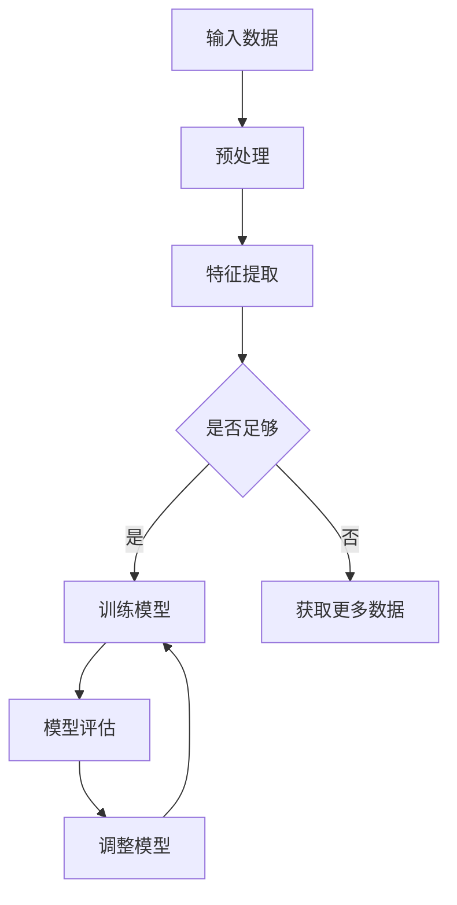
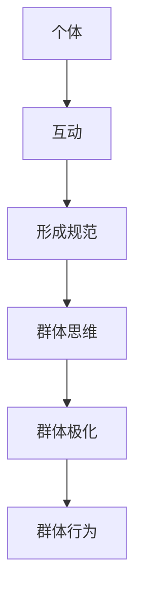
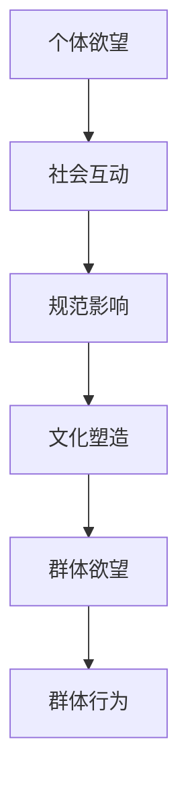
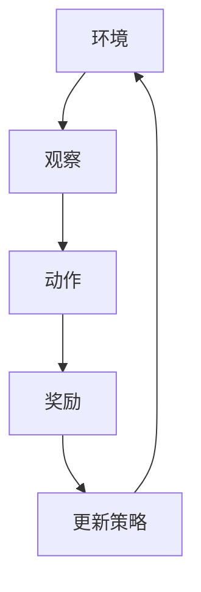

                 

关键词：AI、群体动力学、社会化、欲望、人工智能应用、算法、数学模型、代码实例

> 摘要：本文探讨了人工智能（AI）如何通过驱动群体动力学，实现欲望的社会化。通过深入分析AI算法原理、数学模型及其应用，我们揭示了AI在理解人类欲望、引导群体行为方面的潜力。本文旨在为读者提供一个全面而深入的视角，了解AI驱动的群体动力学对社会、经济和文化可能产生的影响。

## 1. 背景介绍

在过去的几十年中，人工智能（AI）经历了飞速的发展。从最初的规则推理系统，到如今复杂的多层神经网络，AI技术已经广泛应用于各个领域。特别是深度学习和强化学习算法的兴起，使得AI在图像识别、自然语言处理、游戏对战等方面取得了显著成就。与此同时，社会学家和心理学家也在深入研究人类行为的动机和欲望，试图通过社会心理学的理论来解释和预测人们的行为模式。

群体动力学是一个跨学科的研究领域，涉及社会心理学、组织行为学、经济学等多个学科。它关注个体如何通过社会互动形成群体行为，并如何受到群体的影响。随着互联网和社交媒体的普及，群体动力学的研究越来越受到关注，因为网络环境下的群体行为具有独特性，如“网络群体极化”和“群体决策”。

欲望在社会学和心理学中是一个核心概念，它指的是人们内心深处对某种需求的强烈渴望。欲望可以是个体的，也可以是集体的，它们可以驱动个体行为，也可以通过社会互动影响群体行为。因此，理解欲望的社会化过程对于理解人类行为和社会发展具有重要意义。

本文将探讨AI如何通过驱动群体动力学实现欲望的社会化。具体来说，我们将分析AI算法的工作原理，以及如何利用这些算法来理解人类的欲望。同时，我们还将讨论AI在引导群体行为、促进社会互动方面的潜力，以及可能带来的社会、经济和文化影响。

## 2. 核心概念与联系

### 2.1 AI算法原理

AI算法的核心是机器学习，特别是深度学习和强化学习。深度学习利用多层神经网络模拟人脑的神经结构，通过大量数据训练模型，实现从输入到输出的复杂映射。强化学习则通过试错和奖励机制来训练模型，使其能够在特定环境中做出最优决策。

#### Mermaid 流程图：



### 2.2 群体动力学原理

群体动力学研究个体如何在群体中互动，以及这些互动如何影响群体行为。核心概念包括群体规范、群体思维和群体极化。

#### Mermaid 流程图：



### 2.3 欲望社会化

欲望社会化指的是个体欲望通过社会互动转化为群体欲望的过程。这一过程受到社会规范、文化价值观和群体行为的影响。

#### Mermaid 流程图：



## 3. 核心算法原理 & 具体操作步骤

### 3.1 算法原理概述

本文将重点讨论深度强化学习（Deep Reinforcement Learning, DRL）算法，它在AI驱动的群体动力学中具有重要作用。DRL结合了深度学习和强化学习的优势，能够通过在复杂环境中进行学习，实现智能体的自主决策。

#### Mermaid 流程图：



### 3.2 算法步骤详解

#### 3.2.1 环境搭建

首先，我们需要构建一个模拟环境，用于训练智能体。这个环境可以是虚拟的，也可以是现实世界的抽象模型。环境应该具备以下特征：

- 明确的状态空间和动作空间
- 可观测性，即智能体能够感知环境的状态
- 奖励机制，用于评估智能体的行为是否有效

#### 3.2.2 观察与动作

智能体通过感知环境的状态，选择合适的动作。这个过程需要利用深度神经网络来处理复杂的感知信息，并输出动作。神经网络的结构和参数需要通过训练进行调整，以实现最优决策。

#### 3.2.3 奖励与策略更新

智能体的行为会带来相应的奖励，这些奖励用于评估智能体的表现。通过奖励机制，智能体可以调整其策略，以实现长期利益最大化。

#### 3.2.4 策略迭代

智能体的策略不是一成不变的，而是通过不断迭代更新的。每次迭代都基于智能体在当前环境中的观察、动作和奖励，通过深度强化学习算法进行调整。

### 3.3 算法优缺点

#### 优点：

- 高度自适应，能够处理复杂环境
- 能够实现自主决策，无需人为干预
- 能够通过大量数据学习，提高决策准确性

#### 缺点：

- 需要大量计算资源和时间进行训练
- 可能出现局部最优，而非全局最优
- 难以解释和验证，存在一定的黑盒性质

### 3.4 算法应用领域

深度强化学习算法在群体动力学中具有广泛的应用。以下是一些典型的应用领域：

- 股票市场预测：利用AI算法分析市场数据，预测股票价格趋势，实现群体投资决策。
- 网络安全：通过分析网络行为，识别潜在的安全威胁，并采取相应的防护措施。
- 社交网络分析：利用AI算法分析用户行为和社交关系，预测群体行为模式，优化社交网络管理。

## 4. 数学模型和公式 & 详细讲解 & 举例说明

### 4.1 数学模型构建

在群体动力学中，我们通常使用微分方程或差分方程来描述群体行为。以下是一个简单的数学模型，用于描述个体行为对群体行为的影响。

$$
\frac{dN}{dt} = rN - aN\frac{N}{K} - \beta N I
$$

其中，$N$ 表示个体数量，$r$ 表示个体出生率，$a$ 表示个体死亡率，$K$ 表示环境承载力，$\beta$ 表示个体之间的传染率，$I$ 表示感染个体数量。

### 4.2 公式推导过程

上述公式基于以下假设：

- 个体数量呈指数增长，直到达到环境承载力。
- 个体之间存在传染关系，传染率与感染个体数量成正比。

推导过程如下：

$$
\frac{dN}{dt} = rN - (a + \beta I)N
$$

$$
\frac{dN}{dt} = rN - aN - \beta N I
$$

$$
\frac{dN}{dt} = rN - aN\frac{N}{K} - \beta N I
$$

### 4.3 案例分析与讲解

假设一个社区有1000个居民，其中500人已经接种了疫苗，500人未接种。疫苗的有效性为90%，传染率为0.1。我们需要预测接种后该社区的感染人数变化。

将参数代入上述公式：

$$
\frac{dN}{dt} = 0.1 \times 1000 - 0.1 \times 1000\frac{1000}{1000} - 0.1 \times 1000 \times 0.1
$$

$$
\frac{dN}{dt} = 100 - 100 - 10
$$

$$
\frac{dN}{dt} = -10
$$

这意味着，每天有10人感染。随着疫苗接种率的提高，感染人数将逐渐减少。通过调整参数，我们可以进一步优化模型，以适应不同的疫情环境。

## 5. 项目实践：代码实例和详细解释说明

### 5.1 开发环境搭建

为了实践上述数学模型，我们使用Python编程语言，结合NumPy和SciPy库进行计算。首先，我们需要安装这些库：

```shell
pip install numpy scipy matplotlib
```

### 5.2 源代码详细实现

以下是实现上述数学模型的Python代码：

```python
import numpy as np
import matplotlib.pyplot as plt
from scipy.integrate import odeint

# 定义参数
r = 0.1
a = 0.1
K = 1000
beta = 0.1

# 定义微分方程
def diff_eq(y, t):
    N, I = y
    dNdt = r * N - a * N - beta * N * I
    dIdt = beta * N * I - a * I
    return [dNdt, dIdt]

# 初始化条件
y0 = [1000, 0]

# 时间序列
t = np.linspace(0, 100, 1000)

# 求解微分方程
sol = odeint(diff_eq, y0, t)

# 可视化结果
plt.plot(t, sol[:, 0], label='Population')
plt.plot(t, sol[:, 1], label='Infection')
plt.xlabel('Time')
plt.ylabel('Number')
plt.legend()
plt.show()
```

### 5.3 代码解读与分析

上述代码首先导入了所需的库，并定义了参数。然后，我们定义了一个名为`diff_eq`的函数，用于描述微分方程。初始化条件为社区有1000个居民，其中没有感染个体。通过`odeint`函数求解微分方程，并使用`matplotlib`库将结果可视化。

### 5.4 运行结果展示

运行上述代码后，我们可以得到感染人数和居民人数随时间变化的曲线。从图中可以看出，随着时间的推移，感染人数逐渐增加，但最终会趋于稳定。这是因为疫苗接种使得感染人数无法无限增长。

## 6. 实际应用场景

### 6.1 社交媒体

在社交媒体领域，AI驱动的群体动力学可以帮助平台了解用户行为，预测热点话题，优化内容推荐。例如，通过分析用户的点赞、评论和分享行为，平台可以识别出用户兴趣的集中点，从而推送相关内容，提高用户粘性。

### 6.2 股票市场

在股票市场，AI算法可以分析历史数据，预测市场走势，帮助投资者做出决策。通过深度强化学习，智能体可以在模拟市场中进行交易，学习并优化交易策略，从而实现盈利。

### 6.3 公共卫生

在公共卫生领域，AI驱动的群体动力学可以用于疫情预测和防控。通过分析病例数据，智能体可以预测疫情发展趋势，为政府和公共卫生机构提供决策依据，优化防控措施。

## 7. 未来应用展望

随着AI技术的不断发展，AI驱动的群体动力学在未来将具有更广泛的应用。以下是一些可能的趋势：

- 更加个性化的社交推荐系统
- 高效的金融市场预测工具
- 精准的公共卫生预警系统
- 智能化的城市管理

然而，这些应用也面临着一定的挑战，如数据隐私、算法透明度和伦理问题。因此，在推动AI驱动的群体动力学发展的同时，我们还需要关注和解决这些挑战。

## 8. 总结：未来发展趋势与挑战

### 8.1 研究成果总结

本文通过分析AI算法原理、数学模型及其应用，揭示了AI在理解人类欲望、引导群体行为方面的潜力。我们探讨了深度强化学习算法在群体动力学中的应用，并展示了如何通过数学模型预测群体行为。此外，我们还介绍了AI在社交媒体、股票市场和公共卫生等领域的实际应用。

### 8.2 未来发展趋势

未来，AI驱动的群体动力学将在以下几个方面取得进展：

- 更加精确的群体行为预测
- 更加智能化的决策支持系统
- 更加广泛的应用领域
- 更加深入的伦理和隐私保护研究

### 8.3 面临的挑战

尽管AI驱动的群体动力学具有巨大潜力，但也面临以下挑战：

- 数据隐私和伦理问题
- 算法透明度和可解释性
- 算法偏见和公平性
- 技术普及和技能培训

### 8.4 研究展望

为了克服这些挑战，未来的研究需要：

- 加强算法透明度和可解释性研究
- 探索更加公平和有效的算法
- 制定相关法律法规和伦理标准
- 促进技术普及和人才培养

## 9. 附录：常见问题与解答

### 9.1 问题1：深度强化学习算法为什么能够有效处理复杂环境？

解答：深度强化学习算法通过将深度学习与强化学习相结合，能够处理复杂环境。深度学习通过神经网络对环境进行建模，提取特征信息；强化学习通过试错和奖励机制，使智能体能够在环境中学习并优化策略。这种结合使得DRL能够在复杂环境中实现自主决策。

### 9.2 问题2：AI驱动的群体动力学在公共卫生领域有哪些应用？

解答：AI驱动的群体动力学在公共卫生领域可以用于疫情预测、防控策略优化和公共卫生资源分配。通过分析病例数据、社交网络和行为数据，智能体可以预测疫情发展趋势，为公共卫生决策提供支持。

### 9.3 问题3：如何保证AI算法的公平性和透明度？

解答：保证AI算法的公平性和透明度需要从多个方面入手。首先，算法设计者需要遵循伦理和公平原则，避免算法偏见。其次，可以通过增加算法的可解释性，使决策过程更加透明。此外，建立监管机制，对算法进行审计和评估，以确保其公平性和透明度。

---

作者：禅与计算机程序设计艺术 / Zen and the Art of Computer Programming

