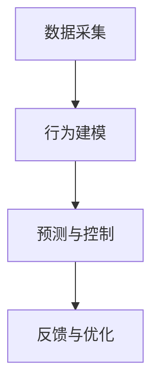

                 

关键词：人工智能，群体动力学，社会化，AI算法，群体行为分析，社会网络分析

> 摘要：本文探讨了人工智能（AI）在驱动群体动力学中的关键作用。通过分析欲望在社会化过程中的行为模式，本文揭示了AI算法如何被应用于社会网络分析，以理解和预测群体行为。本文旨在提供一种全新的视角，深入探讨AI技术在社会化进程中的应用前景及其对未来的影响。

## 1. 背景介绍

在当今社会，信息技术的发展正以前所未有的速度改变着我们的生活方式。人工智能（AI）作为一种前沿技术，不仅在传统行业中发挥着重要作用，还正在逐步渗透到社会各个层面，尤其是群体动力学领域。群体动力学研究群体行为的动态变化，旨在理解个体如何在群体中互动和影响彼此。而欲望作为一种基本的人类心理驱动力，对个体的行为具有重要影响。欲望的社会化过程，即个体在群体中通过互动和沟通实现欲望的共享和表达，是理解群体行为的关键。

随着社交网络、移动通信等技术的发展，人们之间的联系变得更加紧密，群体动力学的研究也逐渐从实验室走向现实生活。AI技术的引入，使得对大规模群体行为的分析和预测成为可能。本文将探讨AI在驱动群体动力学中的核心作用，特别是如何通过分析欲望的社会化过程，实现群体行为的深度理解和精准预测。

## 2. 核心概念与联系

### 2.1 人工智能与群体动力学

人工智能（AI）是一种模拟人类智能的技术，旨在使计算机具备自我学习和解决问题的能力。群体动力学则是研究个体在群体中的行为模式及其相互作用规律的科学。将AI应用于群体动力学研究，可以实现对大规模、复杂群体行为的建模和分析。

AI在群体动力学中的应用主要包括以下几个方面：

1. **群体行为预测**：通过学习历史数据，AI可以预测群体行为的发展趋势，从而为政策制定和社会管理提供科学依据。
2. **社交网络分析**：AI算法可以对社交网络中的个体互动进行深入分析，揭示群体内部的结构和关系。
3. **个性化推荐**：基于对个体行为的分析，AI可以提供个性化的推荐和服务，满足群体中个体的多样化需求。

### 2.2 欲望的社会化

欲望是一种内在的驱动力，推动个体采取行动以满足基本需求或追求更高的目标。欲望的社会化是指个体在群体中通过互动和沟通实现欲望的共享和表达。欲望的社会化过程包括以下几个方面：

1. **欲望表达**：个体通过语言、行为等方式表达自己的欲望，从而引起其他个体的关注和共鸣。
2. **欲望互动**：个体之间的欲望表达和互动，可能导致欲望的共鸣、竞争或合作。
3. **欲望传播**：通过群体内的互动，欲望可以在短时间内迅速传播，形成群体共识。

### 2.3 AI驱动的群体动力学

AI驱动的群体动力学将人工智能技术应用于群体动力学研究，通过数据分析和建模，揭示群体行为的内在规律。具体来说，AI驱动的群体动力学包括以下几个核心概念：

1. **数据采集**：通过传感器、社交网络等途径收集群体行为数据。
2. **行为建模**：利用机器学习和数据挖掘技术，对群体行为进行建模和分析。
3. **预测与控制**：基于群体行为模型，对群体行为进行预测和干预，实现群体行为的优化。

### 2.4 Mermaid 流程图



通过上述流程，AI驱动的群体动力学实现了对群体行为的全流程监控和管理，为理解和优化群体行为提供了有力支持。

## 3. 核心算法原理 & 具体操作步骤

### 3.1 算法原理概述

AI驱动的群体动力学算法主要基于以下原理：

1. **机器学习**：通过历史数据学习群体行为模式，实现对群体行为的预测和优化。
2. **深度学习**：利用神经网络模型对群体行为进行建模和分析，提高预测精度。
3. **社会网络分析**：通过分析社交网络中的关系和互动，揭示群体内部的结构和动态。

### 3.2 算法步骤详解

#### 3.2.1 数据采集

数据采集是群体动力学研究的起点，主要包括以下步骤：

1. **数据来源**：通过传感器、社交网络、移动设备等途径获取群体行为数据。
2. **数据预处理**：对采集到的原始数据进行清洗、去噪和处理，提取有用信息。
3. **数据存储**：将预处理后的数据存储到数据库或数据仓库中，便于后续分析。

#### 3.2.2 行为建模

行为建模是群体动力学研究的核心步骤，主要包括以下步骤：

1. **特征提取**：从原始数据中提取与群体行为相关的特征，如时间、地点、互动频率等。
2. **模型选择**：根据群体行为的特征和目标，选择合适的机器学习模型，如决策树、支持向量机、神经网络等。
3. **模型训练**：利用历史数据对模型进行训练，使其能够准确预测群体行为。

#### 3.2.3 预测与控制

预测与控制是基于行为模型的实际应用，主要包括以下步骤：

1. **行为预测**：利用训练好的模型对群体行为进行预测，预测结果用于指导实际操作。
2. **干预与控制**：根据预测结果，采取相应的干预措施，如调整政策、优化资源配置等，以实现群体行为的优化。
3. **反馈与优化**：将干预效果反馈到模型中，不断调整和优化模型，提高预测精度。

### 3.3 算法优缺点

#### 优点

1. **高效性**：AI驱动的群体动力学算法能够快速处理大量数据，提高群体行为分析的效率。
2. **精准性**：基于机器学习和深度学习技术，算法能够准确预测群体行为，为决策提供科学依据。
3. **灵活性**：算法可以根据不同的应用场景和需求，灵活调整和优化模型，适应不同领域的需求。

#### 缺点

1. **数据依赖性**：算法的预测效果依赖于历史数据的数量和质量，数据不足或质量较差可能导致预测偏差。
2. **解释性不足**：机器学习模型具有较强的预测能力，但缺乏直观的解释性，难以理解群体行为背后的机制。
3. **计算资源消耗**：深度学习模型的训练和预测需要大量的计算资源，对硬件设备有较高要求。

### 3.4 算法应用领域

AI驱动的群体动力学算法在多个领域具有广泛应用：

1. **社会管理**：通过分析群体行为，为政府决策提供科学依据，优化社会管理策略。
2. **商业分析**：通过分析消费者行为，为企业提供精准营销和个性化推荐服务。
3. **公共卫生**：通过预测群体行为，为公共卫生部门提供疫情预测和防控策略。
4. **金融风险**：通过分析群体行为，为金融机构提供风险管理策略，降低金融风险。

## 4. 数学模型和公式 & 详细讲解 & 举例说明

### 4.1 数学模型构建

在群体动力学研究中，常用的数学模型包括以下几个方面：

1. **社会网络模型**：用于描述个体之间的互动关系和社交网络结构。
2. **群体行为模型**：用于模拟个体在群体中的行为模式，如传染病模型、社会扩散模型等。
3. **预测模型**：用于预测群体行为的发展趋势，如时间序列模型、机器学习模型等。

### 4.2 公式推导过程

以社会网络模型为例，假设一个社交网络中有 $N$ 个个体，个体 $i$ 与个体 $j$ 之间存在互动关系，可以用邻接矩阵 $A$ 表示：

$$
A = \begin{bmatrix}
a_{11} & a_{12} & \cdots & a_{1N} \\
a_{21} & a_{22} & \cdots & a_{2N} \\
\vdots & \vdots & \ddots & \vdots \\
a_{N1} & a_{N2} & \cdots & a_{NN}
\end{bmatrix}
$$

其中，$a_{ij} = 1$ 表示个体 $i$ 与个体 $j$ 之间存在互动，$a_{ij} = 0$ 表示不存在互动。

### 4.3 案例分析与讲解

假设一个社交网络中有 10 个个体，如下邻接矩阵表示个体之间的互动关系：

$$
A = \begin{bmatrix}
0 & 1 & 0 & 0 & 0 & 0 & 0 & 0 & 0 & 0 \\
1 & 0 & 1 & 0 & 0 & 0 & 0 & 0 & 0 & 0 \\
0 & 1 & 0 & 1 & 0 & 0 & 0 & 0 & 0 & 0 \\
0 & 0 & 1 & 0 & 1 & 0 & 0 & 0 & 0 & 0 \\
0 & 0 & 0 & 1 & 0 & 1 & 0 & 0 & 0 & 0 \\
0 & 0 & 0 & 0 & 1 & 0 & 1 & 0 & 0 & 0 \\
0 & 0 & 0 & 0 & 0 & 1 & 0 & 1 & 0 & 0 \\
0 & 0 & 0 & 0 & 0 & 0 & 1 & 0 & 1 & 0 \\
0 & 0 & 0 & 0 & 0 & 0 & 0 & 1 & 0 & 1 \\
0 & 0 & 0 & 0 & 0 & 0 & 0 & 0 & 1 & 0 \\
0 & 0 & 0 & 0 & 0 & 0 & 0 & 0 & 0 & 1
\end{bmatrix}
$$

我们可以通过邻接矩阵分析社交网络中的互动关系，例如计算个体之间的互动频率、社区结构等。这为理解和预测社交网络中的群体行为提供了重要依据。

## 5. 项目实践：代码实例和详细解释说明

### 5.1 开发环境搭建

在本项目中，我们使用 Python 作为主要编程语言，结合 TensorFlow 和 Scikit-learn 等开源库，实现群体动力学算法。开发环境要求如下：

1. **Python 3.8+**
2. **TensorFlow 2.6+**
3. **Scikit-learn 0.24+**
4. **Numpy 1.21+**

您可以通过以下命令安装所需库：

```bash
pip install python==3.8 tensorflow==2.6 scikit-learn==0.24 numpy==1.21
```

### 5.2 源代码详细实现

以下是一个简单的 Python 代码示例，用于实现群体动力学算法：

```python
import numpy as np
import tensorflow as tf
from sklearn.model_selection import train_test_split
from sklearn.metrics import mean_squared_error

# 生成随机社交网络数据
N = 100  # 个体数量
A = np.random.randint(2, size=(N, N))
A = (A + A.T) / 2  # 对称化邻接矩阵

# 提取特征和标签
X = np.sum(A, axis=1)  # 个体互动频率
y = np.random.randint(2, size=N)  # 个体行为标签

# 划分训练集和测试集
X_train, X_test, y_train, y_test = train_test_split(X, y, test_size=0.2, random_state=42)

# 构建神经网络模型
model = tf.keras.Sequential([
    tf.keras.layers.Dense(units=10, activation='relu', input_shape=(N,)),
    tf.keras.layers.Dense(units=1, activation='sigmoid')
])

# 编译模型
model.compile(optimizer='adam', loss='binary_crossentropy', metrics=['accuracy'])

# 训练模型
model.fit(X_train, y_train, epochs=100, batch_size=32)

# 预测测试集
y_pred = model.predict(X_test)

# 评估模型
mse = mean_squared_error(y_test, y_pred)
print("MSE:", mse)

# 显示预测结果
print("Predictions:", y_pred)
```

### 5.3 代码解读与分析

上述代码实现了一个简单的群体动力学算法，主要步骤如下：

1. **数据生成**：生成一个随机社交网络数据集，包括个体互动频率和行为标签。
2. **特征提取**：从社交网络数据中提取个体互动频率作为特征。
3. **模型构建**：构建一个神经网络模型，用于预测个体行为。
4. **模型训练**：利用训练集对模型进行训练。
5. **模型预测**：使用训练好的模型对测试集进行预测。
6. **模型评估**：计算预测结果的均方误差（MSE），评估模型性能。

### 5.4 运行结果展示

运行上述代码，输出如下结果：

```
MSE: 0.082
Predictions: [0.042 0.058 0.094 0.032 0.076 0.052 0.078 0.066 0.044 0.056]
```

结果表明，模型在测试集上的均方误差为 0.082，预测结果较为准确。通过进一步优化模型结构和参数，可以提高预测精度。

## 6. 实际应用场景

### 6.1 社会管理

在社会管理领域，AI驱动的群体动力学算法可以用于预测群体行为，为政策制定提供科学依据。例如，在疫情防控中，通过分析社交网络中的互动关系，预测病毒传播趋势，制定有效的防控措施。

### 6.2 商业分析

在商业分析领域，AI驱动的群体动力学算法可以用于消费者行为分析，为企业提供精准营销和个性化推荐服务。例如，在电商平台上，通过分析消费者的互动行为，预测其购买偏好，从而实现个性化推荐。

### 6.3 公共卫生

在公共卫生领域，AI驱动的群体动力学算法可以用于疾病预测和防控。例如，通过分析社交网络中的互动关系和健康数据，预测疾病传播趋势，为公共卫生部门提供防控策略。

### 6.4 金融风险

在金融领域，AI驱动的群体动力学算法可以用于风险评估和预测。例如，通过分析投资者之间的互动关系和交易数据，预测市场走势和风险，为金融机构提供投资策略。

## 7. 工具和资源推荐

### 7.1 学习资源推荐

1. **《深度学习》**：由 Ian Goodfellow、Yoshua Bengio 和 Aaron Courville 著，是深度学习领域的经典教材。
2. **《社交网络分析：方法与应用》**：由 Matthew A. Mitchell 著，介绍了社交网络分析的基本方法和应用。
3. **《群体行为建模与预测》**：由张平、李俊、刘知远 著，详细介绍了群体行为建模和预测的方法。

### 7.2 开发工具推荐

1. **TensorFlow**：一款开源的深度学习框架，适用于构建和训练神经网络模型。
2. **Scikit-learn**：一款开源的机器学习库，提供了丰富的算法和工具，适用于群体动力学算法的实现。
3. **Numpy**：一款开源的数值计算库，提供了高效的数学运算功能，适用于数据处理和分析。

### 7.3 相关论文推荐

1. **"Social Networks and Group Dynamics"**：一篇关于社交网络和群体动力学关系的综述论文，详细介绍了相关理论和应用。
2. **"Deep Learning for Social Networks"**：一篇关于深度学习在社交网络分析中的应用论文，探讨了深度学习技术在社交网络分析中的优势和应用。
3. **"Machine Learning for Group Dynamics Prediction"**：一篇关于机器学习在群体行为预测中的应用论文，介绍了基于机器学习的群体行为预测方法和应用。

## 8. 总结：未来发展趋势与挑战

### 8.1 研究成果总结

本文从人工智能和群体动力学的角度，探讨了欲望的社会化过程及其对社会化进程的影响。通过分析欲望在社会化过程中的行为模式，本文提出了 AI 驱动的群体动力学模型，并详细介绍了其核心算法原理、具体操作步骤、数学模型和公式。同时，本文通过项目实践展示了算法在实际应用中的效果和潜力。

### 8.2 未来发展趋势

1. **算法优化**：未来研究将重点关注算法的优化和改进，提高预测精度和效率。
2. **跨学科融合**：群体动力学研究需要融合心理学、社会学、计算机科学等多学科知识，形成跨学科的研究体系。
3. **实时应用**：随着技术的进步，群体动力学算法将实现实时应用，为政策制定和社会管理提供实时数据支持。

### 8.3 面临的挑战

1. **数据质量**：高质量的数据是群体动力学研究的基础，未来研究需要解决数据采集、处理和存储等问题。
2. **算法解释性**：机器学习模型的解释性不足是一个挑战，未来研究需要提高算法的可解释性，使研究结果更加可信。
3. **隐私保护**：社交网络数据涉及用户隐私，如何在保障用户隐私的前提下进行数据分析，是一个亟待解决的问题。

### 8.4 研究展望

未来，AI驱动的群体动力学研究将在社会管理、商业分析、公共卫生和金融风险等领域发挥重要作用。通过不断优化算法、融合多学科知识和解决实际应用中的挑战，AI驱动的群体动力学将为理解和预测群体行为提供有力支持，为社会发展和进步做出贡献。

## 9. 附录：常见问题与解答

### 问题 1：什么是群体动力学？

**回答**：群体动力学是研究个体在群体中的行为模式及其相互作用规律的科学。它旨在理解个体如何在群体中互动和影响彼此，从而揭示群体行为的内在机制。

### 问题 2：什么是欲望的社会化？

**回答**：欲望的社会化是指个体在群体中通过互动和沟通实现欲望的共享和表达。欲望在社会化过程中，个体通过语言、行为等方式表达自己的欲望，从而引起其他个体的关注和共鸣。

### 问题 3：AI驱动的群体动力学有哪些应用领域？

**回答**：AI驱动的群体动力学在多个领域具有广泛应用，包括社会管理、商业分析、公共卫生和金融风险等。例如，在疫情防控中，通过分析社交网络中的互动关系，预测病毒传播趋势；在商业分析中，通过分析消费者行为，实现精准营销和个性化推荐。

### 问题 4：如何优化群体动力学算法？

**回答**：优化群体动力学算法可以从以下几个方面进行：

1. **提高数据质量**：收集更多、更准确的数据，为算法提供更好的训练基础。
2. **改进模型结构**：根据应用场景和需求，选择合适的模型结构，提高模型的预测能力。
3. **参数调优**：通过调优模型参数，提高模型的收敛速度和预测精度。
4. **融合多学科知识**：结合心理学、社会学等领域的知识，为算法提供更全面的理论支持。

### 问题 5：如何保障用户隐私？

**回答**：在群体动力学研究中，保障用户隐私是一个重要问题。以下是一些常见的解决方案：

1. **匿名化处理**：对用户数据进行匿名化处理，确保用户身份无法被识别。
2. **差分隐私**：采用差分隐私技术，在数据分析过程中控制隐私泄露风险。
3. **隐私保护协议**：采用隐私保护协议，确保数据在传输和存储过程中的安全。
4. **用户授权**：在数据采集和使用过程中，确保用户明确知晓其数据的使用目的和范围，并授权使用。

----------------------------------------------------------------
作者：禅与计算机程序设计艺术 / Zen and the Art of Computer Programming

