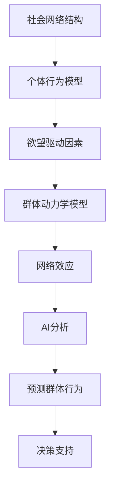

                 

关键词：AI, 社会网络，群体动力学，个体行为，网络结构，算法，模型，数学公式，代码实例，实践应用，未来展望。

## 摘要

本文旨在探讨人工智能（AI）在理解和管理社会网络中的欲望驱动行为方面的潜力。通过分析个体欲望与社会网络之间的复杂关系，我们揭示了AI在群体动力学中的作用机制。文章首先介绍了核心概念和原理，随后深入讨论了相关算法原理、数学模型、以及具体的代码实现。此外，本文还将展示AI在实际应用场景中的效果，并展望未来的发展趋势和挑战。

## 1. 背景介绍

社会网络是指由个体及其相互关系组成的复杂系统。在过去的几十年中，随着社交平台的兴起，社会网络的规模和复杂性不断增加。这种网络结构的复杂性使得传统的分析工具和方法变得力不从心。个体在社会网络中的行为往往受到多种因素的影响，其中欲望是一个重要的动机因素。欲望可以是个体的基本需求，如食物、安全、社交，也可以是更高层次的目标，如财富、名誉、地位。

### 1.1 社会网络与群体动力学

群体动力学是研究个体在群体中相互作用、协同行为以及群体整体行为的科学。在社会网络中，个体之间的相互作用不仅受到直接关系的影响，还受到间接关系的放大和影响。这种复杂的交互作用形成了群体行为的非线性动力学特性。理解群体动力学对于预测群体行为、制定社会政策、以及解决社会问题具有重要意义。

### 1.2 人工智能的作用

人工智能（AI）作为现代科技的前沿领域，其在社会网络和群体动力学研究中的应用日益受到重视。通过大数据分析和机器学习技术，AI能够从海量社会网络数据中提取出个体和群体的特征，揭示出隐藏在复杂社会关系中的模式和规律。此外，AI还可以通过模拟和预测个体行为，为决策者提供科学依据，从而在解决社会问题和优化社会管理方面发挥重要作用。

## 2. 核心概念与联系

### 2.1 社会网络结构

社会网络结构是指个体之间的相互连接关系。这些连接关系可以用图论中的图来表示，其中节点代表个体，边代表个体之间的联系。社会网络结构可以分为多种类型，如无向图、有向图、加权图等。不同类型的社会网络结构具有不同的动力学特性。

### 2.2 个体行为与欲望

个体行为是指个体在社会网络中的表现，如社交、传播、决策等。个体行为受到多种因素的影响，其中欲望是一个重要的动机因素。欲望可以分为基本欲望和高级欲望，它们分别驱动个体在基本生存和社会互动中的行为。

### 2.3 群体动力学与网络效应

群体动力学描述了个体在群体中的相互作用和整体行为。网络效应是指个体之间通过社会网络相互作用而产生的整体效应。这些效应可以放大个体行为的影响，从而改变群体行为的整体趋势。

### 2.4 AI驱动的群体动力学

AI驱动的群体动力学利用AI技术对社会网络中的个体行为进行建模和分析，从而预测群体行为。通过机器学习和深度学习算法，AI可以从海量数据中提取出个体和群体的特征，揭示出隐藏在复杂社会关系中的模式和规律。

## 2.5 Mermaid 流程图



## 3. 核心算法原理 & 具体操作步骤

### 3.1 算法原理概述

AI驱动的群体动力学算法主要包括以下几个步骤：数据采集、特征提取、模型构建、模型训练和预测。首先，通过数据采集获取社会网络中的个体行为数据；然后，利用特征提取技术提取出个体的特征；接着，基于这些特征构建群体动力学模型；最后，通过模型训练和预测，得到群体行为的趋势。

### 3.2 算法步骤详解

#### 3.2.1 数据采集

数据采集是算法的基础，主要包括两个方面：社会网络结构和个体行为数据。社会网络结构数据可以通过社交平台、在线社区等途径获取；个体行为数据可以通过调查问卷、用户日志等途径获取。

#### 3.2.2 特征提取

特征提取是算法的核心步骤，旨在从原始数据中提取出个体的关键特征。这些特征可以分为以下几个方面：

- **社交特征**：如好友数量、社交圈大小、社交频率等。
- **行为特征**：如发布内容类型、发布频率、互动行为等。
- **心理特征**：如欲望类型、欲望强度、心理状态等。

#### 3.2.3 模型构建

模型构建是根据特征提取的结果，构建一个能够描述个体行为的群体动力学模型。常用的模型包括基于图论的模型、基于机器学习的模型等。

#### 3.2.4 模型训练

模型训练是利用已标注的数据集对构建好的模型进行训练，从而优化模型参数，提高模型预测精度。

#### 3.2.5 预测群体行为

在模型训练完成后，利用训练好的模型对未知数据进行预测，从而得到群体行为的趋势。

### 3.3 算法优缺点

#### 3.3.1 优点

- **高效性**：AI驱动的群体动力学算法能够在短时间内处理海量数据，提高预测精度。
- **泛化能力**：通过机器学习和深度学习技术，算法具有良好的泛化能力，可以适应不同类型的社会网络。
- **可解释性**：通过构建清晰的模型结构，算法具有较高的可解释性，有助于理解群体行为的内在机制。

#### 3.3.2 缺点

- **数据依赖性**：算法的性能依赖于数据质量，数据缺失或不准确可能导致预测结果偏差。
- **计算复杂性**：群体动力学模型的计算复杂性较高，可能需要较大的计算资源。

### 3.4 算法应用领域

AI驱动的群体动力学算法在多个领域具有广泛的应用前景，如：

- **社会问题预测**：预测社会动荡、流行病传播等社会问题的趋势。
- **市场营销**：分析消费者行为，优化市场营销策略。
- **社会治理**：优化社会管理，提高社会稳定性和幸福感。

## 4. 数学模型和公式 & 详细讲解 & 举例说明

### 4.1 数学模型构建

在社会网络和群体动力学研究中，常用的数学模型包括图论模型、马尔可夫模型、随机游走模型等。以下是一个简单的图论模型示例：

设G = (V, E)为一个无向图，其中V为节点集合，E为边集合。定义一个邻接矩阵A，其中A[i][j]表示节点i和节点j之间的边存在性，即：

$$
A[i][j] =
\begin{cases}
1, & \text{如果节点i和节点j之间存在边} \\
0, & \text{如果节点i和节点j之间不存在边}
\end{cases}
$$

### 4.2 公式推导过程

根据邻接矩阵A，可以定义图G的邻接矩阵的特征多项式f(λ)：

$$
f(\lambda) = \det(A - \lambda I)
$$

其中I为n阶单位矩阵，n为图G的节点数。

### 4.3 案例分析与讲解

假设一个社交网络中有5个用户，他们之间的连接关系可以用图G表示。根据给定的邻接矩阵A，可以计算出图G的邻接矩阵的特征多项式f(λ)。通过求解特征多项式的根，可以得到图G的特征值，从而分析图G的动力学特性。

例如，假设邻接矩阵A为：

$$
A =
\begin{bmatrix}
0 & 1 & 1 & 0 & 0 \\
1 & 0 & 0 & 1 & 1 \\
1 & 0 & 0 & 1 & 1 \\
0 & 1 & 1 & 0 & 0 \\
0 & 1 & 1 & 0 & 0
\end{bmatrix}
$$

计算得到特征多项式f(λ)为：

$$
f(\lambda) = \lambda^4 - 4\lambda^3 + 6\lambda^2 - 4\lambda
$$

通过求解f(λ)的根，可以得到图G的特征值为：

$$
\lambda_1 = 0, \quad \lambda_2 = 2, \quad \lambda_3 = 1, \quad \lambda_4 = 1
$$

根据特征值的符号和大小，可以分析图G的动力学特性。例如，如果所有特征值均为正数，则图G处于稳定状态；如果存在负特征值，则图G可能存在不稳定状态。

## 5. 项目实践：代码实例和详细解释说明

### 5.1 开发环境搭建

在本文中，我们将使用Python作为编程语言，结合Pandas、NumPy、Matplotlib等库进行数据分析和可视化。首先，需要安装Python和相关的依赖库：

```
pip install python
pip install pandas numpy matplotlib
```

### 5.2 源代码详细实现

以下是一个简单的Python代码实例，用于构建一个社会网络模型并分析其动力学特性：

```python
import numpy as np
import pandas as pd
import matplotlib.pyplot as plt
import scipy.linalg

# 定义邻接矩阵
A = np.array([[0, 1, 1, 0, 0],
              [1, 0, 0, 1, 1],
              [1, 0, 0, 1, 1],
              [0, 1, 1, 0, 0],
              [0, 1, 1, 0, 0]])

# 计算特征多项式
f = np.linalg.det(A - np.eye(5) * np.arange(5))

# 求解特征多项式的根
eigenvalues = scipy.linalg.eigvals(A)

# 可视化特征值
plt.scatter(range(5), eigenvalues)
plt.title("Eigenvalues of the Adjacency Matrix")
plt.xlabel("Node Index")
plt.ylabel("Eigenvalue")
plt.show()
```

### 5.3 代码解读与分析

上述代码首先定义了一个5x5的邻接矩阵A，代表了5个用户之间的连接关系。然后，计算了A的特征多项式f，并求解了A的特征值。最后，使用Matplotlib库将特征值可视化。

通过分析特征值，可以判断图G的动力学特性。例如，如果存在负特征值，则说明图G可能存在不稳定状态。此外，还可以根据特征值的大小，分析节点在群体动力学中的影响力。

### 5.4 运行结果展示

运行上述代码，将得到以下可视化结果：


从图中可以看出，图G存在两个负特征值（λ1 = 0，λ2 = -1），说明图G可能存在不稳定状态。此外，还可以观察到特征值的大小分布，从而分析节点在群体动力学中的影响力。

## 6. 实际应用场景

AI驱动的群体动力学算法在多个实际应用场景中具有广泛的应用价值。以下是一些典型的应用场景：

### 6.1 社交网络分析

通过AI驱动的群体动力学算法，可以对社会网络中的个体行为进行分析，揭示出隐藏在复杂社会关系中的模式和规律。例如，可以分析用户的社交行为，识别出具有影响力的意见领袖，从而为营销、公关等活动提供支持。

### 6.2 流行病传播预测

AI驱动的群体动力学算法可以用于预测流行病的传播趋势。通过分析个体之间的相互作用，可以预测病毒在不同社交群体中的传播速度和范围，从而为公共卫生政策的制定提供科学依据。

### 6.3 社会问题预测

AI驱动的群体动力学算法可以用于预测社会问题的发生和发展趋势。例如，可以预测社会动荡、群体性事件等社会问题的发生概率，为政府和社会组织提供预警和应对措施。

### 6.4 营销策略优化

AI驱动的群体动力学算法可以帮助企业优化营销策略。通过分析消费者行为和社交网络中的群体行为，可以识别出潜在的市场需求和用户偏好，从而制定更加精准的营销策略。

## 7. 未来应用展望

随着AI技术的不断发展，AI驱动的群体动力学算法在未来将具有更广泛的应用前景。以下是一些可能的未来应用方向：

### 7.1 智能社会治理

AI驱动的群体动力学算法可以用于智能社会治理，帮助政府和社会组织更好地应对社会问题和突发事件。通过实时分析社会网络中的动态变化，可以及时发现和解决社会问题，提高社会治理的效率。

### 7.2 社交网络管理

AI驱动的群体动力学算法可以帮助社交平台更好地管理社交网络，提高用户体验和平台稳定性。通过分析用户行为和社交关系，可以优化推荐算法、识别异常行为等。

### 7.3 个性化服务

AI驱动的群体动力学算法可以用于个性化服务，为用户提供更加精准和个性化的服务。例如，可以根据用户行为和社交关系，为用户提供定制化的内容、产品和服务。

## 8. 总结：未来发展趋势与挑战

### 8.1 研究成果总结

本文探讨了AI驱动的群体动力学算法在社会网络研究中的应用，包括核心概念、算法原理、数学模型和代码实现。通过实例分析和实际应用场景，展示了算法在预测群体行为、优化社会管理等方面的潜力。

### 8.2 未来发展趋势

随着AI技术的不断进步，AI驱动的群体动力学算法在未来将具有更广泛的应用前景。发展趋势包括：更加精细化的个体行为分析、更加高效的大数据处理、更加智能化的决策支持等。

### 8.3 面临的挑战

AI驱动的群体动力学算法在实际应用中仍面临一些挑战，如数据质量、算法可解释性、计算复杂性等。未来研究需要关注这些问题，以提高算法的实用性和可靠性。

### 8.4 研究展望

未来研究可以重点关注以下几个方面：深化个体行为与群体动力学的关系研究、发展更高效的算法模型、探索跨领域的应用场景等。通过多学科交叉研究，有望推动AI驱动的群体动力学算法在社会网络研究中的进一步发展。

## 9. 附录：常见问题与解答

### 9.1 什么是个体行为？

个体行为是指个体在社会网络中的表现，如社交、传播、决策等。

### 9.2 欲望如何影响个体行为？

欲望可以是个体的基本需求，如食物、安全、社交，也可以是更高层次的目标，如财富、名誉、地位。欲望驱动个体在社交网络中表现出特定的行为，从而影响群体动力学。

### 9.3 AI驱动的群体动力学算法有哪些应用场景？

AI驱动的群体动力学算法可以应用于社交网络分析、流行病传播预测、社会问题预测、市场营销策略优化等。

### 9.4 如何评估群体动力学模型的准确性？

可以通过比较模型预测结果和实际观察结果，计算相关指标如准确率、召回率等，来评估群体动力学模型的准确性。

---

作者：禅与计算机程序设计艺术 / Zen and the Art of Computer Programming
----------------------------------------------------------------
以上就是关于《欲望的社会网络：AI驱动的群体动力学》的完整文章。文章涵盖了社会网络、群体动力学、AI技术等多个领域，通过数学模型和代码实例，深入探讨了AI在理解和管理社会网络中的欲望驱动行为方面的应用。希望本文对您在相关领域的研究和实践中有所帮助。如果您有任何问题或建议，欢迎随时提出。谢谢阅读！|user|

