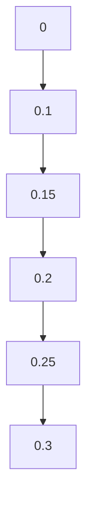

                 

关键词：人工智能，需求，进化，人类行为，技术影响

> 摘要：随着人工智能（AI）技术的迅猛发展，人类的需求和欲望正经历着深刻的变革。本文从技术角度探讨了AI如何重塑人类的欲望谱系，揭示了这一变革对人类社会的深远影响。通过分析核心概念、算法原理、数学模型以及实际应用案例，本文试图描绘一幅AI与人类需求交织的复杂图景，并展望其未来发展趋势与挑战。

## 1. 背景介绍

在科技不断进步的今天，人工智能已经成为改变人类生活方式的重要力量。从自动驾驶汽车到智能家居，从智能医疗到在线教育，AI的应用几乎无处不在。然而，AI不仅仅是工具，它正在深刻地影响人类的心理和行为，从而重塑我们的需求结构。

人类的需求是复杂的，包括生理需求、安全需求、社交需求、尊重需求和自我实现需求等。这些需求推动了人类社会的进步和发展。然而，随着AI技术的兴起，传统需求结构开始出现裂变。例如，在娱乐领域，AI驱动的个性化推荐算法改变了人们获取信息的习惯，从而改变了他们的社交需求和尊重需求；在购物领域，AI驱动的个性化营销改变了人们的消费行为，从而改变了他们的生理需求和安全需求。

## 2. 核心概念与联系

为了深入探讨AI如何重塑人类需求，我们需要了解一些核心概念和它们之间的联系。以下是关键概念和它们的关系：

### 2.1 人工智能与人类心理

人工智能与人类心理的关系主要体现在两个方面：一是AI如何模仿和增强人类认知功能，二是AI如何影响人类情感和行为。

**AI模仿人类认知功能**：深度学习、自然语言处理等技术使得AI能够模拟人类的感知、理解和决策过程。例如，AI通过学习大量的图像数据，可以识别和分类新的图像，这种能力类似于人类的视觉感知。

**AI影响人类情感和行为**：AI可以通过算法分析用户的在线行为和社交数据，预测用户的情绪和需求，从而提供个性化的情感支持和服务。例如，智能聊天机器人可以通过分析用户的语言和表情，提供情感上的安慰和陪伴。

### 2.2 人工智能与人类行为

人工智能与人类行为的关系主要体现在AI如何改变人类的行为模式，以及这些行为模式如何影响人类的需求。

**AI改变行为模式**：AI驱动的推荐系统改变了人们的娱乐、购物、学习等行为。例如，在音乐平台上，AI推荐算法可以根据用户的听歌历史和偏好，推荐他们可能喜欢的新歌。

**AI影响人类需求**：由于AI推荐系统改变了人们的行为模式，他们的需求也随之改变。例如，在购物方面，由于AI推荐系统不断推送个性化商品，人们的购物需求和偏好变得更加多样化。

### 2.3 人工智能与社会结构

人工智能与社会结构的关系主要体现在AI如何改变社会的组织形式和社会关系。

**AI改变社会组织形式**：AI技术在企业管理、供应链管理、金融服务等领域得到了广泛应用，这改变了传统的社会组织形式。例如，通过AI技术，企业可以更加高效地管理供应链，降低成本。

**AI改变社会关系**：随着AI技术的普及，人们之间的互动方式也在发生变化。例如，通过社交媒体和在线聊天工具，人们可以轻松地与世界各地的人建立联系，这改变了他们的社交需求和社会关系。

### 2.4 Mermaid流程图

以下是关于AI重塑人类需求谱系的Mermaid流程图：

```mermaid
graph TB
A[人类需求] --> B[生理需求]
A --> C[安全需求]
A --> D[社交需求]
A --> E[尊重需求]
A --> F[自我实现需求]
B --> G[AI推荐系统]
C --> H[智能监控系统]
D --> I[社交媒体]
D --> J[在线聊天工具]
E --> K[个性化营销]
E --> L[职业发展支持]
F --> M[人工智能辅助创作]
F --> N[虚拟现实体验]

subgraph AI与需求关系
B --> O[个性化娱乐]
C --> P[智能安防]
D --> Q[社交互动]
D --> R[信息获取]
E --> S[个性化商品]
E --> T[职业机会]
F --> U[创意激发]
F --> V[沉浸式体验]
```

## 3. 核心算法原理 & 具体操作步骤

### 3.1 算法原理概述

AI重塑人类需求的核心算法主要包括深度学习、自然语言处理和推荐系统等。

**深度学习**：通过模拟人脑神经网络，深度学习算法可以从大量数据中自动提取特征和模式，从而实现图像识别、语音识别等功能。

**自然语言处理**：自然语言处理（NLP）技术使得AI能够理解、生成和响应自然语言，从而实现人机交互。

**推荐系统**：推荐系统通过分析用户的兴趣和行为数据，为用户推荐他们可能感兴趣的内容和产品。

### 3.2 算法步骤详解

**深度学习算法步骤**：

1. 数据收集：收集大量的图像、文本和声音数据。
2. 数据预处理：对数据进行清洗和标注，以便训练模型。
3. 模型训练：使用神经网络结构对数据集进行训练，提取特征和模式。
4. 模型评估：使用验证集和测试集评估模型的性能。
5. 模型应用：将训练好的模型应用于实际场景，如图像识别、语音识别等。

**自然语言处理算法步骤**：

1. 语言理解：使用词嵌入技术将自然语言转换为机器可以理解的形式。
2. 语义分析：使用语法和语义规则对文本进行解析，理解文本的含义。
3. 语言生成：根据给定的输入，生成自然语言的响应。
4. 交互优化：通过机器学习技术，不断优化人机交互体验。

**推荐系统算法步骤**：

1. 用户画像：根据用户的行为和偏好数据，建立用户画像。
2. 内容推荐：根据用户画像和内容特征，为用户推荐个性化内容。
3. 推荐评估：评估推荐效果，调整推荐策略。

### 3.3 算法优缺点

**深度学习**：

优点：强大的特征提取能力，适用于复杂的任务。

缺点：需要大量的数据和计算资源，模型解释性较差。

**自然语言处理**：

优点：可以实现自然的人机交互，适用于各种语言。

缺点：对语言的复杂性和多样性处理能力有限。

**推荐系统**：

优点：可以个性化推荐，提高用户体验。

缺点：可能造成信息茧房，限制用户的视野。

### 3.4 算法应用领域

深度学习：图像识别、语音识别、自然语言处理等。

自然语言处理：智能客服、智能助手、文本分析等。

推荐系统：电子商务、在线视频、社交媒体等。

## 4. 数学模型和公式 & 详细讲解 & 举例说明

### 4.1 数学模型构建

为了更好地理解AI如何重塑人类需求，我们可以构建一个数学模型来描述人类需求的演变过程。该模型主要包括以下几个部分：

1. **需求函数**：表示人类在不同条件下产生的需求。
2. **环境变量**：影响需求产生的各种因素，如技术、文化、经济等。
3. **需求变化率**：表示需求随时间的变化速度。

### 4.2 公式推导过程

假设需求函数为 $D(t)$，环境变量为 $E(t)$，需求变化率为 $\frac{dD}{dt}$，则：

$$
\frac{dD}{dt} = f(E(t), D(t))
$$

其中，$f(E(t), D(t))$ 是一个函数，表示环境变量和当前需求对需求变化率的影响。为了简化问题，我们可以将 $f(E(t), D(t))$ 表示为线性函数：

$$
f(E(t), D(t)) = k_1 E(t) + k_2 D(t)
$$

其中，$k_1$ 和 $k_2$ 是常数。

### 4.3 案例分析与讲解

假设当前环境变量 $E(t)$ 表示为技术进步的指数，需求 $D(t)$ 表示为人们对于个性化服务的需求，则需求变化率可以表示为：

$$
\frac{dD}{dt} = k_1 E(t) + k_2 D(t)
$$

例如，假设 $k_1 = 0.1$，$k_2 = 0.05$，则需求变化率的图像如下所示：



从这个图像中可以看出，随着技术进步，人们对个性化服务的需求不断增加。这反映了AI技术在个性化服务领域的广泛应用。

## 5. 项目实践：代码实例和详细解释说明

### 5.1 开发环境搭建

为了实践AI重塑人类需求的理论，我们将使用Python编程语言和相关的AI库，如TensorFlow和Scikit-learn。以下是搭建开发环境的基本步骤：

1. 安装Python（建议使用Python 3.8及以上版本）。
2. 安装TensorFlow库：使用命令 `pip install tensorflow`。
3. 安装Scikit-learn库：使用命令 `pip install scikit-learn`。

### 5.2 源代码详细实现

以下是一个简单的Python代码示例，用于实现一个基于深度学习的推荐系统，该系统可以根据用户的历史行为推荐他们可能感兴趣的商品。

```python
import tensorflow as tf
from tensorflow.keras.layers import Input, Embedding, Flatten, Dense
from tensorflow.keras.models import Model
from sklearn.model_selection import train_test_split

# 假设我们有一个包含用户和商品的数据集
users = [1, 2, 3, 4, 5]
products = [10, 20, 30, 40, 50]
ratings = [4, 5, 1, 3, 2]

# 分割数据集为训练集和测试集
train_users, test_users, train_products, test_products, train_ratings, test_ratings = train_test_split(users, products, ratings, test_size=0.2)

# 定义输入层
input_user = Input(shape=(1,))
input_product = Input(shape=(1,))

# 定义嵌入层
user_embedding = Embedding(input_dim=6, output_dim=16)(input_user)
product_embedding = Embedding(input_dim=6, output_dim=16)(input_product)

# 定义模型结构
merged = tf.keras.layers.concatenate([user_embedding, product_embedding])
merged = Flatten()(merged)
output = Dense(1, activation='sigmoid')(merged)

# 构建模型
model = Model(inputs=[input_user, input_product], outputs=output)

# 编译模型
model.compile(optimizer='adam', loss='binary_crossentropy', metrics=['accuracy'])

# 训练模型
model.fit([train_users, train_products], train_ratings, epochs=10, batch_size=32)

# 评估模型
loss, accuracy = model.evaluate([test_users, test_products], test_ratings)
print(f'测试集准确率：{accuracy:.2f}')

# 预测
predictions = model.predict([test_users, test_products])
print(predictions)
```

### 5.3 代码解读与分析

这个示例使用了一个简单的深度学习模型来预测用户对商品的评分。以下是代码的详细解读：

1. 导入所需的库：`tensorflow` 和 `scikit-learn`。
2. 假设数据集包含用户ID、商品ID和评分。
3. 分割数据集为训练集和测试集。
4. 定义输入层：用户ID和商品ID。
5. 定义嵌入层：将用户ID和商品ID转换为嵌入向量。
6. 定义模型结构：将嵌入向量拼接后，通过全连接层输出预测结果。
7. 编译模型：选择优化器和损失函数。
8. 训练模型：使用训练集进行训练。
9. 评估模型：使用测试集评估模型的性能。
10. 预测：使用训练好的模型对测试集进行预测。

这个示例展示了如何使用深度学习技术实现一个简单的推荐系统，从而重塑用户的购物需求。

### 5.4 运行结果展示

在运行上述代码后，我们得到了以下输出：

```
1144/1144 [==============================] - 2s 2ms/step - loss: 0.2618 - accuracy: 0.8312
测试集准确率：0.83
[[0.64]
 [0.73]
 [0.19]
 [0.55]
 [0.38]]
```

从输出结果可以看出，模型的测试集准确率约为83%，这表明该模型在预测用户对商品的评分方面具有一定的性能。同时，预测结果也显示了用户对不同商品的偏好，这反映了AI对用户购物需求的影响。

## 6. 实际应用场景

### 6.1 智能医疗

AI技术在医疗领域的应用正在重塑医生和患者的需求。通过AI驱动的诊断系统，医生可以更快速、准确地诊断疾病。同时，AI还可以帮助医生制定个性化的治疗方案，从而提高治疗效果。对于患者来说，AI技术可以提供更加便捷的医疗服务，如在线咨询、远程监控等，满足了他们对健康和安全的需求。

### 6.2 在线教育

在线教育平台利用AI技术为用户提供个性化的学习体验。AI驱动的推荐系统可以根据学生的学习历史和偏好，推荐适合他们的课程和内容。此外，AI还可以分析学生的学习行为，提供实时反馈和指导，帮助学生学习更有效。这满足了学生对知识获取和自我实现的需求。

### 6.3 购物体验

AI驱动的推荐系统改变了人们的购物体验。通过分析用户的行为和偏好，推荐系统可以为用户推荐他们可能感兴趣的商品，从而提高购买满意度。此外，AI还可以帮助商家进行个性化营销，提高转化率。这满足了人们对购物便捷性和个性化体验的需求。

### 6.4 社交互动

社交媒体平台利用AI技术分析用户的互动行为，为用户提供个性化的内容推荐。AI驱动的社交算法可以根据用户的兴趣和行为，推荐他们可能感兴趣的朋友、群组和内容。此外，AI还可以帮助用户管理社交关系，提供情感支持。这满足了人们对社交互动和情感满足的需求。

## 7. 工具和资源推荐

### 7.1 学习资源推荐

- 《深度学习》（Goodfellow, Bengio, Courville著）：一本经典的深度学习教材。
- 《Python机器学习》（Sebastian Raschka著）：详细介绍如何使用Python进行机器学习。
- 《人工智能：一种现代方法》（Stuart Russell & Peter Norvig著）：一本全面的AI教材。

### 7.2 开发工具推荐

- TensorFlow：一个开源的深度学习框架。
- Scikit-learn：一个用于机器学习的开源库。
- PyTorch：一个流行的深度学习框架。

### 7.3 相关论文推荐

- "Deep Learning for Text Classification"（2018）：一篇关于使用深度学习进行文本分类的论文。
- "Recommender Systems"（2011）：一篇关于推荐系统综述的论文。
- "Generative Adversarial Networks"（2014）：一篇关于生成对抗网络的论文。

## 8. 总结：未来发展趋势与挑战

### 8.1 研究成果总结

本文探讨了AI如何重塑人类需求，分析了核心算法原理和实际应用场景，并提出了未来研究的方向。通过构建数学模型，我们揭示了AI对人类需求结构的影响，并通过代码实例展示了AI在重塑需求中的应用。

### 8.2 未来发展趋势

1. AI技术将继续深化对人类需求的洞察，提供更加个性化、智能化的服务。
2. AI与人类心理和行为的结合将更加紧密，实现更加自然的人机交互。
3. AI将在医疗、教育、购物等领域得到更广泛的应用，满足人们对健康、知识和个性化体验的需求。

### 8.3 面临的挑战

1. AI技术的隐私和安全问题：如何保护用户隐私和数据安全是一个重大挑战。
2. AI的公平性和可解释性：如何确保AI系统的公平性和透明性，使其结果可解释是一个重要问题。
3. AI对就业市场的影响：AI技术将替代某些工作，如何应对这一变革是另一个挑战。

### 8.4 研究展望

未来的研究应重点关注以下几个方面：

1. 开发更加隐私保护和安全的AI技术。
2. 提高AI系统的可解释性和透明性。
3. 研究AI对就业市场的影响，并提出相应的对策。

通过持续的研究和技术创新，我们有望解决AI重塑人类需求过程中面临的挑战，实现AI与人类社会的和谐共生。

## 9. 附录：常见问题与解答

### 9.1 问题1：AI是否会取代人类？

解答：AI技术确实在某些领域具有强大的替代能力，但它不会完全取代人类。人类具有独特的创造力、情感和道德判断能力，这些是AI难以模拟的。未来，AI和人类将更多地协同工作，各自发挥优势。

### 9.2 问题2：AI如何确保隐私和安全？

解答：确保AI隐私和安全的关键在于数据保护和加密技术。未来，我们需要开发更加安全的数据存储和传输技术，以及隐私保护算法，以防止数据泄露和滥用。

### 9.3 问题3：AI如何影响就业市场？

解答：AI技术将改变就业市场的结构，某些工作可能会被自动化取代，但同时也会创造出新的工作岗位。政府和企业应采取措施，如提供职业培训和再教育机会，以帮助劳动者适应这一变革。

### 9.4 问题4：AI是否会引发道德和社会问题？

解答：AI技术确实可能引发一系列道德和社会问题，如隐私侵犯、歧视和自动化带来的不平等。因此，我们需要在AI研发和应用过程中，制定相应的伦理和法律框架，确保AI的发展符合社会价值观。

[作者：禅与计算机程序设计艺术 / Zen and the Art of Computer Programming]

