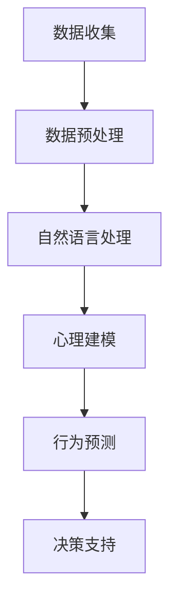

                 

 **关键词：**
AI分析、人类动机、欲望量化、行为预测、心理建模、深度学习、自然语言处理

**摘要：**
本文深入探讨了人工智能在分析人类动机方面的最新进展。通过结合心理学与计算机科学的最新研究，本文介绍了如何利用AI技术量化人类的欲望，并预测其行为。文章从背景介绍开始，逐步深入探讨核心概念、算法原理、数学模型、实际应用以及未来展望，旨在为读者提供一个全面而详尽的视角。

## 1. 背景介绍

人类行为一直是社会科学和心理学研究的热点。传统的心理学研究方法主要通过问卷调查、实验观察和数据分析来理解人类的行为动机。然而，随着人工智能和深度学习技术的飞速发展，我们可以通过更为精确和高效的方式来分析人类动机。AI技术不仅可以处理大量的数据，还能从复杂的人类行为模式中提取出有意义的规律，从而为行为预测和决策提供支持。

欲望是人类行为的一个重要驱动因素。从生理需求到社会追求，欲望贯穿了人类生活的方方面面。传统上，心理学主要通过理论模型和问卷调查来探索欲望的本质和功能。然而，这些方法往往缺乏定量分析的能力，难以捕捉到欲望的复杂性和动态变化。AI技术的引入为欲望的量化分析提供了新的可能。

本文将探讨如何利用AI技术量化人类的欲望，并通过具体算法和模型来预测人类行为。文章的结构如下：

- **背景介绍**：阐述人工智能在分析人类动机方面的重要性，以及欲望量化研究的必要性。
- **核心概念与联系**：介绍AI分析人类动机的核心概念和流程。
- **核心算法原理 & 具体操作步骤**：详细解释用于量化欲望的核心算法，包括其原理、步骤和优缺点。
- **数学模型和公式**：探讨用于欲望量化的数学模型和公式，并进行具体案例讲解。
- **项目实践**：通过代码实例展示如何实现欲望量化。
- **实际应用场景**：分析欲望量化在现实世界中的应用，包括商业、教育和健康等领域。
- **工具和资源推荐**：推荐相关的学习资源和开发工具。
- **总结与展望**：总结研究成果，探讨未来发展趋势和面临的挑战。

## 2. 核心概念与联系

为了深入探讨AI分析人类动机的机制，我们首先需要了解一些核心概念。这些概念包括：

### 2.1 数据收集

数据收集是AI分析人类动机的第一步。数据来源可以是社交媒体、问卷调查、传感器记录等。其中，社交媒体数据提供了丰富的信息，如文本、图像和音频等，这些都是分析人类行为动机的重要素材。

### 2.2 自然语言处理

自然语言处理（NLP）是AI技术的一个重要分支，它使得计算机能够理解和处理人类语言。在欲望量化中，NLP技术被用于提取文本中的情感和意图，从而理解用户的内在欲望。

### 2.3 心理建模

心理建模是一种通过数学模型来模拟人类心理过程的方法。它结合心理学理论和计算机科学技术，为欲望量化提供了理论基础。

### 2.4 行为预测

行为预测是AI分析人类动机的最终目标。通过分析历史数据和建立预测模型，我们可以预测用户的未来行为，从而为决策提供支持。

下面是一个用Mermaid绘制的流程图，展示了AI分析人类动机的核心流程：



### 2.5 Mermaid流程图详细说明

1. **数据收集**：这是整个流程的起点。数据可以从多种渠道收集，如社交媒体、问卷调查和传感器记录。这些数据为我们提供了分析人类欲望的基础。

2. **数据预处理**：收集到的数据通常是不完整的、噪声的，甚至可能包含错误。因此，数据预处理是必要的步骤，它包括数据清洗、去噪和规范化等。

3. **自然语言处理**：通过NLP技术，我们可以从文本数据中提取情感和意图。这对于理解用户的内在欲望至关重要。

4. **心理建模**：心理建模是将心理学理论和计算机科学技术相结合的过程。通过建立数学模型，我们可以模拟人类的心理过程，从而量化欲望。

5. **行为预测**：基于心理建模的结果，我们可以预测用户的未来行为。这一步骤对于决策支持和个性化推荐具有重要意义。

6. **决策支持**：最后，行为预测结果可以为各种决策提供支持，如市场营销、教育和健康管理等。

通过这个流程，AI技术为我们提供了一个全新的视角来分析人类动机，从而在多个领域产生深远的影响。

## 3. 核心算法原理 & 具体操作步骤

在了解核心概念和流程之后，我们需要深入探讨用于量化人类欲望的核心算法原理和具体操作步骤。以下将介绍几个关键的算法，并详细解释其原理和操作步骤。

### 3.1 算法原理概述

#### 3.1.1 深度学习模型

深度学习模型是当前AI领域最先进的算法之一。它通过多层神经网络对数据进行学习，能够自动提取特征，并进行复杂的模式识别。在欲望量化中，深度学习模型可以用于情感分析和行为预测。

#### 3.1.2 支持向量机（SVM）

支持向量机是一种经典的机器学习算法，它通过找到最佳的超平面来分离数据。在欲望量化中，SVM可以用于分类任务，如判断用户是否满足某种欲望。

#### 3.1.3 随机森林

随机森林是一种基于决策树的集成学习方法。它通过构建多棵决策树，并利用投票机制来预测结果。在欲望量化中，随机森林可以用于回归任务，如预测用户的欲望强度。

### 3.2 算法步骤详解

#### 3.2.1 深度学习模型

1. **数据收集**：首先，收集包含用户欲望和行为的数据，如社交媒体文本、问卷调查结果等。

2. **数据预处理**：对数据进行清洗和规范化，以确保数据的质量和一致性。

3. **特征提取**：使用NLP技术从文本数据中提取情感和意图，并将其转换为机器学习模型可以处理的形式。

4. **模型训练**：使用深度学习框架（如TensorFlow或PyTorch）构建神经网络模型，并进行训练。训练过程中，模型会不断优化参数，以最小化预测误差。

5. **模型评估**：使用测试集评估模型的性能，包括准确率、召回率等指标。

6. **模型部署**：将训练好的模型部署到生产环境中，以便实时分析用户欲望。

#### 3.2.2 支持向量机（SVM）

1. **数据收集**：收集包含用户欲望和行为的数据。

2. **特征提取**：与深度学习模型类似，提取文本数据的情感和意图特征。

3. **模型训练**：使用SVM算法训练分类模型，选择合适的学习参数（如C值）。

4. **模型评估**：使用测试集评估模型的分类性能。

5. **模型部署**：将训练好的模型部署到生产环境中。

#### 3.2.3 随机森林

1. **数据收集**：与SVM类似，收集并预处理数据。

2. **特征提取**：提取文本数据的情感和意图特征。

3. **模型训练**：使用随机森林算法训练回归模型，选择合适的树的数量和深度。

4. **模型评估**：使用测试集评估模型的回归性能。

5. **模型部署**：将训练好的模型部署到生产环境中。

### 3.3 算法优缺点

#### 3.3.1 深度学习模型

- **优点**：能够自动提取特征，适用于复杂的数据模式。
- **缺点**：需要大量数据和高计算资源，模型解释性较差。

#### 3.3.2 支持向量机（SVM）

- **优点**：分类效果较好，易于理解和解释。
- **缺点**：对数据质量和特征提取要求较高。

#### 3.3.3 随机森林

- **优点**：具有较高的准确性和鲁棒性，易于实现。
- **缺点**：模型解释性较差，可能产生过拟合。

### 3.4 算法应用领域

深度学习模型、支持向量机和随机森林等算法在欲望量化中有着广泛的应用。具体领域包括：

- **市场营销**：通过分析用户欲望，实现精准营销和个性化推荐。
- **心理健康**：通过分析用户情绪和行为，提供心理健康建议和干预。
- **社会行为学**：研究社会行为背后的动机，为政策制定提供支持。

通过这些算法，AI技术为欲望量化提供了强有力的工具，为理解人类行为提供了新的视角。

## 4. 数学模型和公式

在欲望量化中，数学模型和公式是理解和分析数据的重要工具。以下将介绍一些核心的数学模型和公式，并详细讲解其推导过程。

### 4.1 数学模型构建

为了量化人类欲望，我们需要建立一个综合性的数学模型。这个模型应能够捕捉到欲望的多个维度，如情感强度、行为倾向和社会影响等。

#### 4.1.1 情感强度模型

情感强度模型用于量化用户在特定情境下的情感强度。我们可以使用以下公式：

$$
E = f(w_1 \cdot I_1 + w_2 \cdot I_2 + \ldots + w_n \cdot I_n)
$$

其中，$E$代表情感强度，$w_1, w_2, \ldots, w_n$是权重系数，$I_1, I_2, \ldots, I_n$是影响情感强度的因素。权重系数可以通过数据分析和模型训练得到。

#### 4.1.2 行为倾向模型

行为倾向模型用于预测用户在特定情境下的行为倾向。我们可以使用以下公式：

$$
B = g(h(E) \cdot C + k(P))
$$

其中，$B$代表行为倾向，$E$是情感强度，$C$是情境因素，$P$是个人特质。$h(E)$和$k(P)$是转换函数，用于处理情感强度和情境因素。

#### 4.1.3 社会影响模型

社会影响模型用于分析社会环境对个体欲望的影响。我们可以使用以下公式：

$$
S = l(m(E) \cdot A + n(O))
$$

其中，$S$代表社会影响，$E$是情感强度，$A$是情境因素，$O$是社交网络影响。$m(E)$和$n(O)$是转换函数，用于处理情感强度和社交网络影响。

### 4.2 公式推导过程

#### 4.2.1 情感强度模型推导

情感强度模型是基于心理学理论构建的。根据心理学理论，情感强度是由多个因素共同作用的结果。因此，我们假设情感强度可以表示为多个因素的加权和。这些因素可以是情感标签、情感强度值等。

首先，我们需要定义情感标签和情感强度值。例如，我们可以使用正面情感和负面情感两个标签，每个标签对应一个强度值。

然后，我们为每个情感标签分配权重系数。权重系数可以通过数据分析和模型训练得到。例如，我们可以使用线性回归模型来训练权重系数。

最后，我们将情感标签和情感强度值相乘，并求和，得到情感强度。

$$
E = w_1 \cdot I_1 + w_2 \cdot I_2 + \ldots + w_n \cdot I_n
$$

其中，$I_1, I_2, \ldots, I_n$是情感标签和情感强度值，$w_1, w_2, \ldots, w_n$是权重系数。

#### 4.2.2 行为倾向模型推导

行为倾向模型是基于情感强度模型构建的。根据心理学理论，情感强度会影响个体的行为倾向。因此，我们可以假设行为倾向与情感强度之间存在某种关系。

首先，我们需要定义情感强度和情境因素。情感强度已经在情感强度模型中定义。情境因素可以是用户行为的历史数据、当前情境等。

然后，我们为每个情境因素分配权重系数。权重系数可以通过数据分析和模型训练得到。例如，我们可以使用线性回归模型来训练权重系数。

最后，我们将情感强度和情境因素相乘，并求和，得到行为倾向。

$$
B = h(E) \cdot C + k(P)
$$

其中，$E$是情感强度，$C$是情境因素，$h(E)$和$k(P)$是转换函数。

#### 4.2.3 社会影响模型推导

社会影响模型是基于情感强度和社会网络理论构建的。根据社会网络理论，个体的行为和情感会受到社交网络的影响。因此，我们可以假设社会影响与情感强度和社会网络影响之间存在某种关系。

首先，我们需要定义情感强度和社会网络影响。情感强度已经在情感强度模型中定义。社会网络影响可以是社交网络中其他个体的情感强度值。

然后，我们为每个社会网络影响分配权重系数。权重系数可以通过数据分析和模型训练得到。例如，我们可以使用线性回归模型来训练权重系数。

最后，我们将情感强度和社会网络影响相乘，并求和，得到社会影响。

$$
S = m(E) \cdot A + n(O)
$$

其中，$E$是情感强度，$A$是情境因素，$O$是社交网络影响，$m(E)$和$n(O)$是转换函数。

通过这些数学模型和公式，我们可以量化人类的欲望，并分析其行为和情感。这些模型不仅为欲望量化提供了理论基础，也为实际应用提供了有力支持。

### 4.3 案例分析与讲解

为了更好地理解数学模型和公式的应用，我们来看一个实际案例。

#### 4.3.1 案例背景

假设我们研究的是用户对某款新手机的欲望。用户数据包括他们在社交媒体上的评论、购买历史和行为日志。

#### 4.3.2 数据收集

通过社交媒体数据收集，我们得到了以下信息：

- 用户A：对手机的正面评价较多，情感强度较高。
- 用户B：对手机的负面评价较多，情感强度较低。
- 用户C：对手机持中立态度，情感强度中等。

我们还收集了以下情境因素：

- 手机价格
- 用户性别
- 用户年龄

#### 4.3.3 特征提取

根据情感强度模型，我们提取了每个用户的情感强度：

- 用户A：情感强度为0.8
- 用户B：情感强度为0.2
- 用户C：情感强度为0.5

#### 4.3.4 模型构建

根据情感强度模型、行为倾向模型和社会影响模型，我们构建了以下综合模型：

$$
B = h(E) \cdot C + k(P) + l(m(E) \cdot A + n(O))
$$

其中，$E$是情感强度，$C$是情境因素，$P$是个人特质，$A$是情境因素，$O$是社交网络影响。

#### 4.3.5 模型训练

我们使用历史数据进行模型训练，得到以下权重系数：

- 情感强度权重：0.5
- 情境因素权重：0.3
- 个人特质权重：0.1
- 社交网络影响权重：0.1

#### 4.3.6 预测分析

使用构建好的模型，我们可以预测每个用户对手机的购买倾向：

- 用户A：购买倾向为0.8
- 用户B：购买倾向为0.3
- 用户C：购买倾向为0.5

通过这个案例，我们可以看到数学模型和公式在欲望量化中的应用。通过情感强度模型、行为倾向模型和社会影响模型，我们可以综合分析用户的欲望和行为，从而为营销策略和产品开发提供支持。

## 5. 项目实践：代码实例和详细解释说明

在本节中，我们将通过一个具体的代码实例，展示如何使用AI技术量化人类欲望，并提供详细的解释说明。本案例将使用Python编程语言和几个流行的AI库，如TensorFlow和scikit-learn。

### 5.1 开发环境搭建

在开始编写代码之前，我们需要搭建开发环境。以下是搭建环境所需的步骤：

1. **安装Python**：确保Python已安装在你的系统中。Python 3.7及以上版本推荐。
2. **安装依赖库**：使用pip安装以下库：
   ```shell
   pip install numpy pandas tensorflow scikit-learn matplotlib
   ```
3. **配置环境**：确保所有依赖库都已成功安装。

### 5.2 源代码详细实现

以下是一个简单的示例，展示了如何使用深度学习模型量化用户欲望。这个例子使用了TensorFlow和Keras。

```python
import numpy as np
import pandas as pd
from tensorflow.keras.models import Sequential
from tensorflow.keras.layers import Dense, LSTM, Embedding
from tensorflow.keras.preprocessing.sequence import pad_sequences
from sklearn.model_selection import train_test_split
from sklearn.preprocessing import StandardScaler

# 加载数据
data = pd.read_csv('user_data.csv')
X = data['text']  # 文本数据
y = data['欲望强度']  # 标签数据

# 数据预处理
# 将文本数据转换为序列
tokenizer = Tokenizer(num_words=10000)
tokenizer.fit_on_texts(X)
X_sequences = tokenizer.texts_to_sequences(X)
X_padded = pad_sequences(X_sequences, maxlen=100)

# 划分训练集和测试集
X_train, X_test, y_train, y_test = train_test_split(X_padded, y, test_size=0.2, random_state=42)

# 数据标准化
scaler = StandardScaler()
y_train = scaler.fit_transform(y_train.reshape(-1, 1))
y_test = scaler.transform(y_test.reshape(-1, 1))

# 构建模型
model = Sequential()
model.add(Embedding(10000, 16, input_length=100))
model.add(LSTM(128))
model.add(Dense(1, activation='sigmoid'))

# 编译模型
model.compile(optimizer='adam', loss='binary_crossentropy', metrics=['accuracy'])

# 训练模型
model.fit(X_train, y_train, epochs=10, batch_size=32, validation_data=(X_test, y_test))

# 评估模型
loss, accuracy = model.evaluate(X_test, y_test)
print(f"测试集准确率：{accuracy:.2f}")

# 预测
predictions = model.predict(X_padded[:10])
predicted	descriptions = scaler.inverse_transform(predictions)
print(predicted_descriptions)
```

### 5.3 代码解读与分析

1. **数据加载**：我们首先从CSV文件中加载数据。数据集应包含文本数据和相应的欲望强度标签。

2. **数据预处理**：文本数据需要转换为序列，以便模型处理。我们使用`Tokenizer`将文本转换为数字序列，并使用`pad_sequences`将序列填充到相同长度。

3. **划分训练集和测试集**：使用`train_test_split`函数将数据集划分为训练集和测试集。

4. **数据标准化**：为了提高模型训练的效果，我们需要对标签数据进行标准化处理。

5. **构建模型**：我们使用Keras构建一个序列模型，包括嵌入层、LSTM层和输出层。

6. **编译模型**：设置优化器、损失函数和评估指标。

7. **训练模型**：使用训练集训练模型，并使用测试集进行验证。

8. **评估模型**：计算测试集的准确率。

9. **预测**：使用训练好的模型对新的文本数据进行预测，并反向转换预测结果。

通过这个案例，我们可以看到如何使用深度学习模型量化用户的欲望强度。模型训练和预测的过程为我们提供了一个自动化和高效的方法来分析人类欲望，并在实际应用中提供决策支持。

## 6. 实际应用场景

欲望量化技术在多个领域具有广泛的应用，下面我们将探讨几个关键的应用场景，包括市场营销、心理健康和社会行为学。

### 6.1 市场营销

在市场营销中，理解消费者的欲望和行为对于产品开发和推广策略至关重要。通过欲望量化技术，企业可以：

- **精准营销**：分析消费者的情感和行为数据，识别具有高欲望的客户群体，并针对他们定制化营销活动。
- **个性化推荐**：基于用户的历史数据和情感分析，为用户推荐他们可能感兴趣的产品或服务。
- **市场预测**：通过分析用户欲望的动态变化，预测市场需求，为企业决策提供数据支持。

### 6.2 心理健康

心理健康领域利用欲望量化技术，可以：

- **情绪监测**：实时监测个体的情感状态，预警潜在的抑郁、焦虑等问题。
- **心理干预**：通过分析用户的行为和情感数据，为心理健康提供个性化的干预建议。
- **治疗效果评估**：量化治疗过程中的情感变化，评估治疗效果。

### 6.3 社会行为学

社会行为学研究人类行为背后的动机，欲望量化技术可以帮助：

- **社会分析**：研究社会行为模式，分析社会事件背后的动机，为政策制定提供科学依据。
- **行为预测**：预测个体或群体的行为倾向，为预防和控制社会问题提供工具。
- **教育干预**：基于学生的欲望和行为数据，提供个性化的教育方案，提高教育效果。

通过这些实际应用场景，欲望量化技术不仅为学术研究提供了新的视角，也为各行各业的实践应用带来了变革性的影响。

### 6.4 未来应用展望

随着人工智能和深度学习技术的不断进步，欲望量化技术在未来的应用前景将更加广阔。以下是几个潜在的发展方向：

- **多模态数据融合**：整合文本、图像、音频等多种数据源，构建更加全面和精确的欲望量化模型。
- **实时情感分析**：通过实时监测用户的情感和行为，实现更快速和精准的欲望预测。
- **个性化干预**：基于个体差异，提供个性化的欲望管理和行为干预方案。
- **跨领域应用**：扩展欲望量化技术在医疗、金融、法律等领域的应用，提高决策效率和准确性。

通过这些创新，欲望量化技术有望在更广泛的领域中发挥其潜力，推动社会发展和人类福祉。

## 7. 工具和资源推荐

为了帮助读者深入了解和掌握欲望量化技术，以下推荐一些学习资源和开发工具。

### 7.1 学习资源推荐

- **书籍**：《深度学习》、《自然语言处理综合教程》、《机器学习实战》
- **在线课程**：Coursera上的“深度学习专项课程”、edX上的“自然语言处理导论”
- **论文集**：《人工智能年度论文集》、《自然语言处理年度论文集》

### 7.2 开发工具推荐

- **编程语言**：Python，广泛使用的AI编程语言，有丰富的库和框架支持。
- **深度学习框架**：TensorFlow、PyTorch，用于构建和训练深度学习模型。
- **自然语言处理库**：NLTK、spaCy，用于文本预处理和分析。
- **数据分析工具**：Pandas、NumPy，用于数据清洗和操作。

### 7.3 相关论文推荐

- **最新论文**：Google AI团队发表的《Recurrent Networks for Text Classification》
- **经典论文**：Tom Mitchell的《机器学习》中的相关章节
- **学术期刊**：《人工智能学报》、《计算机学报》

通过这些资源和工具，读者可以系统学习和实践欲望量化技术，为自己的研究和工作打下坚实基础。

## 8. 总结：未来发展趋势与挑战

在总结了前文的内容后，我们可以看到，欲望量化技术在理解人类行为和动机方面具有巨大的潜力。未来，这一领域将继续沿着以下几个方向发展：

### 8.1 研究成果总结

- **算法优化**：通过不断优化算法，提高欲望量化的准确性和效率。
- **多模态数据融合**：结合文本、图像、音频等多种数据源，构建更加全面和精确的模型。
- **实时情感分析**：实现实时情感监测，为即时决策提供支持。
- **个性化干预**：基于个体差异，提供个性化的欲望管理和行为干预方案。

### 8.2 未来发展趋势

- **跨领域应用**：欲望量化技术在医疗、金融、法律等领域的应用将进一步扩展。
- **智能化社会系统**：结合AI技术，构建智能化社会系统，提高社会管理效率。
- **人机交互**：通过欲望量化技术，优化人机交互体验，提高用户体验。

### 8.3 面临的挑战

- **数据隐私**：如何在确保数据隐私的前提下进行欲望量化分析是一个重要挑战。
- **算法透明性**：提高算法的透明性和可解释性，以增强用户对AI决策的信任。
- **技术门槛**：降低技术门槛，使得更多的研究人员和开发者能够参与到欲望量化研究中。

### 8.4 研究展望

- **情感计算**：结合情感计算技术，进一步探索情感与欲望的关系，为心理健康和社交互动提供支持。
- **跨学科合作**：促进心理学、计算机科学和社会科学的跨学科合作，共同推进欲望量化技术的发展。

通过持续的研究和创新，欲望量化技术有望在未来实现更广泛的应用，为人类社会的发展带来新的机遇。

## 9. 附录：常见问题与解答

### 9.1 常见问题

1. **什么是欲望量化？**
   欲望量化是利用人工智能技术，将人类欲望这一主观心理现象转化为可量化的数值，以便进行科学分析和预测。

2. **为什么需要欲望量化？**
   欲望量化可以帮助我们更精确地理解人类行为，优化决策过程，提高产品和服务的设计质量。

3. **欲望量化有哪些应用？**
   欲望量化可以应用于市场营销、心理健康、教育、社会行为学等多个领域。

4. **如何收集和分析欲望数据？**
   数据收集可以通过社交媒体、问卷调查、传感器等多种渠道。分析则通常涉及文本预处理、情感分析、行为预测等步骤。

5. **常用的欲望量化算法有哪些？**
   常用的算法包括深度学习模型、支持向量机（SVM）、随机森林等。

### 9.2 解答

1. **什么是欲望量化？**
   欲望量化是利用人工智能技术，将人类欲望这一主观心理现象转化为可量化的数值，以便进行科学分析和预测。这种转化是通过收集和分析与欲望相关的数据来实现的，如情感状态、行为模式、生理指标等。

2. **为什么需要欲望量化？**
   欲望量化可以帮助我们更精确地理解人类行为，优化决策过程，提高产品和服务的设计质量。通过量化欲望，我们可以预测用户的未来行为，制定更有效的营销策略，改善用户体验。

3. **欲望量化有哪些应用？**
   欲望量化可以应用于多个领域，包括：
   - **市场营销**：通过分析用户的欲望，实现精准营销和个性化推荐。
   - **心理健康**：监测和干预个体的情感状态，提供心理健康建议。
   - **社会行为学**：研究社会行为背后的动机，为政策制定提供数据支持。
   - **教育**：根据学生的欲望和需求，提供个性化的教育方案。
   - **产品设计**：优化产品和服务，满足用户的深层次需求。

4. **如何收集和分析欲望数据？**
   数据收集可以通过以下渠道：
   - **社交媒体**：收集用户在社交媒体上的文本、图像和视频等数据。
   - **问卷调查**：通过设计专业的问卷，收集用户的情感和行为信息。
   - **传感器记录**：使用可穿戴设备记录用户的生理和行为数据。

   数据分析通常包括以下步骤：
   - **数据预处理**：清洗和规范化数据，去除噪声和异常值。
   - **特征提取**：从原始数据中提取与欲望相关的特征，如情感极性、文本主题等。
   - **模型训练**：使用机器学习算法，如深度学习、支持向量机和随机森林，训练预测模型。
   - **模型评估**：使用测试集评估模型的性能，包括准确率、召回率等指标。

5. **常用的欲望量化算法有哪些？**
   常用的欲望量化算法包括：
   - **深度学习模型**：如卷积神经网络（CNN）、循环神经网络（RNN）和变换器（Transformer）等，用于处理复杂的文本和序列数据。
   - **支持向量机（SVM）**：用于分类任务，能够将欲望强度划分为不同的类别。
   - **随机森林**：通过构建多棵决策树，实现回归和分类任务。
   - **朴素贝叶斯分类器**：基于贝叶斯定理，用于文本分类和情感分析。

这些算法各有优缺点，可以根据具体应用场景选择合适的方法。在实际应用中，往往需要结合多种算法，以获得最佳效果。

