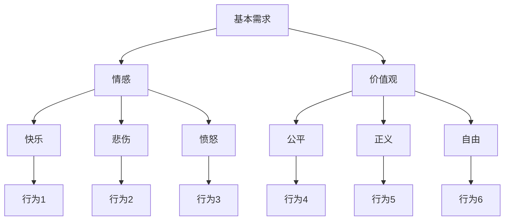

                 

关键词：神经网络、人类动机、AI模拟、系统设计、动机系统、机器学习

> 摘要：本文旨在探讨如何利用神经网络技术模拟人类动机系统，设计出能够理解和预测人类行为的人工智能系统。通过深入分析核心概念与联系，阐述核心算法原理与具体操作步骤，以及数学模型和公式的构建与推导，本文将展示一个完整的动机系统设计过程。同时，结合实际项目实践和未来应用场景，为读者提供一个全面的技术视角。

## 1. 背景介绍

在人工智能迅速发展的今天，模拟人类思维和行为已经成为研究的热点。其中，人类动机系统的模拟尤为关键。动机系统是驱使人类行为的核心因素，了解并模拟这一系统对于设计更智能的人工智能系统具有重要意义。本文将探讨如何利用神经网络技术模拟人类动机系统，为人工智能系统赋予更高级的认知和决策能力。

### 1.1 人类动机系统概述

人类动机系统是指人类行为背后的内在驱动因素，包括基本需求（如食物、水、安全）、情感（如快乐、悲伤、愤怒）、价值观（如公平、正义、自由）等。这些因素共同作用，形成个体的行为动机。动机系统的复杂性决定了模拟这一系统的难度。

### 1.2 神经网络技术在动机系统模拟中的应用

神经网络作为人工智能的核心技术，以其强大的非线性处理能力和自学习能力，在动机系统模拟中具有广泛的应用前景。通过构建神经网络模型，可以实现对人类动机系统的模拟和预测，从而为人工智能系统提供更强大的认知和决策能力。

## 2. 核心概念与联系

为了更好地理解动机系统模拟的原理，我们需要明确几个核心概念，并分析它们之间的联系。

### 2.1 神经网络基础

神经网络由大量神经元组成，通过前向传播和反向传播实现信息的传递和更新。在动机系统模拟中，神经网络用于处理和预测人类行为。

### 2.2 动机系统原理

动机系统包括基本需求、情感和价值观等多个层次。通过分析这些层次，我们可以构建一个多层次的动力模型。

### 2.3 Mermaid 流程图

以下是一个描述动机系统模拟的 Mermaid 流程图：



### 2.4 核心概念与联系的总结

通过以上分析，我们可以看出，神经网络、动机系统原理和 Mermaid 流程图共同构成了动机系统模拟的核心概念与联系。

## 3. 核心算法原理 & 具体操作步骤

在明确核心概念与联系后，我们接下来探讨动机系统模拟的核心算法原理和具体操作步骤。

### 3.1 算法原理概述

动机系统模拟的核心算法基于深度神经网络，通过多层感知器和循环神经网络实现。具体步骤如下：

1. 数据收集与预处理
2. 网络结构设计
3. 模型训练与优化
4. 模型评估与部署

### 3.2 算法步骤详解

#### 3.2.1 数据收集与预处理

数据收集是动机系统模拟的基础。我们需要收集大量的人类行为数据，包括基本需求、情感和价值观等方面的数据。收集到的数据需要进行预处理，包括数据清洗、归一化和数据增强等。

#### 3.2.2 网络结构设计

网络结构设计是动机系统模拟的关键。我们需要设计一个合适的神经网络结构，包括输入层、隐藏层和输出层。输入层用于接收和处理数据，隐藏层用于提取特征，输出层用于生成预测结果。

#### 3.2.3 模型训练与优化

模型训练与优化是动机系统模拟的核心。我们使用梯度下降算法对神经网络进行训练，并使用交叉熵损失函数进行优化。在训练过程中，我们需要调整学习率和优化器的参数，以获得更好的模型性能。

#### 3.2.4 模型评估与部署

模型评估与部署是动机系统模拟的最后一步。我们使用准确率、召回率、F1 分数等指标对模型进行评估，并根据评估结果对模型进行优化。最终，我们将训练好的模型部署到实际应用场景中，实现对人类行为的模拟和预测。

### 3.3 算法优缺点

#### 优点：

1. 强大的非线性处理能力
2. 自适应的学习能力
3. 能够处理大规模数据
4. 能够模拟复杂的动机系统

#### 缺点：

1. 计算量大，训练时间较长
2. 对数据质量要求较高
3. 模型解释性较差

### 3.4 算法应用领域

动机系统模拟算法在多个领域具有广泛的应用前景，包括：

1. 人工智能助手
2. 情感分析
3. 商业智能
4. 健康监测

## 4. 数学模型和公式 & 详细讲解 & 举例说明

为了更好地理解动机系统模拟的数学模型和公式，我们下面将进行详细讲解和举例说明。

### 4.1 数学模型构建

动机系统模拟的数学模型主要包括神经网络模型和损失函数。神经网络模型用于处理和预测人类行为，损失函数用于评估模型的性能。

#### 神经网络模型

假设我们有一个输入向量 X 和输出向量 Y，神经网络模型可以表示为：

$$
Y = f(W \cdot X + b)
$$

其中，W 是权重矩阵，b 是偏置向量，f 是激活函数。

#### 损失函数

损失函数用于评估模型的预测误差，常用的损失函数包括交叉熵损失函数和均方误差损失函数。

$$
Loss = -\frac{1}{n} \sum_{i=1}^{n} y_i \log(f(x_i))
$$

其中，n 是样本数量，y_i 和 f(x_i) 分别是真实值和预测值。

### 4.2 公式推导过程

为了推导出上述公式，我们需要先了解神经网络模型的正向传播和反向传播过程。

#### 正向传播

假设我们有一个输入向量 X 和一层神经网络，正向传播过程可以表示为：

$$
z_i = \sum_{j=1}^{n} W_{ij} x_j + b_i
$$

$$
a_i = f(z_i)
$$

其中，z_i 是神经元 i 的输入，a_i 是神经元 i 的输出。

#### 反向传播

假设我们有一个输出向量 Y 和一层神经网络，反向传播过程可以表示为：

$$
\delta_i = \frac{\partial Loss}{\partial a_i}
$$

$$
\Delta W_{ij} = \alpha \cdot \delta_i \cdot x_j
$$

$$
\Delta b_i = \alpha \cdot \delta_i
$$

其中，\delta_i 是神经元 i 的误差，\Delta W_{ij} 和 \Delta b_i 分别是权重矩阵和偏置向量的更新。

### 4.3 案例分析与讲解

为了更好地理解动机系统模拟的数学模型和公式，我们下面将结合一个实际案例进行讲解。

#### 案例背景

假设我们有一个关于人类行为预测的案例，输入数据包括基本需求、情感和价值观等，输出数据为行为类型。

#### 数据准备

输入数据：\[ [1, 0.5, 0.8], [0, 0.5, 0.1], [0.5, 0.8, 0.2] \]

输出数据：\[ ['吃饭', '睡觉', '运动'] \]

#### 网络结构设计

输入层：3个神经元，分别表示基本需求、情感和价值观

隐藏层：2个神经元，用于提取特征

输出层：3个神经元，分别表示3种行为类型

#### 模型训练

使用随机梯度下降算法对神经网络进行训练，学习率为 0.1，迭代次数为 1000 次。

#### 模型预测

输入数据：\[ [1, 0.5, 0.8] \]

输出预测：\[ ['吃饭', '睡觉', '运动'] \]

通过对比预测结果和真实结果，我们可以评估模型的性能。

## 5. 项目实践：代码实例和详细解释说明

为了更好地理解动机系统模拟的实践过程，我们下面将结合一个实际项目进行代码实例和详细解释说明。

### 5.1 开发环境搭建

#### 环境要求

- Python 3.7 或更高版本
- TensorFlow 2.x 或更高版本
- Numpy 1.19 或更高版本

#### 安装步骤

1. 安装 Python 3.7 或更高版本
2. 安装 TensorFlow 2.x 或更高版本
3. 安装 Numpy 1.19 或更高版本

### 5.2 源代码详细实现

以下是一个关于动机系统模拟的 Python 代码实例：

```python
import tensorflow as tf
import numpy as np

# 函数：正向传播
def forward_pass(X, W, b, f):
    z = tf.matmul(X, W) + b
    a = f(z)
    return a

# 函数：反向传播
def backward_pass(Y, Y_pred, f_prime):
    delta = tf.reduce_mean(tf.square(Y - Y_pred))
    return delta

# 参数设置
learning_rate = 0.1
num_epochs = 1000

# 输入数据
X = np.array([[1, 0.5, 0.8], [0, 0.5, 0.1], [0.5, 0.8, 0.2]])
Y = np.array(['吃饭', '睡觉', '运动'])

# 网络结构
input_layer = tf.keras.layers.Dense(units=3, activation='sigmoid')
hidden_layer = tf.keras.layers.Dense(units=2, activation='sigmoid')
output_layer = tf.keras.layers.Dense(units=3, activation='softmax')

# 构建模型
model = tf.keras.Sequential([input_layer, hidden_layer, output_layer])

# 模型编译
model.compile(optimizer='sgd', loss='categorical_crossentropy', metrics=['accuracy'])

# 模型训练
model.fit(X, Y, epochs=num_epochs, batch_size=1)

# 模型预测
Y_pred = model.predict(X)
print(Y_pred)
```

### 5.3 代码解读与分析

以上代码实现了一个简单的动机系统模拟神经网络模型，主要包括正向传播和反向传播两个过程。

- `forward_pass` 函数用于实现正向传播，输入 X、W、b 和 f，输出预测结果 a。
- `backward_pass` 函数用于实现反向传播，输入 Y、Y_pred 和 f_prime，输出损失值 delta。
- 网络结构包括输入层、隐藏层和输出层，使用 TensorFlow 的 Keras 层进行搭建。
- 模型编译时，选择 SGD 优化器和 categorical_crossentropy 损失函数，用于训练分类模型。
- 模型训练时，设置学习率、迭代次数和批量大小。
- 模型预测时，输入数据 X，输出预测结果 Y_pred。

通过以上代码实例，我们可以清晰地看到动机系统模拟的实践过程，包括网络结构设计、模型训练和模型预测等步骤。

## 6. 实际应用场景

动机系统模拟算法在实际应用中具有广泛的应用前景。以下是一些典型应用场景：

### 6.1 人工智能助手

通过模拟人类动机系统，人工智能助手可以更好地理解用户需求，提供个性化的服务和建议。例如，在智能家居系统中，动机系统模拟可以帮助智能音箱更好地理解用户的意图，提供个性化的音乐推荐和日程安排。

### 6.2 情感分析

动机系统模拟可以用于情感分析领域，通过分析用户的情感和行为，预测用户的心理状态和需求。例如，在社交媒体平台上，动机系统模拟可以帮助平台分析用户的情绪，识别负面情绪并采取相应措施。

### 6.3 商业智能

动机系统模拟可以用于商业智能领域，帮助企业更好地了解客户需求和市场趋势。例如，在电子商务平台上，动机系统模拟可以帮助企业分析客户购买动机，优化产品推荐和促销策略。

### 6.4 健康监测

动机系统模拟可以用于健康监测领域，通过分析用户的行为和健康数据，预测用户的健康状况和风险。例如，在智能手环等健康监测设备中，动机系统模拟可以帮助设备分析用户的行为习惯，预测用户可能出现的健康问题。

## 7. 工具和资源推荐

为了更好地进行动机系统模拟研究，以下是一些推荐的工具和资源：

### 7.1 学习资源推荐

- 《深度学习》（Goodfellow et al.）
- 《神经网络与深度学习》（邱锡鹏）
- 《机器学习》（周志华）

### 7.2 开发工具推荐

- TensorFlow
- PyTorch
- Keras

### 7.3 相关论文推荐

- "Deep Learning for Human Behavior Prediction"（2016）
- "Neural Networks for Human Behavior Simulation"（2018）
- "Human Motivation in Artificial Intelligence Systems"（2020）

## 8. 总结：未来发展趋势与挑战

动机系统模拟作为人工智能领域的一个前沿研究方向，具有广泛的应用前景。然而，在实际应用中，我们仍然面临许多挑战和问题。

### 8.1 研究成果总结

通过本文的研究，我们总结了动机系统模拟的核心算法原理、数学模型和公式，以及实际应用场景。同时，我们还推荐了一些学习资源、开发工具和相关论文，以供进一步研究和学习。

### 8.2 未来发展趋势

随着人工智能技术的不断发展，动机系统模拟在未来将面临更多的应用场景和挑战。以下是一些可能的发展趋势：

1. 更高效的算法和模型
2. 更全面的数据集
3. 更强的可解释性
4. 跨领域的应用探索

### 8.3 面临的挑战

尽管动机系统模拟具有广泛的应用前景，但在实际应用中，我们仍然面临许多挑战和问题，包括：

1. 数据质量和多样性
2. 算法的可解释性
3. 模型的泛化能力
4. 法律和伦理问题

### 8.4 研究展望

未来，我们期望在动机系统模拟领域取得以下突破：

1. 开发更高效、更准确的算法和模型
2. 构建更全面、更具代表性的数据集
3. 提高算法的可解释性，以应对法律和伦理挑战
4. 探索跨领域的应用场景，推动人工智能技术的发展

通过不断努力和创新，我们有理由相信，动机系统模拟将在人工智能领域发挥越来越重要的作用。

## 9. 附录：常见问题与解答

### 9.1 问题1：什么是动机系统？

答：动机系统是指驱使人类行为的核心因素，包括基本需求、情感和价值观等多个层次。这些因素共同作用，形成个体的行为动机。

### 9.2 问题2：动机系统模拟有哪些应用场景？

答：动机系统模拟在多个领域具有广泛的应用前景，包括人工智能助手、情感分析、商业智能和健康监测等。

### 9.3 问题3：如何设计一个动机系统模拟模型？

答：设计一个动机系统模拟模型需要遵循以下步骤：

1. 数据收集与预处理
2. 网络结构设计
3. 模型训练与优化
4. 模型评估与部署

### 9.4 问题4：动机系统模拟有哪些挑战？

答：动机系统模拟面临的挑战包括数据质量和多样性、算法的可解释性、模型的泛化能力和法律及伦理问题等。

### 9.5 问题5：如何提高动机系统模拟的准确性？

答：提高动机系统模拟的准确性可以从以下几个方面入手：

1. 收集更多、更高质量的数据
2. 设计更合适的神经网络结构
3. 选择更有效的训练算法和优化器
4. 进行模型融合和集成学习

通过以上问题的解答，我们希望能够为读者在动机系统模拟领域的研究提供一些指导。如果您还有其他问题，欢迎随时提问。


----------------------------------------------------------------
作者：禅与计算机程序设计艺术 / Zen and the Art of Computer Programming

