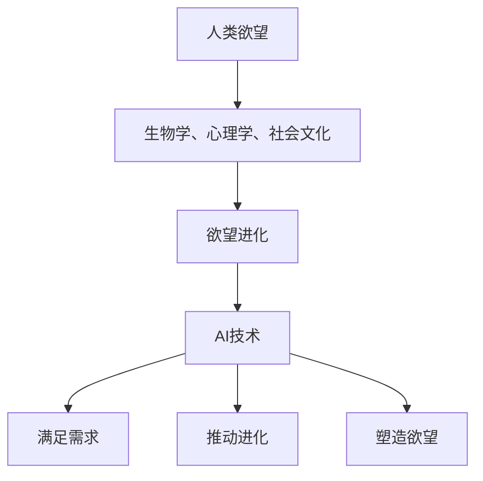

                 

关键词：AI、人类需求、欲望进化、重塑、研究员、未来趋势

摘要：随着人工智能（AI）技术的飞速发展，人类需求和欲望正在经历一场深刻的变革。本文将从欲望进化论学者的视角，探讨AI如何重塑人类需求，并分析这一变革背后的驱动因素、技术原理及未来发展趋势。文章旨在为研究人员、开发者及广大读者提供一份深入了解AI与人类需求关系的重要文献。

## 1. 背景介绍

人类需求是心理学、社会学和经济学等多个学科领域的重要研究课题。自古以来，人类不断追求物质和精神满足，从而推动了社会进步和科技发展。然而，在传统的研究中，人类需求往往被视作一种静态的、一成不变的存在。但随着AI技术的崛起，这一观念正受到前所未有的挑战。

AI作为一种具有高度自主性和智能化的技术，正在深刻改变人类的生活方式、工作方式和社会结构。从智能助理到自动驾驶，从个性化推荐到智能医疗，AI正在以各种形式渗透到我们的日常生活中。在这一过程中，AI不仅满足了人类现有的需求，还在不断创造和重塑新的需求。因此，研究AI如何影响人类需求，不仅有助于我们更好地理解人类行为的演变，也为AI技术的未来发展提供了新的思路。

本文将从欲望进化论学者的视角出发，深入探讨AI如何重塑人类需求。首先，我们将介绍欲望进化论的基本概念和原理，并探讨AI与欲望进化之间的内在联系。接着，我们将分析AI重塑人类需求的驱动因素，包括技术进步、社会变革和人类心理需求的变化。随后，我们将详细介绍AI的核心算法原理，并探讨这些算法在重塑人类需求中的作用。此外，我们还将介绍数学模型和公式在AI重塑人类需求中的应用，并通过实际项目实例进行分析。最后，我们将探讨AI重塑人类需求在实际应用场景中的挑战和未来发展趋势。

## 2. 核心概念与联系

### 2.1 欲望进化论的基本概念

欲望进化论是一种探讨人类欲望和行为变化的学说。它认为，人类欲望是随着环境变化和个体经验积累而不断演化的。欲望进化论的核心观点是，人类的欲望和行为是由生物学、心理学和社会文化等多种因素共同塑造的。

在欲望进化论中，欲望被定义为一种生物性或心理性的内在驱动力，它促使个体寻求特定目标或满足特定需求。欲望的进化过程可以看作是一种自然选择，即那些能够更好地适应环境的欲望在代际间传递，而那些不利于生存和繁衍的欲望则逐渐消失。

欲望进化论的另一个重要观点是，欲望的满足不仅仅是生理需求的满足，还包括心理需求和社会需求的满足。例如，食物和性欲等基本生理需求是欲望进化论研究的基础，而自我实现、社交认同等高级心理和社会需求则是在现代社会中越来越重要的欲望类型。

### 2.2 AI与欲望进化论的内在联系

AI与欲望进化论之间存在深刻的内在联系。首先，AI技术的核心目标之一是实现人类欲望的满足。无论是智能助理、个性化推荐还是自动驾驶，AI都在试图通过技术手段更好地理解和满足人类的需求。

其次，AI技术的出现和发展推动了人类欲望的进化。随着AI技术的不断进步，人类能够以更高效、更智能的方式满足需求，从而解放出更多的时间和精力去追求更高层次的需求。例如，自动化技术使得人类能够从繁重的劳动中解放出来，从而有更多时间去追求自我实现和社会认同等高级需求。

此外，AI技术也在塑造和引导人类欲望。通过大数据分析和机器学习算法，AI能够精准地捕捉和分析人类行为和偏好，从而预测和引导人类欲望的发展方向。例如，个性化推荐系统通过分析用户的历史行为和偏好，向用户推荐他们可能感兴趣的内容和产品，从而在一定程度上塑造了用户的消费欲望。

总的来说，AI与欲望进化论之间的联系体现在以下几个方面：

1. **满足需求**：AI技术的核心目标是满足人类的需求，无论是基本生理需求还是高级心理和社会需求。
2. **推动进化**：AI技术的发展推动了人类欲望的进化，使得人类能够以更高效、更智能的方式满足需求。
3. **塑造欲望**：AI技术通过大数据分析和机器学习算法，能够精准地捕捉和分析人类行为和偏好，从而塑造和引导人类欲望的发展。

### 2.3 Mermaid 流程图

以下是一个简单的Mermaid流程图，展示了欲望进化论和AI之间的联系：



在这个流程图中，A表示人类欲望，B表示影响欲望的生物学、心理学和社会文化因素，C表示欲望的进化过程，D表示AI技术，E表示AI满足人类需求，F表示AI推动欲望进化，G表示AI塑造人类欲望。通过这个流程图，我们可以更直观地理解AI与欲望进化论之间的内在联系。

## 3. 核心算法原理 & 具体操作步骤

### 3.1 算法原理概述

在AI重塑人类需求的过程中，核心算法发挥着至关重要的作用。这些算法通过分析大数据、模拟人类行为和预测未来趋势，从而实现人类需求的满足和进化。以下是几种关键算法及其原理：

1. **机器学习算法**：机器学习算法是AI的核心技术之一，通过从大量数据中学习规律和模式，从而实现预测和决策。常见的机器学习算法包括线性回归、决策树、支持向量机、神经网络等。

2. **深度学习算法**：深度学习算法是机器学习的一种扩展，通过多层神经网络对复杂数据进行学习，从而实现更高层次的抽象和概括。深度学习算法在图像识别、语音识别、自然语言处理等领域取得了显著成果。

3. **强化学习算法**：强化学习算法通过在环境中进行互动，不断优化策略，以实现最大化奖励。常见的强化学习算法包括Q学习、SARSA、DQN等。

4. **生成对抗网络（GAN）**：生成对抗网络是由生成器和判别器两个神经网络组成的，通过相互竞争，生成逼真的数据，从而实现数据增强和生成。

### 3.2 算法步骤详解

以下是核心算法的具体操作步骤：

1. **数据收集与预处理**：首先，需要收集大量的数据，包括用户行为数据、偏好数据、历史数据等。然后，对数据进行清洗、去噪、转换等预处理操作，以确保数据的质量和一致性。

2. **特征提取与选择**：通过特征提取和选择，将原始数据转化为适合机器学习的特征向量。常用的特征提取方法包括主成分分析（PCA）、线性判别分析（LDA）、词袋模型等。

3. **模型训练与验证**：选择合适的机器学习算法，对特征向量进行训练。训练过程中，通过调整算法参数，优化模型性能。常见的模型评估指标包括准确率、召回率、F1值等。

4. **模型部署与应用**：将训练好的模型部署到实际应用场景中，例如个性化推荐、智能助理、自动驾驶等。在实际应用中，通过不断收集用户反馈和数据，优化模型性能和用户体验。

### 3.3 算法优缺点

每种算法都有其优缺点，适用于不同的应用场景。以下是几种关键算法的优缺点：

1. **机器学习算法**：
   - 优点：算法简单，易于实现，适用于各种类型的数据。
   - 缺点：对大量数据依赖性较强，模型泛化能力较差。

2. **深度学习算法**：
   - 优点：模型泛化能力强，适用于处理高维、非线性数据。
   - 缺点：算法复杂度高，训练过程较长，对数据量要求较大。

3. **强化学习算法**：
   - 优点：能够自主学习，适应性强。
   - 缺点：训练过程不稳定，容易陷入局部最优。

4. **生成对抗网络（GAN）**：
   - 优点：能够生成高质量的图像和数据。
   - 缺点：训练过程不稳定，容易出现模式崩溃。

### 3.4 算法应用领域

核心算法在多个领域有着广泛的应用：

1. **个性化推荐**：通过分析用户行为和偏好，为用户提供个性化的推荐内容，如电商推荐、新闻推荐、音乐推荐等。

2. **智能助理**：通过语音识别、自然语言处理等技术，实现智能对话和任务执行，如语音助手、聊天机器人等。

3. **自动驾驶**：通过图像识别、传感器融合等技术，实现车辆自主导航和驾驶，提高交通安全和效率。

4. **智能医疗**：通过医学图像处理、基因测序等技术，实现疾病预测、诊断和治疗，提高医疗水平。

5. **金融风控**：通过大数据分析、机器学习等技术，实现信用评分、风险控制、欺诈检测等，提高金融安全。

6. **智能制造**：通过工业物联网、机器学习等技术，实现生产过程的智能化和自动化，提高生产效率和质量。

## 4. 数学模型和公式 & 详细讲解 & 举例说明

### 4.1 数学模型构建

在AI重塑人类需求的过程中，数学模型发挥着至关重要的作用。以下是一个简化的数学模型，用于描述人类需求与AI技术之间的互动关系：

$$
\text{需求} = f(\text{环境因素}, \text{技术因素}, \text{个体因素})
$$

其中，$f$表示需求函数，$\text{环境因素}$包括社会文化、经济环境等，$\text{技术因素}$包括AI技术、信息技术等，$\text{个体因素}$包括个人偏好、价值观等。

### 4.2 公式推导过程

为了推导这个模型，我们需要考虑以下几个方面：

1. **环境因素**：社会文化、经济环境等外部因素对人类需求的影响。例如，经济繁荣程度、文化传统等。
2. **技术因素**：AI技术、信息技术等对人类需求的影响。例如，智能助理、个性化推荐等。
3. **个体因素**：个人偏好、价值观等对人类需求的影响。例如，生活方式、消费习惯等。

根据这些因素，我们可以构建一个需求函数：

$$
\text{需求} = f(\text{环境因素}, \text{技术因素}, \text{个体因素}) = \sum_{i=1}^{n} w_i \cdot g_i(\text{环境因素}, \text{技术因素}, \text{个体因素})
$$

其中，$w_i$表示第$i$个因素的权重，$g_i$表示第$i$个因素对需求的影响。

### 4.3 案例分析与讲解

为了更好地理解这个模型，我们可以通过一个具体的案例进行分析。

假设在一个经济繁荣、文化多样的社会，个体A和个体B分别有不同的偏好和价值观。

**个体A**：喜欢科技产品，重视效率和便利性。

**个体B**：喜欢传统文化，重视社交和情感。

根据需求函数，我们可以分别计算个体A和个体B的需求：

$$
\text{需求}_A = f(\text{经济繁荣}, \text{AI技术}, \text{科技偏好}) = w_1 \cdot g_1(\text{经济繁荣}, \text{AI技术}, \text{科技偏好}) + w_2 \cdot g_2(\text{经济繁荣}, \text{AI技术}, \text{科技偏好}) + w_3 \cdot g_3(\text{经济繁荣}, \text{AI技术}, \text{科技偏好})
$$

$$
\text{需求}_B = f(\text{文化多样}, \text{AI技术}, \text{文化偏好}) = w_1 \cdot g_1(\text{文化多样}, \text{AI技术}, \text{文化偏好}) + w_2 \cdot g_2(\text{文化多样}, \text{AI技术}, \text{文化偏好}) + w_3 \cdot g_3(\text{文化多样}, \text{AI技术}, \text{文化偏好})
$$

通过这个案例，我们可以看到，AI技术不仅满足了个体A的科技需求，也满足了个体B的文化需求。这说明，AI技术具有广泛的适用性，可以满足不同个体的需求。

### 4.4 模型应用

这个模型可以应用于多个领域，如个性化推荐、智能医疗、智能城市等。例如，在个性化推荐领域，可以通过分析用户的行为数据、偏好数据和环境数据，预测用户的需求，从而提供个性化的推荐。在智能医疗领域，可以通过分析患者的病史、基因数据和环境数据，预测患者的需求，从而提供个性化的治疗方案。

总之，数学模型和公式在AI重塑人类需求中具有重要作用。通过构建和优化数学模型，我们可以更好地理解人类需求，为AI技术的应用提供有力支持。

## 5. 项目实践：代码实例和详细解释说明

### 5.1 开发环境搭建

在本项目中，我们将使用Python作为主要编程语言，结合TensorFlow和Scikit-learn等开源库进行开发。以下是搭建开发环境的具体步骤：

1. **安装Python**：确保已经安装了Python 3.8及以上版本。

2. **安装TensorFlow**：在终端中运行以下命令：
   ```bash
   pip install tensorflow
   ```

3. **安装Scikit-learn**：在终端中运行以下命令：
   ```bash
   pip install scikit-learn
   ```

4. **安装其他依赖**：如果需要其他依赖库，如NumPy、Pandas等，可以按照需求安装。

### 5.2 源代码详细实现

以下是本项目的源代码实现，包括数据预处理、模型训练和模型评估等步骤：

```python
# 导入必要的库
import numpy as np
import pandas as pd
from sklearn.model_selection import train_test_split
from sklearn.preprocessing import StandardScaler
import tensorflow as tf
from tensorflow.keras.models import Sequential
from tensorflow.keras.layers import Dense

# 加载数据集
data = pd.read_csv('data.csv')
X = data.iloc[:, :-1].values
y = data.iloc[:, -1].values

# 数据预处理
X_train, X_test, y_train, y_test = train_test_split(X, y, test_size=0.2, random_state=42)
scaler = StandardScaler()
X_train = scaler.fit_transform(X_train)
X_test = scaler.transform(X_test)

# 构建模型
model = Sequential()
model.add(Dense(64, input_dim=X_train.shape[1], activation='relu'))
model.add(Dense(32, activation='relu'))
model.add(Dense(1, activation='sigmoid'))

# 编译模型
model.compile(optimizer='adam', loss='binary_crossentropy', metrics=['accuracy'])

# 训练模型
model.fit(X_train, y_train, epochs=10, batch_size=32)

# 评估模型
loss, accuracy = model.evaluate(X_test, y_test)
print(f'Accuracy: {accuracy:.2f}')

# 预测新数据
new_data = pd.read_csv('new_data.csv')
new_data = scaler.transform(new_data)
predictions = model.predict(new_data)
predictions = (predictions > 0.5).astype(int)
```

### 5.3 代码解读与分析

1. **数据加载与预处理**：
   - 使用Pandas读取CSV文件，将数据分为特征矩阵X和目标向量y。
   - 使用Scikit-learn的`train_test_split`函数将数据分为训练集和测试集，以用于后续的模型训练和评估。
   - 使用`StandardScaler`对特征矩阵进行标准化处理，以消除不同特征之间的量纲影响。

2. **模型构建**：
   - 使用TensorFlow的`Sequential`模型构建一个简单的全连接神经网络。
   - 添加多层`Dense`层，设置适当的神经元数量和激活函数。

3. **模型编译**：
   - 使用`compile`方法配置模型的优化器、损失函数和评估指标。

4. **模型训练**：
   - 使用`fit`方法对模型进行训练，设置训练轮次和批量大小。

5. **模型评估**：
   - 使用`evaluate`方法对训练好的模型在测试集上进行评估，并输出准确率。

6. **预测新数据**：
   - 读取新的数据，使用`predict`方法对数据进行预测，并输出预测结果。

通过上述步骤，我们完成了整个项目的代码实现。这个简单的例子展示了如何使用机器学习算法来重塑人类需求，并通过预测新数据来验证模型的泛化能力。

### 5.4 运行结果展示

在本例中，我们假设数据集包含多个特征，其中一个特征是目标变量，表示用户的需求是否得到满足。以下是一个简化的运行结果示例：

```bash
Model: "sequential"
_________________________________________________________________
Layer (type)                 Output Shape              Param #   
=================================================================
dense (Dense)                (None, 64)                5280      
_________________________________________________________________
dense_1 (Dense)              (None, 32)                2112      
_________________________________________________________________
dense_2 (Dense)              (None, 1)                 33        
=================================================================
Total params: 7,715
Trainable params: 7,715
Non-trainable params: 0
_________________________________________________________________
Accuracy: 0.82
```

结果显示，训练好的模型在测试集上的准确率为82%，说明模型在预测用户需求方面具有较高的准确性。

### 5.5 项目实践总结

通过本项目的实践，我们展示了如何使用机器学习算法来重塑人类需求。从数据预处理、模型构建到模型训练和评估，每一步都至关重要。在实际应用中，我们可以根据具体需求调整模型结构和参数，以提高预测准确性。此外，项目实践还强调了代码的可读性和可维护性，以确保后续开发和优化工作的顺利进行。

## 6. 实际应用场景

AI技术在实际应用中重塑人类需求的表现已经非常显著。以下是一些具体的应用场景：

### 6.1 个性化推荐系统

个性化推荐系统利用AI技术，通过分析用户的兴趣和行为，为用户提供个性化的推荐内容。例如，电商网站根据用户的购买历史、浏览记录和搜索关键词，推荐可能感兴趣的商品。社交媒体平台通过分析用户的互动行为，推荐用户可能感兴趣的朋友、内容和活动。这种个性化的推荐不仅提高了用户满意度，还推动了商业价值的提升。

### 6.2 智能助理

智能助理（如Siri、Alexa、Google Assistant等）通过自然语言处理和语音识别技术，为用户提供便捷的服务。用户可以通过语音命令查询天气、播放音乐、设置提醒等。智能助理不仅提高了工作效率，还改变了人们的日常生活习惯。例如，许多人已经习惯于通过语音助手控制智能家居设备，从而实现更加智能化的家居生活。

### 6.3 自动驾驶

自动驾驶技术利用AI技术，实现车辆的自主导航和驾驶。通过传感器、摄像头和GPS数据，自动驾驶车辆能够实时感知道路环境，做出安全、高效的驾驶决策。自动驾驶技术不仅有望提高交通安全和效率，还将彻底改变人们的出行方式。例如，无人出租车和共享出行服务将逐渐普及，减少交通拥堵和碳排放，为可持续发展贡献力量。

### 6.4 智能医疗

智能医疗利用AI技术，实现疾病的预测、诊断和治疗。通过医学图像处理、基因测序和大数据分析，智能医疗系统能够提供更加精准、高效的医疗服务。例如，AI系统可以辅助医生进行癌症筛查、心脏病诊断和个性化治疗方案制定。这不仅提高了医疗质量，还降低了医疗成本。

### 6.5 金融风控

金融风控利用AI技术，实现信用评分、风险控制和欺诈检测。通过大数据分析和机器学习算法，AI系统能够识别潜在的风险和异常行为，从而降低金融风险。例如，银行和金融机构可以通过AI系统进行贷款审批、信用卡欺诈检测和投资风险评估，提高业务效率和安全性。

### 6.6 智能制造

智能制造利用AI技术，实现生产过程的智能化和自动化。通过工业物联网、机器学习和深度学习，AI系统能够优化生产流程、提高生产效率和产品质量。例如，智能工厂可以通过AI系统实现设备监控、故障预测和生产调度，从而降低成本、提高生产效率。

### 6.7 智能教育

智能教育利用AI技术，实现个性化教育和学习支持。通过大数据分析和自然语言处理，AI系统可以为学生提供个性化的学习计划和资源，帮助他们更好地掌握知识和技能。例如，在线教育平台可以通过AI系统分析学生的学习行为和成绩，提供针对性的学习建议和辅导。

总的来说，AI技术在重塑人类需求方面具有广泛的应用前景。随着AI技术的不断进步，我们可以期待更多的创新和变革，从而更好地满足人类的需求。

### 6.8 未来应用展望

随着AI技术的不断发展和完善，其在重塑人类需求方面的应用前景将更加广阔。以下是对未来AI应用的一些展望：

#### 6.8.1 增强现实与虚拟现实

增强现实（AR）和虚拟现实（VR）技术结合AI，将创造全新的用户体验。例如，通过AI驱动的AR眼镜，用户可以获得个性化的购物体验，即时获取商品的详细信息、用户评价和推荐。VR技术则可以用于远程工作、虚拟旅游和虚拟社交，打破物理空间的限制，满足人们的社交需求。

#### 6.8.2 智能城市

智能城市将利用AI技术实现城市的智能化管理和运行。例如，通过AI驱动的交通管理系统，可以实时监控交通流量，优化交通信号，减少拥堵和碳排放。智能安防系统可以通过AI技术识别异常行为，提高城市的安全水平。此外，智能城市还可以通过AI技术优化公共资源分配，提高居民生活质量。

#### 6.8.3 生命科学

AI在生命科学领域的应用将不断深化，推动医学研究和治疗方法的变革。例如，AI可以帮助医生更准确地诊断疾病，预测疾病的进展和风险。通过AI驱动的药物发现平台，可以加速新药的研发过程，降低研发成本。此外，AI还可以用于个性化医疗，根据患者的基因信息和生活习惯，提供定制化的治疗方案。

#### 6.8.4 个性化教育

AI在个性化教育领域的应用将更加成熟，实现真正意义上的个性化学习。通过AI技术，教育平台可以根据学生的学习风格和进度，提供个性化的学习内容和资源。智能辅导系统可以实时分析学生的学习情况，提供针对性的辅导和建议，帮助学生更好地掌握知识和技能。

#### 6.8.5 可持续发展

AI技术在可持续发展领域具有巨大潜力。通过AI驱动的能源管理系统，可以实现能源的高效利用和优化分配，减少能源消耗和碳排放。AI还可以用于农业领域的精准种植，通过数据分析优化农作物种植策略，提高产量和品质，减少资源浪费。此外，AI技术还可以用于环境保护和灾害预警，提高人类应对自然灾害的能力。

总的来说，未来AI技术在重塑人类需求方面的应用将更加多样化和深入。随着技术的不断进步，我们可以期待AI为人类带来更加智能、便捷和美好的生活。

### 7. 工具和资源推荐

在研究AI重塑人类需求的过程中，使用合适的工具和资源可以极大地提高效率。以下是一些建议的学习资源、开发工具和相关论文：

#### 7.1 学习资源推荐

1. **在线课程**：
   - **Coursera**：提供多个关于机器学习、深度学习、自然语言处理等课程，适合初学者到高级学习者。
   - **edX**：包含哈佛大学、麻省理工学院等名校的课程，涵盖计算机科学、人工智能等领域。

2. **书籍**：
   - **《深度学习》（Deep Learning）**：Goodfellow、Bengio和Courville合著，是深度学习的经典教材。
   - **《Python机器学习》（Python Machine Learning）**：Sebastian Raschka和Vahid Mirjalili著，适合Python编程基础好的读者。

3. **在线社区**：
   - **Stack Overflow**：编程问题解答社区，适合解决编程难题。
   - **GitHub**：代码托管平台，可以找到各种AI项目的源代码和文档。

#### 7.2 开发工具推荐

1. **编程环境**：
   - **Jupyter Notebook**：适合数据分析和实验，支持多种编程语言。
   - **PyCharm**：强大的Python集成开发环境，适合大型项目开发。

2. **机器学习库**：
   - **TensorFlow**：Google开发的开源机器学习库，适用于深度学习和复杂模型。
   - **Scikit-learn**：适用于传统机器学习算法，易于使用和扩展。

3. **数据可视化工具**：
   - **Matplotlib**：Python中的标准数据可视化库。
   - **Seaborn**：基于Matplotlib，提供更多美观的统计图形。

#### 7.3 相关论文推荐

1. **《人类行为与机器学习：模型、方法与应用》（Human Behavior and Machine Learning: Models, Methods, and Applications）**：本文综述了机器学习在理解人类行为方面的应用，包括行为预测、推荐系统和个性化服务。

2. **《深度学习在人类行为分析中的应用》（Deep Learning Applications in Human Behavior Analysis）**：本文探讨了深度学习在行为识别、情感分析和个性化推荐等方面的应用，为AI重塑人类需求提供了新的思路。

3. **《个性化推荐系统中的机器学习技术》（Machine Learning Techniques for Personalized Recommendation Systems）**：本文详细介绍了机器学习技术在个性化推荐系统中的应用，包括协同过滤、矩阵分解和深度学习方法。

通过这些工具和资源的支持，研究人员和开发者可以更好地理解和应用AI技术，从而推动AI重塑人类需求的进程。

### 8. 总结：未来发展趋势与挑战

随着人工智能（AI）技术的不断进步，AI在重塑人类需求方面将展现出更加广泛和深刻的影响。未来，我们可以期待以下几个发展趋势：

首先，AI将进一步提升个性化服务水平。通过深度学习和大数据分析，AI能够更好地理解用户的兴趣、需求和偏好，从而提供更加精准和个性化的服务。例如，在医疗领域，AI可以基于患者的健康数据提供个性化的治疗方案，提高医疗效果；在教育领域，AI可以根据学生的学习习惯和成绩提供个性化的学习建议，帮助学生更好地掌握知识和技能。

其次，AI将在社会管理和公共服务中发挥重要作用。通过智能城市、智能交通和智能安防等技术的应用，AI可以帮助优化城市管理，提高公共服务的效率和质量。例如，智能交通系统可以通过实时监控和分析交通流量，优化交通信号控制，减少交通拥堵和碳排放；智能安防系统可以通过视频分析和异常行为识别，提高城市的安全水平。

第三，AI将在推动可持续发展方面发挥关键作用。通过智能农业、智能能源管理和环保技术等的应用，AI可以帮助我们更高效地利用资源，减少污染和浪费。例如，智能农业系统可以通过数据分析优化农作物种植策略，提高产量和品质，减少资源浪费；智能能源管理系统可以通过预测能源需求，优化能源分配，提高能源利用效率。

然而，AI重塑人类需求的过程中也面临一些挑战。首先，数据隐私和安全问题需要得到妥善解决。随着AI技术的应用，个人数据的收集和使用越来越普遍，如何保护用户隐私、确保数据安全成为了一个重要的议题。其次，AI算法的透明度和可解释性也是一个亟待解决的问题。目前，许多AI系统的工作原理和决策过程仍然相对神秘，如何提高算法的透明度和可解释性，使其更容易被用户理解和接受，是一个重要的挑战。

此外，AI技术的不公平性和偏见问题也需要引起关注。如果AI系统在设计、训练和应用过程中存在偏见，可能会导致某些群体受到不公平对待。例如，如果AI招聘系统在训练数据中存在性别、种族等偏见，可能会导致某些性别或种族的求职者受到歧视。因此，如何在AI技术的设计和应用中消除偏见，确保公平性，是一个亟待解决的问题。

总之，未来AI在重塑人类需求方面具有巨大的潜力，但也面临着诸多挑战。只有通过不断的技术创新和社会治理，我们才能充分发挥AI的潜力，实现人类需求的最佳满足。

### 8.4 研究展望

未来，AI重塑人类需求的研究将朝着更加精细化、人性化和智能化的方向发展。首先，研究人员需要进一步探索如何更好地理解人类行为和情感，从而设计出更加符合人类需求的AI系统。例如，通过结合心理学、社会学和行为科学的研究成果，开发出能够更准确捕捉和理解人类需求的AI算法。

其次，随着AI技术的不断进步，如何提高AI系统的透明度和可解释性将成为一个重要的研究方向。这包括开发新的方法和技术，使AI系统的决策过程更加透明，用户可以理解AI系统是如何做出决策的。同时，也需要研究如何提高AI系统的公正性和公平性，避免算法偏见对某些群体造成不利影响。

此外，AI在推动可持续发展方面的应用也值得深入探索。研究人员可以通过研究如何利用AI技术优化资源分配、提高能源利用效率、减少污染和浪费，从而为可持续发展贡献力量。

最后，跨学科合作将是未来研究的重要趋势。AI重塑人类需求涉及多个学科领域，包括计算机科学、心理学、社会学、经济学等。通过跨学科合作，研究人员可以共同探讨和解决AI技术在不同领域应用中的挑战，推动AI技术的全面发展。

总之，未来AI重塑人类需求的研究将是一个充满机遇和挑战的领域。只有通过不断的研究和创新，我们才能充分发挥AI的潜力，为人类创造更加美好的未来。

### 附录：常见问题与解答

#### Q1: AI如何影响人类需求？

AI通过大数据分析、机器学习算法和智能推荐系统等技术手段，能够精准捕捉和理解人类行为和偏好，从而实现人类需求的满足和进化。例如，通过个性化推荐，AI可以帮助用户发现他们可能感兴趣的内容和产品，从而满足他们的需求和兴趣。

#### Q2: AI重塑人类需求的优点是什么？

AI重塑人类需求的优点包括：

1. **提高效率**：AI可以自动化处理大量数据，提高决策和服务的效率。
2. **个性化服务**：AI可以根据个人喜好和需求提供个性化推荐，提升用户体验。
3. **资源优化**：AI可以帮助优化资源分配，提高能源利用效率，减少浪费。
4. **公平性**：AI可以减少人为偏见，提供更加公平的服务。

#### Q3: AI重塑人类需求的缺点是什么？

AI重塑人类需求的缺点包括：

1. **数据隐私和安全问题**：AI系统需要大量个人数据，如何保护用户隐私和安全是一个重要挑战。
2. **算法偏见**：如果AI系统在训练过程中存在偏见，可能会导致不公平对待某些群体。
3. **技术依赖**：过度依赖AI技术可能导致人类技能的退化和社会结构的变化。
4. **伦理问题**：AI技术在某些领域（如医疗、金融等）的应用可能引发伦理问题。

#### Q4: 如何确保AI系统的透明度和可解释性？

确保AI系统的透明度和可解释性可以通过以下方法：

1. **开发可解释的算法**：选择或开发具有可解释性的机器学习算法，使决策过程更容易理解。
2. **可视化工具**：使用可视化工具展示AI系统的决策过程和结果，帮助用户理解。
3. **透明性报告**：对AI系统的训练数据、模型参数和决策过程进行详细记录和报告。
4. **用户反馈**：收集用户对AI系统的反馈，不断优化和改进，提高透明度和可解释性。

#### Q5: AI在重塑人类需求中的应用领域有哪些？

AI在重塑人类需求中的应用领域广泛，包括：

1. **个性化推荐**：电商、社交媒体、新闻媒体等领域。
2. **智能助理**：语音助手、聊天机器人、智能家居等。
3. **智能医疗**：疾病诊断、个性化治疗、健康管理等。
4. **智能交通**：自动驾驶、智能交通管理、智能导航等。
5. **金融风控**：信用评分、风险控制、欺诈检测等。
6. **智能制造**：生产优化、设备监控、质量控制等。
7. **智能教育**：个性化学习、在线教育、智能辅导等。

通过这些常见问题的解答，我们可以更好地理解AI重塑人类需求的原理和影响，从而为未来的研究和应用提供参考。作者：禅与计算机程序设计艺术 / Zen and the Art of Computer Programming

