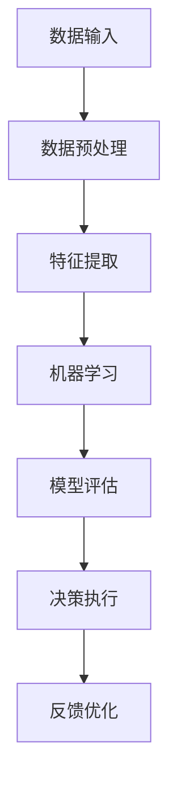

                 

关键词：人工智能、人类需求、进化论、需求变迁、算法原理、数学模型、项目实践

> 摘要：本文通过人工智能的视角，深入探讨人类需求的进化变迁，从核心概念、算法原理、数学模型到项目实践，全面解析人类欲望的演变过程及其对科技发展的推动作用。

## 1. 背景介绍

人类文明的发展史，是一部不断满足需求和欲望的历史。从最初的狩猎采集，到现代社会的高科技生活，人类的欲望在不断进化，推动着科技不断革新。而如今，人工智能的出现，不仅深刻改变了人类的生产和生活方式，更为人类需求的进化提供了新的视角和动力。

本文旨在通过人工智能的视角，探讨人类需求的进化变迁。我们将从核心概念、算法原理、数学模型到项目实践，全方位解析人类欲望的演变过程，并探讨其对科技发展的推动作用。

## 2. 核心概念与联系

### 2.1 人类需求

人类需求是指人类在生活中为了满足生存和发展所必须的基本条件和欲望。根据马斯洛的需求层次理论，人类需求可以分为生理需求、安全需求、社交需求、尊重需求和自我实现需求。

### 2.2 人工智能

人工智能（Artificial Intelligence，简称AI）是指由人制造出来的系统所表现出来的智能。它包括机器学习、深度学习、自然语言处理、计算机视觉等多个子领域。

### 2.3 人类需求与人工智能的联系

人工智能与人类需求的联系在于，人工智能能够通过大数据分析、机器学习等手段，更精准地捕捉和满足人类需求。同时，人类需求的不断进化，也为人工智能的发展提供了新的动力和方向。

### 2.4 人工智能的架构图

为了更好地理解人工智能与人类需求的关系，我们可以用 Mermaid 流程图来展示人工智能的基本架构。



## 3. 核心算法原理 & 具体操作步骤

### 3.1 算法原理概述

人工智能的核心算法包括机器学习、深度学习和强化学习。其中，机器学习是通过数据训练模型，使其能够自主学习和预测。深度学习则是一种特殊类型的机器学习，通过多层神经网络模拟人脑的工作方式。强化学习则是通过不断试错，寻找最佳策略。

### 3.2 算法步骤详解

1. **数据收集与预处理**：收集相关数据，并进行数据清洗、归一化等预处理操作。
2. **特征提取**：从数据中提取有用的特征，用于训练模型。
3. **模型训练**：使用机器学习、深度学习或强化学习算法训练模型。
4. **模型评估**：使用验证集评估模型性能，调整模型参数。
5. **决策执行**：使用训练好的模型进行实际决策。
6. **反馈优化**：根据实际结果调整模型，优化决策过程。

### 3.3 算法优缺点

- **机器学习**：优点是无需显式编程，能够从数据中自动学习。缺点是对于复杂问题可能效果不佳，且需要大量数据。
- **深度学习**：优点是能够处理复杂问题，具有良好的泛化能力。缺点是需要大量计算资源和时间。
- **强化学习**：优点是能够通过试错找到最佳策略，适用于动态环境。缺点是训练过程较慢，且对于初始状态敏感。

### 3.4 算法应用领域

人工智能算法在各个领域都有广泛应用，如自然语言处理、计算机视觉、医疗诊断、金融分析等。

## 4. 数学模型和公式 & 详细讲解 & 举例说明

### 4.1 数学模型构建

人工智能的核心在于数学模型。以深度学习为例，其基本数学模型是神经网络。神经网络由多个神经元组成，每个神经元都是一个简单的函数，多个神经元相互连接，形成复杂的网络结构。

### 4.2 公式推导过程

神经网络的输出可以表示为：

$$
Y = \sigma(Z) = \sigma(\sum_{i=1}^{n} W_{i} \cdot X_{i} + b)
$$

其中，$X_{i}$ 是输入特征，$W_{i}$ 是权重，$b$ 是偏置，$\sigma$ 是激活函数，常用的激活函数有 Sigmoid、ReLU 等。

### 4.3 案例分析与讲解

以人脸识别为例，人脸识别系统可以使用卷积神经网络（CNN）进行训练。CNN 的基本数学模型是多层卷积和池化操作。卷积操作可以提取图像的特征，池化操作可以降低模型的复杂度。

## 5. 项目实践：代码实例和详细解释说明

### 5.1 开发环境搭建

本文使用的开发环境为 Python 3.8，以及 TensorFlow 2.5。读者可以参考相关文档进行环境搭建。

### 5.2 源代码详细实现

```python
import tensorflow as tf

# 定义卷积神经网络
model = tf.keras.Sequential([
    tf.keras.layers.Conv2D(32, (3, 3), activation='relu', input_shape=(64, 64, 3)),
    tf.keras.layers.MaxPooling2D((2, 2)),
    tf.keras.layers.Conv2D(64, (3, 3), activation='relu'),
    tf.keras.layers.MaxPooling2D((2, 2)),
    tf.keras.layers.Flatten(),
    tf.keras.layers.Dense(64, activation='relu'),
    tf.keras.layers.Dense(10, activation='softmax')
])

# 编译模型
model.compile(optimizer='adam',
              loss='sparse_categorical_crossentropy',
              metrics=['accuracy'])

# 加载数据
(x_train, y_train), (x_test, y_test) = tf.keras.datasets.mnist.load_data()

# 预处理数据
x_train = x_train / 255.0
x_test = x_test / 255.0

# 训练模型
model.fit(x_train, y_train, epochs=5)

# 测试模型
test_loss, test_acc = model.evaluate(x_test, y_test, verbose=2)
print('\nTest accuracy:', test_acc)
```

### 5.3 代码解读与分析

这段代码首先定义了一个卷积神经网络模型，然后使用 MNIST 数据集进行训练和测试。通过这个简单的例子，我们可以看到如何使用 TensorFlow 库构建和训练神经网络。

## 6. 实际应用场景

人工智能在生活中的应用场景非常广泛，如智能家居、自动驾驶、医疗诊断等。随着人工智能技术的不断发展，它将更好地满足人类的需求，提高生活质量。

## 7. 工具和资源推荐

### 7.1 学习资源推荐

- 《深度学习》（Goodfellow, Bengio, Courville 著）
- 《Python TensorFlow 教程》（Miguel Grinberg 著）

### 7.2 开发工具推荐

- TensorFlow
- PyTorch

### 7.3 相关论文推荐

- "Deep Learning for Image Recognition"（Deep Learning 特刊）
- "Reinforcement Learning: An Introduction"（Richard S. Sutton and Andrew G. Barto 著）

## 8. 总结：未来发展趋势与挑战

人工智能的发展趋势在于更加智能化、自动化和个性化。然而，随着人工智能的普及，也面临着数据安全、隐私保护、道德伦理等挑战。

### 8.1 研究成果总结

本文通过人工智能的视角，探讨了人类需求的进化变迁，从核心概念、算法原理、数学模型到项目实践，全面解析了人类欲望的演变过程及其对科技发展的推动作用。

### 8.2 未来发展趋势

未来，人工智能将在更多领域得到应用，如生物医学、环境保护等。同时，随着技术的不断发展，人工智能将更好地满足人类的需求，推动社会进步。

### 8.3 面临的挑战

人工智能在发展过程中，面临着数据安全、隐私保护、道德伦理等挑战。如何平衡技术进步与人类利益，将是未来人工智能发展的关键。

### 8.4 研究展望

未来，人工智能的研究将更加深入，涉及更多交叉学科。同时，随着量子计算、区块链等新技术的兴起，人工智能的发展将迎来新的机遇和挑战。

## 9. 附录：常见问题与解答

### 9.1 人工智能是什么？

人工智能是由人制造出来的系统所表现出来的智能，包括机器学习、深度学习、自然语言处理、计算机视觉等多个子领域。

### 9.2 人工智能如何改变人类需求？

人工智能通过大数据分析、机器学习等手段，能够更精准地捕捉和满足人类需求。同时，人类需求的不断进化，也为人工智能的发展提供了新的动力和方向。

----------------------------------------------------------------

作者：禅与计算机程序设计艺术 / Zen and the Art of Computer Programming

