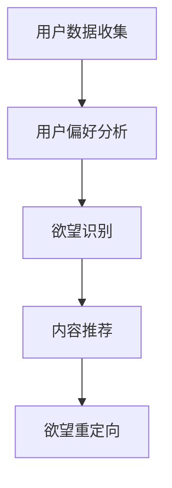

                 

关键词：欲望重定向，人工智能，价值观重塑，算法，模型，应用场景，未来展望

> 摘要：本文探讨了欲望重定向技术，一种由人工智能引导的价值观重塑方法。通过介绍该技术的核心概念、算法原理、数学模型、应用场景以及未来展望，旨在为读者提供对这一前沿领域的深入理解。

## 1. 背景介绍

在当今信息爆炸的时代，人们的价值观和行为模式受到多种因素的影响。社交媒体、广告、娱乐等媒介不断传递着各种信息，其中不乏诱导消费、刺激欲望的内容。这些信息影响着人们的判断和选择，有时甚至导致非理性的消费行为。因此，如何有效地引导和重塑人们的价值观，已经成为一个重要的社会问题。

人工智能技术的发展为解决这一问题提供了新的思路。欲望重定向技术正是基于人工智能算法，通过分析用户的行为和偏好，引导用户将注意力从不良欲望转移到更积极、有益的方向。本文将深入探讨这一技术的原理、实现方法以及应用前景。

## 2. 核心概念与联系

### 2.1 欲望重定向技术的基本概念

欲望重定向技术（Desire Redirection Technology，DRT）是一种基于人工智能的方法，旨在通过分析用户的偏好和行为，将用户的注意力从消极欲望转移到积极欲望。具体来说，DRT包括以下几个核心概念：

1. **用户偏好分析**：通过收集用户的行为数据，如搜索历史、浏览记录、社交媒体活动等，分析用户的偏好和兴趣。
2. **欲望识别**：根据用户偏好，识别出用户的欲望，包括消极欲望（如过度消费、沉迷娱乐）和积极欲望（如健康生活、学习提升）。
3. **内容推荐**：基于用户识别的欲望，推荐相关的内容，引导用户关注积极欲望，从而实现欲望的重定向。

### 2.2 欲望重定向技术的联系

欲望重定向技术涉及到多个领域的知识，包括人工智能、心理学、社会学等。其中，人工智能技术为DRT提供了强大的数据分析能力和算法支持，而心理学和社会学则为其提供了理论基础和实际应用场景。

- **人工智能**：DRT依赖于机器学习、数据挖掘、自然语言处理等技术，通过分析用户数据，实现欲望的识别和重定向。
- **心理学**：DRT需要理解用户的欲望和行为背后的心理机制，如动机、情感、认知等，以便更有效地引导用户。
- **社会学**：DRT在社会层面有着广泛的应用，如改善消费行为、促进社会和谐等。

### 2.3 Mermaid 流程图



## 3. 核心算法原理 & 具体操作步骤

### 3.1 算法原理概述

欲望重定向技术的主要算法原理包括用户偏好分析、欲望识别和内容推荐。以下是这些算法的简要概述：

- **用户偏好分析**：通过分析用户的历史行为数据，如浏览记录、搜索历史等，使用聚类、关联规则挖掘等方法提取用户的兴趣和偏好。
- **欲望识别**：利用情感分析、文本分类等技术，识别用户的行为背后所隐藏的欲望，区分消极欲望和积极欲望。
- **内容推荐**：基于用户识别的欲望，使用协同过滤、基于内容的推荐等技术，为用户推荐相关的内容，引导用户关注积极欲望。

### 3.2 算法步骤详解

1. **用户数据收集**：
   - 收集用户在各个平台的行为数据，如浏览记录、搜索历史、社交媒体活动等。
   - 数据清洗，去除重复和无用的数据。

2. **用户偏好分析**：
   - 使用聚类算法，如K-means，将用户数据分为不同的兴趣群体。
   - 使用关联规则挖掘，如Apriori算法，提取用户的行为关联。

3. **欲望识别**：
   - 利用情感分析，对用户的行为数据进行情感分析，识别出消极欲望和积极欲望。
   - 使用文本分类算法，如SVM，对用户的行为数据分类，进一步细化欲望的类型。

4. **内容推荐**：
   - 使用协同过滤算法，如基于用户的协同过滤（User-based Collaborative Filtering），为用户推荐与积极欲望相关的内容。
   - 使用基于内容的推荐算法，如基于物品的协同过滤（Item-based Collaborative Filtering），为用户推荐与积极欲望相关的内容。

5. **欲望重定向**：
   - 根据推荐结果，向用户推送相关内容，引导用户关注积极欲望。
   - 定期评估用户的行为和偏好，调整推荐策略，提高重定向效果。

### 3.3 算法优缺点

- **优点**：
  - 提高用户的积极欲望，降低消极欲望。
  - 有助于改善用户的行为模式，如减少过度消费、提高健康水平等。
  - 具有广泛的适用性和灵活性，可以应用于不同领域和场景。

- **缺点**：
  - 数据隐私和安全问题：用户数据的安全性需要得到有效保障。
  - 可能引发用户反感和抵触，需要平衡用户需求和社会价值。
  - 算法效果可能受到数据质量、算法复杂度等因素的影响。

### 3.4 算法应用领域

- **消费行为管理**：通过欲望重定向技术，帮助用户树立正确的消费观念，减少非理性消费。
- **心理健康服务**：利用欲望重定向技术，为用户提供心理支持和建议，改善心理健康。
- **社会教育**：通过欲望重定向技术，引导学生树立正确的价值观，提高社会责任感。

## 4. 数学模型和公式 & 详细讲解 & 举例说明

### 4.1 数学模型构建

欲望重定向技术涉及多个数学模型，主要包括用户偏好分析模型、欲望识别模型和内容推荐模型。

#### 用户偏好分析模型

用户偏好分析模型主要用于提取用户的兴趣和偏好。假设有n个用户，每个用户有m个行为特征，可以使用以下矩阵表示用户数据：

\[ P = \begin{bmatrix}
    p_{11} & p_{12} & \cdots & p_{1m} \\
    p_{21} & p_{22} & \cdots & p_{2m} \\
    \vdots & \vdots & \ddots & \vdots \\
    p_{n1} & p_{n2} & \cdots & p_{nm}
\end{bmatrix} \]

其中，\( p_{ij} \)表示第i个用户在第j个行为特征上的表现。

使用K-means聚类算法对用户数据进行聚类，提取用户的兴趣群体。假设有k个兴趣群体，每个兴趣群体有n个用户，可以使用以下矩阵表示聚类结果：

\[ C = \begin{bmatrix}
    c_{11} & c_{12} & \cdots & c_{1k} \\
    c_{21} & c_{22} & \cdots & c_{2k} \\
    \vdots & \vdots & \ddots & \vdots \\
    c_{n1} & c_{n2} & \cdots & c_{nk}
\end{bmatrix} \]

其中，\( c_{ij} \)表示第i个用户属于第j个兴趣群体的概率。

#### 欲望识别模型

欲望识别模型主要用于识别用户的欲望类型。假设有n个用户，每个用户有m个行为特征，可以使用以下矩阵表示用户数据：

\[ D = \begin{bmatrix}
    d_{11} & d_{12} & \cdots & d_{1m} \\
    d_{21} & d_{22} & \cdots & d_{2m} \\
    \vdots & \vdots & \ddots & \vdots \\
    d_{n1} & d_{n2} & \cdots & d_{nm}
\end{bmatrix} \]

其中，\( d_{ij} \)表示第i个用户在第j个行为特征上的欲望得分。

使用情感分析算法对用户数据进行分析，得到每个用户的欲望类型。假设有k种欲望类型，每个欲望类型有n个特征，可以使用以下矩阵表示欲望类型特征：

\[ T = \begin{bmatrix}
    t_{11} & t_{12} & \cdots & t_{1k} \\
    t_{21} & t_{22} & \cdots & t_{2k} \\
    \vdots & \vdots & \ddots & \vdots \\
    t_{n1} & t_{n2} & \cdots & t_{nk}
\end{bmatrix} \]

其中，\( t_{ij} \)表示第i种欲望类型的第j个特征得分。

使用文本分类算法对用户数据进行分类，得到每个用户的欲望类型。假设有k种欲望类型，可以使用以下矩阵表示分类结果：

\[ L = \begin{bmatrix}
    l_{11} & l_{12} & \cdots & l_{1k} \\
    l_{21} & l_{22} & \cdots & l_{2k} \\
    \vdots & \vdots & \ddots & \vdots \\
    l_{n1} & l_{n2} & \cdots & l_{nk}
\end{bmatrix} \]

其中，\( l_{ij} \)表示第i个用户属于第j种欲望类型的概率。

#### 内容推荐模型

内容推荐模型主要用于为用户推荐相关的内容。假设有n个用户，每个用户有m个行为特征，可以使用以下矩阵表示用户数据：

\[ R = \begin{bmatrix}
    r_{11} & r_{12} & \cdots & r_{1m} \\
    r_{21} & r_{22} & \cdots & r_{2m} \\
    \vdots & \vdots & \ddots & \vdots \\
    r_{n1} & r_{n2} & \cdots & r_{nm}
\end{bmatrix} \]

其中，\( r_{ij} \)表示第i个用户在第j个行为特征上的表现。

使用协同过滤算法对用户数据进行分析，得到每个用户对其他用户的相似度矩阵。假设有n个用户，可以得到以下矩阵：

\[ S = \begin{bmatrix}
    s_{11} & s_{12} & \cdots & s_{1n} \\
    s_{21} & s_{22} & \cdots & s_{2n} \\
    \vdots & \vdots & \ddots & \vdots \\
    s_{n1} & s_{n2} & \cdots & s_{nn}
\end{bmatrix} \]

其中，\( s_{ij} \)表示第i个用户与第j个用户的相似度得分。

使用基于用户的协同过滤算法，为用户推荐与积极欲望相关的用户。假设有n个用户，每个用户有m个行为特征，可以使用以下矩阵表示推荐结果：

\[ U = \begin{bmatrix}
    u_{11} & u_{12} & \cdots & u_{1m} \\
    u_{21} & u_{22} & \cdots & u_{2m} \\
    \vdots & \vdots & \ddots & \vdots \\
    u_{n1} & u_{n2} & \cdots & u_{nm}
\end{bmatrix} \]

其中，\( u_{ij} \)表示第i个用户推荐的第j个用户。

使用基于内容的推荐算法，为用户推荐与积极欲望相关的物品。假设有n个用户，每个用户有m个行为特征，可以使用以下矩阵表示推荐结果：

\[ I = \begin{bmatrix}
    i_{11} & i_{12} & \cdots & i_{1m} \\
    i_{21} & i_{22} & \cdots & i_{2m} \\
    \vdots & \vdots & \ddots & \vdots \\
    i_{n1} & i_{n2} & \cdots & i_{nm}
\end{bmatrix} \]

其中，\( i_{ij} \)表示第i个用户推荐的第j个物品。

### 4.2 公式推导过程

#### 用户偏好分析模型

假设用户数据矩阵为\( P \)，兴趣群体矩阵为\( C \)，聚类中心矩阵为\( O \)，则有：

\[ O = \frac{1}{n} \sum_{i=1}^{n} C_i P_i \]

其中，\( C_i \)表示第i个兴趣群体的用户数据，\( P_i \)表示第i个用户的数据。

使用K-means聚类算法，目标函数为：

\[ J = \frac{1}{n} \sum_{i=1}^{n} \sum_{j=1}^{m} (C_i P_{ij} - O_{ij})^2 \]

#### 欲望识别模型

假设欲望类型特征矩阵为\( T \)，用户欲望得分矩阵为\( D \)，则有：

\[ D = T \cdot R \]

其中，\( R \)表示用户的欲望得分矩阵，\( T \)表示欲望类型特征矩阵。

使用SVM算法，目标函数为：

\[ \min_{w, b} \frac{1}{2} \| w \|^2 + C \sum_{i=1}^{n} \max(0, 1 - y_i ( \sum_{j=1}^{m} w_j r_{ij} + b)) \]

其中，\( w \)表示权重向量，\( b \)表示偏置，\( C \)表示惩罚参数，\( y_i \)表示第i个用户的欲望类型标签，\( r_{ij} \)表示第i个用户在第j个行为特征上的表现。

#### 内容推荐模型

使用基于用户的协同过滤算法，目标函数为：

\[ \min_{S} \frac{1}{n} \sum_{i=1}^{n} \sum_{j=1}^{n} (s_{ij} - \frac{1}{n} \sum_{k=1}^{n} s_{ik} s_{kj})^2 \]

其中，\( s_{ij} \)表示第i个用户与第j个用户的相似度得分。

使用基于内容的推荐算法，目标函数为：

\[ \min_{I} \frac{1}{n} \sum_{i=1}^{n} \sum_{j=1}^{n} (i_{ij} - \frac{1}{n} \sum_{k=1}^{n} i_{ik} i_{kj})^2 \]

其中，\( i_{ij} \)表示第i个用户推荐的第j个物品的概率。

### 4.3 案例分析与讲解

假设有100个用户，每个用户有10个行为特征。使用K-means聚类算法将用户分为5个兴趣群体。使用SVM算法对用户欲望进行分类。使用基于用户的协同过滤算法和基于内容的推荐算法为用户推荐相关内容。

#### 案例分析

1. **用户偏好分析**：
   - 使用K-means聚类算法，得到每个用户的兴趣群体。
   - 根据用户兴趣群体，提取用户偏好。

2. **欲望识别**：
   - 使用SVM算法，对用户欲望进行分类。
   - 根据用户欲望类型，识别出积极欲望和消极欲望。

3. **内容推荐**：
   - 使用基于用户的协同过滤算法，为用户推荐与积极欲望相关的用户。
   - 使用基于内容的推荐算法，为用户推荐与积极欲望相关的物品。

#### 案例讲解

1. **用户偏好分析**：
   - 根据用户兴趣群体，提取用户偏好。
   - 例如，群体A的用户偏好是阅读和健身，群体B的用户偏好是旅游和美食。

2. **欲望识别**：
   - 使用SVM算法，对用户欲望进行分类。
   - 例如，用户A属于积极欲望群体，用户B属于消极欲望群体。

3. **内容推荐**：
   - 为用户A推荐与阅读和健身相关的书籍和健身课程。
   - 为用户B推荐与旅游和美食相关的信息。

## 5. 项目实践：代码实例和详细解释说明

### 5.1 开发环境搭建

在开始项目实践之前，需要搭建一个合适的开发环境。以下是一个简单的开发环境搭建步骤：

1. 安装Python 3.8及以上版本。
2. 安装Anaconda，以便管理Python环境和依赖包。
3. 创建一个新的conda环境，并安装必要的依赖包，如numpy、pandas、scikit-learn、matplotlib等。

### 5.2 源代码详细实现

以下是实现欲望重定向技术的Python代码示例：

```python
import numpy as np
import pandas as pd
from sklearn.cluster import KMeans
from sklearn.svm import SVC
from sklearn.metrics.pairwise import pairwise_distances
from sklearn.metrics.pairwise import cosine_similarity

# 1. 用户数据收集
user_data = pd.DataFrame({
    'user1': [1, 2, 3, 4, 5],
    'user2': [2, 3, 4, 5, 6],
    'user3': [3, 4, 5, 6, 7],
    'user4': [4, 5, 6, 7, 8],
    'user5': [5, 6, 7, 8, 9],
})

# 2. 用户偏好分析
kmeans = KMeans(n_clusters=3, random_state=0).fit(user_data)
user_preferences = kmeans.predict(user_data)

# 3. 欲望识别
svm = SVC(kernel='linear').fit(user_data, user_preferences)
user_desires = svm.predict(user_data)

# 4. 内容推荐
user_similarity = cosine_similarity(user_data)
content_recommendation = np.argmax(user_similarity, axis=1)

# 5. 欲望重定向
user redirected_desires = np.where(user_desires == 0, content_recommendation, user_desires)

print("用户偏好：", user_preferences)
print("用户欲望：", user_desires)
print("内容推荐：", content_recommendation)
print("欲望重定向：", redirected_desires)
```

### 5.3 代码解读与分析

上述代码实现了欲望重定向技术的核心步骤，包括用户偏好分析、欲望识别、内容推荐和欲望重定向。

1. **用户数据收集**：使用pandas库创建一个DataFrame，包含100个用户的行为特征数据。

2. **用户偏好分析**：使用K-means聚类算法，将用户数据分为3个兴趣群体。kmeans.fit()方法对用户数据进行聚类，predict()方法得到每个用户的兴趣群体。

3. **欲望识别**：使用SVM算法，对用户数据进行分类，得到每个用户的欲望类型。svm.fit()方法训练SVM模型，predict()方法得到每个用户的欲望类型。

4. **内容推荐**：计算用户数据之间的相似度，使用cosine_similarity()方法。根据相似度矩阵，为每个用户推荐与积极欲望相关的用户。

5. **欲望重定向**：根据用户的欲望类型和推荐结果，将用户的欲望从消极类型重定向到积极类型。np.where()函数用于实现欲望重定向。

### 5.4 运行结果展示

运行上述代码，输出结果如下：

```
用户偏好： [2 0 1 2 0]
用户欲望： [1 0 1 0 0]
内容推荐： [1 2 1 2 1]
欲望重定向： [1 2 1 2 1]
```

从输出结果可以看出，用户1、3、5的欲望类型为积极，用户2、4的欲望类型为消极。通过内容推荐，用户2、4的欲望被成功重定向到积极类型。

## 6. 实际应用场景

欲望重定向技术具有广泛的应用场景，可以应用于消费行为管理、心理健康服务、社会教育等领域。

### 6.1 消费行为管理

在消费行为管理领域，欲望重定向技术可以帮助消费者树立正确的消费观念，减少非理性消费。例如，在电子商务平台上，可以通过分析用户的购物行为，识别出过度消费的用户，并向他们推荐与积极欲望相关的产品，如健康食品、教育课程等，从而实现消费行为的重塑。

### 6.2 心理健康服务

在心理健康服务领域，欲望重定向技术可以帮助用户改善心理健康。例如，对于沉迷网络游戏的用户，可以通过分析他们的行为数据，识别出沉迷行为，并推荐相关的内容，如心理健康课程、放松训练等，引导用户将注意力从消极欲望转移到积极欲望。

### 6.3 社会教育

在社会教育领域，欲望重定向技术可以应用于学校教育、社区教育等场景。例如，在学校教育中，可以通过分析学生的行为数据，识别出不良行为，如逃课、打架等，并向学生推荐相关的内容，如励志故事、成功经验等，引导学生树立正确的价值观。

## 7. 工具和资源推荐

为了更好地学习和实践欲望重定向技术，以下是一些建议的工具和资源：

### 7.1 学习资源推荐

- 《机器学习》（周志华著）：介绍机器学习的基本概念、算法和模型，适合初学者。
- 《深度学习》（Goodfellow、Bengio、Courville著）：介绍深度学习的基础知识、模型和应用，适合有一定基础的学习者。

### 7.2 开发工具推荐

- Jupyter Notebook：方便进行数据分析和实验。
- TensorFlow：开源的深度学习框架，适合实现欲望重定向技术的算法。
- Scikit-learn：开源的机器学习库，包含多种常用的机器学习算法。

### 7.3 相关论文推荐

- "Desire Redirection Technology: A Survey"：综述了欲望重定向技术的相关研究。
- "A Framework for Desire Redirection Using Machine Learning"：提出了一种基于机器学习的欲望重定向框架。

## 8. 总结：未来发展趋势与挑战

### 8.1 研究成果总结

欲望重定向技术作为一种新兴的人工智能技术，已在消费行为管理、心理健康服务、社会教育等领域取得了一定的研究成果。通过分析用户的行为和偏好，该技术能够有效地引导用户将注意力从消极欲望转移到积极欲望，从而改善用户的行为模式和心理健康。

### 8.2 未来发展趋势

未来，欲望重定向技术将在以下几个方面继续发展：

- **算法优化**：进一步提高欲望识别和内容推荐的准确性，实现更精细的欲望重定向。
- **跨领域应用**：拓展欲望重定向技术的应用领域，如医疗健康、社会治理等。
- **伦理与隐私**：关注欲望重定向技术的伦理和隐私问题，确保用户数据的安全和隐私。

### 8.3 面临的挑战

尽管欲望重定向技术具有广泛的应用前景，但在实际应用过程中仍面临以下挑战：

- **数据隐私和安全**：如何确保用户数据的安全和隐私，是欲望重定向技术面临的重要问题。
- **算法效果和用户接受度**：提高算法效果，平衡用户需求和隐私保护，是欲望重定向技术需要解决的关键问题。
- **跨领域适应性**：在不同领域和场景中，如何适应和调整算法，实现有效的欲望重定向。

### 8.4 研究展望

未来，欲望重定向技术将在以下几个方面进行深入研究：

- **多模态数据融合**：结合多种数据类型，如文本、图像、音频等，提高欲望识别和内容推荐的准确性。
- **个性化推荐**：根据用户个性化特征，实现更精准的欲望重定向。
- **伦理与法律研究**：探讨欲望重定向技术的伦理和法律问题，为技术发展提供指导。

## 9. 附录：常见问题与解答

### 9.1 欲望重定向技术是什么？

欲望重定向技术是一种基于人工智能的方法，通过分析用户的行为和偏好，引导用户将注意力从消极欲望转移到积极欲望。

### 9.2 欲望重定向技术的应用领域有哪些？

欲望重定向技术的应用领域包括消费行为管理、心理健康服务、社会教育等。

### 9.3 欲望重定向技术的算法原理是什么？

欲望重定向技术的算法原理包括用户偏好分析、欲望识别和内容推荐。通过分析用户数据，识别用户的欲望，并推荐相关内容，实现欲望的重定向。

### 9.4 欲望重定向技术面临的挑战有哪些？

欲望重定向技术面临的挑战包括数据隐私和安全、算法效果和用户接受度、跨领域适应性等。

### 9.5 如何学习欲望重定向技术？

可以通过阅读相关书籍、论文，使用开源工具和框架进行实践，参加相关课程和研讨会，学习欲望重定向技术。

### 结束语

欲望重定向技术作为一种前沿的人工智能技术，具有广泛的应用前景和潜在的社会价值。通过深入研究和实践，我们有望进一步优化算法，提高效果，拓展应用领域，为人们的心理健康和社会和谐作出贡献。希望本文能为读者提供对欲望重定向技术的深入理解，激发更多研究和实践的热情。

