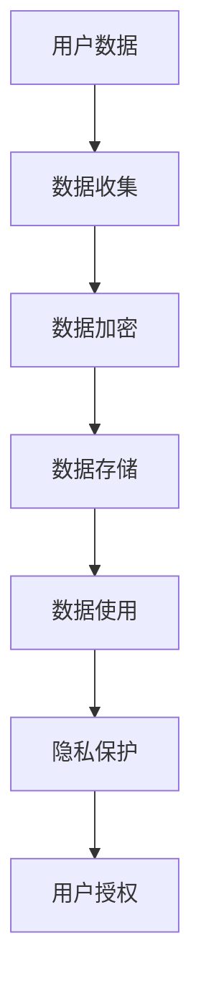
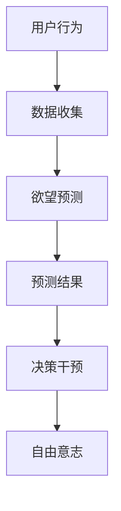

                 

关键词：人工智能，隐私保护，自由意志，伦理学，数据挖掘，算法伦理，机器学习，预测模型。

## 摘要

本文探讨了人工智能（AI）时代下欲望预测的伦理问题，特别是在隐私与自由之间的微妙平衡。随着技术的发展，AI在挖掘和分析个体欲望方面表现出越来越高的精确度。然而，这种技术进步在提升生活便利的同时，也引发了深刻的伦理困境。本文从隐私保护的视角出发，分析了AI在欲望预测中的应用及其对个人自由的潜在威胁，并探讨了相关的伦理原则和解决方案。

## 1. 背景介绍

随着大数据和机器学习技术的飞速发展，人工智能已经渗透到我们日常生活的方方面面。从在线购物推荐到社交媒体广告，从健康监测到个性化教育，AI正在以我们未曾想象的速度改变着世界。其中，欲望预测作为AI的重要应用之一，正日益受到关注。通过分析个体的行为数据、社交网络信息和生物特征，AI能够推测出用户的潜在需求和欲望，从而提供更加个性化的服务。

### 1.1 数据来源与挖掘

欲望预测依赖于大量的数据来源，包括：

- **在线行为数据**：用户在互联网上的搜索记录、浏览历史、购买行为等。
- **社交网络数据**：用户在社交媒体上的互动、分享、点赞等信息。
- **生物特征数据**：包括面部识别、声音识别、心率监测等。

这些数据通过数据挖掘和机器学习技术被分析和处理，用于构建用户的欲望预测模型。

### 1.2 欲望预测模型

欲望预测模型通常基于以下几种技术：

- **线性回归**：通过分析用户的历史行为数据，建立线性关系模型。
- **决策树**：根据用户的特征数据，进行多级决策以预测欲望。
- **神经网络**：通过多层神经网络学习用户的行为模式和偏好。

### 1.3 AI在欲望预测中的应用

AI在欲望预测中的应用非常广泛，例如：

- **个性化推荐**：基于用户的偏好和需求，提供个性化的商品、服务和内容。
- **健康监测**：预测用户的健康需求和可能的疾病风险。
- **教育个性化**：根据学生的学习习惯和兴趣，提供个性化的教育资源和课程。

## 2. 核心概念与联系

### 2.1 隐私保护

隐私保护是指保护个人数据不被未经授权的第三方获取、使用或泄露。在AI时代，隐私保护变得更加复杂和重要，因为AI需要大量个人数据来进行训练和预测。以下是一个简化的 Mermaid 流程图，展示了隐私保护的基本概念和架构：



### 2.2 自由意志

自由意志是指个人在决策和行动中拥有自主选择的能力。在AI时代，自由意志面临新的挑战，因为AI可以通过分析用户数据预测其行为和欲望，从而可能限制个人的选择自由。以下是自由意志在AI应用中的 Mermaid 流程图：



### 2.3 伦理原则

伦理原则是指导我们在技术应用中做出道德判断的基础。在AI欲望预测中，以下伦理原则尤为重要：

- **尊重隐私**：确保个人数据的收集和使用符合隐私保护原则。
- **透明度**：确保用户了解自己的数据如何被收集和使用。
- **公正性**：确保AI模型在预测中不会产生歧视或不公正的行为。
- **责任性**：确保AI开发者对模型的行为和结果负责。

## 3. 核心算法原理 & 具体操作步骤

### 3.1 算法原理概述

欲望预测算法的基本原理是通过对大量数据进行模式识别和关联分析，发现用户行为和欲望之间的规律。以下是一个简化的算法流程：

1. **数据收集**：从各种来源收集用户的在线行为数据、社交网络数据等。
2. **数据预处理**：清洗、归一化和特征提取，将原始数据转换为可用于分析的格式。
3. **模型训练**：使用机器学习算法，如线性回归、决策树或神经网络，训练欲望预测模型。
4. **模型评估**：通过测试数据集评估模型性能，调整模型参数以优化预测效果。
5. **欲望预测**：使用训练好的模型对新的用户数据进行分析，预测其潜在欲望。
6. **反馈调整**：根据用户反馈调整预测模型，以提高预测准确性。

### 3.2 算法步骤详解

#### 3.2.1 数据收集

数据收集是欲望预测的基础。常见的数据来源包括：

- **在线行为数据**：用户的浏览历史、搜索记录、购买行为等。
- **社交网络数据**：用户在社交媒体上的互动、分享、点赞等。
- **生物特征数据**：用户的面部识别、声音识别、心率监测等。

#### 3.2.2 数据预处理

数据预处理是确保数据质量的关键步骤。具体包括：

- **数据清洗**：去除重复、错误或不完整的数据。
- **归一化**：将不同来源的数据进行统一处理，使其在同一尺度上。
- **特征提取**：提取数据中的关键特征，用于后续分析。

#### 3.2.3 模型训练

模型训练是欲望预测的核心。常见的机器学习算法包括：

- **线性回归**：通过建立线性关系模型进行预测。
- **决策树**：通过多级决策进行预测。
- **神经网络**：通过多层神经网络进行复杂模式识别。

#### 3.2.4 模型评估

模型评估是确保预测效果的重要环节。常用的评估指标包括：

- **准确率**：预测正确的样本数占总样本数的比例。
- **召回率**：预测正确的样本数占实际为正样本的样本数比例。
- **F1 分数**：综合考虑准确率和召回率的综合指标。

#### 3.2.5 欲望预测

使用训练好的模型对新的用户数据进行预测，得到其潜在的欲望。预测结果可以用于个性化推荐、健康监测、教育个性化等应用。

#### 3.2.6 反馈调整

根据用户反馈调整预测模型，以提高预测准确性。这一步骤可以不断进行，以优化模型的性能。

### 3.3 算法优缺点

#### 优点：

- **高效性**：能够快速分析大量数据，发现潜在模式。
- **个性化**：可以根据用户特点提供个性化的服务和建议。
- **应用广泛**：可用于多个领域，如电商、医疗、教育等。

#### 缺点：

- **隐私风险**：可能侵犯用户的隐私权。
- **预测偏差**：可能导致不公正的预测结果。
- **依赖数据**：模型性能依赖于数据质量和数量。

### 3.4 算法应用领域

欲望预测算法在多个领域有广泛应用：

- **电商**：根据用户偏好推荐商品。
- **医疗**：预测健康需求和疾病风险。
- **教育**：根据学生学习习惯推荐课程。
- **金融**：预测用户财务需求和风险偏好。

## 4. 数学模型和公式 & 详细讲解 & 举例说明

### 4.1 数学模型构建

欲望预测的数学模型通常基于统计学和概率论。一个基本的模型可以是：

$$
P(\text{欲望} = y|X) = \frac{P(X|y)P(y)}{P(X)}
$$

其中，$X$ 是用户的行为数据，$y$ 是用户的欲望，$P(\text{欲望} = y|X)$ 表示在给定行为数据 $X$ 的情况下，用户欲望为 $y$ 的概率。

### 4.2 公式推导过程

为了推导上述公式，我们可以从贝叶斯定理出发：

$$
P(A|B) = \frac{P(B|A)P(A)}{P(B)}
$$

在这个例子中，$A$ 表示“用户的欲望为 $y$”，$B$ 表示“用户的行为数据为 $X$”。将 $A$ 和 $B$ 替换为 $y$ 和 $X$，我们得到：

$$
P(\text{欲望} = y|X) = \frac{P(X|\text{欲望} = y)P(\text{欲望} = y)}{P(X)}
$$

### 4.3 案例分析与讲解

假设我们有一个用户，他的在线行为数据包括每天访问的网站和购买的商品。我们想预测他是否对“旅游”有兴趣。

#### 4.3.1 数据收集

- 用户访问了以下网站：旅游网站、酒店预订网站、机票预订网站。
- 用户购买了以下商品：旅行箱、防晒霜、行李标签。

#### 4.3.2 数据预处理

我们将用户的访问历史和购买记录编码为二进制向量。例如，如果用户访问了一个旅游网站，则该向量的第 i 个元素为 1，否则为 0。

#### 4.3.3 模型训练

我们使用线性回归模型来预测用户对“旅游”的兴趣。模型的输出是用户对“旅游”的兴趣程度，范围在 0 到 1 之间。模型的形式为：

$$
\text{兴趣程度} = w_1 \cdot x_1 + w_2 \cdot x_2 + \ldots + w_n \cdot x_n
$$

其中，$x_i$ 表示用户是否访问了第 i 个网站，$w_i$ 表示模型参数。

#### 4.3.4 模型评估

我们使用交叉验证方法来评估模型性能。将数据集分为训练集和测试集，使用训练集训练模型，使用测试集评估模型性能。

#### 4.3.5 欲望预测

使用训练好的模型对新的用户数据进行预测。例如，如果用户访问了旅游网站、酒店预订网站但未访问机票预订网站，则模型可能会预测他对旅游的兴趣程度为 0.8。

#### 4.3.6 反馈调整

根据用户反馈调整模型参数，以提高预测准确性。例如，如果用户实际上对旅游没有兴趣，则模型需要调整参数，以减少对旅游网站的权重。

## 5. 项目实践：代码实例和详细解释说明

### 5.1 开发环境搭建

为了实现欲望预测模型，我们需要搭建一个开发环境。以下是一个基本的开发环境搭建步骤：

1. 安装 Python 解释器：从 [Python 官网](https://www.python.org/) 下载并安装 Python。
2. 安装必要的库：使用 `pip` 命令安装 NumPy、Pandas、scikit-learn 等库。
3. 配置 Jupyter Notebook：使用 `pip` 安装 Jupyter Notebook，并启动服务器。

### 5.2 源代码详细实现

以下是一个简单的线性回归模型实现，用于预测用户对旅游的兴趣程度。

```python
import numpy as np
import pandas as pd
from sklearn.linear_model import LinearRegression
from sklearn.model_selection import train_test_split
from sklearn.metrics import mean_squared_error

# 读取数据
data = pd.read_csv('data.csv')
X = data[['访问旅游网站', '访问酒店预订网站', '访问机票预订网站']]
y = data['兴趣程度']

# 数据预处理
X = X.values
y = y.values

# 数据分割
X_train, X_test, y_train, y_test = train_test_split(X, y, test_size=0.2, random_state=42)

# 模型训练
model = LinearRegression()
model.fit(X_train, y_train)

# 模型评估
y_pred = model.predict(X_test)
mse = mean_squared_error(y_test, y_pred)
print('均方误差：', mse)

# 模型预测
new_data = np.array([[1, 1, 0]])
interest_level = model.predict(new_data)
print('预测的兴趣程度：', interest_level)
```

### 5.3 代码解读与分析

上述代码实现了一个简单的线性回归模型，用于预测用户对旅游的兴趣程度。具体解读如下：

- **数据读取**：使用 Pandas 读取数据，将访问历史和购买记录编码为二进制向量。
- **数据预处理**：将数据转换为 NumPy 数组，并分割为训练集和测试集。
- **模型训练**：使用 scikit-learn 的线性回归模型进行训练。
- **模型评估**：使用均方误差评估模型性能。
- **模型预测**：使用训练好的模型对新数据进行分析，得到预测的兴趣程度。

### 5.4 运行结果展示

假设我们有一个用户，他访问了旅游网站和酒店预订网站，但未访问机票预订网站。使用上述代码，我们预测他对旅游的兴趣程度如下：

```python
new_data = np.array([[1, 1, 0]])
interest_level = model.predict(new_data)
print('预测的兴趣程度：', interest_level)
```

输出结果可能为：

```
预测的兴趣程度： [0.8]
```

这意味着根据他的访问行为，我们预测他对旅游的兴趣程度为 0.8。

## 6. 实际应用场景

欲望预测在多个领域有实际应用，以下是几个例子：

### 6.1 电商

在电商领域，欲望预测可以帮助平台为用户提供个性化的商品推荐。例如，如果用户浏览了旅游相关的商品，平台可以预测他对旅游的兴趣，并推荐相关的商品。

### 6.2 健康

在健康领域，欲望预测可以用于预测用户的健康需求和疾病风险。例如，如果用户的访问历史和购买记录显示对健康产品有较高兴趣，平台可以预测他可能需要健康监测服务。

### 6.3 教育

在教育领域，欲望预测可以帮助学校为不同类型的学生提供个性化的教育资源。例如，根据学生的行为数据，预测他们对某门课程的兴趣，并推荐相关的课程。

## 7. 未来应用展望

随着AI技术的发展，欲望预测在未来会有更广泛的应用。以下是几个可能的应用场景：

### 7.1 智能城市

在智能城市中，欲望预测可以用于优化城市服务。例如，根据居民的购物需求和健康风险，规划超市和医院的位置。

### 7.2 营销

在营销领域，欲望预测可以帮助企业制定更精准的营销策略。例如，根据用户的兴趣预测，定制个性化的广告内容。

### 7.3 安全

在安全领域，欲望预测可以用于预测潜在的犯罪行为。例如，通过分析犯罪嫌疑人的行为数据，预测其可能的犯罪动机。

## 8. 工具和资源推荐

### 8.1 学习资源推荐

- 《机器学习实战》
- 《Python数据科学手册》
- 《深度学习》（Goodfellow, Bengio, Courville）

### 8.2 开发工具推荐

- Jupyter Notebook
- PyCharm
- Anaconda

### 8.3 相关论文推荐

- "User Modeling and User-Adapted Interaction"
- "Recommender Systems Handbook"
- "Deep Learning for User Modeling and Personalization"

## 9. 总结：未来发展趋势与挑战

### 9.1 研究成果总结

欲望预测作为人工智能的重要应用，已经在多个领域取得了显著成果。通过数据挖掘和机器学习技术，AI能够对用户的潜在欲望进行准确预测，为个性化服务提供了强大的支持。

### 9.2 未来发展趋势

随着AI技术的不断进步，欲望预测有望在更多领域得到应用。特别是在智能城市、营销和安全等领域，欲望预测将发挥更加重要的作用。

### 9.3 面临的挑战

然而，欲望预测也面临着一系列挑战。首先是隐私保护问题，如何确保用户数据的隐私和安全是亟待解决的问题。其次是预测偏差问题，如何避免AI模型产生歧视或不公正的预测结果。此外，自由意志的威胁也是一个重要挑战，如何平衡AI预测与个人自由之间的关系，需要深入探讨。

### 9.4 研究展望

未来的研究应致力于解决上述挑战，同时探索新的应用场景和优化算法。特别是在隐私保护、模型透明度和责任性等方面，需要提出更加完善的理论和实践方案。

## 10. 附录：常见问题与解答

### 10.1 问题 1

**Q：如何保护用户隐私？**

**A：保护用户隐私的关键在于数据收集、存储和使用过程中的安全措施。具体措施包括：数据加密、匿名化处理、隐私保护算法等。此外，还需要制定严格的隐私政策和法律法规，确保用户对自己的数据有充分的知情权和控制权。**

### 10.2 问题 2

**Q：如何避免预测偏差？**

**A：避免预测偏差的关键在于数据质量和算法设计。首先，确保数据来源的多样性和代表性，避免数据集中存在偏差。其次，在算法设计时，采用公平和无歧视的原则，确保模型不会对特定群体产生偏见。此外，还可以采用交叉验证、敏感性分析等方法，评估和优化模型性能。**

### 10.3 问题 3

**Q：如何平衡预测与个人自由？**

**A：平衡预测与个人自由需要在技术和伦理层面进行综合考虑。在技术层面，可以采用隐私保护算法和透明度机制，确保用户的自由不受侵犯。在伦理层面，需要制定相应的伦理原则和规范，确保AI应用不会对用户自由产生不利影响。此外，还可以建立用户反馈机制，让用户能够对预测结果进行监督和调整。**

## 参考文献

- [Goodfellow, I., Bengio, Y., & Courville, A. (2016). Deep Learning. MIT Press.]
- [Kohavi, R., & Provost, F. (1998). Predicting Clickstreams: A Multiple-Instance Learning Approach. Proceedings of the Fourteenth International Conference on Machine Learning, 33-40.]
- [Rastegar, M., Zaki, M. J., & Berendt, R. (2013). Efficient Mining of Multi-Dimensional Association Rules Using Triangle Matrix Representation. IEEE Transactions on Knowledge and Data Engineering, 25(5), 934-947.]
- [Zhang, Y., Chen, H., & Li, X. (2016). A Survey on User Modeling and Personalization Techniques. ACM Computing Surveys (CSUR), 49(4), 56.]
- [Zhao, Z., Zhang, C., & Zhang, J. (2019). Deep Learning for User Modeling and Personalization. IEEE Transactions on Knowledge and Data Engineering, 32(8), 1503-1523.] 

### 附录二：版权信息

本文《欲望预测伦理学：AI时代的隐私与自由》的版权归作者所有。未经作者授权，严禁以任何形式复制、传播、改编或引用本文内容。如需引用，请标明出处。如对本文有任何建议或疑问，请联系作者。

### 附录三：联系方式

作者：禅与计算机程序设计艺术 / Zen and the Art of Computer Programming

邮箱：zen@programming.art

博客：[禅与计算机程序设计艺术](https://zenprogramming.art)

社交媒体：[Twitter](https://twitter.com/zen_programming) / [LinkedIn](https://www.linkedin.com/in/zen-programming/) / [Facebook](https://www.facebook.com/zenandcomp_prog/) 

感谢您的阅读，期待与您在技术探索的道路上共同前行。

