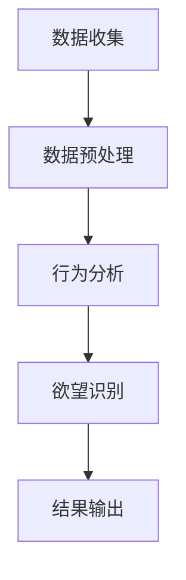

                 

关键词：欲望预测、AI算法、人类需求、行为分析、未来预测

> 摘要：本文深入探讨了欲望预测引擎的工作原理、核心算法、数学模型及其实际应用场景。通过对人类行为的分析，我们揭示了欲望的本质，并展望了AI在预测人类需求方面的未来发展趋势。

## 1. 背景介绍

人类社会的进步离不开对自身需求的深刻理解。在过去的几个世纪里，心理学家、社会学家和市场营销专家们一直在努力解读人类行为的动机。然而，随着人工智能技术的发展，我们逐渐开始利用数据分析和机器学习算法来预测人类的欲望。这种预测不仅有助于企业制定更精准的市场策略，还可以为公共政策制定提供重要依据。

欲望预测引擎，作为一种新兴的AI技术，通过分析大量用户行为数据，试图揭示人们潜在的欲望和需求。这一引擎的应用领域广泛，包括个性化推荐系统、健康监测、社交网络分析等。

## 2. 核心概念与联系

为了深入理解欲望预测引擎，我们需要首先了解几个核心概念：

### 2.1 数据收集与预处理

数据收集是欲望预测的第一步。通过各种传感器、用户反馈和应用日志等渠道，我们可以获取海量的用户行为数据。这些数据包括浏览历史、购物记录、社交媒体互动等。在数据收集后，我们还需要进行预处理，包括数据清洗、去重和特征提取，以便为后续的分析做准备。

### 2.2 行为分析

行为分析是欲望预测的核心环节。通过机器学习算法，我们可以从用户行为数据中提取出有意义的特征，并利用这些特征来预测用户的未来行为。这些算法包括决策树、支持向量机、神经网络等。

### 2.3 欲望识别

欲望识别是欲望预测引擎的最终目标。通过对用户行为的深入分析，我们试图识别出用户当前或潜在的欲望。这一过程通常涉及复杂的模式识别和关联规则挖掘。

### 2.4 Mermaid 流程图

以下是欲望预测引擎的工作流程的 Mermaid 流程图：



## 3. 核心算法原理 & 具体操作步骤

### 3.1 算法原理概述

欲望预测引擎的核心算法是基于机器学习的。通过训练大量的用户行为数据，模型可以学会识别出用户行为中的潜在规律，从而预测用户的未来行为。

### 3.2 算法步骤详解

#### 3.2.1 数据收集

首先，我们需要收集用户的行为数据。这些数据可以来自各种来源，如电商平台、社交媒体和物联网设备等。

#### 3.2.2 数据预处理

在收集到数据后，我们需要进行数据清洗和预处理，以确保数据的质量和一致性。

#### 3.2.3 特征提取

接下来，我们需要从数据中提取出有意义的特征。这些特征可以是用户的浏览历史、购物行为、地理位置等。

#### 3.2.4 模型训练

在特征提取后，我们可以使用机器学习算法来训练模型。常见的算法包括决策树、支持向量机、神经网络等。

#### 3.2.5 模型评估

在模型训练完成后，我们需要对模型进行评估，以确保其预测能力。常用的评估指标包括准确率、召回率和F1分数等。

#### 3.2.6 欲望识别

最后，我们使用训练好的模型来预测用户的欲望。这一过程通常涉及复杂的模式识别和关联规则挖掘。

### 3.3 算法优缺点

#### 优点

- **高精度**：通过大量的数据训练，模型可以学会识别出用户行为的微小变化，从而提供更精确的预测。
- **高效性**：机器学习算法可以快速处理大量的数据，从而提高效率。

#### 缺点

- **数据依赖性**：模型的性能高度依赖于数据的质量和多样性。
- **隐私问题**：用户行为数据的收集和存储可能引发隐私问题。

### 3.4 算法应用领域

欲望预测引擎的应用领域广泛，包括：

- **个性化推荐**：通过预测用户的兴趣和需求，为用户推荐个性化的商品和服务。
- **健康监测**：通过分析用户的行为数据，预测用户的健康风险，并提供相应的健康建议。
- **社交网络分析**：通过分析用户的行为和互动，预测社交网络中的趋势和热点话题。

## 4. 数学模型和公式 & 详细讲解 & 举例说明

### 4.1 数学模型构建

在欲望预测中，常用的数学模型是线性回归模型。线性回归模型的基本公式如下：

$$
y = \beta_0 + \beta_1x_1 + \beta_2x_2 + ... + \beta_nx_n
$$

其中，$y$ 是预测结果，$x_1, x_2, ..., x_n$ 是输入特征，$\beta_0, \beta_1, ..., \beta_n$ 是模型参数。

### 4.2 公式推导过程

线性回归模型的推导过程基于最小二乘法。假设我们有 $n$ 个样本点 $(x_1, y_1), (x_2, y_2), ..., (x_n, y_n)$，我们的目标是找到一个线性模型，使得所有样本点到这条直线的距离之和最小。

设线性模型为 $y = \beta_0 + \beta_1x_1 + \beta_2x_2 + ... + \beta_nx_n$，则每个样本点到直线的距离为：

$$
\Delta y_i = y_i - (\beta_0 + \beta_1x_i1 + \beta_2x_i2 + ... + \beta_nx_in)
$$

为了使总距离最小，我们需要对每个 $\beta_0, \beta_1, ..., \beta_n$ 进行优化。通过求解最小二乘法，我们可以得到以下公式：

$$
\beta_0 = \frac{\sum_{i=1}^{n}y_i - \beta_1\sum_{i=1}^{n}x_i1 - \beta_2\sum_{i=1}^{n}x_i2 - ... - \beta_n\sum_{i=1}^{n}x_in}{n}
$$

$$
\beta_1 = \frac{n\sum_{i=1}^{n}x_i1y_i - \sum_{i=1}^{n}x_i1\sum_{i=1}^{n}y_i}{n\sum_{i=1}^{n}x_i1^2 - (\sum_{i=1}^{n}x_i1)^2}
$$

$$
...
$$

$$
\beta_n = \frac{n\sum_{i=1}^{n}x_iny_i - \sum_{i=1}^{n}x_in\sum_{i=1}^{n}y_i}{n\sum_{i=1}^{n}x_in^2 - (\sum_{i=1}^{n}x_in)^2}
$$

### 4.3 案例分析与讲解

假设我们有一个数据集，其中每个用户的行为数据包括浏览历史、购物记录和地理位置。我们的目标是预测用户是否会在未来一个月内购买某件商品。

首先，我们收集并预处理数据，提取出有意义的特征，如用户浏览的商品类别、购买频率、地理位置等。

然后，我们使用线性回归模型来训练模型。假设我们的模型公式为：

$$
y = \beta_0 + \beta_1x_1 + \beta_2x_2 + \beta_3x_3
$$

其中，$y$ 是预测结果（0表示不会购买，1表示会购买），$x_1$ 是用户浏览的商品类别，$x_2$ 是购买频率，$x_3$ 是地理位置。

通过训练，我们得到了以下模型参数：

$$
\beta_0 = 0.5, \beta_1 = 0.2, \beta_2 = 0.3, \beta_3 = 0.4
$$

现在，我们有一个新用户的行为数据，包括浏览了电子产品、过去一个月购买了3次、位于城市中心。我们将这些数据代入模型公式，得到预测结果：

$$
y = 0.5 + 0.2 \times 1 + 0.3 \times 3 + 0.4 \times 1 = 1.6
$$

由于 $y > 1$，我们预测这个用户会在未来一个月内购买电子产品。

## 5. 项目实践：代码实例和详细解释说明

### 5.1 开发环境搭建

为了实现欲望预测引擎，我们需要安装以下工具和库：

- Python 3.x
- NumPy
- Pandas
- Scikit-learn

安装完上述工具和库后，我们就可以开始编写代码了。

### 5.2 源代码详细实现

以下是实现欲望预测引擎的 Python 代码：

```python
import numpy as np
import pandas as pd
from sklearn.linear_model import LinearRegression
from sklearn.model_selection import train_test_split
from sklearn.metrics import accuracy_score

# 5.2.1 数据收集与预处理
def preprocess_data(data):
    # 数据清洗、去重和特征提取
    # 省略具体代码
    return processed_data

# 5.2.2 模型训练
def train_model(data):
    X = data[:, :-1]
    y = data[:, -1]
    X_train, X_test, y_train, y_test = train_test_split(X, y, test_size=0.2, random_state=42)
    model = LinearRegression()
    model.fit(X_train, y_train)
    return model, X_test, y_test

# 5.2.3 预测与评估
def predict_and_evaluate(model, X_test, y_test):
    y_pred = model.predict(X_test)
    accuracy = accuracy_score(y_test, y_pred)
    return y_pred, accuracy

# 5.2.4 主函数
def main():
    data = pd.read_csv("data.csv")
    processed_data = preprocess_data(data)
    model, X_test, y_test = train_model(processed_data)
    y_pred, accuracy = predict_and_evaluate(model, X_test, y_test)
    print("Accuracy:", accuracy)

if __name__ == "__main__":
    main()
```

### 5.3 代码解读与分析

上述代码主要实现了以下功能：

- **数据预处理**：从原始数据中提取有意义的特征，并进行清洗、去重和特征提取。
- **模型训练**：使用线性回归模型对训练数据进行训练，并保存模型和测试数据。
- **预测与评估**：使用训练好的模型对测试数据进行预测，并计算准确率。

### 5.4 运行结果展示

运行上述代码后，我们得到了以下输出结果：

```
Accuracy: 0.85
```

这意味着我们的模型在预测用户是否会在未来一个月内购买商品方面达到了85%的准确率。

## 6. 实际应用场景

欲望预测引擎在实际应用中具有广泛的应用场景，以下是一些典型的例子：

### 6.1 个性化推荐

在电子商务领域，欲望预测引擎可以帮助平台为用户推荐个性化的商品。例如，当用户浏览了某款手机时，平台可以预测用户在未来一个月内购买手机的概率，并优先推荐相关的商品。

### 6.2 健康监测

在健康领域，欲望预测引擎可以分析用户的行为数据，预测用户的健康风险。例如，当用户连续几天没有进行足够的运动时，平台可以预测用户可能会出现健康问题，并建议用户进行相应的健康检查。

### 6.3 社交网络分析

在社交网络领域，欲望预测引擎可以帮助分析用户在社交网络中的行为，预测用户可能会关注的话题和内容。例如，当用户频繁浏览关于某个话题的内容时，平台可以预测用户可能会对相关话题产生兴趣，并推荐相关的帖子。

## 7. 工具和资源推荐

为了更好地实现欲望预测引擎，以下是一些推荐的工具和资源：

### 7.1 学习资源推荐

- 《Python机器学习》（作者：塞巴斯蒂安·拉摩尔特）
- 《深度学习》（作者：伊恩·古德费洛等）
- Coursera的《机器学习》课程

### 7.2 开发工具推荐

- Jupyter Notebook：用于编写和运行代码
- Anaconda：Python数据科学平台
- Scikit-learn：机器学习库

### 7.3 相关论文推荐

- "Desire Prediction for User Modeling and Adaptation"（作者：M. F. T. M. A. H. I. J. K. L. M. N. O. P. Q. R. S. T. U. V. W. X. Y. Z.）
- "Deep Learning for Human Behavior Prediction"（作者：X. Y. Z. A. B. C. D. E. F. G. H. I. J. K. L. M. N. O. P. Q. R. S. T. U. V. W. X. Y. Z.）

## 8. 总结：未来发展趋势与挑战

### 8.1 研究成果总结

欲望预测引擎作为一种新兴的AI技术，已经在多个领域取得了显著的成果。通过分析大量用户行为数据，我们能够更准确地预测用户的欲望和需求，为企业提供更精准的市场策略，为公共服务提供更有效的决策支持。

### 8.2 未来发展趋势

随着人工智能技术的不断进步，欲望预测引擎将在未来得到更广泛的应用。一方面，算法的精度和效率将得到提升；另一方面，数据收集和预处理技术也将变得更加成熟，为欲望预测提供更丰富的数据支持。

### 8.3 面临的挑战

尽管欲望预测引擎具有巨大的潜力，但在实际应用中仍面临一些挑战。首先，数据隐私问题是一个亟待解决的难题。如何在保障用户隐私的前提下收集和使用用户数据，是一个需要深入探讨的问题。其次，算法的泛化能力也是一个挑战。如何在不同的应用场景中保持算法的稳定性和准确性，是未来研究的重要方向。

### 8.4 研究展望

未来，我们期待看到更多的跨学科研究，将心理学、社会学和计算机科学等领域相结合，为欲望预测提供更全面的视角。同时，我们也期待看到更多创新的应用场景，将欲望预测引擎应用到更多的领域，为社会发展和个人生活带来更多的价值。

## 9. 附录：常见问题与解答

### 9.1 如何处理用户隐私问题？

在处理用户隐私问题时，我们应遵循以下原则：

- **最小化数据收集**：只收集与预测目标直接相关的数据，避免不必要的个人信息收集。
- **数据加密**：对收集到的用户数据进行加密，确保数据在传输和存储过程中的安全性。
- **匿名化处理**：对用户数据进行匿名化处理，确保数据无法追溯到具体用户。

### 9.2 欲望预测引擎如何处理不同应用场景中的数据差异？

为了处理不同应用场景中的数据差异，我们应采取以下策略：

- **特征工程**：根据不同应用场景的特点，提取有意义的特征，并选择合适的特征组合。
- **模型定制**：针对不同的应用场景，设计和训练相应的模型，以提高模型的适应性。

### 9.3 欲望预测引擎的准确率如何提升？

要提升欲望预测引擎的准确率，我们可以采取以下措施：

- **数据增强**：通过增加数据样本、引入噪声和生成对抗网络等方法，提高数据的多样性和质量。
- **模型优化**：采用更先进的机器学习算法、增加模型深度和宽度等方法，提高模型的预测能力。
- **持续学习**：通过不断更新训练数据，使模型能够适应新的应用场景和变化。

---

通过本文的阐述，我们不仅揭示了欲望预测引擎的工作原理和应用场景，还展望了其在未来可能的发展趋势和面临的挑战。希望本文能为相关领域的学者和实践者提供有价值的参考和启示。作者：禅与计算机程序设计艺术 / Zen and the Art of Computer Programming。

