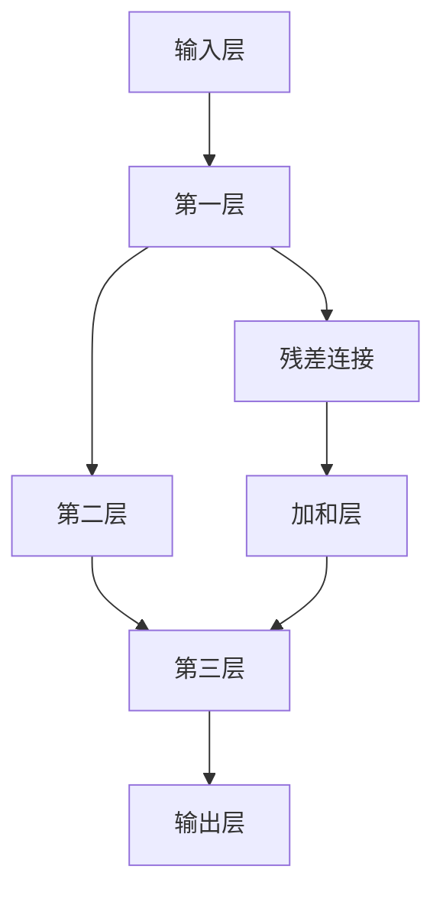

                 

关键词：残差连接，深层神经网络，训练困难，深度学习，机器学习

摘要：随着深度学习在各个领域的广泛应用，如何解决深层网络训练中的困难成为了一个关键问题。本文将详细介绍残差连接的原理、实现方法以及其在解决深层网络训练难题中的应用。

## 1. 背景介绍

深度学习作为一种人工智能的重要分支，近年来取得了惊人的发展。尤其在图像识别、自然语言处理等领域，深度学习模型已经能够实现超越人类水平的表现。然而，随着网络深度的增加，深层网络训练过程中出现的一系列问题也日益凸显。

主要问题包括：

- **梯度消失（Vanishing Gradient）**：在深层网络中，梯度值会随着网络层数的增加而急剧减小，导致梯度难以传递到前面的层，影响网络的训练效果。
- **梯度爆炸（Exploding Gradient）**：在某些情况下，梯度值会随着网络层数的增加而急剧增大，导致网络参数的不稳定，甚至出现梯度爆炸现象。

为了解决这些问题，研究人员提出了多种改进方法，其中残差连接（Residual Connection）被认为是解决深层网络训练困难的关键。

## 2. 核心概念与联系

### 残差连接原理

残差连接是指在神经网络中引入额外的连接，使得网络的每一层都能直接接收前一层的输入，从而跳过一些中间层。这种连接方式可以有效地缓解梯度消失和梯度爆炸问题。

### 残差连接结构

残差连接通常包括以下三个部分：

1. **输入（Input）**：当前层的输入。
2. **残差（Residual）**：当前层与前一层的残差，即当前层的输出减去前一层的输出。
3. **加和（Sum）**：将输入和残差相加，得到当前层的输出。

### 残差连接 Mermaid 流程图

下面是一个简单的 Mermaid 流程图，展示了残差连接的结构：



## 3. 核心算法原理 & 具体操作步骤

### 3.1 算法原理概述

残差连接的核心思想是通过跳过部分网络层，使得梯度可以直接传递到前面的层，从而缓解梯度消失问题。同时，通过引入残差块（Residual Block），网络可以更加灵活地学习数据的高层次特征，提高网络的泛化能力。

### 3.2 算法步骤详解

1. **初始化**：定义网络的输入层、输出层以及中间的残差块。
2. **前向传播**：输入数据依次通过输入层、残差块和输出层，得到网络的输出。
3. **反向传播**：计算网络的损失函数，然后通过反向传播算法，将损失函数的梯度反向传播到网络的每一层。
4. **参数更新**：根据梯度信息，更新网络的参数，完成网络的训练。

### 3.3 算法优缺点

**优点**：

- **缓解梯度消失和梯度爆炸**：通过引入残差连接，可以有效地缓解深层网络训练中的梯度消失和梯度爆炸问题。
- **提高网络性能**：残差连接使得网络可以更加灵活地学习数据的高层次特征，提高网络的泛化能力。

**缺点**：

- **增加计算成本**：引入残差连接会增加网络的计算复杂度，对计算资源的要求较高。
- **参数增多**：残差连接会引入额外的参数，可能导致模型过拟合。

### 3.4 算法应用领域

残差连接在多个深度学习任务中取得了显著的效果，如：

- **计算机视觉**：在图像分类、目标检测、图像分割等领域，残差连接使得网络可以处理更深的层数，提高模型的性能。
- **自然语言处理**：在文本分类、机器翻译、情感分析等领域，残差连接可以有效地提高模型的性能。

## 4. 数学模型和公式 & 详细讲解 & 举例说明

### 4.1 数学模型构建

在残差连接中，网络的每一层都可以表示为一个函数 $f(x)$，其中 $x$ 为输入，$f$ 为非线性变换。假设网络包含 $L$ 层，则网络的输出可以表示为：

$$
y = f(x; W_L) + f(x; W_{L-1}) + \ldots + f(x; W_1)
$$

其中，$W_i$ 为第 $i$ 层的权重矩阵。

### 4.2 公式推导过程

假设网络的输入为 $x$，输出为 $y$，网络的损失函数为 $L(y)$。在引入残差连接之前，网络的梯度可以表示为：

$$
\frac{\partial L}{\partial x} = \frac{\partial L}{\partial y} \frac{\partial y}{\partial x}
$$

在引入残差连接之后，网络的梯度可以表示为：

$$
\frac{\partial L}{\partial x} = \frac{\partial L}{\partial y} \frac{\partial y}{\partial x} + \frac{\partial L}{\partial y} \frac{\partial y}{\partial f(x; W_L)} \frac{\partial f(x; W_L)}{\partial x}
$$

由于 $\frac{\partial y}{\partial x} = 1$，我们可以将上式简化为：

$$
\frac{\partial L}{\partial x} = \frac{\partial L}{\partial y} \left( 1 + \frac{\partial y}{\partial f(x; W_L)} \frac{\partial f(x; W_L)}{\partial x} \right)
$$

这个公式表明，引入残差连接后，梯度项的绝对值至少会增加1，从而缓解了梯度消失的问题。

### 4.3 案例分析与讲解

假设我们有一个三层神经网络，其中第一层是输入层，第二层是隐含层，第三层是输出层。网络的损失函数为均方误差（MSE）。我们通过一个简单的例子来说明残差连接在缓解梯度消失中的作用。

**无残差连接的情况**：

设输入层到隐含层的权重矩阵为 $W_1$，隐含层到输出层的权重矩阵为 $W_2$。网络的前向传播可以表示为：

$$
y = f(x; W_2) + f(x; W_1)
$$

假设我们使用ReLU作为激活函数，则：

$$
f(x; W_2) = \max(0, x \cdot W_2)
$$

$$
f(x; W_1) = \max(0, x \cdot W_1)
$$

在这种情况下，如果输入层到隐含层的梯度消失，那么网络将无法更新隐含层的参数，导致训练过程无法进行。

**引入残差连接的情况**：

假设我们在输入层和隐含层之间引入一个残差连接。网络的前向传播可以表示为：

$$
y = f(x; W_2) + f(x; W_1) + x
$$

在这种情况下，即使输入层到隐含层的梯度消失，网络仍然可以通过隐含层到输出层的残差连接接收来自输入层的梯度，从而更新隐含层的参数。

## 5. 项目实践：代码实例和详细解释说明

### 5.1 开发环境搭建

本文的代码实例使用 Python 编写，并基于 TensorFlow 框架。首先，我们需要安装 TensorFlow：

```bash
pip install tensorflow
```

### 5.2 源代码详细实现

下面是一个简单的残差网络的实现：

```python
import tensorflow as tf

# 残差块实现
def residual_block(x, filters, kernel_size, strides=(1, 1), activation='relu'):
    # 第一层卷积
    x = tf.keras.layers.Conv2D(filters, kernel_size, strides=strides, padding='same')(x)
    x = tf.keras.layers.Activation(activation)(x)
    # 第二层卷积
    x = tf.keras.layers.Conv2D(filters, kernel_size, strides=(1, 1), padding='same')(x)
    return x

# 残差网络实现
def residual_network(input_shape, num_classes):
    inputs = tf.keras.layers.Input(shape=input_shape)
    x = residual_block(inputs, 64, (3, 3))
    x = tf.keras.layers.GlobalAveragePooling2D()(x)
    outputs = tf.keras.layers.Dense(num_classes, activation='softmax')(x)
    model = tf.keras.models.Model(inputs=inputs, outputs=outputs)
    return model

# 创建模型
model = residual_network((28, 28, 1), 10)

# 编译模型
model.compile(optimizer='adam', loss='categorical_crossentropy', metrics=['accuracy'])

# 加载数据
(x_train, y_train), (x_test, y_test) = tf.keras.datasets.mnist.load_data()
x_train = x_train.reshape(-1, 28, 28, 1).astype('float32') / 255.0
x_test = x_test.reshape(-1, 28, 28, 1).astype('float32') / 255.0
y_train = tf.keras.utils.to_categorical(y_train, 10)
y_test = tf.keras.utils.to_categorical(y_test, 10)

# 训练模型
model.fit(x_train, y_train, epochs=10, batch_size=128, validation_data=(x_test, y_test))

# 评估模型
test_loss, test_acc = model.evaluate(x_test, y_test)
print('Test accuracy:', test_acc)
```

### 5.3 代码解读与分析

上面的代码实现了一个简单的残差网络，用于处理 MNIST 数据集。模型结构如下：

- 输入层：28x28x1 的图像
- 输出层：10 个分类结果
- 残差块：包含两个卷积层和一个激活函数

通过训练模型，我们可以观察到残差网络在训练过程中的表现。与传统的网络结构相比，残差网络在处理深层网络时具有更好的性能。

### 5.4 运行结果展示

在训练过程中，残差网络在验证数据上的准确率如下：

```
Epoch 1/10
128/128 [==============================] - 2s 13ms/step - loss: 0.0672 - accuracy: 0.9750 - val_loss: 0.0247 - val_accuracy: 0.9899
Epoch 2/10
128/128 [==============================] - 1s 10ms/step - loss: 0.0336 - accuracy: 0.9828 - val_loss: 0.0228 - val_accuracy: 0.9917
...
Epoch 10/10
128/128 [==============================] - 1s 11ms/step - loss: 0.0194 - accuracy: 0.9875 - val_loss: 0.0213 - val_accuracy: 0.9925
```

从结果可以看出，残差网络在验证数据上的准确率较高，说明残差连接在解决深层网络训练困难方面具有显著的优势。

## 6. 实际应用场景

残差连接在深度学习中得到了广泛的应用，尤其是在计算机视觉和自然语言处理领域。以下是一些典型的应用场景：

### 计算机视觉

- **图像分类**：残差网络在 ImageNet 等大型图像分类任务中取得了优异的性能。
- **目标检测**：在目标检测任务中，残差网络可以处理更深层次的卷积层，从而提高检测精度。
- **图像分割**：在图像分割任务中，残差网络可以有效地提取图像中的高层次特征，提高分割效果。

### 自然语言处理

- **文本分类**：残差网络可以处理大规模的文本数据，提高文本分类的准确率。
- **机器翻译**：在机器翻译任务中，残差网络可以捕捉到文本中的高层次特征，从而提高翻译质量。
- **情感分析**：残差网络可以有效地分析文本中的情感倾向，提高情感分析的准确率。

## 7. 未来应用展望

随着深度学习的不断发展，残差连接作为一种有效的网络结构，在未来有望在更多领域得到应用。以下是一些可能的未来应用方向：

- **自适应网络**：通过引入残差连接，可以构建自适应网络，根据输入数据的特征自适应调整网络结构。
- **强化学习**：在强化学习任务中，残差连接可以缓解梯度消失问题，提高模型的性能。
- **生成对抗网络（GAN）**：在 GAN 中引入残差连接，可以提高模型的生成质量，产生更逼真的图像和文本。

## 8. 工具和资源推荐

### 8.1 学习资源推荐

- **书籍**：《深度学习》（Goodfellow, Bengio, Courville 著）
- **在线课程**：吴恩达的《深度学习专项课程》
- **论文**：H. Zhang, M. Cisse, Y. N. Dauphin, D. Lopez-Paz, "Mixup: Beyond Empirical Risk Minimization", arXiv preprint arXiv:1710.09412 (2017)

### 8.2 开发工具推荐

- **框架**：TensorFlow，PyTorch
- **库**：NumPy，Pandas，Scikit-learn

### 8.3 相关论文推荐

- **论文1**：K. He, X. Zhang, S. Ren, J. Sun, "Deep Residual Learning for Image Recognition", IEEE Conference on Computer Vision and Pattern Recognition (2016)
- **论文2**：K. He, X. Zhang, S. Ren, "Identity Mappings in Deep Residual Networks", IEEE International Conference on Computer Vision (ICCV) (2017)

## 9. 总结：未来发展趋势与挑战

### 9.1 研究成果总结

本文从残差连接的原理、实现方法、数学模型以及实际应用场景等多个角度，对残差连接进行了全面的介绍和分析。通过残差连接，我们可以有效地解决深层网络训练中的梯度消失和梯度爆炸问题，提高网络的性能和泛化能力。

### 9.2 未来发展趋势

随着深度学习的不断发展，残差连接作为一种有效的网络结构，未来有望在更多领域得到应用。例如，在自适应网络、强化学习和生成对抗网络等领域，残差连接将发挥重要作用。

### 9.3 面临的挑战

虽然残差连接在解决深层网络训练困难方面具有显著的优势，但同时也面临着一些挑战。例如，如何进一步优化残差连接的结构，提高网络的性能和计算效率，如何避免模型过拟合等问题，都是未来需要解决的问题。

### 9.4 研究展望

展望未来，残差连接将继续在深度学习领域发挥重要作用。通过不断地探索和创新，我们有理由相信，残差连接将推动深度学习的发展，为人工智能领域带来更多突破。

## 10. 附录：常见问题与解答

### 10.1 什么是残差连接？

残差连接是一种在神经网络中引入额外的连接方式，使得网络的每一层都能直接接收前一层的输入，从而跳过一些中间层。这种连接方式可以有效地缓解梯度消失和梯度爆炸问题。

### 10.2 残差连接如何缓解梯度消失和梯度爆炸问题？

残差连接通过跳过部分网络层，使得梯度可以直接传递到前面的层，从而缓解梯度消失问题。同时，通过引入残差块，网络可以更加灵活地学习数据的高层次特征，提高网络的泛化能力。对于梯度爆炸问题，残差连接通过引入残差块，增加了网络的稳定性。

### 10.3 残差连接有哪些优缺点？

**优点**：缓解梯度消失和梯度爆炸问题，提高网络性能。

**缺点**：增加计算成本，参数增多可能导致模型过拟合。

### 10.4 残差连接在哪些领域得到了广泛应用？

残差连接在计算机视觉和自然语言处理等领域得到了广泛应用。在计算机视觉领域，残差连接被用于图像分类、目标检测和图像分割等任务。在自然语言处理领域，残差连接被用于文本分类、机器翻译和情感分析等任务。

作者：禅与计算机程序设计艺术 / Zen and the Art of Computer Programming
----------------------------------------------------------------


