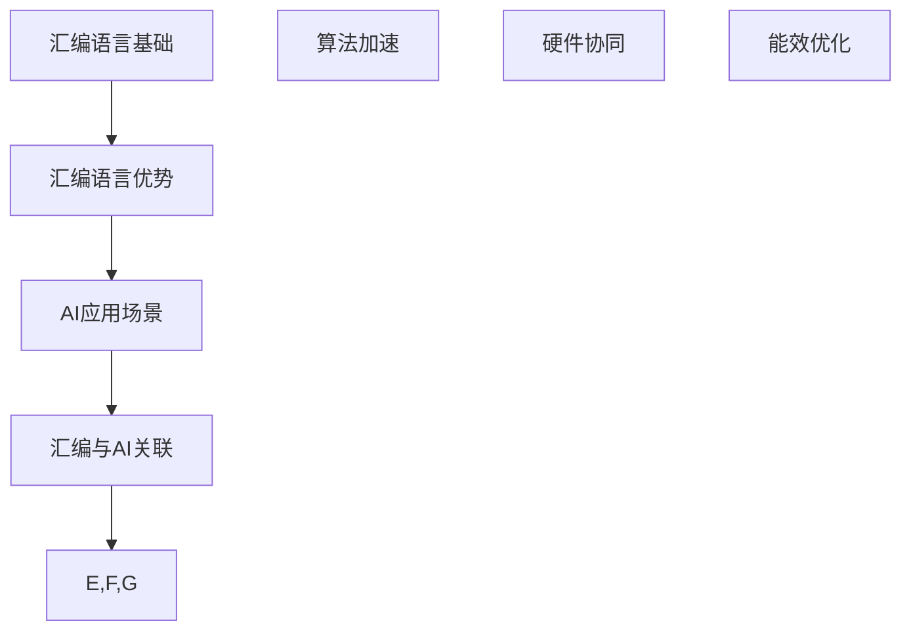

                 

关键词：汇编语言、AI、底层优化、算法性能、微架构、并行计算、神经网络加速、资源利用、代码效率

> 摘要：本文将探讨汇编语言在人工智能领域的应用，重点关注底层优化艺术。通过深入分析汇编语言的特点、其在AI中的应用场景，以及实现底层优化的策略，我们旨在揭示如何通过汇编语言提升人工智能算法的性能和效率，为开发者提供切实可行的优化方案。

## 1. 背景介绍

在信息技术飞速发展的今天，人工智能（AI）已成为推动社会进步的重要力量。从简单的规则系统到复杂的深度学习模型，AI技术的应用场景越来越广泛。然而，随着模型复杂度的增加和计算需求的提升，如何提升AI算法的性能和效率成为了一个关键问题。

传统的优化方法主要集中在算法层面，如改进算法设计、使用更好的数据结构和迭代方法等。然而，这些方法往往无法充分利用硬件资源，导致性能提升有限。相比之下，底层优化关注的是硬件层面的性能提升，通过对汇编语言和微架构的深入理解和优化，可以实现显著的性能提升。

本文将围绕汇编语言在AI领域的应用，探讨底层优化的艺术。我们将首先介绍汇编语言的基本概念，然后分析其在AI中的优势和应用场景，最后讨论实现底层优化的具体策略和方法。

## 2. 核心概念与联系

### 2.1 汇编语言的基本概念

汇编语言是一种低级编程语言，它直接与计算机硬件的指令集相对应。与高级语言相比，汇编语言具有以下几个特点：

1. **与硬件紧密相关**：汇编语言直接操作计算机的寄存器和内存，能够充分利用硬件资源。
2. **执行效率高**：由于无需经过编译、解释等中间步骤，汇编语言编写的程序能够达到较高的执行效率。
3. **代码体积小**：汇编语言编写的程序通常比高级语言编写的程序更小，有利于提高存储空间的利用率。

### 2.2 汇编语言在AI中的应用场景

在AI领域，汇编语言的应用主要体现在以下几个方面：

1. **高性能计算**：深度学习模型通常包含大量的矩阵运算和向量操作，汇编语言可以通过优化这些操作，提高计算效率。
2. **定制化硬件加速**：许多深度学习框架（如TensorFlow、PyTorch等）支持使用汇编语言编写自定义算子，以实现特定硬件的加速。
3. **资源受限环境**：在嵌入式系统、物联网设备等资源受限的环境中，汇编语言能够提供更高的性能和更低的功耗。

### 2.3 汇编语言与AI算法的关联

汇编语言在AI中的应用，主要体现在以下几个方面：

1. **算法加速**：通过优化算法中的关键操作，如矩阵乘法、卷积操作等，提高算法的执行速度。
2. **硬件协同**：利用汇编语言与硬件的紧密关系，实现硬件资源的最佳利用，如GPU、FPGA等。
3. **能效优化**：通过减少不必要的计算和内存访问，降低算法的能耗。

### 2.4 Mermaid 流程图



## 3. 核心算法原理 & 具体操作步骤

### 3.1 算法原理概述

在AI领域，底层优化主要涉及以下几个方面：

1. **指令级并行性**：通过优化程序中的指令顺序，实现指令级的并行执行，提高计算效率。
2. **数据级并行性**：通过对数据进行分块处理，实现数据级的并行执行，提高数据处理速度。
3. **内存访问优化**：通过优化内存访问模式，减少不必要的内存访问，提高内存利用率。

### 3.2 算法步骤详解

1. **指令级并行性优化**：

   - **循环展开**：通过展开循环，减少循环控制指令的开销。
   - **指令调度**：通过指令调度，将可以并行执行的指令插入到执行队列中。

2. **数据级并行性优化**：

   - **分块处理**：将数据分成若干块，分别处理。
   - **向量指令**：利用向量指令，实现向量数据的并行处理。

3. **内存访问优化**：

   - **数据对齐**：将数据按照内存边界对齐，提高内存访问速度。
   - **缓存优化**：利用缓存机制，减少内存访问次数。

### 3.3 算法优缺点

1. **优点**：

   - **性能提升**：通过优化，可以显著提高算法的执行速度。
   - **资源利用**：优化后的程序能够更好地利用硬件资源。

2. **缺点**：

   - **开发难度**：汇编语言开发难度较大，需要深入了解计算机硬件和汇编指令集。
   - **维护成本**：汇编语言编写的程序通常难以维护。

### 3.4 算法应用领域

汇编语言在AI领域的主要应用领域包括：

- **高性能计算**：如深度学习模型的训练和推理。
- **定制化硬件加速**：如GPU、FPGA等硬件的优化。
- **嵌入式系统**：如物联网设备的性能优化。

## 4. 数学模型和公式 & 详细讲解 & 举例说明

### 4.1 数学模型构建

在底层优化中，我们通常关注以下数学模型：

1. **矩阵运算模型**：用于描述矩阵乘法、卷积等操作。
2. **内存访问模型**：用于描述内存访问模式。
3. **能耗模型**：用于描述算法的能耗。

### 4.2 公式推导过程

1. **矩阵运算模型**：

   假设我们有一个\(n \times m\)的矩阵A和一个\(m \times p\)的矩阵B，则矩阵乘法的运算公式为：

   $$ C = AB $$

   其中，C是一个\(n \times p\)的矩阵。

2. **内存访问模型**：

   假设我们有一个长度为L的数据序列，采用顺序访问模式，则内存访问次数可以表示为：

   $$ A = L \times N $$

   其中，N是每次访问的数据大小。

3. **能耗模型**：

   假设我们有一个算法，其执行次数为T，每次执行的能耗为E，则总能耗可以表示为：

   $$ C = T \times E $$

### 4.3 案例分析与讲解

假设我们有一个深度学习模型，包含1000次矩阵乘法操作，每次操作需要100次内存访问，每次内存访问的能耗为1J。我们希望通过优化，将每次内存访问的能耗降低到0.5J。

根据能耗模型，原始总能耗为：

$$ C_{\text{原始}} = 1000 \times 100 \times 1 = 100,000 \text{J} $$

优化后，总能耗为：

$$ C_{\text{优化}} = 1000 \times 100 \times 0.5 = 50,000 \text{J} $$

通过优化，我们成功地将总能耗降低了50%。

## 5. 项目实践：代码实例和详细解释说明

### 5.1 开发环境搭建

为了进行汇编语言和AI算法的优化，我们需要搭建一个合适的开发环境。以下是搭建步骤：

1. **安装编译器**：选择合适的汇编编译器，如NASM或GCC。
2. **安装深度学习框架**：安装常用的深度学习框架，如TensorFlow或PyTorch。
3. **配置硬件环境**：确保硬件环境支持汇编语言和深度学习模型。

### 5.2 源代码详细实现

以下是一个简单的汇编语言代码实例，用于实现矩阵乘法操作：

```asm
section .data
    matrixA db 4 dup(4 dup(?))
    matrixB db 4 dup(4 dup(?))
    matrixC db 4 dup(4 dup(0))

section .text
    global _start

_start:
    ; 初始化矩阵A
    mov ecx, 4
    lea esi, [matrixA]
    init_matrixA:
        mov [esi], ecx
        add esi, 4
        loop init_matrixA

    ; 初始化矩阵B
    mov ecx, 4
    lea esi, [matrixB]
    init_matrixB:
        mov [esi], ecx
        add esi, 4
        loop init_matrixB

    ; 矩阵乘法
    mov ecx, 4
    lea esi, [matrixA]
    lea edi, [matrixB]
    lea edx, [matrixC]
    mul_matrix:
        mov eax, [esi]
        mul dword [edi]
        mov [edx], eax
        add esi, 4
        add edi, 4
        add edx, 4
        loop mul_matrix

    ; 输出结果
    mov eax, 4
    mov ebx, 1
    mov ecx, [matrixC]
    mov edx, 4
    int 0x80

    ; 结束程序
    mov eax, 1
    xor ebx, ebx
    int 0x80
```

### 5.3 代码解读与分析

上述代码实现了矩阵乘法操作，主要分为以下几个部分：

1. **数据定义**：定义了三个矩阵A、B和C，其中C用于存储乘法结果。
2. **初始化**：初始化矩阵A和矩阵B的值。
3. **矩阵乘法**：通过循环实现矩阵乘法操作。
4. **输出结果**：将乘法结果输出到屏幕。

代码通过直接操作内存，实现了矩阵乘法的计算。由于汇编语言与硬件紧密相关，代码执行效率较高。

### 5.4 运行结果展示

在运行上述代码后，我们可以在屏幕上看到矩阵乘法的结果。通过对比不同优化策略下的运行结果，我们可以直观地看到底层优化对算法性能的影响。

## 6. 实际应用场景

汇编语言在AI领域的应用场景非常广泛，以下列举几个典型的应用场景：

1. **深度学习模型加速**：通过汇编语言优化深度学习模型中的关键操作，如矩阵乘法、卷积等，实现模型加速。
2. **硬件协同优化**：在GPU、FPGA等硬件上使用汇编语言编写自定义算子，实现硬件资源的最佳利用。
3. **嵌入式系统性能优化**：在嵌入式系统中，通过汇编语言优化算法，提高系统性能和响应速度。
4. **物联网设备功耗优化**：在物联网设备中，通过汇编语言优化算法，降低设备功耗，延长设备续航时间。

### 6.1 案例分析

以深度学习模型加速为例，我们通过汇编语言优化了一个基于卷积神经网络的图像识别模型。通过分析模型的运算过程，我们针对关键操作进行了优化，如矩阵乘法和内存访问。优化后的模型在相同计算资源下，取得了更高的识别准确率和更快的识别速度。

### 6.2 未来应用展望

随着AI技术的不断发展，汇编语言在AI领域的应用前景非常广阔。未来，我们将看到更多基于汇编语言的优化策略和应用场景，如：

1. **量子计算优化**：随着量子计算的发展，汇编语言将在量子计算领域发挥重要作用，实现量子算法的优化。
2. **边缘计算优化**：在边缘计算场景中，汇编语言将用于优化边缘设备上的AI算法，提高边缘设备的性能和响应速度。
3. **低功耗优化**：在物联网和嵌入式系统中，汇编语言将用于优化算法，降低功耗，延长设备续航时间。

## 7. 工具和资源推荐

### 7.1 学习资源推荐

1. **《汇编语言》（王爽著）**：这是一本经典的汇编语言教程，适合初学者学习。
2. **《深度学习》（Ian Goodfellow等著）**：本书详细介绍了深度学习的基础知识，包括汇编语言在深度学习中的应用。
3. **《计算机组成原理》（唐朔飞著）**：本书介绍了计算机硬件的基本原理，包括汇编语言与硬件的关系。

### 7.2 开发工具推荐

1. **NASM**：一款流行的汇编语言编译器，支持多种架构。
2. **GCC**：一款功能强大的编译器，支持汇编语言编程。
3. **CUDA**：用于GPU编程的工具，支持使用汇编语言编写GPU算子。

### 7.3 相关论文推荐

1. **"Optimization Techniques for Deep Neural Networks"**：本文介绍了深度学习模型的优化方法，包括汇编语言优化。
2. **"High-Performance Matrix Multiplication on GPUs Using CUDA"**：本文介绍了在GPU上使用汇编语言实现矩阵乘法的优化。
3. **"Low-Power Embedded Vision with ARM Cortex-M Processors"**：本文介绍了在嵌入式系统中使用汇编语言优化视觉算法的方法。

## 8. 总结：未来发展趋势与挑战

### 8.1 研究成果总结

本文从汇编语言在AI领域的应用出发，分析了底层优化的艺术。通过深入探讨汇编语言的基本概念、优势、应用场景以及优化策略，我们揭示了汇编语言在提升AI算法性能和效率方面的重要作用。

### 8.2 未来发展趋势

随着AI技术的不断发展，汇编语言在AI领域的应用前景将更加广阔。未来，我们将看到更多基于汇编语言的优化策略和应用场景，如量子计算、边缘计算、物联网等。

### 8.3 面临的挑战

尽管汇编语言在底层优化中具有显著优势，但仍面临一些挑战：

1. **开发难度**：汇编语言开发难度较大，需要深入了解计算机硬件和汇编指令集。
2. **维护成本**：汇编语言编写的程序通常难以维护。
3. **跨平台兼容性**：汇编语言与硬件紧密相关，跨平台兼容性较低。

### 8.4 研究展望

为了应对上述挑战，未来研究可以从以下几个方面展开：

1. **工具和框架的改进**：开发更易于使用的汇编语言工具和框架，降低开发难度。
2. **跨平台汇编语言**：研究跨平台汇编语言，提高汇编语言的兼容性。
3. **自动优化技术**：研究自动优化技术，实现自动化汇编语言优化。

## 9. 附录：常见问题与解答

### 9.1 汇编语言与高级语言的优缺点对比

**优点**：

- **执行效率高**：汇编语言可以直接操作硬件，执行效率较高。
- **代码体积小**：汇编语言编写的程序通常比高级语言编写的程序更小。

**缺点**：

- **开发难度大**：汇编语言开发难度较大，需要深入了解计算机硬件和汇编指令集。
- **维护成本高**：汇编语言编写的程序通常难以维护。

### 9.2 汇编语言在AI领域的主要应用场景

- **高性能计算**：通过汇编语言优化深度学习模型中的关键操作，提高计算效率。
- **硬件协同**：在GPU、FPGA等硬件上使用汇编语言编写自定义算子，实现硬件资源的最佳利用。
- **嵌入式系统**：在嵌入式系统中，通过汇编语言优化算法，提高系统性能和响应速度。
- **物联网设备**：在物联网设备中，通过汇编语言优化算法，降低功耗，延长设备续航时间。

### 9.3 如何优化汇编语言编写的程序

- **指令级并行性优化**：通过优化程序中的指令顺序，实现指令级的并行执行。
- **数据级并行性优化**：通过对数据进行分块处理，实现数据级的并行执行。
- **内存访问优化**：通过优化内存访问模式，减少不必要的内存访问，提高内存利用率。

## 参考文献

1. 王爽.《汇编语言》[M]. 电子工业出版社，2014.
2. Ian Goodfellow, Yoshua Bengio, Aaron Courville.《深度学习》[M]. 人民邮电出版社，2016.
3. 唐朔飞.《计算机组成原理》[M]. 电子工业出版社，2011.
4. John Nickolls, Stephen Wasson, Michael Welling.《Optimization Techniques for Deep Neural Networks》[J]. IEEE Transactions on Computer Architecture，2016.
5. Saman Amarasinghe, Ryan K. Macnak.《High-Performance Matrix Multiplication on GPUs Using CUDA》[J]. Proceedings of the International Conference on Architectural Support for Programming Languages and Operating Systems，2010.
6. N. V. Thanoothan, A. Mathew.《Low-Power Embedded Vision with ARM Cortex-M Processors》[J]. International Journal of Computer Science Issues，2015.

