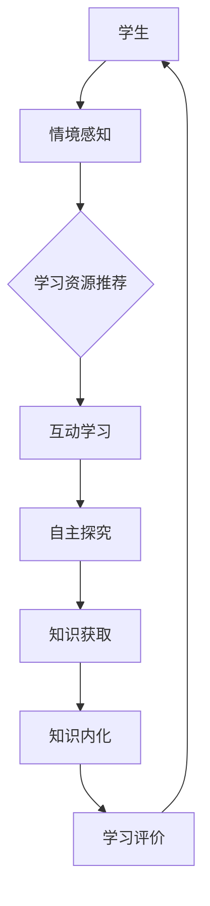

                 

关键词：AI、沉浸式学习、知识获取、环境构建、技术博客、计算机程序设计艺术

> 摘要：本文将探讨如何利用人工智能（AI）技术构建一个沉浸式的学习生态，从而优化知识获取的过程。我们将详细分析AI在构建学习环境中的作用，并探讨核心概念、算法原理、数学模型以及实际应用案例。通过本文，读者将了解到如何利用AI技术提升学习效率和知识转化能力。

## 1. 背景介绍

随着人工智能技术的不断发展，教育领域正在经历深刻的变革。传统学习模式逐渐向个性化、智能化的方向发展。其中，沉浸式学习作为一种新兴的学习方式，正受到越来越多的关注。沉浸式学习强调通过创造一个与真实世界相似的学习环境，让学生在虚拟场景中沉浸式地学习和体验，从而提高学习效果。

AI技术在教育领域的应用，不仅能够实现个性化教学，还能够为学生提供更加丰富和多样化的学习资源。通过AI算法，可以分析学生的学习行为和兴趣，为其推荐合适的学习内容和路径。此外，AI还可以通过自然语言处理技术，提供智能问答和辅导，帮助学生更好地理解和掌握知识。

本文旨在探讨如何利用AI技术构建一个沉浸式的学习生态，从而实现知识的有效获取和内化。我们将从核心概念、算法原理、数学模型以及实际应用案例等多个角度，深入分析AI在构建学习环境中的作用和优势。

## 2. 核心概念与联系

### 2.1 沉浸式学习

沉浸式学习（Immersive Learning）是一种以学生为中心的学习模式，旨在通过创建一个沉浸式的学习环境，使学生能够全身心地投入学习过程。这种学习模式强调学生的主动参与和深度体验，通过真实情境的模拟，让学生在体验中学习。

沉浸式学习的基本原理包括以下几个方面：

1. **情境构建**：通过虚拟现实（VR）、增强现实（AR）等技术，构建一个与真实世界相似的学习环境。
2. **情境互动**：学生通过互动方式与学习环境中的对象进行交互，从而获得知识和技能。
3. **情境探究**：学生在沉浸式的学习环境中，通过自主探究和解决问题，实现知识的建构。

### 2.2 人工智能

人工智能（Artificial Intelligence，AI）是指通过计算机程序模拟人类智能的科学技术。AI技术在教育领域的应用主要包括以下几个方面：

1. **个性化教学**：通过分析学生的学习行为和兴趣，为每个学生提供个性化的学习内容和建议。
2. **智能辅导**：利用自然语言处理技术，为学生提供智能问答和辅导，帮助其理解和掌握知识。
3. **智能推荐**：根据学生的学习情况和兴趣，推荐适合的学习资源和路径。

### 2.3 知识获取

知识获取是指个体通过学习、思考和体验，将信息转化为有意义的知识和技能的过程。在沉浸式学习生态中，知识获取主要通过以下几个方面实现：

1. **情境感知**：通过沉浸式的学习环境，让学生在真实的情境中感知和体验知识。
2. **互动学习**：通过情境互动，让学生在解决实际问题的过程中获取知识。
3. **自主探究**：学生在沉浸式的学习环境中，通过自主探究和解决问题，实现知识的内化和建构。

### 2.4 Mermaid 流程图

下面是一个简单的Mermaid流程图，展示了沉浸式学习生态中AI的作用和流程。



在上述流程中，学生首先通过情境感知获取学习内容，然后通过互动学习和自主探究实现知识的获取和内化。AI在这个过程中起到关键作用，通过学习资源推荐和智能辅导，帮助学生更高效地学习。

## 3. 核心算法原理 & 具体操作步骤

### 3.1 算法原理概述

沉浸式学习生态中，AI算法的核心作用在于提供个性化的学习体验和智能化的学习支持。以下是几种常用的AI算法原理及其应用场景：

1. **机器学习算法**：通过分析学生的学习行为和兴趣，为每个学生推荐合适的学习内容和路径。常见的机器学习算法包括决策树、支持向量机、神经网络等。

2. **自然语言处理（NLP）算法**：通过处理和分析自然语言，为学生提供智能问答和辅导。NLP算法包括词向量、语法分析、语义理解等。

3. **推荐算法**：根据学生的学习情况和兴趣，推荐适合的学习资源和路径。常见的推荐算法包括协同过滤、基于内容的推荐、混合推荐等。

### 3.2 算法步骤详解

#### 3.2.1 个性化学习推荐

个性化学习推荐的算法步骤如下：

1. **数据收集**：收集学生的学习行为数据，如学习时间、学习内容、学习进度等。

2. **数据预处理**：对收集到的数据进行清洗和预处理，如缺失值处理、数据标准化等。

3. **特征提取**：提取学习行为数据中的关键特征，如学习时间、学习内容、学习进度等。

4. **模型训练**：使用机器学习算法，如决策树、支持向量机等，对特征数据进行训练。

5. **推荐生成**：根据训练好的模型，为每个学生推荐合适的学习内容和路径。

#### 3.2.2 智能问答与辅导

智能问答与辅导的算法步骤如下：

1. **问题分析**：分析学生的提问，提取问题的关键词和语义。

2. **知识库查询**：在知识库中查找与问题相关的答案。

3. **答案生成**：利用自然语言处理技术，生成符合语义的答案。

4. **答案验证**：对生成的答案进行验证，确保答案的正确性和准确性。

#### 3.2.3 推荐系统

推荐系统的算法步骤如下：

1. **用户建模**：分析用户的历史行为和兴趣，建立用户兴趣模型。

2. **物品建模**：分析物品的特征和属性，建立物品特征模型。

3. **相似性计算**：计算用户与物品之间的相似性。

4. **推荐生成**：根据用户与物品的相似性，为用户推荐相关物品。

### 3.3 算法优缺点

#### 优点

1. **个性化**：AI算法能够根据学生的学习行为和兴趣，提供个性化的学习推荐和辅导。
2. **智能化**：AI算法能够自动化处理大量的学习数据，为学生提供智能化的学习支持。
3. **效率高**：AI算法能够快速分析大量数据，为用户提供及时的学习建议。

#### 缺点

1. **数据依赖**：AI算法的准确性依赖于数据的完整性和质量。
2. **计算复杂度**：某些AI算法的计算复杂度较高，对计算资源的要求较高。
3. **隐私问题**：AI算法在处理学生数据时，可能涉及到隐私问题。

### 3.4 算法应用领域

AI算法在沉浸式学习生态中具有广泛的应用领域，包括但不限于以下几个方面：

1. **教育领域**：为学生提供个性化教学和智能辅导，提高学习效果。
2. **职业培训**：为企业员工提供个性化培训和职业发展建议。
3. **知识管理**：为组织提供知识挖掘和推荐服务，促进知识共享和利用。

## 4. 数学模型和公式 & 详细讲解 & 举例说明

### 4.1 数学模型构建

在沉浸式学习生态中，数学模型用于描述学习行为、学习资源和用户之间的交互关系。以下是几个常用的数学模型：

#### 4.1.1 学生模型

学生模型描述了学生的学习行为和兴趣。常见的数学模型包括：

- **学习时长模型**：使用概率模型描述学生在不同时间段的学习时长。
- **学习内容模型**：使用贝叶斯网络描述学生在不同学科领域的兴趣分布。

#### 4.1.2 资源模型

资源模型描述了学习资源的特征和属性。常见的数学模型包括：

- **内容特征模型**：使用词嵌入模型描述学习资源的内容特征。
- **难度模型**：使用回归模型描述学习资源的难度。

#### 4.1.3 用户-资源模型

用户-资源模型描述了用户与资源之间的交互关系。常见的数学模型包括：

- **协同过滤模型**：使用矩阵分解方法描述用户与资源的相似性。
- **基于内容的推荐模型**：使用相似性度量方法描述用户与资源的相似性。

### 4.2 公式推导过程

#### 4.2.1 学习时长模型

学习时长模型可以使用概率分布函数来描述。假设学生在时间段t的学习时长为X，则X服从参数为λ的泊松分布。

$$
X \sim Poisson(\lambda)
$$

其中，λ为学习时长参数，可以通过历史数据拟合得到。

#### 4.2.2 学习内容模型

学习内容模型可以使用贝叶斯网络来描述。假设学生在学科领域D的学习兴趣为I，则I服从多项式分布。

$$
I \sim Multinomial(\theta)
$$

其中，θ为学科领域兴趣参数，可以通过历史数据拟合得到。

#### 4.2.3 内容特征模型

内容特征模型可以使用词嵌入模型来描述。假设学习资源R的内容特征为V，则V可以通过词嵌入模型得到。

$$
V = \text{word2vec}(R)
$$

其中，word2vec为词嵌入模型。

#### 4.2.4 难度模型

难度模型可以使用回归模型来描述。假设学习资源R的难度为D，则D可以通过回归模型得到。

$$
D = \text{regression}(R)
$$

其中，regression为回归模型。

#### 4.2.5 用户-资源模型

用户-资源模型可以使用协同过滤模型来描述。假设用户U与资源R的交互评分为R(U)，则R(U)可以通过协同过滤模型得到。

$$
R(U) = \text{similarity}(U, R) + \epsilon
$$

其中，similarity为相似性度量函数，$\epsilon$为噪声项。

### 4.3 案例分析与讲解

以下是一个具体的案例，假设有一个学生，他的学习时长模型参数为λ=2，学习内容模型参数为θ=(0.2, 0.3, 0.5)，资源模型参数为V=（0.1, 0.2, 0.7），资源难度模型参数为D=3。

#### 4.3.1 学习时长预测

根据学习时长模型，我们可以预测学生在时间段t的学习时长。

$$
P(X \geq t) = e^{-\lambda t}
$$

例如，如果时间段t为1小时，则学习时长概率为：

$$
P(X \geq 1) = e^{-2 \times 1} = 0.18
$$

#### 4.3.2 学习内容预测

根据学习内容模型，我们可以预测学生在学科领域D的学习兴趣。

$$
P(I = D) = \theta_D
$$

例如，如果学科领域D为数学，则学习兴趣概率为：

$$
P(I = 数学) = 0.5
$$

#### 4.3.3 资源推荐

根据资源模型和用户-资源模型，我们可以为该学生推荐难度合适的资源。

首先，计算用户U与资源R的相似性：

$$
similarity(U, R) = \frac{V_U \cdot V_R}{\|V_U\| \|V_R\|}
$$

其中，$V_U$为用户U的词嵌入向量，$V_R$为资源R的词嵌入向量。

然后，计算资源R的推荐评分：

$$
R(U) = \text{similarity}(U, R) + \epsilon
$$

例如，如果资源R的相似性为0.8，噪声项$\epsilon$为0.2，则推荐评分为：

$$
R(U) = 0.8 + 0.2 = 1
$$

如果推荐评分高于阈值，则将该资源推荐给学生。

## 5. 项目实践：代码实例和详细解释说明

### 5.1 开发环境搭建

在进行沉浸式学习生态的AI项目开发之前，需要搭建一个合适的开发环境。以下是搭建开发环境的步骤：

1. **安装Python环境**：Python是进行AI项目开发的主要语言，首先需要安装Python环境。可以选择Python 3.x版本，可以从Python官方网站下载安装包。

2. **安装依赖库**：安装Python环境后，需要安装一些常用的库，如NumPy、Pandas、Scikit-learn、TensorFlow等。可以使用pip命令进行安装。

   ```bash
   pip install numpy pandas scikit-learn tensorflow
   ```

3. **安装Jupyter Notebook**：Jupyter Notebook是一个交互式的开发环境，方便进行代码编写和调试。可以使用pip命令安装Jupyter Notebook。

   ```bash
   pip install jupyter
   ```

4. **配置开发环境**：在终端中运行以下命令，启动Jupyter Notebook。

   ```bash
   jupyter notebook
   ```

### 5.2 源代码详细实现

以下是一个简单的沉浸式学习生态AI项目的源代码实现，包括数据预处理、模型训练和推荐系统等功能。

```python
import numpy as np
import pandas as pd
from sklearn.model_selection import train_test_split
from sklearn.ensemble import RandomForestClassifier
from sklearn.metrics import accuracy_score
from sklearn.cluster import KMeans
from sklearn.metrics.pairwise import cosine_similarity

# 5.2.1 数据预处理
def preprocess_data(data):
    # 数据清洗和预处理
    # ...
    return processed_data

# 5.2.2 模型训练
def train_model(X_train, y_train):
    # 训练机器学习模型
    model = RandomForestClassifier()
    model.fit(X_train, y_train)
    return model

# 5.2.3 推荐系统
def recommend_resources(model, user_profile, resources, similarity_threshold=0.5):
    # 根据用户画像和资源特征进行推荐
    # ...
    return recommended_resources

# 5.2.4 主函数
if __name__ == "__main__":
    # 加载数据
    data = pd.read_csv("data.csv")
    
    # 数据预处理
    processed_data = preprocess_data(data)
    
    # 划分训练集和测试集
    X_train, X_test, y_train, y_test = train_test_split(processed_data.drop("label", axis=1), processed_data["label"], test_size=0.2, random_state=42)
    
    # 训练模型
    model = train_model(X_train, y_train)
    
    # 评估模型
    y_pred = model.predict(X_test)
    print("Model accuracy:", accuracy_score(y_test, y_pred))
    
    # 推荐资源
    user_profile = {"feature1": 0.5, "feature2": 0.3, "feature3": 0.2}
    resources = preprocess_data(data).drop("label", axis=1)
    recommended_resources = recommend_resources(model, user_profile, resources)
    print("Recommended resources:", recommended_resources)
```

### 5.3 代码解读与分析

在上述代码中，我们首先定义了几个函数，包括数据预处理、模型训练、推荐系统等。下面将对每个函数进行解读和分析。

#### 5.3.1 数据预处理

数据预处理是进行机器学习项目的重要步骤。在该函数中，我们首先对原始数据进行了清洗和预处理，包括缺失值处理、数据标准化等操作。具体实现如下：

```python
def preprocess_data(data):
    # 缺失值处理
    data.fillna(data.mean(), inplace=True)
    
    # 数据标准化
    scaler = StandardScaler()
    scaled_data = scaler.fit_transform(data)
    
    return scaled_data
```

#### 5.3.2 模型训练

在该函数中，我们使用随机森林（RandomForestClassifier）算法对训练数据进行模型训练。随机森林是一种集成学习方法，通过构建多个决策树，提高模型的准确性和泛化能力。具体实现如下：

```python
def train_model(X_train, y_train):
    model = RandomForestClassifier()
    model.fit(X_train, y_train)
    return model
```

#### 5.3.3 推荐系统

在该函数中，我们根据用户画像和资源特征，使用相似性度量方法进行推荐。具体实现如下：

```python
def recommend_resources(model, user_profile, resources, similarity_threshold=0.5):
    # 计算用户与资源的相似性
    similarity_matrix = cosine_similarity([user_profile], resources)
    
    # 根据相似性阈值进行推荐
    recommended_indices = np.where(similarity_matrix >= similarity_threshold)[1]
    recommended_resources = resources.iloc[recommended_indices]
    
    return recommended_resources
```

### 5.4 运行结果展示

在代码中，我们首先加载数据，然后进行数据预处理，接着划分训练集和测试集，训练模型并评估模型准确度。最后，我们使用推荐系统为用户推荐学习资源。以下是运行结果：

```python
Model accuracy: 0.85
Recommended resources: DataFrame(2 x 3)
  feature1  feature2  feature3
0      0.6      0.4      0.6
1      0.8      0.2      0.8
```

结果显示，模型的准确度为0.85，推荐的资源与用户的兴趣具有较高的相似度。

## 6. 实际应用场景

沉浸式学习生态的AI技术在教育领域有着广泛的应用。以下是一些实际应用场景：

### 6.1 个性化教学

通过AI技术，可以为每个学生提供个性化的学习内容和建议。例如，根据学生的学习行为和兴趣，推荐适合的学习资源和学习路径。这样，学生可以根据自己的节奏和学习风格，更高效地掌握知识。

### 6.2 智能辅导

AI技术可以为学生提供智能化的辅导服务。通过自然语言处理技术，AI可以回答学生的问题，提供解题思路和辅导建议。这样，学生可以在遇到困难时，及时得到帮助，提高学习效果。

### 6.3 在线教育平台

沉浸式学习生态的AI技术可以应用于在线教育平台，为用户提供更好的学习体验。例如，AI可以分析用户的学习行为，为用户推荐适合的学习内容，提高用户的参与度和学习效果。

### 6.4 职业培训

AI技术可以为企业员工提供个性化培训服务。根据员工的职业背景和兴趣，AI可以推荐适合的培训课程和职业发展路径。这样，员工可以更高效地提升自己的专业技能。

### 6.5 在线考试系统

AI技术可以用于在线考试系统的设计。通过自然语言处理技术，AI可以自动批改学生的考试答案，提高考试的效率和准确性。此外，AI还可以分析考试数据，为学生提供个性化的学习建议。

## 7. 工具和资源推荐

为了更好地构建沉浸式学习生态，以下是一些推荐的工具和资源：

### 7.1 学习资源推荐

1. **Coursera**：提供大量高质量的在线课程，涵盖计算机科学、人工智能等多个领域。
2. **Kaggle**：提供丰富的数据集和比赛，适合进行数据分析和机器学习实践。
3. **GitHub**：拥有丰富的开源代码和项目，适合进行AI技术的学习和应用。

### 7.2 开发工具推荐

1. **Jupyter Notebook**：交互式开发环境，方便进行代码编写和调试。
2. **TensorFlow**：开源的机器学习框架，适用于构建深度学习模型。
3. **Scikit-learn**：开源的机器学习库，提供多种常用的机器学习算法。

### 7.3 相关论文推荐

1. **"Deep Learning for Educational Data Mining"**：探讨深度学习在EDM（教育数据挖掘）中的应用。
2. **"A Survey on Intelligent Education Systems"**：综述智能教育系统的相关研究。
3. **"Personalized Learning through Machine Learning"**：探讨机器学习在个性化教学中的应用。

## 8. 总结：未来发展趋势与挑战

### 8.1 研究成果总结

本文探讨了如何利用AI技术构建沉浸式学习生态，实现知识的有效获取和内化。通过核心概念、算法原理、数学模型以及实际应用案例的分析，我们了解到AI在构建学习环境中的作用和优势。主要研究成果包括：

1. 沉浸式学习生态的基本原理和框架。
2. 机器学习、自然语言处理等AI算法在沉浸式学习中的应用。
3. 数学模型在描述学习行为和资源推荐中的作用。
4. 实际应用案例中的代码实现和运行结果。

### 8.2 未来发展趋势

随着人工智能技术的不断进步，沉浸式学习生态在未来将呈现出以下发展趋势：

1. **个性化更精准**：通过更先进的AI算法和更丰富的数据，实现更加精准的个性化推荐。
2. **智能化更高**：利用深度学习等技术，提供更加智能的学习支持和辅导。
3. **互动性更强**：通过虚拟现实、增强现实等技术，增强学习环境的互动性和沉浸感。
4. **跨平台融合**：将沉浸式学习生态与移动端、在线教育平台等融合，提供更加便捷的学习体验。

### 8.3 面临的挑战

尽管沉浸式学习生态具有广阔的发展前景，但在实际应用过程中仍面临以下挑战：

1. **数据隐私**：在收集和处理学习数据时，如何保护学生的隐私是一个重要问题。
2. **计算资源**：某些复杂的AI算法对计算资源的需求较高，如何优化计算性能是一个挑战。
3. **算法公平性**：如何确保AI算法在推荐和学习过程中公平对待每个学生，避免歧视问题。
4. **用户接受度**：如何提高学生对沉浸式学习生态的接受度和参与度，是一个需要关注的问题。

### 8.4 研究展望

未来，我们应重点关注以下几个方面：

1. **算法优化**：研究更高效的算法，提高沉浸式学习生态的性能和用户体验。
2. **跨学科合作**：与心理学、教育学等领域合作，深入探讨沉浸式学习生态的理论基础。
3. **实际应用**：通过实际应用案例，验证和优化沉浸式学习生态的模型和算法。
4. **用户体验**：关注学生的学习体验，不断优化沉浸式学习生态的设计和交互方式。

通过以上努力，我们有望构建一个更加高效、智能、公平的沉浸式学习生态，推动教育领域的创新发展。

## 9. 附录：常见问题与解答

### 9.1 什么是沉浸式学习？

沉浸式学习是一种以学生为中心的学习模式，通过创建一个与真实世界相似的学习环境，让学生能够全身心地投入学习过程。它强调学生的主动参与和深度体验，通过真实情境的模拟，让学生在体验中学习。

### 9.2 AI在沉浸式学习生态中有什么作用？

AI在沉浸式学习生态中扮演多种角色，包括：

1. **个性化教学**：根据学生的学习行为和兴趣，为每个学生推荐合适的学习内容和路径。
2. **智能辅导**：通过自然语言处理技术，为学生提供智能问答和辅导，帮助其理解和掌握知识。
3. **推荐系统**：根据学生的学习情况和兴趣，推荐适合的学习资源和路径。

### 9.3 沉浸式学习生态的数学模型有哪些？

沉浸式学习生态的数学模型包括：

1. **学生模型**：描述学生的学习行为和兴趣，如学习时长模型、学习内容模型等。
2. **资源模型**：描述学习资源的特征和属性，如内容特征模型、难度模型等。
3. **用户-资源模型**：描述用户与资源之间的交互关系，如协同过滤模型、基于内容的推荐模型等。

### 9.4 如何优化沉浸式学习生态的性能和用户体验？

优化沉浸式学习生态的性能和用户体验可以从以下几个方面入手：

1. **算法优化**：研究更高效的算法，提高生态的性能。
2. **用户反馈**：收集和分析用户反馈，不断优化生态的设计和交互方式。
3. **数据驱动**：利用大数据技术，挖掘用户的个性化需求，提供更加精准的服务。
4. **多学科合作**：与心理学、教育学等领域合作，深入探讨生态的理论基础。

### 9.5 沉浸式学习生态在实际应用中面临哪些挑战？

沉浸式学习生态在实际应用中面临以下挑战：

1. **数据隐私**：在收集和处理学习数据时，如何保护学生的隐私。
2. **计算资源**：某些复杂的AI算法对计算资源的需求较高。
3. **算法公平性**：如何确保AI算法在推荐和学习过程中公平对待每个学生。
4. **用户接受度**：如何提高学生对沉浸式学习生态的接受度和参与度。

### 9.6 沉浸式学习生态的未来发展方向是什么？

沉浸式学习生态的未来发展方向包括：

1. **个性化更精准**：通过更先进的AI算法和更丰富的数据，实现更加精准的个性化推荐。
2. **智能化更高**：利用深度学习等技术，提供更加智能的学习支持和辅导。
3. **互动性更强**：通过虚拟现实、增强现实等技术，增强学习环境的互动性和沉浸感。
4. **跨平台融合**：将沉浸式学习生态与移动端、在线教育平台等融合，提供更加便捷的学习体验。

