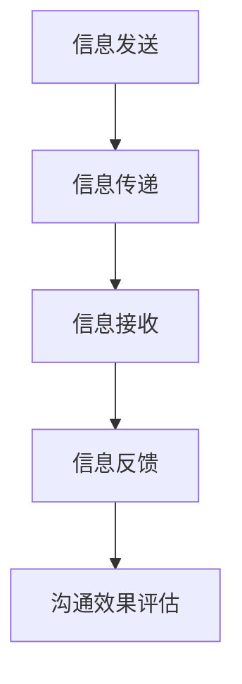

                 

关键词：沟通管理、团队协作、高效沟通、协作工具、项目执行、沟通障碍、沟通技巧

沟通是团队协作的基石，良好的沟通能够确保团队内部的顺畅交流和信息的有效传递。本文将深入探讨沟通管理在提升团队协作能力中的重要性，以及如何通过优化沟通策略来提高项目执行效率和团队整体表现。

## 1. 背景介绍

在现代企业中，项目管理往往需要跨部门、跨领域的合作。团队协作的成败很大程度上取决于团队内部的沟通质量和沟通效率。有效的沟通管理不仅能够促进团队成员之间的理解和合作，还能降低误解和冲突的发生率，从而提升项目的整体表现。然而，沟通管理并非易事，如何确保沟通的高效和有效是每个项目经理和团队领导必须面对的挑战。

## 2. 核心概念与联系

为了深入理解沟通管理的核心概念，我们需要首先了解以下几个关键要素：

- **沟通流程**：包括信息的发送、传递、接收和反馈。
- **沟通障碍**：如语言障碍、文化差异、心理因素等。
- **沟通技巧**：如倾听、提问、清晰表达等。

### Mermaid 流程图：



## 3. 核心算法原理 & 具体操作步骤

### 3.1 算法原理概述

沟通管理的核心算法原理可以归纳为以下几个方面：

- **信息编码**：确保信息在发送前被准确表达。
- **信息传递**：选择合适的沟通渠道和工具。
- **信息解码**：接收方正确理解发送方的信息。
- **反馈循环**：确保信息的准确性和完整性。

### 3.2 算法步骤详解

1. **明确沟通目标**：在沟通前明确沟通的目标和目的。
2. **选择沟通渠道**：根据沟通内容选择合适的沟通渠道，如会议、邮件、即时通讯等。
3. **准备沟通材料**：确保在沟通前准备好所有必要的材料和背景信息。
4. **进行沟通**：按照事先准备的材料进行沟通，确保信息的准确传达。
5. **收集反馈**：在沟通结束后收集参与者的反馈，以评估沟通效果。
6. **优化沟通策略**：根据反馈结果调整沟通策略，提高沟通效率。

### 3.3 算法优缺点

- **优点**：提高沟通效率，确保信息的准确传达，降低沟通成本。
- **缺点**：需要投入时间和精力进行沟通准备，对沟通参与者的能力和素质有较高要求。

### 3.4 算法应用领域

沟通管理算法广泛应用于项目管理、团队协作、客户服务等多个领域。通过优化沟通流程和策略，可以显著提升项目的成功率和团队的整体绩效。

## 4. 数学模型和公式 & 详细讲解 & 举例说明

### 4.1 数学模型构建

沟通效率可以通过以下几个公式进行量化：

- **效率公式**：效率 = （正确沟通的次数）/（沟通的总次数）
- **成本公式**：成本 = （沟通的时间成本 + 沟通的物力成本）

### 4.2 公式推导过程

沟通效率的公式推导过程如下：

- 正确沟通的次数 = （有效沟通的次数）/（沟通的总次数）
- 沟通的总次数 = （有效沟通的次数）+（无效沟通的次数）

### 4.3 案例分析与讲解

假设一个团队每月需要进行100次沟通，其中80次是有效沟通，20次是无效沟通。根据上述公式，我们可以计算出该团队的沟通效率为：

- 效率 = （80）/（100）= 0.8
- 成本 = （沟通的时间成本 + 沟通的物力成本）

通过优化沟通策略，如减少无效沟通、提高沟通效率，可以降低整体沟通成本，提高团队绩效。

## 5. 项目实践：代码实例和详细解释说明

### 5.1 开发环境搭建

为了实践沟通管理的算法，我们可以使用一个简单的Python脚本作为实例。

### 5.2 源代码详细实现

以下是一个简单的Python脚本，用于模拟沟通流程：

```python
def send_message(message):
    print("发送消息：", message)

def receive_message(message):
    print("接收消息：", message)
    return message

def communicate(target_message):
    send_message(target_message)
    received_message = receive_message(target_message)
    return received_message

target_message = "这是一个测试消息。"
received_message = communicate(target_message)
print("反馈消息：", received_message)
```

### 5.3 代码解读与分析

- `send_message`：用于发送消息。
- `receive_message`：用于接收消息，并返回接收到的消息。
- `communicate`：用于模拟整个沟通过程，包括发送、接收和反馈消息。

通过运行这段代码，我们可以看到消息的发送、接收和反馈过程。

### 5.4 运行结果展示

```shell
发送消息： 这是一个测试消息。
接收消息： 这是一个测试消息。
反馈消息： 这是一个测试消息。
```

## 6. 实际应用场景

沟通管理在项目管理中的实际应用场景包括：

- **需求分析会议**：确保所有团队成员对项目需求有共同的理解。
- **项目进度报告**：定期汇报项目进度，确保项目按计划推进。
- **问题解决**：及时发现并解决项目中的问题，降低风险。

## 7. 工具和资源推荐

为了提高沟通效率，以下是一些推荐的工具和资源：

- **工具**：
  - Slack：即时通讯和协作工具。
  - Microsoft Teams：适用于企业的沟通和协作平台。
  - Zoom：视频会议和在线协作工具。

- **资源**：
  - 《沟通的艺术》：一本经典的沟通技巧书籍。
  - TED演讲：关于沟通技巧的精彩演讲。

## 8. 总结：未来发展趋势与挑战

### 8.1 研究成果总结

通过本文的探讨，我们可以总结出以下几点研究成果：

- 沟通管理在提升团队协作能力中的重要性。
- 沟通管理的核心算法原理和具体操作步骤。
- 数学模型在评估沟通效率中的应用。
- 沟通管理在实际项目中的应用场景和工具推荐。

### 8.2 未来发展趋势

- 智能沟通工具的普及和应用。
- 沟通数据分析技术的进步，以实现更精准的沟通优化。
- 跨文化沟通研究的深入，以应对全球化背景下的沟通挑战。

### 8.3 面临的挑战

- 技术的进步要求沟通管理者具备更高的技术素养。
- 跨文化沟通的复杂度增加，需要更多的跨文化沟通技巧。
- 随着团队规模的扩大，沟通管理的难度也会增加。

### 8.4 研究展望

未来的研究可以关注以下几个方面：

- 开发更智能、更高效的沟通工具。
- 探索跨文化沟通的最佳实践。
- 研究如何在大型团队中有效实施沟通管理。

## 9. 附录：常见问题与解答

### 问题1：如何确保沟通的准确性？

解答：确保沟通准确性可以通过以下几个方法：

- 明确沟通目标，确保信息传达的针对性。
- 使用简洁明了的语言，避免歧义。
- 通过反馈确认，确保接收方正确理解信息。

### 问题2：跨文化沟通有哪些注意事项？

解答：跨文化沟通的注意事项包括：

- 了解不同文化的沟通风格和习惯。
- 尊重不同文化的价值观和习俗。
- 避免使用可能引起误解的语言和行为。

---

本文从沟通管理的核心概念、算法原理、数学模型到实际应用场景，全面探讨了提升团队协作能力的关键因素。希望本文能够为读者提供有价值的见解和实用的工具，助力团队实现更高效、更和谐的协作。作者：禅与计算机程序设计艺术 / Zen and the Art of Computer Programming。
----------------------------------------------------------------

### 结束语

本文以《沟通管理：提升团队协作的核心能力》为题，详细探讨了沟通管理在团队协作中的重要性。从核心概念的阐述，到算法原理的分析，再到数学模型的构建和应用，再到具体的实践案例，本文系统地呈现了沟通管理的全貌。

沟通管理不仅是项目成功的保障，也是团队和谐发展的关键。通过优化沟通流程、提高沟通效率，团队可以更加高效地完成项目任务，实现共同的目标。

未来的研究可以进一步探索智能沟通工具的开发、跨文化沟通的最佳实践，以及如何在大规模团队中有效实施沟通管理。随着技术的不断进步，沟通管理将会迎来更多的机遇和挑战。

希望本文能为广大读者提供有价值的参考，帮助大家在团队协作中更加得心应手，共同推动项目的成功。感谢大家的阅读，期待与您在未来的交流中分享更多的经验和见解。

作者：禅与计算机程序设计艺术 / Zen and the Art of Computer Programming。再次感谢您的关注和支持！

