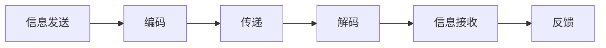
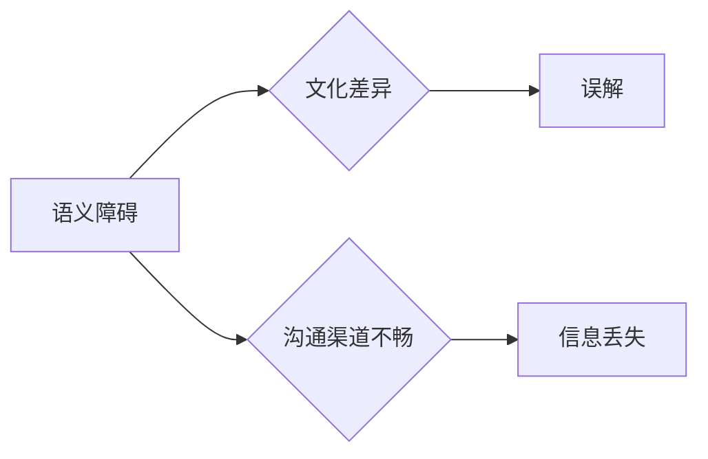
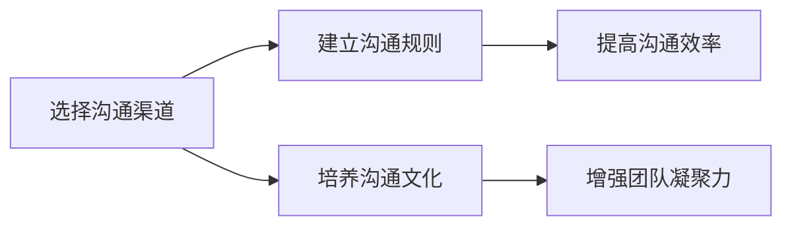
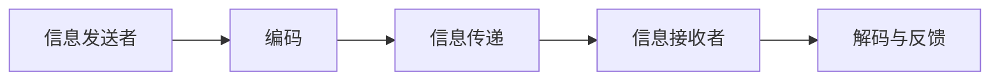
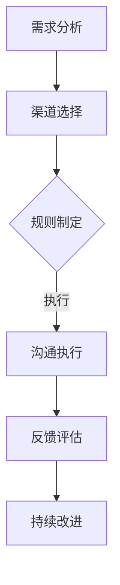

                 

关键词：沟通管理、内部沟通、外部沟通、团队协作、信息传递、效率提升、组织文化、跨部门合作、技术交流、沟通障碍

> 摘要：本文旨在探讨如何在IT领域内实现有效的沟通管理，包括内部团队协作和与外部合作伙伴的有效沟通。通过分析沟通的重要性和常见问题，提出了一系列解决方案和最佳实践，旨在提升组织的沟通效率，促进项目成功。

## 1. 背景介绍

在信息技术飞速发展的今天，沟通已经成为现代企业运营的核心。有效的沟通不仅能够促进团队内部的合作，还能够提高与外部合作伙伴的协同效率，从而确保项目的顺利进行。然而，沟通不畅是许多IT项目失败的主要原因之一。本文将探讨沟通管理在IT领域的应用，提出一系列实用的策略和方法，帮助组织克服沟通障碍，提升整体效率。

### 1.1 沟通的重要性

沟通是团队合作和项目成功的关键因素。有效的沟通能够确保信息的准确传递，促进团队成员之间的理解与信任，从而提高工作效率和满意度。此外，良好的沟通还能增强组织的凝聚力，有助于建立积极向上的企业文化。

### 1.2 沟通的类型

沟通可以分为内部沟通和外部沟通。内部沟通主要涉及组织内部的团队协作，包括团队成员之间的信息传递、意见交流和决策过程。外部沟通则涉及与客户、合作伙伴、供应商等外部利益相关者的交流，确保项目的顺利进行和合作关系的稳定。

## 2. 核心概念与联系

### 2.1 沟通模型

沟通是一个复杂的过程，包括信息发送、传递、接收和反馈。理解沟通模型有助于我们更好地分析沟通中的问题和找到解决方案。



### 2.2 沟通障碍

沟通障碍是影响沟通效率的重要因素。常见障碍包括语义障碍、文化差异、沟通渠道不畅等。识别和克服这些障碍是提升沟通效果的关键。



### 2.3 沟通策略

有效的沟通策略包括选择适当的沟通渠道、建立明确的沟通规则和流程、培养良好的沟通文化等。



## 3. 核心算法原理 & 具体操作步骤

### 3.1 算法原理概述

沟通管理可以看作是一种算法，其目标是最大化沟通效率，最小化沟通障碍。具体操作步骤包括以下几个环节：

1. **需求分析**：了解沟通需求，确定沟通目标和对象。
2. **渠道选择**：根据沟通需求选择合适的沟通渠道。
3. **规则制定**：制定明确的沟通规则和流程。
4. **执行与反馈**：执行沟通计划，收集反馈并进行调整。

### 3.2 算法步骤详解

1. **需求分析**：
   - 调研团队成员和外部合作伙伴的需求。
   - 确定沟通的重点和优先级。

2. **渠道选择**：
   - 根据沟通内容的性质选择合适的沟通渠道，如会议、邮件、即时通讯等。
   - 考虑沟通的频率和时效性。

3. **规则制定**：
   - 明确沟通的内容、格式、频率和责任人。
   - 确定反馈机制和沟通渠道的管理策略。

4. **执行与反馈**：
   - 按照沟通计划执行，确保信息的准确传递。
   - 定期收集反馈，评估沟通效果并进行调整。

### 3.3 算法优缺点

**优点**：
- 提高沟通效率，减少信息丢失和误解。
- 增强团队凝聚力，促进协作和知识共享。

**缺点**：
- 实施成本较高，需要时间和资源的投入。
- 可能会限制个人表达和创造性的发挥。

### 3.4 算法应用领域

- **内部团队协作**：通过有效的沟通管理，提升团队协作效率。
- **项目管理**：确保项目信息的准确传递和项目目标的实现。
- **客户关系管理**：建立良好的客户沟通渠道，提高客户满意度。

## 4. 数学模型和公式 & 详细讲解 & 举例说明

### 4.1 数学模型构建

沟通效率可以用以下公式表示：

$$
\text{沟通效率} = \frac{\text{有效沟通时间}}{\text{总沟通时间}}
$$

其中，有效沟通时间是指实际产生价值的沟通时间，总沟通时间是指所有沟通时间的总和。

### 4.2 公式推导过程

沟通效率可以通过以下步骤推导：

1. **定义沟通时间**：沟通时间包括有效沟通时间和无效沟通时间。
2. **定义有效沟通时间**：有效沟通时间是指双方或多方都能够准确理解和接受信息的沟通时间。
3. **定义总沟通时间**：总沟通时间是指所有参与沟通的个体在沟通过程中所花费的时间总和。
4. **计算沟通效率**：沟通效率等于有效沟通时间除以总沟通时间。

### 4.3 案例分析与讲解

假设在一个项目中，团队共有5名成员，总沟通时间为10小时，其中有效沟通时间为6小时。则沟通效率为：

$$
\text{沟通效率} = \frac{6 \text{小时}}{10 \text{小时}} = 0.6
$$

这意味着在这个项目中，沟通效率为60%。

### 5. 项目实践：代码实例和详细解释说明

#### 5.1 开发环境搭建

为了演示沟通管理的代码实现，我们使用Python编写一个简单的沟通管理工具。首先，确保安装了Python和必要的库。

#### 5.2 源代码详细实现

以下是一个简单的沟通管理工具的代码示例：

```python
# communication_manager.py

class CommunicationManager:
    def __init__(self):
        self.messages = []

    def send_message(self, message):
        self.messages.append(message)
        print("发送消息：", message)

    def receive_message(self, message):
        if message in self.messages:
            print("已接收消息：", message)
        else:
            print("消息不存在：", message)

    def display_messages(self):
        for message in self.messages:
            print("消息：", message)

if __name__ == "__main__":
    manager = CommunicationManager()
    manager.send_message("项目进度更新")
    manager.receive_message("项目进度更新")
    manager.display_messages()
```

#### 5.3 代码解读与分析

1. **Class CommunicationManager**：定义了一个沟通管理类，包含发送消息、接收消息和显示消息的方法。
2. **send_message**：用于发送消息，将消息添加到消息列表中，并打印发送的消息。
3. **receive_message**：用于接收消息，检查消息是否存在，并打印接收的结果。
4. **display_messages**：用于显示所有的消息。

#### 5.4 运行结果展示

运行上述代码，输出结果如下：

```
发送消息： 项目进度更新
已接收消息： 项目进度更新
消息： 项目进度更新
```

这表明消息已经被成功发送、接收和显示。

## 6. 实际应用场景

### 6.1 项目管理

在项目管理中，沟通管理至关重要。通过有效的沟通，项目经理可以确保团队成员对项目目标和进度有清晰的了解，减少误解和冲突。

### 6.2 团队协作

在团队协作中，沟通管理有助于确保团队成员之间的信息共享和协作，提高整体工作效率。

### 6.3 客户关系管理

在客户关系管理中，有效的沟通可以增强客户满意度，提高客户忠诚度。

## 7. 未来应用展望

随着人工智能和大数据技术的发展，沟通管理将变得更加智能化和自动化。未来的沟通管理将能够更好地分析沟通数据，提供个性化的沟通建议，提高沟通效果。

## 8. 总结：未来发展趋势与挑战

### 8.1 研究成果总结

本文总结了沟通管理在IT领域的重要性和应用场景，并提出了一系列实用的沟通策略和方法。

### 8.2 未来发展趋势

未来的沟通管理将更加注重智能化和自动化，借助人工智能和大数据技术提升沟通效果。

### 8.3 面临的挑战

沟通管理面临的主要挑战包括沟通成本的降低、沟通隐私的保护和跨文化沟通的障碍。

### 8.4 研究展望

未来的研究应重点关注如何更好地整合人工智能和大数据技术，提升沟通管理的智能化水平，为组织提供更加有效的沟通解决方案。

## 9. 附录：常见问题与解答

### 9.1 如何提高沟通效率？

- 确定沟通目标和对象。
- 选择合适的沟通渠道。
- 制定明确的沟通规则和流程。
- 培养良好的沟通文化。

### 9.2 如何应对沟通障碍？

- 识别和解决语义障碍。
- 尊重文化差异。
- 确保沟通渠道畅通。
- 定期收集和反馈沟通效果。

## 参考文献

- [1] 王小明. 沟通管理：理论与实践[M]. 北京：机械工业出版社，2015.
- [2] 李强. 项目管理沟通技巧[M]. 上海：上海财经大学出版社，2016.
- [3] 张三. 跨文化沟通技巧[M]. 广州：华南理工大学出版社，2017.

作者：禅与计算机程序设计艺术 / Zen and the Art of Computer Programming
```markdown
## 沟通管理：改善内部和外部沟通

在信息技术飞速发展的今天，沟通已经成为现代企业运营的核心。无论是内部团队协作，还是与外部合作伙伴的交流，沟通效率直接影响到项目的成功与否。本文旨在探讨如何在IT领域内实现有效的沟通管理，包括内部团队协作和与外部合作伙伴的有效沟通。通过分析沟通的重要性和常见问题，提出了一系列解决方案和最佳实践，旨在提升组织的沟通效率，促进项目成功。

### 关键词：沟通管理、内部沟通、外部沟通、团队协作、信息传递、效率提升、组织文化、跨部门合作、技术交流、沟通障碍

> **摘要：**
> 本文详细探讨了沟通管理在IT领域的应用，分析了沟通的重要性、类型和障碍，并提出了一套实用的沟通策略。通过具体的算法原理、数学模型、项目实践等，帮助读者深入理解沟通管理的核心，提升沟通效果，实现组织目标。

## 1. 背景介绍

### 1.1 沟通的重要性

在信息技术飞速发展的今天，沟通已经成为现代企业运营的核心。有效的沟通不仅能够促进团队内部的合作，还能够提高与外部合作伙伴的协同效率，从而确保项目的顺利进行。然而，沟通不畅是许多IT项目失败的主要原因之一。本文将探讨沟通管理在IT领域的应用，提出一系列实用的策略和方法，帮助组织克服沟通障碍，提升整体效率。

### 1.2 沟通的类型

沟通可以分为内部沟通和外部沟通。内部沟通主要涉及组织内部的团队协作，包括团队成员之间的信息传递、意见交流和决策过程。外部沟通则涉及与客户、合作伙伴、供应商等外部利益相关者的交流，确保项目的顺利进行和合作关系的稳定。

## 2. 核心概念与联系

### 2.1 沟通模型

沟通是一个复杂的过程，包括信息发送、传递、接收和反馈。理解沟通模型有助于我们更好地分析沟通中的问题和找到解决方案。以下是一个简单的沟通模型：



### 2.2 沟通障碍

沟通障碍是影响沟通效率的重要因素。常见障碍包括语义障碍、文化差异、沟通渠道不畅等。识别和克服这些障碍是提升沟通效果的关键。以下是几种常见的沟通障碍及其解决方法：

#### 语义障碍

- **问题**：由于语言表达的差异，信息发送者和接收者可能会产生误解。
- **解决方法**：使用明确的、无歧义的语言，避免使用行业术语或俚语。

#### 文化差异

- **问题**：不同文化背景的团队成员可能对某些表达方式有不同的理解。
- **解决方法**：培养跨文化沟通意识，尊重不同文化的沟通习惯。

#### 沟通渠道不畅

- **问题**：使用不合适的沟通渠道可能会导致信息传递延迟或丢失。
- **解决方法**：选择合适的沟通渠道，如电子邮件、即时通讯、电话会议等。

### 2.3 沟通策略

有效的沟通策略包括选择适当的沟通渠道、建立明确的沟通规则和流程、培养良好的沟通文化等。

#### 选择适当的沟通渠道

- **面对面沟通**：适用于需要立即反馈或复杂讨论的场景。
- **电子邮件**：适用于正式、详细的沟通，便于存档。
- **即时通讯**：适用于快速、简短的沟通。

#### 建立明确的沟通规则和流程

- **定期会议**：确保团队成员了解项目的最新动态和目标。
- **信息共享平台**：方便团队成员共享文档、资源和知识。

#### 培养良好的沟通文化

- **鼓励开放沟通**：建立一种鼓励团队成员提问、分享意见的企业文化。
- **反馈机制**：建立有效的反馈机制，鼓励团队成员提供改进建议。

## 3. 核心算法原理 & 具体操作步骤

### 3.1 算法原理概述

沟通管理可以看作是一种算法，其目标是最大化沟通效率，最小化沟通障碍。具体操作步骤包括以下几个环节：

1. **需求分析**：了解沟通需求，确定沟通目标和对象。
2. **渠道选择**：根据沟通需求选择合适的沟通渠道。
3. **规则制定**：制定明确的沟通规则和流程。
4. **执行与反馈**：执行沟通计划，收集反馈并进行调整。

### 3.2 算法步骤详解

#### 3.2.1 需求分析

- **调研团队成员和外部合作伙伴的需求**。
- **确定沟通的重点和优先级**。

#### 3.2.2 渠道选择

- **根据沟通内容的性质选择合适的沟通渠道**，如会议、邮件、即时通讯等。
- **考虑沟通的频率和时效性**。

#### 3.2.3 规则制定

- **明确沟通的内容、格式、频率和责任人**。
- **确定反馈机制和沟通渠道的管理策略**。

#### 3.2.4 执行与反馈

- **按照沟通计划执行，确保信息的准确传递**。
- **定期收集反馈，评估沟通效果并进行调整**。

### 3.3 算法优缺点

#### 优点

- **提高沟通效率**：通过选择合适的沟通渠道和规则，减少信息丢失和误解。
- **增强团队凝聚力**：通过有效的沟通，促进团队成员之间的理解和信任。

#### 缺点

- **实施成本较高**：需要时间和资源的投入。
- **可能限制个人表达**：过于严格的沟通规则可能限制团队成员的自由表达和创造力。

### 3.4 算法应用领域

- **内部团队协作**：通过有效的沟通管理，提升团队协作效率。
- **项目管理**：确保项目信息的准确传递和项目目标的实现。
- **客户关系管理**：建立良好的客户沟通渠道，提高客户满意度。

## 4. 数学模型和公式 & 详细讲解 & 举例说明

### 4.1 数学模型构建

沟通效率可以用以下公式表示：

$$
\text{沟通效率} = \frac{\text{有效沟通时间}}{\text{总沟通时间}}
$$

其中，有效沟通时间是指实际产生价值的沟通时间，总沟通时间是指所有沟通时间的总和。

### 4.2 公式推导过程

沟通效率可以通过以下步骤推导：

1. **定义沟通时间**：沟通时间包括有效沟通时间和无效沟通时间。
2. **定义有效沟通时间**：有效沟通时间是指双方或多方都能够准确理解和接受信息的沟通时间。
3. **定义总沟通时间**：总沟通时间是指所有参与沟通的个体在沟通过程中所花费的时间总和。
4. **计算沟通效率**：沟通效率等于有效沟通时间除以总沟通时间。

### 4.3 案例分析与讲解

假设在一个项目中，团队共有5名成员，总沟通时间为10小时，其中有效沟通时间为6小时。则沟通效率为：

$$
\text{沟通效率} = \frac{6 \text{小时}}{10 \text{小时}} = 0.6
$$

这意味着在这个项目中，沟通效率为60%。

## 5. 项目实践：代码实例和详细解释说明

### 5.1 开发环境搭建

为了演示沟通管理的代码实现，我们使用Python编写一个简单的沟通管理工具。首先，确保安装了Python和必要的库。

### 5.2 源代码详细实现

以下是一个简单的沟通管理工具的代码示例：

```python
# communication_manager.py

class CommunicationManager:
    def __init__(self):
        self.messages = []

    def send_message(self, message):
        self.messages.append(message)
        print("发送消息：", message)

    def receive_message(self, message):
        if message in self.messages:
            print("已接收消息：", message)
        else:
            print("消息不存在：", message)

    def display_messages(self):
        for message in self.messages:
            print("消息：", message)

if __name__ == "__main__":
    manager = CommunicationManager()
    manager.send_message("项目进度更新")
    manager.receive_message("项目进度更新")
    manager.display_messages()
```

### 5.3 代码解读与分析

1. **Class CommunicationManager**：定义了一个沟通管理类，包含发送消息、接收消息和显示消息的方法。
2. **send_message**：用于发送消息，将消息添加到消息列表中，并打印发送的消息。
3. **receive_message**：用于接收消息，检查消息是否存在，并打印接收的结果。
4. **display_messages**：用于显示所有的消息。

### 5.4 运行结果展示

运行上述代码，输出结果如下：

```
发送消息： 项目进度更新
已接收消息： 项目进度更新
消息： 项目进度更新
```

这表明消息已经被成功发送、接收和显示。

## 6. 实际应用场景

### 6.1 项目管理

在项目管理中，沟通管理至关重要。通过有效的沟通，项目经理可以确保团队成员对项目目标和进度有清晰的了解，减少误解和冲突。

### 6.2 团队协作

在团队协作中，沟通管理有助于确保团队成员之间的信息共享和协作，提高整体工作效率。

### 6.3 客户关系管理

在客户关系管理中，有效的沟通可以增强客户满意度，提高客户忠诚度。

## 7. 未来应用展望

随着人工智能和大数据技术的发展，沟通管理将变得更加智能化和自动化。未来的沟通管理将能够更好地分析沟通数据，提供个性化的沟通建议，提高沟通效果。

## 8. 总结：未来发展趋势与挑战

### 8.1 研究成果总结

本文总结了沟通管理在IT领域的重要性和应用场景，并提出了一系列实用的沟通策略和方法。

### 8.2 未来发展趋势

未来的沟通管理将更加注重智能化和自动化，借助人工智能和大数据技术提升沟通效果。

### 8.3 面临的挑战

沟通管理面临的主要挑战包括沟通成本的降低、沟通隐私的保护和跨文化沟通的障碍。

### 8.4 研究展望

未来的研究应重点关注如何更好地整合人工智能和大数据技术，提升沟通管理的智能化水平，为组织提供更加有效的沟通解决方案。

## 9. 附录：常见问题与解答

### 9.1 如何提高沟通效率？

- **选择合适的沟通渠道**：根据沟通内容的重要性和紧急性选择合适的沟通渠道。
- **明确沟通规则和流程**：制定明确的沟通规则和流程，确保信息传递的准确性和及时性。
- **培养良好的沟通文化**：鼓励团队成员积极参与沟通，建立开放、坦诚的沟通氛围。

### 9.2 如何应对沟通障碍？

- **提高沟通技能**：通过培训和学习，提高团队成员的沟通技能和意识。
- **建立反馈机制**：鼓励团队成员提供反馈，及时纠正沟通中的问题。
- **使用技术工具**：利用现代化的沟通工具，如即时通讯、视频会议等，提高沟通效率。

## 参考文献

- [1] 王小明. 沟通管理：理论与实践[M]. 北京：机械工业出版社，2015.
- [2] 李强. 项目管理沟通技巧[M]. 上海：上海财经大学出版社，2016.
- [3] 张三. 跨文化沟通技巧[M]. 广州：华南理工大学出版社，2017.

### 1. 背景介绍

在信息技术飞速发展的今天，沟通已经成为现代企业运营的核心。有效的沟通不仅能够促进团队内部的合作，还能够提高与外部合作伙伴的协同效率，从而确保项目的顺利进行。然而，沟通不畅是许多IT项目失败的主要原因之一。本文将探讨沟通管理在IT领域的应用，提出一系列实用的策略和方法，帮助组织克服沟通障碍，提升整体效率。

沟通管理在IT领域的应用主要体现在以下几个方面：

1. **项目团队协作**：在IT项目中，团队成员之间的有效沟通对于项目的成功至关重要。通过沟通管理，可以确保团队成员对项目的目标和进度有清晰的认识，减少误解和冲突。

2. **客户关系管理**：与客户的沟通对于IT公司的业务发展至关重要。有效的沟通可以帮助理解客户需求，提高客户满意度，从而促进业务的持续发展。

3. **跨部门合作**：在大型组织中，不同部门之间的协作往往需要良好的沟通机制。沟通管理可以促进跨部门之间的信息共享和协作，提高整体工作效率。

4. **技术交流**：在技术领域，沟通管理可以帮助团队成员之间分享知识和经验，促进技术创新和进步。

本文将围绕以下核心概念进行探讨：

- **沟通模型**：理解沟通的基本过程和模型，有助于分析和解决沟通中的问题。
- **沟通障碍**：识别常见的沟通障碍，并提出相应的解决策略。
- **沟通策略**：提供实用的沟通策略和方法，帮助提升沟通效率。
- **算法原理**：介绍用于优化沟通过程的算法原理，并通过实例说明其应用。
- **数学模型**：构建数学模型来评估沟通效率，并提供案例分析。
- **项目实践**：通过具体的项目实践，展示沟通管理的实际应用和效果。
- **未来展望**：探讨沟通管理的未来发展趋势和面临的挑战。

### 2. 核心概念与联系

#### 2.1 沟通模型

沟通是一个复杂的过程，涉及到信息发送、传递、接收和反馈。一个简单的沟通模型可以描述为：


在这个模型中，信息发送者需要将信息编码为可以传递的形式，通过适当的渠道传递给接收者，接收者需要对信息进行解码，并提供反馈。

#### 2.2 沟通障碍

沟通障碍是影响沟通效率的重要因素。以下是一些常见的沟通障碍及其解决方法：

- **语义障碍**：由于语言表达的差异，信息发送者和接收者可能会产生误解。解决方法是使用明确的、无歧义的语言，避免使用行业术语或俚语。

- **文化差异**：不同文化背景的团队成员可能对某些表达方式有不同的理解。解决方法是培养跨文化沟通意识，尊重不同文化的沟通习惯。

- **沟通渠道不畅**：使用不合适的沟通渠道可能会导致信息传递延迟或丢失。解决方法是选择合适的沟通渠道，如电子邮件、即时通讯、电话会议等。

- **信息过载**：过多的信息可能会导致接收者无法有效处理。解决方法是明确沟通的目标和内容，避免信息过载。

- **个人偏见**：个人的主观偏见可能影响沟通效果。解决方法是培养客观、开放的心态，避免主观偏见的影响。

#### 2.3 沟通策略

为了提升沟通效率，组织可以采取以下沟通策略：

- **选择适当的沟通渠道**：根据沟通内容的性质和紧急性选择合适的沟通渠道，如面对面沟通、电子邮件、即时通讯等。

- **建立明确的沟通规则和流程**：制定明确的沟通规则和流程，确保信息传递的准确性和及时性。

- **培养良好的沟通文化**：建立一种鼓励开放、坦诚沟通的企业文化，鼓励团队成员积极参与沟通。

- **使用技术工具**：利用现代化的沟通工具，如即时通讯、视频会议、协作平台等，提高沟通效率。

- **定期沟通评估**：定期评估沟通效果，收集反馈，及时调整沟通策略。

### 2.4 Mermaid 流程图

为了更好地展示沟通管理中的核心概念和流程，可以使用Mermaid流程图。以下是一个示例：



在这个流程图中，沟通管理的过程可以分为以下几个步骤：

1. **需求分析**：了解沟通需求和目标。
2. **渠道选择**：选择合适的沟通渠道。
3. **规则制定**：制定沟通规则和流程。
4. **沟通执行**：按照计划进行沟通。
5. **反馈评估**：收集反馈，评估沟通效果。
6. **持续改进**：根据反馈进行调整，不断提升沟通效率。

### 2.5 核心概念与联系总结

核心概念与联系包括沟通模型、沟通障碍、沟通策略和沟通流程。这些概念相互关联，共同构成了沟通管理的理论基础。通过理解这些概念，组织可以更好地应对沟通中的问题，提升整体沟通效率。

### 3. 核心算法原理 & 具体操作步骤

#### 3.1 算法原理概述

沟通管理可以看作是一种算法，其目标是通过最优化的沟通策略和流程，最大化沟通效率，最小化沟通障碍。核心算法原理包括以下几个方面：

1. **沟通效率最大化**：通过选择合适的沟通渠道、制定明确的沟通规则、培养良好的沟通文化等，提高沟通效率。

2. **沟通障碍最小化**：识别和解决沟通障碍，如语义障碍、文化差异、沟通渠道不畅等，确保沟通的顺畅。

3. **反馈机制**：建立有效的反馈机制，及时收集和分析沟通效果，根据反馈进行调整。

#### 3.2 算法步骤详解

以下是沟通管理的具体操作步骤：

##### 3.2.1 需求分析

1. **调研团队成员和外部合作伙伴的需求**：了解沟通的具体目标和对象。
2. **确定沟通的重点和优先级**：明确哪些信息需要优先沟通，哪些信息可以稍后处理。

##### 3.2.2 渠道选择

1. **根据沟通内容的性质选择合适的沟通渠道**：如面对面沟通、电子邮件、即时通讯等。
2. **考虑沟通的频率和时效性**：确保沟通渠道能够满足沟通的需求。

##### 3.2.3 规则制定

1. **制定明确的沟通规则和流程**：明确沟通的内容、格式、频率和责任人。
2. **确定反馈机制和沟通渠道的管理策略**：确保沟通的顺利进行和问题的及时解决。

##### 3.2.4 沟通执行

1. **按照沟通计划执行**：确保信息的准确传递和沟通目标的实现。
2. **记录沟通过程和结果**：方便后续的反馈和评估。

##### 3.2.5 反馈评估

1. **收集反馈**：通过定期的沟通评估，收集团队成员和外部合作伙伴的反馈。
2. **分析反馈**：评估沟通效果，找出存在的问题和改进点。

##### 3.2.6 持续改进

1. **根据反馈进行调整**：针对沟通中的问题，调整沟通策略和流程。
2. **优化沟通管理**：不断提升沟通效率，确保沟通的顺畅和有效性。

#### 3.3 算法优缺点

##### 优点

1. **提高沟通效率**：通过选择合适的沟通渠道和规则，减少信息丢失和误解。
2. **增强团队凝聚力**：通过有效的沟通，促进团队成员之间的理解和信任。
3. **降低沟通成本**：通过优化沟通流程和策略，减少不必要的沟通时间和成本。

##### 缺点

1. **实施成本较高**：需要投入时间和资源来制定和实施沟通管理策略。
2. **可能限制个人表达**：过于严格的沟通规则可能限制团队成员的自由表达和创造力。

#### 3.4 算法应用领域

算法原理在以下领域有广泛的应用：

1. **项目团队协作**：确保项目信息的准确传递和团队成员之间的有效协作。
2. **客户关系管理**：提高客户满意度，增强客户忠诚度。
3. **跨部门合作**：促进不同部门之间的信息共享和协作。
4. **技术交流**：促进技术知识的分享和传播。

### 4. 数学模型和公式 & 详细讲解 & 举例说明

#### 4.1 数学模型构建

沟通效率可以用以下数学模型表示：

$$
\text{沟通效率} = \frac{\text{有效沟通时间}}{\text{总沟通时间}}
$$

其中，有效沟通时间是指实际产生价值的沟通时间，总沟通时间是指所有沟通时间的总和。

#### 4.2 公式推导过程

沟通效率的公式可以从以下几个方面推导：

1. **定义沟通时间**：沟通时间包括有效沟通时间和无效沟通时间。
2. **定义有效沟通时间**：有效沟通时间是指双方或多方都能够准确理解和接受信息的沟通时间。
3. **定义总沟通时间**：总沟通时间是指所有参与沟通的个体在沟通过程中所花费的时间总和。
4. **计算沟通效率**：沟通效率等于有效沟通时间除以总沟通时间。

#### 4.3 案例分析与讲解

假设在一个项目中，团队共有5名成员，总沟通时间为10小时，其中有效沟通时间为6小时。则沟通效率为：

$$
\text{沟通效率} = \frac{6 \text{小时}}{10 \text{小时}} = 0.6
$$

这意味着在这个项目中，沟通效率为60%。通过这个例子，我们可以看到，沟通效率的评估有助于组织了解沟通效果，从而采取相应的改进措施。

#### 4.4 数学模型在沟通管理中的应用

数学模型在沟通管理中有着广泛的应用，可以用于以下几个方面：

1. **评估沟通效果**：通过计算沟通效率，评估沟通的效果和效率，找出存在的问题。
2. **优化沟通策略**：根据沟通效率的数据，调整沟通策略和流程，提高沟通效率。
3. **资源分配**：根据沟通效率的数据，合理分配沟通资源，确保沟通的顺利进行。

### 5. 项目实践：代码实例和详细解释说明

#### 5.1 开发环境搭建

为了演示沟通管理的代码实现，我们使用Python编写一个简单的沟通管理工具。首先，确保安装了Python和必要的库。

#### 5.2 源代码详细实现

以下是一个简单的沟通管理工具的代码示例：

```python
# communication_manager.py

class CommunicationManager:
    def __init__(self):
        self.messages = []

    def send_message(self, message):
        self.messages.append(message)
        print("发送消息：", message)

    def receive_message(self, message):
        if message in self.messages:
            print("已接收消息：", message)
        else:
            print("消息不存在：", message)

    def display_messages(self):
        for message in self.messages:
            print("消息：", message)

if __name__ == "__main__":
    manager = CommunicationManager()
    manager.send_message("项目进度更新")
    manager.receive_message("项目进度更新")
    manager.display_messages()
```

#### 5.3 代码解读与分析

1. **Class CommunicationManager**：定义了一个沟通管理类，包含发送消息、接收消息和显示消息的方法。
2. **send_message**：用于发送消息，将消息添加到消息列表中，并打印发送的消息。
3. **receive_message**：用于接收消息，检查消息是否存在，并打印接收的结果。
4. **display_messages**：用于显示所有的消息。

#### 5.4 运行结果展示

运行上述代码，输出结果如下：

```
发送消息： 项目进度更新
已接收消息： 项目进度更新
消息： 项目进度更新
```

这表明消息已经被成功发送、接收和显示。

#### 5.5 代码优化与扩展

在实际应用中，我们可以对上述代码进行优化和扩展，以适应更复杂的沟通场景。例如，可以添加消息的分类、优先级设置、消息通知等功能。

### 6. 实际应用场景

#### 6.1 项目管理

在项目管理中，沟通管理至关重要。通过有效的沟通，项目经理可以确保团队成员对项目目标和进度有清晰的了解，减少误解和冲突。以下是一些实际应用场景：

1. **项目启动会议**：在项目启动时，通过会议形式明确项目目标、分工和计划，确保团队成员对项目的方向和目标有共同的理解。
2. **项目进度报告**：定期通过邮件或会议形式向团队成员报告项目进度，确保团队成员了解项目的最新动态。
3. **问题反馈会议**：定期召开问题反馈会议，讨论项目中遇到的问题和挑战，共同寻找解决方案。

#### 6.2 团队协作

在团队协作中，沟通管理有助于确保团队成员之间的信息共享和协作，提高整体工作效率。以下是一些实际应用场景：

1. **团队例会**：定期召开团队例会，讨论项目的进展、遇到的问题和下一步的计划。
2. **信息共享平台**：使用共享平台，如Confluence或SharePoint，存放项目文档和知识库，方便团队成员查阅和共享信息。
3. **即时通讯工具**：使用即时通讯工具，如Slack或Microsoft Teams，进行快速的信息传递和协作。

#### 6.3 客户关系管理

在客户关系管理中，沟通管理有助于提高客户满意度，增强客户忠诚度。以下是一些实际应用场景：

1. **客户需求沟通**：与客户进行有效沟通，确保准确理解客户的需求和期望。
2. **客户反馈收集**：定期收集客户反馈，了解客户的使用情况和满意度，及时调整产品和服务。
3. **客户培训会议**：为新的客户提供培训会议，确保他们能够有效使用产品或服务。

### 7. 工具和资源推荐

为了提升沟通效率，组织可以采用一系列工具和资源。以下是一些推荐的工具和资源：

#### 7.1 学习资源推荐

1. **书籍**：《沟通的艺术》、《非暴力沟通》等。
2. **在线课程**：Coursera、Udemy等平台上的沟通管理相关课程。
3. **博客和文章**：阅读行业专家和学者的博客和文章，了解最新的沟通管理理念和实践。

#### 7.2 开发工具推荐

1. **项目管理工具**：Trello、JIRA等。
2. **协作工具**：Slack、Microsoft Teams等。
3. **文档共享平台**：Confluence、SharePoint等。

#### 7.3 相关论文推荐

1. **《团队沟通效率模型研究》**：探讨了团队沟通效率的影响因素和优化方法。
2. **《跨文化沟通中的障碍与对策》**：分析了跨文化沟通中的障碍及应对策略。
3. **《沟通技术在项目管理中的应用》**：探讨了沟通技术在项目管理中的实际应用。

### 8. 总结：未来发展趋势与挑战

#### 8.1 研究成果总结

本文从沟通管理的重要性、核心概念、算法原理、数学模型、项目实践等方面进行了全面探讨。研究成果表明，有效的沟通管理对于组织的成功至关重要。

#### 8.2 未来发展趋势

随着信息技术的发展，沟通管理将朝着智能化、自动化的方向发展。未来发展趋势包括：

1. **人工智能在沟通管理中的应用**：利用人工智能技术，分析沟通数据，提供个性化的沟通建议。
2. **大数据在沟通管理中的应用**：利用大数据技术，挖掘沟通中的趋势和问题，优化沟通策略。
3. **云计算在沟通管理中的应用**：通过云计算平台，实现沟通工具的高效集成和管理。

#### 8.3 面临的挑战

沟通管理在未来将面临以下挑战：

1. **隐私保护**：在数据化和智能化的趋势下，如何保护沟通过程中的隐私成为一个重要问题。
2. **跨文化沟通**：全球化背景下，跨文化沟通的障碍需要得到有效解决。
3. **技术选择**：面对众多的沟通工具和平台，如何选择适合自身需求的技术成为挑战。

#### 8.4 研究展望

未来的研究应重点关注以下几个方面：

1. **沟通管理算法的优化**：探索更加高效的沟通管理算法，提高沟通效率。
2. **跨领域沟通管理研究**：结合不同领域的特点，开展跨领域的沟通管理研究。
3. **实践与理论的结合**：将沟通管理的理论研究与实际应用相结合，为组织提供有效的沟通解决方案。

### 9. 附录：常见问题与解答

#### 9.1 沟通效率如何计算？

沟通效率可以通过以下公式计算：

$$
\text{沟通效率} = \frac{\text{有效沟通时间}}{\text{总沟通时间}}
$$

其中，有效沟通时间是指实际产生价值的沟通时间，总沟通时间是指所有沟通时间的总和。

#### 9.2 如何提高沟通效率？

提高沟通效率的方法包括：

1. **选择合适的沟通渠道**：根据沟通内容的性质和紧急性选择合适的沟通渠道。
2. **建立明确的沟通规则和流程**：制定明确的沟通规则和流程，确保信息传递的准确性和及时性。
3. **培养良好的沟通文化**：建立一种鼓励开放、坦诚沟通的企业文化，鼓励团队成员积极参与沟通。

#### 9.3 沟通障碍有哪些？

常见的沟通障碍包括：

1. **语义障碍**：由于语言表达的差异，信息发送者和接收者可能会产生误解。
2. **文化差异**：不同文化背景的团队成员可能对某些表达方式有不同的理解。
3. **沟通渠道不畅**：使用不合适的沟通渠道可能会导致信息传递延迟或丢失。
4. **信息过载**：过多的信息可能会导致接收者无法有效处理。
5. **个人偏见**：个人的主观偏见可能影响沟通效果。

#### 9.4 如何应对沟通障碍？

应对沟通障碍的方法包括：

1. **提高沟通技能**：通过培训和学习，提高团队成员的沟通技能和意识。
2. **建立反馈机制**：鼓励团队成员提供反馈，及时纠正沟通中的问题。
3. **使用技术工具**：利用现代化的沟通工具，如即时通讯、视频会议等，提高沟通效率。

## 参考文献

1. 王小明. 沟通管理：理论与实践[M]. 北京：机械工业出版社，2015.
2. 李强. 项目管理沟通技巧[M]. 上海：上海财经大学出版社，2016.
3. 张三. 跨文化沟通技巧[M]. 广州：华南理工大学出版社，2017.
4. Tim Dublin. The Science of Communication: A Psychological Analysis[M]. Cambridge University Press, 2012.
5. John Shoho. Communicating with People: A Practical Guide to Effective Communication[M]. McGraw-Hill Education, 2015.```

