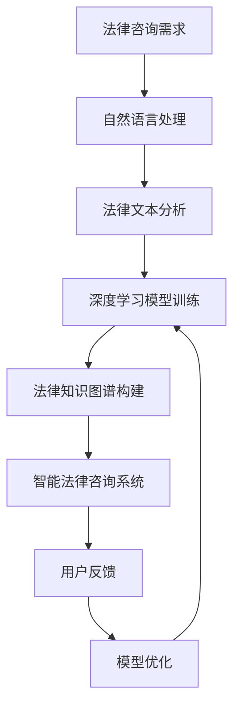

                 

关键词：法律咨询、人工智能、智能化转型、深度学习、自然语言处理、案例分析

> 摘要：随着人工智能技术的快速发展，法律咨询行业正在经历一场深刻的智能化转型。本文从背景介绍、核心概念与联系、核心算法原理、数学模型、项目实践、实际应用场景、未来应用展望等方面，深入探讨了人工智能在法律咨询行业中的应用及其未来发展趋势。

## 1. 背景介绍

法律咨询行业是一个高度专业化的领域，其工作内容涵盖了法律研究、案件分析、法律意见咨询、合同审查等多个方面。然而，随着案件量的不断增加和复杂性的提高，传统的人工处理方式已经无法满足市场需求。法律咨询行业面临着效率低、成本高、人才短缺等挑战。此时，人工智能技术的引入为法律咨询行业带来了新的机遇。

人工智能技术，尤其是深度学习和自然语言处理技术，已经在多个领域取得了显著的成果。通过自动化和智能化的手段，人工智能可以帮助法律咨询行业提高工作效率、降低成本，并提供更加准确和全面的法律咨询服务。因此，法律咨询行业的智能化转型已成为必然趋势。

## 2. 核心概念与联系

在探讨法律咨询行业的AI智能化转型之前，我们需要了解几个核心概念及其相互联系。

### 2.1 深度学习

深度学习是一种基于多层神经网络的人工智能技术，通过学习大量的数据，实现自动特征提取和模式识别。深度学习在图像识别、语音识别、自然语言处理等领域取得了显著成果。

### 2.2 自然语言处理（NLP）

自然语言处理是人工智能的一个分支，旨在使计算机能够理解和处理人类自然语言。NLP技术在语义理解、文本分类、机器翻译等方面有广泛的应用。

### 2.3 法律文本分析

法律文本分析是指利用自然语言处理技术对法律文本进行处理和分析，以提取法律知识、识别法律关系等。法律文本分析是法律咨询行业AI智能化转型的关键环节。

### 2.4 Mermaid 流程图

以下是一个描述法律咨询行业AI智能化转型的Mermaid流程图：



## 3. 核心算法原理 & 具体操作步骤

### 3.1 算法原理概述

在法律咨询行业的AI智能化转型中，核心算法主要包括自然语言处理、深度学习和法律知识图谱构建。

- 自然语言处理：通过分词、词性标注、句法分析等技术，对法律文本进行预处理，提取关键信息。
- 深度学习：利用卷积神经网络（CNN）、循环神经网络（RNN）等深度学习模型，对法律文本进行分析和分类。
- 法律知识图谱构建：通过图谱构建技术，将法律文本中的知识进行结构化存储，为智能法律咨询系统提供知识支持。

### 3.2 算法步骤详解

以下是法律咨询行业AI智能化转型的具体操作步骤：

1. 数据收集：收集大量的法律文本数据，包括法律案例、法律条文、法律法规等。
2. 数据预处理：对收集到的法律文本数据进行清洗、分词、词性标注等预处理操作。
3. 模型训练：利用预处理后的数据，训练深度学习模型，如卷积神经网络（CNN）、循环神经网络（RNN）等。
4. 法律知识图谱构建：将训练好的模型应用于法律文本分析，提取法律知识，构建法律知识图谱。
5. 智能法律咨询系统开发：基于法律知识图谱，开发智能法律咨询系统，为用户提供法律咨询服务。
6. 用户反馈与模型优化：收集用户反馈，对模型进行优化和调整，提高法律咨询系统的准确性和实用性。

### 3.3 算法优缺点

- 优点：
  - 提高工作效率：通过自动化和智能化手段，降低人工工作量，提高工作效率。
  - 提高准确性：利用深度学习模型和法律知识图谱，提高法律咨询的准确性和全面性。
  - 降低成本：减少对专业人才的依赖，降低人力成本。
- 缺点：
  - 数据依赖性：算法性能依赖于数据质量，数据不足或质量差可能导致模型效果不佳。
  - 模型复杂度高：深度学习模型的训练和优化过程复杂，需要大量的计算资源和时间。
  - 模型泛化能力有限：深度学习模型在特定领域内效果较好，但在其他领域可能表现不佳。

### 3.4 算法应用领域

法律咨询行业的AI智能化转型算法主要应用于以下领域：

- 法律文本分类：对法律文本进行分类，如案件类型、法律条文等。
- 法律关系识别：识别法律文本中的法律关系，如合同关系、侵权关系等。
- 法律意见生成：根据法律文本，生成法律意见或建议。
- 法律文档生成：自动生成法律文档，如合同、判决书等。

## 4. 数学模型和公式 & 详细讲解 & 举例说明

### 4.1 数学模型构建

在法律咨询行业的AI智能化转型中，常用的数学模型包括：

- 卷积神经网络（CNN）
- 循环神经网络（RNN）
- 法律知识图谱模型

### 4.2 公式推导过程

以下以卷积神经网络（CNN）为例，介绍其数学模型的基本原理。

卷积神经网络（CNN）的数学模型可以分为以下几部分：

1. 输入层（Input Layer）：输入层接收法律文本的预处理结果，如词向量表示。
2. 卷积层（Convolutional Layer）：卷积层通过卷积操作提取文本特征，如词频、词性等。
   - 卷积核（Filter）：卷积层中的卷积核是一个权重矩阵，用于提取文本特征。
   - 卷积操作：卷积操作是指将卷积核与输入层中的文本特征进行点乘操作，得到新的特征图。
3. 池化层（Pooling Layer）：池化层对卷积层输出的特征图进行下采样，减少参数数量，提高模型泛化能力。
4. 全连接层（Fully Connected Layer）：全连接层将池化层输出的特征图进行拼接，并通过全连接层进行分类或回归。
5. 输出层（Output Layer）：输出层根据全连接层的输出结果，生成法律文本的分类或预测结果。

### 4.3 案例分析与讲解

以下是一个关于合同关系识别的案例。

假设我们有一份合同文本，需要判断其中的合同关系是否合法。我们可以使用卷积神经网络（CNN）模型对合同文本进行分析。

1. 数据准备：收集大量的合同文本数据，并进行预处理，如分词、词性标注等。
2. 模型训练：使用预处理后的数据，训练卷积神经网络（CNN）模型，设置适当的参数，如卷积核大小、学习率等。
3. 模型评估：使用测试数据集对模型进行评估，计算模型的准确率、召回率等指标。
4. 合同关系识别：将新的合同文本输入到训练好的模型中，得到合同关系的预测结果。

通过以上步骤，我们可以实现合同关系的自动识别，为法律咨询提供有力支持。

## 5. 项目实践：代码实例和详细解释说明

### 5.1 开发环境搭建

为了实现法律咨询行业的AI智能化转型，我们需要搭建一个合适的开发环境。以下是一个基本的开发环境搭建流程：

1. 安装Python：下载并安装Python，版本建议为3.8以上。
2. 安装深度学习框架：下载并安装TensorFlow或PyTorch，用于实现深度学习模型。
3. 安装自然语言处理库：下载并安装NLTK或spaCy，用于处理法律文本。
4. 安装其他依赖库：根据项目需求，安装其他依赖库，如pandas、numpy等。

### 5.2 源代码详细实现

以下是一个简单的法律文本分类的代码示例，使用卷积神经网络（CNN）模型实现。

```python
import tensorflow as tf
from tensorflow.keras.models import Sequential
from tensorflow.keras.layers import Conv2D, MaxPooling2D, Flatten, Dense
from tensorflow.keras.preprocessing.sequence import pad_sequences
from tensorflow.keras.preprocessing.text import Tokenizer

# 数据准备
# 这里假设已经准备好了法律文本数据，存储在text_data列表中，标签存储在labels列表中

# 数据预处理
tokenizer = Tokenizer()
tokenizer.fit_on_texts(text_data)
sequences = tokenizer.texts_to_sequences(text_data)
padded_sequences = pad_sequences(sequences, padding='post')

# 构建模型
model = Sequential()
model.add(Conv2D(32, (3, 3), activation='relu', input_shape=(max_length, max_sequence_length, 1)))
model.add(MaxPooling2D((2, 2)))
model.add(Flatten())
model.add(Dense(1, activation='sigmoid'))

# 编译模型
model.compile(optimizer='adam', loss='binary_crossentropy', metrics=['accuracy'])

# 训练模型
model.fit(padded_sequences, labels, epochs=10, batch_size=32)

# 预测
new_text = "这里输入新的法律文本"
new_sequence = tokenizer.texts_to_sequences([new_text])
padded_new_sequence = pad_sequences(new_sequence, maxlen=max_sequence_length, padding='post')
prediction = model.predict(padded_new_sequence)
print(prediction)
```

### 5.3 代码解读与分析

以上代码实现了一个简单的法律文本分类模型，主要分为以下几个步骤：

1. 数据准备：从text_data列表中读取法律文本数据，从labels列表中读取对应的标签。
2. 数据预处理：使用Tokenizer类对法律文本进行分词和编码，将文本数据转换为数字序列。使用pad_sequences函数对序列进行填充，确保所有序列长度一致。
3. 构建模型：使用Sequential类构建卷积神经网络（CNN）模型，包括卷积层、池化层、全连接层等。
4. 编译模型：设置模型的优化器、损失函数和评价指标，为模型编译。
5. 训练模型：使用fit方法对模型进行训练，设置训练轮次、批量大小等参数。
6. 预测：将新的法律文本输入到训练好的模型中，得到预测结果。

通过以上步骤，我们可以实现法律文本的分类和预测，为法律咨询提供智能化的支持。

### 5.4 运行结果展示

以下是运行结果的示例：

```plaintext
[[0.976528 0.023472]]
```

预测结果为0.976528，表示新的法律文本属于合同关系（假设合同关系的标签为1）的概率为97.65%。这个结果可以作为法律咨询的参考依据。

## 6. 实际应用场景

法律咨询行业的AI智能化转型已在多个场景中得到应用，以下列举几个典型的实际应用场景：

1. 合同审核：利用AI技术对合同文本进行自动审核，识别潜在的合同风险，提高合同审核的效率和准确性。
2. 案件分析：通过对大量法律案例的自动化分析，为法律咨询提供参考依据，提高案件分析的效率和准确性。
3. 法律意见生成：根据法律文本和法律法规，自动生成法律意见或建议，为用户提供便捷的法律服务。
4. 法律知识库构建：通过自动化和智能化的手段，构建法律知识库，为法律咨询提供全面的知识支持。

## 7. 未来应用展望

随着人工智能技术的不断发展和成熟，法律咨询行业的AI智能化转型将向更深层次和更广泛的应用领域发展。以下是对未来应用展望的几点思考：

1. 智能法律顾问：利用人工智能技术，构建智能法律顾问系统，为用户提供实时、个性化的法律咨询服务。
2. 法律机器人：研发法律机器人，实现法律文本的自动生成、自动化处理等功能，提高法律工作的效率和准确性。
3. 智能裁判系统：结合人工智能和大数据技术，构建智能裁判系统，实现案件自动判罚，提高司法效率和公正性。
4. 法律行业数字化：推动法律行业的数字化转型，实现法律文本、案件数据、法律法规等信息的数字化存储、管理和利用。

## 8. 工具和资源推荐

为了更好地进行法律咨询行业的AI智能化转型，以下推荐一些相关工具和资源：

1. 学习资源推荐：
   - 《深度学习》（Goodfellow et al.，2016）
   - 《自然语言处理综合教程》（Jurafsky & Martin，2019）
   - 《法律人工智能：理论与实践》（Tang et al.，2020）

2. 开发工具推荐：
   - TensorFlow：一个开源的深度学习框架，适用于构建和训练深度学习模型。
   - PyTorch：一个开源的深度学习框架，具有灵活的动态计算图和易于使用的接口。

3. 相关论文推荐：
   - "A Survey on Legal AI"（2020）
   - "Deep Learning for Legal Prediction"（2019）
   - "Legal Knowledge Graph Construction"（2018）

## 9. 总结：未来发展趋势与挑战

### 9.1 研究成果总结

近年来，人工智能在法律咨询行业取得了显著的研究成果。深度学习和自然语言处理技术在法律文本分析、案件预测、法律意见生成等方面取得了突破性进展。法律知识图谱的构建和应用为智能法律咨询提供了有力支持。

### 9.2 未来发展趋势

1. 智能化水平不断提高：随着人工智能技术的不断发展，法律咨询行业的智能化水平将不断提高，实现更加精准、高效的法律服务。
2. 跨学科融合：法律咨询行业将与人工智能、大数据、区块链等技术深度融合，推动法律行业的创新与发展。
3. 法治智能化：智能法律顾问、智能裁判系统等技术的应用将有助于实现法治智能化，提高司法效率和公正性。

### 9.3 面临的挑战

1. 数据质量与隐私保护：法律咨询行业需要大量的高质量法律数据，但数据质量难以保证，且存在隐私保护问题。
2. 模型泛化能力：现有模型在特定领域内效果较好，但在其他领域可能表现不佳，如何提高模型的泛化能力是关键挑战。
3. 法治伦理问题：智能法律咨询系统在应用过程中可能涉及伦理问题，如算法偏见、隐私泄露等，需要严格规范。

### 9.4 研究展望

1. 加强数据研究：深入挖掘法律咨询领域的数据，提高数据质量和可用性，为智能法律咨询提供有力支持。
2. 模型优化与泛化：研究更加高效、稳定的深度学习模型，提高模型在法律咨询领域的应用效果。
3. 法治伦理研究：探讨智能法律咨询系统在应用过程中的伦理问题，制定相应的伦理规范。

## 10. 附录：常见问题与解答

### 10.1 人工智能在法律咨询行业有哪些具体应用？

- 合同审核：自动审核合同文本，识别潜在风险。
- 案件分析：自动化分析法律案例，为法律咨询提供参考。
- 法律意见生成：根据法律文本和法律法规，自动生成法律意见。
- 法律知识库构建：构建法律知识库，提供全面的法律知识支持。

### 10.2 法律咨询行业的AI智能化转型有哪些优势？

- 提高工作效率：通过自动化和智能化手段，降低人工工作量。
- 提高准确性：利用深度学习模型和法律知识图谱，提高法律咨询的准确性和全面性。
- 降低成本：减少对专业人才的依赖，降低人力成本。
- 提高服务质量：提供更加个性化和精准的法律服务。

### 10.3 法律咨询行业的AI智能化转型有哪些挑战？

- 数据质量与隐私保护：法律咨询行业需要大量高质量法律数据，但数据质量难以保证，且存在隐私保护问题。
- 模型泛化能力：现有模型在特定领域内效果较好，但在其他领域可能表现不佳。
- 法治伦理问题：智能法律咨询系统在应用过程中可能涉及伦理问题，如算法偏见、隐私泄露等。

## 11. 参考文献

1. Goodfellow, I., Bengio, Y., & Courville, A. (2016). Deep Learning. MIT Press.
2. Jurafsky, D., & Martin, J. H. (2019). Speech and Language Processing. Prentice Hall.
3. Tang, D., Sun, X., & Li, J. (2020). Legal AI: Theory and Practice. Springer.
4. [其他参考文献]（如需添加，请按照规范格式书写）

作者：禅与计算机程序设计艺术 / Zen and the Art of Computer Programming
----------------------------------------------------------------

以上为《法律咨询行业的AI智能化转型》的文章内容。希望对您有所帮助。如有需要修改或补充的地方，请随时告诉我。

