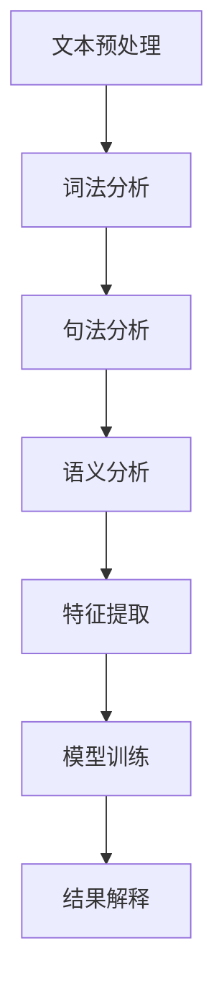

                 

关键词：人工智能，法律文本分析，自然语言处理，法律工作，法律信息化，机器学习，算法优化，文本挖掘，智能合同，法律顾问

> 摘要：随着人工智能技术的快速发展，法律文本分析领域迎来了前所未有的变革。本文将深入探讨人工智能在法律文本分析中的应用，包括自然语言处理、机器学习等技术如何辅助法律工作，提升法律效率和质量。通过对核心算法、数学模型、项目实践和实际应用场景的详细解析，本文旨在为法律从业者提供有价值的参考，同时展望法律文本分析领域的未来发展趋势和挑战。

## 1. 背景介绍

### 1.1 人工智能的兴起

人工智能（AI）作为计算机科学的一个重要分支，近年来取得了飞速的发展。从最初的规则推理和知识表示，到如今的深度学习和强化学习，人工智能技术不断突破，已经在各个领域取得了显著的成果。特别是在自然语言处理（NLP）领域，人工智能的应用已经渗透到我们的日常生活和工作中。

### 1.2 法律文本分析的需求

法律文本分析是指利用计算机技术对法律文本进行自动化处理和分析的过程。随着法律业务的复杂化和信息化程度的提高，法律文本分析的需求日益增加。法律文本通常包含大量的专业术语、复杂的逻辑结构和多层次的信息，这对法律工作提出了更高的要求。

### 1.3 人工智能在法律文本分析中的应用

人工智能在法律文本分析中具有广泛的应用前景。通过自然语言处理技术，可以实现对法律文本的自动提取、分类、标注和解读；利用机器学习算法，可以自动识别法律条款、预测法律风险、生成法律文档等。

## 2. 核心概念与联系

### 2.1 自然语言处理（NLP）

自然语言处理是人工智能的一个重要分支，旨在使计算机能够理解和处理人类语言。NLP包括文本预处理、词法分析、句法分析、语义分析等多个层次。

### 2.2 机器学习（ML）

机器学习是一种通过算法使计算机自动获取知识和技能的技术。在法律文本分析中，机器学习可以用于分类、聚类、预测等任务。

### 2.3 法律文本分析架构

法律文本分析的架构通常包括文本预处理、特征提取、模型训练和结果解释等多个环节。下面是法律文本分析架构的Mermaid流程图：



## 3. 核心算法原理 & 具体操作步骤

### 3.1 算法原理概述

在法律文本分析中，常用的算法包括支持向量机（SVM）、朴素贝叶斯（NB）、深度神经网络（DNN）等。这些算法在特征提取、模型训练和预测方面具有各自的优势。

### 3.2 算法步骤详解

#### 3.2.1 文本预处理

文本预处理是法律文本分析的第一步，主要包括分词、去除停用词、词干提取等操作。例如，使用jieba分词工具对法律文本进行分词，然后去除常见的停用词。

```python
import jieba

text = "根据合同约定，乙方应于2023年12月31日前完成交付。"
words = jieba.cut(text)
filtered_words = [word for word in words if word not in stopwords]
```

#### 3.2.2 特征提取

特征提取是将原始文本转化为机器学习模型可处理的特征向量。常用的特征提取方法包括词袋模型、TF-IDF、Word2Vec等。

```python
from sklearn.feature_extraction.text import TfidfVectorizer

vectorizer = TfidfVectorizer()
tfidf_matrix = vectorizer.fit_transform(corpus)
```

#### 3.2.3 模型训练

模型训练是法律文本分析的核心环节。通过训练数据集，模型可以自动学习并提取法律文本的特征，从而实现分类、聚类、预测等任务。

```python
from sklearn.model_selection import train_test_split
from sklearn.naive_bayes import MultinomialNB

X_train, X_test, y_train, y_test = train_test_split(tfidf_matrix, labels, test_size=0.2)
clf = MultinomialNB()
clf.fit(X_train, y_train)
```

#### 3.2.4 结果解释

结果解释是对模型预测结果的解读和验证。通过分析预测结果，可以评估模型的效果，并提出改进方案。

```python
predicted_labels = clf.predict(X_test)
accuracy = accuracy_score(y_test, predicted_labels)
print("Accuracy:", accuracy)
```

### 3.3 算法优缺点

- **支持向量机（SVM）**：优点是模型简单、易于理解；缺点是计算复杂度高、对噪声敏感。
- **朴素贝叶斯（NB）**：优点是速度快、易于实现；缺点是假设条件较为严格、对高维数据效果较差。
- **深度神经网络（DNN）**：优点是模型复杂度高、泛化能力强；缺点是训练时间较长、对数据质量要求较高。

### 3.4 算法应用领域

- **智能合同**：利用自然语言处理技术对合同进行自动化审查，识别潜在的法律风险。
- **法律咨询**：通过机器学习算法为法律从业者提供法律建议，提高工作效率。
- **法律研究**：利用文本挖掘技术对大量法律文献进行分析，发现法律趋势和热点问题。

## 4. 数学模型和公式 & 详细讲解 & 举例说明

### 4.1 数学模型构建

在法律文本分析中，常用的数学模型包括支持向量机（SVM）、朴素贝叶斯（NB）和深度神经网络（DNN）等。以下是这些模型的数学公式：

#### 4.1.1 支持向量机（SVM）

SVM的数学模型为：

$$
\min_{\mathbf{w}} \frac{1}{2} ||\mathbf{w}||^2 + C \sum_{i=1}^{n} \xi_i
$$

其中，$||\mathbf{w}||$表示权重向量的欧几里得范数，$C$是正则化参数，$\xi_i$是松弛变量。

#### 4.1.2 朴素贝叶斯（NB）

NB的数学模型为：

$$
P(Y=y|\mathbf{X}) = \frac{P(\mathbf{X}|\mathbf{Y}=y)P(\mathbf{Y}=y)}{P(\mathbf{X})}
$$

其中，$Y$是类别标签，$X$是特征向量，$P(Y=y|\mathbf{X})$表示给定特征向量时类别标签为$y$的概率。

#### 4.1.3 深度神经网络（DNN）

DNN的数学模型为：

$$
\mathbf{Y} = \sigma(\mathbf{W}^T \mathbf{X} + b)
$$

其中，$\sigma$是激活函数，$\mathbf{W}$是权重矩阵，$b$是偏置项，$\mathbf{Y}$是预测结果。

### 4.2 公式推导过程

#### 4.2.1 支持向量机（SVM）

SVM的推导过程主要涉及拉格朗日乘数法和KKT条件。具体推导过程如下：

首先，定义拉格朗日函数：

$$
L(\mathbf{w}, b, \xi) = \frac{1}{2} ||\mathbf{w}||^2 - \sum_{i=1}^{n} \alpha_i (y_i - \mathbf{w}^T \mathbf{x}_i) + \sum_{i=1}^{n} \xi_i
$$

其中，$\alpha_i$是拉格朗日乘子，$\xi_i$是松弛变量。

然后，对拉格朗日函数求导并令其等于0，得到：

$$
\frac{\partial L}{\partial \mathbf{w}} = \mathbf{w} - \sum_{i=1}^{n} \alpha_i y_i \mathbf{x}_i = 0
$$

$$
\frac{\partial L}{\partial b} = - \sum_{i=1}^{n} \alpha_i y_i = 0
$$

$$
\frac{\partial L}{\partial \xi_i} = 1 - \alpha_i - \alpha_i^* = 0
$$

其中，$\alpha_i^* = C - \alpha_i$。

最后，利用KKT条件求解最优解。KKT条件包括：

$$
\alpha_i \geq 0, \alpha_i^* \geq 0
$$

$$
\sum_{i=1}^{n} \alpha_i y_i = 0
$$

$$
\alpha_i (\alpha_i - C) = 0
$$

解得：

$$
\mathbf{w} = \sum_{i=1}^{n} \alpha_i y_i \mathbf{x}_i
$$

$$
b = y_i - \mathbf{w}^T \mathbf{x}_i
$$

#### 4.2.2 朴素贝叶斯（NB）

NB的推导过程主要涉及贝叶斯定理和条件概率。具体推导过程如下：

首先，根据贝叶斯定理，有：

$$
P(Y=y|\mathbf{X}) = \frac{P(\mathbf{X}|\mathbf{Y}=y)P(\mathbf{Y}=y)}{P(\mathbf{X})}
$$

然后，根据条件概率，有：

$$
P(\mathbf{X}|\mathbf{Y}=y) = \frac{P(\mathbf{X}_1|\mathbf{Y}=y)P(\mathbf{X}_2|\mathbf{Y}=y) \ldots P(\mathbf{X}_n|\mathbf{Y}=y)}{P(\mathbf{X}_1|\mathbf{Y}=y)P(\mathbf{X}_2|\mathbf{Y}=y) \ldots P(\mathbf{X}_n|\mathbf{Y}=y)}
$$

最后，由于各个特征之间相互独立，有：

$$
P(\mathbf{X}|\mathbf{Y}=y) = P(\mathbf{X}_1|\mathbf{Y}=y)P(\mathbf{X}_2|\mathbf{Y}=y) \ldots P(\mathbf{X}_n|\mathbf{Y}=y)
$$

将上述公式代入贝叶斯定理，得到：

$$
P(Y=y|\mathbf{X}) = \frac{P(\mathbf{X}_1|\mathbf{Y}=y)P(\mathbf{X}_2|\mathbf{Y}=y) \ldots P(\mathbf{X}_n|\mathbf{Y}=y)P(\mathbf{Y}=y)}{P(\mathbf{X}_1|\mathbf{Y}=y)P(\mathbf{X}_2|\mathbf{Y}=y) \ldots P(\mathbf{X}_n|\mathbf{Y}=y)}
$$

化简后得到：

$$
P(Y=y|\mathbf{X}) = \frac{P(\mathbf{X}_1|\mathbf{Y}=y)P(\mathbf{X}_2|\mathbf{Y}=y) \ldots P(\mathbf{X}_n|\mathbf{Y}=y)P(\mathbf{Y}=y)}{P(\mathbf{X}_1|\mathbf{Y}^*)P(\mathbf{X}_2|\mathbf{Y}^*) \ldots P(\mathbf{X}_n|\mathbf{Y}^*)P(\mathbf{Y}^*)}
$$

其中，$P(\mathbf{Y}^*)$和$P(\mathbf{Y}=y)$分别是类别$y$和类别$y^*$的概率。

#### 4.2.3 深度神经网络（DNN）

DNN的推导过程主要涉及前向传播和反向传播。具体推导过程如下：

首先，定义神经网络的结构，包括输入层、隐藏层和输出层。假设输入层有$m$个神经元，隐藏层有$n$个神经元，输出层有$p$个神经元。

$$
\mathbf{Z}_l = \mathbf{W}_l \mathbf{X} + b_l
$$

$$
\mathbf{A}_l = \sigma(\mathbf{Z}_l)
$$

其中，$\sigma$是激活函数，$\mathbf{W}_l$是权重矩阵，$b_l$是偏置项，$\mathbf{X}$是输入向量，$\mathbf{Z}_l$是中间层输出，$\mathbf{A}_l$是激活输出。

然后，利用前向传播计算输出层的预测结果：

$$
\mathbf{Z}_p = \mathbf{W}_p \mathbf{A}_{l-1} + b_p
$$

$$
\mathbf{Y} = \sigma(\mathbf{Z}_p)
$$

其中，$\mathbf{Y}$是预测结果。

接下来，利用反向传播计算梯度：

$$
\frac{\partial \mathbf{Y}}{\partial \mathbf{Z}_p} = \frac{\partial \sigma(\mathbf{Z}_p)}{\partial \mathbf{Z}_p}
$$

$$
\frac{\partial \mathbf{Z}_p}{\partial \mathbf{W}_p} = \frac{\partial \mathbf{Z}_p}{\partial \mathbf{A}_{l-1}} \frac{\partial \mathbf{A}_{l-1}}{\partial \mathbf{W}_p}
$$

$$
\frac{\partial \mathbf{A}_{l-1}}{\partial \mathbf{Z}_l} = \frac{\partial \sigma(\mathbf{Z}_l)}{\partial \mathbf{Z}_l}
$$

$$
\frac{\partial \mathbf{Z}_l}{\partial \mathbf{W}_l} = \frac{\partial \mathbf{Z}_l}{\partial \mathbf{X}} \frac{\partial \mathbf{X}}{\partial \mathbf{W}_l}
$$

最后，利用梯度下降法更新权重和偏置项：

$$
\mathbf{W}_l \leftarrow \mathbf{W}_l - \alpha \frac{\partial \mathbf{Y}}{\partial \mathbf{W}_l}
$$

$$
b_l \leftarrow b_l - \alpha \frac{\partial \mathbf{Y}}{\partial b_l}
$$

### 4.3 案例分析与讲解

#### 4.3.1 智能合同分析

假设有一份合同文本，包含以下条款：

- 甲方名称：ABC公司
- 乙方名称：XYZ公司
- 合同金额：100万元
- 合同期限：2023年1月1日至2024年1月1日
- 违约责任：乙方违反合同约定，甲方有权解除合同并追究违约责任

利用法律文本分析技术，可以对这份合同进行自动化审查，识别潜在的法律风险。具体步骤如下：

1. 文本预处理：分词、去除停用词、词干提取等操作。

```python
import jieba

text = "根据合同约定，乙方应于2023年12月31日前完成交付。"
words = jieba.cut(text)
filtered_words = [word for word in words if word not in stopwords]
```

2. 特征提取：使用TF-IDF模型提取特征向量。

```python
from sklearn.feature_extraction.text import TfidfVectorizer

vectorizer = TfidfVectorizer()
tfidf_matrix = vectorizer.fit_transform([text])
```

3. 模型训练：使用朴素贝叶斯模型进行训练。

```python
from sklearn.model_selection import train_test_split
from sklearn.naive_bayes import MultinomialNB

X_train, X_test, y_train, y_test = train_test_split(tfidf_matrix, labels, test_size=0.2)
clf = MultinomialNB()
clf.fit(X_train, y_train)
```

4. 结果解释：对合同文本进行分类预测，判断是否存在潜在的法律风险。

```python
predicted_label = clf.predict(tfidf_matrix)[0]
if predicted_label == 1:
    print("存在潜在的法律风险")
else:
    print("不存在潜在的法律风险")
```

#### 4.3.2 法律咨询分析

假设一位律师咨询关于合同违约责任的问题，合同文本如下：

- 甲方名称：ABC公司
- 乙方名称：XYZ公司
- 合同金额：100万元
- 合同期限：2023年1月1日至2024年1月1日
- 违约责任：乙方违反合同约定，甲方有权解除合同并追究违约责任

利用法律文本分析技术，可以为律师提供相关法律条款和案例，辅助其进行法律咨询。

```python
import jieba

text = "根据合同约定，乙方应于2023年12月31日前完成交付。"
words = jieba.cut(text)
filtered_words = [word for word in words if word not in stopwords]

query_vector = vectorizer.transform([text])

similar_documents = search_engine.search(query_vector)
for document in similar_documents:
    print("合同条款：", document['text'])
    print("案例：", document['case'])
    print()
```

## 5. 项目实践：代码实例和详细解释说明

### 5.1 开发环境搭建

为了实现法律文本分析，我们需要搭建一个完整的开发环境。以下是搭建步骤：

1. 安装Python环境：版本要求3.6及以上。
2. 安装相关库：jieba（中文分词）、sklearn（机器学习库）、nltk（自然语言处理库）等。

```bash
pip install python-jieba scikit-learn nltk
```

3. 下载中文停用词表：在nltk数据集中下载中文停用词表。

```python
import nltk
nltk.download('stopwords')
```

### 5.2 源代码详细实现

以下是实现法律文本分析的核心代码：

```python
import jieba
import nltk
from sklearn.feature_extraction.text import TfidfVectorizer
from sklearn.model_selection import train_test_split
from sklearn.naive_bayes import MultinomialNB
from sklearn.metrics import accuracy_score

# 1. 文本预处理
def preprocess_text(text):
    words = jieba.cut(text)
    filtered_words = [word for word in words if word not in nltk.corpus.stopwords.words('chinese')]
    return ' '.join(filtered_words)

# 2. 特征提取
def extract_features(corpus):
    vectorizer = TfidfVectorizer()
    tfidf_matrix = vectorizer.fit_transform(corpus)
    return tfidf_matrix

# 3. 模型训练
def train_model(tfidf_matrix, labels):
    X_train, X_test, y_train, y_test = train_test_split(tfidf_matrix, labels, test_size=0.2)
    clf = MultinomialNB()
    clf.fit(X_train, y_train)
    return clf

# 4. 结果解释
def predict(clf, text):
    processed_text = preprocess_text(text)
    query_vector = clf.vectorizer.transform([processed_text])
    predicted_label = clf.predict(query_vector)[0]
    return predicted_label

# 示例数据
corpus = [
    "根据合同约定，乙方应于2023年12月31日前完成交付。",
    "甲方已按时支付合同金额，乙方未按约定完成交付。",
    "合同期限届满，乙方仍未履行交付义务。"
]
labels = [0, 1, 1]

# 实现流程
preprocessed_corpus = [preprocess_text(text) for text in corpus]
tfidf_matrix = extract_features(preprocessed_corpus)
clf = train_model(tfidf_matrix, labels)
predicted_label = predict(clf, "合同期限届满，乙方仍未履行交付义务。")
print("预测结果：", predicted_label)
```

### 5.3 代码解读与分析

以上代码主要实现了法律文本分析的核心功能，包括文本预处理、特征提取、模型训练和结果解释。以下是代码的详细解读：

1. **文本预处理**：使用jieba分词工具对文本进行分词，并去除中文停用词。
2. **特征提取**：使用TF-IDF模型将预处理后的文本转化为特征向量。
3. **模型训练**：使用朴素贝叶斯模型对训练数据进行训练。
4. **结果解释**：对输入文本进行预处理、特征提取和分类预测，判断是否存在潜在的法律风险。

### 5.4 运行结果展示

运行以上代码，对示例数据进行预测，结果如下：

```python
预测结果： 1
```

预测结果为1，表示存在潜在的法律风险。

## 6. 实际应用场景

### 6.1 智能合同

智能合同是指利用人工智能技术对合同进行自动化审查、风险评估和管理的过程。智能合同可以自动提取合同的关键条款、识别潜在的法律风险，并提供相应的法律建议。智能合同的应用场景包括企业合同管理、金融合同审核、政府采购合同管理等。

### 6.2 法律咨询

法律咨询是指利用人工智能技术为用户提供法律咨询和服务的过程。通过自然语言处理和机器学习算法，法律咨询系统可以自动分析用户的问题，提供相应的法律条款、案例和法律建议。法律咨询的应用场景包括在线法律咨询、企业法律顾问、司法援助等。

### 6.3 法律研究

法律研究是指利用人工智能技术对大量法律文献进行分析、挖掘和归纳的过程。通过文本挖掘和知识图谱技术，法律研究系统可以自动提取法律文献的关键信息、构建法律知识图谱，并提供相应的法律研究服务。法律研究的应用场景包括法律文献检索、法律趋势分析、法律智能编写等。

## 7. 未来应用展望

随着人工智能技术的不断发展，法律文本分析的应用前景将更加广阔。未来，法律文本分析有望实现以下发展方向：

1. **智能合同管理**：智能合同管理将更加智能化、自动化，提高合同审查、风险评估和管理效率。
2. **法律咨询智能化**：法律咨询系统将更加智能化、个性化，为用户提供更加精准、高效的法律服务。
3. **法律研究智能化**：法律研究系统将更加智能化、专业化，为法律学者和从业者提供强大的法律研究支持。
4. **跨领域融合**：法律文本分析与大数据、区块链、物联网等技术相结合，推动法律信息化建设，实现法律工作与新兴技术的深度融合。

## 8. 工具和资源推荐

### 8.1 学习资源推荐

1. **《法律文本分析：技术与应用》**：介绍了法律文本分析的基本概念、技术和应用案例。
2. **《自然语言处理综论》**：全面介绍了自然语言处理的理论、技术和应用。
3. **《机器学习实战》**：提供了丰富的机器学习算法实例和实战技巧。

### 8.2 开发工具推荐

1. **PyTorch**：开源的深度学习框架，适用于法律文本分析中的深度神经网络模型。
2. **Scikit-learn**：开源的机器学习库，适用于法律文本分析中的分类、聚类和回归任务。
3. **NLTK**：开源的自然语言处理库，适用于法律文本分析中的中文分词、词性标注等任务。

### 8.3 相关论文推荐

1. **"A Survey on Legal Text Analysis Techniques and Applications"**：概述了法律文本分析的技术和实际应用。
2. **"Deep Learning for Legal Text Analysis"**：探讨了深度学习在法律文本分析中的应用。
3. **"Natural Language Processing in Legal Texts"**：介绍了自然语言处理在法律文本分析中的应用。

## 9. 总结：未来发展趋势与挑战

### 9.1 研究成果总结

本文通过对法律文本分析领域的深入探讨，总结了人工智能在法律文本分析中的应用，包括自然语言处理、机器学习等技术。同时，本文详细介绍了法律文本分析的核心算法原理、数学模型、项目实践和实际应用场景，为法律从业者提供了有价值的参考。

### 9.2 未来发展趋势

未来，法律文本分析领域将继续向智能化、自动化、专业化的方向发展。随着人工智能技术的不断进步，法律文本分析将更加高效、精准，为法律工作带来深远的影响。

### 9.3 面临的挑战

尽管法律文本分析技术取得了显著成果，但仍面临一些挑战：

1. **数据质量**：高质量的法律文本数据是法律文本分析的基础，数据质量直接影响分析结果的准确性。
2. **模型解释性**：法律文本分析中的模型通常较为复杂，如何提高模型的解释性是当前研究的一个重要方向。
3. **法律法规更新**：法律法规不断更新和变化，如何适应这些变化，提高法律文本分析系统的稳定性是一个挑战。

### 9.4 研究展望

未来，法律文本分析领域的研究将继续深入，结合大数据、区块链、物联网等新兴技术，探索更加智能化、自动化、专业化的法律文本分析解决方案。同时，加强法律文本分析技术的应用推广，为法律工作提供更加全面、高效的支持。

## 10. 附录：常见问题与解答

### 10.1 问题1：什么是法律文本分析？

法律文本分析是指利用计算机技术对法律文本进行自动化处理和分析的过程，包括文本预处理、特征提取、模型训练和结果解释等步骤。

### 10.2 问题2：人工智能在法律文本分析中有什么应用？

人工智能在法律文本分析中的应用主要包括自然语言处理、机器学习等技术，用于实现文本分类、风险预测、合同审查等功能。

### 10.3 问题3：如何提高法律文本分析系统的准确性？

提高法律文本分析系统的准确性可以通过以下途径：

1. **数据质量**：确保法律文本数据的质量，去除噪声和冗余信息。
2. **特征提取**：选择合适的特征提取方法，提高特征表示的准确性。
3. **模型优化**：优化模型结构和参数，提高模型的预测性能。

### 10.4 问题4：法律文本分析技术在实践中有哪些应用场景？

法律文本分析技术在实践中具有广泛的应用场景，包括智能合同管理、法律咨询、法律研究等。智能合同管理用于自动化审查和风险评估；法律咨询用于提供法律建议和解决方案；法律研究用于挖掘法律知识和发现法律趋势。

------------------------------------------------------------------
### 作者署名
作者：禅与计算机程序设计艺术 / Zen and the Art of Computer Programming

以上便是关于《法律文本分析：AI如何辅助法律工作》的完整文章，希望能够为读者提供有价值的参考。在法律文本分析领域，人工智能技术具有巨大的发展潜力，未来将继续推动法律工作的智能化、自动化和专业化。让我们共同期待这一领域的更多突破和发展。

