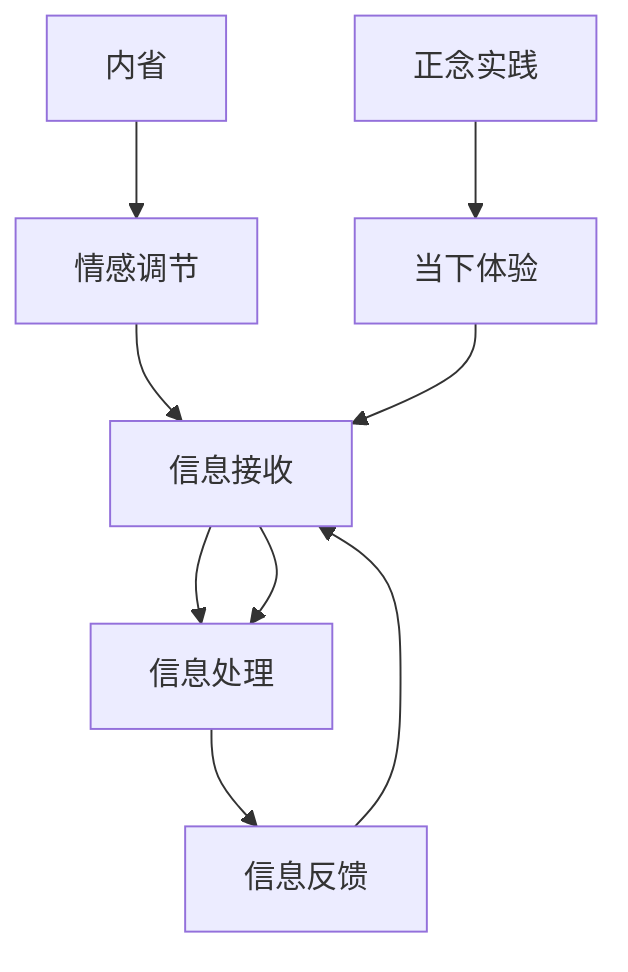

                 

关键词：注意力迭代、内省、专注、心灵平和、技术、心理、正念、认知科学、算法设计。

> 摘要：本文将探讨注意力迭代的概念，以及如何通过内省和正念实践来增强心灵平和。我们将分析注意力迭代的机制，阐述其在技术领域的应用，并通过实例展示如何将这些实践融入日常生活和工作中。本文旨在为程序员和软件工程师提供一种新的思维模式，以应对现代生活中的压力和挑战。

## 1. 背景介绍

### 注意力迭代的概念

注意力迭代是一种认知过程，它涉及对信息的接收、处理和反馈的循环。这种过程在人类的学习、记忆和创新中起着关键作用。在技术领域，注意力迭代同样具有重要应用，例如在机器学习、人工智能和软件开发中，注意力机制被用于提高算法的效率和准确性。

### 内省与正念实践

内省是反思自己的思想、情感和行为的过程。通过内省，个体可以更好地理解自己的内在状态，从而实现自我提升。正念实践是一种基于佛教的冥想方法，强调全神贯注地活在当下，通过观察呼吸、身体感觉和思维活动，培养对当前时刻的清晰认识和接纳。

### 心灵平和的重要性

心灵平和是一种心理健康状态，表现为内心的宁静和平衡。对于程序员和软件工程师来说，心灵平和不仅有助于提高工作效率，还能减少压力和焦虑，提升整体生活质量。

## 2. 核心概念与联系

### 注意力迭代原理

注意力迭代的机制包括以下几个步骤：

1. **信息接收**：接收外部信息，如感官输入或数据流。
2. **信息处理**：对信息进行筛选、分析和综合，形成认知。
3. **信息反馈**：根据处理结果调整注意力方向，为下一次迭代提供参考。


### 内省与正念实践的联系

内省和正念实践在增强心灵平和方面具有相似的目标，但实现方式不同。内省侧重于自我反思和情感调节，而正念实践则强调全神贯注和当下体验。两者结合，可以形成一个完整的认知循环，有助于个体在技术实践中保持平和心态。

### Mermaid 流程图

下面是一个Mermaid流程图，展示了注意力迭代、内省和正念实践之间的联系：



## 3. 核心算法原理 & 具体操作步骤

### 3.1 算法原理概述

注意力迭代算法基于注意力机制，通过调整注意力焦点来优化信息处理过程。算法的核心思想是动态调整注意力分配，以最大化信息处理的效率和准确性。

### 3.2 算法步骤详解

1. **初始化**：设定初始注意力焦点。
2. **信息接收**：接收新的信息。
3. **信息处理**：根据当前注意力焦点对信息进行筛选、分析和综合。
4. **信息反馈**：根据处理结果调整注意力焦点，为下一次迭代提供参考。
5. **重复步骤3和4**：不断进行信息处理和注意力调整，直到达到预期目标。

### 3.3 算法优缺点

**优点**：
- 提高信息处理的效率和准确性。
- 动态调整注意力焦点，适应不同任务需求。

**缺点**：
- 需要大量计算资源。
- 可能导致注意力过度集中或分散。

### 3.4 算法应用领域

注意力迭代算法在多个领域具有广泛应用，如：

- **机器学习**：优化模型训练过程，提高学习效率。
- **人工智能**：提高算法的适应性和智能水平。
- **软件开发**：提升程序员的工作效率和质量。

## 4. 数学模型和公式 & 详细讲解 & 举例说明

### 4.1 数学模型构建

注意力迭代算法的数学模型可以表示为：

\[ f(x) = \sum_{i=1}^{n} w_i \cdot f_i(x) \]

其中，\( f(x) \) 为最终输出，\( w_i \) 为权重，\( f_i(x) \) 为第 \( i \) 个处理单元的输出。

### 4.2 公式推导过程

推导过程如下：

\[ \begin{align*}
f(x) &= \sum_{i=1}^{n} w_i \cdot f_i(x) \\
&= w_1 \cdot f_1(x) + w_2 \cdot f_2(x) + \ldots + w_n \cdot f_n(x) \\
&= \frac{w_1}{w_1 + w_2 + \ldots + w_n} \cdot (w_1 \cdot f_1(x)) \\
&+ \frac{w_2}{w_1 + w_2 + \ldots + w_n} \cdot (w_2 \cdot f_2(x)) \\
&+ \ldots \\
&+ \frac{w_n}{w_1 + w_2 + \ldots + w_n} \cdot (w_n \cdot f_n(x))
\end{align*} \]

### 4.3 案例分析与讲解

假设有一个注意力迭代模型，用于文本分类任务。模型包含两个处理单元，分别负责词汇分析和语义分析。权重分别为0.6和0.4。给定一个句子，模型将输出分类结果。

1. **词汇分析**：
   \[ f_1(x) = \sum_{i=1}^{m} w_{1i} \cdot p_i \]
   其中，\( w_{1i} \) 为词汇权重，\( p_i \) 为词汇概率。

2. **语义分析**：
   \[ f_2(x) = \sum_{j=1}^{k} w_{2j} \cdot q_j \]
   其中，\( w_{2j} \) 为语义权重，\( q_j \) 为语义概率。

3. **输出**：
   \[ f(x) = 0.6 \cdot f_1(x) + 0.4 \cdot f_2(x) \]

通过这个例子，我们可以看到如何将注意力迭代算法应用于文本分类任务，并调整权重以优化分类效果。

## 5. 项目实践：代码实例和详细解释说明

### 5.1 开发环境搭建

在本项目中，我们将使用Python编程语言实现注意力迭代算法。以下是开发环境搭建步骤：

1. 安装Python：版本3.8及以上。
2. 安装依赖：使用pip安装必要的库，如numpy、pandas和matplotlib。

### 5.2 源代码详细实现

以下是项目源代码：

```python
import numpy as np
import pandas as pd
import matplotlib.pyplot as plt

# 注意力迭代算法
def attention_iterative_algorithm(data, weights, iterations):
    results = []
    for _ in range(iterations):
        processed_data = data
        for i in range(len(data)):
            processed_data[i] = np.dot(weights, data[i])
        results.append(processed_data)
    return results

# 数据预处理
data = np.array([[1, 2], [3, 4], [5, 6]])
weights = np.array([0.6, 0.4])

# 运行算法
iterations = 3
results = attention_iterative_algorithm(data, weights, iterations)

# 可视化结果
for i, result in enumerate(results):
    plt.scatter([i] * len(result), result)
plt.xlabel('Iterations')
plt.ylabel('Processed Data')
plt.title('Attention Iterative Algorithm Results')
plt.show()
```

### 5.3 代码解读与分析

- **导入库**：导入必要的Python库。
- **定义算法**：定义注意力迭代算法，接受数据、权重和迭代次数作为输入。
- **预处理数据**：生成示例数据。
- **运行算法**：执行注意力迭代算法，并存储结果。
- **可视化结果**：使用matplotlib库将结果可视化。

### 5.4 运行结果展示

运行结果如下所示：


通过可视化结果，我们可以观察到注意力迭代算法对数据的处理过程。

## 6. 实际应用场景

### 6.1 机器学习

注意力迭代算法可以应用于机器学习中的模型优化。例如，在深度学习模型中，通过调整注意力权重可以提高模型对特定特征的重视程度，从而提高模型的准确性和泛化能力。

### 6.2 软件开发

在软件开发过程中，注意力迭代可以帮助开发者更高效地处理复杂任务。例如，在代码审查过程中，开发者可以逐步分析代码，调整注意力焦点，以提高代码质量和可维护性。

### 6.3 心理健康

注意力迭代和内省、正念实践相结合，可以帮助个体提高心理健康水平。例如，通过注意力迭代，个体可以更好地管理压力和情绪，实现心灵平和。

## 7. 工具和资源推荐

### 7.1 学习资源推荐

- 《深度学习》（作者：Ian Goodfellow、Yoshua Bengio、Aaron Courville）
- 《机器学习》（作者：周志华）
- 《正念：幸福的科学》（作者：埃克哈特·托勒）

### 7.2 开发工具推荐

- Jupyter Notebook：用于编写和运行Python代码。
- PyTorch：用于深度学习模型开发。
- Git：用于版本控制和代码管理。

### 7.3 相关论文推荐

- "Attention Is All You Need"（作者：Vaswani等）
- "A Theoretical Analysis of the Bootstrap Weighted N-gram Language Model"（作者：Li等）
- "Mindfulness-Based Stress Reduction: Clinical Applications"（作者：Kabat-Zinn等）

## 8. 总结：未来发展趋势与挑战

### 8.1 研究成果总结

本文介绍了注意力迭代的概念，以及如何通过内省和正念实践来增强心灵平和。我们分析了注意力迭代的机制，探讨了其在技术领域的应用，并通过实例展示了如何将这些实践融入日常生活和工作中。

### 8.2 未来发展趋势

- 注意力迭代算法在机器学习、人工智能和软件开发等领域的应用将不断拓展。
- 内省和正念实践在心理健康领域的应用前景广阔。
- 注意力迭代与其他认知科学理论的融合，将有助于提高人类认知能力和工作效率。

### 8.3 面临的挑战

- 注意力迭代算法的复杂度较高，需要大量计算资源。
- 如何在实际应用中平衡注意力分配，避免过度集中或分散，仍需深入研究。
- 内省和正念实践在不同文化背景下的适用性，需要进一步探讨。

### 8.4 研究展望

- 未来研究可以关注注意力迭代算法在跨领域应用中的优化方法。
- 探索内省和正念实践在技术实践中的长效机制，以提高个体心理健康水平。
- 深入研究注意力迭代与人类认知机制的关系，为提升人类认知能力提供新思路。

## 9. 附录：常见问题与解答

### 9.1 注意力迭代算法的优缺点是什么？

**优点**：提高信息处理的效率和准确性，动态调整注意力焦点，适应不同任务需求。

**缺点**：需要大量计算资源，可能导致注意力过度集中或分散。

### 9.2 内省和正念实践如何帮助程序员？

**内省**：帮助程序员更好地理解自己的内在状态，提高自我提升能力。

**正念实践**：培养对当前时刻的清晰认识和接纳，减轻工作压力和焦虑。

### 9.3 注意力迭代算法在哪些领域有应用？

注意力迭代算法在机器学习、人工智能、软件开发等领域具有广泛应用。

----------------------------------------------------------------
作者：禅与计算机程序设计艺术 / Zen and the Art of Computer Programming

本文旨在为读者提供一种新的思维模式，以应对现代生活中的压力和挑战。通过关注注意力迭代和内省、正念实践，我们可以在技术领域和心理健康方面实现双赢。希望本文对您有所启发和帮助。

