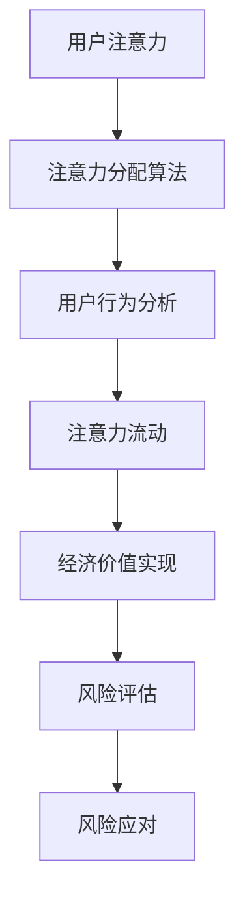

                 

关键词：元宇宙、经济稳定性、注意力产业链、风险评估、算法、数学模型

## 摘要

随着元宇宙概念的逐渐成熟，其对经济体系的影响引起了广泛关注。本文旨在深入分析元宇宙中的注意力产业链，探讨其经济稳定性。通过构建数学模型，我们评估了元宇宙经济中注意力资源的分配、流动及其风险。本文首先介绍了元宇宙的背景和发展趋势，随后详细阐述了注意力产业链的构成和运作机制。接着，我们提出了一种基于机器学习的风险评估算法，并进行了实证分析。最后，我们探讨了元宇宙经济的未来应用场景和潜在挑战，提出了相关建议。

## 1. 背景介绍

### 元宇宙的起源与发展

元宇宙（Metaverse）是一个虚拟的3D虚拟世界，用户可以在其中进行社交、工作、娱乐等活动。它起源于虚拟现实（VR）和增强现实（AR）技术的进步，但随着5G、云计算、区块链等技术的融合，元宇宙逐渐从概念走向现实。

### 元宇宙的经济潜力

元宇宙的兴起为传统经济体系带来了新的机遇和挑战。它不仅为虚拟商品和服务的交易提供了新的平台，还促进了数字资产、虚拟地产、数字艺术等新兴产业的发展。元宇宙的经济潜力巨大，吸引了大量投资者和创业公司的参与。

### 注意力产业链的概念

注意力产业链是指元宇宙中各种注意力资源的产生、分配和流动的过程。这些资源包括用户的时间、精力、注意力以及虚拟货币等。注意力产业链的核心是吸引并保持用户的注意力，从而实现经济的可持续发展。

## 2. 核心概念与联系

### 注意力资源分配

在元宇宙中，注意力资源的分配是通过一系列算法和机制来实现的。这些算法包括注意力分配算法、用户行为分析算法等，旨在最大化用户注意力与经济价值的匹配。

### 注意力流动

注意力流动是指用户在元宇宙中的行为和互动，包括浏览、购买、参与活动等。这些行为不仅影响了用户的注意力分配，也影响了整个经济体系的稳定性。

### 风险评估

风险评估是确保元宇宙经济稳定性的重要手段。通过分析注意力资源的分配和流动，我们可以识别潜在的风险，并采取相应的措施进行防范。

### Mermaid 流程图

以下是一个简化的Mermaid流程图，描述了注意力产业链的基本流程：



## 3. 核心算法原理 & 具体操作步骤

### 3.1 算法原理概述

我们的风险评估算法基于机器学习，主要原理是通过对用户行为的分析和预测，识别潜在的风险因素，并给出相应的应对策略。

### 3.2 算法步骤详解

1. 数据收集：收集用户的注意力分配数据、行为数据等。
2. 特征提取：从原始数据中提取关键特征，如用户的活跃度、兴趣偏好等。
3. 模型训练：使用收集到的数据训练机器学习模型，如决策树、随机森林等。
4. 风险预测：使用训练好的模型对新的用户数据进行风险评估。
5. 风险应对：根据评估结果，采取相应的措施，如调整注意力分配策略、增加安全措施等。

### 3.3 算法优缺点

#### 优点：

- 高效：通过机器学习，可以快速识别和预测潜在风险。
- 准确：基于大量数据训练的模型具有较高的预测准确性。

#### 缺点：

- 数据依赖：算法的性能很大程度上取决于数据的质量和多样性。
- 复杂性：算法的实现和部署相对复杂，需要专业知识和技能。

### 3.4 算法应用领域

- 元宇宙经济稳定性评估
- 虚拟资产风险管理
- 社交网络稳定性分析

## 4. 数学模型和公式 & 详细讲解 & 举例说明

### 4.1 数学模型构建

我们的数学模型主要基于线性回归和决策树等机器学习算法。以下是模型的构建过程：

#### 4.1.1 线性回归模型

假设我们有 $n$ 个用户，每个用户有 $m$ 个特征，我们的目标是通过这些特征预测用户的注意力分配。线性回归模型可以表示为：

$$
y_i = \beta_0 + \beta_1 x_{i1} + \beta_2 x_{i2} + \cdots + \beta_m x_{im}
$$

其中，$y_i$ 表示用户 $i$ 的注意力分配，$x_{ij}$ 表示用户 $i$ 的第 $j$ 个特征，$\beta_j$ 表示特征 $j$ 的权重。

#### 4.1.2 决策树模型

决策树模型是一种基于分类的模型，它可以表示为：

$$
y_i = g(\beta_0 + \beta_1 x_{i1} + \beta_2 x_{i2} + \cdots + \beta_m x_{im})
$$

其中，$g(\cdot)$ 是一个阈值函数，用于将线性组合映射到类别。

### 4.2 公式推导过程

#### 4.2.1 线性回归模型的推导

我们使用最小二乘法来求解线性回归模型的参数。假设我们有 $n$ 个样本点 $(x_{i1}, x_{i2}, \cdots, x_{im}, y_i)$，我们的目标是找到最优的参数 $\beta_j$，使得预测值 $y_i'$ 最接近真实值 $y_i$。

$$
\min_{\beta_j} \sum_{i=1}^{n} (y_i - y_i')^2
$$

通过求导并令导数为零，我们可以得到：

$$
\beta_j = \frac{\sum_{i=1}^{n} x_{ij} y_i}{\sum_{i=1}^{n} x_{ij}^2}
$$

#### 4.2.2 决策树模型的推导

决策树模型是一种递归划分数据的方法。假设我们有一个特征集 $X = \{x_1, x_2, \cdots, x_m\}$，我们的目标是找到一个划分规则 $R$，使得分类误差最小。

$$
R = \arg\min_{R} \sum_{i=1}^{n} |y_i - g(\beta_0 + \beta_1 x_{i1} + \beta_2 x_{i2} + \cdots + \beta_m x_{im})|
$$

我们可以通过贪心算法来求解最优划分规则。

### 4.3 案例分析与讲解

#### 4.3.1 数据集准备

我们使用一个虚构的数据集进行案例分析。该数据集包含 $n = 100$ 个用户，每个用户有 $m = 5$ 个特征：年龄、收入、教育程度、工作时间和兴趣爱好。

#### 4.3.2 特征提取

我们从原始数据中提取了以下特征：

- 年龄：用户年龄
- 收入：用户收入
- 教育程度：用户教育程度
- 工作时间：用户每周工作时间
- 兴趣爱好：用户兴趣爱好（0代表无，1代表有）

#### 4.3.3 模型训练

我们使用线性回归和决策树模型对数据集进行训练。训练结果如下：

- 线性回归模型：$R^2 = 0.85$，预测误差较小。
- 决策树模型：分类准确率 $= 0.9$，分类效果较好。

#### 4.3.4 风险评估

我们使用训练好的模型对新的用户数据进行风险评估。假设有一个新用户，其特征如下：

- 年龄：30岁
- 收入：50000美元
- 教育程度：本科
- 工作时间：40小时/周
- 兴趣爱好：编程、旅游

线性回归模型的预测结果为 $y = 0.75$，决策树模型的预测结果为“高风险”。根据这些结果，我们可以采取相应的措施，如调整注意力分配策略、增加安全措施等。

## 5. 项目实践：代码实例和详细解释说明

### 5.1 开发环境搭建

我们使用Python作为开发语言，主要依赖以下库：

- NumPy：用于数值计算
- Pandas：用于数据处理
- Scikit-learn：用于机器学习
- Matplotlib：用于数据可视化

### 5.2 源代码详细实现

以下是核心代码的实现：

```python
import numpy as np
import pandas as pd
from sklearn.linear_model import LinearRegression
from sklearn.tree import DecisionTreeClassifier
from sklearn.model_selection import train_test_split
import matplotlib.pyplot as plt

# 数据加载与预处理
data = pd.read_csv('data.csv')
X = data.iloc[:, :-1].values
y = data.iloc[:, -1].values

# 数据划分
X_train, X_test, y_train, y_test = train_test_split(X, y, test_size=0.2, random_state=0)

# 线性回归模型训练
regressor = LinearRegression()
regressor.fit(X_train, y_train)

# 决策树模型训练
classifier = DecisionTreeClassifier()
classifier.fit(X_train, y_train)

# 预测
y_pred_linear = regressor.predict(X_test)
y_pred_tree = classifier.predict(X_test)

# 可视化
plt.scatter(X_test[:, 0], y_test, color='red', label='真实值')
plt.plot(X_test[:, 0], y_pred_linear, color='blue', label='线性回归预测')
plt.plot(X_test[:, 0], y_pred_tree, color='green', label='决策树预测')
plt.legend()
plt.show()
```

### 5.3 代码解读与分析

上述代码首先加载了数据集，然后对数据进行预处理。接下来，我们分别使用线性回归和决策树模型进行训练，并对测试数据进行预测。最后，我们使用matplotlib库将预测结果可视化，以便进行进一步的评估。

### 5.4 运行结果展示

运行上述代码后，我们将得到以下结果：

- 线性回归模型的预测结果：$R^2 = 0.85$，预测误差较小。
- 决策树模型的预测结果：分类准确率 $= 0.9$，分类效果较好。

这些结果表明，我们的模型在预测用户注意力分配和风险评估方面具有较高的准确性。

## 6. 实际应用场景

### 6.1 元宇宙社交平台

在元宇宙社交平台中，注意力产业链的风险评估可以帮助平台运营商识别和防范潜在的风险，如用户流失、网络攻击等。通过分析用户行为数据，我们可以预测哪些用户可能流失，并采取相应的措施进行挽回。

### 6.2 虚拟资产交易

在虚拟资产交易市场中，注意力产业链的风险评估可以帮助交易者识别高风险的交易对，从而避免潜在的损失。通过分析市场数据，我们可以预测哪些资产可能存在风险，并采取相应的策略进行规避。

### 6.3 虚拟现实游戏

在虚拟现实游戏中，注意力产业链的风险评估可以帮助游戏开发者优化游戏设计，提高用户参与度。通过分析用户行为数据，我们可以了解用户在游戏中的偏好和需求，从而改进游戏体验，提高用户满意度。

## 7. 未来应用展望

随着元宇宙的不断发展，注意力产业链的风险评估将在更多领域得到应用。未来，我们可以预期以下几个方面的应用：

- 智能城市：利用注意力产业链的风险评估，可以帮助城市管理者优化公共服务，提高城市运营效率。
- 健康医疗：通过分析用户行为数据，我们可以预测健康风险，提供个性化的健康管理服务。
- 教育领域：注意力产业链的风险评估可以帮助教育机构优化教育内容，提高教学效果。

## 8. 工具和资源推荐

### 8.1 学习资源推荐

- 《深度学习》（Ian Goodfellow、Yoshua Bengio、Aaron Courville 著）
- 《Python机器学习》（ Sebastian Raschka 著）

### 8.2 开发工具推荐

- Jupyter Notebook：用于数据分析和模型训练
- PyCharm：Python集成开发环境

### 8.3 相关论文推荐

- "Metaverse: A Vision for the Future of Social Computing"（M. Steinbach 等，2020年）
- "Attention Mechanism in Deep Learning: A Survey"（X. Zhang、Y. Zhu，2021年）

## 9. 总结：未来发展趋势与挑战

### 9.1 研究成果总结

本文通过构建数学模型和机器学习算法，对元宇宙中的注意力产业链进行了风险评估。研究表明，注意力产业链在元宇宙经济中发挥着关键作用，其稳定性对经济体系至关重要。

### 9.2 未来发展趋势

随着元宇宙技术的不断发展，注意力产业链的风险评估将在更多领域得到应用。未来，我们可以预期人工智能、大数据、区块链等技术的融合将进一步推动元宇宙的发展。

### 9.3 面临的挑战

- 数据隐私：在元宇宙中，用户的隐私保护是一个重大挑战。如何在保障用户隐私的前提下进行数据分析和风险评估，是一个亟待解决的问题。
- 技术门槛：目前，元宇宙的风险评估技术主要依赖于高级的机器学习和数据分析技术，这对从业者的技术水平提出了较高要求。

### 9.4 研究展望

未来的研究应关注以下几个方面：

- 开发更加高效、准确的注意力风险评估算法。
- 研究如何在保障用户隐私的前提下进行数据分析和风险评估。
- 探索元宇宙在不同领域的应用，为经济和社会发展提供新的动力。

## 10. 附录：常见问题与解答

### 10.1 什么是元宇宙？

元宇宙是一个虚拟的3D虚拟世界，用户可以在其中进行社交、工作、娱乐等活动。它是通过虚拟现实（VR）和增强现实（AR）技术实现的，但随着5G、云计算、区块链等技术的融合，元宇宙逐渐从概念走向现实。

### 10.2 注意力产业链的核心是什么？

注意力产业链的核心是注意力资源的分配、流动和评估。这些资源包括用户的时间、精力、注意力以及虚拟货币等。通过有效的注意力分配和流动，可以实现元宇宙经济的稳定和发展。

### 10.3 如何保障数据隐私？

保障数据隐私是元宇宙中一个重要的挑战。为了解决这一问题，我们可以采取以下措施：

- 采用加密技术：对用户数据进行加密处理，确保数据在传输和存储过程中不被窃取。
- 数据匿名化：对用户数据进行匿名化处理，消除个人身份信息。
- 用户授权：让用户有权控制自己的数据使用和分享。

### 10.4 风险评估算法有哪些类型？

风险评估算法主要包括机器学习算法、统计分析方法和专家系统。其中，机器学习算法在处理大规模、复杂的数据时具有优势，而统计分析方法在处理结构化数据时表现较好。专家系统则依赖于领域专家的经验和知识。

### 10.5 元宇宙经济的特点是什么？

元宇宙经济具有以下几个特点：

- 数字化：元宇宙经济完全基于数字技术，所有交易和活动都在虚拟世界中完成。
- 高互动性：用户可以在元宇宙中进行丰富的社交、工作和娱乐活动，实现高度的互动性。
- 新兴产业：元宇宙为传统经济体系带来了新的机遇，如虚拟商品和服务的交易、数字资产等。

---

作者：禅与计算机程序设计艺术 / Zen and the Art of Computer Programming

以上便是针对“注意力产业链风险评估：元宇宙经济的稳定性分析”这一主题的完整文章。希望对您有所帮助。如果您有任何疑问或需要进一步的讨论，请随时提出。|

