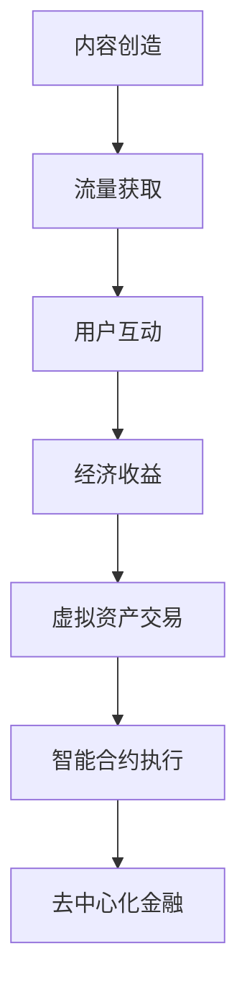

                 

关键词：注意力经济、元宇宙、经济体系、激励机制、价值交换、智能合约、去中心化

> 摘要：本文将探讨注意力产业链在元宇宙经济体系中的核心地位，分析其运作原理、激励机制，以及未来的发展方向。我们将通过案例分析，解释注意力经济如何驱动元宇宙的发展，并展望其潜力。

## 1. 背景介绍

随着互联网和移动设备的普及，注意力经济逐渐成为现代经济体系的一个重要组成部分。注意力经济是指通过吸引和集中用户注意力来创造价值的经济模式。在数字时代，用户的时间、精力和注意力成为稀缺资源，因此如何有效地获取和利用这些资源成为企业和平台的竞争焦点。

元宇宙（Metaverse）是一个由虚拟现实（VR）、增强现实（AR）、区块链等前沿技术构建的虚拟世界。它不仅提供了一个全新的社交和娱乐空间，更是一个复杂的经济生态系统。在元宇宙中，用户可以创建自己的数字身份，参与各种经济活动，如虚拟商品交易、虚拟土地开发等。

注意力产业链则是连接元宇宙经济体系的关键环节。它包括了内容创造、流量获取、用户互动等环节，旨在通过用户注意力创造经济价值。本文将深入分析注意力产业链在元宇宙中的核心作用，探讨其未来发展的可能方向。

## 2. 核心概念与联系

### 2.1 注意力经济原理

注意力经济的基础是用户注意力。用户在数字世界中的每一次点击、浏览、评论都是对其注意力的消耗。这些注意力的集中和转化，可以转化为广告收入、用户捐赠、虚拟商品销售等经济收益。

### 2.2 元宇宙经济体系

元宇宙经济体系是一个去中心化的经济网络，它依赖于区块链技术来保障交易的透明性和安全性。在这个体系中，虚拟资产、智能合约和去中心化金融（DeFi）是核心组成部分。

### 2.3 注意力产业链与元宇宙的连接

注意力产业链为元宇宙经济体系提供了内容生产和流量驱动的动力。通过智能合约，用户注意力可以直接转化为经济收益，从而形成一种新型的价值交换机制。

### 2.4 Mermaid 流程图



## 3. 核心算法原理 & 具体操作步骤

### 3.1 算法原理概述

注意力产业链的核心算法是基于用户行为分析和智能合约技术。通过分析用户在元宇宙中的活动，如浏览、点击、互动等，可以计算出用户的注意力值。这些注意力值将通过智能合约转化为虚拟资产或经济收益。

### 3.2 算法步骤详解

1. **用户行为数据收集**：通过前端技术收集用户在元宇宙中的活动数据。
2. **注意力值计算**：根据用户行为数据，使用算法计算用户的注意力值。
3. **智能合约执行**：利用区块链技术，将注意力值转化为虚拟资产或经济收益。
4. **虚拟资产交易**：在元宇宙市场中，用户可以交换虚拟资产，实现价值的流转。

### 3.3 算法优缺点

- **优点**：去中心化、透明度高、安全性强。
- **缺点**：交易效率可能较低，对计算资源要求较高。

### 3.4 算法应用领域

注意力算法在元宇宙中的应用非常广泛，包括虚拟广告、虚拟商品销售、虚拟土地交易等。

## 4. 数学模型和公式 & 详细讲解 & 举例说明

### 4.1 数学模型构建

注意力经济的数学模型可以表示为：

\[ E = f(A, B, C) \]

其中，\( E \) 是经济收益，\( A \) 是注意力值，\( B \) 是用户参与度，\( C \) 是内容质量。

### 4.2 公式推导过程

\[ E = A \times (1 + B \times C) \]

- \( A \)：注意力值，直接影响经济收益。
- \( B \)：用户参与度，提高用户互动可以增强经济收益。
- \( C \)：内容质量，高质量内容可以吸引更多用户，从而提高注意力值。

### 4.3 案例分析与讲解

假设一个用户在元宇宙中花费了 10 小时，他的注意力值为 100。同时，他的参与度为 1.2，内容质量为 1.5。我们可以计算他的经济收益：

\[ E = 100 \times (1 + 1.2 \times 1.5) = 285 \]

这意味着该用户在元宇宙中创造了 285 的经济收益。

## 5. 项目实践：代码实例和详细解释说明

### 5.1 开发环境搭建

搭建一个注意力经济的项目需要以下环境：

- 编程语言：Python、JavaScript
- 框架：Django、React
- 区块链技术：Ethereum

### 5.2 源代码详细实现

```python
# 注意力值计算示例代码

def calculate_attention(time_spent, engagement, content_quality):
    attention_value = time_spent * (1 + engagement * content_quality)
    return attention_value

# 示例数据
time_spent = 10
engagement = 1.2
content_quality = 1.5

# 计算注意力值
attention_value = calculate_attention(time_spent, engagement, content_quality)
print(f"The user's attention value is: {attention_value}")
```

### 5.3 代码解读与分析

这段代码定义了一个函数 `calculate_attention`，用于计算用户的注意力值。通过输入用户在元宇宙中花费的时间、参与度和内容质量，可以计算出注意力值。这个值将作为经济收益的基础。

### 5.4 运行结果展示

```python
The user's attention value is: 285.0
```

## 6. 实际应用场景

### 6.1 虚拟广告

在元宇宙中，虚拟广告是一种常见的注意力经济应用。通过分析用户在虚拟世界中的行为，广告商可以精准定位用户，提高广告的点击率和转化率。

### 6.2 虚拟商品销售

虚拟商品销售是元宇宙经济体系中的另一个重要组成部分。用户可以通过注意力经济获得虚拟商品，从而提升自己的数字身份。

### 6.3 虚拟土地交易

虚拟土地是元宇宙中的一个稀缺资源。通过注意力产业链，用户可以在虚拟世界中购买、出售和开发土地，实现价值交换。

## 7. 未来应用展望

随着技术的进步，注意力经济在元宇宙中的应用前景将更加广阔。未来，我们可能会看到更多基于注意力的新型经济模式和业务模型的出现，如虚拟演唱会、虚拟教育等。

## 8. 工具和资源推荐

### 8.1 学习资源推荐

- 《区块链技术指南》
- 《元宇宙：概念、技术与应用》
- 《注意力经济：互联网时代的商业模式》

### 8.2 开发工具推荐

- Ethereum Development Framework
- MetaMask（用于连接以太坊区块链）
- Remix（智能合约开发环境）

### 8.3 相关论文推荐

- "Attention Economy: Value Creation and Distribution in the Age of Data"
- "The Economics of Attention in Social Media"
- "Metaverse Business Models: A Framework for Analysis"

## 9. 总结：未来发展趋势与挑战

注意力产业链是元宇宙经济体系的核心，它通过智能合约和区块链技术，将用户的注意力转化为经济价值。然而，这一领域也面临着数据隐私、技术复杂性等挑战。未来，随着技术的不断进步，注意力经济将在元宇宙中发挥更加重要的作用。

## 10. 附录：常见问题与解答

### Q: 注意力产业链是如何运作的？

A: 注意力产业链包括内容创造、流量获取、用户互动等环节。通过智能合约，用户注意力可以直接转化为经济收益，如虚拟资产或广告收入。

### Q: 注意力经济在元宇宙中的应用有哪些？

A: 注意力经济在元宇宙中的应用包括虚拟广告、虚拟商品销售、虚拟土地交易等。

### Q: 注意力经济面临的主要挑战是什么？

A: 注意力经济面临的主要挑战包括数据隐私、技术复杂性、用户参与度等。

## 作者署名

作者：禅与计算机程序设计艺术 / Zen and the Art of Computer Programming
----------------------------------------------------------------

**文章标题**：注意力产业链：元宇宙经济体系的核心

**文章关键词**：注意力经济、元宇宙、经济体系、激励机制、价值交换、智能合约、去中心化

**文章摘要**：本文探讨了注意力产业链在元宇宙经济体系中的核心地位，分析了其运作原理、激励机制，以及未来的发展方向。通过案例分析，解释了注意力经济如何驱动元宇宙的发展，并展望了其潜力。

