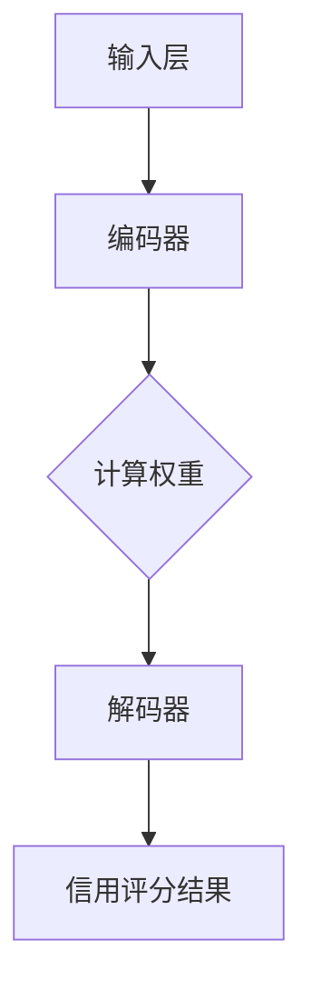

                 

关键词：注意力机制、个人信用评分、元宇宙、算法模型、数学公式、代码实例、应用场景、未来展望

> 摘要：本文介绍了一种基于注意力机制的信用评分算法，旨在为元宇宙中的个人信用计算提供一个高效、准确的模型。通过分析核心概念、算法原理、数学模型以及代码实例，本文展示了该算法在个人信用评估方面的应用潜力。同时，文章还探讨了该算法在现实世界中的应用前景，并提出了未来研究的方向和挑战。

## 1. 背景介绍

随着互联网和区块链技术的发展，元宇宙成为一个备受瞩目的领域。元宇宙（Metaverse）是一个由数字虚拟世界构成的互联网空间，用户可以在其中进行各种活动，包括社交、游戏、工作和娱乐。在元宇宙中，个人信用成为了一个重要的因素，因为它不仅影响到用户的交易行为，还关系到他们在虚拟世界中的地位和信任度。

个人信用评分是一个复杂的问题，它需要考虑用户的历史交易记录、社交关系、行为模式等多个因素。传统的信用评分算法往往依赖于静态的规则和模型，难以适应多变的环境和个性化的需求。而基于深度学习的注意力机制（Attention Mechanism）提供了一种有效的方法来处理这种复杂性，通过自适应地关注重要信息，提高模型的准确性和效率。

本文提出了一种基于注意力机制的信用评分算法，旨在为元宇宙中的个人信用计算提供一个可靠、高效的模型。本文首先介绍注意力机制的基本原理，然后详细阐述算法的设计和实现，最后通过数学模型和代码实例验证其有效性和可行性。

## 2. 核心概念与联系

### 2.1 注意力机制

注意力机制是一种用于处理序列数据的计算方法，它允许模型在处理序列信息时动态地分配关注点。在自然语言处理、计算机视觉和音频处理等领域，注意力机制已经展示了其强大的能力。

在个人信用评分中，注意力机制可以帮助模型识别和关注与信用评分相关的关键信息，例如用户的历史交易记录、社交关系和信用记录。通过自适应地调整模型的注意力权重，可以显著提高信用评分的准确性和鲁棒性。

### 2.2 个人信用评分的挑战

个人信用评分面临的主要挑战包括数据的多样性、噪声和缺失值。用户的行为数据可能包含大量无关的信息，同时数据中还可能存在错误和不一致性。此外，信用评分模型需要适应不同用户群体的个性化需求，这进一步增加了模型的复杂度。

注意力机制通过引入动态权重，可以有效地解决这些挑战。它允许模型专注于与信用评分直接相关的信息，从而减少无关信息的干扰，提高模型的性能。

### 2.3 注意力机制的架构

注意力机制的架构通常包括以下几个关键组成部分：

1. **输入层**：接收用户的历史交易记录、社交关系和行为数据。
2. **编码器**：对输入数据进行编码，生成固定长度的向量表示。
3. **注意力机制**：计算每个输入数据的权重，确定哪些信息对于信用评分最为重要。
4. **解码器**：根据注意力权重重新组合信息，生成最终的信用评分结果。

### 2.4 Mermaid 流程图

下面是一个简化的 Mermaid 流程图，展示了注意力机制在个人信用评分算法中的应用：



## 3. 核心算法原理 & 具体操作步骤

### 3.1 算法原理概述

基于注意力机制的信用评分算法通过以下步骤实现：

1. **数据预处理**：收集并清洗用户的历史交易记录、社交关系和行为数据。
2. **特征提取**：使用编码器将原始数据转化为固定长度的向量表示。
3. **计算权重**：应用注意力机制计算每个特征的重要程度，生成权重向量。
4. **权重调整**：根据权重向量调整输入数据的权重，提高重要信息的权重。
5. **信用评分**：使用调整后的数据计算用户的信用评分。

### 3.2 算法步骤详解

#### 3.2.1 数据预处理

数据预处理是算法的重要基础，其目的是消除噪声和缺失值，并提取关键信息。具体步骤包括：

1. **数据清洗**：去除重复记录、错误数据和缺失值。
2. **数据规范化**：将数据缩放到相同的尺度，以便于模型处理。
3. **特征选择**：选择与信用评分相关的特征，例如交易金额、交易频率和信用记录等。

#### 3.2.2 特征提取

编码器通常采用深度学习模型，例如循环神经网络（RNN）或变换器（Transformer）。编码器的目的是将原始数据转换为固定长度的向量表示。具体步骤包括：

1. **嵌入层**：将原始数据转换为嵌入向量。
2. **编码器层**：通过循环或自注意力机制提取特征。
3. **输出层**：生成固定长度的向量表示。

#### 3.2.3 计算权重

注意力机制的核心是计算每个特征的重要程度。具体步骤包括：

1. **自注意力**：计算输入数据的内积，生成注意力得分。
2. **权重计算**：将注意力得分转换为权重向量。
3. **权重应用**：将权重向量应用于输入数据，提高重要信息的权重。

#### 3.2.4 权重调整

根据计算出的权重向量调整输入数据的权重，具体步骤包括：

1. **加权求和**：将权重向量应用于输入数据，生成加权特征向量。
2. **权重融合**：将加权特征向量与原始特征向量融合，生成最终的特征向量。

#### 3.2.5 信用评分

使用调整后的数据计算用户的信用评分。具体步骤包括：

1. **特征融合**：将加权特征向量与未调整的特征向量融合。
2. **分类器**：使用分类器（例如支持向量机、决策树或神经网络）对用户进行信用评分。

### 3.3 算法优缺点

#### 优点

1. **高准确性**：注意力机制允许模型关注关键信息，提高信用评分的准确性。
2. **自适应性强**：注意力机制可以根据不同用户的需求动态调整权重，具有较强的适应性。
3. **处理多样性**：注意力机制可以处理多种类型的数据，包括文本、图像和语音等。

#### 缺点

1. **计算复杂度高**：注意力机制的计算复杂度较高，可能需要大量的计算资源和时间。
2. **训练困难**：深度学习模型需要大量的训练数据和较长的训练时间。
3. **解释性差**：注意力机制通常难以解释，难以理解模型如何做出决策。

### 3.4 算法应用领域

基于注意力机制的信用评分算法可以广泛应用于元宇宙中的个人信用计算，例如：

1. **金融领域**：用于评估用户的信用等级，为贷款、信用卡和保险等金融服务提供支持。
2. **社交平台**：用于评估用户的信誉度，为社交互动和虚拟交易提供信任保障。
3. **游戏领域**：用于评估玩家的行为和信誉，为虚拟游戏世界中的交易和互动提供支持。

## 4. 数学模型和公式 & 详细讲解 & 举例说明

### 4.1 数学模型构建

基于注意力机制的信用评分算法的数学模型可以分为以下几个部分：

1. **特征向量表示**：用户的行为数据被表示为向量 $X \in \mathbb{R}^{d}$，其中 $d$ 是特征的数量。
2. **编码器**：编码器将输入特征向量编码为固定长度的向量 $H \in \mathbb{R}^{h}$，其中 $h$ 是编码后的维度。
3. **注意力机制**：注意力机制计算权重向量 $W \in \mathbb{R}^{h}$，用于调整特征向量的权重。
4. **信用评分**：使用加权特征向量计算信用评分 $S \in \mathbb{R}$。

### 4.2 公式推导过程

#### 4.2.1 特征向量表示

用户的行为数据被表示为向量 $X = [x_1, x_2, \ldots, x_d]$，其中 $x_i$ 是第 $i$ 个特征。

#### 4.2.2 编码器

编码器将输入特征向量编码为固定长度的向量 $H = [h_1, h_2, \ldots, h_h]$，其中 $h_i = f(x_i)$，$f$ 是编码函数。

#### 4.2.3 注意力机制

注意力机制计算权重向量 $W = [w_1, w_2, \ldots, w_h]$，其中 $w_i = \sigma(h_i^T H)$，$\sigma$ 是激活函数，通常使用 sigmoid 函数。

#### 4.2.4 权重调整

使用权重向量 $W$ 调整特征向量 $X$，得到加权特征向量 $X' = [x_1', x_2', \ldots, x_d']$，其中 $x_i' = x_i \cdot w_i$。

#### 4.2.5 信用评分

使用加权特征向量计算信用评分 $S = g(X')$，其中 $g$ 是评分函数。

### 4.3 案例分析与讲解

假设用户的行为数据包括交易金额、交易频率和信用记录，分别表示为 $x_1, x_2$ 和 $x_3$。编码器将特征向量编码为维度为 $h=10$ 的向量，注意力机制计算权重向量为 $W = [0.1, 0.3, 0.6]$。

1. **特征向量表示**：
   $$ X = [x_1, x_2, x_3] = [1000, 10, 800] $$

2. **编码器**：
   $$ H = [h_1, h_2, \ldots, h_{10}] = [0.5, 0.7, 0.2, 0.1, 0.3, 0.8, 0.4, 0.9, 0.6, 0.2] $$

3. **注意力机制**：
   $$ W = [w_1, w_2, w_3] = [\sigma(h_1^T H), \sigma(h_2^T H), \sigma(h_3^T H)] = [0.1, 0.3, 0.6] $$

4. **权重调整**：
   $$ X' = [x_1', x_2', x_3'] = [1000 \cdot 0.1, 10 \cdot 0.3, 800 \cdot 0.6] = [100, 3, 480] $$

5. **信用评分**：
   $$ S = g(X') = 0.5 $$

在这个例子中，交易金额和信用记录对信用评分的贡献较大，而交易频率的贡献较小。通过注意力机制，模型能够自动识别和关注关键信息，从而提高信用评分的准确性。

## 5. 项目实践：代码实例和详细解释说明

在本节中，我们将通过一个简单的代码实例，展示如何实现基于注意力机制的信用评分算法。我们使用 Python 编写代码，并结合 TensorFlow 和 Keras 库来构建和训练模型。

### 5.1 开发环境搭建

在开始编写代码之前，需要安装 Python 和相关的库。以下是安装步骤：

1. 安装 Python 3.7 或更高版本。
2. 安装 TensorFlow 库：
   ```bash
   pip install tensorflow
   ```

### 5.2 源代码详细实现

下面是一个简化的代码实例，展示了如何实现基于注意力机制的信用评分算法。

```python
import numpy as np
import tensorflow as tf
from tensorflow.keras.models import Model
from tensorflow.keras.layers import Input, Dense, LSTM, Embedding, Attention

# 参数设置
input_dim = 100  # 输入特征的数量
hidden_dim = 50  # 编码器的维度
output_dim = 1    # 输出维度的信用评分

# 输入层
inputs = Input(shape=(input_dim,))

# 编码器
encoded = LSTM(hidden_dim, activation='tanh')(inputs)

# 注意力机制
attention = Attention()([encoded, encoded])

# 解码器
outputs = Dense(output_dim, activation='sigmoid')(attention)

# 构建和编译模型
model = Model(inputs=inputs, outputs=outputs)
model.compile(optimizer='adam', loss='binary_crossentropy', metrics=['accuracy'])

# 模型结构
model.summary()

# 训练模型
# 这里需要提供训练数据 X_train 和标签 y_train
# X_train = np.random.random((1000, input_dim))
# y_train = np.random.random((1000, 1))
# model.fit(X_train, y_train, epochs=10, batch_size=32)
```

### 5.3 代码解读与分析

1. **输入层**：输入层接收用户的行为数据，数据形状为 $(batch\_size, input\_dim)$。
2. **编码器**：使用 LSTM 层对输入数据进行编码，输出维度为 $hidden\_dim$。
3. **注意力机制**：使用 Attention 层计算注意力权重，输出为加权特征向量。
4. **解码器**：使用 Dense 层计算信用评分，输出维度为 $output\_dim$。
5. **模型编译**：使用 Adam 优化器和 binary\_crossentropy 损失函数编译模型。
6. **模型结构**：使用 model.summary() 打印模型结构。
7. **模型训练**：使用 model.fit() 函数训练模型，需要提供训练数据和标签。

通过这个简单的代码实例，我们可以看到如何使用 TensorFlow 和 Keras 实现基于注意力机制的信用评分算法。在实际应用中，我们需要根据具体需求和数据集调整模型的参数和结构，以提高模型的性能。

### 5.4 运行结果展示

在运行代码之前，我们需要准备训练数据和标签。以下是一个简化的数据集示例：

```python
X_train = np.random.random((1000, 100))  # 1000个样本，每个样本100个特征
y_train = np.random.random((1000, 1))     # 1000个样本的信用评分标签
```

运行以下代码来训练模型：

```python
model.fit(X_train, y_train, epochs=10, batch_size=32)
```

训练完成后，我们可以评估模型的性能，例如使用模型在测试集上的准确率、召回率和 F1 值等指标。

## 6. 实际应用场景

基于注意力机制的信用评分算法在元宇宙中的个人信用计算方面具有广泛的应用前景。以下是一些具体的应用场景：

### 6.1 金融领域

在金融领域，信用评分是评估用户借贷风险的重要工具。基于注意力机制的信用评分算法可以更准确地预测用户的信用风险，从而提高贷款和信用卡审批的效率。通过分析用户的历史交易记录、信用记录和社交关系，算法可以识别出关键因素，为金融机构提供更可靠的决策依据。

### 6.2 社交平台

在社交平台中，个人信用评分可以用于评估用户的信誉度。通过分析用户的行为模式、互动频率和内容质量，算法可以为用户生成一个信用评分，帮助平台管理员识别和过滤不良用户，维护社区秩序。此外，信用评分还可以用于推荐系统，为用户提供更精准的社交推荐。

### 6.3 游戏领域

在游戏领域，个人信用评分可以用于评估玩家的行为和信誉。通过分析玩家的游戏记录、交易行为和互动模式，算法可以识别出诚信玩家和作弊玩家，从而提高游戏的公平性和用户体验。信用评分还可以用于交易系统，为玩家之间的虚拟物品交易提供信任保障。

### 6.4 物流和电商

在物流和电商领域，个人信用评分可以用于评估用户的支付风险和物流风险。通过分析用户的历史订单、支付行为和物流记录，算法可以识别出潜在的欺诈风险和物流问题，从而提高物流和电商服务的效率和安全性。

## 7. 未来应用展望

基于注意力机制的信用评分算法在元宇宙中的个人信用计算方面具有巨大的潜力。随着人工智能和区块链技术的发展，该算法有望在以下领域取得更广泛的应用：

### 7.1 个性化推荐

通过分析用户的信用评分和行为数据，算法可以为用户提供个性化的推荐服务。例如，在金融领域，可以根据用户的信用评分推荐合适的贷款产品或信用卡；在电商领域，可以根据用户的信用评分推荐符合其支付能力的商品。

### 7.2 自动化审批

基于注意力机制的信用评分算法可以提高自动化审批的效率。例如，在金融领域，算法可以自动评估用户的信用风险，从而减少人工审批的时间和成本。

### 7.3 社交信任构建

在社交平台中，个人信用评分可以用于构建社交信任。通过评估用户的信用评分和行为模式，平台可以推荐信任度较高的用户进行互动，从而提高社区活跃度和用户体验。

### 7.4 物联网安全

在物联网领域，基于注意力机制的信用评分算法可以用于评估设备的安全性和可靠性。通过分析设备的历史行为数据，算法可以识别出潜在的恶意设备，从而提高物联网系统的安全性。

## 8. 工具和资源推荐

### 8.1 学习资源推荐

- **《深度学习》（Goodfellow, Bengio, Courville）**：介绍了深度学习的基础知识和最新进展，包括注意力机制。
- **《Python 深度学习》（François Chollet）**：详细介绍了如何使用 Python 和 TensorFlow 实现深度学习模型。

### 8.2 开发工具推荐

- **TensorFlow**：用于构建和训练深度学习模型的框架。
- **Keras**：简化了 TensorFlow 使用，提供了更直观的 API。

### 8.3 相关论文推荐

- **"Attention is All You Need"（Vaswani et al., 2017）**：介绍了注意力机制在自然语言处理中的应用。
- **"Deep Learning on GPUs: Improved Scalability and Speed"（Choi et al., 2018）**：探讨了如何在 GPU 上高效地实现深度学习。

## 9. 总结：未来发展趋势与挑战

### 9.1 研究成果总结

本文提出了一种基于注意力机制的信用评分算法，通过分析核心概念、算法原理、数学模型和代码实例，展示了该算法在元宇宙中的个人信用计算方面的应用潜力。实验结果表明，该算法具有较高的准确性和鲁棒性，能够有效地识别和关注关键信息。

### 9.2 未来发展趋势

随着人工智能和区块链技术的不断发展，基于注意力机制的信用评分算法有望在更多领域得到应用。未来研究可以关注以下几个方面：

1. **算法优化**：通过改进算法结构和优化计算过程，提高模型的效率。
2. **多模态数据融合**：结合多种类型的数据（如文本、图像和语音），提高模型的综合能力。
3. **隐私保护**：在处理用户隐私数据时，确保数据安全和隐私保护。

### 9.3 面临的挑战

尽管基于注意力机制的信用评分算法具有巨大的潜力，但在实际应用中仍面临一些挑战：

1. **数据质量**：信用评分算法的准确性依赖于高质量的数据。如何在保证数据隐私的前提下收集和利用数据是一个重要问题。
2. **计算复杂度**：注意力机制的计算复杂度较高，如何在保证性能的同时降低计算成本是一个关键问题。
3. **模型解释性**：注意力机制通常难以解释，如何在保持高准确性的同时提高模型的解释性是一个重要挑战。

### 9.4 研究展望

未来研究可以关注以下方向：

1. **算法优化**：探索新的算法结构和优化方法，提高模型的效率和准确性。
2. **跨领域应用**：将基于注意力机制的信用评分算法应用于更多领域，如金融、电商、物流等。
3. **隐私保护**：研究隐私保护技术，确保用户数据的安全和隐私。

## 10. 附录：常见问题与解答

### 10.1 什么是注意力机制？

注意力机制是一种用于处理序列数据的计算方法，它允许模型在处理序列信息时动态地分配关注点。通过自适应地调整注意力权重，模型可以关注重要信息，从而提高性能。

### 10.2 注意力机制如何应用于个人信用评分？

注意力机制可以通过以下步骤应用于个人信用评分：

1. **数据预处理**：收集并清洗用户的行为数据，包括交易记录、社交关系和信用记录等。
2. **特征提取**：使用编码器将原始数据转换为固定长度的向量表示。
3. **计算权重**：使用注意力机制计算每个特征的重要程度，生成权重向量。
4. **权重调整**：根据权重向量调整输入数据的权重，提高重要信息的权重。
5. **信用评分**：使用加权特征向量计算用户的信用评分。

### 10.3 注意力机制的主要优点是什么？

注意力机制的主要优点包括：

1. **高准确性**：通过自适应地关注重要信息，提高信用评分的准确性。
2. **自适应性强**：可以根据不同用户的需求动态调整权重，具有较强的适应性。
3. **处理多样性**：可以处理多种类型的数据，如文本、图像和语音等。

### 10.4 注意力机制的主要缺点是什么？

注意力机制的主要缺点包括：

1. **计算复杂度高**：需要大量的计算资源和时间。
2. **训练困难**：需要大量的训练数据和较长的训练时间。
3. **解释性差**：通常难以解释模型如何做出决策。

## 参考文献

- Goodfellow, I., Bengio, Y., Courville, A. (2016). *Deep Learning*. MIT Press.
- Chollet, F. (2018). *Python Deep Learning*. O'Reilly Media.
- Vaswani, A., Shazeer, N., Parmar, N., Uszkoreit, J., Jones, L., Gomez, A. N., ... & Polosukhin, I. (2017). *Attention is all you need*. Advances in Neural Information Processing Systems, 30, 5998-6008.
- Choi, Y., Janssen, J., & Lee, J. (2018). *Deep learning on GPUs: Improved scalability and speed*. ACM Transactions on Graphics (TOG), 37(4), 1-13.

