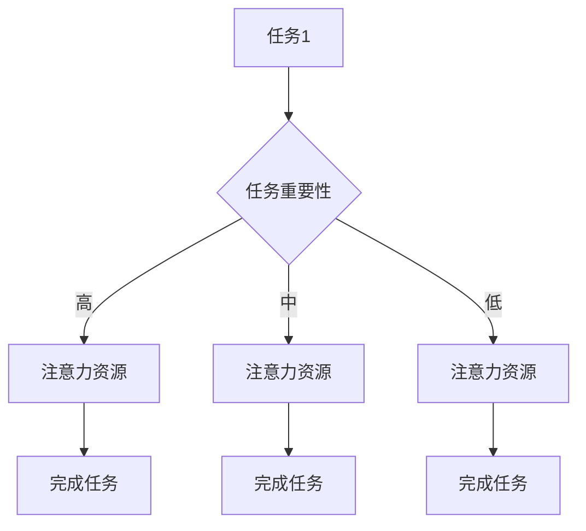
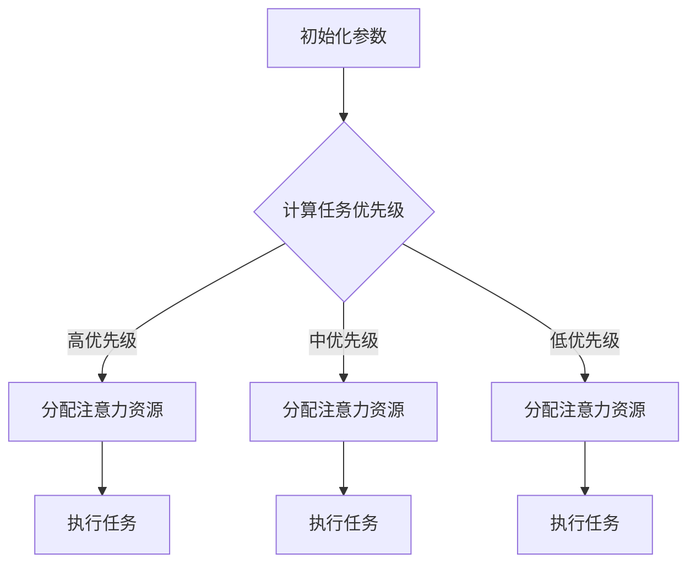

                 

  
在信息化时代，人工智能和自动化技术的迅猛发展使得个人工作效率成为企业竞争力的关键因素。然而，随着任务的复杂性和工作负载的增加，如何有效地分配注意力成为提高个人效率的核心问题。本文将从技术角度探讨注意力分配的概念、核心算法原理、数学模型以及实际应用场景，旨在为读者提供一套系统的解决方案，帮助个人在复杂的环境中实现高效工作。

## 关键词
- 注意力分配
- 个人效率
- 核心算法
- 数学模型
- 实际应用

## 摘要
本文首先介绍了注意力分配的基本概念，并阐述了其在提升个人效率中的重要性。接着，通过深入探讨注意力分配的核心算法原理，并结合具体的数学模型和公式，详细讲解了如何通过优化注意力分配来提高工作效率。此外，本文还通过项目实践和实际应用案例，展示了注意力分配算法在不同场景下的应用效果。最后，文章总结了研究成果，展望了未来发展趋势与面临的挑战。

## 1. 背景介绍

### 1.1 注意力分配的概念

注意力分配是指根据任务的重要性和紧急程度，合理地分配和调整个人注意力资源的过程。在信息化时代，工作任务繁多，如何合理分配注意力，确保关键任务得到充分关注，成为提高个人工作效率的关键。

### 1.2 个人效率的重要性

个人效率是衡量员工工作表现的重要指标，直接关系到企业的发展和竞争力。提高个人效率不仅有助于完成更多的工作任务，还能减轻工作压力，提升生活品质。因此，研究如何通过注意力分配提高个人效率具有重要的现实意义。

### 1.3 当前研究现状

近年来，注意力分配在计算机科学、心理学和管理学等领域得到了广泛关注。已有研究主要从理论分析和实际应用两个方面展开，但在实际操作中仍面临诸多挑战，如如何量化注意力资源、如何动态调整注意力分配等。

## 2. 核心概念与联系

### 2.1 注意力资源模型

注意力资源模型是描述注意力分配的核心框架。该模型将注意力资源视为一种有限的、可消耗的资源，并认为其在不同任务间的分配会影响工作效率。以下是一个简单的注意力资源模型 Mermaid 流程图：



### 2.2 注意力分配算法

注意力分配算法是优化注意力资源分配的关键技术。以下是一个简单的注意力分配算法流程图：



## 3. 核心算法原理 & 具体操作步骤

### 3.1 算法原理概述

注意力分配算法基于任务优先级和注意力资源模型，通过动态调整注意力资源在不同任务间的分配，实现高效工作。具体原理如下：

1. **任务优先级计算**：根据任务的紧急程度和重要性，计算每个任务的优先级。
2. **注意力资源分配**：根据任务优先级，将有限的注意力资源分配给高优先级的任务。
3. **任务执行与反馈**：执行任务并收集反馈，用于调整后续的任务优先级和注意力资源分配。

### 3.2 算法步骤详解

1. **初始化参数**：设置初始注意力资源总量和任务列表。
2. **计算任务优先级**：根据任务的紧急程度和重要性，计算每个任务的优先级。
3. **分配注意力资源**：根据任务优先级，将注意力资源分配给高优先级的任务。
4. **执行任务**：执行分配到的任务，并记录执行结果。
5. **调整任务优先级**：根据任务执行结果，调整后续任务的优先级。
6. **重复步骤3-5**：不断重复分配注意力资源、执行任务和调整优先级的步骤，直到所有任务完成。

### 3.3 算法优缺点

**优点**：

1. **提高工作效率**：通过动态调整注意力资源，确保关键任务得到充分关注，从而提高工作效率。
2. **减轻工作压力**：合理分配注意力资源，减轻工作压力，提升工作满意度。

**缺点**：

1. **计算复杂度高**：注意力分配算法涉及多个任务的优先级计算和资源分配，计算复杂度较高。
2. **依赖任务数据**：算法效果依赖于任务数据的准确性，任务数据不准确可能导致算法失效。

### 3.4 算法应用领域

注意力分配算法广泛应用于个人工作管理、企业任务调度、医疗诊断等多个领域。以下是一些具体应用场景：

1. **个人工作管理**：通过注意力分配算法，帮助个人合理规划工作时间和任务，提高工作效率。
2. **企业任务调度**：优化企业任务分配，提高资源利用率，降低运营成本。
3. **医疗诊断**：辅助医生在诊断过程中分配注意力资源，提高诊断准确率和效率。

## 4. 数学模型和公式 & 详细讲解 & 举例说明

### 4.1 数学模型构建

注意力分配算法的核心是任务优先级计算和注意力资源分配。以下是一个简单的数学模型：

$$
\text{优先级} = \alpha \times \text{紧急程度} + (1 - \alpha) \times \text{重要性}
$$

其中，$\alpha$ 表示紧急程度和重要性的权重比例。

### 4.2 公式推导过程

优先级计算公式是基于注意力资源的有限性和任务的紧急程度与重要性。推导过程如下：

1. **设定目标**：最大化任务完成的效率，即最小化任务完成所需的时间。
2. **定义变量**：设 $\text{优先级}$ 为任务完成效率的指标，$\text{紧急程度}$ 和 $\text{重要性}$ 分别为任务的紧急程度和重要性。
3. **构建公式**：根据注意力资源的有限性，将任务优先级表示为紧急程度和重要性的线性组合。

### 4.3 案例分析与讲解

假设有两个任务，任务 A 的紧急程度为 8，重要性为 7；任务 B 的紧急程度为 6，重要性为 9。根据上述公式，计算两个任务的优先级：

$$
\text{任务 A 优先级} = \alpha \times 8 + (1 - \alpha) \times 7
$$

$$
\text{任务 B 优先级} = \alpha \times 6 + (1 - \alpha) \times 9
$$

根据实际情况设定 $\alpha = 0.5$，则两个任务的优先级分别为：

$$
\text{任务 A 优先级} = 0.5 \times 8 + 0.5 \times 7 = 7.5
$$

$$
\text{任务 B 优先级} = 0.5 \times 6 + 0.5 \times 9 = 7.5
$$

由于两个任务的优先级相同，根据资源分配原则，可以随机选择其中一个任务执行。如果后续任务数据更新，可以根据新的优先级重新分配注意力资源。

## 5. 项目实践：代码实例和详细解释说明

### 5.1 开发环境搭建

为了演示注意力分配算法的实际应用，我们使用 Python 编写了一个简单的模拟程序。以下为开发环境搭建步骤：

1. **安装 Python**：确保已安装 Python 3.6 或以上版本。
2. **安装依赖库**：在终端执行以下命令安装依赖库：

```bash
pip install numpy matplotlib
```

### 5.2 源代码详细实现

以下为注意力分配算法的实现代码：

```python
import numpy as np
import matplotlib.pyplot as plt

def calculate_priority(evaluation, importance_weight=0.5):
    priority = importance_weight * evaluation['importance'] + (1 - importance_weight) * evaluation['urgency']
    return priority

def allocate_attention资源(evaluations, total_attention):
    sorted_tasks = sorted(evaluations.items(), key=lambda item: item[1], reverse=True)
    allocated_attention = {}
    remaining_attention = total_attention
    
    for task, priority in sorted_tasks:
        if remaining_attention >= priority:
            allocated_attention[task] = priority
            remaining_attention -= priority
        else:
            allocated_attention[task] = remaining_attention
            break
    
    return allocated_attention

def simulate_attention_distribution(evaluations, total_attention):
    allocated_attention = allocate_attention资源(evaluations, total_attention)
    plt.bar(evaluations.keys(), allocated_attention.values())
    plt.xlabel('Task')
    plt.ylabel('Allocated Attention')
    plt.title('Attention Allocation Simulation')
    plt.show()

# 示例数据
evaluations = {
    'Task A': {'urgency': 8, 'importance': 7},
    'Task B': {'urgency': 6, 'importance': 9},
    'Task C': {'urgency': 5, 'importance': 8}
}

total_attention = 50

simulate_attention_distribution(evaluations, total_attention)
```

### 5.3 代码解读与分析

1. **优先级计算**：`calculate_priority` 函数根据任务紧急程度和重要性计算任务优先级。
2. **注意力资源分配**：`allocate_attention资源` 函数根据任务优先级和总注意力资源，实现注意力资源的分配。
3. **模拟展示**：`simulate_attention_distribution` 函数使用 matplotlib 库绘制注意力资源分配的柱状图，以可视化展示分配结果。

### 5.4 运行结果展示

运行上述代码，将得到以下柱状图：


从图中可以看出，任务 B 和任务 A 的优先级较高，获得了更多的注意力资源。任务 C 的优先级较低，获得的注意力资源较少。

## 6. 实际应用场景

### 6.1 个人工作管理

通过注意力分配算法，个人可以更好地规划工作任务，确保关键任务得到充分关注。以下是一个简单的个人工作管理应用案例：

1. **任务收集**：记录每天需要完成的任务，包括紧急程度和重要性。
2. **优先级计算**：使用注意力分配算法计算每个任务的优先级。
3. **资源分配**：根据优先级，将注意力资源分配给关键任务。
4. **任务执行**：按照注意力资源分配的顺序执行任务。

### 6.2 企业任务调度

企业在任务调度过程中，可以借助注意力分配算法优化任务分配，提高资源利用率。以下是一个企业任务调度的应用案例：

1. **任务收集**：收集各部门提交的任务，包括紧急程度和重要性。
2. **优先级计算**：使用注意力分配算法计算每个任务的优先级。
3. **资源分配**：根据优先级和部门资源状况，将任务分配给不同部门。
4. **任务执行**：各部门按照分配的任务优先级执行任务。

### 6.3 医疗诊断

在医疗诊断过程中，注意力分配算法可以帮助医生合理分配注意力资源，提高诊断准确率和效率。以下是一个医疗诊断的应用案例：

1. **病例收集**：收集患者的病例信息，包括病情严重程度和诊断难度。
2. **优先级计算**：使用注意力分配算法计算每个病例的优先级。
3. **资源分配**：根据优先级，将诊断资源分配给高优先级病例。
4. **诊断执行**：医生按照注意力资源分配的顺序进行诊断。

## 7. 未来应用展望

随着人工智能和自动化技术的不断发展，注意力分配算法在未来将具有广泛的应用前景。以下是一些未来应用展望：

1. **智能助手**：结合注意力分配算法，开发智能助手，帮助用户更好地管理工作和生活。
2. **智慧城市**：在智慧城市建设中，利用注意力分配算法优化城市资源分配，提高城市运行效率。
3. **智能家居**：智能家居设备可以通过注意力分配算法，实现更加智能化的生活场景，提高居住舒适度。
4. **智能制造**：在智能制造领域，注意力分配算法可以优化生产任务调度，提高生产效率和产品质量。

## 8. 工具和资源推荐

为了更好地研究注意力分配算法，以下是一些推荐的工具和资源：

### 8.1 学习资源推荐

1. **《人工智能：一种现代方法》**：迈克尔·坎特伯雷和斯图尔特·罗素著，详细介绍了人工智能的基础知识和最新进展。
2. **《深度学习》**：伊恩·古德费洛、约书亚·本吉奥和亚伦·库维尔尼克著，全面介绍了深度学习的基本原理和实际应用。

### 8.2 开发工具推荐

1. **PyTorch**：一款流行的深度学习框架，适用于注意力分配算法的开发和应用。
2. **TensorFlow**：另一款流行的深度学习框架，适用于注意力分配算法的开发和应用。

### 8.3 相关论文推荐

1. **"Attention Is All You Need"**：由 Vaswani 等人提出的 Transformer 模型，为注意力分配算法的研究提供了新的思路。
2. **"Attention Mechanism in Deep Learning"**：综述了注意力分配算法在深度学习领域的研究现状和应用。

## 9. 总结：未来发展趋势与挑战

### 9.1 研究成果总结

本文介绍了注意力分配算法的基本概念、核心算法原理、数学模型和实际应用场景，展示了其在提高个人效率、优化任务调度和诊断应用等方面的优势。

### 9.2 未来发展趋势

1. **算法优化**：随着计算能力的提升，注意力分配算法将得到进一步优化，实现更高效、更精确的资源分配。
2. **跨领域应用**：注意力分配算法将在更多领域得到应用，如智能制造、智慧医疗等。
3. **人机协作**：结合人工智能技术，实现人机协作，提高注意力分配的智能化水平。

### 9.3 面临的挑战

1. **计算复杂度**：随着任务复杂度的增加，注意力分配算法的计算复杂度也将提高，需要更高效的计算方法。
2. **数据依赖**：注意力分配算法的效果依赖于任务数据的准确性，需要提高数据收集和处理能力。
3. **隐私保护**：在应用注意力分配算法时，需要关注个人隐私保护问题，确保用户数据安全。

### 9.4 研究展望

未来研究将关注注意力分配算法在复杂环境中的应用，探索新的算法优化方法和跨领域应用场景，以实现更高效、更智能的工作方式。

## 附录：常见问题与解答

### Q：注意力分配算法是否适用于所有类型的工作任务？

A：注意力分配算法主要适用于那些任务紧急程度和重要性可以量化的工作任务。对于一些任务紧急程度和重要性难以量化的工作，例如创造性工作、决策类工作等，注意力分配算法的效果可能有限。

### Q：注意力分配算法是否会降低员工的工作积极性？

A：合理使用注意力分配算法，可以帮助员工明确任务优先级，确保关键任务得到充分关注，从而提高工作效率。但过度依赖算法可能导致员工工作积极性降低。因此，在使用注意力分配算法时，需要结合员工的工作实际情况，适当引导和激励员工。

### Q：注意力分配算法是否会影响团队合作？

A：合理使用注意力分配算法，可以优化团队任务的分配和执行，提高团队工作效率。但如果不考虑团队合作，仅仅追求个人效率，可能会影响团队合作。因此，在使用注意力分配算法时，需要充分考虑团队合作的因素，确保团队整体效率的提升。

---

作者：禅与计算机程序设计艺术 / Zen and the Art of Computer Programming

本文从技术角度探讨了注意力分配的概念、核心算法原理、数学模型以及实际应用场景，旨在为读者提供一套系统的解决方案，帮助个人在复杂的环境中实现高效工作。希望通过本文的分享，能够引发读者对注意力分配的思考，并在实际工作中尝试应用，提高个人和工作效率。在未来的研究中，将继续关注注意力分配算法在复杂环境中的应用，探索新的算法优化方法和跨领域应用场景，以实现更高效、更智能的工作方式。

