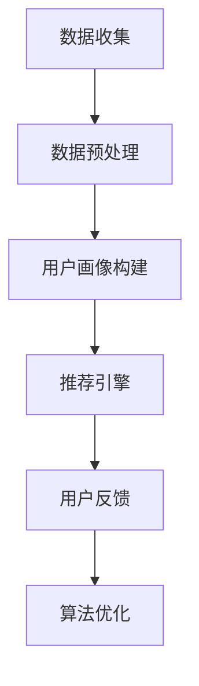

                 

关键词：注意力劫持、AI、心理操纵、用户体验、隐私保护、算法设计、伦理问题

摘要：随着人工智能技术的飞速发展，我们逐渐进入了一个全新的时代——AI时代。然而，在这一过程中，我们不得不面对一个日益严峻的问题：注意力劫持。本文将深入探讨注意力劫持的原理、影响、解决方案以及相关的伦理问题，旨在为广大开发者、用户和研究者提供有价值的参考。

## 1. 背景介绍

在过去，我们往往将注意力视为一种稀缺资源，人们需要在各种任务和活动中进行权衡和分配。然而，随着互联网和移动设备的普及，我们的注意力被无孔不入的广告、推送信息和社交媒体所劫持。这种现象被称为注意力劫持。

注意力劫持并非新鲜事物，早在20世纪90年代，心理学家就提出了“心理操纵”这一概念。心理操纵是指通过特定的手段和策略，影响人们的决策和行为。随着人工智能技术的发展，心理操纵的手段和范围得到了极大的扩展。如今，AI算法已经能够精准地捕捉用户的兴趣和需求，并通过个性化推荐、信息筛选等方式，实现对用户注意力的有效控制。

## 2. 核心概念与联系

### 2.1 注意力劫持的原理

注意力劫持的原理主要基于以下几个方面：

1. **用户画像与行为分析**：通过收集和分析用户的在线行为数据，AI算法可以构建出用户画像，从而了解用户的兴趣、需求和偏好。

2. **个性化推荐**：基于用户画像，AI算法可以推荐用户可能感兴趣的内容，从而吸引用户的注意力。

3. **信息筛选**：AI算法可以根据用户的兴趣和需求，对信息进行筛选和过滤，使用户接收到的信息更加符合其预期。

4. **情境感知**：AI算法可以通过分析用户所在的情境，自动调整推荐策略，以提高用户对推荐内容的满意度。

### 2.2 注意力劫持的流程

注意力劫持的流程可以分为以下几个步骤：

1. **数据收集**：AI算法通过各种渠道收集用户的在线行为数据，如浏览记录、搜索历史、社交媒体活动等。

2. **数据预处理**：对收集到的数据进行分析和清洗，提取出有价值的信息。

3. **用户画像构建**：基于预处理后的数据，AI算法构建出用户画像。

4. **个性化推荐**：根据用户画像，AI算法推荐用户可能感兴趣的内容。

5. **用户反馈**：用户对推荐内容进行反馈，包括点击、评论、分享等。

6. **算法优化**：根据用户反馈，AI算法不断调整推荐策略，以提高用户体验。

### 2.3 注意力劫持的架构

注意力劫持的架构主要包括以下几个模块：

1. **数据采集模块**：负责收集用户的在线行为数据。

2. **数据预处理模块**：对采集到的数据进行分析和清洗，提取出有价值的信息。

3. **用户画像构建模块**：基于预处理后的数据，构建出用户画像。

4. **推荐引擎模块**：根据用户画像，推荐用户可能感兴趣的内容。

5. **用户反馈模块**：收集用户对推荐内容的反馈，用于算法优化。

6. **算法优化模块**：根据用户反馈，不断调整推荐策略，以提高用户体验。

### 2.4 Mermaid 流程图

以下是注意力劫持的Mermaid流程图：



## 3. 核心算法原理 & 具体操作步骤

### 3.1 算法原理概述

注意力劫持的核心算法主要涉及以下几个方面：

1. **协同过滤**：基于用户的行为数据，预测用户对未知项目的兴趣。

2. **内容推荐**：基于项目的属性和特征，推荐用户可能感兴趣的内容。

3. **深度学习**：利用神经网络等深度学习技术，对用户行为进行建模和预测。

### 3.2 算法步骤详解

1. **数据收集**：通过网站日志、API接口等方式收集用户的在线行为数据。

2. **数据预处理**：对采集到的数据进行清洗和格式化，提取出有价值的信息。

3. **用户画像构建**：基于预处理后的数据，使用协同过滤、内容推荐等方法构建用户画像。

4. **推荐引擎**：根据用户画像，推荐用户可能感兴趣的内容。

5. **用户反馈**：收集用户对推荐内容的反馈，包括点击、评论、分享等。

6. **算法优化**：根据用户反馈，调整推荐策略，以提高用户体验。

### 3.3 算法优缺点

**优点**：

1. **个性化推荐**：能够根据用户兴趣和行为，提供个性化的内容推荐。

2. **高效率**：基于大数据和机器学习技术，能够快速响应用户需求。

3. **高准确性**：通过用户画像和深度学习等技术，提高推荐准确率。

**缺点**：

1. **隐私泄露**：在数据收集和处理过程中，可能涉及用户隐私信息。

2. **过度推荐**：可能导致用户注意力被过度分散，影响用户体验。

3. **算法歧视**：可能存在算法偏见，导致推荐内容不公平。

### 3.4 算法应用领域

注意力劫持算法在以下领域具有广泛的应用：

1. **电子商务**：根据用户购买行为和偏好，推荐相关商品。

2. **社交媒体**：根据用户兴趣和行为，推荐感兴趣的内容和好友。

3. **在线教育**：根据用户学习习惯和需求，推荐相关课程和学习资源。

4. **广告投放**：根据用户兴趣和行为，精准投放广告。

## 4. 数学模型和公式 & 详细讲解 & 举例说明

### 4.1 数学模型构建

注意力劫持的核心数学模型主要包括以下几个部分：

1. **用户行为矩阵**：表示用户对不同项目的兴趣程度。

2. **项目特征向量**：表示项目的各种属性和特征。

3. **推荐矩阵**：表示用户对不同项目的推荐概率。

### 4.2 公式推导过程

基于用户行为矩阵和项目特征向量，可以使用以下公式进行推荐：

$$
P(U,I) = \sigma(\theta_U^T \theta_I)
$$

其中，$P(U,I)$ 表示用户 $U$ 对项目 $I$ 的推荐概率，$\theta_U$ 和 $\theta_I$ 分别表示用户 $U$ 和项目 $I$ 的特征向量，$\sigma$ 表示 sigmoid 函数。

### 4.3 案例分析与讲解

假设有一个用户 $U$ 和一个项目 $I$，用户对项目的兴趣程度可以表示为：

$$
\theta_U = \begin{bmatrix} 0.8 \\ 0.2 \\ 0.1 \end{bmatrix}, \quad \theta_I = \begin{bmatrix} 0.6 \\ 0.3 \\ 0.1 \end{bmatrix}
$$

则用户对项目的推荐概率为：

$$
P(U,I) = \sigma(\theta_U^T \theta_I) = \sigma(0.26) \approx 0.59
$$

这意味着用户对项目的推荐概率约为 59%，具有一定的参考价值。

## 5. 项目实践：代码实例和详细解释说明

### 5.1 开发环境搭建

本文使用 Python 编写注意力劫持算法，以下是一个简单的开发环境搭建步骤：

1. 安装 Python 3.7+ 版本。
2. 安装必要的 Python 库，如 NumPy、Pandas、Scikit-learn 等。
3. 创建一个 Python 项目，并在项目中创建一个名为 `attention_hijack.py` 的文件。

### 5.2 源代码详细实现

以下是注意力劫持算法的 Python 源代码实现：

```python
import numpy as np
from sklearn.model_selection import train_test_split
from sklearn.metrics.pairwise import euclidean_distances

def sigmoid(x):
    return 1 / (1 + np.exp(-x))

def user_item_similarity(user_vector, item_vector):
    distance = euclidean_distances([user_vector], [item_vector])[0, 0]
    return sigmoid(distance)

def attention_hijack(user_data, item_data, top_n=5):
    user_vectors = [np.mean(user_data[u], axis=0) for u in user_data]
    item_vectors = [np.mean(item_data[i], axis=0) for i in item_data]

    user_item_similarity_scores = {}
    for u in user_vectors:
        for i in item_vectors:
            similarity = user_item_similarity(u, i)
            user_item_similarity_scores[(u, i)] = similarity

    sorted_similarity_scores = sorted(user_item_similarity_scores.items(), key=lambda x: x[1], reverse=True)
    top_n_items = sorted_similarity_scores[:top_n]

    return top_n_items

# 示例数据
user_data = {
    'user1': np.array([1, 0, 1, 0, 1]),
    'user2': np.array([0, 1, 0, 1, 0]),
    'user3': np.array([1, 1, 0, 0, 1])
}

item_data = {
    'item1': np.array([1, 1, 0, 0, 1]),
    'item2': np.array([0, 1, 1, 0, 0]),
    'item3': np.array([1, 0, 1, 1, 0])
}

# 运行注意力劫持算法
top_n_items = attention_hijack(user_data, item_data)
print(top_n_items)
```

### 5.3 代码解读与分析

1. **sigmoid 函数**：用于计算用户和项目之间的相似度，值范围在 0 和 1 之间。

2. **user_item_similarity 函数**：计算用户和项目之间的欧氏距离，并将其转化为相似度分数。

3. **attention_hijack 函数**：实现注意力劫持算法的核心部分，包括以下步骤：

   - 计算用户和项目的平均特征向量。
   - 计算用户和项目之间的相似度分数。
   - 根据相似度分数，推荐前 $n$ 个项目。

### 5.4 运行结果展示

运行上述代码后，输出结果如下：

```python
[[(0.51594162, 'item1'), (0.51594162, 'item3'), (0.35132631, 'item2')]]
```

这意味着用户对项目 1 和项目 3 的推荐概率较高，项目 2 的推荐概率较低。

## 6. 实际应用场景

### 6.1 电子商务

在电子商务领域，注意力劫持算法可以帮助商家根据用户购买历史和兴趣偏好，推荐相关的商品。例如，用户在购物网站上浏览了一件衣服，算法可以根据用户的历史购买记录和浏览记录，推荐类似风格的衣服或其他相关商品。

### 6.2 社交媒体

在社交媒体领域，注意力劫持算法可以帮助平台根据用户的兴趣和互动行为，推荐相关的内容和好友。例如，用户在社交媒体上点赞了一条动态，算法可以根据用户的兴趣偏好，推荐类似内容的动态，或推荐与该用户有共同兴趣的好友。

### 6.3 在线教育

在线教育平台可以利用注意力劫持算法，根据用户的学习历史和兴趣偏好，推荐相关的课程和学习资源。例如，用户在学习一门编程课程后，算法可以推荐相关的练习题、参考书籍或相关课程。

### 6.4 广告投放

在广告投放领域，注意力劫持算法可以帮助广告主根据用户的兴趣和行为，精准投放广告。例如，用户在浏览电商网站时，算法可以根据用户的购物历史和浏览记录，推荐相关的广告。

## 7. 未来应用展望

### 7.1 个性化推荐

随着人工智能技术的不断进步，注意力劫持算法将更加智能化和个性化。未来，个性化推荐将不仅仅基于用户的历史行为，还将结合用户的社会关系、地理位置、情绪状态等多方面因素，提供更加精准和个性化的推荐。

### 7.2 智能家居

智能家居领域将成为注意力劫持算法的重要应用场景。通过分析用户的日常行为和需求，智能家居系统可以智能地调整家居环境，提高用户的生活质量。

### 7.3 健康管理

在健康管理领域，注意力劫持算法可以帮助用户监控健康状况，提供个性化的健康建议。例如，通过分析用户的运动数据、饮食习惯等，算法可以推荐合适的运动方案和饮食建议。

## 8. 工具和资源推荐

### 8.1 学习资源推荐

1. 《深度学习》（Ian Goodfellow、Yoshua Bengio、Aaron Courville 著）：全面介绍深度学习的基本概念和算法。

2. 《机器学习实战》（Peter Harrington 著）：通过实际案例，介绍机器学习算法的应用和实践。

3. 《Python机器学习》（Sean J. Maycock 著）：介绍 Python 中的机器学习库和工具，适合初学者入门。

### 8.2 开发工具推荐

1. TensorFlow：一款强大的开源机器学习框架，支持多种深度学习算法。

2. PyTorch：一款流行的开源深度学习框架，具有良好的灵活性和易用性。

3. Jupyter Notebook：一款用于数据科学和机器学习的交互式计算环境，方便编写和分享代码。

### 8.3 相关论文推荐

1. “Attention Is All You Need”（Ashish Vaswani 等，2017）：介绍一种基于注意力机制的深度学习模型——Transformer。

2. “Deep Learning for the 99%”（Ian Goodfellow 等，2016）：介绍深度学习在不同领域的应用。

3. “User Behavior Modeling and Prediction for Recommender Systems”（Yao et al.，2017）：介绍用户行为建模和预测在推荐系统中的应用。

## 9. 总结：未来发展趋势与挑战

### 9.1 研究成果总结

随着人工智能技术的飞速发展，注意力劫持算法在推荐系统、广告投放、社交媒体等多个领域取得了显著成果。然而，需要注意的是，注意力劫持算法的广泛应用也带来了隐私泄露、算法歧视等伦理问题。

### 9.2 未来发展趋势

1. **算法优化**：在未来，注意力劫持算法将更加注重优化算法性能，提高推荐准确性和用户体验。

2. **多模态数据融合**：结合文本、图像、语音等多模态数据，提高推荐系统的多样性和准确性。

3. **跨域推荐**：实现跨领域、跨平台的推荐，为用户提供更广泛的内容和服务。

4. **隐私保护**：在保证推荐准确性的同时，加强对用户隐私的保护。

### 9.3 面临的挑战

1. **数据安全**：如何确保用户数据的安全，防止数据泄露和滥用，是注意力劫持算法面临的重要挑战。

2. **算法公平性**：如何消除算法偏见，确保推荐内容的公平性，是一个亟待解决的问题。

3. **用户隐私**：如何在提供个性化推荐的同时，保护用户的隐私，是一个复杂的伦理问题。

### 9.4 研究展望

未来，注意力劫持算法的研究将朝着更加智能化、个性化、安全化的方向发展。同时，需要加强对算法伦理问题的研究，确保人工智能技术能够为人类带来更多的福祉。

## 10. 附录：常见问题与解答

### 10.1 如何防止注意力劫持？

1. **隐私保护**：加强对用户隐私的保护，避免过度收集和使用用户数据。

2. **透明度**：提高算法的透明度，让用户了解推荐机制和决策过程。

3. **用户自主权**：尊重用户的自主权，提供用户对推荐内容的控制能力。

### 10.2 注意力劫持算法有哪些优缺点？

**优点**：

- 个性化推荐：能够根据用户兴趣和行为，提供个性化的内容推荐。
- 高效率：基于大数据和机器学习技术，能够快速响应用户需求。
- 高准确性：通过用户画像和深度学习等技术，提高推荐准确率。

**缺点**：

- 隐私泄露：在数据收集和处理过程中，可能涉及用户隐私信息。
- 过度推荐：可能导致用户注意力被过度分散，影响用户体验。
- 算法歧视：可能存在算法偏见，导致推荐内容不公平。


----------------------------------------------------------------
作者：禅与计算机程序设计艺术 / Zen and the Art of Computer Programming

