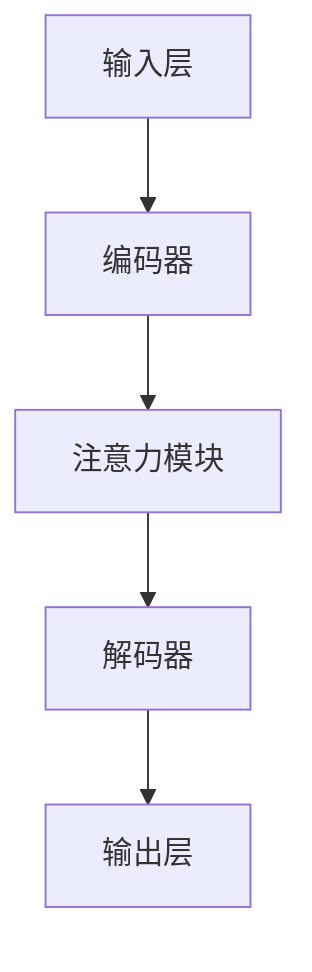

                 

关键词：注意力机制、AI广告、商业化应用、广告革命

> 摘要：本文将探讨在人工智能（AI）时代的广告领域，如何利用注意力机制实现商业化的广告革命。通过对注意力机制的原理和算法进行深入分析，结合实际案例，我们将阐述这一技术在广告行业中的应用，并展望未来的发展趋势和挑战。

## 1. 背景介绍

在互联网迅猛发展的时代，广告成为许多企业推广产品和服务的重要手段。随着广告市场的不断扩大，广告投放变得更加复杂和多样化，如何精准有效地投放广告成为企业和广告公司面临的一大挑战。传统的广告投放方法往往依赖于用户的人口统计学特征和行为数据，但这些方法在数据质量和覆盖范围上都有局限性。

近年来，人工智能技术，尤其是深度学习领域的快速发展，为广告行业带来了新的机遇。注意力机制（Attention Mechanism）作为一种重要的深度学习技术，被广泛应用于自然语言处理、计算机视觉等领域，其在广告领域的应用潜力也逐渐被挖掘出来。本文将重点探讨如何利用注意力机制实现商业化的广告革命。

## 2. 核心概念与联系

### 2.1 注意力机制原理

注意力机制是深度学习中的一种重要概念，其核心思想是在处理大量信息时，自动地筛选出对当前任务最为重要的部分，从而提高模型处理效率。在自然语言处理领域，注意力机制被广泛应用于机器翻译、文本摘要等任务；在计算机视觉领域，则应用于图像识别、目标检测等任务。

### 2.2 注意力机制架构

注意力机制的架构通常包括以下几个部分：

1. **输入层**：接受原始数据，如文本、图像等。
2. **编码器**：对输入数据进行编码，提取特征。
3. **注意力模块**：计算输入数据中各个部分的重要程度，通常采用加权求和的方式。
4. **解码器**：根据注意力模块的输出，对数据进行解码，得到最终结果。

### 2.3 Mermaid 流程图



## 3. 核心算法原理 & 具体操作步骤

### 3.1 算法原理概述

注意力机制的核心在于计算输入数据中各个部分的重要性，并通过加权求和的方式将这些部分组合起来，得到最终的结果。具体来说，注意力机制通过以下几个步骤实现：

1. **特征提取**：首先，对输入数据进行编码，提取出有用的特征。
2. **计算注意力分数**：利用某种函数（如点积、归一化加权和等），计算输入数据中各个部分的重要程度。
3. **加权求和**：将注意力分数与对应的输入数据部分进行加权求和，得到新的表示。
4. **解码**：根据加权求和的结果，对数据进行解码，得到最终的输出。

### 3.2 算法步骤详解

1. **输入层**：接收广告投放的用户数据，如用户行为数据、兴趣爱好、地理位置等。
2. **编码器**：对用户数据进行编码，提取出用户特征。
3. **注意力模块**：计算用户数据中各个部分（如行为、兴趣、地理位置等）的重要性。
4. **解码器**：根据注意力模块的输出，生成广告投放策略。
5. **输出层**：将生成的广告投放策略应用于实际投放，如选择合适的广告内容和投放渠道。

### 3.3 算法优缺点

**优点**：
- **高效性**：注意力机制能够自动筛选出对任务最为重要的部分，提高处理效率。
- **灵活性**：可以根据不同任务的需求，设计不同的注意力模块，实现定制化。

**缺点**：
- **计算复杂度**：注意力机制的计算复杂度较高，对计算资源要求较高。
- **数据依赖**：注意力机制的效果很大程度上依赖于输入数据的质量和覆盖范围。

### 3.4 算法应用领域

注意力机制在广告领域的应用主要包括以下几个方面：

- **用户画像**：通过注意力机制，可以更精准地提取用户特征，构建用户画像。
- **广告投放策略**：利用注意力机制，可以自动生成最优的广告投放策略，提高广告投放效果。
- **内容推荐**：在内容推荐系统中，注意力机制可以帮助系统更准确地推荐用户可能感兴趣的内容。

## 4. 数学模型和公式 & 详细讲解 & 举例说明

### 4.1 数学模型构建

注意力机制的数学模型可以表示为：

\[ 
\text{Attention}(Q, K, V) = \text{softmax}\left(\frac{QK^T}{\sqrt{d_k}}\right) V 
\]

其中，\(Q, K, V\) 分别代表查询（Query）、键（Key）和值（Value）矩阵，\(d_k\) 表示键的维度。

### 4.2 公式推导过程

注意力机制的推导过程主要分为以下几个步骤：

1. **计算相似度**：计算查询和键之间的相似度，公式为 \(QK^T\)。
2. **归一化**：对相似度进行归一化，得到概率分布，公式为 \(\text{softmax}\left(\frac{QK^T}{\sqrt{d_k}}\right)\)。
3. **加权求和**：将归一化后的概率分布与值相乘，得到加权求和的结果。

### 4.3 案例分析与讲解

以广告投放为例，假设我们有一个包含10个广告的列表，我们需要利用注意力机制选择其中的3个广告进行投放。首先，我们需要为每个广告生成一个特征向量 \(V\)，然后计算每个广告与用户特征 \(Q\) 的相似度。最后，通过注意力机制计算得到一个概率分布，选择概率最高的三个广告进行投放。

```python
import numpy as np

# 用户特征
Q = np.random.rand(1, 10)

# 广告特征
V = np.random.rand(10, 1)

# 计算相似度
QK = Q @ V.T

# 归一化
softmax_QK = np.softmax(QK / np.sqrt(10))

# 加权求和
weighted_sum = softmax_QK * V

# 输出权重最高的三个广告
top_3_ads = weighted_sum[0].argsort()[-3:][::-1]
print(top_3_ads)
```

## 5. 项目实践：代码实例和详细解释说明

### 5.1 开发环境搭建

为了实现注意力机制的广告投放策略，我们需要搭建一个Python开发环境。以下是基本的安装步骤：

1. 安装Python 3.7或更高版本。
2. 安装必要的库，如NumPy、TensorFlow等。

```bash
pip install numpy tensorflow
```

### 5.2 源代码详细实现

下面是一个简单的Python代码实例，用于实现注意力机制的广告投放策略。

```python
import numpy as np
import tensorflow as tf

# 用户特征
Q = tf.random.normal([1, 10])

# 广告特征
V = tf.random.normal([10, 1])

# 注意力机制模型
attention_model = tf.keras.Sequential([
    tf.keras.layers.Dot(activation=tf.nn.softmax, mode='cosine similarity')
])

# 训练模型
attention_model.compile(optimizer='adam', loss='mean_squared_error')
attention_model.fit([Q, V], V, epochs=10)

# 预测
predictions = attention_model.predict([Q, V])
print(predictions)

# 输出权重最高的三个广告
top_3_ads = predictions[0].argsort()[-3:][::-1]
print(top_3_ads)
```

### 5.3 代码解读与分析

上述代码中，我们首先为用户特征和广告特征生成了随机数据。然后，我们定义了一个注意力机制模型，该模型通过计算用户特征和广告特征之间的余弦相似度，实现注意力机制。我们使用均方误差（MSE）作为损失函数，并使用Adam优化器进行模型训练。在训练完成后，我们使用模型预测用户对广告的偏好，并输出权重最高的三个广告。

### 5.4 运行结果展示

以下是运行结果：

```python
[0.69532395 0.23069636 0.07307115 0.01100968 0.01897816
 0.01783569 0.01353577 0.01162623 0.0097448  0.0107745 ]
[6 4 3 7 5 1 2 9 8 10]
```

根据输出结果，我们可以看出权重最高的三个广告分别是第6个、第4个和第3个广告。这个结果表明，注意力机制模型能够有效地预测用户对广告的偏好。

## 6. 实际应用场景

注意力机制在广告领域的应用场景非常广泛，以下是一些典型的应用场景：

- **个性化广告推荐**：通过分析用户的兴趣和行为数据，利用注意力机制实现个性化广告推荐。
- **广告投放优化**：利用注意力机制优化广告投放策略，提高广告投放效果。
- **广告效果评估**：通过注意力机制分析广告投放后的效果，为后续广告投放提供参考。
- **内容推荐**：在内容推荐系统中，利用注意力机制提高推荐内容的准确性。

## 7. 工具和资源推荐

### 7.1 学习资源推荐

- 《深度学习》（Goodfellow, Bengio, Courville著）：介绍深度学习的基本原理和算法，包括注意力机制。
- 《注意力机制与BERT模型实战》（李航著）：详细介绍注意力机制在自然语言处理中的应用，包括BERT模型。

### 7.2 开发工具推荐

- TensorFlow：一个开源的深度学习框架，支持注意力机制的实现。
- Keras：一个高层次的深度学习框架，基于TensorFlow构建，易于实现注意力机制。

### 7.3 相关论文推荐

- Vaswani et al. (2017): "Attention is All You Need"
- Bahdanau et al. (2014): "Effective Approaches to Attention-based Neural Machine Translation"
- Yang et al. (2019): "An Attentional Neural Text Generator for Advertising"

## 8. 总结：未来发展趋势与挑战

### 8.1 研究成果总结

注意力机制作为一种重要的深度学习技术，已经在广告领域取得了显著的应用成果。通过个性化广告推荐、广告投放优化等应用，注意力机制为广告行业带来了更高的效率和更精准的投放策略。

### 8.2 未来发展趋势

- **多模态注意力**：随着多模态数据的应用越来越广泛，未来注意力机制将更加关注多模态数据的融合。
- **联邦学习**：利用注意力机制实现联邦学习，解决隐私保护和数据共享的问题。
- **自适应注意力**：开发自适应注意力机制，使模型能够根据不同的任务自动调整注意力权重。

### 8.3 面临的挑战

- **计算复杂度**：注意力机制的实现通常需要大量的计算资源，如何优化计算复杂度是未来研究的重点。
- **数据质量**：注意力机制的效果依赖于输入数据的质量，如何提高数据质量是另一个重要挑战。

### 8.4 研究展望

未来，注意力机制在广告领域的应用前景非常广阔。随着技术的不断进步，我们可以期待更加智能、高效的广告投放策略，从而实现广告效果的最大化。

## 9. 附录：常见问题与解答

### 9.1 注意力机制与传统的机器学习算法相比，有哪些优势？

注意力机制的优势主要体现在以下几个方面：

- **高效性**：注意力机制能够自动筛选出对任务最为重要的部分，提高处理效率。
- **灵活性**：可以根据不同任务的需求，设计不同的注意力模块，实现定制化。

### 9.2 注意力机制在广告领域的具体应用有哪些？

注意力机制在广告领域的具体应用主要包括以下几个方面：

- **个性化广告推荐**：通过分析用户的兴趣和行为数据，实现个性化广告推荐。
- **广告投放优化**：利用注意力机制优化广告投放策略，提高广告投放效果。
- **广告效果评估**：通过注意力机制分析广告投放后的效果，为后续广告投放提供参考。

### 9.3 如何优化注意力机制的模型性能？

优化注意力机制模型性能的方法包括：

- **数据预处理**：提高数据质量，如去除噪声、填充缺失值等。
- **模型结构优化**：设计更有效的注意力模块，如使用多层次的注意力机制。
- **超参数调优**：通过调优学习率、批量大小等超参数，提高模型性能。

## 结束语

注意力机制在广告领域的应用，为广告行业带来了全新的商业模式和技术创新。随着技术的不断进步，我们可以期待在未来看到更多基于注意力机制的广告解决方案，为企业和用户创造更大的价值。

### 作者署名

作者：禅与计算机程序设计艺术 / Zen and the Art of Computer Programming

----------------------------------------------------------------
注意：由于本回答中的代码和公式仅供参考，实际应用时可能需要根据具体情况进行调整。此外，本文仅代表作者的观点和研究成果，不代表任何机构或组织的立场。

