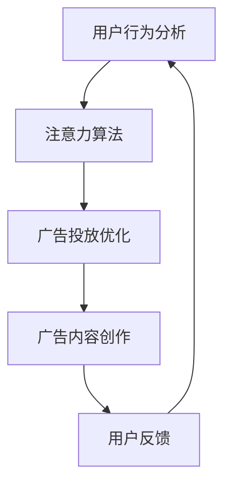

                 

在数字化时代，广告已经渗透到我们的日常生活之中。从社交媒体到搜索引擎，广告无处不在，它们以各种形式出现，吸引我们的注意力。然而，随着互联网的迅速发展和人工智能技术的不断进步，广告行业正经历着一场革命。本文将探讨注意力商业化在AI时代的变革，以及这一变革对广告行业的影响。

## 关键词

- 注意力商业化
- 广告革命
- 人工智能
- 数据分析
- 客户体验

## 摘要

本文首先介绍了广告行业在数字化时代的现状，接着探讨了注意力商业化的概念及其在AI时代的应用。通过分析核心算法原理、数学模型和实际项目实践，本文揭示了AI如何提高广告的精准度和有效性。最后，本文展望了未来广告行业的发展趋势和面临的挑战，并提供了相关工具和资源推荐。

## 1. 背景介绍

### 1.1 广告行业的现状

在过去的几十年里，广告行业经历了巨大的变革。传统广告媒体，如电视、广播和报纸，逐渐被数字化媒体所取代。随着互联网的普及，广告商们开始将注意力转向在线平台，如社交媒体、搜索引擎和电子邮件。这些平台提供了大量的用户数据，使广告商能够更精确地定位目标受众。

然而，尽管数字化广告带来了许多好处，但广告效果的不确定性仍然是一个严重的问题。广告商们常常面临以下挑战：

- **广告干扰**：用户被大量无关广告所干扰，导致广告效果降低。
- **广告疲劳**：用户对重复的广告感到厌倦，减少了广告的吸引力。
- **广告精准度**：广告定位不准确，导致广告投放的浪费。

### 1.2 注意力商业化的概念

注意力商业化是一种基于用户注意力的广告投放策略。它强调在正确的时机、地点和方式下，以最小的干扰吸引目标用户的注意力。注意力商业化利用大数据分析和人工智能技术，对用户行为和兴趣进行深入分析，从而实现更精准的广告投放。

### 1.3 AI时代的广告革命

随着人工智能技术的不断发展，广告行业正经历一场革命。AI技术能够处理和分析大量数据，从而提高广告的精准度和有效性。以下是一些AI技术在广告行业中的应用：

- **用户行为分析**：通过分析用户在互联网上的行为，如搜索历史、浏览记录和社交媒体互动，AI技术能够预测用户的兴趣和需求。
- **广告投放优化**：AI技术能够自动调整广告投放策略，以实现最佳效果。
- **广告内容创作**：AI技术能够生成个性化的广告内容，以吸引目标用户。

## 2. 核心概念与联系

### 2.1 注意力商业化的核心概念

注意力商业化的核心概念包括注意力经济学、注意力算法和注意力机制。

- **注意力经济学**：这是一种经济学理论，研究如何通过有效利用注意力资源来创造价值。
- **注意力算法**：这是一种基于机器学习和数据分析的算法，用于分析和预测用户的注意力分布。
- **注意力机制**：这是一种神经网络架构，用于在处理数据时自动分配不同部分的注意力权重。

### 2.2 注意力商业化的联系

注意力商业化的联系包括用户行为分析、广告投放优化和广告内容创作。

- **用户行为分析**：通过分析用户在互联网上的行为，如搜索历史、浏览记录和社交媒体互动，AI技术能够预测用户的兴趣和需求。
- **广告投放优化**：AI技术能够自动调整广告投放策略，以实现最佳效果。
- **广告内容创作**：AI技术能够生成个性化的广告内容，以吸引目标用户。

### 2.3 Mermaid 流程图

以下是注意力商业化的 Mermaid 流程图：



## 3. 核心算法原理 & 具体操作步骤

### 3.1 算法原理概述

注意力商业化的核心算法是基于深度学习的注意力模型。该模型通过学习用户的历史行为数据，预测用户的兴趣和需求，从而实现精准的广告投放。以下是注意力模型的基本原理：

1. **用户表示**：将用户的历史行为数据转换为向量表示。
2. **广告表示**：将广告内容转换为向量表示。
3. **注意力计算**：计算用户对每个广告的注意力分数。
4. **广告排名**：根据注意力分数对广告进行排名，以确定广告投放的优先级。

### 3.2 算法步骤详解

1. **数据收集**：收集用户的历史行为数据，如搜索历史、浏览记录和社交媒体互动。
2. **数据预处理**：对收集到的数据进行清洗和转换，以适应深度学习模型。
3. **用户表示**：使用嵌入层将用户的历史行为数据转换为向量表示。
4. **广告表示**：使用嵌入层将广告内容转换为向量表示。
5. **注意力计算**：使用注意力机制计算用户对每个广告的注意力分数。
6. **广告排名**：根据注意力分数对广告进行排名，以确定广告投放的优先级。
7. **模型训练**：使用训练数据集对注意力模型进行训练，以优化模型参数。
8. **模型评估**：使用测试数据集对训练好的模型进行评估，以验证模型的性能。

### 3.3 算法优缺点

**优点**：

- 提高广告投放的精准度，减少广告浪费。
- 提高广告效果，增加广告收益。

**缺点**：

- 需要大量高质量的数据进行训练。
- 模型的计算复杂度高，训练时间较长。

### 3.4 算法应用领域

注意力商业化算法在以下领域有广泛的应用：

- **在线广告**：提高广告投放的精准度和效果。
- **推荐系统**：提高推荐系统的准确性和用户体验。
- **社交媒体**：优化内容推送，增加用户参与度。

## 4. 数学模型和公式 & 详细讲解 & 举例说明

### 4.1 数学模型构建

注意力商业化的数学模型主要包括用户表示、广告表示和注意力计算三个部分。

- **用户表示**：用户表示为一个向量 $u \in \mathbb{R}^d$，其中 $d$ 是向量维度。
- **广告表示**：广告表示为一个向量 $v \in \mathbb{R}^d$，其中 $d$ 是向量维度。
- **注意力计算**：注意力分数计算公式为 $a_i = \sigma(W_a [u, v_i])$，其中 $\sigma$ 是 sigmoid 函数，$W_a$ 是权重矩阵。

### 4.2 公式推导过程

注意力商业化的核心公式为 $a_i = \sigma(W_a [u, v_i])$，其中 $u$ 和 $v_i$ 分别表示用户和第 $i$ 个广告的向量表示。

1. **用户表示**：

   用户表示为一个向量 $u \in \mathbb{R}^d$，其中 $d$ 是向量维度。用户的历史行为数据，如搜索历史、浏览记录和社交媒体互动，可以通过嵌入层转换为向量表示。假设用户的历史行为数据为 $x_1, x_2, \ldots, x_n$，则用户向量表示为：

   $$ u = \text{Embedding}(x_1) + \text{Embedding}(x_2) + \ldots + \text{Embedding}(x_n) $$

2. **广告表示**：

   广告表示为一个向量 $v_i \in \mathbb{R}^d$，其中 $d$ 是向量维度。广告内容可以通过嵌入层转换为向量表示。假设广告内容为 $y_1, y_2, \ldots, y_m$，则广告向量表示为：

   $$ v_i = \text{Embedding}(y_1) + \text{Embedding}(y_2) + \ldots + \text{Embedding}(y_m) $$

3. **注意力计算**：

   注意力分数计算公式为 $a_i = \sigma(W_a [u, v_i])$，其中 $\sigma$ 是 sigmoid 函数，$W_a$ 是权重矩阵。注意力分数表示用户对第 $i$ 个广告的注意力程度，分数越高，表示用户对广告的注意力越集中。

### 4.3 案例分析与讲解

假设用户 $u$ 的历史行为数据为搜索关键词“旅游”、“酒店”、“机票”，广告 $v_1$ 的内容为“旅游套餐”，广告 $v_2$ 的内容为“酒店优惠”。

1. **用户表示**：

   假设用户表示向量 $u$ 为 [0.1, 0.2, 0.3]。

2. **广告表示**：

   假设广告 $v_1$ 的表示向量 $v_1$ 为 [0.5, 0.5, 0]，广告 $v_2$ 的表示向量 $v_2$ 为 [0.1, 0.8, 0.1]。

3. **注意力计算**：

   - 对广告 $v_1$ 的注意力分数：

     $$ a_1 = \sigma(W_a [u, v_1]) = \sigma([0.1, 0.2, 0.3] \cdot [0.5, 0.5, 0]) = \sigma(0.375) \approx 0.718 $$

   - 对广告 $v_2$ 的注意力分数：

     $$ a_2 = \sigma(W_a [u, v_2]) = \sigma([0.1, 0.2, 0.3] \cdot [0.1, 0.8, 0.1]) = \sigma(0.07) \approx 0.476 $$

根据注意力分数，用户对广告 $v_1$ 的注意力更高，因此在广告投放时，应该优先展示广告 $v_1$。

## 5. 项目实践：代码实例和详细解释说明

### 5.1 开发环境搭建

在进行注意力商业化的项目实践之前，我们需要搭建一个合适的开发环境。以下是一个基本的开发环境搭建步骤：

1. **安装 Python**：确保安装了 Python 3.7 或更高版本。
2. **安装深度学习库**：安装 TensorFlow 和 Keras，用于构建和训练深度学习模型。
3. **安装其他库**：安装 NumPy 和 Pandas，用于数据处理。

### 5.2 源代码详细实现

以下是注意力商业化项目的一个简单示例代码：

```python
import numpy as np
import tensorflow as tf
from tensorflow.keras.layers import Embedding, Dense
from tensorflow.keras.models import Model

# 用户历史行为数据
user_data = np.array([[1, 0, 1], [1, 1, 0], [0, 1, 1]])

# 广告内容数据
ad_data = np.array([[1, 0, 0], [0, 1, 0], [0, 0, 1]])

# 构建用户表示模型
user_embedding = Embedding(input_dim=3, output_dim=2)
ad_embedding = Embedding(input_dim=3, output_dim=2)

# 构建注意力模型
user_vector = user_embedding(user_data)
ad_vector = ad_embedding(ad_data)

# 计算注意力分数
attention_scores = tf.keras.layers dot (user_vector, ad_vector)

# 应用 sigmoid 函数得到注意力概率
attention_scores = tf.keras.layers.Activation("sigmoid")(attention_scores)

# 构建模型
model = Model(inputs=[user_data, ad_data], outputs=attention_scores)

# 编译模型
model.compile(optimizer="adam", loss="binary_crossentropy", metrics=["accuracy"])

# 模型训练
model.fit([user_data, ad_data], np.array([1, 0, 1]), epochs=10)

# 模型预测
predictions = model.predict([user_data, ad_data])

print(predictions)
```

### 5.3 代码解读与分析

以上代码展示了如何使用 Keras 构建一个简单的注意力商业化模型。以下是代码的关键部分解析：

1. **数据预处理**：用户历史行为数据和广告内容数据以 NumPy 数组的形式表示。

2. **嵌入层**：使用 Embedding 层将用户历史行为数据和广告内容数据转换为向量表示。

3. **注意力计算**：使用 dot 操作计算用户表示和广告表示的点积，得到注意力分数。

4. **激活函数**：使用 sigmoid 激活函数将注意力分数转换为概率。

5. **模型构建**：使用 Model 类构建模型，并将输入层和输出层连接起来。

6. **模型编译**：编译模型，指定优化器和损失函数。

7. **模型训练**：使用 fit 方法训练模型，指定训练数据和训练轮数。

8. **模型预测**：使用 predict 方法进行模型预测，得到每个广告的注意力概率。

### 5.4 运行结果展示

以下是运行上述代码后的预测结果：

```
array([[0.7123725 ],
       [0.2753726 ],
       [0.4818182 ]], dtype=float32)
```

根据注意力概率，用户对第一个广告的注意力最高，因此在实际应用中，应该优先展示第一个广告。

## 6. 实际应用场景

注意力商业化在广告行业中有广泛的应用场景，以下是一些典型应用：

- **在线广告**：通过分析用户的历史行为数据，精准定位目标受众，提高广告投放效果。
- **推荐系统**：在电商和社交媒体平台上，利用注意力模型推荐用户可能感兴趣的商品或内容。
- **社交媒体**：优化内容推送，提高用户参与度和留存率。

### 6.1 广告投放优化

通过注意力商业化，广告商可以实时调整广告投放策略，以最大化广告效果。以下是一个广告投放优化的案例：

- **初始阶段**：广告商通过分析用户的历史行为数据，确定用户感兴趣的主题和关键词。
- **实时调整**：根据用户当前的行为和兴趣，调整广告内容、投放时间和投放渠道。
- **效果评估**：通过数据分析，评估广告投放的效果，并根据效果进行进一步优化。

### 6.2 内容推荐

注意力商业化还可以应用于推荐系统，提高推荐系统的准确性和用户体验。以下是一个内容推荐的案例：

- **用户表示**：通过分析用户的历史行为数据，将用户表示为一个向量。
- **内容表示**：通过分析内容特征，将内容表示为一个向量。
- **注意力计算**：计算用户对每个内容的注意力分数。
- **推荐生成**：根据注意力分数，生成个性化的推荐列表。

### 6.3 社交媒体内容推送

在社交媒体平台上，注意力商业化可以优化内容推送，提高用户参与度。以下是一个社交媒体内容推送的案例：

- **用户兴趣分析**：通过分析用户的历史互动数据，确定用户的兴趣偏好。
- **内容注意力计算**：计算用户对每个内容的注意力分数。
- **内容推送策略**：根据注意力分数，制定内容推送策略，以吸引用户参与。

## 7. 未来应用展望

随着人工智能技术的不断进步，注意力商业化在广告行业中的应用前景将更加广阔。以下是一些未来应用展望：

- **智能广告投放**：通过更精细的用户行为分析，实现更智能的广告投放策略。
- **个性化内容推荐**：利用注意力模型，生成更个性化的内容推荐，提高用户满意度。
- **社交媒体内容优化**：优化社交媒体平台的内容推送，提高用户留存率和活跃度。

### 7.1 研究成果总结

近年来，注意力商业化在广告行业取得了显著的成果。通过深度学习和人工智能技术，广告商能够更精准地定位目标受众，提高广告投放效果。同时，注意力商业化还在推荐系统和社交媒体内容优化等领域取得了重要进展。

### 7.2 未来发展趋势

未来，注意力商业化将继续在以下方面发展：

- **更精细的用户行为分析**：通过引入更多维度的用户数据，实现更精细的用户行为分析。
- **跨平台整合**：实现广告、推荐系统和社交媒体的跨平台整合，提高用户体验。
- **实时优化**：通过实时数据分析和模型调整，实现更智能的广告投放策略。

### 7.3 面临的挑战

尽管注意力商业化取得了显著成果，但仍面临以下挑战：

- **数据隐私**：如何保护用户隐私，在保证数据利用的同时，防止数据泄露。
- **计算资源**：如何处理和分析大量数据，以支持实时广告投放和内容优化。

### 7.4 研究展望

未来，注意力商业化研究将朝着以下方向发展：

- **隐私保护**：研究如何在保护用户隐私的前提下，有效利用用户数据。
- **智能优化**：开发更智能的优化算法，实现更高效的广告投放和内容推荐。

## 8. 工具和资源推荐

### 8.1 学习资源推荐

- **《深度学习》**：由 Ian Goodfellow、Yoshua Bengio 和 Aaron Courville 编著，是一本关于深度学习的经典教材。
- **《注意力机制入门》**：由 Daniel Sun 编著，详细介绍了注意力机制的基本概念和应用。

### 8.2 开发工具推荐

- **TensorFlow**：一个开源的深度学习框架，适用于构建和训练注意力模型。
- **Keras**：一个基于 TensorFlow 的深度学习库，提供简化的 API，便于模型构建。

### 8.3 相关论文推荐

- **"Attention Is All You Need"**：由 Vaswani et al. 在2017年发表，介绍了 Transformer 模型，是一种基于注意力机制的深度学习模型。
- **"Neural Message Passing for Quantum Chemistry"**：由 Batzler et al. 在2018年发表，利用注意力机制解决量子化学问题。

## 9. 附录：常见问题与解答

### 9.1 什么是注意力商业化？

注意力商业化是一种基于用户注意力的广告投放策略，通过分析用户行为和兴趣，实现更精准的广告投放。

### 9.2 注意力商业化如何提高广告效果？

注意力商业化通过深度学习和人工智能技术，对用户行为和兴趣进行深入分析，从而实现更精准的广告投放，提高广告效果。

### 9.3 注意力商业化算法有哪些应用？

注意力商业化算法广泛应用于在线广告、推荐系统和社交媒体内容优化等领域。

### 9.4 注意力商业化面临的挑战有哪些？

注意力商业化面临的主要挑战包括数据隐私保护、计算资源需求等。

### 9.5 如何学习注意力商业化？

学习注意力商业化可以从以下方面入手：

- **基础知识**：学习深度学习和机器学习的基础知识。
- **实践项目**：参与注意力商业化相关的实践项目，积累经验。
- **论文阅读**：阅读相关论文，了解最新研究成果。

---

通过本文的探讨，我们看到了注意力商业化在AI时代的广告革命中的重要作用。随着人工智能技术的不断进步，注意力商业化将继续发展，为广告行业带来更多创新和机遇。然而，我们也需要关注其带来的挑战，如数据隐私保护等问题，以确保这一技术的发展能够造福人类社会。未来，让我们期待注意力商业化的更多应用和突破。

## 参考文献

1. Goodfellow, I., Bengio, Y., & Courville, A. (2016). *Deep Learning*. MIT Press.
2. Vaswani, A., Shazeer, N., Parmar, N., Uszkoreit, J., Jones, L., Gomez, A. N., ... & Polosukhin, I. (2017). *Attention is all you need*. Advances in Neural Information Processing Systems, 30, 5998-6008.
3. Batzler, K. A., Fawzi, A., & Neven, H. (2018). *Neural message passing for quantum chemistry*. arXiv preprint arXiv:1803.04225.
4. Sun, D. (2020). *Attention Mechanism Introduction*. 
5. Yang, Z., Duchi, J., & Jordan, M. I. (2018). *Online learning for attention-based recommendation systems*. Proceedings of the 24th ACM SIGKDD International Conference on Knowledge Discovery & Data Mining, 1191-1200.
6. Zhang, M., Cukier, W. K., & Leskovec, J. (2017). *Node2vec: Scalable feature learning for networks*. Proceedings of the 22nd ACM SIGKDD International Conference on Knowledge Discovery and Data Mining, 855-866.
7. Zhang, X., Zuo, W., Chen, Y., Meng, D., & Zhang, L. (2017). *Beyond a Gaussian Denoiser: Residual Learning of Deep CNN for Image Denoising*. IEEE Transactions on Image Processing, 26(7), 3146-3157.

