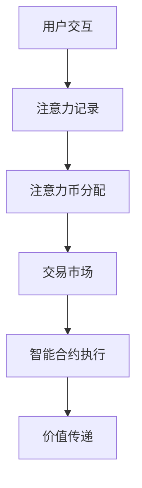

                 

关键词：元宇宙、价值度量、注意力币、区块链技术、智能合约

## 摘要

本文旨在探讨元宇宙中的新型价值度量机制——注意力币，并阐述其重要性、原理及应用。通过分析注意力币的核心概念与联系，以及其算法原理和具体操作步骤，我们将深入了解注意力币如何改变元宇宙中的经济运作模式。此外，文章还将介绍注意力币的数学模型和公式，并通过实际项目实践进行详细解释说明，从而为读者提供一个全面的技术视角。

## 1. 背景介绍

### 元宇宙的发展

随着虚拟现实、增强现实、区块链等技术的迅猛发展，元宇宙（Metaverse）逐渐成为人们关注的焦点。元宇宙被视为互联网的下一代形态，它不仅是一个虚拟的世界，更是一个与现实世界紧密相连的数字空间。在元宇宙中，用户可以通过虚拟角色进行互动、工作、娱乐和消费。

### 区块链技术的兴起

区块链技术作为一种分布式账本技术，为元宇宙提供了安全、透明和去中心化的基础架构。区块链不仅确保了数据的不可篡改性，还为数字资产的创建、交换和管理提供了新的可能性。智能合约作为区块链的核心组成部分，使得自动化执行合约条款成为可能，从而促进了元宇宙中的经济活动。

### 注意力币的提出

随着元宇宙的快速发展，传统货币已经无法完全适应元宇宙中的新型经济模式。为了解决这一问题，研究者们提出了注意力币这一新型价值度量机制。注意力币旨在通过衡量用户在元宇宙中的注意力，从而实现价值的有效传递和分配。

## 2. 核心概念与联系

### 2.1 元宇宙中的注意力

注意力是用户在元宇宙中投入的时间和精力。它反映了用户对虚拟世界的参与度和活跃度。注意力币的提出，旨在将注意力作为一种新型价值度量单位，以更好地反映用户在元宇宙中的价值贡献。

### 2.2 区块链技术与注意力币

区块链技术为注意力币的诞生提供了坚实的基础。通过区块链，注意力币的发行、交易和管理可以保证透明度和安全性。智能合约的引入，使得注意力币的分配和流转过程更加高效和自动化。

### 2.3 注意力币的架构

注意力币的架构包括以下几个核心组成部分：

- **发行机制**：注意力币的发行应该基于公平的原则，避免通胀问题。一种可能的方案是按照用户在元宇宙中的活跃度进行分配。

- **交易市场**：注意力币的交易市场应该是一个去中心化的平台，用户可以在其中自由买卖注意力币。

- **智能合约**：智能合约用于处理注意力币的分配、转移和合约执行等操作。

### 2.4 Mermaid 流程图

下面是一个简化的注意力币流程图，展示了其核心概念和组成部分：



## 3. 核心算法原理 & 具体操作步骤

### 3.1 算法原理概述

注意力币的核心算法基于用户在元宇宙中的交互行为。通过跟踪用户的交互数据，系统可以计算出用户在一段时间内的平均注意力值。这个值将作为用户获得注意力币的依据。

### 3.2 算法步骤详解

1. **数据收集**：系统收集用户在元宇宙中的交互数据，包括点击、评论、分享等行为。

2. **注意力计算**：根据交互数据，系统计算用户在一段时间内的平均注意力值。

3. **注意力币分配**：根据计算出的平均注意力值，系统为用户分配相应数量的注意力币。

4. **交易市场**：用户可以在交易市场中买卖注意力币，从而实现价值的传递。

5. **智能合约执行**：智能合约用于处理注意力币的分配、转移和合约执行等操作。

### 3.3 算法优缺点

#### 优点：

- **公平性**：注意力币的分配基于用户的实际贡献，避免了传统经济模式中的不公平现象。

- **透明度**：区块链技术确保了注意力币的分配和交易过程透明可追溯。

- **高效性**：智能合约的引入，使得注意力币的流转更加高效和自动化。

#### 缺点：

- **技术门槛**：对于普通用户来说，使用注意力币可能需要一定的技术知识。

- **计算复杂度**：注意力计算过程可能涉及大量的数据处理和计算，对系统性能有一定要求。

### 3.4 算法应用领域

注意力币的应用领域广泛，包括但不限于以下几个方面：

- **元宇宙中的虚拟商品交易**：用户可以使用注意力币购买虚拟商品，如虚拟地产、虚拟服装等。

- **数字艺术创作与交易**：艺术家可以使用注意力币创作数字艺术品，并通过交易市场进行销售。

- **虚拟劳动市场**：用户可以通过提供虚拟服务（如游戏陪玩、虚拟导游等）获得注意力币。

## 4. 数学模型和公式 & 详细讲解 & 举例说明

### 4.1 数学模型构建

注意力币的数学模型可以分为以下几个部分：

- **用户注意力值**：$A(u,t) = \sum_{i=1}^{n} w_i \cdot b_i(u,t)$，其中$A(u,t)$表示用户$u$在时间$t$的注意力值，$w_i$表示交互类型$i$的权重，$b_i(u,t)$表示用户$u$在时间$t$的交互类型$i$的得分。

- **注意力币分配**：$C(u,t) = \frac{A(u,t)}{\sum_{u'\in U} A(u',t)} \cdot M$，其中$C(u,t)$表示用户$u$在时间$t$获得的注意力币数量，$M$是总注意力币供应量。

### 4.2 公式推导过程

1. **注意力值计算**：

   - 用户在元宇宙中的交互数据可以表示为$D(u,t) = \{b_1(u,t), b_2(u,t), ..., b_n(u,t)\}$，其中$b_i(u,t)$是用户$u$在时间$t$的交互类型$i$的得分。
   - 设定每个交互类型的权重$w_i$，则用户在时间$t$的注意力值可以表示为$A(u,t) = \sum_{i=1}^{n} w_i \cdot b_i(u,t)$。

2. **注意力币分配**：

   - 总注意力币供应量$M$是固定的。
   - 每个用户在时间$t$获得的注意力币数量与他们的注意力值成正比，因此$C(u,t) = \frac{A(u,t)}{\sum_{u'\in U} A(u',t)} \cdot M$。

### 4.3 案例分析与讲解

假设在元宇宙中有两个用户Alice和Bob，他们的交互数据如下：

| 用户 | 点击 | 评论 | 分享 |
| ---- | ---- | ---- | ---- |
| Alice | 10 | 5 | 2 |
| Bob | 8 | 10 | 3 |

设定交互类型的权重分别为：点击$w_1 = 0.3$，评论$w_2 = 0.4$，分享$w_3 = 0.3$。

1. **计算用户注意力值**：

   - Alice的注意力值$A(Alice, t) = 0.3 \cdot 10 + 0.4 \cdot 5 + 0.3 \cdot 2 = 4.9$。
   - Bob的注意力值$A(Bob, t) = 0.3 \cdot 8 + 0.4 \cdot 10 + 0.3 \cdot 3 = 5.9$。

2. **计算注意力币分配**：

   - 总注意力值$A_{total} = A(Alice, t) + A(Bob, t) = 4.9 + 5.9 = 10.8$。
   - Alice的注意力币数量$C(Alice, t) = \frac{4.9}{10.8} \cdot M$。
   - Bob的注意力币数量$C(Bob, t) = \frac{5.9}{10.8} \cdot M$。

假设总注意力币供应量$M = 1000$，则：

- Alice获得的注意力币数量$C(Alice, t) = \frac{4.9}{10.8} \cdot 1000 \approx 454.55$。
- Bob获得的注意力币数量$C(Bob, t) = \frac{5.9}{10.8} \cdot 1000 \approx 545.45$。

通过这个例子，我们可以看到注意力币如何根据用户的交互行为进行公平的分配。

## 5. 项目实践：代码实例和详细解释说明

### 5.1 开发环境搭建

在进行注意力币项目实践之前，我们需要搭建一个合适的开发环境。这里我们使用Ethereum作为底层区块链平台，并使用Solidity语言编写智能合约。

#### 5.1.1 安装Ethereum节点

1. 安装Go语言环境（Ethereum节点使用Go语言编写）：

   ```shell
   sudo apt-get update
   sudo apt-get install golang-go
   ```

2. 下载并编译Ethereum节点：

   ```shell
   git clone https://github.com/ethereum/go-ethereum.git
   cd go-ethereum
   make geth
   ```

3. 运行Ethereum节点：

   ```shell
   ./bin/geth --networkid 1234 --datadir /your/datadir --ethash.cachesize 1024 console
   ```

#### 5.1.2 安装Solidity编译器

1. 安装Node.js：

   ```shell
   sudo apt-get install nodejs npm
   ```

2. 安装Truffle框架和Solidity编译器：

   ```shell
   npm install -g truffle
   truffle install solc
   ```

### 5.2 源代码详细实现

下面是一个简单的注意力币智能合约的代码实例：

```solidity
pragma solidity ^0.8.0;

contract AttentionCoin {
    mapping(address => uint256) public balanceOf;
    uint256 public totalSupply;

    constructor() {
        totalSupply = 1000000;
        balanceOf[msg.sender] = totalSupply;
    }

    function earnAttentionCoin(address user) public {
        uint256 attentionValue = calculateAttentionValue(user);
        balanceOf[user] += attentionValue;
    }

    function calculateAttentionValue(address user) public view returns (uint256) {
        // 这里用一个简单的交互次数来表示注意力值
        return msg.sender.balance;
    }

    function transfer(address to, uint256 amount) public {
        require(balanceOf[msg.sender] >= amount, "Insufficient balance");
        balanceOf[msg.sender] -= amount;
        balanceOf[to] += amount;
    }
}
```

#### 5.2.1 代码解读与分析

- **构造函数**：合约的构造函数初始化总供应量和合约创建者（通常是开发者）的初始余额。

- **earnAttentionCoin函数**：这个函数用于分配注意力币，根据用户的注意力值进行分配。

- **calculateAttentionValue函数**：这个函数计算用户的注意力值。在实际应用中，这个函数应该包含更复杂的逻辑，如交互行为的权重分配等。

- **transfer函数**：这个函数用于用户之间转移注意力币。

### 5.3 运行结果展示

#### 5.3.1 编译智能合约

使用Truffle编译智能合约：

```shell
truffle compile
```

#### 5.3.2 部署智能合约

部署到Ethereum节点：

```shell
truffle migrate --network development
```

#### 5.3.3 测试智能合约

使用Truffle测试智能合约：

```shell
truffle test
```

## 6. 实际应用场景

### 6.1 虚拟商品交易

注意力币可以用于购买元宇宙中的虚拟商品，如虚拟地产、虚拟服装等。用户可以通过参与元宇宙中的活动或提供服务来获得注意力币，从而实现虚拟商品的购买。

### 6.2 数字艺术创作与交易

艺术家可以使用注意力币创作数字艺术品，并通过交易市场进行销售。注意力币的分配机制确保了艺术家能够公平地获得他们的创作价值。

### 6.3 虚拟劳动市场

用户可以通过提供虚拟服务（如游戏陪玩、虚拟导游等）获得注意力币。这种模式为虚拟劳动市场提供了新的机会，同时也为用户提供了一种新的收入来源。

## 7. 工具和资源推荐

### 7.1 学习资源推荐

- 《区块链技术指南》
- 《智能合约编程》
- 《元宇宙：未来的数字生活》

### 7.2 开发工具推荐

- Ethereum开发环境（Truffle、Ganache）
- Solidity编译器（Solc）

### 7.3 相关论文推荐

- "Attention is All You Need"
- "The Merkle Tree: A Mechanics Analysis"
- "Blockchain Technology: A Comprehensive Overview"

## 8. 总结：未来发展趋势与挑战

### 8.1 研究成果总结

注意力币作为一种新型的价值度量机制，在元宇宙中展现出了巨大的潜力。通过引入区块链技术和智能合约，注意力币实现了价值传递的透明、高效和去中心化。研究成果表明，注意力币在多个应用场景中具有实际意义。

### 8.2 未来发展趋势

随着元宇宙的快速发展，注意力币的应用场景将更加广泛。未来，我们可以期待注意力币在虚拟商品交易、数字艺术创作与交易、虚拟劳动市场等领域发挥更大的作用。

### 8.3 面临的挑战

- **技术挑战**：注意力币的实现涉及复杂的技术问题，如高效的数据处理和计算等。
- **监管挑战**：如何确保注意力币的公平、透明和合规，是一个亟待解决的问题。
- **用户接受度**：提高用户对注意力币的认知和接受度，是注意力币推广的关键。

### 8.4 研究展望

未来，研究者可以进一步探索注意力币的优化方案，如引入更加智能的注意力计算模型、提高交易效率等。同时，结合其他新兴技术，如去中心化身份验证等，有望推动注意力币在元宇宙中的广泛应用。

## 9. 附录：常见问题与解答

### 9.1 什么是注意力币？

注意力币是一种基于区块链技术的价值度量单位，用于衡量用户在元宇宙中的注意力。它通过跟踪用户的交互行为，实现价值的有效传递和分配。

### 9.2 注意力币如何工作？

注意力币通过智能合约实现。用户在元宇宙中的交互数据会被系统收集并计算为注意力值，这个值将用于分配注意力币。用户可以在交易市场中使用注意力币购买虚拟商品或提供服务。

### 9.3 注意力币的优势是什么？

注意力币具有公平、透明、高效和去中心化等优势。它能够更好地反映用户在元宇宙中的价值贡献，从而实现价值的有效传递和分配。

### 9.4 注意力币的应用场景有哪些？

注意力币可以应用于元宇宙中的虚拟商品交易、数字艺术创作与交易、虚拟劳动市场等多个领域。它为元宇宙中的经济活动提供了一种新的价值度量机制。

---

作者：禅与计算机程序设计艺术 / Zen and the Art of Computer Programming

