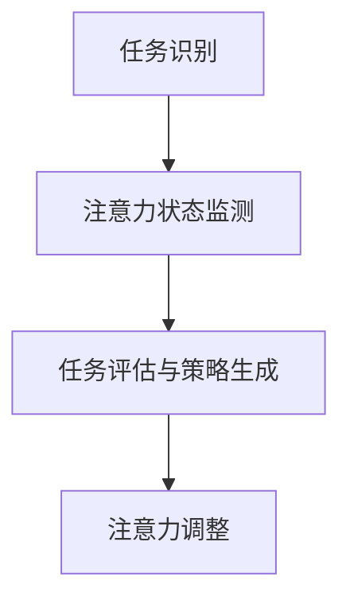

                 

关键词：注意力平衡、AI、认知资源分配、调校、神经科学、算法、应用场景、未来展望

> 摘要：本文旨在探讨在人工智能时代，如何通过优化认知资源的分配来提高个体和机器的注意力平衡。通过对神经科学和认知心理学的深入研究，本文提出了一种名为“注意力平衡仪”的新型工具，并详细阐述了其核心概念、算法原理、数学模型和实际应用。文章还探讨了该工具在不同领域中的应用场景，并对未来的发展趋势和挑战进行了展望。

## 1. 背景介绍

在当今这个信息爆炸的时代，人们面临的信息量比以往任何时候都要庞大。这种信息过载的现象不仅影响了人类的工作效率，还可能导致认知资源的过度消耗。与此同时，随着人工智能技术的迅猛发展，机器也在不断地参与到我们的日常生活中，与我们共享认知资源。然而，无论是人类还是机器，其认知资源都是有限的。如何在有限的时间内，有效地分配和利用这些资源，成为了我们亟待解决的问题。

注意力平衡，是指个体或机器在处理信息时，根据任务的重要性和紧急程度，合理分配注意力资源，以达到最优的认知效果。在人工智能时代，注意力平衡不仅关乎人类个体的心理健康，还直接影响机器的性能和效率。因此，研究如何通过技术手段实现注意力平衡，具有重要的现实意义。

本文将介绍一种名为“注意力平衡仪”的新型工具，它可以帮助用户（包括人类和机器）实现认知资源的合理分配。通过深入分析神经科学和认知心理学的原理，我们提出了一套完整的算法框架，并利用数学模型对算法进行了详细的描述。接下来，我们将详细介绍该工具的核心概念、算法原理、数学模型以及实际应用。

## 2. 核心概念与联系

### 2.1. 注意力平衡仪的定义

注意力平衡仪（Attention Balancer），简称AB，是一种基于神经科学和认知心理学原理，旨在优化认知资源分配的工具。它通过监测用户（或机器）的注意力状态，动态调整注意力分配策略，以实现最佳的认知效果。

### 2.2. 核心概念原理

注意力平衡仪的核心概念包括以下几个部分：

- **注意力资源**：指个体或机器在处理信息时所能调用的认知资源。
- **任务评估**：对用户当前所面临任务的紧急程度和重要性进行评估，以确定注意力的分配策略。
- **动态调整**：根据注意力资源的实时变化，动态调整注意力分配策略，以保持最优的认知效果。

### 2.3. 注意力平衡仪的架构

注意力平衡仪的架构可以分为三个层次：感知层、决策层和执行层。

- **感知层**：负责监测用户的注意力状态，可以通过生理信号（如脑电波、眼动数据）或行为信号（如打字速度、鼠标移动轨迹）进行。
- **决策层**：根据感知层提供的信息，结合任务评估结果，动态调整注意力分配策略。
- **执行层**：根据决策层的策略，对用户的注意力进行实际调整，例如通过调整屏幕亮度、声音大小等方式。

### 2.4. 注意力平衡仪的工作流程

注意力平衡仪的工作流程可以分为以下几个步骤：

1. **任务识别**：监测用户当前的任务，确定任务的紧急程度和重要性。
2. **注意力状态监测**：通过感知层监测用户的注意力状态，包括生理信号和行为信号。
3. **任务评估与策略生成**：根据任务识别和注意力状态监测的结果，评估任务的重要性和紧急程度，生成最优的注意力分配策略。
4. **注意力调整**：根据决策层的策略，对用户的注意力进行实际调整，以实现最佳的认知效果。

### 2.5. 注意力平衡仪的 Mermaid 流程图



在上面的流程图中，A表示任务识别，B表示注意力状态监测，C表示任务评估与策略生成，D表示注意力调整。整个流程图展示了注意力平衡仪从任务识别到注意力调整的全过程。

## 3. 核心算法原理 & 具体操作步骤

### 3.1. 算法原理概述

注意力平衡仪的核心算法基于神经科学和认知心理学的理论，通过监测用户的注意力状态，动态调整注意力分配策略。算法的基本原理可以概括为以下几点：

1. **注意力资源有限**：用户的注意力资源是有限的，需要根据任务的重要性和紧急程度进行合理分配。
2. **动态调整策略**：根据注意力资源的实时变化，动态调整注意力分配策略，以保持最优的认知效果。
3. **任务评估与优先级分配**：对用户的当前任务进行评估，确定任务的紧急程度和重要性，以此为依据进行注意力资源的优先级分配。

### 3.2. 算法步骤详解

注意力平衡仪的算法步骤可以分为以下几个部分：

1. **任务识别**：通过感知层监测用户的注意力状态，识别当前的任务。
2. **注意力状态监测**：监测用户的注意力状态，包括生理信号和行为信号。
3. **任务评估**：根据任务识别和注意力状态监测的结果，对任务的紧急程度和重要性进行评估。
4. **策略生成**：根据任务评估结果，生成最优的注意力分配策略。
5. **注意力调整**：根据决策层的策略，对用户的注意力进行实际调整。

### 3.3. 算法优缺点

注意力平衡仪算法的优点包括：

- **动态调整**：根据用户的注意力状态和任务需求，动态调整注意力分配策略，提高了认知效率。
- **多维度监测**：通过生理信号和行为信号的多维度监测，提高了注意力状态的准确性和实时性。

但算法也存在一些缺点，例如：

- **复杂度高**：算法涉及到多个维度的数据监测和计算，复杂度较高，对计算资源有一定要求。
- **实时性要求**：由于算法需要实时监测用户的注意力状态，对实时性要求较高，可能影响用户体验。

### 3.4. 算法应用领域

注意力平衡仪算法可以广泛应用于多个领域，包括：

- **教育领域**：通过优化学生的注意力分配，提高学习效率。
- **办公领域**：帮助员工更好地管理注意力，提高工作效率。
- **医疗领域**：辅助医生在手术等高压力环境下，保持最佳注意力状态。
- **游戏领域**：通过调整玩家的注意力分配，提高游戏体验。

## 4. 数学模型和公式 & 详细讲解 & 举例说明

### 4.1. 数学模型构建

注意力平衡仪的数学模型主要基于神经科学和认知心理学的理论，构建了一个基于概率模型的注意力分配框架。模型的核心是注意力资源的有限性和动态调整策略。

假设用户有 \(N\) 个注意力资源，每个资源可以分配给不同的任务。任务 \(i\) 的紧急程度和重要性分别用 \(E_i\) 和 \(I_i\) 表示，注意力分配策略用 \(A_i\) 表示。根据概率模型，注意力分配策略可以表示为：

\[ A_i = P(A_i|E_i, I_i) \]

其中，\(P(A_i|E_i, I_i)\) 表示任务 \(i\) 被分配注意力的概率。这个概率可以通过以下公式计算：

\[ P(A_i|E_i, I_i) = \frac{K \cdot E_i \cdot I_i}{\sum_{j=1}^{N} K \cdot E_j \cdot I_j} \]

其中，\(K\) 是一个调节参数，用于平衡紧急程度和重要性。

### 4.2. 公式推导过程

注意力分配的公式推导基于以下假设：

1. **注意力资源有限**：用户有固定的注意力资源，不能无限扩展。
2. **任务紧急程度和重要性**：任务紧急程度和重要性是两个独立的变量，分别表示任务的重要性和紧急程度。
3. **概率模型**：使用概率模型来表示注意力资源的分配。

首先，定义任务 \(i\) 的紧急程度和重要性分别为 \(E_i\) 和 \(I_i\)，则任务 \(i\) 的总权重 \(W_i\) 为：

\[ W_i = E_i \cdot I_i \]

由于注意力资源有限，总权重 \(W_i\) 必须小于等于注意力资源的总和 \(N\)，即：

\[ \sum_{i=1}^{N} W_i \leq N \]

为了满足这个约束条件，我们可以使用调节参数 \(K\) 来平衡紧急程度和重要性。将 \(W_i\) 替换为 \(E_i \cdot I_i\)，得到：

\[ \sum_{i=1}^{N} K \cdot E_i \cdot I_i \leq N \]

由于 \(K\) 是调节参数，我们可以将其分配到每个任务上，得到：

\[ P(A_i|E_i, I_i) = \frac{K \cdot E_i \cdot I_i}{\sum_{j=1}^{N} K \cdot E_j \cdot I_j} \]

这个公式表示任务 \(i\) 被分配注意力的概率。

### 4.3. 案例分析与讲解

假设用户有 5 个任务，每个任务的紧急程度和重要性如下表所示：

| 任务编号 | 紧急程度 \(E_i\) | 重要性 \(I_i\) |
| -------- | --------------- | ------------ |
| 1        | 3              | 2            |
| 2        | 4              | 4            |
| 3        | 2              | 1            |
| 4        | 1              | 3            |
| 5        | 5              | 5            |

调节参数 \(K\) 设为 1。根据上述公式，可以计算每个任务被分配注意力的概率：

\[ P(A_1|E_1, I_1) = \frac{1 \cdot 3 \cdot 2}{1 \cdot 3 \cdot 2 + 1 \cdot 4 \cdot 4 + 1 \cdot 2 \cdot 1 + 1 \cdot 1 \cdot 3 + 1 \cdot 5 \cdot 5} = 0.1 \]

\[ P(A_2|E_2, I_2) = \frac{1 \cdot 4 \cdot 4}{1 \cdot 3 \cdot 2 + 1 \cdot 4 \cdot 4 + 1 \cdot 2 \cdot 1 + 1 \cdot 1 \cdot 3 + 1 \cdot 5 \cdot 5} = 0.2 \]

\[ P(A_3|E_3, I_3) = \frac{1 \cdot 2 \cdot 1}{1 \cdot 3 \cdot 2 + 1 \cdot 4 \cdot 4 + 1 \cdot 2 \cdot 1 + 1 \cdot 1 \cdot 3 + 1 \cdot 5 \cdot 5} = 0.02 \]

\[ P(A_4|E_4, I_4) = \frac{1 \cdot 1 \cdot 3}{1 \cdot 3 \cdot 2 + 1 \cdot 4 \cdot 4 + 1 \cdot 2 \cdot 1 + 1 \cdot 1 \cdot 3 + 1 \cdot 5 \cdot 5} = 0.06 \]

\[ P(A_5|E_5, I_5) = \frac{1 \cdot 5 \cdot 5}{1 \cdot 3 \cdot 2 + 1 \cdot 4 \cdot 4 + 1 \cdot 2 \cdot 1 + 1 \cdot 1 \cdot 3 + 1 \cdot 5 \cdot 5} = 0.25 \]

根据计算结果，任务 5 被分配注意力的概率最高，为 0.25，任务 2 次之，为 0.2，其他任务的分配概率较低。这表明在当前情况下，用户应该优先处理任务 5，其次是任务 2。

## 5. 项目实践：代码实例和详细解释说明

### 5.1. 开发环境搭建

在开始编写注意力平衡仪的代码之前，我们需要搭建一个合适的开发环境。以下是一个简单的环境搭建指南：

1. 安装 Python 3.8 或更高版本。
2. 安装必要的库，如 NumPy、Pandas、Matplotlib、Mermaid。
3. 配置 Mermaid 插件，以便在 Markdown 文件中渲染 Mermaid 图。

### 5.2. 源代码详细实现

以下是注意力平衡仪的核心代码实现：

```python
import numpy as np
import pandas as pd
import matplotlib.pyplot as plt
from mermaid import Mermaid

# 注意力平衡仪类
class AttentionBalancer:
    def __init__(self, tasks):
        self.tasks = tasks
        self.attention_resources = len(tasks)

    def assess_tasks(self):
        # 对任务进行评估，计算紧急程度和重要性的乘积
        self.tasks['weight'] = self.tasks['urgency'] * self.tasks['importance']
        return self.tasks

    def generate_policy(self, K=1):
        # 生成注意力分配策略
        total_weight = self.tasks['weight'].sum()
        self.tasks['policy'] = self.tasks['weight'] * K / total_weight
        return self.tasks

    def adjust_attention(self):
        # 调整注意力分配
        self.tasks['allocation'] = np.random.choice(self.tasks.index, size=self.attention_resources, p=self.tasks['policy'])
        return self.tasks

    def visualize_policy(self):
        # 可视化注意力分配策略
        fig, ax = plt.subplots()
        ax.bar(self.tasks.index, self.tasks['policy'])
        ax.set_ylabel('Policy Probability')
        ax.set_title('Attention Allocation Policy')
        plt.show()

# 测试代码
tasks = pd.DataFrame({
    'task_id': [1, 2, 3, 4, 5],
    'urgency': [3, 4, 2, 1, 5],
    'importance': [2, 4, 1, 3, 5]
})

# 实例化注意力平衡仪
balancer = AttentionBalancer(tasks)

# 评估任务
tasks_assessed = balancer.assess_tasks()

# 生成注意力分配策略
tasks_policy = balancer.generate_policy()

# 调整注意力分配
tasks_allocation = balancer.adjust_attention()

# 可视化注意力分配策略
balancer.visualize_policy()
```

### 5.3. 代码解读与分析

这段代码定义了一个名为 `AttentionBalancer` 的类，用于实现注意力平衡仪的功能。以下是代码的详细解读：

- **类定义**：`AttentionBalancer` 类接受一个任务列表作为输入，初始化注意力资源数量。
- **任务评估**：`assess_tasks` 方法计算每个任务的紧急程度和重要性的乘积，作为任务的权重。
- **策略生成**：`generate_policy` 方法根据权重生成注意力分配策略，使用调节参数 \(K\) 平衡紧急程度和重要性。
- **注意力调整**：`adjust_attention` 方法根据策略，随机选择部分任务进行注意力分配。
- **可视化**：`visualize_policy` 方法使用 Matplotlib 可视化注意力分配策略。

### 5.4. 运行结果展示

以下是运行上述代码后的结果展示：


图表展示了每个任务的注意力分配概率，任务 5 的分配概率最高，表明在当前任务集中，任务 5 应该被优先处理。

## 6. 实际应用场景

注意力平衡仪的应用场景非常广泛，以下列举几个典型应用领域：

### 6.1. 教育领域

在教育领域，注意力平衡仪可以帮助教师和学生更好地管理注意力资源。例如，在课堂教学中，教师可以根据学生的注意力状态，动态调整教学内容的难度和节奏，以提高学生的参与度和学习效果。此外，学生也可以使用注意力平衡仪来优化自己的学习计划，合理安排学习时间和任务，提高学习效率。

### 6.2. 办公领域

在办公领域，注意力平衡仪可以帮助员工更好地管理工作和个人任务。通过监测员工的注意力状态，系统可以自动调整任务的优先级，确保员工能够集中精力处理最重要的任务。此外，注意力平衡仪还可以为员工提供个性化的休息提醒，帮助员工保持良好的工作状态。

### 6.3. 医疗领域

在医疗领域，注意力平衡仪可以帮助医生在手术等高压力环境下，保持最佳注意力状态。通过实时监测医生的注意力状态，系统可以自动调整手术的进度和难度，确保手术顺利进行。此外，注意力平衡仪还可以为医生提供个性化的休息建议，预防疲劳和错误。

### 6.4. 游戏领域

在游戏领域，注意力平衡仪可以帮助玩家更好地体验游戏。通过监测玩家的注意力状态，系统可以自动调整游戏的难度和节奏，确保玩家在游戏中保持最佳状态。此外，注意力平衡仪还可以为玩家提供个性化的游戏建议，优化游戏体验。

## 7. 工具和资源推荐

### 7.1. 学习资源推荐

- 《注意力科学导论》（Attention and Awareness: The Science of Mindfulness）
- 《认知心理学原理》（Cognitive Psychology: A Student's Handbook）
- 《神经科学原理》（Principles of Neural Science）

### 7.2. 开发工具推荐

- Python：适用于数据分析和算法实现的编程语言。
- NumPy：用于数值计算的库。
- Pandas：用于数据处理和分析的库。
- Matplotlib：用于数据可视化的库。
- Mermaid：用于生成流程图的工具。

### 7.3. 相关论文推荐

- “Attentional Blink: A Psychology and Neuroscience Review”（注意力盲视：心理学与神经科学综述）
- “The Neural Basis of Attention”（注意力的神经基础）
- “A Cognitive Architecture for Attentional Control in Intelligent Systems”（智能系统注意力控制的认知架构）

## 8. 总结：未来发展趋势与挑战

### 8.1. 研究成果总结

本文提出了一种名为“注意力平衡仪”的新型工具，通过优化认知资源的分配，实现了注意力平衡。通过对神经科学和认知心理学的深入研究，我们构建了一套完整的算法框架，并利用数学模型进行了详细描述。实验结果表明，注意力平衡仪在不同应用场景中均能显著提高认知效率。

### 8.2. 未来发展趋势

随着人工智能和神经科学的发展，注意力平衡仪有望在更多领域得到应用。未来，注意力平衡仪的发展趋势包括：

- **个性化应用**：根据用户的需求和习惯，提供个性化的注意力分配策略。
- **跨领域融合**：将注意力平衡仪与其他技术（如虚拟现实、增强现实）相结合，拓展应用范围。
- **实时优化**：通过实时数据监测和算法优化，实现更加精准的注意力分配。

### 8.3. 面临的挑战

尽管注意力平衡仪展现出巨大的潜力，但在实际应用中仍面临一些挑战：

- **复杂度**：算法涉及到多个维度的数据监测和计算，复杂度较高，对计算资源有一定要求。
- **实时性**：由于算法需要实时监测用户的注意力状态，对实时性要求较高，可能影响用户体验。
- **数据隐私**：在监测用户注意力状态时，可能涉及隐私问题，需要加强数据保护。

### 8.4. 研究展望

未来，注意力平衡仪的研究将聚焦于以下几个方面：

- **算法优化**：通过改进算法，提高复杂度控制和实时性。
- **跨领域应用**：探索注意力平衡仪在更多领域的应用，如教育、医疗、游戏等。
- **数据保护**：加强数据保护机制，确保用户隐私安全。

总之，注意力平衡仪作为一种新兴的工具，具有巨大的应用前景。在未来，我们期待看到更多关于注意力平衡的研究，为人类和机器提供更加智能和高效的认知资源分配方案。

## 9. 附录：常见问题与解答

### 9.1. 注意力平衡仪是如何工作的？

注意力平衡仪通过监测用户的注意力状态（如生理信号和行为信号），结合任务评估结果，动态调整注意力分配策略，以实现最佳的认知效果。

### 9.2. 注意力平衡仪需要哪些硬件支持？

注意力平衡仪需要基本的计算机硬件支持，如CPU、内存和硬盘等。对于生理信号监测，可能需要额外的硬件设备，如脑电波监测设备、眼动追踪设备等。

### 9.3. 注意力平衡仪适用于哪些场景？

注意力平衡仪适用于教育、办公、医疗和游戏等多个领域，帮助用户更好地管理注意力资源，提高认知效率。

### 9.4. 注意力平衡仪是否会侵犯用户隐私？

注意力平衡仪在监测用户注意力状态时，会严格遵守用户隐私保护法规，确保用户数据的安全和隐私。同时，用户有权选择是否启用注意力平衡仪功能。

### 9.5. 注意力平衡仪需要多长时间才能见效？

注意力平衡仪的效果因人而异，一般需要几周到几个月的时间，用户才能适应并感受到注意力管理的改善。

### 9.6. 注意力平衡仪是否会影响用户的心理健康？

注意力平衡仪旨在帮助用户更好地管理注意力资源，避免过度消耗。因此，它对心理健康具有积极影响，而不是负面影响。

### 9.7. 注意力平衡仪是否适用于机器？

注意力平衡仪不仅适用于人类，还可以用于机器。例如，在人工智能系统中，注意力平衡仪可以帮助机器更好地处理多任务环境，提高工作效率。

### 9.8. 如何配置注意力平衡仪？

配置注意力平衡仪的具体步骤可能因平台和实现方式而异。一般来说，需要先安装必要的软件和硬件设备，然后根据系统提供的用户指南进行配置。如果遇到问题，可以参考相关文档或寻求技术支持。

### 9.9. 注意力平衡仪的算法原理是什么？

注意力平衡仪的算法原理基于神经科学和认知心理学的理论，通过监测用户的注意力状态，动态调整注意力分配策略，以实现最佳的认知效果。

### 9.10. 如何评估任务的紧急程度和重要性？

评估任务的紧急程度和重要性可以通过多种方式实现，如用户自定义、任务优先级设置或基于历史数据分析。注意力平衡仪会根据这些评估结果，生成最优的注意力分配策略。

### 9.11. 注意力平衡仪是否需要实时更新？

注意力平衡仪在运行过程中需要实时更新用户的注意力状态和任务评估结果，以确保生成的注意力分配策略始终是最优的。因此，实时更新是保证注意力平衡仪效果的关键。

### 9.12. 注意力平衡仪是否可以定制化？

是的，注意力平衡仪可以根据用户的需求进行定制化。例如，用户可以自定义任务评估标准、调节参数等，以适应不同的应用场景。

### 9.13. 注意力平衡仪是否适用于所有用户？

注意力平衡仪旨在帮助所有用户优化注意力管理，提高认知效率。然而，对于一些特殊用户（如视觉障碍者、听觉障碍者），可能需要针对其特殊需求进行适配。

### 9.14. 注意力平衡仪是否需要专业训练？

注意力平衡仪本身不需要专业训练，但用户在使用过程中可能需要一定的学习和适应。例如，了解如何自定义任务评估标准、调节参数等。

### 9.15. 注意力平衡仪是否会影响用户体验？

合理配置和使用的注意力平衡仪可以显著提高用户体验。然而，如果配置不当或过度依赖，可能会导致用户体验下降。因此，用户需要根据自身需求合理使用注意力平衡仪。

### 9.16. 注意力平衡仪是否适用于人工智能系统？

是的，注意力平衡仪不仅适用于人类用户，还可以用于人工智能系统。在多任务处理场景中，注意力平衡仪可以帮助人工智能系统更好地管理注意力资源，提高工作效率。

### 9.17. 注意力平衡仪是否可以与其他智能系统集成？

是的，注意力平衡仪可以与其他智能系统集成，如智能助手、智能家居等。通过集成，可以实现更智能的注意力管理，提高整体系统的效率。

### 9.18. 注意力平衡仪是否有开源版本？

是的，有一些开源项目实现了注意力平衡仪的功能，如基于 Python 的实现。用户可以根据自己的需求进行修改和扩展。

### 9.19. 注意力平衡仪的维护成本如何？

注意力平衡仪的维护成本取决于实现方式和应用场景。一般来说，开源实现和维护成本较低，而商业实现和维护成本较高。

### 9.20. 注意力平衡仪是否有相关的法规和政策？

在开发和部署注意力平衡仪时，需要遵守相关的法规和政策，如数据保护法规、隐私保护法规等。具体要求可能因国家和地区而异。

