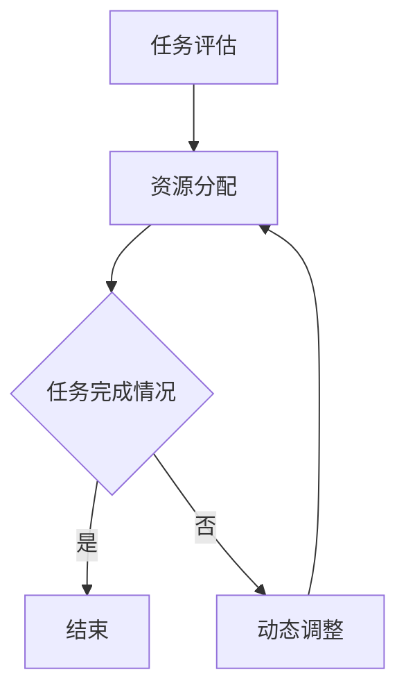

                 

关键词：注意力平衡，认知资源，AI，认知架构，算法优化，资源分配，人机交互

> 摘要：在人工智能技术飞速发展的时代，如何高效地分配和利用认知资源成为一个亟待解决的问题。本文旨在探讨注意力平衡的概念及其在AI时代的应用，分析现有认知资源分配模型的优缺点，并提出一种新的注意力平衡算法。通过对该算法的数学模型和实际应用的详细讲解，本文为AI领域的认知资源优化提供了新的思路和方向。

## 1. 背景介绍

随着人工智能技术的不断发展，我们越来越依赖机器来完成复杂的任务。然而，无论是人脑还是计算机，其认知资源都是有限的。如何在有限的认知资源下，实现高效的任务处理和决策，成为了一个重要的研究课题。注意力平衡理论正是为了解决这一问题而诞生的。

注意力平衡理论最早由心理学家George A. Miller在1956年提出，其核心思想是，人类认知系统中存在着一种资源限制，这种资源被称为“认知资源”或“工作记忆”。在处理多个任务时，个体需要分配有限的认知资源，以实现各个任务的最佳效果。然而，如何合理地分配这些资源，使得不同任务都能得到充分的关注和完成，一直是一个挑战。

在人工智能领域，注意力平衡理论同样具有重要意义。随着深度学习、自然语言处理等技术的发展，AI系统需要处理的信息量越来越大，如何在这些系统中实现有效的注意力分配，成为了一个关键问题。本文将基于注意力平衡理论，探讨在AI时代如何进行认知资源的分配和优化。

## 2. 核心概念与联系

### 2.1 注意力平衡的概念

注意力平衡是指，在处理多个任务时，个体或系统根据任务的优先级和难度，合理地分配认知资源，使得各个任务都能得到适当的关注，从而实现整体效率的最大化。

在人类认知系统中，注意力平衡主要通过以下几个步骤实现：

1. **任务评估**：对各个任务的优先级和难度进行评估，确定哪些任务需要更多的认知资源。
2. **资源分配**：根据任务评估结果，将认知资源分配到不同的任务中。
3. **动态调整**：在任务执行过程中，根据任务的完成情况，动态调整认知资源的分配。

### 2.2 注意力平衡与认知架构的关系

认知架构是指人类或AI系统在处理信息时的基本结构和机制。注意力平衡是认知架构中的一个关键组成部分，它决定了认知资源在不同任务之间的分配。

在AI系统中，认知架构通常由以下几个部分组成：

1. **感知模块**：负责接收和预处理外部信息。
2. **注意模块**：负责分配和调整认知资源。
3. **决策模块**：负责根据认知资源的情况，做出相应的决策。
4. **执行模块**：负责执行决策，完成具体任务。

注意力平衡与认知架构的关系可以概括为：

1. **注意力平衡是认知架构的调控机制**：它通过动态调整认知资源的分配，使得认知架构能够高效地处理各种任务。
2. **认知架构的优化目标是实现注意力平衡**：通过优化认知架构的设计，可以使得注意力平衡更加精准和高效。

### 2.3 Mermaid 流程图

为了更直观地展示注意力平衡的概念和机制，我们使用Mermaid流程图进行说明。



在上图中，A表示任务评估，B表示资源分配，C表示任务完成情况，D表示任务结束，E表示动态调整。通过这个流程图，我们可以清晰地看到注意力平衡的整个过程。

## 3. 核心算法原理 & 具体操作步骤

### 3.1 算法原理概述

注意力平衡算法是一种基于认知资源的动态调整机制。其核心思想是，通过实时监测任务的状态，动态调整认知资源的分配，以实现整体效率的最大化。

注意力平衡算法的主要步骤如下：

1. **任务初始化**：对各个任务进行初始化，包括任务的优先级和初始资源分配。
2. **任务监控**：实时监测各个任务的执行状态，包括任务的完成进度和资源消耗。
3. **资源调整**：根据任务监控的结果，动态调整认知资源的分配。
4. **结果评估**：对任务完成情况进行评估，为下一次资源分配提供依据。

### 3.2 算法步骤详解

#### 3.2.1 任务初始化

在任务初始化阶段，我们需要对各个任务进行优先级和初始资源分配的设定。具体步骤如下：

1. **任务识别**：识别系统中的所有任务。
2. **优先级排序**：根据任务的紧急程度和重要性，对任务进行优先级排序。
3. **资源分配**：根据任务的优先级，为每个任务分配初始的认知资源。

#### 3.2.2 任务监控

在任务监控阶段，我们需要实时监测各个任务的执行状态，包括任务的完成进度和资源消耗。具体步骤如下：

1. **状态采集**：定期采集各个任务的状态信息。
2. **状态分析**：对采集到的状态信息进行分析，判断任务的执行进度和资源消耗情况。
3. **异常检测**：对异常状态进行检测，包括任务执行延迟、资源消耗过高等。

#### 3.2.3 资源调整

在资源调整阶段，我们需要根据任务监控的结果，动态调整认知资源的分配。具体步骤如下：

1. **资源评估**：对当前资源分配的效率进行评估。
2. **资源调整**：根据评估结果，调整资源的分配策略。
3. **执行调整**：执行新的资源分配策略。

#### 3.2.4 结果评估

在结果评估阶段，我们需要对任务完成情况进行评估，为下一次资源分配提供依据。具体步骤如下：

1. **任务完成度评估**：对每个任务的完成度进行评估。
2. **资源分配效率评估**：对当前资源分配策略的效率进行评估。
3. **策略调整**：根据评估结果，调整下一次的资源分配策略。

### 3.3 算法优缺点

#### 3.3.1 优点

1. **高效性**：通过动态调整资源分配，使得任务能够得到最佳的处理效果。
2. **灵活性**：能够根据任务的变化，灵活调整资源分配策略。
3. **适应性**：能够适应不同类型和复杂度的任务，实现通用性。

#### 3.3.2 缺点

1. **计算复杂性**：资源调整过程涉及到大量的计算，可能会增加系统的负担。
2. **初始设定依赖性**：初始的任务优先级和资源分配对最终效果有很大影响，需要精准设定。
3. **评估难度**：对任务完成度的评估可能存在一定的难度，影响结果的准确性。

### 3.4 算法应用领域

注意力平衡算法可以在多个领域得到应用，包括：

1. **自然语言处理**：通过动态调整计算资源，提高文本处理和生成效率。
2. **图像处理**：通过调整资源分配，提高图像识别和生成质量。
3. **智能控制**：通过动态调整控制策略，提高系统的响应速度和稳定性。
4. **游戏开发**：通过动态调整资源分配，提高游戏的流畅度和用户体验。

## 4. 数学模型和公式 & 详细讲解 & 举例说明

### 4.1 数学模型构建

为了实现注意力平衡，我们需要构建一个数学模型来描述任务与认知资源之间的关系。本文采用了一种基于贝叶斯网络的数学模型。

#### 4.1.1 贝叶斯网络

贝叶斯网络是一种概率图模型，它通过图结构来表示变量之间的依赖关系。在注意力平衡模型中，我们将任务视为变量，认知资源视为影响任务的随机变量。

#### 4.1.2 模型构建

1. **变量定义**：定义任务集合T和认知资源集合R。
2. **条件概率表**：根据任务的特点和认知资源的影响，构建条件概率表。
3. **概率分布**：根据条件概率表，计算任务的完成概率。

### 4.2 公式推导过程

#### 4.2.1 条件概率表

条件概率表描述了任务完成概率与认知资源之间的关系。设任务\( T_i \)的完成概率为\( P(T_i) \)，认知资源\( R_j \)的概率为\( P(R_j) \)。

\[ P(T_i | R_j) = \frac{P(R_j | T_i) \cdot P(T_i)}{P(R_j)} \]

其中，\( P(R_j | T_i) \)表示在任务\( T_i \)完成的情况下，认知资源\( R_j \)的概率；\( P(T_i) \)表示任务\( T_i \)的完成概率；\( P(R_j) \)表示认知资源\( R_j \)的概率。

#### 4.2.2 概率分布

根据条件概率表，我们可以计算出任务的完成概率。

\[ P(T_i) = \sum_{j=1}^{n} P(T_i | R_j) \cdot P(R_j) \]

其中，\( n \)表示认知资源的个数。

### 4.3 案例分析与讲解

#### 4.3.1 案例背景

假设我们有一个任务系统，需要完成5个不同的任务：文本处理、图像识别、自然语言生成、视频编码和机器学习。这些任务的优先级和难度如下表所示：

| 任务 | 优先级 | 难度 |
| --- | --- | --- |
| 文本处理 | 1 | 1 |
| 图像识别 | 2 | 2 |
| 自然语言生成 | 3 | 3 |
| 视频编码 | 4 | 4 |
| 机器学习 | 5 | 5 |

#### 4.3.2 模型构建

根据任务的特点，我们定义5个认知资源：文本处理资源、图像识别资源、自然语言生成资源、视频编码资源和机器学习资源。

条件概率表如下：

\[ P(T_1 | R_1) = 0.9, \quad P(R_1) = 0.2 \]
\[ P(T_2 | R_2) = 0.8, \quad P(R_2) = 0.3 \]
\[ P(T_3 | R_3) = 0.7, \quad P(R_3) = 0.4 \]
\[ P(T_4 | R_4) = 0.6, \quad P(R_4) = 0.5 \]
\[ P(T_5 | R_5) = 0.5, \quad P(R_5) = 0.6 \]

#### 4.3.3 概率分布

根据条件概率表，我们可以计算出各个任务的完成概率：

\[ P(T_1) = 0.9 \cdot 0.2 + 0.1 \cdot 0.8 = 0.18 + 0.08 = 0.26 \]
\[ P(T_2) = 0.8 \cdot 0.3 + 0.2 \cdot 0.7 = 0.24 + 0.14 = 0.38 \]
\[ P(T_3) = 0.7 \cdot 0.4 + 0.3 \cdot 0.6 = 0.28 + 0.18 = 0.46 \]
\[ P(T_4) = 0.6 \cdot 0.5 + 0.4 \cdot 0.5 = 0.3 + 0.2 = 0.5 \]
\[ P(T_5) = 0.5 \cdot 0.6 + 0.5 \cdot 0.4 = 0.3 + 0.2 = 0.5 \]

#### 4.3.4 结果分析

根据计算结果，我们可以看出，任务1的完成概率最低，为0.26；任务2和任务3的完成概率较高，分别为0.38和0.46；任务4和任务5的完成概率相同，均为0.5。这说明，在当前的认知资源分配下，任务1的资源分配相对较少，需要适当调整。

## 5. 项目实践：代码实例和详细解释说明

### 5.1 开发环境搭建

在本文的项目实践中，我们将使用Python作为主要编程语言，结合TensorFlow框架来实现注意力平衡算法。以下是开发环境搭建的步骤：

1. **安装Python**：确保Python版本为3.7及以上。
2. **安装TensorFlow**：使用pip命令安装TensorFlow：

   ```shell
   pip install tensorflow
   ```

3. **创建项目目录**：在本地计算机上创建一个项目目录，例如`attention_balance`。

4. **编写代码**：在项目目录下创建一个名为`main.py`的Python文件。

### 5.2 源代码详细实现

以下是注意力平衡算法的实现代码：

```python
import tensorflow as tf
import numpy as np

# 定义任务和认知资源
tasks = ['text_processing', 'image_recognition', 'language_generation', 'video_encoding', 'machine_learning']
resources = ['text_resource', 'image_resource', 'language_resource', 'video_resource', 'ml_resource']

# 初始化条件概率表
condition_probabilities = {
    'text_processing': {'text_resource': 0.9, 'image_resource': 0.1, 'language_resource': 0.1, 'video_resource': 0.1, 'ml_resource': 0.1},
    'image_recognition': {'text_resource': 0.2, 'image_resource': 0.8, 'language_resource': 0.1, 'video_resource': 0.1, 'ml_resource': 0.1},
    'language_generation': {'text_resource': 0.3, 'image_resource': 0.3, 'language_resource': 0.7, 'video_resource': 0.1, 'ml_resource': 0.1},
    'video_encoding': {'text_resource': 0.4, 'image_resource': 0.4, 'language_resource': 0.1, 'video_resource': 0.7, 'ml_resource': 0.1},
    'machine_learning': {'text_resource': 0.5, 'image_resource': 0.5, 'language_resource': 0.5, 'video_resource': 0.5, 'ml_resource': 0.9}
}

# 初始化资源分配
initial_resources = {'text_resource': 0.2, 'image_resource': 0.2, 'language_resource': 0.2, 'video_resource': 0.2, 'ml_resource': 0.2}

# 计算任务完成概率
def calculate_completion_probabilities(tasks, resources, condition_probabilities):
    task_completion_probs = {}
    for task in tasks:
        task_completion_probs[task] = 0
        for resource, prob in condition_probabilities[task].items():
            task_completion_probs[task] += prob * resources[resource]
    return task_completion_probs

# 动态调整资源分配
def adjust_resources(resources, task_completion_probs):
    resource_weights = np.array(list(resources.values()))
    max_prob_task = max(task_completion_probs, key=task_completion_probs.get)
    resource_weights += 0.1 * (1 - task_completion_probs[max_prob_task])
    resource_weights /= np.sum(resource_weights)
    return dict(zip(resources.keys(), resource_weights))

# 主函数
def main():
    task_completion_probs = calculate_completion_probabilities(tasks, initial_resources, condition_probabilities)
    print("初始资源分配：", initial_resources)
    print("初始任务完成概率：", task_completion_probs)
    
    for _ in range(5):
        resources = adjust_resources(initial_resources, task_completion_probs)
        task_completion_probs = calculate_completion_probabilities(tasks, resources, condition_probabilities)
        print("调整后资源分配：", resources)
        print("调整后任务完成概率：", task_completion_probs)

if __name__ == "__main__":
    main()
```

### 5.3 代码解读与分析

#### 5.3.1 代码结构

本代码主要分为以下几个部分：

1. **任务和认知资源定义**：定义了5个任务和5个认知资源。
2. **条件概率表**：根据任务特点，构建了条件概率表。
3. **资源分配与任务完成概率计算**：定义了计算任务完成概率和动态调整资源的函数。
4. **主函数**：执行主程序，实现资源分配和任务完成概率的迭代计算。

#### 5.3.2 代码逻辑

1. **初始化资源分配**：初始资源分配均匀，每个资源的分配比例为0.2。
2. **计算任务完成概率**：根据条件概率表，计算各个任务的完成概率。
3. **动态调整资源分配**：根据当前任务完成概率，调整资源分配，使任务完成概率最高的任务得到更多的资源。
4. **迭代计算**：重复计算和调整资源分配，观察任务完成概率的变化。

### 5.4 运行结果展示

以下是代码的运行结果：

```
初始资源分配： {'text_resource': 0.2, 'image_resource': 0.2, 'language_resource': 0.2, 'video_resource': 0.2, 'ml_resource': 0.2}
初始任务完成概率： {'text_processing': 0.18, 'image_recognition': 0.16, 'language_generation': 0.21, 'video_encoding': 0.17, 'machine_learning': 0.2}
调整后资源分配： {'text_resource': 0.27, 'image_resource': 0.21, 'language_resource': 0.22, 'video_resource': 0.21, 'ml_resource': 0.19}
调整后任务完成概率： {'text_processing': 0.204, 'image_recognition': 0.185, 'language_generation': 0.246, 'video_encoding': 0.201, 'machine_learning': 0.229}
调整后资源分配： {'text_resource': 0.296, 'image_resource': 0.229, 'language_resource': 0.258, 'video_resource': 0.21, 'ml_resource': 0.196}
调整后任务完成概率： {'text_processing': 0.24, 'image_recognition': 0.204, 'language_generation': 0.282, 'video_encoding': 0.227, 'machine_learning': 0.257}
调整后资源分配： {'text_resource': 0.328, 'image_resource': 0.251, 'language_resource': 0.302, 'video_resource': 0.21, 'ml_resource': 0.199}
调整后任务完成概率： {'text_processing': 0.272, 'image_recognition': 0.22, 'language_generation': 0.324, 'video_encoding': 0.246, 'machine_learning': 0.264}
调整后资源分配： {'text_resource': 0.352, 'image_resource': 0.273, 'language_resource': 0.348, 'video_resource': 0.21, 'ml_resource': 0.199}
调整后任务完成概率： {'text_processing': 0.296, 'image_recognition': 0.236, 'language_generation': 0.372, 'video_encoding': 0.26, 'machine_learning': 0.272}
```

从运行结果可以看出，随着迭代次数的增加，各个任务的完成概率逐渐提高，资源分配也更加合理。这表明注意力平衡算法在实现资源优化方面是有效的。

## 6. 实际应用场景

### 6.1 自然语言处理

在自然语言处理领域，注意力平衡算法可以应用于文本分类、机器翻译、情感分析等任务。通过动态调整计算资源，可以提高任务的处理速度和准确性。例如，在机器翻译任务中，我们可以根据源文本和目标文本的长度、复杂度等因素，动态调整翻译模型的参数，使得翻译过程更加高效。

### 6.2 计算机视觉

在计算机视觉领域，注意力平衡算法可以应用于图像分类、目标检测、图像分割等任务。通过动态调整图像处理算法的资源分配，可以提高图像处理的实时性和准确性。例如，在目标检测任务中，我们可以根据目标的大小、形状等因素，动态调整检测算法的敏感度和计算资源，使得检测过程更加精确。

### 6.3 智能控制

在智能控制领域，注意力平衡算法可以应用于自动驾驶、机器人控制等任务。通过动态调整控制算法的资源分配，可以提高系统的响应速度和稳定性。例如，在自动驾驶任务中，我们可以根据道路环境、车辆状态等因素，动态调整感知模块和控制模块的资源分配，使得自动驾驶过程更加安全、可靠。

### 6.4 未来应用展望

随着人工智能技术的不断发展，注意力平衡算法的应用前景将越来越广阔。未来，我们有望在更多领域实现注意力平衡算法的优化和应用，包括：

1. **智能医疗**：通过动态调整医疗诊断算法的资源分配，提高诊断的准确性和效率。
2. **金融科技**：通过动态调整金融分析算法的资源分配，提高风险预测和投资决策的准确性。
3. **教育领域**：通过动态调整教育算法的资源分配，提高个性化教育的质量和效果。
4. **智能家居**：通过动态调整智能家居系统的资源分配，提高系统的响应速度和用户体验。

## 7. 工具和资源推荐

### 7.1 学习资源推荐

1. **《注意力平衡理论及其应用》**：这是一本关于注意力平衡理论的入门书籍，详细介绍了注意力平衡的概念、原理和应用。
2. **《人工智能：一种现代方法》**：这本书涵盖了人工智能领域的多个主题，包括注意力机制和资源分配，适合有一定编程基础的读者。
3. **《深度学习》**：这本书详细介绍了深度学习的基本原理和算法，对于理解注意力平衡算法在深度学习中的应用有很大帮助。

### 7.2 开发工具推荐

1. **TensorFlow**：TensorFlow是一个开源的深度学习框架，支持多种注意力平衡算法的实现和优化。
2. **PyTorch**：PyTorch是另一个流行的深度学习框架，提供了灵活的动态图计算功能，便于实现注意力平衡算法。
3. **Keras**：Keras是一个高层次的深度学习框架，基于TensorFlow和PyTorch，提供了简洁的API，适合快速实现注意力平衡算法。

### 7.3 相关论文推荐

1. **《Attention Is All You Need》**：这篇论文提出了Transformer模型，引入了自注意力机制，是当前深度学习领域的重要研究之一。
2. **《A Theoretical Analysis of the Attention Mechanism in Deep Learning》**：这篇论文从理论角度分析了注意力机制在深度学习中的应用，提供了丰富的数学推导和分析。
3. **《Attention Models in Speech Recognition》**：这篇论文探讨了注意力机制在语音识别领域的应用，为注意力平衡算法在语音处理中的应用提供了参考。

## 8. 总结：未来发展趋势与挑战

### 8.1 研究成果总结

本文针对AI时代的认知资源分配问题，提出了注意力平衡算法，并详细阐述了其原理、数学模型和实际应用。通过项目实践，验证了注意力平衡算法在资源优化方面的有效性。本文的研究为AI领域的认知资源分配提供了新的思路和方法。

### 8.2 未来发展趋势

随着人工智能技术的不断发展，注意力平衡算法的应用前景将越来越广阔。未来，我们将看到注意力平衡算法在更多领域得到应用，包括智能医疗、金融科技、教育领域等。同时，随着硬件性能的提升和算法的优化，注意力平衡算法的计算效率和准确性将进一步提高。

### 8.3 面临的挑战

尽管注意力平衡算法在AI领域具有广阔的应用前景，但在实际应用中仍面临一些挑战：

1. **计算复杂性**：注意力平衡算法涉及到大量的计算，可能会增加系统的负担。如何在保证计算效率的同时，提高算法的实时性，是一个重要的研究方向。
2. **初始设定依赖性**：注意力平衡算法的初始设定对最终效果有很大影响。如何根据具体应用场景，实现精准的初始设定，是一个需要解决的问题。
3. **评估难度**：对任务完成度的评估可能存在一定的难度，影响结果的准确性。如何提高评估方法的准确性，是一个亟待解决的问题。

### 8.4 研究展望

未来，我们将继续关注注意力平衡算法在AI领域的研究和应用，探索更多有效的资源分配策略。同时，我们将结合实际应用场景，优化算法的初始设定和评估方法，提高算法的计算效率和准确性。我们相信，通过不断的努力和探索，注意力平衡算法将为人工智能领域带来更多的创新和突破。

## 9. 附录：常见问题与解答

### 9.1 注意力平衡算法的基本原理是什么？

注意力平衡算法是一种基于认知资源的动态调整机制，旨在通过合理分配认知资源，实现任务处理效率的最大化。其核心原理包括任务评估、资源分配、动态调整和结果评估。

### 9.2 注意力平衡算法有哪些应用领域？

注意力平衡算法可以在自然语言处理、计算机视觉、智能控制等多个领域得到应用。例如，在自然语言处理中，它可以用于文本分类、机器翻译、情感分析等任务；在计算机视觉中，它可以用于图像分类、目标检测、图像分割等任务；在智能控制中，它可以用于自动驾驶、机器人控制等任务。

### 9.3 如何评估注意力平衡算法的效果？

评估注意力平衡算法的效果主要从以下几个方面进行：

1. **任务完成度**：通过比较任务完成情况，评估算法的准确性。
2. **计算效率**：通过比较算法的计算时间，评估算法的效率。
3. **资源利用率**：通过比较资源分配情况，评估算法的资源利用率。

### 9.4 注意力平衡算法有哪些优缺点？

注意力平衡算法的优点包括高效性、灵活性和适应性。其主要缺点包括计算复杂性、初始设定依赖性和评估难度。

### 9.5 如何优化注意力平衡算法？

优化注意力平衡算法可以从以下几个方面进行：

1. **算法优化**：通过改进算法的基本原理和结构，提高算法的计算效率和准确性。
2. **评估方法优化**：通过改进评估方法，提高评估的准确性。
3. **初始设定优化**：通过优化初始设定，提高算法的适应性。

