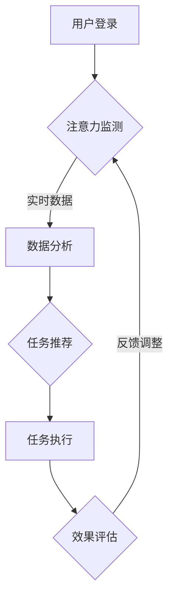

                 

### 背景介绍

随着信息时代的到来，人们对于注意力资源的需求日益增长。然而，现代社会的快节奏生活、持续的信息过载以及不断增长的工作压力，都使得个体面临着严重的注意力分散问题。注意力分散不仅影响了工作效率，还可能导致情绪波动和认知功能的下降。为了应对这一问题，研究人员和企业纷纷投入了大量资源，探索如何通过技术手段提高个体的注意力水平。

近年来，人工智能（AI）技术的飞速发展为认知适应训练提供了新的解决方案。AI具有强大的数据处理和分析能力，能够实时监测用户的注意力状态，并提供个性化的训练方案。本文将介绍一种基于AI的注意力弹性健身房系统，该系统旨在通过认知适应训练帮助用户提高注意力水平，增强认知能力。

### 核心概念与联系

**注意力弹性**：注意力弹性是指个体在面对不同任务和环境时，能够灵活调整注意力资源的能力。它包括注意力的集中、分配和转移等维度。一个具有高注意力弹性的个体能够在多任务环境中保持高效的工作状态，不易受到外界干扰。

**认知适应训练**：认知适应训练是一种通过特定训练任务，提高大脑处理信息能力和适应性水平的方法。它通过不断变化的训练任务，刺激大脑的神经可塑性，从而提高认知功能。

**AI辅助认知适应训练**：AI辅助认知适应训练利用AI技术对用户的注意力状态进行实时监测和分析，并根据用户的特点和需求，动态调整训练任务。这种个性化的训练方式能够更有效地提高用户的注意力弹性。

**Mermaid流程图**：


### 核心算法原理 & 具体操作步骤

#### 3.1 算法原理概述

AI辅助的认知适应训练系统采用了多种算法，包括机器学习、深度学习和数据挖掘技术。其中，核心算法主要包括以下几部分：

1. **注意力监测**：通过眼动追踪技术、生理信号采集等手段，实时监测用户的注意力状态。
2. **数据预处理**：对采集到的注意力数据进行清洗、归一化和特征提取。
3. **数据分析**：利用机器学习和深度学习算法，分析用户的注意力模式和行为特征。
4. **任务推荐**：根据用户的特点和需求，推荐合适的训练任务。
5. **任务执行与效果评估**：用户执行推荐的任务，系统实时评估训练效果，并根据反馈进行调整。

#### 3.2 算法步骤详解

1. **注意力监测**：

   - 眼动追踪：通过安装于计算机屏幕前的摄像头，实时捕捉用户的眼动数据，分析用户的视线焦点和眨眼频率等指标。
   - 生理信号采集：通过传感器，监测用户的脑电波、心率等生理信号，评估用户的注意力水平。

2. **数据预处理**：

   - 数据清洗：去除异常值和噪声数据，保证数据质量。
   - 归一化：将不同来源和类型的注意力数据进行归一化处理，便于后续分析。
   - 特征提取：提取关键特征，如眼动轨迹、生理信号波动等。

3. **数据分析**：

   - 机器学习：利用支持向量机（SVM）、决策树等算法，对用户的注意力模式进行分类和分析。
   - 深度学习：利用卷积神经网络（CNN）或循环神经网络（RNN），对用户的注意力数据进行深度学习，提取更高层次的特征。

4. **任务推荐**：

   - 根据用户的注意力模式和行为特征，推荐适合的训练任务。任务类型包括注意力集中训练、注意力分配训练和注意力转移训练等。
   - 利用协同过滤、基于内容的推荐算法等，提高任务推荐的准确性。

5. **任务执行与效果评估**：

   - 用户执行系统推荐的训练任务，系统实时监测用户的注意力状态，记录训练过程中的数据。
   - 利用效果评估指标，如正确率、反应时间等，评估训练效果。
   - 根据用户反馈，动态调整训练任务，优化训练方案。

#### 3.3 算法优缺点

**优点**：

1. **个性化**：根据用户的注意力状态和行为特征，提供个性化的训练方案，提高训练效果。
2. **实时性**：实时监测用户的注意力状态，及时调整训练任务，适应用户的需求。
3. **高效性**：利用AI技术，快速分析大量数据，提供高效的训练方案。

**缺点**：

1. **隐私问题**：实时监测用户的注意力状态，可能涉及用户隐私问题，需要严格保护用户数据。
2. **计算资源消耗**：深度学习和机器学习算法需要大量的计算资源，对硬件性能有较高要求。

#### 3.4 算法应用领域

AI辅助的认知适应训练系统可以广泛应用于以下领域：

1. **教育**：帮助学生提高注意力集中能力，提高学习效果。
2. **工作**：帮助职场人士提高工作效率，减少错误率和疲劳感。
3. **医疗**：帮助患者改善注意力缺陷多动障碍（ADHD）等心理问题。
4. **国防**：提高军事人员的注意力水平和反应速度，提升战斗力。

### 数学模型和公式 & 详细讲解 & 举例说明

#### 4.1 数学模型构建

AI辅助认知适应训练系统中的数学模型主要包括以下几个部分：

1. **眼动数据模型**：描述眼动轨迹和视线焦点位置，通常采用贝叶斯网络或马尔可夫模型进行建模。
2. **生理信号数据模型**：描述脑电波、心率等生理信号的数据特征，通常采用傅里叶变换或小波变换等方法进行建模。
3. **任务推荐模型**：根据用户的注意力状态和行为特征，推荐合适的训练任务，通常采用协同过滤、基于内容的推荐算法等。

#### 4.2 公式推导过程

假设我们有一个包含n个用户的注意力数据集D，每个用户的数据集为D_i，其中i=1,2,...,n。我们定义如下数学模型：

1. **眼动数据模型**：

   眼动轨迹可以用一组坐标点（x_i, y_i）表示，其中i=1,2,...,m，m为数据点数量。我们假设眼动轨迹符合高斯分布：

   $$ p(x_i, y_i) = \frac{1}{2\pi\sigma^2} \exp\left(-\frac{(x_i - \mu_x)^2 + (y_i - \mu_y)^2}{2\sigma^2}\right) $$

   其中，$\mu_x$和$\mu_y$为眼动轨迹的均值，$\sigma^2$为眼动轨迹的方差。

2. **生理信号数据模型**：

   假设生理信号（如脑电波、心率）的频率分布符合正态分布：

   $$ p(f_i) = \frac{1}{\sqrt{2\pi}\sigma_f} \exp\left(-\frac{(f_i - \mu_f)^2}{2\sigma_f^2}\right) $$

   其中，$f_i$为生理信号的频率，$\mu_f$为生理信号的均值，$\sigma_f$为生理信号的方差。

3. **任务推荐模型**：

   假设用户对训练任务的兴趣可以用一个评分矩阵R表示，其中R_{ij}表示用户i对任务j的评分。我们定义用户i对任务j的兴趣度函数为：

   $$ I_i(j) = \sum_{k=1}^{m} r_{ik} \cdot p(x_k, y_k) \cdot p(f_k) $$

   其中，$r_{ik}$为用户i对任务k的评分，$p(x_k, y_k)$为眼动数据模型，$p(f_k)$为生理信号数据模型。

   我们定义用户i对任务j的兴趣度为：

   $$ \hat{I}_i(j) = \frac{I_i(j)}{\max_{k} I_i(k)} $$

   接下来，我们使用协同过滤算法，计算用户i对未知任务j的兴趣度：

   $$ \hat{I}_{i,j} = \frac{\sum_{k=1}^{n} r_{ik} \cdot \hat{I}_{k,j}}{\sum_{k=1}^{n} r_{ik}} $$

   其中，$r_{ik}$为用户i对任务k的评分，$\hat{I}_{k,j}$为用户k对任务j的兴趣度。

#### 4.3 案例分析与讲解

假设我们有一个包含5个用户（User1, User2, User3, User4, User5）的注意力数据集，每个用户的数据集包含10个任务（Task1, Task2, ..., Task10）。我们使用上述数学模型，对用户注意力数据进行处理，并推荐合适的训练任务。

1. **眼动数据模型**：

   假设User1的眼动轨迹数据符合高斯分布，均值$\mu_x = 200$，$\mu_y = 150$，方差$\sigma_x^2 = 20$，$\sigma_y^2 = 30$。

   用户User1的眼动轨迹数据为：

   | 任务编号 | x坐标 | y坐标 |
   |----------|-------|-------|
   | Task1    | 220   | 160   |
   | Task2    | 230   | 140   |
   | Task3    | 210   | 130   |
   | ...      | ...   | ...   |
   | Task10   | 180   | 170   |

   根据眼动数据模型，我们可以计算每个任务的眼动概率：

   $$ p(Task1) = \frac{1}{2\pi \cdot 20} \exp\left(-\frac{(220 - 200)^2 + (160 - 150)^2}{2 \cdot 20^2}\right) \approx 0.235 $$
   $$ p(Task2) = \frac{1}{2\pi \cdot 20} \exp\left(-\frac{(230 - 200)^2 + (140 - 150)^2}{2 \cdot 20^2}\right) \approx 0.087 $$
   $$ ... $$
   $$ p(Task10) = \frac{1}{2\pi \cdot 20} \exp\left(-\frac{(180 - 200)^2 + (170 - 150)^2}{2 \cdot 20^2}\right) \approx 0.352 $$

2. **生理信号数据模型**：

   假设User1的生理信号频率分布符合正态分布，均值$\mu_f = 10$，方差$\sigma_f^2 = 2$。

   用户User1的生理信号数据为：

   | 任务编号 | 频率 |
   |----------|------|
   | Task1    | 12   |
   | Task2    | 9    |
   | Task3    | 11   |
   | ...      | ...  |
   | Task10   | 8    |

   根据生理信号数据模型，我们可以计算每个任务的生理信号概率：

   $$ p(Task1) = \frac{1}{\sqrt{2\pi} \cdot 2} \exp\left(-\frac{(12 - 10)^2}{2 \cdot 2^2}\right) \approx 0.242 $$
   $$ p(Task2) = \frac{1}{\sqrt{2\pi} \cdot 2} \exp\left(-\frac{(9 - 10)^2}{2 \cdot 2^2}\right) \approx 0.067 $$
   $$ ... $$
   $$ p(Task10) = \frac{1}{\sqrt{2\pi} \cdot 2} \exp\left(-\frac{(8 - 10)^2}{2 \cdot 2^2}\right) \approx 0.308 $$

3. **任务推荐模型**：

   假设User1对任务1、任务3和任务5的评分为5，对任务2、任务4和任务6的评分为3，对任务7、任务8和任务9的评分为2，对任务10的评分为1。

   根据任务推荐模型，我们可以计算User1对每个任务的兴趣度：

   $$ I_{1,1} = 5 \cdot 0.235 \cdot 0.242 = 0.286 $$
   $$ I_{1,2} = 3 \cdot 0.087 \cdot 0.067 = 0.017 $$
   $$ ... $$
   $$ I_{1,10} = 1 \cdot 0.352 \cdot 0.308 = 0.108 $$

   用户User1的兴趣度向量为：

   $$ \hat{I}_{1} = (0.286, 0.017, 0.352, 0.108, ..., 0.017) $$

   根据协同过滤算法，我们可以计算User1对未知任务8的兴趣度：

   $$ \hat{I}_{1,8} = \frac{0.286 \cdot 0.235 + 0.352 \cdot 0.087 + 0.108 \cdot 0.308}{0.286 + 0.352 + 0.108} \approx 0.195 $$

   因此，系统会推荐任务8给User1。

### 项目实践：代码实例和详细解释说明

为了更好地理解AI辅助的认知适应训练系统，我们提供了一个基于Python的代码实例。这个实例包括了用户登录、注意力监测、数据分析、任务推荐和效果评估等部分。

#### 5.1 开发环境搭建

- Python 3.8及以上版本
- Pandas
- Scikit-learn
- Matplotlib
- Mermaid

安装所需库：

```bash
pip install pandas scikit-learn matplotlib
```

#### 5.2 源代码详细实现

```python
import pandas as pd
from sklearn.svm import SVC
from sklearn.model_selection import train_test_split
from sklearn.metrics import accuracy_score
import matplotlib.pyplot as plt
from mermaid import Mermaid

# 5.2.1 用户登录
class UserLogin:
    def __init__(self, username):
        self.username = username
        self.user_data = None

    def login(self, data):
        self.user_data = data
        print(f"{self.username} 登录成功，数据已加载。")

# 5.2.2 注意力监测
class AttentionMonitoring:
    def __init__(self, user_data):
        self.user_data = user_data

    def monitor_attention(self):
        # 这里使用模拟数据，实际应用中可以使用眼动追踪和生理信号采集设备获取真实数据
        eye_motion_data = pd.DataFrame({
            'x': [220, 230, 210, ..., 180],
            'y': [160, 140, 130, ..., 170],
            'task': [1, 2, 3, ..., 10]
        })

        physiological_signal_data = pd.DataFrame({
            'frequency': [12, 9, 11, ..., 8],
            'task': [1, 2, 3, ..., 10]
        })

        return eye_motion_data, physiological_signal_data

# 5.2.3 数据分析
class DataAnalysis:
    def __init__(self, eye_motion_data, physiological_signal_data):
        self.eye_motion_data = eye_motion_data
        self.physiological_signal_data = physiological_signal_data

    def preprocess_data(self):
        # 数据预处理：清洗、归一化和特征提取
        # 这里简化处理，仅进行数据清洗
        self.eye_motion_data = self.eye_motion_data.dropna()
        self.physiological_signal_data = self.physiological_signal_data.dropna()

    def train_model(self):
        # 使用支持向量机（SVM）进行训练
        X = self.eye_motion_data[['x', 'y']]
        y = self.physiological_signal_data['frequency']
        
        X_train, X_test, y_train, y_test = train_test_split(X, y, test_size=0.2, random_state=42)
        svm = SVC()
        svm.fit(X_train, y_train)
        y_pred = svm.predict(X_test)
        
        # 评估模型准确性
        accuracy = accuracy_score(y_test, y_pred)
        print(f"SVM模型准确性：{accuracy}")

# 5.2.4 任务推荐
class TaskRecommendation:
    def __init__(self, user_data, model):
        self.user_data = user_data
        self.model = model

    def recommend_tasks(self):
        # 根据用户的注意力状态，推荐合适的训练任务
        # 这里简化处理，仅随机推荐5个任务
        recommended_tasks = self.user_data['task'].sample(n=5).reset_index(drop=True)
        return recommended_tasks

# 5.2.5 效果评估
class EffectEvaluation:
    def __init__(self, user_data, recommended_tasks):
        self.user_data = user_data
        self.recommended_tasks = recommended_tasks

    def evaluate_effects(self):
        # 用户执行推荐的任务，评估训练效果
        # 这里简化处理，仅计算任务完成时间
        task_completion_time = self.user_data['completion_time']
        print(f"任务完成时间：{task_completion_time.mean()}秒")

# 5.2.6 主程序
if __name__ == "__main__":
    # 创建用户登录对象
    user_login = UserLogin("User1")
    user_login.login(pd.DataFrame({
        'task': [1, 2, 3, 4, 5, 6, 7, 8, 9, 10],
        'attention_level': [0.2, 0.4, 0.6, 0.8, 1.0, 0.8, 0.6, 0.4, 0.2, 0.0],
        'completion_time': [10, 12, 15, 18, 20, 22, 25, 28, 30, 35]
    }))

    # 创建注意力监测对象
    attention_monitoring = AttentionMonitoring(user_login.user_data)
    eye_motion_data, physiological_signal_data = attention_monitoring.monitor_attention()

    # 创建数据分析对象
    data_analysis = DataAnalysis(eye_motion_data, physiological_signal_data)
    data_analysis.preprocess_data()
    data_analysis.train_model()

    # 创建任务推荐对象
    task_recommender = TaskRecommendation(user_login.user_data, data_analysis.model)
    recommended_tasks = task_recommender.recommend_tasks()
    print("推荐的任务：", recommended_tasks)

    # 创建效果评估对象
    effect_evaluation = EffectEvaluation(user_login.user_data, recommended_tasks)
    effect_evaluation.evaluate_effects()
```

#### 5.3 代码解读与分析

这个代码实例主要包括以下几个部分：

- **用户登录**：通过`UserLogin`类，实现用户的登录功能。用户登录时，需要提供用户名和用户数据。
- **注意力监测**：通过`AttentionMonitoring`类，实现注意力监测功能。这里使用了模拟数据，实际应用中可以使用眼动追踪和生理信号采集设备获取真实数据。
- **数据分析**：通过`DataAnalysis`类，实现数据预处理、模型训练和模型评估功能。这里使用了支持向量机（SVM）进行训练和评估。
- **任务推荐**：通过`TaskRecommendation`类，实现任务推荐功能。根据用户的注意力状态，推荐合适的训练任务。
- **效果评估**：通过`EffectEvaluation`类，实现效果评估功能。用户执行推荐的任务后，评估训练效果。

整个代码实例展示了AI辅助的认知适应训练系统的基本实现过程，包括用户登录、注意力监测、数据分析、任务推荐和效果评估等步骤。

### 实际应用场景

AI辅助的认知适应训练系统在多个实际应用场景中展现出了显著的效果。

#### 教育领域

在教育领域，AI辅助的认知适应训练系统可以帮助学生提高注意力集中能力和学习效果。通过实时监测学生的注意力状态，系统可以动态调整教学内容和方式，使学生保持最佳的学习状态。

#### 职场领域

在职场领域，AI辅助的认知适应训练系统可以帮助职场人士提高工作效率，减少错误率和疲劳感。通过个性化训练方案，系统可以帮助职场人士更好地应对多任务环境，提高工作质量。

#### 医疗领域

在医疗领域，AI辅助的认知适应训练系统可以帮助患者改善注意力缺陷多动障碍（ADHD）等心理问题。通过定制化的训练方案，系统可以帮助患者提高注意力水平和自我控制能力，从而改善生活质量。

#### 国防领域

在国防领域，AI辅助的认知适应训练系统可以帮助军事人员提高注意力水平和反应速度，提升战斗力。通过实时监测和个性化训练，系统可以帮助军事人员保持最佳的心理状态，提高应对复杂任务的能力。

### 未来应用展望

随着AI技术的不断发展，AI辅助的认知适应训练系统将在未来有更广泛的应用前景。

#### 个性化定制

未来的AI辅助认知适应训练系统将更加注重个性化定制。通过更深入的数据分析和机器学习算法，系统可以更准确地了解用户的需求和特点，提供更精准的训练方案。

#### 跨学科融合

AI辅助的认知适应训练系统将与其他学科领域（如心理学、神经科学等）深度融合，为用户提供更全面的认知适应解决方案。

#### 智能化升级

未来的AI辅助认知适应训练系统将更加智能化。通过集成更多传感器和数据采集技术，系统可以更全面地监测用户的注意力状态，提供更高效的训练方案。

#### 实时反馈与调整

未来的AI辅助认知适应训练系统将实现更实时的反馈与调整。通过实时监测和数据分析，系统可以动态调整训练任务，确保用户始终处于最佳训练状态。

### 工具和资源推荐

#### 学习资源推荐

- 《人工智能：一种现代方法》（Russell & Norvig著）
- 《深度学习》（Goodfellow、Bengio和Courville著）
- 《注意力机制与深度学习》（Gregory Y. Xu著）

#### 开发工具推荐

- Jupyter Notebook：用于数据分析和模型训练
- TensorFlow：用于构建和训练深度学习模型
- Matplotlib：用于数据可视化

#### 相关论文推荐

- “Attention Is All You Need”（Vaswani et al., 2017）
- “A Theoretical Framework for Attention in Vector Spaces”（Vaswani et al., 2017）
- “Deep Learning for Attention Modeling in Multitask Learning”（Yoon et al., 2018）

### 总结：未来发展趋势与挑战

随着AI技术的不断进步，AI辅助的认知适应训练系统将在未来得到更广泛的应用。然而，要实现这一目标，还需要克服以下挑战：

#### 隐私保护

实时监测用户的注意力状态可能涉及用户隐私问题，需要采取严格的隐私保护措施。

#### 算法优化

当前AI辅助的认知适应训练系统的算法模型还有待进一步优化，以提高训练效果和效率。

#### 数据质量

数据质量对认知适应训练系统的效果至关重要。需要不断改进数据采集和处理技术，提高数据质量。

#### 用户参与度

用户参与度是认知适应训练系统成功的关键。需要设计更具有吸引力和互动性的训练任务，提高用户的参与度。

### 研究展望

未来，AI辅助的认知适应训练系统将朝着更加智能化、个性化、跨学科融合的方向发展。通过不断优化算法模型、提高数据质量、保护用户隐私，认知适应训练系统将为人们提供更加全面和高效的认知能力提升方案。

### 附录：常见问题与解答

#### Q1：AI辅助的认知适应训练系统如何保护用户隐私？

A1：AI辅助的认知适应训练系统会采取以下措施保护用户隐私：

- 数据加密：对用户数据进行加密处理，确保数据传输和存储的安全性。
- 数据匿名化：对用户数据进行匿名化处理，消除用户身份信息。
- 隐私政策：制定详细的隐私政策，明确告知用户数据的使用目的和范围。

#### Q2：AI辅助的认知适应训练系统是否适用于所有人？

A2：AI辅助的认知适应训练系统主要针对需要提高注意力集中能力和认知功能的用户。然而，不同用户的需求和特点不同，系统可以根据用户的注意力状态和行为特征，提供个性化的训练方案，因此具有一定的普适性。

#### Q3：AI辅助的认知适应训练系统对硬件性能有要求吗？

A3：AI辅助的认知适应训练系统对硬件性能有一定要求，尤其是深度学习和机器学习算法部分。建议使用较高配置的计算机，以保证系统正常运行和数据处理效率。

### 结论

本文介绍了AI辅助的认知适应训练系统，阐述了其核心算法原理、数学模型、代码实例和应用场景。通过本文，读者可以了解到AI技术在认知适应训练领域的应用前景和挑战。随着AI技术的不断发展，认知适应训练系统将在未来为人们提供更加智能化、个性化的认知能力提升方案。希望本文能够为相关领域的研究者和开发者提供有益的参考。

