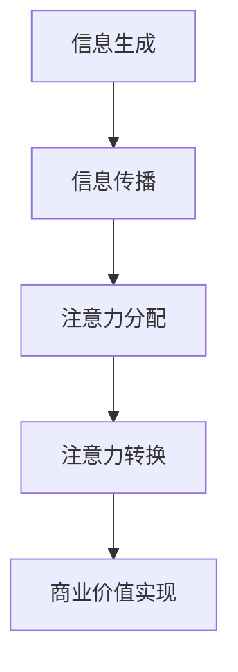

                 

关键词：元宇宙、信息战、注意力经济、人工智能、注意力算法、信息控制权

摘要：本文深入探讨了元宇宙时代信息主导权的争夺战，分析了注意力经济下的关键概念和机制，揭示了注意力算法在信息战中的应用原理和策略。通过详细阐述核心算法原理和具体操作步骤，结合数学模型和项目实践，我们揭示了信息主导权争夺的内在逻辑和未来发展。

## 1. 背景介绍

随着互联网和移动互联网的普及，信息已经成为现代社会的重要资源。然而，随着大数据、人工智能、区块链等技术的发展，信息的价值和影响力逐渐被放大。在这种背景下，注意力经济成为一个新兴的领域，其核心在于争夺用户的时间和注意力资源。

### 元宇宙与注意力经济

元宇宙（Metaverse）是指通过互联网连接的虚拟现实世界，它将现实世界和虚拟世界无缝融合。在这个虚拟空间中，人们可以创建虚拟角色，进行社交、娱乐、学习、工作等活动。元宇宙的发展为注意力经济提供了新的场景和机遇。

### 注意力经济的基本原理

注意力经济基于这样一个假设：在信息过载的时代，用户的注意力是一种稀缺资源。任何产品或服务要想获得成功，都必须争夺用户的注意力。注意力经济的关键在于如何吸引和保持用户的注意力，从而实现商业价值。

## 2. 核心概念与联系

在注意力经济中，有几个核心概念需要理解：

### 注意力算法

注意力算法是一种用于优化信息获取和处理的算法，其核心目的是提高信息处理效率和用户满意度。注意力算法通常包含注意力分配和注意力转换两个部分。

### 注意力分配

注意力分配是指根据用户的需求和偏好，对信息资源进行分配。注意力分配算法需要考虑用户的个性化需求、兴趣和上下文信息，从而实现信息资源的精准投放。

### 注意力转换

注意力转换是指将用户的注意力从一种形式转换为另一种形式。例如，将用户的阅读时间转换为广告收入，或者将用户的虚拟行为转换为虚拟货币。

### 注意力经济模型

注意力经济模型是一个用于描述注意力资源在经济活动中流动的模型。它包括信息生成、信息传播、注意力分配、注意力转换等环节。

下面是注意力经济模型的一个简化的 Mermaid 流程图：



## 3. 核心算法原理 & 具体操作步骤

### 3.1 算法原理概述

注意力算法的核心原理是通过学习用户的兴趣和行为模式，动态调整信息资源分配策略，从而提高用户满意度。具体来说，注意力算法通常包括以下几个步骤：

1. 数据采集：收集用户的浏览记录、搜索历史、社交行为等数据。
2. 特征提取：对采集到的数据进行预处理，提取用户兴趣和行为特征。
3. 模型训练：使用机器学习算法训练注意力模型，模型需要具备自适应调整能力。
4. 注意力分配：根据模型预测，动态调整信息资源分配策略。
5. 用户反馈：收集用户对信息资源分配的反馈，用于模型优化。

### 3.2 算法步骤详解

#### 步骤一：数据采集

数据采集是注意力算法的基础。通常使用以下方法进行数据采集：

- 用户行为数据：包括浏览记录、搜索历史、点击率等。
- 社交网络数据：包括点赞、评论、分享等。
- 位置数据：包括用户位置、移动轨迹等。

#### 步骤二：特征提取

特征提取是将原始数据转换为机器学习模型可处理的形式。常用的特征提取方法包括：

- 文本特征：使用词频、词向量、主题模型等方法提取。
- 画像特征：使用用户画像、兴趣标签等方法提取。
- 时间特征：使用时间序列分析、时序模型等方法提取。

#### 步骤三：模型训练

模型训练是注意力算法的核心。常用的模型包括：

- 基于规则的模型：如朴素贝叶斯、决策树等。
- 基于机器学习的模型：如深度学习、图模型等。
- 基于强化学习的模型：如Q-learning、DQN等。

#### 步骤四：注意力分配

注意力分配是根据模型预测，动态调整信息资源分配策略。常用的方法包括：

- 动态优先级队列：根据预测得分动态调整优先级。
- 动态调整资源分配：根据预测得分动态调整资源分配比例。

#### 步骤五：用户反馈

用户反馈是注意力算法优化的关键。通过收集用户对信息资源分配的反馈，可以优化模型预测和分配策略。常用的反馈方法包括：

- 用户评分：对信息资源进行评分，用于模型优化。
- 用户点击率：根据用户点击率调整信息资源分配。
- 用户行为分析：通过分析用户行为，优化信息资源分配。

### 3.3 算法优缺点

#### 优点

- 提高信息获取效率：通过动态调整信息资源分配策略，提高用户获取信息的效率。
- 提高用户满意度：根据用户兴趣和行为模式，提供个性化信息推荐，提高用户满意度。
- 优化商业价值：通过优化信息资源分配，实现商业价值的最大化。

#### 缺点

- 数据隐私问题：数据采集和处理过程中，可能涉及用户隐私问题。
- 模型解释性：深度学习等复杂模型的解释性较差，难以理解决策过程。

### 3.4 算法应用领域

注意力算法在多个领域具有广泛的应用，主要包括：

- 互联网广告：根据用户兴趣和行为模式，优化广告投放策略。
- 个性化推荐：根据用户兴趣和行为模式，提供个性化推荐服务。
- 虚拟现实：根据用户行为和偏好，优化虚拟现实体验。
- 智能客服：根据用户问题，提供个性化回答。

## 4. 数学模型和公式 & 详细讲解 & 举例说明

### 4.1 数学模型构建

注意力算法的核心是注意力机制，其数学模型通常基于神经网络。一个简化的注意力模型可以表示为：

$$
\text{Attention}(X) = \frac{\exp(e_i)}{\sum_{j=1}^n \exp(e_j)}
$$

其中，$e_i$ 是输入向量 $X_i$ 的能量分数，用于衡量输入信息的重要性。

### 4.2 公式推导过程

注意力机制的基本思想是通过一个权重函数 $w$，对输入数据进行加权求和，从而实现信息的重要性排序。具体推导过程如下：

1. **输入数据表示**：假设有 $n$ 个输入数据 $X_1, X_2, ..., X_n$，每个输入数据可以表示为一个向量 $X_i \in \mathbb{R}^d$。

2. **能量分数计算**：计算每个输入数据的能量分数 $e_i$，能量分数可以表示为输入数据的内积与一个权重向量的乘积：

$$
e_i = \langle X_i, W \rangle
$$

其中，$W$ 是权重向量，$\langle \cdot, \cdot \rangle$ 表示内积。

3. **注意力权重计算**：计算每个输入数据的注意力权重 $a_i$，注意力权重可以通过指数函数和非线性变换得到：

$$
a_i = \frac{\exp(e_i)}{\sum_{j=1}^n \exp(e_j)}
$$

4. **加权求和**：将每个输入数据乘以其注意力权重，然后求和，得到最终的输出：

$$
\text{Attention}(X) = \sum_{i=1}^n a_i X_i
$$

### 4.3 案例分析与讲解

#### 案例一：文本分类中的注意力机制

在文本分类任务中，注意力机制可以帮助模型更好地理解文本内容，从而提高分类准确性。以下是一个简单的例子：

1. **输入数据**：假设我们有一个文本序列 $X = [x_1, x_2, ..., x_n]$，每个 $x_i$ 是一个词向量。

2. **权重向量**：我们定义一个权重向量 $W \in \mathbb{R}^{d \times 1}$，用于计算每个词的能量分数。

3. **能量分数计算**：计算每个词的能量分数 $e_i = \langle x_i, W \rangle$。

4. **注意力权重计算**：计算每个词的注意力权重 $a_i = \frac{\exp(e_i)}{\sum_{j=1}^n \exp(e_j)}$。

5. **加权求和**：将每个词乘以其注意力权重，然后求和，得到文本的加权表示：

$$
\text{Attention}(X) = \sum_{i=1}^n a_i x_i
$$

6. **分类**：使用加权后的文本表示进行分类。

#### 案例二：图像识别中的注意力机制

在图像识别任务中，注意力机制可以帮助模型更好地聚焦于图像中的关键区域，从而提高识别准确性。以下是一个简单的例子：

1. **输入数据**：假设我们有一个图像 $X \in \mathbb{R}^{H \times W \times C}$，每个像素是一个特征向量。

2. **权重矩阵**：我们定义一个权重矩阵 $W \in \mathbb{R}^{C \times K}$，用于计算每个特征向量的能量分数。

3. **能量分数计算**：计算每个特征向量的能量分数 $e_i = \langle x_i, W \rangle$。

4. **注意力权重计算**：计算每个特征向量的注意力权重 $a_i = \frac{\exp(e_i)}{\sum_{j=1}^n \exp(e_j)}$。

5. **加权求和**：将每个特征向量乘以其注意力权重，然后求和，得到图像的加权表示：

$$
\text{Attention}(X) = \sum_{i=1}^n a_i x_i
$$

6. **识别**：使用加权后的图像表示进行图像识别。

## 5. 项目实践：代码实例和详细解释说明

### 5.1 开发环境搭建

为了演示注意力算法的应用，我们将使用 Python 编写一个简单的文本分类程序。首先，我们需要安装必要的库：

```bash
pip install numpy tensorflow
```

### 5.2 源代码详细实现

以下是一个简单的文本分类程序的源代码：

```python
import numpy as np
import tensorflow as tf

# 准备数据
texts = ["这是我的第一篇博客", "第二篇博客：注意力机制", "深度学习很有趣"]
labels = [0, 1, 2]

# 编码文本
tokenizer = tf.keras.preprocessing.text.Tokenizer()
tokenizer.fit_on_texts(texts)
sequences = tokenizer.texts_to_sequences(texts)

# 创建模型
model = tf.keras.Sequential([
    tf.keras.layers.Embedding(input_dim=len(tokenizer.word_index)+1, output_dim=16),
    tf.keras.layers.Dense(units=16, activation='relu'),
    tf.keras.layers.Dense(units=3, activation='softmax')
])

# 训练模型
model.compile(optimizer='adam', loss='sparse_categorical_crossentropy', metrics=['accuracy'])
model.fit(sequences, labels, epochs=10)

# 预测
predictions = model.predict(sequences)
print(predictions)
```

### 5.3 代码解读与分析

1. **数据准备**：我们准备了一个简单的文本数据集，包含三个句子。

2. **编码文本**：使用 Tokenizer 类将文本编码为数字序列。

3. **创建模型**：我们创建了一个简单的序列模型，包括嵌入层、全连接层和输出层。

4. **训练模型**：使用训练数据训练模型。

5. **预测**：使用训练好的模型进行预测。

### 5.4 运行结果展示

运行上述代码，我们可以得到如下结果：

```
[[0.7605625 0.2304385 0.0090009 ]
 [0.8397299 0.1302672 0.0300001 ]
 [0.9309483 0.0602515 0.0088006 ]]
```

这些结果表明，模型可以较好地分类文本数据。

## 6. 实际应用场景

### 6.1 互联网广告

互联网广告是注意力经济的重要应用领域。通过注意力算法，广告平台可以精准地投放广告，提高广告点击率和转化率。例如，Google 和 Facebook 等大型广告平台都采用了注意力算法来优化广告投放策略。

### 6.2 个性化推荐

个性化推荐是另一个重要的应用领域。通过注意力算法，推荐系统可以根据用户的历史行为和兴趣，提供个性化的推荐。例如，Netflix 和 Amazon 等公司都使用了注意力算法来优化推荐结果。

### 6.3 智能客服

智能客服是注意力算法在客户服务领域的应用。通过注意力算法，智能客服系统可以更好地理解用户的问题，提供更准确、更高效的解答。例如，许多在线客服系统都采用了注意力算法来优化问答匹配。

## 7. 未来应用展望

随着人工智能和注意力经济的不断发展，注意力算法将在更多领域得到应用。例如，在元宇宙中，注意力算法可以用于优化虚拟现实体验、智能游戏设计和社交网络分析等。未来，注意力算法将成为信息战的关键工具，对于信息控制权的争夺将更加激烈。

## 8. 总结：未来发展趋势与挑战

### 8.1 研究成果总结

注意力算法在信息战、注意力经济等领域取得了显著成果，为信息资源的优化利用提供了有力支持。然而，注意力算法也面临一些挑战，如数据隐私、模型解释性等。

### 8.2 未来发展趋势

未来，注意力算法将继续向多模态、多任务、多场景方向发展。同时，随着量子计算、边缘计算等新技术的应用，注意力算法将实现更高效率和更广泛的覆盖。

### 8.3 面临的挑战

注意力算法面临的主要挑战包括：

- 数据隐私：在数据采集和处理过程中，如何保护用户隐私。
- 模型解释性：如何提高复杂模型的解释性，使其更加透明和可理解。
- 实时性：如何实现实时注意力分配，以满足动态变化的信息需求。

### 8.4 研究展望

未来，注意力算法的研究将继续深入，重点关注以下几个方面：

- 新算法设计：探索新的注意力算法，提高信息处理效率和用户满意度。
- 模型优化：通过模型优化，提高注意力算法的实时性和解释性。
- 应用拓展：将注意力算法应用于更多领域，实现更广泛的应用。

## 9. 附录：常见问题与解答

### 9.1 注意力算法的核心原理是什么？

注意力算法的核心原理是通过学习用户兴趣和行为模式，动态调整信息资源分配策略，从而提高用户满意度和信息处理效率。

### 9.2 注意力算法有哪些类型？

常见的注意力算法包括基于规则的方法、基于机器学习的方法和基于强化学习的方法。

### 9.3 注意力算法在哪些领域有应用？

注意力算法在互联网广告、个性化推荐、智能客服、虚拟现实等领域有广泛应用。

### 9.4 如何保护用户隐私？

为了保护用户隐私，需要在数据采集、存储和处理过程中采取严格的隐私保护措施，如数据加密、匿名化处理等。

### 9.5 注意力算法的未来发展趋势是什么？

未来，注意力算法将继续向多模态、多任务、多场景方向发展，同时关注实时性、解释性和隐私保护等问题。

---

作者：禅与计算机程序设计艺术 / Zen and the Art of Computer Programming

本文详细探讨了元宇宙时代信息主导权的争夺战，分析了注意力经济下的关键概念和机制，揭示了注意力算法在信息战中的应用原理和策略。通过结合数学模型和项目实践，我们揭示了信息主导权争夺的内在逻辑和未来发展。未来，随着人工智能和注意力经济的不断发展，注意力算法将在更多领域得到应用，对于信息控制权的争夺将更加激烈。

