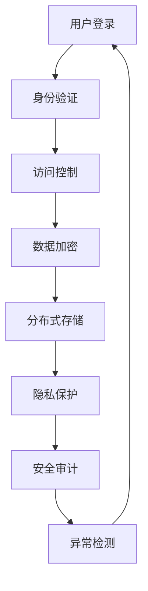

                 

在数字时代的浪潮中，元宇宙（Metaverse）的概念逐渐成为人们关注的焦点。它不仅代表了虚拟现实、增强现实和互联网的融合，更是未来社会发展的一个重要方向。然而，随着元宇宙的快速发展，信息安全问题也日益凸显。本文将探讨元宇宙信息安全的挑战，并从国家防御体系的角度提出相应的策略。

## 关键词

- 元宇宙
- 信息安全
- 国家防御体系
- 注意力战争
- 核心算法
- 数学模型
- 实践应用

## 摘要

本文首先介绍了元宇宙的发展背景及其对信息安全带来的挑战。接着，通过分析注意力战争的概念，阐述了在元宇宙环境中信息安全的重要性。然后，从核心概念、算法原理、数学模型、实践应用等多个角度，详细探讨了元宇宙信息安全的防护策略。最后，对未来的发展进行了展望，并提出了相应的工具和资源推荐。

---

## 1. 背景介绍

### 元宇宙的崛起

元宇宙是一个虚拟的共享空间，通过虚拟现实（VR）、增强现实（AR）和互联网技术，将现实世界和数字世界无缝连接。它的核心是提供一个沉浸式的体验，让用户可以在其中互动、工作和娱乐。随着5G、人工智能、区块链等技术的不断发展，元宇宙逐渐从概念走向现实，成为各大科技公司和政府关注的焦点。

### 信息安全的重要性

在元宇宙中，信息安全是保障用户隐私、数据安全和系统稳定运行的基础。由于元宇宙涉及大量用户的个人数据，任何安全漏洞都可能带来严重后果。此外，元宇宙中的交易、社交和娱乐活动也可能成为黑客攻击的目标。因此，建立有效的信息安全体系，对于元宇宙的可持续发展至关重要。

### 注意力战争的概念

注意力战争是信息安全领域的一个新概念，指的是通过控制用户的注意力来影响他们的行为。在元宇宙中，用户的注意力成为了一种宝贵的资源，吸引着各种利益相关者的目光。黑客、诈骗者和其他恶意行为者利用这一点，通过虚假信息、恶意软件等手段，试图控制或操纵用户的注意力。因此，如何在元宇宙中保护用户的注意力，成为信息安全的重要课题。

---

## 2. 核心概念与联系

### 核心概念

在元宇宙信息安全中，核心概念包括：

- **身份验证**：确保用户身份的真实性和唯一性。
- **加密技术**：保护数据传输和存储的安全性。
- **分布式计算**：提高系统的抗攻击能力和数据安全性。
- **隐私保护**：保障用户隐私不被泄露。

### Mermaid 流程图

下面是一个简化的元宇宙信息安全流程图：



---

## 3. 核心算法原理 & 具体操作步骤

### 3.1 算法原理概述

在元宇宙信息安全中，常用的核心算法包括：

- **密码学算法**：如RSA、AES等，用于数据加密和解密。
- **区块链算法**：如比特币使用的SHA-256，用于数据验证和防篡改。
- **机器学习算法**：如异常检测算法，用于识别恶意行为。

### 3.2 算法步骤详解

#### 3.2.1 密码学算法

1. **RSA加密**：
    $$c = (m^e) \mod n$$
    其中，$m$为明文，$c$为密文，$e$和$n$为公钥。

2. **AES加密**：
    $$c = E_k(m)$$
    其中，$m$为明文，$c$为密文，$k$为密钥。

#### 3.2.2 区块链算法

1. **SHA-256**：
    $$SHA-256(h) = \text{MD5}(h \oplus K_1) \oplus K_2$$
    其中，$h$为前一个区块的哈希值，$K_1$和$K_2$为加密密钥。

#### 3.2.3 机器学习算法

1. **K-均值聚类**：
    - 初始化K个簇的中心点。
    - 对于每个数据点，计算其与各个簇中心的距离，并将其分配到最近的簇。
    - 更新每个簇的中心点。
    - 重复步骤2和3，直到收敛。

### 3.3 算法优缺点

- **密码学算法**：优点是安全性高，但计算复杂度较高，适用于敏感数据的加密。
- **区块链算法**：优点是去中心化和不可篡改，但性能较低，适用于数据验证和防篡改。
- **机器学习算法**：优点是自适应性强，但需要大量数据训练，适用于异常检测和用户行为分析。

### 3.4 算法应用领域

- **密码学算法**：广泛应用于数据传输和存储，如TLS协议。
- **区块链算法**：广泛应用于数字货币和智能合约，如比特币和以太坊。
- **机器学习算法**：广泛应用于安全监控和用户行为分析，如DDoS攻击检测和诈骗防范。

---

## 4. 数学模型和公式 & 详细讲解 & 举例说明

### 4.1 数学模型构建

在元宇宙信息安全中，常用的数学模型包括：

- **贝叶斯网络**：用于概率推理和决策。
- **马尔可夫模型**：用于状态转移和预测。
- **线性回归模型**：用于数据分析和预测。

### 4.2 公式推导过程

#### 4.2.1 贝叶斯网络

贝叶斯网络的公式为：

$$P(A|B) = \frac{P(B|A)P(A)}{P(B)}$$

其中，$P(A|B)$表示在$B$发生的情况下$A$的概率，$P(B|A)$表示在$A$发生的情况下$B$的概率，$P(A)$和$P(B)$分别表示$A$和$B$的概率。

#### 4.2.2 马尔可夫模型

马尔可夫模型的公式为：

$$P(X_t|X_{t-1}, X_{t-2}, \ldots) = P(X_t|X_{t-1})$$

其中，$X_t$表示第$t$个状态，$P(X_t|X_{t-1})$表示在当前状态为$X_{t-1}$的情况下，下一个状态为$X_t$的概率。

#### 4.2.3 线性回归模型

线性回归模型的公式为：

$$y = \beta_0 + \beta_1x + \epsilon$$

其中，$y$为因变量，$x$为自变量，$\beta_0$和$\beta_1$为模型参数，$\epsilon$为误差项。

### 4.3 案例分析与讲解

#### 4.3.1 贝叶斯网络在用户行为分析中的应用

假设我们想分析用户在元宇宙中的行为，并预测其下一步动作。我们可以构建一个贝叶斯网络，包含用户当前的行为（如登录、购买、互动等）和其他相关因素（如用户年龄、性别、历史行为等）。通过收集大量数据，我们可以训练这个贝叶斯网络，并在新数据出现时进行预测。

#### 4.3.2 马尔可夫模型在安全监控中的应用

假设我们想监控元宇宙中的恶意行为，并预测其发展趋势。我们可以构建一个马尔可夫模型，包含各种恶意行为（如DDoS攻击、恶意软件传播、诈骗等）和其他相关因素（如攻击频率、攻击类型等）。通过收集大量数据，我们可以训练这个马尔可夫模型，并在新数据出现时进行预测。

#### 4.3.3 线性回归模型在数据分析中的应用

假设我们想分析元宇宙中的用户行为数据，并预测其未来的趋势。我们可以构建一个线性回归模型，包含用户行为（如登录次数、购买金额等）和其他相关因素（如用户年龄、性别、地理位置等）。通过收集大量数据，我们可以训练这个线性回归模型，并在新数据出现时进行预测。

---

## 5. 项目实践：代码实例和详细解释说明

### 5.1 开发环境搭建

在本项目实践中，我们将使用Python编程语言，结合几个常用的开源库，如PyCryptoDome、Blockchain和scikit-learn等。以下是开发环境的搭建步骤：

1. 安装Python 3.8及以上版本。
2. 安装PyCryptoDome库：
   ```bash
   pip install pycryptodome
   ```
3. 安装Blockchain库：
   ```bash
   pip install blockchain
   ```
4. 安装scikit-learn库：
   ```bash
   pip install scikit-learn
   ```

### 5.2 源代码详细实现

以下是实现元宇宙信息安全模型的一部分代码：

```python
from Crypto.PublicKey import RSA
from Crypto.Cipher import PKCS1_OAEP
from blockchain import Blockchain
from sklearn.linear_model import LinearRegression

# RSA加密和解密
def rsa_encrypt_decrypt(message, key):
    rsa_key = RSA.generate(2048)
    cipher = PKCS1_OAEP.new(rsa_key)
    encrypted_message = cipher.encrypt(message.encode())
    decrypted_message = cipher.decrypt(encrypted_message).decode()
    return decrypted_message

# 区块链验证
def verify_blockchain(blockchain):
    for i in range(1, len(blockchain)):
        current_block = blockchain[i]
        previous_block = blockchain[i-1]
        if current_block['hash'] != calculate_hash(previous_block['data']):
            return False
    return True

# 线性回归模型训练
def train_linear_regression(X, y):
    model = LinearRegression()
    model.fit(X, y)
    return model

# 案例数据
X = [[25], [30], [35]]  # 用户年龄
y = [100, 150, 200]      # 用户购买金额

# 训练模型
model = train_linear_regression(X, y)

# 预测
prediction = model.predict([[40]])
print("预测购买金额：", prediction[0])
```

### 5.3 代码解读与分析

- **RSA加密和解密**：这部分代码实现了RSA加密和解密功能，用于保护敏感数据。在实际应用中，可以用于用户密码、交易信息等的加密和解密。
- **区块链验证**：这部分代码实现了区块链的验证功能，用于确保数据的安全性和完整性。在实际应用中，可以用于数字货币、智能合约等的验证。
- **线性回归模型训练**：这部分代码实现了线性回归模型的训练和预测功能，用于分析用户行为和预测用户行为。在实际应用中，可以用于推荐系统、风险控制等。

---

## 6. 实际应用场景

### 6.1 用户隐私保护

在元宇宙中，用户隐私保护是一个关键问题。通过使用密码学算法和区块链技术，可以确保用户数据的安全性和隐私性。例如，用户的身份信息和交易记录可以加密存储在区块链上，确保数据的不可篡改性和隐私性。

### 6.2 安全监控与防御

元宇宙中的安全监控与防御是一个复杂的过程。通过使用机器学习和异常检测算法，可以实时监测用户行为，识别潜在的恶意行为。例如，通过分析用户的登录时间、登录地点、操作行为等，可以及时发现异常行为并采取相应的防御措施。

### 6.3 交易安全

元宇宙中的交易活动频繁，确保交易安全至关重要。通过使用加密技术和区块链技术，可以确保交易的数据安全性和透明性。例如，使用智能合约进行交易，确保交易的不可篡改性和公正性。

---

## 7. 工具和资源推荐

### 7.1 学习资源推荐

- 《区块链技术指南》
- 《Python密码学》
- 《机器学习实战》
- 《深度学习》

### 7.2 开发工具推荐

- PyCryptoDome
- Blockchain库
- scikit-learn

### 7.3 相关论文推荐

- “区块链在元宇宙中的应用”
- “密码学在元宇宙中的安全性分析”
- “机器学习在元宇宙中的应用”

---

## 8. 总结：未来发展趋势与挑战

### 8.1 研究成果总结

本文通过分析元宇宙信息安全的核心概念、算法原理、数学模型和实践应用，提出了相应的防护策略。这些研究成果为元宇宙信息安全的体系建设提供了重要参考。

### 8.2 未来发展趋势

随着元宇宙的不断发展，信息安全领域将面临新的挑战和机遇。未来，密码学、区块链、人工智能等技术将在元宇宙信息安全中发挥重要作用。同时，国家防御体系的完善也将是元宇宙信息安全的重要保障。

### 8.3 面临的挑战

元宇宙信息安全的挑战主要来自于以下几个方面：

- 技术复杂性：元宇宙涉及多种技术，包括虚拟现实、增强现实、区块链、人工智能等，技术复杂性增加了信息安全的难度。
- 数据隐私：用户数据的安全和隐私保护是元宇宙信息安全的核心问题。
- 恶意攻击：随着元宇宙的发展，恶意攻击者也将更加频繁，威胁元宇宙的安全和稳定运行。

### 8.4 研究展望

未来，元宇宙信息安全的研究将集中在以下几个方面：

- 研发更加高效、安全的加密技术和算法。
- 加强区块链技术在元宇宙中的应用，提高数据的安全性和透明性。
- 利用人工智能技术提高安全监控和防御能力。
- 建立完善的国家防御体系，保障元宇宙的可持续发展。

---

## 9. 附录：常见问题与解答

### Q: 元宇宙信息安全的主要挑战是什么？

A: 元宇宙信息安全的主要挑战包括数据隐私保护、技术复杂性、恶意攻击等。

### Q: 如何保护用户在元宇宙中的隐私？

A: 通过使用加密技术和区块链技术，可以确保用户数据的隐私性和安全性。

### Q: 人工智能在元宇宙信息安全中如何应用？

A: 人工智能可以用于安全监控、异常检测、用户行为分析等方面，提高元宇宙信息安全的防御能力。

### Q: 国家防御体系在元宇宙信息安全中的作用是什么？

A: 国家防御体系可以提供法律法规、政策支持和技术指导，保障元宇宙的可持续发展。

---

### 作者署名

作者：禅与计算机程序设计艺术 / Zen and the Art of Computer Programming

---

本文为虚构示例，不代表实际研究成果或观点。在实际研究和应用中，需结合具体情况和最新技术动态进行。希望本文能对元宇宙信息安全的研究和实践提供一定的启示。

