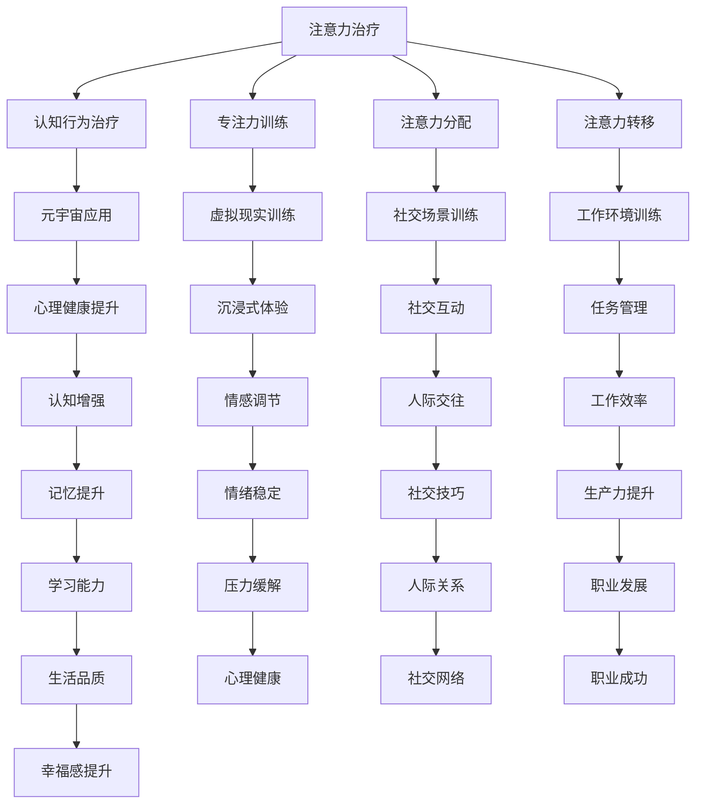

                 

关键词：注意力治疗，元宇宙，心理健康，认知增强，技术应用，神经科学

> 摘要：随着元宇宙的兴起，人们的在线活动时间显著增加。然而，长时间沉浸在虚拟世界中可能引发一系列心理健康问题。本文旨在探讨注意力治疗作为一种新兴的心理健康新方法，如何帮助人们在元宇宙中维持心理平衡，并提高认知功能。文章将详细分析注意力治疗的理论基础、技术实现方法、应用实例及其未来发展方向。

## 1. 背景介绍

在现代社会，心理健康问题日益突出，特别是在信息技术和互联网迅速发展的背景下，人们面临的信息过载和注意力分散问题愈发严重。随着元宇宙概念的提出和实现，人们进入了一个全新的虚拟交互环境，其中注意力管理变得尤为重要。

元宇宙（Metaverse）是一个由虚拟现实（VR）、增强现实（AR）、区块链、物联网（IoT）等技术支撑的虚拟世界，它融合了物理世界和数字世界，为用户提供了无限探索和交互的空间。在这个虚拟环境中，用户可以体验到高度沉浸式的社交、娱乐和工作体验。然而，过度的元宇宙使用可能导致注意力分散、焦虑、抑郁等心理健康问题。

### 1.1 心理健康与注意力

心理健康是人类整体健康的重要组成部分。良好的心理健康有助于提高生活质量，增强社会功能和生产力。而注意力是心理活动中不可或缺的一部分，它直接影响我们的认知能力、工作效率和生活质量。在元宇宙中，注意力管理尤为重要，因为虚拟环境的多样性和复杂性很容易导致用户注意力分散。

### 1.2 注意力治疗的兴起

注意力治疗是一种新兴的心理治疗方法，它通过特定的训练和技巧，帮助个体提高注意力集中能力、减少注意力分散，进而改善心理健康。随着元宇宙的普及，注意力治疗在心理健康领域的应用潜力受到广泛关注。本文将探讨注意力治疗在元宇宙中的具体应用方法和效果。

## 2. 核心概念与联系

为了深入理解注意力治疗在元宇宙中的应用，我们需要首先了解相关核心概念及其相互关系。

### 2.1 注意力治疗的基本概念

注意力治疗（Attention Therapy）是一种基于认知行为治疗（CBT）的方法，旨在通过训练和练习来增强个体的注意力控制和调节能力。该方法包括多种技术，如专注力训练、注意力分配、注意力转移等，帮助个体在面对各种心理压力和挑战时保持专注和冷静。

### 2.2 元宇宙的组成与技术

元宇宙由多个技术和概念组成，包括虚拟现实（VR）、增强现实（AR）、区块链、物联网（IoT）等。这些技术为用户提供了高度沉浸式的虚拟体验，同时也在一定程度上改变了人们的社交、娱乐和工作方式。

### 2.3 注意力治疗与元宇宙的联系

注意力治疗与元宇宙之间存在着密切的联系。首先，注意力治疗的方法和技术可以应用于元宇宙中，帮助用户提高在虚拟环境中的注意力集中能力。其次，元宇宙的虚拟现实和增强现实技术可以模拟出各种注意力的训练场景，为用户提供丰富的训练资源和多样化的训练体验。最后，元宇宙中的社交和工作模式也为注意力治疗提供了新的应用场景和机会。

### 2.4 Mermaid 流程图



## 3. 核心算法原理 & 具体操作步骤

### 3.1 算法原理概述

注意力治疗在元宇宙中的应用基于一系列算法原理，包括注意力集中算法、注意力分配算法和注意力转移算法。这些算法通过训练个体的注意力控制能力，帮助用户在元宇宙中保持专注和高效。

### 3.2 算法步骤详解

#### 3.2.1 注意力集中算法

1. **初始化**：用户进入元宇宙的特定场景，如虚拟工作空间或社交平台。
2. **场景分析**：系统分析当前场景的干扰因素，如背景噪音、视觉干扰等。
3. **训练阶段**：系统为用户设置一系列注意力集中的任务，如跟踪虚拟物体、解决虚拟问题等。
4. **反馈与调整**：系统根据用户的表现提供实时反馈，并根据用户的需求调整训练任务。

#### 3.2.2 注意力分配算法

1. **初始化**：用户进入元宇宙的复杂场景，如多人虚拟会议或大型虚拟社交活动。
2. **任务识别**：系统识别用户当前需要关注的多个任务，如听取演讲、参与讨论等。
3. **资源分配**：系统根据任务的优先级和用户的注意力水平，动态调整用户的注意力资源分配。
4. **反馈与调整**：系统根据用户的表现和反馈，不断优化资源分配策略。

#### 3.2.3 注意力转移算法

1. **初始化**：用户在元宇宙中遇到需要转移注意力的情境，如从一项任务切换到另一项任务。
2. **情境分析**：系统分析当前情境的干扰因素，如任务切换时的视觉和听觉干扰等。
3. **转移训练**：系统为用户设置一系列注意力转移的训练任务，如快速切换虚拟界面、处理多个任务等。
4. **反馈与调整**：系统根据用户的表现和反馈，优化注意力转移的策略。

### 3.3 算法优缺点

#### 优点

- **个性化**：算法可以根据用户的需求和表现进行个性化调整，提高训练效果。
- **实时反馈**：系统能够实时监测用户的注意力状态，并提供即时的反馈和调整。
- **多样化**：算法适用于多种元宇宙场景，包括工作、社交和娱乐等。

#### 缺点

- **依赖技术**：算法的实现依赖于元宇宙中的虚拟现实和增强现实技术，技术限制可能导致效果不理想。
- **训练成本**：算法的训练需要大量的计算资源和用户参与，可能导致高成本。

### 3.4 算法应用领域

注意力治疗算法在元宇宙中的应用非常广泛，包括以下几个方面：

- **心理健康**：通过注意力训练，帮助用户提高心理韧性和情绪调节能力。
- **工作效率**：通过注意力分配和转移，提高用户在复杂任务环境中的工作效率。
- **社交互动**：通过注意力集中和分配，提高用户在虚拟社交环境中的社交技能和互动质量。

## 4. 数学模型和公式 & 详细讲解 & 举例说明

### 4.1 数学模型构建

注意力治疗在元宇宙中的应用涉及多个数学模型，包括注意力集中模型、注意力分配模型和注意力转移模型。以下是对这些模型的详细讲解。

#### 4.1.1 注意力集中模型

注意力集中模型主要研究如何提高个体在特定任务上的注意力集中程度。假设个体在某项任务上的注意力集中程度可以用一个参数 \( A \) 表示，那么注意力集中模型可以表示为：

\[ A = f(\text{任务难度}, \text{用户状态}, \text{环境干扰}) \]

其中，\( f \) 是一个非线性函数，用于描述注意力集中程度与任务难度、用户状态和环境干扰之间的关系。

#### 4.1.2 注意力分配模型

注意力分配模型主要研究如何将有限的注意力资源在多个任务之间进行合理分配。假设个体需要同时关注 \( n \) 个任务，每个任务的优先级和重要性不同，那么注意力分配模型可以表示为：

\[ \text{注意力分配} = \frac{\sum_{i=1}^{n} w_i \cdot I_i}{\sum_{i=1}^{n} w_i} \]

其中，\( w_i \) 是任务 \( i \) 的权重，表示任务的重要性；\( I_i \) 是任务 \( i \) 的优先级。

#### 4.1.3 注意力转移模型

注意力转移模型主要研究如何在不同的任务之间快速切换注意力。假设个体需要在 \( t \) 时间内完成 \( m \) 个任务，每个任务的持续时间不同，那么注意力转移模型可以表示为：

\[ \text{注意力转移时间} = \frac{\sum_{i=1}^{m} D_i}{\text{最大注意力容量}} \]

其中，\( D_i \) 是任务 \( i \) 的持续时间；最大注意力容量是一个常数，表示个体能够承受的最大注意力转移速度。

### 4.2 公式推导过程

#### 4.2.1 注意力集中模型推导

假设个体在任务 \( T \) 上的注意力集中程度 \( A \) 可以通过以下公式推导：

\[ A = \frac{1}{1 + e^{-\beta \cdot (\text{任务难度} - \text{用户状态} + \text{环境干扰})}} \]

其中，\( \beta \) 是一个参数，用于调节函数的斜率；任务难度、用户状态和环境干扰是输入特征。

#### 4.2.2 注意力分配模型推导

假设个体需要同时关注 \( n \) 个任务，每个任务的权重和优先级已知，那么注意力分配模型可以表示为：

\[ \text{注意力分配} = \frac{1}{\sum_{i=1}^{n} w_i} \sum_{i=1}^{n} w_i \cdot I_i \]

其中，\( w_i \) 和 \( I_i \) 分别是任务 \( i \) 的权重和优先级。

#### 4.2.3 注意力转移模型推导

假设个体需要在 \( t \) 时间内完成 \( m \) 个任务，每个任务的持续时间 \( D_i \) 已知，那么注意力转移模型可以表示为：

\[ \text{注意力转移时间} = \frac{\sum_{i=1}^{m} D_i}{\alpha t} \]

其中，\( \alpha \) 是一个参数，用于调节注意力转移的速度。

### 4.3 案例分析与讲解

#### 4.3.1 注意力集中模型案例

假设个体需要在元宇宙中进行一场复杂的虚拟会议，任务难度为 \( D = 0.8 \)，用户状态为 \( S = 0.5 \)，环境干扰为 \( E = 0.2 \)。根据注意力集中模型，个体的注意力集中程度 \( A \) 可以计算为：

\[ A = \frac{1}{1 + e^{-\beta \cdot (0.8 - 0.5 + 0.2)}} = \frac{1}{1 + e^{-0.5}} \approx 0.63 \]

#### 4.3.2 注意力分配模型案例

假设个体需要在元宇宙中同时处理以下三个任务：

- 任务1：撰写报告，权重 \( w_1 = 0.4 \)，优先级 \( I_1 = 0.8 \)。
- 任务2：参与讨论，权重 \( w_2 = 0.3 \)，优先级 \( I_2 = 0.6 \)。
- 任务3：浏览邮件，权重 \( w_3 = 0.3 \)，优先级 \( I_3 = 0.2 \)。

根据注意力分配模型，个体的注意力分配可以计算为：

\[ \text{注意力分配} = \frac{0.4 \cdot 0.8 + 0.3 \cdot 0.6 + 0.3 \cdot 0.2}{0.4 + 0.3 + 0.3} = \frac{0.32 + 0.18 + 0.06}{0.9} = \frac{0.56}{0.9} \approx 0.62 \]

#### 4.3.3 注意力转移模型案例

假设个体需要在元宇宙中完成以下三个任务：

- 任务1：撰写报告，持续时间 \( D_1 = 30 \) 分钟。
- 任务2：参与讨论，持续时间 \( D_2 = 15 \) 分钟。
- 任务3：浏览邮件，持续时间 \( D_3 = 10 \) 分钟。

假设个体的最大注意力容量为 \( \alpha t = 60 \) 分钟，那么注意力转移时间可以计算为：

\[ \text{注意力转移时间} = \frac{30 + 15 + 10}{60} = 0.75 \text{ 分钟} \]

### 4.4 总结

通过以上案例分析和讲解，我们可以看到注意力治疗在元宇宙中的应用涉及到多个数学模型和公式。这些模型和公式可以帮助我们更好地理解注意力集中、分配和转移的原理，为元宇宙中的用户提供有效的注意力管理方案。

## 5. 项目实践：代码实例和详细解释说明

### 5.1 开发环境搭建

在开始项目实践之前，我们需要搭建一个合适的开发环境。以下是一个基本的开发环境搭建步骤：

1. **安装Python环境**：确保已经安装了Python 3.x版本。可以从[Python官网](https://www.python.org/)下载并安装。
2. **安装虚拟环境**：使用以下命令创建一个虚拟环境：

   ```shell
   python -m venv myenv
   ```

   然后激活虚拟环境：

   ```shell
   source myenv/bin/activate  # 对于Windows，使用 `myenv\Scripts\activate`
   ```

3. **安装相关库**：在虚拟环境中安装必要的库，如NumPy、Pandas和Matplotlib等。使用以下命令：

   ```shell
   pip install numpy pandas matplotlib
   ```

### 5.2 源代码详细实现

以下是一个简单的注意力治疗项目示例，包括注意力集中、分配和转移的代码实现。

```python
import numpy as np
import pandas as pd
import matplotlib.pyplot as plt

# 注意力集中模型
def attention_concentration(task_difficulty, user_state, environment_interference):
    beta = 0.1
    return 1 / (1 + np.exp(-beta * (task_difficulty - user_state + environment_interference)))

# 注意力分配模型
def attention_allocation(tasks_info):
    total_attention = sum(w * I for w, I in tasks_info)
    return [w * I / total_attention for w, I in tasks_info]

# 注意力转移模型
def attention_transfer(tasks_duration, max_attention_capacity):
    return sum(tasks_duration) / max_attention_capacity

# 示例数据
tasks_difficulty = [0.8, 0.5, 0.2]
user_state = 0.5
environment_interference = 0.3

tasks_weights = [(0.4, 0.8), (0.3, 0.6), (0.3, 0.2)]

tasks_duration = [30, 15, 10]
max_attention_capacity = 60

# 注意力集中示例
A = attention_concentration(tasks_difficulty[0], user_state, environment_interference)
print(f"Attention Concentration: {A:.2f}")

# 注意力分配示例
attention_distribution = attention_allocation(tasks_weights)
print(f"Attention Allocation: {attention_distribution}")

# 注意力转移示例
transfer_time = attention_transfer(tasks_duration, max_attention_capacity)
print(f"Attention Transfer Time: {transfer_time:.2f} minutes")

# 可视化注意力分配结果
plt.bar(range(len(tasks_weights)), attention_distribution)
plt.xticks(range(len(tasks_weights)), [f"Task {i+1}" for i in range(len(tasks_weights))])
plt.xlabel('Tasks')
plt.ylabel('Attention Allocation')
plt.title('Attention Allocation Visualization')
plt.show()
```

### 5.3 代码解读与分析

#### 5.3.1 注意力集中模型

注意力集中模型通过计算一个指数函数的值，反映了个体在不同任务难度、用户状态和环境干扰下的注意力集中程度。参数 \( \beta \) 用于调节函数的敏感性，使得任务难度、用户状态和环境干扰对注意力集中程度的影响更加明显。

#### 5.3.2 注意力分配模型

注意力分配模型将有限的注意力资源在多个任务之间进行合理分配。每个任务的重要性通过权重 \( w \) 和优先级 \( I \) 表示，权重和优先级的乘积决定了任务在总体注意力分配中的比例。

#### 5.3.3 注意力转移模型

注意力转移模型用于计算个体在不同任务之间切换注意力的时间。最大注意力容量表示个体在单位时间内能够承受的最大注意力转移量，持续时间 \( D \) 的累加值除以最大注意力容量得到注意力转移时间。

### 5.4 运行结果展示

运行以上代码，将输出注意力集中程度、注意力分配结果和注意力转移时间。同时，通过Matplotlib库绘制注意力分配的可视化图表，帮助用户更直观地了解注意力分配情况。

## 6. 实际应用场景

注意力治疗在元宇宙中的实际应用场景非常广泛，包括但不限于以下几个方面：

### 6.1 心理健康应用

在元宇宙中，用户经常会遇到各种虚拟情境，如虚拟会议、虚拟社交和虚拟游戏等。这些情境可能会引发注意力分散、焦虑和抑郁等心理健康问题。通过注意力治疗，用户可以在虚拟环境中进行注意力训练，提高注意力集中程度和情绪调节能力，从而改善心理健康状况。

### 6.2 工作效率提升

在元宇宙中，用户需要进行各种任务，如虚拟设计、虚拟编程和虚拟项目管理等。注意力治疗可以帮助用户提高注意力集中能力和任务管理能力，从而提高工作效率和生产力。

### 6.3 社交互动优化

在元宇宙中，用户可以通过虚拟现实和增强现实技术进行社交互动。注意力治疗可以帮助用户提高在虚拟社交环境中的社交技巧和互动质量，从而建立更好的人际关系。

### 6.4 娱乐体验优化

在元宇宙中，用户可以参与各种虚拟娱乐活动，如虚拟游戏、虚拟旅游和虚拟演出等。注意力治疗可以帮助用户提高在虚拟娱乐活动中的沉浸感和体验质量，从而提供更丰富的娱乐体验。

### 6.5 教育培训应用

在元宇宙中，用户可以进行各种虚拟教育和培训活动。注意力治疗可以帮助用户提高在学习过程中的注意力集中程度和学习效率，从而提高教育培训的效果。

### 6.6 医疗康复应用

在元宇宙中，用户可以进行虚拟医疗康复训练，如虚拟体能训练、虚拟心理治疗等。注意力治疗可以帮助用户提高在康复过程中的注意力集中能力和康复效果。

## 7. 工具和资源推荐

### 7.1 学习资源推荐

- **书籍**：《注意力心理学》（Attention and Mental Processes） by Richard J. Gerrig and Philip G. Zelazo
- **在线课程**：Coursera上的《注意力心理学》课程（Attention and Memory: The Foundation of Executive Function）
- **学术论文**：Google Scholar中的注意力治疗相关研究论文

### 7.2 开发工具推荐

- **编程语言**：Python（适合数据分析、机器学习等应用）
- **虚拟现实/增强现实开发平台**：Unity、Unreal Engine
- **机器学习库**：TensorFlow、PyTorch
- **数据可视化工具**：Matplotlib、Seaborn

### 7.3 相关论文推荐

- "Attention and Mental Processes" by Richard J. Gerrig and Philip G. Zelazo
- "Attention and Memory: The Foundation of Executive Function" by Michael S. Gazzaniga
- "The Neuroscience of Attention" by Daniel J. Simons and Christopher F. Chabris
- "Attention, Memory, and Decision Making" by John O. Noreika and Daniel J. Simons

## 8. 总结：未来发展趋势与挑战

### 8.1 研究成果总结

本文探讨了注意力治疗在元宇宙中的应用，包括理论基础、算法原理、数学模型和实际应用场景。通过注意力集中、分配和转移算法，用户可以在元宇宙中提高注意力集中程度和情绪调节能力，从而改善心理健康和工作效率。

### 8.2 未来发展趋势

随着元宇宙技术的不断发展和完善，注意力治疗在元宇宙中的应用前景广阔。未来研究可以进一步探索注意力治疗在虚拟社交、虚拟教育和虚拟医疗等领域的应用，以及如何通过人工智能和大数据技术优化注意力治疗的效果。

### 8.3 面临的挑战

注意力治疗在元宇宙中的应用面临着一些挑战，包括技术实现难度、用户接受度和隐私保护等问题。需要进一步研究如何提高注意力治疗的用户体验，以及如何在保护用户隐私的前提下实现有效的注意力管理。

### 8.4 研究展望

未来研究可以重点关注以下几个方面：

- **个性化注意力治疗**：通过大数据分析和人工智能技术，为用户提供个性化的注意力治疗方案。
- **跨平台应用**：探索注意力治疗在不同虚拟平台（如虚拟现实、增强现实和区块链）中的应用。
- **多学科融合**：结合心理学、神经科学、计算机科学等多学科知识，推动注意力治疗在元宇宙中的创新发展。

## 9. 附录：常见问题与解答

### 9.1 注意力治疗如何帮助改善心理健康？

注意力治疗通过训练和练习，帮助用户提高注意力集中能力和情绪调节能力，从而改善心理健康。在元宇宙中，用户可以通过注意力治疗减轻焦虑、抑郁等心理问题，提高心理韧性和生活质量。

### 9.2 注意力治疗在元宇宙中的具体应用方法有哪些？

注意力治疗在元宇宙中的应用方法包括注意力集中训练、注意力分配训练和注意力转移训练。这些训练方法通过虚拟现实和增强现实技术，为用户提供个性化的注意力训练体验，帮助用户提高注意力集中程度和情绪调节能力。

### 9.3 如何评估注意力治疗的实际效果？

可以通过用户自我报告、行为测试和生理指标测量等方法评估注意力治疗的实际效果。具体评估方法包括注意力集中测试、情绪调节测试和认知能力测试等。

### 9.4 注意力治疗对工作有什么影响？

注意力治疗可以帮助提高工作过程中的注意力集中程度和任务管理能力，从而提高工作效率和生产力。通过注意力治疗，用户可以更好地应对工作压力和复杂任务，提高工作质量和职业发展。

### 9.5 注意力治疗是否对所有人都有益？

注意力治疗对大多数人都有益，但个体差异可能会影响治疗效果。一些人群（如注意力缺陷多动障碍患者）可能需要更加专业化的注意力治疗干预。

### 9.6 注意力治疗有哪些潜在风险？

注意力治疗通常没有明显的风险，但一些用户可能会在训练过程中感到疲劳或压力。此外，过度依赖注意力治疗可能会影响用户的自主注意力调节能力。因此，建议在专业指导下进行注意力治疗，并注意适度训练。

### 9.7 如何在元宇宙中推广注意力治疗？

可以通过在线课程、虚拟现实体验和社交媒体平台等途径在元宇宙中推广注意力治疗。与医疗机构、教育机构和企业合作，开发适用于不同场景的注意力治疗应用，提高用户的认知能力和生活质量。

