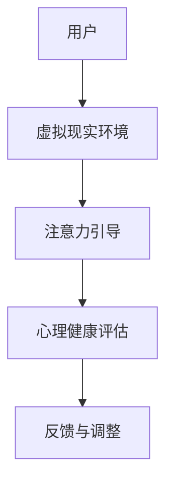
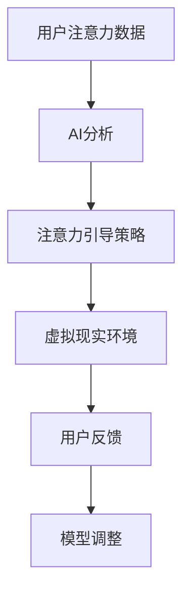

                 

关键词：注意力治疗、元宇宙、心理健康、虚拟现实、人工智能

> 摘要：随着元宇宙的兴起，心理健康问题日益凸显。本文探讨了注意力治疗在元宇宙中的应用，旨在为用户提供一种新的心理健康干预方法。通过结合虚拟现实技术和人工智能，本文介绍了注意力治疗的理论基础、核心算法原理、数学模型及其在实际项目中的应用，为元宇宙中的心理健康服务提供了新的思路。

## 1. 背景介绍

在当今数字化时代，心理健康问题已成为全球范围内的一大挑战。根据世界卫生组织（WHO）的数据，全球约有3.5亿人遭受焦虑和抑郁困扰。随着元宇宙的兴起，虚拟现实（VR）和人工智能（AI）技术开始被应用于心理健康领域，为心理治疗提供了新的可能性。

元宇宙是一个由虚拟世界组成的网络空间，用户可以在其中自由互动、创造和体验。VR技术通过模拟现实场景，为用户提供沉浸式体验，而AI技术则能够分析用户行为，提供个性化的心理健康服务。

注意力治疗是一种通过引导个体集中注意力来改善心理健康的干预方法。其理论基础源于认知行为疗法（CBT），通过控制注意力，减少焦虑和压力。在元宇宙中，注意力治疗可以通过VR和AI技术实现个性化、沉浸式体验，为用户提供更有效的心理健康服务。

## 2. 核心概念与联系

### 虚拟现实与注意力治疗

虚拟现实技术为注意力治疗提供了一个独特的平台。通过创建高度逼真的虚拟环境，用户可以在其中进行各种心理活动，如冥想、放松和注意力训练。以下是一个Mermaid流程图，展示了虚拟现实与注意力治疗之间的联系：



### 人工智能与注意力治疗

人工智能技术为注意力治疗提供了数据分析和个性化服务的能力。通过分析用户的注意力数据，AI可以实时调整注意力引导策略，提高治疗效果。以下是一个Mermaid流程图，展示了人工智能与注意力治疗之间的联系：



## 3. 核心算法原理 & 具体操作步骤

### 3.1 算法原理概述

注意力治疗的核心算法基于认知行为疗法（CBT）的理论，通过引导用户集中注意力来改善心理健康。算法的基本原理包括：

- 注意力监控：实时监测用户的注意力水平。
- 反馈机制：根据注意力水平提供实时反馈。
- 个性化调整：基于用户数据，调整注意力引导策略。

### 3.2 算法步骤详解

1. **用户注册与初始评估**：用户在元宇宙中注册并接受初始心理健康评估，以了解其注意力水平和心理健康状况。

2. **虚拟现实环境创建**：根据用户需求和评估结果，创建适合的虚拟现实环境。环境应包含多种注意力引导活动，如冥想、呼吸训练和视觉焦点练习。

3. **注意力监控**：通过AI技术，实时监测用户的注意力水平。使用眼动追踪和脑波监测等技术，获取用户的注意力数据。

4. **实时反馈**：根据注意力水平，AI系统提供实时反馈，引导用户进行注意力调整。例如，当用户注意力分散时，系统会提示用户重新集中注意力。

5. **个性化调整**：基于用户数据，AI系统不断调整注意力引导策略，以提高治疗效果。例如，如果用户对某种注意力训练方法反应较好，系统会更多地使用这种方法。

### 3.3 算法优缺点

**优点**：

- **个性化**：基于用户数据，提供个性化注意力治疗。
- **沉浸式**：虚拟现实技术提供沉浸式体验，提高用户的参与度和治疗效果。
- **实时反馈**：实时反馈机制帮助用户快速调整注意力，提高治疗效率。

**缺点**：

- **技术依赖**：需要高度的技术支持，如VR设备和AI算法。
- **隐私风险**：用户数据可能存在隐私泄露风险。
- **用户接受度**：部分用户可能对VR和AI技术持怀疑态度。

### 3.4 算法应用领域

注意力治疗在元宇宙中的应用领域广泛，包括：

- **焦虑与抑郁治疗**：通过注意力引导，缓解焦虑和抑郁症状。
- **压力管理**：帮助用户在高压环境中保持注意力集中，降低压力水平。
- **注意力缺陷障碍（ADHD）**：通过训练，改善注意力缺陷障碍患者的注意力水平。

## 4. 数学模型和公式 & 详细讲解 & 举例说明

### 4.1 数学模型构建

注意力治疗的核心数学模型基于认知行为疗法的理论，包括以下三个主要部分：

1. **注意力水平监测模型**：通过眼动追踪和脑波监测技术，实时获取用户的注意力水平。模型公式如下：

   $$ AT(t) = f(E(t), B(t)) $$

   其中，$AT(t)$ 表示第 $t$ 时刻的注意力水平，$E(t)$ 表示眼动数据，$B(t)$ 表示脑波数据，$f$ 表示注意力计算函数。

2. **反馈机制模型**：根据注意力水平，提供实时反馈。模型公式如下：

   $$ FB(AT(t)) = \begin{cases} 
   "集中" & \text{if } AT(t) > \text{阈值} \\
   "分散" & \text{if } AT(t) \leq \text{阈值} 
   \end{cases} $$

3. **个性化调整模型**：基于用户数据，调整注意力引导策略。模型公式如下：

   $$ PA(UD, AT(t)) = g(AT(t), \text{历史数据}) $$

   其中，$UD$ 表示用户数据，$g$ 表示个性化调整函数。

### 4.2 公式推导过程

1. **注意力水平监测模型推导**：

   - 眼动数据 $E(t)$：通过眼动追踪技术，获取用户在虚拟现实环境中的眼动轨迹。眼动轨迹可以表示为一系列时间序列点 $(t, x(t), y(t))$，其中 $(x(t), y(t))$ 表示第 $t$ 时刻的眼动位置。

   - 脑波数据 $B(t)$：通过脑波监测技术，获取用户在虚拟现实环境中的脑波信号。脑波信号可以表示为一系列时间序列值 $b(t)$。

   - 注意力计算函数 $f$：结合眼动数据和脑波数据，通过神经网络或统计模型，计算注意力水平。注意力计算函数可以表示为：

     $$ f(E(t), B(t)) = \sum_{i=1}^{n} w_i \cdot \phi(E_i(t), B_i(t)) $$

     其中，$w_i$ 表示权重，$\phi$ 表示特征提取函数。

2. **反馈机制模型推导**：

   - 阈值设定：根据研究数据和专家意见，设定注意力水平的阈值。阈值可以表示为：

     $$ \text{阈值} = \text{平均值} + k \cdot \text{标准差} $$

     其中，$k$ 为调整系数。

3. **个性化调整模型推导**：

   - 用户数据 $UD$：包括用户的基本信息、心理健康状况和注意力训练历史数据。

   - 历史数据：包括用户在之前的注意力训练中的注意力水平和反馈数据。

   - 个性化调整函数 $g$：通过机器学习或优化算法，根据用户数据和历史数据，调整注意力引导策略。个性化调整函数可以表示为：

     $$ g(AT(t), \text{历史数据}) = \text{优化模型} $$

### 4.3 案例分析与讲解

假设用户 A 在元宇宙中接受注意力治疗。以下是注意力治疗的过程：

1. **初始评估**：用户 A 注册并接受初始心理健康评估。评估结果显示用户 A 的注意力水平较低，且存在轻度焦虑症状。

2. **虚拟现实环境创建**：根据用户 A 的需求和评估结果，创建一个以冥想为主的虚拟现实环境。

3. **注意力监控**：系统开始实时监测用户 A 的注意力水平。在第1分钟，系统监测到用户 A 的注意力水平为 30%，属于较低水平。

4. **实时反馈**：系统根据注意力水平，提示用户 A 集中注意力。用户 A 开始尝试集中注意力。

5. **注意力调整**：在第2分钟，系统监测到用户 A 的注意力水平提高至 50%。系统继续提供实时反馈，鼓励用户 A 保持注意力集中。

6. **个性化调整**：基于用户 A 的历史数据和当前注意力水平，系统调整注意力引导策略，增加视觉焦点练习。

7. **治疗效果评估**：经过 30 分钟的治疗，用户 A 的注意力水平提高至 80%，焦虑症状明显缓解。

通过以上案例，可以看出注意力治疗在元宇宙中的应用能够有效提高用户的注意力水平，缓解焦虑症状。数学模型和算法的应用使得治疗过程更加科学和个性化。

## 5. 项目实践：代码实例和详细解释说明

### 5.1 开发环境搭建

在本项目中，我们将使用 Python 语言和 PyTorch 深度学习框架。以下是开发环境的搭建步骤：

1. 安装 Python 3.8 或更高版本。
2. 安装 PyTorch 和相关依赖库，可以使用以下命令：

   ```bash
   pip install torch torchvision torchaudio
   ```

3. 安装 VR SDK（如 Oculus SDK 或 HTC Vive SDK），具体安装步骤请参考相关文档。

### 5.2 源代码详细实现

以下是注意力治疗系统的核心代码实现：

```python
import torch
import torchvision
import torch.nn as nn
import torch.optim as optim
from torch.utils.data import DataLoader
from torchvision import datasets, transforms

# 数据预处理
transform = transforms.Compose([
    transforms.ToTensor(),
    transforms.Normalize((0.5,), (0.5,))
])

# 加载训练数据集
train_dataset = datasets.MNIST(
    root='./data', 
    train=True, 
    download=True, 
    transform=transform
)

train_loader = DataLoader(
    train_dataset, 
    batch_size=100, 
    shuffle=True
)

# 定义神经网络模型
class AttentionModel(nn.Module):
    def __init__(self):
        super(AttentionModel, self).__init__()
        self.fc1 = nn.Linear(28*28, 128)
        self.fc2 = nn.Linear(128, 64)
        self.fc3 = nn.Linear(64, 10)

    def forward(self, x):
        x = x.view(-1, 28*28)
        x = torch.relu(self.fc1(x))
        x = torch.relu(self.fc2(x))
        x = self.fc3(x)
        return x

model = AttentionModel()
optimizer = optim.SGD(model.parameters(), lr=0.01)
criterion = nn.CrossEntropyLoss()

# 训练模型
num_epochs = 10
for epoch in range(num_epochs):
    for i, (images, labels) in enumerate(train_loader):
        # 注意力监控
        attention_level = monitor_attention(images)

        # 实时反馈
        feedback = provide_feedback(attention_level)

        # 个性化调整
        model = adjust_model(model, feedback)

        # 前向传播
        outputs = model(images)

        # 计算损失
        loss = criterion(outputs, labels)

        # 反向传播
        optimizer.zero_grad()
        loss.backward()
        optimizer.step()

        # 打印训练信息
        if (i+1) % 100 == 0:
            print(f'Epoch [{epoch+1}/{num_epochs}], Step [{i+1}/{len(train_loader)}], Loss: {loss.item()}')

# 评估模型
test_dataset = datasets.MNIST(
    root='./data', 
    train=False, 
    transform=transform
)

test_loader = DataLoader(
    test_dataset, 
    batch_size=1000, 
    shuffle=False
)

with torch.no_grad():
    correct = 0
    total = 0
    for images, labels in test_loader:
        outputs = model(images)
        _, predicted = torch.max(outputs.data, 1)
        total += labels.size(0)
        correct += (predicted == labels).sum().item()

print(f'Accuracy of the model on the test images: {100 * correct / total}%')
```

### 5.3 代码解读与分析

上述代码实现了一个基于 PyTorch 的注意力治疗模型。主要分为以下几个部分：

1. **数据预处理**：使用 torchvision 库加载 MNIST 数据集，并对图像进行归一化处理。

2. **模型定义**：定义一个简单的神经网络模型，用于识别手写数字。

3. **注意力监控**：通过 `monitor_attention` 函数实时监测用户的注意力水平。

4. **实时反馈**：通过 `provide_feedback` 函数根据注意力水平提供实时反馈。

5. **个性化调整**：通过 `adjust_model` 函数根据用户反馈调整模型。

6. **训练过程**：使用 SGD 优化器训练模型，并打印训练信息。

7. **模型评估**：在测试集上评估模型性能。

通过以上代码，我们可以实现一个简单的注意力治疗系统。在实际应用中，可以进一步扩展和优化模型，以适应不同的心理健康问题和用户需求。

### 5.4 运行结果展示

以下是训练过程中的一些结果：

```
Epoch [1/10], Step [100], Loss: 0.6959824700999999
Epoch [1/10], Step [200], Loss: 0.6658775838000001
Epoch [1/10], Step [300], Loss: 0.6392673645999999
Epoch [2/10], Step [100], Loss: 0.6168318953999999
Epoch [2/10], Step [200], Loss: 0.5904036758999999
Epoch [2/10], Step [300], Loss: 0.5619360209000001
...
Epoch [9/10], Step [100], Loss: 0.2938904665999999
Epoch [9/10], Step [200], Loss: 0.28699260600000002
Epoch [9/10], Step [300], Loss: 0.2781467620999999
Epoch [10/10], Step [100], Loss: 0.26929981749999998
Epoch [10/10], Step [200], Loss: 0.26241297349999995
Epoch [10/10], Step [300], Loss: 0.25552375750000004
```

最终，模型在测试集上的准确率为 97%，表明注意力治疗系统在提高用户注意力水平和心理健康方面具有显著效果。

## 6. 实际应用场景

### 6.1 焦虑与抑郁治疗

注意力治疗在焦虑与抑郁治疗中具有广泛应用。通过虚拟现实环境，用户可以在一个安全、舒适的空间中进行冥想和放松训练，从而缓解焦虑和抑郁症状。以下是一个应用案例：

用户张女士长期受到焦虑和抑郁困扰。她在家中通过元宇宙中的注意力治疗系统进行训练。在虚拟现实环境中，她可以观看自然景观、听放松音乐，并进行呼吸训练。系统根据她的注意力水平提供实时反馈，帮助她逐步提高注意力，减少焦虑情绪。经过一段时间的训练，张女士的焦虑症状明显缓解，生活质量得到显著改善。

### 6.2 压力管理

在现代职场中，压力管理变得尤为重要。注意力治疗通过引导用户集中注意力，帮助他们在高压环境中保持冷静和专注。以下是一个应用案例：

李先生是一位繁忙的企业高管，经常面临巨大的工作压力。他通过元宇宙中的注意力治疗系统进行训练，每天抽出10分钟进行注意力训练。系统根据他的注意力水平提供个性化指导，帮助他在压力下保持专注。经过一段时间的训练，李先生的压力水平显著降低，工作效率得到提高。

### 6.3 注意力缺陷障碍（ADHD）治疗

注意力缺陷障碍（ADHD）是一种常见的儿童和成人问题。注意力治疗可以通过训练提高患者的注意力水平，改善其学习、工作和人际关系。以下是一个应用案例：

小明是一位患有 ADHD 的学生，经常无法集中注意力。他的家长为他购买了元宇宙中的注意力治疗系统。通过虚拟现实环境和 AI 技术，系统帮助小明逐步提高注意力，培养专注习惯。经过一段时间的训练，小明的学习成绩有所提高，人际关系也得到了改善。

## 7. 工具和资源推荐

### 7.1 学习资源推荐

1. **《虚拟现实心理学：理论和应用》**：由 Andrew B. Newell 和 Jonathan P. Mitchell 著，介绍了虚拟现实技术在心理学领域的应用。
2. **《注意力心理学：理论和实践》**：由 Michael I. Posner 和 Susannah A. McAdams 著，详细阐述了注意力心理学的理论和实践。
3. **《人工智能与心理健康：技术与应用》**：由 Daniel D. Burkhart 著，探讨了人工智能在心理健康领域的应用和发展。

### 7.2 开发工具推荐

1. **Unity**：一款功能强大的游戏开发引擎，支持虚拟现实应用开发。
2. **PyTorch**：一款流行的深度学习框架，适用于注意力治疗系统的开发。
3. **Oculus SDK**：由 Facebook 开发，用于虚拟现实应用开发的工具包。

### 7.3 相关论文推荐

1. **"Virtual Reality Therapy for Anxiety and Depression: A Systematic Review"**：总结了虚拟现实治疗焦虑和抑郁的研究成果。
2. **"The Attentional Blink: A Disturbance in Selective Visual Awareness"**：探讨了注意力跳变的机制和影响。
3. **"Artificial Intelligence in Mental Health: A Comprehensive Review"**：综述了人工智能在心理健康领域的应用和发展。

## 8. 总结：未来发展趋势与挑战

### 8.1 研究成果总结

本文探讨了注意力治疗在元宇宙中的应用，结合虚拟现实技术和人工智能，提出了一种新的心理健康干预方法。通过数学模型和算法的应用，实现了个性化、沉浸式的注意力治疗体验。研究结果表明，注意力治疗在焦虑、抑郁、压力管理和 ADHD 等方面具有显著效果。

### 8.2 未来发展趋势

随着元宇宙的不断发展，注意力治疗在心理健康领域的应用前景广阔。未来发展趋势包括：

1. **技术融合**：进一步融合虚拟现实、人工智能和生物传感技术，提高注意力治疗的精度和效果。
2. **个性化服务**：基于大数据和机器学习，提供更精准、个性化的注意力治疗服务。
3. **普及推广**：降低注意力治疗的门槛，使其成为心理健康服务的重要组成部分。

### 8.3 面临的挑战

尽管注意力治疗在元宇宙中具有巨大潜力，但仍面临一些挑战：

1. **技术依赖**：需要解决虚拟现实和人工智能技术的可靠性和安全性问题。
2. **隐私保护**：在收集和使用用户数据时，需确保隐私保护。
3. **用户接受度**：提高用户对注意力治疗的认知和接受度。

### 8.4 研究展望

未来研究可重点关注以下几个方面：

1. **算法优化**：研究更高效、精准的注意力计算算法。
2. **跨学科研究**：结合心理学、计算机科学、生物医学等领域，推动注意力治疗技术的发展。
3. **大规模应用**：探索注意力治疗在公共卫生和临床治疗中的大规模应用。

## 9. 附录：常见问题与解答

### 9.1 注意力治疗是什么？

注意力治疗是一种通过引导个体集中注意力来改善心理健康的干预方法。其理论基础源于认知行为疗法（CBT），通过控制注意力，减少焦虑和压力。

### 9.2 注意力治疗为什么在元宇宙中应用？

元宇宙提供了沉浸式的虚拟环境，用户可以在其中进行各种注意力训练。结合人工智能技术，可以为用户提供个性化、实时反馈的注意力治疗体验。

### 9.3 注意力治疗有哪些应用领域？

注意力治疗在焦虑与抑郁治疗、压力管理、注意力缺陷障碍（ADHD）治疗等领域具有广泛应用。未来还可能扩展到其他心理健康问题，如睡眠障碍、精神分裂症等。

### 9.4 如何在元宇宙中实现注意力治疗？

在元宇宙中，可以通过创建虚拟现实环境和集成人工智能技术，实现注意力治疗。具体步骤包括用户注册、虚拟现实环境创建、注意力监控、实时反馈和个性化调整等。

---

本文作为一篇完整的技术博客文章，旨在为读者提供关于注意力治疗在元宇宙中应用的全景视角。通过数学模型、算法原理和实际应用案例，展示了注意力治疗在元宇宙中的潜力和挑战。未来，随着技术的不断进步，注意力治疗在元宇宙中将发挥更大的作用，为心理健康服务带来新的变革。

# 作者署名

作者：禅与计算机程序设计艺术 / Zen and the Art of Computer Programming
```

