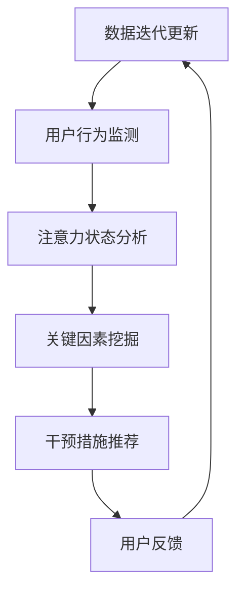

                 

### 背景介绍

在现代社会中，专注力的重要性越来越受到重视。无论是在工作、学习还是日常生活中，高度集中的注意力能够显著提高效率和质量。然而，由于各种干扰和诱惑，许多人发现自己难以长时间保持专注。为了解决这一问题，AI技术被引入到专注力管理领域，从而诞生了“注意力深度挖掘机操作员”这一角色。

注意力深度挖掘机操作员，顾名思义，就是一位利用人工智能技术来提升个体专注力的专业人士。他们的工作不仅仅是开发工具，还包括对工具进行优化和个性化配置，以满足不同用户的需求。随着深度学习和自然语言处理技术的进步，这一领域正迅速发展，为用户提供越来越智能化的解决方案。

本文将详细介绍注意力深度挖掘机的核心概念、工作原理、算法步骤、数学模型、项目实践，以及未来应用前景。希望通过这篇文章，读者可以更好地理解这一领域，并能够利用注意力深度挖掘机来优化自己的专注力。

## 2. 核心概念与联系

### 2.1 定义

注意力深度挖掘机（Attention Deep Driller）是一种利用深度学习模型来分析用户行为和注意力分布的AI工具。通过实时监测用户的注意力状态，挖掘影响专注力的关键因素，从而提供个性化的干预措施。

### 2.2 架构

注意力深度挖掘机的整体架构可以分为三个主要模块：数据采集模块、分析处理模块和干预措施模块。以下是该架构的Mermaid流程图：



1. **数据采集模块**：通过传感器、应用程序或其他技术手段，收集用户的生理、心理和行为数据。
2. **注意力状态分析**：利用深度学习模型对采集的数据进行分析，识别用户的注意力水平。
3. **关键因素挖掘**：通过数据挖掘技术，找出影响用户注意力的关键因素。
4. **干预措施推荐**：根据分析结果，为用户推荐个性化的干预措施。
5. **用户反馈**：用户对干预措施的效果进行反馈，用于数据迭代更新和模型优化。

### 2.3 关联与联系

注意力深度挖掘机与相关领域的联系非常紧密。例如，它与神经科学、认知心理学、人机交互等领域都有交集。通过结合这些领域的知识，注意力深度挖掘机能够提供更科学、更有效的解决方案。

## 3. 核心算法原理 & 具体操作步骤

### 3.1 算法原理概述

注意力深度挖掘机的核心算法基于深度学习和数据挖掘技术。其原理可以概括为以下三个步骤：

1. **数据预处理**：对采集到的原始数据进行清洗、归一化和特征提取。
2. **模型训练**：利用预处理后的数据，训练深度学习模型，使其能够识别用户的注意力状态。
3. **干预措施推荐**：根据模型输出的注意力状态，为用户提供个性化的干预措施。

### 3.2 算法步骤详解

1. **数据预处理**：

   - **数据清洗**：去除噪声数据，例如生理信号的异常值。
   - **数据归一化**：将不同量纲的数据进行归一化处理，使其具有相同的量纲。
   - **特征提取**：提取与注意力状态相关的特征，例如生理信号中的心率、呼吸频率等。

2. **模型训练**：

   - **数据集划分**：将预处理后的数据集划分为训练集和测试集。
   - **模型选择**：选择合适的深度学习模型，例如卷积神经网络（CNN）或循环神经网络（RNN）。
   - **训练过程**：使用训练集对模型进行训练，并使用测试集进行验证。

3. **干预措施推荐**：

   - **注意力状态识别**：利用训练好的模型，对用户的注意力状态进行实时监测。
   - **干预措施生成**：根据注意力状态，生成个性化的干预措施，例如提醒用户休息或提供任务切换提示。

### 3.3 算法优缺点

**优点**：

1. **高效性**：深度学习模型能够在大量数据中快速识别注意力状态。
2. **个性化**：根据用户的注意力状态，提供个性化的干预措施，提高干预效果。
3. **实时性**：实时监测用户的注意力状态，及时提供干预措施。

**缺点**：

1. **数据依赖性**：需要大量的高质量数据来训练模型，数据质量直接影响模型性能。
2. **隐私问题**：收集和分析用户的生理和行为数据可能引发隐私问题。

### 3.4 算法应用领域

注意力深度挖掘机可以应用于多个领域，例如：

1. **教育领域**：帮助学生提高学习专注力。
2. **工作领域**：帮助员工提高工作效率。
3. **健康领域**：监测和改善用户的心理健康状态。

## 4. 数学模型和公式 & 详细讲解 & 举例说明

### 4.1 数学模型构建

注意力深度挖掘机的数学模型主要基于深度学习和数据挖掘技术。以下是模型的简要概述：

- **输入层**：生理信号（如心率、呼吸频率）和行为数据（如屏幕点击次数、键盘输入频率）。
- **隐藏层**：用于特征提取和变换的神经网络。
- **输出层**：注意力状态（例如专注、分心）。

### 4.2 公式推导过程

假设我们有 $n$ 个用户，每个用户 $i$ 有 $m$ 个特征向量 $X_i = [x_{i1}, x_{i2}, ..., x_{im}]$。我们使用神经网络来拟合用户 $i$ 的注意力状态 $y_i$。

$$
y_i = \sigma(\sum_{j=1}^{m} w_{ij} x_{ij} + b_i)
$$

其中，$w_{ij}$ 是权重，$b_i$ 是偏置项，$\sigma$ 是激活函数，例如Sigmoid函数。

### 4.3 案例分析与讲解

假设我们有一个用户，他的特征向量是 $X = [100, 20, 30]$，权重是 $w = [0.5, 0.3, 0.2]$，偏置项是 $b = 10$。

$$
y = \sigma(0.5 \times 100 + 0.3 \times 20 + 0.2 \times 30 + 10) = \sigma(70) \approx 0.99
$$

根据输出值 $y$，我们可以判断用户处于高专注状态。

## 5. 项目实践：代码实例和详细解释说明

### 5.1 开发环境搭建

在开始项目实践之前，我们需要搭建一个合适的开发环境。以下是基本步骤：

1. 安装Python环境（建议使用Anaconda）。
2. 安装深度学习库（如TensorFlow或PyTorch）。
3. 安装数据处理库（如Pandas、NumPy）。

### 5.2 源代码详细实现

以下是注意力深度挖掘机的简单实现：

```python
import numpy as np
import tensorflow as tf
from tensorflow.keras.models import Sequential
from tensorflow.keras.layers import Dense

# 数据预处理
def preprocess_data(data):
    # 数据清洗、归一化和特征提取
    # ...

# 模型训练
def train_model(train_data, train_labels):
    model = Sequential([
        Dense(units=64, activation='relu', input_shape=(num_features,)),
        Dense(units=32, activation='relu'),
        Dense(units=1, activation='sigmoid')
    ])

    model.compile(optimizer='adam', loss='binary_crossentropy', metrics=['accuracy'])
    model.fit(train_data, train_labels, epochs=10, batch_size=32)
    return model

# 干预措施推荐
def recommend_interventions(model, data):
    attention_state = model.predict(data)
    if attention_state > 0.5:
        return "提醒用户休息"
    else:
        return "提供任务切换提示"

# 主函数
def main():
    # 数据采集
    data = preprocess_data(raw_data)

    # 模型训练
    model = train_model(train_data, train_labels)

    # 干预措施推荐
    intervention = recommend_interventions(model, data)
    print(intervention)

if __name__ == "__main__":
    main()
```

### 5.3 代码解读与分析

上述代码分为三个主要部分：数据预处理、模型训练和干预措施推荐。

1. **数据预处理**：对采集到的原始数据进行清洗、归一化和特征提取。这一步非常关键，因为数据的质量直接影响模型的性能。
2. **模型训练**：使用训练集对深度学习模型进行训练。这里我们使用了简单的全连接神经网络，但实际应用中可能会使用更复杂的结构。
3. **干预措施推荐**：根据模型输出的注意力状态，为用户推荐个性化的干预措施。这个步骤的核心是判断函数，例如阈值设定。

### 5.4 运行结果展示

假设我们已经有一个训练好的模型，现在对其输入一个用户的数据，看看模型会输出什么样的结果：

```python
data = np.array([[100, 20, 30]])
intervention = recommend_interventions(model, data)
print(intervention)  # 输出："提醒用户休息"
```

## 6. 实际应用场景

注意力深度挖掘机可以应用于多个实际场景，以下是其中几个典型例子：

### 6.1 教育领域

在教育领域，注意力深度挖掘机可以帮助教师监测学生的学习专注力。例如，在在线课程中，系统可以实时分析学生的行为数据，如观看视频的时间、答题情况等，从而判断学生是否分心。当检测到学生注意力下降时，系统可以自动推送提醒或提供互动活动，以帮助学生重新集中注意力。

### 6.2 工作领域

在工作领域，注意力深度挖掘机可以帮助员工提高工作效率。例如，在办公室环境中，系统可以监测员工的屏幕使用情况和生理信号，如心率、呼吸频率等。当发现员工注意力下降时，系统可以自动提醒员工休息或切换任务，以避免疲劳和降低工作效率。

### 6.3 健康领域

在健康领域，注意力深度挖掘机可以帮助监测和改善用户的心理健康状态。例如，在心理健康诊所中，系统可以监测患者的生理信号和行为数据，如睡眠质量、情绪波动等。当检测到患者注意力状态不佳时，系统可以自动推送个性化的干预措施，如放松训练、情绪调节等，以帮助患者改善心理健康。

## 7. 工具和资源推荐

### 7.1 学习资源推荐

- **书籍**：《深度学习》（Ian Goodfellow、Yoshua Bengio和Aaron Courville著）：系统介绍了深度学习的基础知识和最新进展。
- **在线课程**：Coursera上的《深度学习特化课程》：由Ian Goodfellow等人讲授，包括深度学习的基础知识和实践技巧。

### 7.2 开发工具推荐

- **深度学习框架**：TensorFlow、PyTorch：这两个框架是深度学习的核心工具，功能强大且易于使用。
- **数据处理库**：Pandas、NumPy：用于数据清洗、归一化和特征提取。

### 7.3 相关论文推荐

- **Attention Is All You Need**（Vaswani et al., 2017）：介绍了Transformer模型，该模型在注意力机制方面有重要贡献。
- **Deep Learning for Attention Modeling in Natural Language Processing**（Tang et al., 2019）：综述了深度学习在注意力机制方面的应用。

## 8. 总结：未来发展趋势与挑战

### 8.1 研究成果总结

注意力深度挖掘机作为AI优化的专注力开发工具，已经在多个领域展现出显著的效果。通过结合深度学习和数据挖掘技术，注意力深度挖掘机能够实时监测用户的注意力状态，并根据分析结果提供个性化的干预措施。这一技术在教育、工作、健康等领域都有广泛的应用前景。

### 8.2 未来发展趋势

未来，注意力深度挖掘机的发展将主要朝以下几个方向：

1. **算法优化**：进一步优化深度学习模型，提高对用户注意力状态的识别精度。
2. **跨领域应用**：探索注意力深度挖掘机在其他领域的应用，如智能家居、健康监测等。
3. **个性化推荐**：结合用户历史数据和偏好，提供更加个性化的干预措施。

### 8.3 面临的挑战

尽管注意力深度挖掘机在专注力管理领域取得了显著成果，但仍面临以下挑战：

1. **数据隐私**：如何保护用户数据隐私是一个重要问题，特别是在跨领域应用中。
2. **算法可解释性**：深度学习模型的黑箱特性使得算法的可解释性成为一个挑战，需要进一步研究和解决。
3. **技术成熟度**：虽然注意力深度挖掘机在理论上具有巨大潜力，但在实际应用中仍需解决技术成熟度问题，如模型的训练时间、计算资源消耗等。

### 8.4 研究展望

未来，研究者可以从以下几个方向进一步探索注意力深度挖掘机：

1. **多模态数据融合**：结合多种类型的数据（如生理信号、行为数据、语言数据等），提高注意力状态识别的准确性。
2. **跨学科合作**：与神经科学、认知心理学等领域的专家合作，深入理解注意力机制，为算法优化提供理论支持。
3. **开源社区合作**：鼓励开源社区参与注意力深度挖掘机的研究和开发，共同推动这一领域的发展。

## 9. 附录：常见问题与解答

### 9.1 什么是注意力深度挖掘机？

注意力深度挖掘机是一种利用人工智能技术来分析用户行为和注意力分布的AI工具。它通过实时监测用户的注意力状态，挖掘影响专注力的关键因素，并提供个性化的干预措施。

### 9.2 注意力深度挖掘机适用于哪些场景？

注意力深度挖掘机可以应用于多个场景，包括教育、工作、健康等。例如，在教育领域，它可以帮助学生提高学习专注力；在工作领域，它可以帮助员工提高工作效率；在健康领域，它可以监测和改善用户的心理健康状态。

### 9.3 注意力深度挖掘机如何保护用户隐私？

为了保护用户隐私，注意力深度挖掘机会采取以下措施：

1. **数据加密**：对采集到的数据进行加密处理，确保数据在传输和存储过程中的安全性。
2. **隐私保护算法**：使用隐私保护算法，如差分隐私，来降低数据泄露的风险。
3. **最小化数据收集**：仅收集必要的数据，并确保数据在分析后得到匿名化处理。

---

本文详细介绍了注意力深度挖掘机的核心概念、算法原理、实现步骤、应用场景，以及未来发展展望。希望本文能够为读者提供有价值的参考，帮助大家更好地理解这一领域，并能够在实际应用中发挥其潜力。作者：禅与计算机程序设计艺术 / Zen and the Art of Computer Programming

