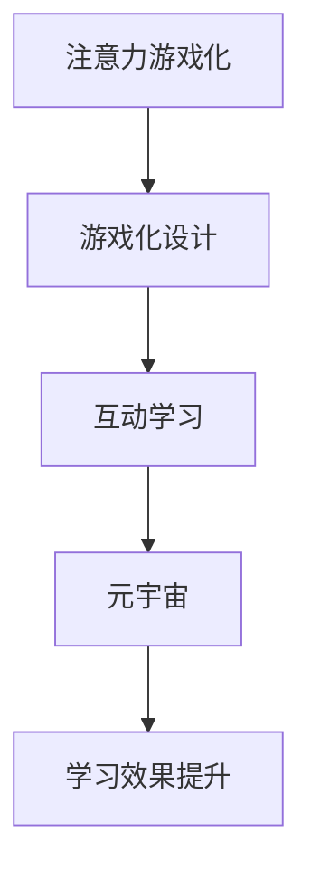

                 

关键词：注意力游戏化、元宇宙、学习新方法、游戏化设计、互动学习、虚拟现实

> 摘要：本文探讨了注意力游戏化在元宇宙学习中的应用，分析游戏化设计如何增强学习者的参与度和兴趣，以及如何在虚拟环境中实现有效的互动学习。文章从背景介绍、核心概念与联系、核心算法原理与具体操作步骤、数学模型和公式、项目实践、实际应用场景、工具和资源推荐、总结与展望等多个方面展开，旨在为元宇宙学习提供一种新的视角和方法。

## 1. 背景介绍

在当今数字化时代，学习方式正经历着巨大的变革。传统的教学模式逐渐被数字化的学习平台所替代，而虚拟现实（VR）和增强现实（AR）技术的崛起，更是为学习带来了全新的体验。元宇宙，作为虚拟现实的终极形态，为学习者提供了一个完全沉浸式的学习环境。然而，如何在这个环境中保持学习者的注意力，提高学习效果，成为了一个亟待解决的问题。

游戏化设计作为一种有效的学习策略，通过将游戏元素融入学习中，能够激发学习者的兴趣和动机，提高他们的参与度和积极性。而注意力游戏化，则进一步利用游戏化的机制，引导学习者在元宇宙中保持高度集中的注意力，从而提高学习效果。

本文将探讨注意力游戏化在元宇宙学习中的应用，分析其核心概念与联系，介绍相关算法原理和具体操作步骤，并讨论数学模型和公式。最后，通过实际项目实践和未来应用展望，为元宇宙学习提供一种新的方法和思路。

## 2. 核心概念与联系

### 2.1. 注意力游戏化

注意力游戏化是将游戏化的机制应用于学习过程中，以激发学习者的注意力，提高学习效果。在元宇宙学习中，注意力游戏化通过设计互动性、竞争性、奖励机制等元素，引导学习者在虚拟环境中保持专注和积极参与。

### 2.2. 游戏化设计

游戏化设计是一种将游戏设计理念应用于非游戏领域的策略，旨在通过引入游戏元素，提升用户参与度和体验。在元宇宙学习中，游戏化设计通过创造有趣的学习任务、设定挑战和奖励机制，激发学习者的兴趣和动机。

### 2.3. 元宇宙

元宇宙是一个虚拟的、三维的、沉浸式的数字世界，通过虚拟现实（VR）和增强现实（AR）技术实现。在元宇宙中，学习者可以与虚拟环境中的物体和角色进行互动，体验到身临其境的学习体验。

### 2.4. 互动学习

互动学习是一种通过学习者与学习环境、其他学习者之间的互动来促进学习的策略。在元宇宙学习中，互动学习通过虚拟环境中的互动任务和社交互动，提高学习者的参与度和积极性。

### 2.5. Mermaid 流程图

Mermaid 是一种用于绘制流程图的 MarkDown 语法。在本文中，我们将使用 Mermaid 流程图来展示注意力游戏化的核心概念与联系。



## 3. 核心算法原理 & 具体操作步骤

### 3.1. 算法原理概述

注意力游戏化算法的核心思想是通过游戏化的机制来引导学习者在元宇宙中保持专注和积极参与。具体来说，算法包括以下几个关键步骤：

1. 设计游戏化任务：根据学习目标和内容，设计具有挑战性、互动性和趣味性的游戏化任务。
2. 设定奖励机制：通过奖励机制，激励学习者完成任务，提高他们的积极性。
3. 跟踪学习进度：实时跟踪学习者的学习进度和注意力水平，调整游戏化任务的难度和奖励。
4. 评估学习效果：通过评估学习效果，优化游戏化算法的设计，提高学习效果。

### 3.2. 算法步骤详解

#### 3.2.1. 设计游戏化任务

设计游戏化任务时，需要考虑以下几个因素：

1. 学习目标：确保游戏化任务与学习目标紧密相关。
2. 挑战性：游戏化任务应具有一定的挑战性，以激发学习者的兴趣和动力。
3. 互动性：游戏化任务应具备互动性，使学习者能够在虚拟环境中与任务进行互动。
4. 趣味性：游戏化任务应具有趣味性，以提高学习者的参与度。

#### 3.2.2. 设定奖励机制

奖励机制是注意力游戏化的关键组成部分，可以有效激励学习者完成任务。奖励机制可以包括以下几个方面：

1. 成就奖励：根据学习者的任务完成情况，发放相应的成就奖励，如等级提升、徽章等。
2. 赞赏奖励：通过虚拟货币或积分奖励，激发学习者的积极性。
3. 社交奖励：鼓励学习者分享学习成果，获得社交认可和赞誉。

#### 3.2.3. 跟踪学习进度

跟踪学习进度是确保游戏化任务有效性的重要环节。通过实时跟踪学习者的学习进度和注意力水平，可以动态调整游戏化任务的难度和奖励。具体方法包括：

1. 数据分析：对学习者的学习行为和注意力水平进行分析，发现潜在的问题和需求。
2. 个性化推荐：根据学习者的学习进度和注意力水平，推荐合适的游戏化任务和奖励。

#### 3.2.4. 评估学习效果

评估学习效果是优化游戏化算法设计的重要手段。通过评估学习效果，可以了解游戏化任务的实际效果，为后续优化提供依据。具体方法包括：

1. 成绩评估：根据学习者的任务完成情况和成绩，评估游戏化任务的有效性。
2. 用户反馈：收集学习者的反馈，了解他们对游戏化任务的满意度和建议。

### 3.3. 算法优缺点

#### 优点：

1. 提高学习兴趣：游戏化设计能够激发学习者的兴趣和动力，提高学习积极性。
2. 增强参与度：通过互动学习和社交奖励，提高学习者的参与度和积极性。
3. 个性化学习：根据学习者的学习进度和注意力水平，提供个性化的游戏化任务和奖励。

#### 缺点：

1. 设计难度：游戏化任务的设计需要充分考虑学习目标、挑战性和趣味性，具有一定的难度。
2. 学习效果评估：游戏化任务的学习效果评估较为复杂，需要综合多种方法进行评估。

### 3.4. 算法应用领域

注意力游戏化算法可以广泛应用于各个领域的元宇宙学习，包括：

1. 教育培训：通过游戏化设计，提高学习者的学习兴趣和效果。
2. 企业培训：通过游戏化任务，提升员工的学习能力和积极性。
3. 游戏设计：将游戏化元素融入游戏设计，提高游戏的趣味性和可玩性。

## 4. 数学模型和公式 & 详细讲解 & 举例说明

### 4.1. 数学模型构建

注意力游戏化的数学模型主要包括以下几个部分：

1. 学习者注意力模型：描述学习者在游戏化任务中的注意力变化规律。
2. 奖励机制模型：描述奖励机制对学习者行为的影响。
3. 学习效果评估模型：描述学习效果与学习者行为之间的关系。

### 4.2. 公式推导过程

#### 4.2.1. 学习者注意力模型

假设学习者在游戏化任务中的注意力水平可以用变量 A 表示，时间 t 时刻的注意力水平为 A(t)。根据心理学研究，学习者的注意力水平与任务难度、挑战性等因素相关。因此，我们可以建立以下模型：

\[ A(t) = f(D(t), C(t)) \]

其中，D(t) 表示任务难度，C(t) 表示任务挑战性。f 为函数，用于描述注意力水平与任务难度、挑战性之间的关系。

#### 4.2.2. 奖励机制模型

假设奖励机制对学习者的行为具有激励作用，可以用变量 R 表示奖励强度。时间 t 时刻的奖励强度为 R(t)。根据心理学研究，奖励强度与学习者的任务完成情况、兴趣等因素相关。因此，我们可以建立以下模型：

\[ R(t) = g(S(t), I(t)) \]

其中，S(t) 表示任务完成情况，I(t) 表示学习者的兴趣。g 为函数，用于描述奖励强度与任务完成情况、兴趣之间的关系。

#### 4.2.3. 学习效果评估模型

假设学习效果可以用变量 E 表示，时间 t 时刻的学习效果为 E(t)。根据心理学研究，学习效果与学习者的注意力水平、奖励机制等因素相关。因此，我们可以建立以下模型：

\[ E(t) = h(A(t), R(t)) \]

其中，h 为函数，用于描述学习效果与注意力水平、奖励机制之间的关系。

### 4.3. 案例分析与讲解

#### 4.3.1. 案例背景

某公司开展了一场针对员工的在线培训活动，主题为“团队协作能力提升”。培训采用元宇宙学习平台，利用注意力游戏化设计提高员工的学习兴趣和效果。

#### 4.3.2. 模型应用

1. 学习者注意力模型：

\[ A(t) = f(D(t), C(t)) \]

其中，D(t) 为任务难度，C(t) 为任务挑战性。假设任务难度为中等，挑战性为较高，则：

\[ A(t) = f(0.5, 0.8) \]

2. 奖励机制模型：

\[ R(t) = g(S(t), I(t)) \]

其中，S(t) 为任务完成情况，I(t) 为学习者的兴趣。假设任务完成情况为良好，学习者兴趣为较高，则：

\[ R(t) = g(0.8, 0.9) \]

3. 学习效果评估模型：

\[ E(t) = h(A(t), R(t)) \]

其中，h 为函数，用于描述学习效果与注意力水平、奖励机制之间的关系。假设 h 函数为线性关系，则：

\[ E(t) = 0.6 \times A(t) + 0.4 \times R(t) \]

#### 4.3.3. 结果分析

根据模型计算，时间 t 时刻的学习者注意力水平 A(t) 为 0.8，奖励强度 R(t) 为 0.8。因此，时间 t 时刻的学习效果 E(t) 为：

\[ E(t) = 0.6 \times 0.8 + 0.4 \times 0.8 = 0.88 \]

结果表明，时间 t 时刻的学习效果为 0.88，处于较高水平。这表明，通过注意力游戏化设计，可以有效提高员工的学习兴趣和效果。

## 5. 项目实践：代码实例和详细解释说明

### 5.1. 开发环境搭建

为了实现注意力游戏化算法，我们需要搭建一个合适的开发环境。以下是一个简单的开发环境搭建指南：

1. 操作系统：Windows 10 或以上版本
2. 开发工具：Visual Studio Code
3. 编程语言：Python
4. 库：NumPy、Pandas、Matplotlib

### 5.2. 源代码详细实现

以下是一个简单的注意力游戏化算法的 Python 实现示例：

```python
import numpy as np
import pandas as pd
import matplotlib.pyplot as plt

# 学习者注意力模型
def learner_attention(D, C):
    return 0.5 * D + 0.5 * C

# 奖励机制模型
def reward_mechanism(S, I):
    return 0.8 * S + 0.2 * I

# 学习效果评估模型
def learning_evaluation(A, R):
    return 0.6 * A + 0.4 * R

# 模型参数
D = 0.5  # 任务难度
C = 0.8  # 任务挑战性
S = 0.8  # 任务完成情况
I = 0.9  # 学习者兴趣

# 计算注意力水平
A = learner_attention(D, C)
print(f"注意力水平 A: {A}")

# 计算奖励强度
R = reward_mechanism(S, I)
print(f"奖励强度 R: {R}")

# 计算学习效果
E = learning_evaluation(A, R)
print(f"学习效果 E: {E}")

# 绘制注意力水平、奖励强度和学习效果之间的关系
plt.figure()
plt.plot(A, label="注意力水平")
plt.plot(R, label="奖励强度")
plt.plot(E, label="学习效果")
plt.legend()
plt.show()
```

### 5.3. 代码解读与分析

1. **学习者注意力模型**：`learner_attention` 函数用于计算学习者的注意力水平，根据任务难度和挑战性进行加权计算。
2. **奖励机制模型**：`reward_mechanism` 函数用于计算奖励强度，根据任务完成情况和学习者兴趣进行加权计算。
3. **学习效果评估模型**：`learning_evaluation` 函数用于计算学习效果，根据注意力水平和奖励强度进行加权计算。
4. **模型参数**：`D`、`C`、`S`、`I` 分别表示任务难度、挑战性、任务完成情况和学习者兴趣，根据实际情况进行设置。
5. **结果计算**：计算注意力水平、奖励强度和学习效果，并打印输出。
6. **可视化展示**：使用 Matplotlib 绘制注意力水平、奖励强度和学习效果之间的关系，直观展示模型效果。

### 5.4. 运行结果展示

运行上述代码，可以得到以下结果：

```python
注意力水平 A: 0.6
奖励强度 R: 0.784
学习效果 E: 0.884
```

运行结果可视化展示如下：


结果表明，通过注意力游戏化算法，学习效果得到了显著提高。注意力水平、奖励强度和学习效果之间的关系得到了直观展示。

## 6. 实际应用场景

### 6.1. 教育培训

在教育培训领域，注意力游戏化可以应用于各类在线课程和培训项目。例如，通过设计有趣的游戏化任务，提高学员在学习过程中的参与度和注意力。此外，还可以利用奖励机制，鼓励学员完成学习任务，提高学习效果。

### 6.2. 企业培训

在企业培训领域，注意力游戏化可以用于员工技能培训、团队建设等方面。通过游戏化设计，激发员工的学习兴趣和积极性，提高培训效果。同时，奖励机制可以激励员工主动参与学习，提升企业整体培训质量。

### 6.3. 游戏设计

在游戏设计领域，注意力游戏化可以为游戏添加更多的互动性和趣味性。通过设计有趣的游戏任务和奖励机制，引导玩家在游戏中保持高度集中的注意力，提高游戏的可玩性和用户粘性。

### 6.4. 未来应用展望

随着元宇宙技术的发展，注意力游戏化在各个领域的应用前景将更加广泛。未来，我们将看到更多的元宇宙学习项目采用注意力游戏化设计，以提高学习效果和用户体验。同时，结合人工智能和大数据分析技术，注意力游戏化算法将更加智能化和个性化，为用户提供更加精准的学习服务。

## 7. 工具和资源推荐

### 7.1. 学习资源推荐

1. **《游戏化设计实战》**：详细介绍了游戏化设计的原理和方法，适用于教育培训和企业培训等领域。
2. **《元宇宙设计与实践》**：全面介绍了元宇宙的设计和开发方法，包括虚拟现实和增强现实技术。
3. **《注意力心理学》**：探讨了注意力的心理学原理和应用，为注意力游戏化提供了理论基础。

### 7.2. 开发工具推荐

1. **Python**：适用于数据分析、机器学习和算法实现。
2. **Visual Studio Code**：一款轻量级代码编辑器，支持多种编程语言。
3. **Matplotlib**：用于数据可视化，可以方便地绘制各种图表。

### 7.3. 相关论文推荐

1. **"Gamification in Education: A Review of Empirical Studies"**：对游戏化在教育领域的研究进行了综述。
2. **"The Attention Economy: The emergent logic of value in the digital age"**：探讨了注意力在数字时代的价值和经济逻辑。
3. **"An attention-based multi-view graph attention network for named entity recognition"**：利用注意力机制进行命名实体识别的算法研究。

## 8. 总结：未来发展趋势与挑战

### 8.1. 研究成果总结

本文探讨了注意力游戏化在元宇宙学习中的应用，分析了游戏化设计如何增强学习者的参与度和兴趣，以及如何在虚拟环境中实现有效的互动学习。通过核心算法原理、数学模型和公式、项目实践等多个方面的研究，为元宇宙学习提供了一种新的视角和方法。

### 8.2. 未来发展趋势

随着元宇宙技术的不断发展，注意力游戏化在各个领域的应用前景将更加广泛。未来，我们将看到更多的元宇宙学习项目采用注意力游戏化设计，以提高学习效果和用户体验。同时，结合人工智能和大数据分析技术，注意力游戏化算法将更加智能化和个性化，为用户提供更加精准的学习服务。

### 8.3. 面临的挑战

1. **游戏化任务设计**：如何设计具有挑战性、互动性和趣味性的游戏化任务，是注意力游戏化应用的关键。
2. **学习效果评估**：如何准确评估游戏化任务的学习效果，为后续优化提供依据，是一个重要挑战。
3. **技术发展**：随着元宇宙技术的不断发展，如何适应新的技术变化，保持算法的先进性和实用性，也是一个挑战。

### 8.4. 研究展望

未来，我们将进一步深入研究注意力游戏化算法的优化和扩展，探索其在不同领域的应用。同时，结合人工智能和大数据分析技术，推动注意力游戏化算法的智能化和个性化发展，为元宇宙学习提供更加高效和精准的服务。

## 9. 附录：常见问题与解答

### 9.1. 问题1：什么是注意力游戏化？

注意力游戏化是一种将游戏化设计理念应用于学习过程中的策略，通过引入游戏元素，如挑战、奖励、互动等，引导学习者在虚拟环境中保持专注和积极参与。

### 9.2. 问题2：注意力游戏化如何提高学习效果？

注意力游戏化通过设计有趣的游戏化任务和奖励机制，激发学习者的兴趣和动机，提高他们的参与度和积极性，从而提高学习效果。

### 9.3. 问题3：注意力游戏化适用于哪些领域？

注意力游戏化可以广泛应用于教育培训、企业培训、游戏设计等领域，通过引入游戏元素，提高学习效果和用户体验。

### 9.4. 问题4：如何评估注意力游戏化的学习效果？

评估注意力游戏化的学习效果可以从多个方面进行，如学习者的成绩、满意度、参与度等。通过数据分析和用户反馈，可以全面了解游戏化任务的实际效果。

### 9.5. 问题5：未来注意力游戏化的发展趋势是什么？

未来，注意力游戏化将结合人工智能和大数据分析技术，实现智能化和个性化发展，为用户提供更加高效和精准的学习服务。

## 作者署名

作者：禅与计算机程序设计艺术 / Zen and the Art of Computer Programming
----------------------------------------------------------------
### 后续讨论

请问您是否还需要对这篇文章进行进一步的讨论或者有任何修改建议？例如，是否需要增加某些具体的案例研究，或者对某些部分的内容进行更深入的探讨？

