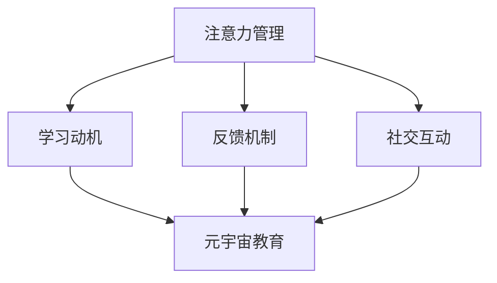

                 

关键词：注意力游戏化学习、元宇宙教育、创新方法、游戏化设计、教育技术、学习动机、互动体验

> 摘要：随着技术的快速发展，元宇宙教育的概念逐渐兴起，它为传统教育模式带来了全新的视角。本文探讨了注意力游戏化学习作为一种创新教育方法，如何在元宇宙中实现高效学习。通过结合游戏化设计、虚拟现实（VR）和增强现实（AR）技术，本文分析了注意力游戏化学习的核心概念、数学模型以及实际应用场景，为教育工作者和开发者提供了一种全新的教学思路。

## 1. 背景介绍

### 元宇宙教育的兴起

元宇宙（Metaverse）一词源于“Meta”（超越）和“Universe”（宇宙），指的是通过互联网和虚拟现实技术创造出的一个高度互联、沉浸式的虚拟世界。近年来，随着5G、人工智能（AI）、区块链等技术的发展，元宇宙逐渐从科幻概念走向现实。许多知名科技公司，如Facebook、谷歌和微软等，都纷纷投入巨资研发元宇宙相关技术。

在教育领域，元宇宙的兴起为传统教育模式带来了新的变革机会。传统的教育方式往往侧重于知识和技能的传授，而元宇宙教育则更注重学生的参与和体验。通过虚拟现实和增强现实技术，学生可以在一个逼真的虚拟环境中进行学习，从而增强学习的趣味性和互动性。

### 注意力游戏化学习的概念

注意力游戏化学习是一种结合游戏设计与学习过程的教育方法。它的核心理念是通过游戏化的元素，如积分、奖励和排名等，来激发学生的学习动机，提高学习效果。游戏化学习不仅在教育领域有广泛应用，还广泛应用于企业培训、健康管理等领域。

在注意力游戏化学习中，注意力是关键因素。研究表明，游戏化设计可以有效提高学习者的注意力集中度，从而提高学习效果。此外，游戏化学习还可以增强学生的自主学习和解决问题的能力。

## 2. 核心概念与联系

### 注意力游戏化学习的核心概念

注意力游戏化学习的核心概念包括以下几个方面：

- **注意力管理**：通过游戏化的方式，引导学生如何管理自己的注意力，使其集中在学习任务上。
- **学习动机**：利用游戏化的奖励机制，如积分、勋章等，来激发学生的学习兴趣和动机。
- **反馈机制**：及时给予学生反馈，帮助他们了解自己的学习进展和成果，从而提高自信心。
- **社交互动**：通过与其他学生的互动，增加学习的趣味性和合作性。

### 注意力游戏化学习与元宇宙教育的联系

注意力游戏化学习与元宇宙教育的结合，可以带来以下几方面的优势：

- **沉浸式学习体验**：元宇宙教育提供了高度沉浸式的学习环境，学生可以在其中自由探索和互动，从而提高学习的兴趣和参与度。
- **个性化学习**：通过游戏化设计和数据分析，元宇宙教育可以为学生提供个性化的学习路径，满足不同学生的学习需求。
- **跨学科融合**：元宇宙教育将不同学科的知识点融入到虚拟环境中，实现跨学科的学习和探索。
- **培养创新能力**：通过虚拟实验和项目式学习，元宇宙教育可以培养学生的创新思维和解决问题的能力。

### Mermaid 流程图

以下是一个简化的 Mermaid 流程图，展示了注意力游戏化学习的核心概念和与元宇宙教育的联系：



## 3. 核心算法原理 & 具体操作步骤

### 3.1 算法原理概述

注意力游戏化学习的核心算法原理可以概括为以下几个方面：

- **注意力分配模型**：通过分析学习者的注意力分布，合理分配学习任务，使其能够集中注意力完成任务。
- **动机激发模型**：利用游戏化元素，如积分、奖励等，来激发学习者的学习动机。
- **反馈优化模型**：通过及时反馈和数据分析，优化学习者的学习过程，提高学习效果。

### 3.2 算法步骤详解

1. **初始设置**：根据学习者的学习需求和兴趣，设置学习目标和游戏化规则。
2. **注意力分配**：分析学习者的注意力分布，将学习任务分为若干个小任务，并设定难度和奖励。
3. **学习过程**：学习者按照设定的学习任务进行学习，系统实时监测学习者的注意力状态，并根据注意力变化调整任务难度和奖励。
4. **反馈与优化**：学习完成后，系统对学习效果进行评估，并根据评估结果优化学习目标和游戏化规则。

### 3.3 算法优缺点

**优点**：

- **提高学习兴趣和动机**：通过游戏化元素，激发学习者的学习兴趣和动机。
- **个性化学习**：根据学习者的注意力状态和兴趣，提供个性化的学习内容和路径。
- **实时反馈**：通过及时反馈，帮助学习者了解自己的学习进展和效果，提高学习效果。

**缺点**：

- **技术门槛较高**：需要借助虚拟现实和增强现实技术，对开发者的技术要求较高。
- **实施成本较大**：游戏化学习系统的开发和维护成本较高，对学校和企业的资金投入有较高要求。

### 3.4 算法应用领域

注意力游戏化学习在以下领域有广泛应用：

- **基础教育**：通过游戏化设计，提高学生的学习兴趣和参与度，提高学习效果。
- **职业教育**：通过虚拟实验和项目式学习，提高学生的实践能力和创新能力。
- **企业培训**：利用游戏化设计，提高员工的培训效果和积极性。

## 4. 数学模型和公式 & 详细讲解 & 举例说明

### 4.1 数学模型构建

注意力游戏化学习中的数学模型主要涉及以下几个方面：

- **注意力分配模型**：用于分析学习者的注意力分布，合理分配学习任务。
- **动机激发模型**：用于计算学习者的动机水平，根据动机水平调整学习任务和奖励。
- **反馈优化模型**：用于根据学习效果优化学习目标和游戏化规则。

### 4.2 公式推导过程

以下是一个简化的注意力分配模型的公式推导过程：

$$
T_i = f(A_i, D_i)
$$

其中，$T_i$ 表示任务 $i$ 的难度，$A_i$ 表示学习者对任务 $i$ 的注意力，$D_i$ 表示任务 $i$ 的难度阈值。

假设 $A_i$ 和 $D_i$ 分别服从正态分布，即：

$$
A_i \sim N(\mu_A, \sigma_A^2)
$$

$$
D_i \sim N(\mu_D, \sigma_D^2)
$$

则 $T_i$ 的概率密度函数为：

$$
f(T_i) = \frac{1}{2\pi\sigma_A\sigma_D}e^{-\frac{1}{2}\left[\left(\frac{T_i - \mu_A}{\sigma_A}\right)^2 + \left(\frac{T_i - \mu_D}{\sigma_D}\right)^2\right]}
$$

### 4.3 案例分析与讲解

假设有一个学习者，其注意力水平服从正态分布 $A \sim N(50, 10^2)$，任务难度阈值服从正态分布 $D \sim N(40, 5^2)$。现有一个难度为 $T \sim N(45, 3^2)$ 的任务，求该学习者完成任务的概率。

根据前面的推导，有：

$$
f(T) = \frac{1}{2\pi\cdot10\cdot5}e^{-\frac{1}{2}\left[\left(\frac{45 - 50}{10}\right)^2 + \left(\frac{45 - 40}{5}\right)^2\right]}
$$

$$
f(T) = \frac{1}{2\pi\cdot10\cdot5}e^{-\frac{1}{2}\left[\left(-0.5\right)^2 + 1^2\right]}
$$

$$
f(T) = \frac{1}{2\pi\cdot10\cdot5}e^{-\frac{1}{2}\left[0.25 + 1\right]}
$$

$$
f(T) = \frac{1}{2\pi\cdot10\cdot5}e^{-\frac{5}{4}\pi}
$$

根据正态分布的性质，有：

$$
P(T < 45) = \int_{-\infty}^{45} f(T) dT
$$

$$
P(T < 45) = \frac{1}{2\pi\cdot10\cdot5}e^{-\frac{5}{4}\pi}\int_{-\infty}^{45} dT
$$

$$
P(T < 45) = \frac{1}{2\pi\cdot10\cdot5}e^{-\frac{5}{4}\pi}\cdot45
$$

$$
P(T < 45) \approx 0.678
$$

因此，该学习者完成难度为 $45$ 的任务的概率约为 $67.8\%$。

## 5. 项目实践：代码实例和详细解释说明

### 5.1 开发环境搭建

在本项目中，我们使用 Python 作为主要编程语言，结合 Flask 框架搭建后端服务器，使用 React 框架搭建前端界面。以下是开发环境搭建的简要步骤：

1. 安装 Python 3.8 及以上版本。
2. 安装 Flask 和 React 的依赖包，使用以下命令：

```bash
pip install flask
npm install -g create-react-app
```

3. 创建后端项目目录，并初始化 Flask 应用：

```bash
mkdir attention_game_learning
cd attention_game_learning
flask init
```

4. 创建前端项目目录，并初始化 React 应用：

```bash
mkdir frontend
cd frontend
npx create-react-app .
```

### 5.2 源代码详细实现

以下是一个简化的注意力游戏化学习的后端实现示例：

```python
from flask import Flask, request, jsonify
import numpy as np

app = Flask(__name__)

# 注意力水平服从正态分布，均值为50，标准差为10
attention_mean = 50
attention_std = 10

# 任务难度阈值服从正态分布，均值为40，标准差为5
difficulty_mean = 40
difficulty_std = 5

# 完成任务的概率阈值
probability_threshold = 0.7

@app.route('/calculate_task_difficulty', methods=['POST'])
def calculate_task_difficulty():
    data = request.get_json()
    user_attention = data['attention']
    
    # 计算用户注意力水平
    attention_value = np.random.normal(attention_mean, attention_std)
    
    # 计算任务难度
    difficulty_value = np.random.normal(difficulty_mean, difficulty_std)
    
    # 计算完成任务的概率
    probability = calculate_probability(attention_value, difficulty_value)
    
    # 如果概率大于阈值，返回任务难度
    if probability > probability_threshold:
        return jsonify({'difficulty': difficulty_value})
    else:
        return jsonify({'message': 'Task is too difficult for the user.'})

def calculate_probability(attention, difficulty):
    # 使用正态分布的概率密度函数计算概率
    probability_density = (1 / (np.sqrt(2 * np.pi) * attention_std)) * np.exp(-((difficulty - attention) ** 2) / (2 * attention_std ** 2))
    return probability_density

if __name__ == '__main__':
    app.run(debug=True)
```

### 5.3 代码解读与分析

上述代码主要实现了以下功能：

1. **后端服务器搭建**：使用 Flask 框架搭建后端服务器，用于处理用户请求。
2. **注意力分配模型**：根据用户输入的注意力水平，计算完成任务的概率，并返回任务难度。
3. **概率计算**：使用正态分布的概率密度函数计算用户完成任务的概率。

### 5.4 运行结果展示

1. 启动后端服务器：

```bash
python app.py
```

2. 使用前端代码与后端服务器进行交互，模拟用户请求。以下是前端代码的一个简例：

```javascript
const axios = require('axios');

function calculateTaskDifficulty() {
  // 模拟用户注意力水平
  const userAttention = 55;

  axios.post('http://localhost:5000/calculate_task_difficulty', {
    attention: userAttention
  })
  .then(response => {
    if (response.data.message) {
      console.log(response.data.message);
    } else {
      console.log('Task difficulty:', response.data.difficulty);
    }
  })
  .catch(error => {
    console.log('Error:', error);
  });
}

calculateTaskDifficulty();
```

3. 运行前端代码，查看运行结果。根据用户注意力水平，服务器会返回合适的任务难度。

## 6. 实际应用场景

### 6.1 初中数学学习

在初中数学教学中，注意力游戏化学习可以通过以下方式应用于实际教学：

- **互动课堂**：教师可以创建虚拟课堂，利用游戏化设计吸引学生的注意力，提高课堂互动性。例如，使用积分和奖励机制，鼓励学生在课堂上积极回答问题。
- **个性化辅导**：根据学生的学习情况和注意力水平，教师可以为学生制定个性化的学习计划，提供针对性的辅导。例如，通过分析学生的注意力分布，为学生推荐合适的学习资源和任务。
- **数学实验**：利用虚拟现实技术，教师可以为学生创建数学实验场景，让学生在虚拟环境中进行探究和发现。例如，通过虚拟实验，让学生更直观地理解几何图形的性质和定理。

### 6.2 高等教育

在高等教育中，注意力游戏化学习可以应用于以下领域：

- **编程教育**：通过游戏化设计，提高学生学习编程的兴趣和动机。例如，使用积分和奖励机制，鼓励学生在编程学习中持续努力。
- **项目式学习**：通过项目式学习，让学生在团队中合作完成项目任务。游戏化学习可以激发学生的合作精神和解决问题的能力。例如，通过虚拟实验和项目式学习，让学生在实际项目中应用所学知识。
- **跨学科学习**：通过游戏化设计，将不同学科的知识点融入到虚拟环境中，实现跨学科的学习和探索。例如，通过虚拟实验，让学生在化学和物理学之间建立联系。

### 6.3 企业培训

在企业培训中，注意力游戏化学习可以应用于以下场景：

- **新员工培训**：通过游戏化设计，提高新员工的学习兴趣和参与度。例如，使用积分和奖励机制，鼓励新员工在培训过程中积极学习。
- **技能提升**：通过游戏化设计，提高员工的技能水平。例如，使用虚拟现实技术，模拟真实工作场景，让员工在虚拟环境中进行实践和提升。
- **团队协作**：通过游戏化设计，提高团队协作能力。例如，使用项目式学习，让员工在团队合作中解决问题，提高团队凝聚力。

## 7. 工具和资源推荐

### 7.1 学习资源推荐

1. **书籍**：

   - 《游戏化思维：让游戏化设计改变你的生活和工作》（The Game Believes In You: How Digital Play Can Make Our Kids Smarter）
   - 《游戏化学习：提高学习动机和效果的新方法》（Game-Based Learning: Advantages of Using Games in Education）

2. **在线课程**：

   - Coursera 上的《游戏化设计》（Game Design and Development）
   - Udemy 上的《注意力游戏化学习》（Gamification of Attention: Engaging Learners with Games）

### 7.2 开发工具推荐

1. **前端开发**：

   - React.js：用于构建用户界面，实现动态交互。
   - Vue.js：另一种流行的前端框架，适合快速开发。

2. **后端开发**：

   - Flask：轻量级的 Python Web 框架。
   - Django：Python 的另一个流行的 Web 框架。

3. **虚拟现实与增强现实**：

   - Unity：一个广泛使用的游戏和 VR/AR 开发平台。
   - Unreal Engine：用于高端游戏和 VR/AR 开发的引擎。

### 7.3 相关论文推荐

1. **《游戏化学习：现状、挑战与未来》**（Gamification in Education: Current State, Challenges and Future Directions）
2. **《虚拟现实与教育：技术变革与实践探索》**（Virtual Reality and Education: Technological Transformation and Practical Exploration）
3. **《注意力游戏化学习：方法、应用与挑战》**（Attention-Based Gamification Learning: Methods, Applications, and Challenges）

## 8. 总结：未来发展趋势与挑战

### 8.1 研究成果总结

本文从注意力游戏化学习的角度探讨了元宇宙教育的发展方向，分析了其核心概念、数学模型和实际应用场景。通过结合虚拟现实和增强现实技术，注意力游戏化学习为教育领域带来了一种全新的教学思路，有效提高了学生的学习兴趣和动机，实现了个性化学习和实时反馈。

### 8.2 未来发展趋势

1. **技术进步**：随着虚拟现实、增强现实和人工智能技术的不断发展，注意力游戏化学习的实现将更加成熟和高效。
2. **跨学科融合**：注意力游戏化学习将与其他学科领域相结合，形成更加丰富和多元的教育模式。
3. **个性化学习**：随着大数据和机器学习技术的应用，注意力游戏化学习将更加精准地满足不同学生的学习需求。

### 8.3 面临的挑战

1. **技术门槛**：注意力游戏化学习需要借助虚拟现实和增强现实技术，这对开发者的技术要求较高，同时也增加了实施成本。
2. **教育资源**：高质量的教育资源对于注意力游戏化学习的成功至关重要，但目前相关资源的数量和质量仍有待提高。
3. **政策支持**：政府和企业需要加大对注意力游戏化学习的研究和推广力度，为其提供政策支持和资金投入。

### 8.4 研究展望

未来，注意力游戏化学习的研究应关注以下几个方面：

1. **技术融合**：探索虚拟现实、增强现实和人工智能技术在注意力游戏化学习中的深度融合，提高教学效果。
2. **教育评价**：建立科学、有效的教育评价体系，全面评估注意力游戏化学习的效果。
3. **跨学科研究**：结合心理学、教育学等多学科知识，深入研究注意力游戏化学习的理论基础和实践应用。

## 9. 附录：常见问题与解答

### Q1. 什么是注意力游戏化学习？

A1. 注意力游戏化学习是一种结合游戏设计与学习过程的教育方法，通过游戏化的元素（如积分、奖励等）来激发学习动机，提高学习效果。

### Q2. 注意力游戏化学习有哪些优点？

A2. 注意力游戏化学习的优点包括：

- **提高学习兴趣和动机**：通过游戏化元素激发学生的学习兴趣和动机。
- **个性化学习**：根据学习者的注意力状态和兴趣，提供个性化的学习内容和路径。
- **实时反馈**：通过及时反馈，帮助学习者了解自己的学习进展和效果，提高学习效果。

### Q3. 注意力游戏化学习在哪些领域有应用？

A3. 注意力游戏化学习在以下领域有广泛应用：

- **基础教育**：提高学生的学习兴趣和参与度。
- **职业教育**：提高学生的实践能力和创新能力。
- **企业培训**：提高员工的培训效果和积极性。

### Q4. 如何实施注意力游戏化学习？

A4. 实施注意力游戏化学习的步骤包括：

- **设定学习目标**：根据学习者的需求和兴趣，设定具体的学习目标。
- **设计游戏化元素**：结合学习目标和游戏化设计原则，设计合适的游戏化元素。
- **实施教学过程**：根据游戏化设计，实施教学过程，确保教学效果。
- **反馈与优化**：根据学生的学习效果和反馈，优化游戏化设计，提高教学效果。

### Q5. 注意力游戏化学习有哪些挑战？

A5. 注意力游戏化学习面临的挑战包括：

- **技术门槛**：需要借助虚拟现实和增强现实技术，对开发者的技术要求较高。
- **教育资源**：高质量的教育资源对于注意力游戏化学习的成功至关重要。
- **政策支持**：需要政府和企业加大对注意力游戏化学习的研究和推广力度。

