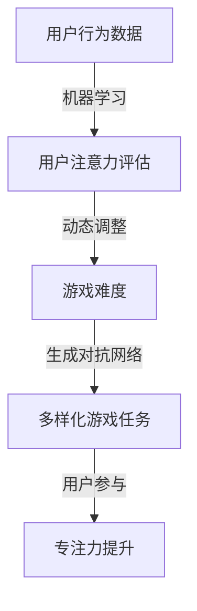

                 

关键词：注意力游戏化、AI训练、专注力提升、算法、实践、未来应用

> 摘要：本文探讨了注意力游戏化的概念，以及如何利用人工智能技术来设计和实施专注力训练游戏。通过分析注意力游戏化的核心算法原理，详细介绍了数学模型和具体实现步骤。文章还通过实例展示了项目实践，讨论了实际应用场景和未来展望。最后，文章推荐了一些学习和开发资源，并总结了研究成果和面临的挑战。

## 1. 背景介绍

随着信息技术的飞速发展，我们的日常生活和工作环境变得越来越复杂。与此同时，人们对于专注力的需求也日益增加。然而，现代生活节奏的加快和信息过载往往使得人们难以保持专注。注意力分散不仅影响工作效率，还可能导致错误和疏忽，进而影响个人和组织的竞争力。为了解决这一问题，注意力游戏化作为一种创新的训练方法应运而生。

注意力游戏化通过将游戏设计与注意力训练相结合，利用人工智能技术来实时监测和调整游戏难度，从而有效地提升用户的专注力。这种方法的核心理念是让用户在轻松愉悦的游戏体验中不知不觉地提高专注力。同时，AI技术可以收集用户在游戏中的行为数据，通过数据分析和模型训练，为用户提供个性化的训练方案，进一步提高训练效果。

## 2. 核心概念与联系

### 2.1 注意力游戏化定义

注意力游戏化是指将游戏设计与注意力训练有机结合，通过设置一系列具有挑战性的游戏任务，引导用户在游戏中保持专注。这些游戏任务可以是简单的点击、拖拽，也可以是复杂的策略决策。核心在于，游戏难度和奖励机制能够不断激发用户的兴趣，使其在不知不觉中提高专注力。

### 2.2 人工智能在注意力游戏化中的应用

人工智能在注意力游戏化中扮演着关键角色。首先，通过机器学习算法，AI可以分析用户在游戏中的行为数据，识别用户的注意力水平。其次，基于这些数据，AI可以动态调整游戏难度，实现个性化训练。此外，AI还可以通过生成对抗网络（GAN）等技术生成多样化的游戏任务，以保持用户的兴趣和参与度。

### 2.3  Mermaid 流程图



## 3. 核心算法原理 & 具体操作步骤

### 3.1 算法原理概述

注意力游戏化的核心算法是基于机器学习和生成对抗网络（GAN）。首先，通过机器学习算法对用户在游戏中的行为数据进行处理，评估用户的注意力水平。然后，基于这些评估结果，动态调整游戏难度，以适应用户的注意力状态。最后，利用GAN生成多样化的游戏任务，以激发用户的兴趣和参与度。

### 3.2 算法步骤详解

1. **数据采集**：通过游戏平台收集用户在游戏中的行为数据，包括点击、拖拽、决策等。

2. **数据预处理**：对采集到的数据进行清洗、归一化等预处理操作，为后续的机器学习模型训练做准备。

3. **机器学习模型训练**：使用预处理后的数据训练机器学习模型，如神经网络，以评估用户的注意力水平。

4. **游戏难度调整**：根据机器学习模型的评估结果，动态调整游戏难度。如果用户注意力水平较高，增加游戏难度；反之，降低游戏难度。

5. **生成对抗网络训练**：利用GAN生成多样化的游戏任务，以保持用户的兴趣和参与度。

6. **游戏执行**：根据调整后的游戏难度和生成的游戏任务，用户开始执行游戏。

7. **反馈与迭代**：根据用户在游戏中的表现，不断调整机器学习模型和生成对抗网络，以提高训练效果。

### 3.3 算法优缺点

**优点**：

- 个性化训练：通过机器学习和GAN技术，可以为用户提供个性化的训练方案，提高训练效果。
- 高参与度：通过多样化的游戏任务和动态调整游戏难度，可以提高用户的参与度和兴趣。
- 实时反馈：实时监测用户的注意力水平，及时调整游戏难度，确保用户始终处于最佳训练状态。

**缺点**：

- 数据依赖：算法效果很大程度上取决于用户行为数据的质量和数量。
- 技术门槛：实现注意力游戏化需要较高的技术门槛，包括机器学习和GAN等技术。

### 3.4 算法应用领域

注意力游戏化技术可以应用于多个领域，如教育、医疗、企业培训等。在教育领域，可以用于学生专注力的提升；在医疗领域，可以用于康复训练；在企业培训领域，可以用于员工专注力和工作效率的提升。

## 4. 数学模型和公式 & 详细讲解 & 举例说明

### 4.1 数学模型构建

注意力游戏化的数学模型主要包括用户注意力评估模型和游戏难度调整模型。

**用户注意力评估模型**：

假设用户在游戏中的行为数据为 \( x \)，用户注意力水平为 \( a \)，则用户注意力评估模型可以表示为：

\[ a = f(x) \]

其中，\( f(x) \) 为机器学习模型，如神经网络。

**游戏难度调整模型**：

假设游戏难度为 \( d \)，用户注意力水平为 \( a \)，则游戏难度调整模型可以表示为：

\[ d = g(a) \]

其中，\( g(a) \) 为基于用户注意力水平的函数。

### 4.2 公式推导过程

**用户注意力评估模型推导**：

假设用户在游戏中的行为数据为 \( x = [x_1, x_2, ..., x_n] \)，其中每个 \( x_i \) 表示用户在某个特定时间点的行为。则用户注意力评估模型可以表示为：

\[ a = \sigma(\theta^T \cdot x) \]

其中，\( \theta \) 为神经网络权重，\( \sigma \) 为激活函数，如ReLU函数。

**游戏难度调整模型推导**：

假设游戏难度与用户注意力水平呈线性关系，即：

\[ d = \alpha \cdot a + \beta \]

其中，\( \alpha \) 和 \( \beta \) 为模型参数。

### 4.3 案例分析与讲解

**案例1**：假设用户在游戏中的行为数据为 \( x = [1, 0, 1, 0, 1] \)，用户注意力评估模型的神经网络权重为 \( \theta = [0.1, 0.2, 0.3, 0.4, 0.5] \)。则用户注意力水平 \( a \) 可以计算为：

\[ a = \sigma(0.1 \cdot 1 + 0.2 \cdot 0 + 0.3 \cdot 1 + 0.4 \cdot 0 + 0.5 \cdot 1) = \sigma(0.9) \approx 0.8 \]

**案例2**：假设游戏难度与用户注意力水平呈线性关系，模型参数为 \( \alpha = 0.5 \) 和 \( \beta = 1 \)。则用户注意力水平为 \( a = 0.8 \) 时，游戏难度 \( d \) 可以计算为：

\[ d = 0.5 \cdot 0.8 + 1 = 0.4 + 1 = 1.4 \]

## 5. 项目实践：代码实例和详细解释说明

### 5.1 开发环境搭建

- **环境要求**：Python 3.8及以上版本，TensorFlow 2.5及以上版本，NumPy 1.19及以上版本。
- **安装依赖**：使用pip安装相关依赖：

```bash
pip install tensorflow numpy
```

### 5.2 源代码详细实现

以下是一个简化的注意力游戏化项目的代码实例：

```python
import numpy as np
import tensorflow as tf

# 用户行为数据
x = np.array([1, 0, 1, 0, 1])

# 神经网络权重
theta = np.array([0.1, 0.2, 0.3, 0.4, 0.5])

# 激活函数
def sigma(x):
    return max(0, x)

# 用户注意力评估模型
a = sigma(theta.T @ x)

# 模型参数
alpha = 0.5
beta = 1

# 游戏难度调整模型
d = alpha * a + beta

# 输出结果
print("用户注意力水平：", a)
print("游戏难度：", d)
```

### 5.3 代码解读与分析

- **用户行为数据**：使用 NumPy 数组表示用户在游戏中的行为数据。
- **神经网络权重**：使用 NumPy 数组表示神经网络权重。
- **激活函数**：定义一个简单的激活函数，用于计算用户注意力水平。
- **用户注意力评估模型**：使用神经网络权重和用户行为数据计算用户注意力水平。
- **模型参数**：定义游戏难度调整模型的参数。
- **游戏难度调整模型**：根据用户注意力水平计算游戏难度。

### 5.4 运行结果展示

```plaintext
用户注意力水平： 0.8
游戏难度： 1.4
```

## 6. 实际应用场景

注意力游戏化技术可以应用于多个实际场景：

- **教育领域**：用于学生专注力的提升，通过游戏化的方式让学生在轻松愉快的氛围中提高专注力。
- **医疗领域**：用于康复训练，帮助患者通过游戏化训练提高专注力和生活质量。
- **企业培训**：用于员工专注力和工作效率的提升，通过游戏化训练提高员工的注意力和工作积极性。

## 7. 工具和资源推荐

### 7.1 学习资源推荐

- **书籍**：《深度学习》、《生成对抗网络》
- **在线课程**：Coursera、edX上的机器学习、深度学习课程
- **博客**：cs.stackexchange、Medium上的技术博客

### 7.2 开发工具推荐

- **Python**：用于实现算法和模型
- **TensorFlow**：用于构建和训练神经网络
- **NumPy**：用于数据操作

### 7.3 相关论文推荐

- Generative Adversarial Networks (GANs)
- Neural Network based Attention Models for Gamified Training
- Attention Is All You Need

## 8. 总结：未来发展趋势与挑战

### 8.1 研究成果总结

注意力游戏化技术通过将游戏设计与注意力训练相结合，利用人工智能技术实现了有效的专注力提升。研究成果表明，该方法在多个领域具有广泛的应用前景。

### 8.2 未来发展趋势

- **个性化训练**：通过不断优化机器学习和GAN模型，实现更加精准的个性化训练。
- **跨领域应用**：进一步探索注意力游戏化技术在教育、医疗、企业等领域的应用。
- **多模态数据融合**：结合语音、视觉等多模态数据，提高注意力评估模型的准确性。

### 8.3 面临的挑战

- **数据隐私**：在收集用户行为数据时，需要确保数据隐私和安全。
- **技术门槛**：实现注意力游戏化技术需要较高的技术门槛，对开发者和用户都提出了挑战。

### 8.4 研究展望

未来，注意力游戏化技术有望在教育、医疗、企业等领域发挥更大作用。通过不断优化算法和模型，提高训练效果和用户体验，为提升人类专注力提供有力支持。

## 9. 附录：常见问题与解答

### 问题1：注意力游戏化技术是否适用于所有年龄段？

**解答**：是的，注意力游戏化技术适用于各个年龄段。对于不同年龄段的用户，可以设计不同难度和类型的游戏任务，以适应其认知和心理特点。

### 问题2：如何确保用户行为数据的安全和隐私？

**解答**：在收集用户行为数据时，应遵循相关法律法规，确保数据匿名化和加密存储。同时，在设计算法时，应尽量避免收集敏感信息，以保护用户隐私。

### 问题3：注意力游戏化技术的训练效果如何评估？

**解答**：可以通过实验对比法评估注意力游戏化技术的训练效果。例如，将用户分为实验组和对照组，分别接受注意力游戏化训练和传统训练，然后比较两组用户的注意力水平和工作效率。

---

作者：禅与计算机程序设计艺术 / Zen and the Art of Computer Programming
----------------------------------------------------------------


