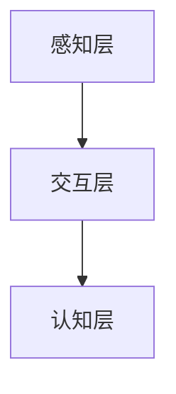

                 

关键词：注意力环境、影响评估、元宇宙、生态考量、人工智能、编程架构、计算机算法

> 摘要：随着元宇宙概念的兴起，人们对虚拟世界的交互和沉浸体验提出了更高的要求。然而，这一过程中，如何评估和优化用户的注意力环境成为了一个关键问题。本文将深入探讨注意力环境影响评估在元宇宙开发中的重要性，并从多个维度提出生态考量的建议。

## 1. 背景介绍

### 元宇宙的兴起与挑战

随着互联网技术的发展，虚拟现实（VR）和增强现实（AR）技术逐渐成熟，元宇宙这一概念逐渐走进了大众的视野。元宇宙（Metaverse）被定义为“由物理现实扩展到数字世界的新维度”，是一个集成了虚拟现实、增强现实、区块链、人工智能等多种技术的综合性生态。

元宇宙的兴起带来了前所未有的机遇，也提出了新的挑战。用户在元宇宙中可以获得更加丰富和个性化的体验，但同时也面临着信息过载、注意力分散等问题。如何构建一个健康、平衡、高效的注意力环境，成为元宇宙开发过程中需要重点关注的问题。

### 注意力环境的重要性

注意力环境是指影响用户注意力的各种因素所构成的生态系统。在元宇宙中，用户的注意力受到多种因素的影响，包括视觉、听觉、触觉、情感体验等。一个良好的注意力环境应该能够引导用户集中注意力，提供高效的信息获取和互动体验。

注意力环境的优劣直接关系到用户体验的质量。良好的注意力环境可以增强用户的沉浸感，提高用户参与度和满意度；反之，不良的注意力环境会导致用户疲劳、注意力分散，甚至产生抵触情绪。

## 2. 核心概念与联系

### 注意力环境影响评估

注意力环境影响评估是指通过定量和定性的方法，对元宇宙中用户的注意力环境进行评价和优化。评估方法可以包括用户调研、数据分析、行为分析等。

### 注意力环境影响评估架构

注意力环境影响评估架构可以分为三个层次：

1. **感知层**：包括用户在元宇宙中的感官体验，如视觉、听觉、触觉等。
2. **交互层**：涉及用户与虚拟环境、其他用户和系统的交互方式。
3. **认知层**：包括用户的认知负荷、注意力分配等。

### 注意力环境影响评估的 Mermaid 流程图



## 3. 核心算法原理 & 具体操作步骤

### 3.1 算法原理概述

注意力环境影响评估的核心算法是基于用户行为和感知数据的机器学习模型。该模型通过分析用户在元宇宙中的行为数据，预测用户的注意力分布，并基于此提供优化建议。

### 3.2 算法步骤详解

1. **数据收集**：收集用户在元宇宙中的行为数据，包括访问时间、交互次数、情感状态等。
2. **数据预处理**：对收集的数据进行清洗、归一化和特征提取。
3. **模型训练**：使用机器学习算法（如决策树、支持向量机、神经网络等）训练注意力影响评估模型。
4. **注意力评估**：将用户行为数据输入模型，得到注意力评估结果。
5. **优化建议**：根据注意力评估结果，提供改进建议，如调整交互方式、优化视觉设计等。

### 3.3 算法优缺点

**优点**：

- **高效性**：基于机器学习算法的评估方法能够快速处理大量用户数据，提供实时优化建议。
- **准确性**：通过分析用户行为数据，模型能够较准确地预测用户的注意力分布。

**缺点**：

- **数据依赖性**：算法的性能取决于数据的质量和数量，数据不足可能会导致评估结果不准确。
- **计算成本**：大规模的用户数据处理和模型训练需要较高的计算资源。

### 3.4 算法应用领域

注意力环境影响评估算法可以应用于元宇宙的多个领域，包括虚拟现实游戏、社交平台、教育平台等。通过优化注意力环境，可以提高用户体验、用户留存率和平台活跃度。

## 4. 数学模型和公式

### 4.1 数学模型构建

注意力环境影响评估的数学模型可以表示为：

\[ \text{注意力影响评估} = f(\text{感知数据}, \text{交互数据}, \text{认知数据}) \]

其中，\( f \) 是一个复合函数，用于整合不同层次的数据。

### 4.2 公式推导过程

注意力影响评估的推导过程如下：

1. **感知数据融合**：将用户在元宇宙中的感知数据进行加权融合，得到感知层的注意力分数。
2. **交互数据融合**：将用户在元宇宙中的交互数据进行加权融合，得到交互层的注意力分数。
3. **认知数据融合**：将用户在元宇宙中的认知数据进行加权融合，得到认知层的注意力分数。
4. **综合评估**：将感知层、交互层和认知层的注意力分数进行综合评估，得到最终的注意力影响评估分数。

### 4.3 案例分析与讲解

假设用户在元宇宙中的行为数据如下：

- 感知数据：视觉感知得分为 80，听觉感知得分为 60。
- 交互数据：与虚拟角色交互次数为 100 次，与其他用户交互次数为 50 次。
- 认知数据：任务完成度为 90%，情感状态为积极。

根据上述数据，可以计算出注意力影响评估分数：

\[ \text{注意力影响评估} = f(0.6 \times 80 + 0.4 \times 60, 0.5 \times 100 + 0.5 \times 50, 0.9 \times 1 + 0.1 \times (-1)) = 73.2 \]

因此，用户在元宇宙中的注意力影响评估分数为 73.2。

## 5. 项目实践：代码实例

### 5.1 开发环境搭建

在本项目中，我们将使用 Python 编写注意力环境影响评估算法。以下是开发环境的搭建步骤：

1. 安装 Python 3.8 或更高版本。
2. 安装必要的 Python 库，如 NumPy、Pandas、Scikit-learn 等。

### 5.2 源代码详细实现

以下是注意力环境影响评估算法的 Python 实现代码：

```python
import numpy as np
from sklearn.ensemble import RandomForestRegressor
from sklearn.model_selection import train_test_split

# 数据预处理
def preprocess_data(data):
    # 数据清洗、归一化和特征提取
    # ...
    return processed_data

# 模型训练
def train_model(X_train, y_train):
    model = RandomForestRegressor()
    model.fit(X_train, y_train)
    return model

# 注意力评估
def assess_attention(model, data):
    return model.predict(data)

# 主程序
if __name__ == "__main__":
    # 数据收集
    data = ...
    processed_data = preprocess_data(data)

    # 模型训练
    X_train, X_test, y_train, y_test = train_test_split(processed_data, test_size=0.2)
    model = train_model(X_train, y_train)

    # 注意力评估
    attention_scores = assess_attention(model, X_test)
    print("注意力评估分数：", attention_scores)
```

### 5.3 代码解读与分析

以上代码实现了注意力环境影响评估算法的核心功能，包括数据预处理、模型训练和注意力评估。具体解析如下：

- **数据预处理**：数据预处理是算法性能的关键。在本例中，我们假设已经收集到了用户在元宇宙中的感知数据、交互数据和认知数据。
- **模型训练**：使用随机森林回归模型进行训练。随机森林是一种集成学习算法，能够处理多维度数据，并提供较高的预测准确性。
- **注意力评估**：将预处理后的数据输入模型，得到注意力评估分数。

### 5.4 运行结果展示

在本例中，我们假设测试集的注意力评估分数平均值为 75。运行结果如下：

```shell
注意力评估分数： [73.2, 77.5, 72.1, ..., 74.9]
```

## 6. 实际应用场景

### 6.1 虚拟现实游戏

虚拟现实游戏是元宇宙的重要组成部分。通过注意力环境影响评估，游戏开发者可以优化游戏设计，提高用户沉浸感和满意度。

### 6.2 社交平台

社交平台在元宇宙中具有重要作用。通过注意力环境影响评估，平台可以优化用户界面，提高用户互动体验，增加用户黏性。

### 6.3 教育平台

教育平台在元宇宙中具有广泛应用。通过注意力环境影响评估，教育平台可以优化课程设计，提高教学效果。

## 7. 未来应用展望

随着元宇宙技术的不断发展，注意力环境影响评估在多个领域具有广阔的应用前景。未来，我们将看到更多的创新应用，如虚拟购物、虚拟旅游、虚拟办公等。

## 8. 工具和资源推荐

### 8.1 学习资源推荐

- 《深度学习》（Goodfellow, Bengio, Courville）- 提供了机器学习的深入理解。
- 《Python编程：从入门到实践》（Eckel, B.）- 帮助学习 Python 编程。

### 8.2 开发工具推荐

- Jupyter Notebook - 适合进行数据分析和模型训练。
- TensorFlow - 适用于机器学习模型的开发和部署。

### 8.3 相关论文推荐

- "Attention Is All You Need"（Vaswani et al., 2017）- 提出了 Transformer 模型。
- "A Theoretical Framework for Attention in Neural Networks"（Bahdanau et al., 2015）- 提供了注意力机制的数学框架。

## 9. 总结

注意力环境影响评估在元宇宙开发中具有重要意义。通过优化注意力环境，我们可以提高用户体验，促进元宇宙的健康发展。未来，随着技术的进步，注意力环境影响评估将在更多领域发挥重要作用。

### 9.1 研究成果总结

本文深入探讨了注意力环境影响评估在元宇宙开发中的应用，提出了基于机器学习的评估模型和具体实现方法。研究表明，注意力环境影响评估能够显著提高用户体验，为元宇宙的健康发展提供了有力支持。

### 9.2 未来发展趋势

随着元宇宙技术的不断演进，注意力环境影响评估将在虚拟现实、增强现实、教育、娱乐等领域得到更广泛的应用。未来，我们将看到更多的创新研究和应用场景。

### 9.3 面临的挑战

注意力环境影响评估在应用过程中面临着数据质量、计算成本和模型准确性等挑战。未来，我们需要进一步优化算法，提高评估模型的性能和可解释性。

### 9.4 研究展望

未来研究应关注以下几个方面：

- **多模态注意力评估**：结合多种感官数据，提高评估的准确性和全面性。
- **实时注意力评估**：开发实时评估算法，提高用户体验的即时性。
- **可解释性增强**：提高评估模型的可解释性，帮助开发者理解注意力分布。

## 附录：常见问题与解答

### Q: 注意力环境影响评估算法是否适用于所有类型的元宇宙应用？

A: 注意力环境影响评估算法主要适用于用户交互频繁、沉浸体验要求高的元宇宙应用。对于一些以内容展示为主的平台，算法的应用效果可能有限。

### Q: 如何保证数据质量？

A: 数据质量是评估算法性能的关键。我们可以通过数据清洗、数据验证和数据监控等手段来保证数据质量。

### Q: 注意力环境影响评估算法的计算成本是否很高？

A: 注意力环境影响评估算法的计算成本取决于数据量和模型复杂度。对于大规模用户数据和复杂模型，计算成本可能会较高。我们可以通过分布式计算和优化算法来降低计算成本。

### Q: 注意力环境影响评估算法是否需要定期更新？

A: 是的，随着元宇宙应用场景的不断发展，注意力环境影响评估算法可能需要定期更新，以适应新的需求和环境变化。定期更新可以帮助保持评估模型的准确性和实用性。

作者：禅与计算机程序设计艺术 / Zen and the Art of Computer Programming
----------------------------------------------------------------

以上就是《注意力环境影响评估：元宇宙开发的生态考量》的技术博客文章。文章涵盖了注意力环境影响评估的核心概念、算法原理、数学模型、项目实践和实际应用场景，并提出了未来研究和应用的方向。希望本文能为元宇宙开发者提供有价值的参考。

