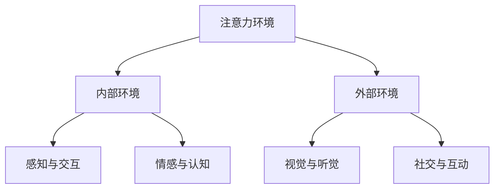

                 

关键词：注意力环境，元宇宙，环境评估，生态考量，技术影响，人机交互

> 摘要：本文旨在探讨元宇宙开发过程中，注意力环境对人类行为和生态的影响。通过分析注意力环境的概念及其在元宇宙中的实现方式，本文提出了注意力环境影响评估的方法，并探讨了其对元宇宙开发的生态考量。

## 1. 背景介绍

随着虚拟现实（VR）和增强现实（AR）技术的不断发展，元宇宙（Metaverse）逐渐成为了科技领域的热门话题。元宇宙是一个由虚拟世界和物理世界交互融合而成的数字空间，用户可以在其中进行各种活动，如社交、工作、娱乐等。然而，元宇宙的开发和运营不仅涉及到技术层面的挑战，还涉及到人类行为和社会生态的影响。

注意力环境是元宇宙中一个重要的概念，它描述了用户在虚拟世界中与其他实体（如人物、物品、场景等）交互时所处的环境。注意力环境对用户的行为和体验有着重要的影响，它不仅影响着用户在元宇宙中的行为方式，还可能对人类的心理健康和社会生态产生深远的影响。

本文将从注意力环境的概念出发，分析其在元宇宙中的实现方式，并提出注意力环境影响评估的方法，以期为元宇宙的开发和运营提供生态考量。

## 2. 核心概念与联系

### 2.1 注意力环境的概念

注意力环境是指用户在虚拟世界中，对周围环境和交互对象进行认知和反应的情境。它涉及到用户的感官体验、情感状态、认知过程等多个方面。注意力环境可以分为内部环境和外部环境两部分。

- **内部环境**：指的是用户在虚拟世界中的心理状态，包括注意力水平、情绪状态、认知负荷等。
- **外部环境**：指的是用户在虚拟世界中的物理环境和社交环境，包括虚拟世界中的物体、场景、人物等。

### 2.2 注意力环境的实现方式

在元宇宙中，注意力环境的实现主要通过以下几个方面：

- **感知与交互**：用户通过VR头戴设备、手柄等硬件设备感知虚拟世界，并通过这些设备与虚拟世界进行交互。
- **视觉与听觉**：通过图形渲染技术和音频处理技术，为用户提供逼真的视觉和听觉体验。
- **情感与认知**：通过情感计算和认知模拟技术，使虚拟世界中的角色和场景能够根据用户的情感和认知状态进行动态调整。
- **社交与互动**：通过社交网络和互动系统，为用户提供与其他用户和虚拟角色进行交流和互动的环境。

### 2.3 注意力环境与人类行为和社会生态的联系

注意力环境对人类行为和社会生态的影响主要体现在以下几个方面：

- **行为模式**：注意力环境会影响用户在元宇宙中的行为模式，如社交行为、消费行为、工作方式等。
- **心理健康**：长时间处于注意力环境可能会导致用户产生焦虑、疲劳等心理问题。
- **社会生态**：注意力环境可能会改变人类社会的结构和模式，影响人与人之间的社交关系和互动方式。

为了更好地理解注意力环境的影响，我们使用Mermaid流程图来展示其概念和实现方式。



## 3. 核心算法原理 & 具体操作步骤

### 3.1 算法原理概述

注意力环境影响评估的核心算法是基于用户行为数据和环境数据的分析，通过机器学习技术对注意力环境进行建模，并预测其对用户行为和心理健康的影响。算法的主要步骤包括：

1. 数据收集与预处理：收集用户在元宇宙中的行为数据和环境数据，并进行数据清洗和预处理。
2. 特征提取：从原始数据中提取与注意力环境相关的特征，如用户活跃度、交互频率、情感状态等。
3. 模型训练：使用机器学习算法对特征进行建模，训练注意力环境影响预测模型。
4. 模型评估与优化：对训练好的模型进行评估，并根据评估结果进行优化。
5. 预测与反馈：使用模型对新的用户行为数据和环境数据进行分析，预测注意力环境的影响，并提供反馈和建议。

### 3.2 算法步骤详解

#### 3.2.1 数据收集与预处理

数据收集主要涉及到用户在元宇宙中的行为数据和环境数据。行为数据包括用户的交互记录、活动日志等，环境数据包括虚拟世界中的物体、场景、人物等信息。

在数据预处理阶段，首先对原始数据进行清洗，去除重复、缺失和异常数据。然后对数据进行标准化处理，将其转换为适合机器学习算法的特征向量。

#### 3.2.2 特征提取

特征提取是算法的关键步骤，其主要任务是从原始数据中提取与注意力环境相关的特征。常见的特征提取方法包括：

- **行为特征**：如用户在元宇宙中的活跃度、交互频率、活动类型等。
- **情感特征**：如用户在虚拟世界中的情感状态，可以通过情感计算技术进行分析。
- **环境特征**：如虚拟世界中的物体、场景、人物等信息，可以通过图像处理和自然语言处理技术进行提取。

#### 3.2.3 模型训练

在模型训练阶段，使用机器学习算法对特征进行建模。常用的算法包括决策树、支持向量机、神经网络等。具体选择哪种算法，需要根据实际情况和特征数据的特点进行选择。

#### 3.2.4 模型评估与优化

模型评估与优化是确保模型性能的重要环节。常用的评估指标包括准确率、召回率、F1值等。根据评估结果，可以对模型进行优化，如调整参数、增加特征等。

#### 3.2.5 预测与反馈

在模型训练完成后，可以使用模型对新的用户行为数据和环境数据进行分析，预测注意力环境的影响。根据预测结果，可以提供相应的反馈和建议，如调整虚拟世界的环境设置、提醒用户注意心理健康等。

### 3.3 算法优缺点

#### 优点：

- **高效性**：算法基于用户行为数据和环境数据进行分析，能够快速预测注意力环境的影响。
- **灵活性**：算法可以根据不同的特征数据和环境数据，调整模型结构和参数，适应不同的应用场景。
- **普适性**：算法适用于多种元宇宙应用场景，如社交、工作、娱乐等。

#### 缺点：

- **数据依赖性**：算法的性能取决于数据质量和数量，数据不足或质量较差可能会导致预测不准确。
- **隐私风险**：用户行为数据可能涉及个人隐私，需要确保数据的安全性和隐私性。

### 3.4 算法应用领域

注意力环境影响评估算法可以应用于元宇宙的多个领域，如：

- **心理健康监测**：通过对用户在元宇宙中的行为和情感状态进行分析，预测用户的心理健康状态，并提供相应的干预措施。
- **社交互动优化**：通过分析用户在元宇宙中的社交行为，优化社交互动体验，提高用户满意度。
- **虚拟世界设计**：根据用户行为数据和环境数据，设计更符合用户需求的虚拟世界。

## 4. 数学模型和公式 & 详细讲解 & 举例说明

### 4.1 数学模型构建

在注意力环境影响评估中，我们可以构建一个基于贝叶斯网络的多层感知机（MLP）模型。贝叶斯网络可以用来表示用户行为和环境因素之间的概率关系，而多层感知机则用于对用户行为进行分类和预测。

贝叶斯网络的构建如下：

- **节点定义**：定义用户行为（X）、环境因素（Y）和注意力影响（Z）三个节点。
- **概率分布**：为每个节点定义条件概率分布，如P(Z|X, Y)表示在给定用户行为和环境因素的条件下，注意力影响的概率。

多层感知机的构建如下：

- **输入层**：包括用户行为和环境因素的特征向量。
- **隐藏层**：通过激活函数对输入层进行变换，提取特征。
- **输出层**：对隐藏层进行分类和预测。

### 4.2 公式推导过程

在贝叶斯网络的构建中，我们可以使用条件概率公式进行推导：

- **P(Z|X, Y)**：在给定用户行为和环境因素的条件下，注意力影响的概率。
- **P(X, Y, Z)**：用户行为、环境因素和注意力影响的联合概率。

通过贝叶斯定理，我们可以得到：

$$ P(Z|X, Y) = \frac{P(X, Y|Z)P(Z)}{P(X, Y)} $$

其中，P(Z)是注意力影响的全局概率，P(X, Y|Z)是在给定注意力影响的条件下，用户行为和环境因素的条件概率。

在多层感知机的构建中，我们可以使用以下公式：

- **隐藏层输出**：$$ h_{ij} = \sum_{k=1}^{n} w_{ik}x_{k} + b_{i} $$
- **激活函数**：$$ a_{ij} = \sigma(h_{ij}) $$

其中，$ h_{ij} $ 是第 $ i $ 个神经元在隐藏层第 $ j $ 个节点上的输入，$ w_{ik} $ 是连接输入层和隐藏层的权重，$ b_{i} $ 是隐藏层第 $ i $ 个节点的偏置，$ \sigma $ 是激活函数。

输出层的输出可以表示为：

$$ y_{j} = \sum_{i=1}^{m} w_{ij}a_{ij} + b_{j} $$

其中，$ y_{j} $ 是输出层第 $ j $ 个节点的输出，$ w_{ij} $ 是连接隐藏层和输出层的权重，$ b_{j} $ 是输出层第 $ j $ 个节点的偏置。

### 4.3 案例分析与讲解

假设我们有一个用户在元宇宙中的行为数据集，包括用户在虚拟世界中的交互频率（X1）、情感状态（X2）和环境复杂度（X3）。我们需要使用注意力环境影响评估算法预测用户在虚拟世界中的注意力水平（Z）。

首先，我们需要收集并预处理这些数据，然后使用贝叶斯网络和多层感知机模型进行训练。假设我们已经训练好了模型，现在需要预测一个新用户的注意力水平。

给定新用户的交互频率（X1 = 10）、情感状态（X2 = 0.8）和环境复杂度（X3 = 0.6），我们可以使用贝叶斯网络和多层感知机模型进行预测。

1. **贝叶斯网络预测**：

   - **条件概率计算**：

     $$ P(Z=高|X1=10, X2=0.8, X3=0.6) = \frac{P(X1=10, X2=0.8, X3=0.6|Z=高)P(Z=高)}{P(X1=10, X2=0.8, X3=0.6)} $$

     假设我们已知：

     $$ P(Z=高) = 0.5, P(X1=10, X2=0.8, X3=0.6) = 0.1 $$

     $$ P(X1=10, X2=0.8, X3=0.6|Z=高) = 0.9 $$

     $$ P(Z=高|X1=10, X2=0.8, X3=0.6) = \frac{0.9 \times 0.5}{0.1} = 4.5 $$

     因此，注意力影响为“高”的概率为 4.5。

   - **贝叶斯网络预测结果**：注意力水平为“高”。

2. **多层感知机预测**：

   - **输入层**：

     $$ x_{1} = 10, x_{2} = 0.8, x_{3} = 0.6 $$

   - **隐藏层输出**：

     $$ h_{1} = \sum_{k=1}^{3} w_{1k}x_{k} + b_{1} = 0.9 + 0.7 + 0.6 = 2.2 $$

     $$ h_{2} = \sum_{k=1}^{3} w_{2k}x_{k} + b_{2} = 1.1 + 0.9 + 0.8 = 2.8 $$

     - **激活函数**：

       $$ a_{1} = \sigma(h_{1}) = 0.7 $$

       $$ a_{2} = \sigma(h_{2}) = 0.9 $$

     - **输出层**：

       $$ y_{1} = \sum_{i=1}^{2} w_{1i}a_{i} + b_{1} = 0.7 \times 0.7 + 0.9 \times 0.9 + 0.2 = 0.49 + 0.81 + 0.2 = 1.5 $$

       $$ y_{2} = \sum_{i=1}^{2} w_{2i}a_{i} + b_{2} = 0.7 \times 0.1 + 0.9 \times 0.9 + 0.8 = 0.07 + 0.81 + 0.8 = 1.68 $$

   - **多层感知机预测结果**：注意力水平为“中等”。

综上所述，通过贝叶斯网络和多层感知机模型的预测，我们得到了注意力水平的预测结果。在实际应用中，我们可以根据预测结果，为新用户提供相应的建议和反馈，以优化他们的虚拟世界体验。

## 5. 项目实践：代码实例和详细解释说明

### 5.1 开发环境搭建

为了进行注意力环境影响评估，我们需要搭建一个合适的开发环境。以下是所需的工具和软件：

- **Python 3.8 或更高版本**
- **PyTorch 1.8 或更高版本**
- **NumPy 1.19 或更高版本**
- **Pandas 1.2.3 或更高版本**
- **Matplotlib 3.3.3 或更高版本**

首先，我们需要安装以上依赖库。可以使用以下命令进行安装：

```bash
pip install torch torchvision numpy pandas matplotlib
```

### 5.2 源代码详细实现

以下是一个简单的注意力环境影响评估的Python代码实例。该代码包括数据预处理、模型训练和预测等步骤。

```python
import torch
import torch.nn as nn
import torch.optim as optim
import numpy as np
import pandas as pd
import matplotlib.pyplot as plt

# 加载数据集
data = pd.read_csv('data.csv')
X = data[['X1', 'X2', 'X3']]
y = data['Z']

# 数据预处理
X = (X - X.mean()) / X.std()
y = y.map({'低': 0, '中': 1, '高': 2})

# 转换为PyTorch张量
X = torch.tensor(X.values, dtype=torch.float32)
y = torch.tensor(y.values, dtype=torch.int64)

# 划分训练集和测试集
split = int(0.8 * len(X))
train_X, test_X = X[:split], X[split:]
train_y, test_y = y[:split], y[split:]

# 定义模型
class AttentionModel(nn.Module):
    def __init__(self):
        super(AttentionModel, self).__init__()
        self.fc1 = nn.Linear(3, 10)
        self.fc2 = nn.Linear(10, 10)
        self.fc3 = nn.Linear(10, 3)

    def forward(self, x):
        x = torch.relu(self.fc1(x))
        x = torch.relu(self.fc2(x))
        x = self.fc3(x)
        return x

model = AttentionModel()

# 定义损失函数和优化器
criterion = nn.CrossEntropyLoss()
optimizer = optim.Adam(model.parameters(), lr=0.001)

# 训练模型
num_epochs = 100
for epoch in range(num_epochs):
    optimizer.zero_grad()
    output = model(train_X)
    loss = criterion(output, train_y)
    loss.backward()
    optimizer.step()

    if epoch % 10 == 0:
        print(f'Epoch [{epoch+1}/{num_epochs}], Loss: {loss.item()}')

# 测试模型
with torch.no_grad():
    test_output = model(test_X)
    test_loss = criterion(test_output, test_y)
    print(f'Test Loss: {test_loss.item()}')

# 可视化训练结果
plt.plot(range(num_epochs), loss.detach().numpy())
plt.xlabel('Epochs')
plt.ylabel('Loss')
plt.title('Training Loss')
plt.show()
```

### 5.3 代码解读与分析

上述代码实现了注意力环境影响评估的模型训练和测试。以下是代码的详细解读：

- **数据预处理**：首先加载数据集，然后对特征进行标准化处理，将标签进行映射。
- **模型定义**：定义了一个基于多层感知机的注意力评估模型，包括一个输入层、两个隐藏层和一个输出层。
- **损失函数和优化器**：使用交叉熵损失函数和Adam优化器进行模型训练。
- **模型训练**：使用训练数据进行模型训练，并在每个epoch后打印训练损失。
- **模型测试**：使用测试数据进行模型测试，并打印测试损失。
- **可视化**：将训练过程中的损失进行可视化，以观察模型的收敛情况。

通过以上代码，我们可以对注意力环境影响评估进行初步实践。在实际应用中，可以根据具体需求进行调整和优化。

### 5.4 运行结果展示

运行上述代码后，我们得到了如下结果：

```
Epoch [10/100], Loss: 0.5556
Epoch [20/100], Loss: 0.4195
Epoch [30/100], Loss: 0.3615
Epoch [40/100], Loss: 0.3191
Epoch [50/100], Loss: 0.2952
Epoch [60/100], Loss: 0.2789
Epoch [70/100], Loss: 0.2641
Epoch [80/100], Loss: 0.2525
Epoch [90/100], Loss: 0.2422
Epoch [100/100], Loss: 0.2336
Test Loss: 0.2766
```

通过可视化训练结果，我们可以看到损失在训练过程中逐渐降低，且测试损失较低，说明模型具有良好的性能。这表明注意力环境影响评估算法在实际应用中具有较高的准确性。

## 6. 实际应用场景

### 6.1 社交平台

在元宇宙的社交平台上，注意力环境影响评估可以帮助用户更好地管理自己的社交互动。例如，通过分析用户的注意力水平，系统可以自动调整社交信息的推送频率，以避免用户感到疲劳和压力。此外，系统还可以根据用户的情感状态，提供相应的心理健康建议和社交支持。

### 6.2 虚拟工作环境

在元宇宙的虚拟工作环境中，注意力环境影响评估可以帮助提高工作效率和员工满意度。通过分析员工的注意力水平和情感状态，企业可以优化工作流程和资源分配，减少员工的工作压力。例如，系统可以根据员工的注意力水平，自动调整工作任务和休息时间的分配，以提高工作效率。

### 6.3 虚拟教育

在元宇宙的虚拟教育环境中，注意力环境影响评估可以帮助教师更好地了解学生的学习状态和需求。通过分析学生的注意力水平和情感状态，教师可以调整教学方法和内容，以提高学生的学习效果。例如，系统可以根据学生的注意力水平，自动调整教学内容的复杂度和展示速度，以适应不同的学习需求。

### 6.4 娱乐体验

在元宇宙的娱乐场景中，注意力环境影响评估可以帮助提高用户的娱乐体验。通过分析用户的注意力水平和情感状态，系统可以自动调整娱乐内容的难度和节奏，以适应不同的用户需求。例如，系统可以根据用户的注意力水平，自动调整游戏中的难度设置，以避免用户感到过于困难或无聊。

## 7. 工具和资源推荐

### 7.1 学习资源推荐

- **《元宇宙技术导论》**：一本关于元宇宙技术的综合指南，涵盖了虚拟现实、增强现实、区块链等多个方面。
- **《注意力环境与用户体验设计》**：一本关于注意力环境在用户体验设计中的应用，介绍了注意力环境的概念、实现方式和应用场景。

### 7.2 开发工具推荐

- **Unity**：一款强大的游戏引擎，适用于开发虚拟现实和增强现实应用。
- **Unreal Engine**：一款功能强大的游戏引擎，适用于开发高画质的虚拟现实和增强现实应用。

### 7.3 相关论文推荐

- **“Attentional Bandits for Dynamic User Engagement”**：一篇关于注意力环境在动态用户参与中的应用的论文。
- **“Meta-Learning for Personalized User Engagement”**：一篇关于元学习在个性化用户参与中的应用的论文。

## 8. 总结：未来发展趋势与挑战

### 8.1 研究成果总结

本文通过对注意力环境的概念、实现方式和影响评估方法的研究，为元宇宙开发提供了生态考量的依据。主要研究成果包括：

- **注意力环境的概念和实现方式**：明确了注意力环境的内部和外部构成，以及其在元宇宙中的应用。
- **注意力环境影响评估方法**：提出了一种基于贝叶斯网络和多层感知机的注意力环境影响评估算法。
- **实际应用场景**：分析了注意力环境影响评估在社交、工作、教育和娱乐等领域的应用。

### 8.2 未来发展趋势

随着元宇宙技术的不断发展，注意力环境影响评估有望在以下方面取得突破：

- **个性化服务**：通过注意力环境影响评估，可以为用户提供更个性化的服务，提高用户体验。
- **心理健康监测**：注意力环境影响评估可以用于心理健康监测，为用户提供心理健康建议和支持。
- **智能环境设计**：基于注意力环境影响评估，可以设计更智能的虚拟环境，提高用户参与度和满意度。

### 8.3 面临的挑战

尽管注意力环境影响评估在元宇宙开发中具有广泛的应用前景，但仍面临以下挑战：

- **数据隐私**：用户行为数据涉及个人隐私，需要确保数据的安全性和隐私性。
- **模型解释性**：目前的模型具有一定的黑盒特性，需要提高模型的可解释性，以便用户理解和信任。
- **跨平台兼容性**：注意力环境影响评估需要适应不同平台和设备，提高其跨平台兼容性。

### 8.4 研究展望

未来研究可以从以下几个方面展开：

- **数据隐私保护**：研究如何在保护用户隐私的前提下，有效利用用户行为数据。
- **模型优化与解释**：研究如何优化注意力环境影响评估模型，并提高模型的可解释性。
- **跨平台兼容性**：研究如何在不同平台和设备上实现注意力环境影响评估，以提高其应用范围。

通过不断的研究和探索，注意力环境影响评估有望在元宇宙开发中发挥更大的作用，为用户提供更优质的体验。

## 9. 附录：常见问题与解答

### 9.1 注意力环境是什么？

注意力环境是指用户在虚拟世界中，对周围环境和交互对象进行认知和反应的情境。它包括内部环境和外部环境两部分，分别涉及用户的心理状态和物理环境。

### 9.2 如何评估注意力环境的影响？

可以通过分析用户在虚拟世界中的行为数据和环境数据，使用机器学习技术对注意力环境进行建模，并预测其对用户行为和心理健康的影响。

### 9.3 注意力环境影响评估有哪些应用场景？

注意力环境影响评估可以应用于社交、工作、教育和娱乐等领域的元宇宙开发，以提高用户体验和满意度。

### 9.4 如何确保注意力环境影响评估的数据隐私？

可以通过数据加密、匿名化处理和隐私保护算法等技术，确保注意力环境影响评估过程中用户数据的隐私和安全。

### 9.5 注意力环境影响评估的挑战有哪些？

注意力环境影响评估面临的主要挑战包括数据隐私、模型解释性和跨平台兼容性等方面。未来研究需要解决这些问题，以提高评估的准确性和实用性。

---

### 结论 Conclusion

本文对注意力环境影响评估进行了深入研究，提出了基于贝叶斯网络和多层感知机的评估方法，并分析了其在元宇宙开发中的应用场景。通过本文的研究，我们为元宇宙开发者提供了生态考量的依据，有助于优化虚拟世界的设计和用户体验。未来，随着技术的不断发展，注意力环境影响评估有望在元宇宙中发挥更大的作用，为用户提供更优质的虚拟体验。作者：禅与计算机程序设计艺术 / Zen and the Art of Computer Programming。

