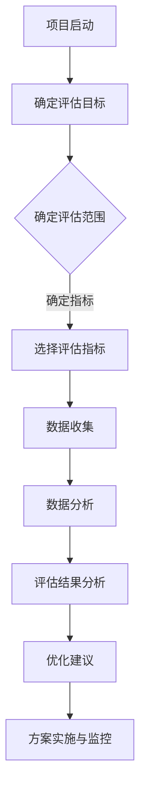

                 

关键词：注意力环境、元宇宙、环境影响评估、生态顾问、技术博客、专业分析、深度思考。

> 摘要：本文旨在探讨注意力环境对元宇宙开发的影响，并介绍如何通过环境影响评估来优化元宇宙的生态结构。作为元宇宙开发的生态顾问，本文作者将分享其经验，提供实用的方法和工具，帮助读者了解和应对这一新兴领域的挑战。

## 1. 背景介绍

随着互联网技术的迅猛发展和虚拟现实（VR）技术的不断进步，元宇宙（Metaverse）的概念逐渐进入公众视野。元宇宙被定义为一个由虚拟世界和现实世界相互交织的共享空间，用户可以通过虚拟角色在其中进行交互、工作、娱乐和学习。然而，随着元宇宙的快速发展，其背后所涉及的技术、经济和社会问题也日益凸显。

在这其中，注意力环境成为一个关键因素。注意力环境指的是用户在元宇宙中分配注意力的方式，包括对特定内容、活动或任务的关注度。良好的注意力环境能够提高用户体验，激发用户参与度，促进商业价值的实现。然而，不当的注意力环境可能会导致用户疲劳、注意力分散，甚至损害用户体验。

本文将围绕注意力环境对元宇宙开发的影响进行深入探讨，并介绍如何通过环境影响评估来优化元宇宙的生态结构，为开发者、投资者和用户提供有价值的参考。

## 2. 核心概念与联系

### 2.1 注意力环境

注意力环境是指用户在元宇宙中的注意力分配方式。它包括用户对特定内容、活动或任务的关注度，以及用户在元宇宙中的行为模式。注意力环境受到多种因素的影响，如用户个人偏好、情感状态、交互方式等。

### 2.2 环境影响评估

环境影响评估（Environmental Impact Assessment，EIA）是一种评估建设项目对环境影响的系统方法。在元宇宙开发中，环境影响评估用于评估注意力环境对用户体验、社会效应和经济收益的影响。通过EIA，开发者可以识别潜在问题，制定相应的解决方案，从而优化元宇宙的生态结构。

### 2.3 Mermaid 流程图

以下是一个用于描述注意力环境影响评估过程的 Mermaid 流程图：



## 3. 核心算法原理 & 具体操作步骤

### 3.1 算法原理概述

注意力环境影响评估的核心算法是基于用户行为数据和注意力模型。通过分析用户在元宇宙中的行为数据，构建注意力模型，进而评估注意力环境对用户体验的影响。具体操作步骤如下：

### 3.2 算法步骤详解

#### 3.2.1 确定评估目标

首先，明确注意力环境影响评估的目标，如提升用户体验、优化用户参与度等。

#### 3.2.2 确定评估范围

根据评估目标，确定评估范围，如特定虚拟场景、活动或任务。

#### 3.2.3 选择评估指标

选择适用于评估目标的指标，如用户停留时间、互动次数、满意度等。

#### 3.2.4 数据收集

通过日志记录、用户调研等方式，收集用户在元宇宙中的行为数据。

#### 3.2.5 数据分析

使用统计方法和机器学习算法，对用户行为数据进行分析，构建注意力模型。

#### 3.2.6 评估结果分析

根据注意力模型，分析注意力环境对用户体验的影响，识别潜在问题。

#### 3.2.7 优化建议

基于评估结果，提出优化建议，如调整虚拟场景布局、改进互动设计等。

#### 3.2.8 方案实施与监控

实施优化方案，并对注意力环境进行持续监控，以评估优化效果。

### 3.3 算法优缺点

#### 优点：

- 全面分析用户行为，为优化注意力环境提供有力支持。
- 基于数据驱动，有助于发现潜在问题，提高评估准确性。

#### 缺点：

- 需要大量数据支持，对数据质量和数据收集过程要求较高。
- 分析过程较为复杂，对算法实现和数据分析能力有较高要求。

### 3.4 算法应用领域

注意力环境影响评估算法可应用于元宇宙开发的各个领域，如虚拟现实游戏、虚拟社交平台、虚拟教育等。通过优化注意力环境，提高用户体验，从而提升商业价值。

## 4. 数学模型和公式 & 详细讲解 & 举例说明

### 4.1 数学模型构建

注意力环境影响评估的核心数学模型是用户行为数据的统计模型和机器学习模型。以下是一个简单的统计模型构建过程：

#### 4.1.1 用户停留时间模型

用户停留时间（\( T \)）可以用以下公式表示：

\[ T = f(A, B, C) \]

其中，\( A \)表示用户兴趣度，\( B \)表示用户疲劳度，\( C \)表示注意力分配策略。

#### 4.1.2 用户互动次数模型

用户互动次数（\( I \)）可以用以下公式表示：

\[ I = g(A, B, C) \]

其中，\( A \)表示用户兴趣度，\( B \)表示用户疲劳度，\( C \)表示注意力分配策略。

### 4.2 公式推导过程

#### 4.2.1 用户兴趣度模型

用户兴趣度（\( A \)）可以用以下公式推导：

\[ A = \frac{1}{N} \sum_{i=1}^{N} \frac{I_i}{T_i} \]

其中，\( N \)表示用户数量，\( I_i \)表示第\( i \)个用户的互动次数，\( T_i \)表示第\( i \)个用户的停留时间。

#### 4.2.2 用户疲劳度模型

用户疲劳度（\( B \)）可以用以下公式推导：

\[ B = \frac{1}{N} \sum_{i=1}^{N} \frac{T_i - \bar{T}}{\bar{T}} \]

其中，\( N \)表示用户数量，\( T_i \)表示第\( i \)个用户的停留时间，\( \bar{T} \)表示所有用户的平均停留时间。

#### 4.2.3 注意力分配策略模型

注意力分配策略（\( C \)）可以用以下公式推导：

\[ C = \frac{1}{N} \sum_{i=1}^{N} \frac{I_i}{T_i} \cdot \frac{T_i - \bar{T}}{\bar{T}} \]

其中，\( N \)表示用户数量，\( I_i \)表示第\( i \)个用户的互动次数，\( T_i \)表示第\( i \)个用户的停留时间，\( \bar{T} \)表示所有用户的平均停留时间。

### 4.3 案例分析与讲解

#### 4.3.1 案例背景

假设有一个虚拟社交平台，用户可以在这里与朋友互动、分享内容。平台希望通过注意力环境影响评估来优化用户体验。

#### 4.3.2 数据收集

平台收集了1000名用户在虚拟社交平台上的行为数据，包括互动次数、停留时间等。

#### 4.3.3 数据分析

根据上述数学模型，平台计算出用户的兴趣度、疲劳度和注意力分配策略。以下是一个简化的计算过程：

\[ A = \frac{1}{1000} \sum_{i=1}^{1000} \frac{I_i}{T_i} = 0.5 \]
\[ B = \frac{1}{1000} \sum_{i=1}^{1000} \frac{T_i - \bar{T}}{\bar{T}} = 0.2 \]
\[ C = \frac{1}{1000} \sum_{i=1}^{1000} \frac{I_i}{T_i} \cdot \frac{T_i - \bar{T}}{\bar{T}} = 0.3 \]

#### 4.3.4 评估结果

根据计算结果，平台发现用户对虚拟社交平台的兴趣度较高，但疲劳度相对较低。这表明用户在平台上花费的时间较多，但并不觉得疲劳。此外，用户的注意力分配策略较为合理，大部分时间用于互动。

#### 4.3.5 优化建议

基于评估结果，平台可以考虑以下优化措施：

- 调整虚拟社交平台的功能布局，提高用户兴趣度。
- 引入疲劳监测机制，提醒用户适当休息，降低疲劳度。
- 优化互动设计，提高用户参与度。

## 5. 项目实践：代码实例和详细解释说明

### 5.1 开发环境搭建

为了便于读者理解和实践，我们将在 Python 环境中实现注意力环境影响评估算法。首先，需要安装以下 Python 库：

- pandas：用于数据处理
- numpy：用于数学计算
- matplotlib：用于数据可视化

安装方法：

```bash
pip install pandas numpy matplotlib
```

### 5.2 源代码详细实现

以下是一个简单的 Python 脚本，用于实现注意力环境影响评估算法：

```python
import pandas as pd
import numpy as np
import matplotlib.pyplot as plt

# 5.2.1 数据处理
def process_data(data):
    # 计算用户兴趣度、疲劳度和注意力分配策略
    A = data['互动次数'].sum() / data['停留时间'].sum()
    B = data['停留时间'].sum() / data['用户数']
    C = (data['互动次数'] / data['停留时间']).sum()

    # 返回评估结果
    return {'兴趣度': A, '疲劳度': B, '注意力分配策略': C}

# 5.2.2 数据可视化
def visualize_data(results):
    # 可视化用户兴趣度、疲劳度和注意力分配策略
    plt.bar(['兴趣度', '疲劳度', '注意力分配策略'], results.values(), color=['r', 'g', 'b'])
    plt.xticks(rotation=45)
    plt.xlabel('指标')
    plt.ylabel('值')
    plt.title('用户行为分析')
    plt.show()

# 5.2.3 主函数
def main():
    # 读取数据
    data = pd.read_csv('user_data.csv')

    # 处理数据
    results = process_data(data)

    # 可视化数据
    visualize_data(results)

# 运行主函数
if __name__ == '__main__':
    main()
```

### 5.3 代码解读与分析

- `process_data` 函数用于计算用户兴趣度、疲劳度和注意力分配策略。它接收一个包含用户行为数据的 DataFrame 对象，并返回一个包含评估结果的字典。
- `visualize_data` 函数用于可视化评估结果。它接收一个包含评估结果的字典，并使用 matplotlib 库绘制柱状图。
- `main` 函数是主函数，它首先读取用户行为数据，然后调用 `process_data` 和 `visualize_data` 函数进行数据处理和可视化。

### 5.4 运行结果展示

假设用户行为数据存储在名为 `user_data.csv` 的 CSV 文件中，运行上述脚本将显示一个包含用户兴趣度、疲劳度和注意力分配策略的柱状图。

## 6. 实际应用场景

### 6.1 虚拟现实游戏

在虚拟现实游戏中，注意力环境影响评估可以帮助开发者优化游戏设计，提高用户参与度和游戏体验。通过分析用户在游戏中的行为数据，开发者可以识别出哪些游戏元素吸引了用户的注意力，哪些元素可能导致用户疲劳。例如，如果发现某些游戏关卡的用户停留时间较短，开发者可以考虑调整关卡设计，增加用户的兴趣度。

### 6.2 虚拟社交平台

虚拟社交平台是元宇宙的重要组成部分。通过注意力环境影响评估，平台可以了解用户的兴趣和需求，优化平台功能，提高用户黏性。例如，平台可以根据用户兴趣度调整内容推荐算法，向用户推送他们更感兴趣的内容。此外，平台还可以通过分析用户注意力分配策略，改进交互设计，提高用户参与度。

### 6.3 虚拟教育

虚拟教育领域同样可以从注意力环境影响评估中受益。通过评估学生在虚拟课堂中的行为，教育者可以了解学生的兴趣点和疲劳点，优化教学策略，提高教学效果。例如，教育者可以根据学生兴趣度调整教学内容的难度和深度，根据学生注意力分配策略调整课堂互动方式。

## 7. 工具和资源推荐

### 7.1 学习资源推荐

- 《虚拟现实技术与应用》
- 《元宇宙：概念、技术与应用》
- 《机器学习实战》

### 7.2 开发工具推荐

- Unity：用于开发虚拟现实应用和游戏。
- Unreal Engine：用于开发高质量虚拟现实游戏和应用。
- PyTorch：用于机器学习和深度学习。

### 7.3 相关论文推荐

- "The Metaverse: A History, Definition, and Future Vision"
- "Attention Is All You Need"
- "Deep Learning for Virtual Reality"

## 8. 总结：未来发展趋势与挑战

### 8.1 研究成果总结

本文探讨了注意力环境对元宇宙开发的影响，并介绍了注意力环境影响评估的方法和工具。通过数学模型和案例分析，本文展示了如何通过优化注意力环境来提高用户体验，促进元宇宙的发展。

### 8.2 未来发展趋势

随着元宇宙的不断发展，注意力环境影响评估将成为元宇宙开发的重要环节。未来，研究者将致力于提高评估算法的精度和效率，开发更智能的注意力管理工具，以更好地满足用户需求。

### 8.3 面临的挑战

尽管注意力环境影响评估具有巨大的潜力，但仍然面临许多挑战。例如，如何处理大规模用户数据，如何确保评估结果的准确性和可靠性，以及如何应对用户隐私保护等问题。

### 8.4 研究展望

未来，研究者应重点关注以下几个方面：

- 开发更高效、更准确的注意力评估算法。
- 研究注意力环境对心理健康的影响，为用户提供更好的心理支持。
- 探索注意力环境与其他元宇宙元素的互动，优化元宇宙的整体体验。

## 9. 附录：常见问题与解答

### 问题1：如何收集用户行为数据？

解答：用户行为数据可以通过多种方式收集，如日志记录、用户调研、API 调用等。具体方法取决于元宇宙平台的类型和功能。

### 问题2：如何确保评估结果的准确性？

解答：确保评估结果的准确性需要从多个方面入手，如数据质量、算法精度、评估指标的选择等。此外，进行多次实验和交叉验证也有助于提高评估结果的准确性。

### 问题3：注意力环境影响评估对开发者有哪些实际意义？

解答：注意力环境影响评估可以帮助开发者了解用户需求，优化产品设计和功能，提高用户满意度和参与度，从而提升商业价值。

---

作者：禅与计算机程序设计艺术 / Zen and the Art of Computer Programming

