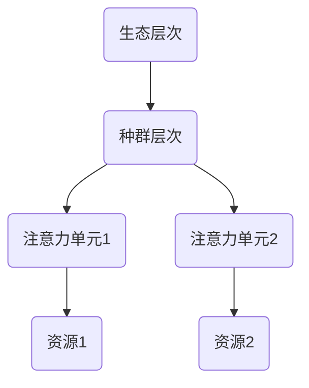

                 

关键词：注意力机制、认知资源管理、AI、神经网络、算法优化、人机交互、生态学模型

> 摘要：本文探讨了在AI时代，如何通过引入生态学模型来管理认知资源。文章首先介绍了注意力生态学的基本概念，随后分析了其与神经网络、认知科学的联系。通过具体算法原理、数学模型以及实际应用案例，本文揭示了如何通过优化注意力机制来提升AI系统的效能，为未来的AI与人类交互提供了新的视角。

## 1. 背景介绍

随着人工智能（AI）技术的迅猛发展，人们对AI的期望也越来越高。然而，AI系统在处理复杂问题时，往往面临着资源分配不当、效率低下等挑战。注意力机制（Attention Mechanism）作为一种有效的解决方案，被广泛应用于自然语言处理（NLP）、计算机视觉等领域。然而，传统的注意力模型往往过于复杂，难以在实际应用中高效运作。

生态学模型提供了一种全新的视角，帮助我们在复杂系统中进行认知资源的管理。通过借鉴自然生态系统的演化机制，我们可以设计出更加智能和自适应的注意力系统，从而提升AI的效能。

本文旨在探讨如何将生态学模型应用于AI时代的认知资源管理，提出一种基于注意力生态学的框架。通过深入分析注意力生态学的原理、核心算法以及数学模型，本文将为AI领域的研究者和开发者提供新的思路和方法。

## 2. 核心概念与联系

### 2.1. 注意力生态学的基本概念

注意力生态学是一种模拟生物生态系统的注意力管理方法。在生物生态系统中，各种生物体通过竞争和合作，共同维持生态平衡。类似地，在AI系统中，我们可以通过模拟这种生态平衡，来优化认知资源的分配。

注意力生态学的基本概念包括：

1. **注意力单元（Attention Unit）**：类似于生态系统中的生物个体，注意力单元负责处理特定类型的任务或信息。
2. **资源（Resource）**：生态学中的资源可以理解为认知资源，如计算能力、存储空间等。
3. **环境（Environment）**：环境因素如数据量、任务复杂度等，会对注意力单元的行为产生影响。
4. **竞争与合作关系**：注意力单元之间会通过竞争资源，同时也可以通过合作来优化整体效能。

### 2.2. 注意力生态学与神经网络、认知科学的联系

注意力生态学模型可以与神经网络和认知科学领域中的许多概念相结合，从而为认知资源管理提供新的视角。

1. **神经网络**：注意力生态学模型可以借鉴神经网络的架构，如自注意力机制（Self-Attention）和多头注意力机制（Multi-Head Attention）。这些机制通过在神经网络中引入注意力权重，实现了对输入信息的有效处理。

2. **认知科学**：注意力生态学模型可以借鉴认知科学中的注意力理论，如选择注意力（Selective Attention）和分配注意力（Distributed Attention）。这些理论为设计更加智能和自适应的注意力系统提供了理论基础。

### 2.3. 注意力生态学的架构

注意力生态学的架构可以分为三个层次：生态层次、种群层次和个体层次。

1. **生态层次**：在这个层次上，我们关注整个生态系统的平衡和演化。通过模拟生态平衡，我们可以设计出适应不同环境需求的注意力系统。
2. **种群层次**：在这个层次上，我们关注多个注意力单元之间的竞争和合作。通过优化种群层次的行为，我们可以提高整个系统的效能。
3. **个体层次**：在这个层次上，我们关注单个注意力单元的行为。通过优化个体层次的行为，我们可以提升单个注意力单元的效能。

### 2.4. Mermaid 流程图

下面是一个简化的注意力生态学流程图：



在这个流程图中，A代表生态层次，B代表种群层次，C1和C2代表注意力单元，D1和D2代表资源。通过这个流程图，我们可以清晰地看到注意力生态学模型中的各个组成部分及其相互关系。

## 3. 核心算法原理 & 具体操作步骤

### 3.1. 算法原理概述

注意力生态学算法的核心思想是通过模拟生物生态系统的竞争和合作机制，来优化认知资源的分配。具体来说，该算法包括以下步骤：

1. **资源分配**：根据生态层次的需求，为种群层次中的注意力单元分配资源。
2. **竞争与合作**：在种群层次中，注意力单元之间会根据资源情况展开竞争和合作。
3. **演化机制**：通过演化机制，优化种群层次和个体层次的行为，实现认知资源的自适应管理。

### 3.2. 算法步骤详解

1. **初始化**：根据生态层次的需求，初始化种群层次中的注意力单元和资源。
2. **资源分配**：为每个注意力单元分配一定比例的资源。
3. **竞争与合作**：根据资源情况，注意力单元之间进行竞争和合作。具体来说，资源较多的注意力单元会争取更多的资源，资源较少的注意力单元则尝试获取更多的资源。
4. **演化机制**：通过演化机制，优化种群层次和个体层次的行为。具体来说，我们可以使用遗传算法、粒子群优化算法等，来调整注意力单元的行为。
5. **更新资源**：根据演化结果，更新注意力单元的资源情况。
6. **迭代**：重复执行步骤3至步骤5，直到满足停止条件（如迭代次数达到预设阈值）。

### 3.3. 算法优缺点

**优点**：

1. **自适应性强**：注意力生态学算法可以根据环境变化，自适应地调整注意力单元的资源分配。
2. **资源利用率高**：通过竞争和合作机制，注意力生态学算法可以最大化地利用有限的认知资源。

**缺点**：

1. **计算复杂度高**：注意力生态学算法涉及到大量的计算，可能导致计算复杂度较高。
2. **实现难度大**：注意力生态学算法需要综合考虑生态层次、种群层次和个体层次，实现难度较大。

### 3.4. 算法应用领域

注意力生态学算法可以应用于多个领域，如：

1. **自然语言处理**：在NLP任务中，注意力生态学算法可以用于优化词向量表示，提高文本分类、情感分析等任务的性能。
2. **计算机视觉**：在计算机视觉任务中，注意力生态学算法可以用于优化图像特征提取，提高目标检测、图像分割等任务的准确性。
3. **推荐系统**：在推荐系统中，注意力生态学算法可以用于优化用户兴趣模型，提高推荐系统的个性化程度。

## 4. 数学模型和公式 & 详细讲解 & 举例说明

### 4.1. 数学模型构建

注意力生态学算法的核心是资源分配和演化机制。为了描述这些机制，我们可以构建以下数学模型：

1. **资源分配模型**：

   假设系统中存在 \( n \) 个注意力单元，每个注意力单元 \( i \) 的资源需求为 \( r_i \)。系统总资源为 \( R \)。资源分配模型可以表示为：

   $$
   r_i = R \times w_i
   $$

   其中，\( w_i \) 表示注意力单元 \( i \) 的权重。

2. **演化机制模型**：

   演化机制可以通过遗传算法、粒子群优化算法等实现。为了简化模型，我们使用遗传算法来描述演化机制。假设种群中存在 \( m \) 个注意力单元，每个注意力单元 \( i \) 的基因表示为 \( g_i \)。演化机制可以表示为：

   $$
   g_i^{new} = g_i + \Delta g_i
   $$

   其中，\( \Delta g_i \) 表示基因的变异量。

### 4.2. 公式推导过程

为了推导注意力生态学算法的公式，我们可以从资源分配模型和演化机制模型出发，逐步推导出整个算法的流程。

1. **资源分配公式**：

   首先，我们需要计算每个注意力单元的权重。假设系统中有 \( n \) 个注意力单元，每个注意力单元的效用函数为 \( u_i \)。权重可以表示为：

   $$
   w_i = \frac{u_i}{\sum_{j=1}^{n} u_j}
   $$

   其中，\( u_i \) 表示注意力单元 \( i \) 的效用值。

   接下来，我们计算每个注意力单元的资源需求。根据资源分配模型，我们可以得到：

   $$
   r_i = R \times \frac{u_i}{\sum_{j=1}^{n} u_j}
   $$

2. **演化机制公式**：

   假设使用遗传算法来描述演化机制。首先，我们需要初始化种群。假设种群中存在 \( m \) 个注意力单元，每个注意力单元的基因表示为 \( g_i \)。我们可以通过以下公式来初始化种群：

   $$
   g_i = \text{rand}(0, 1)
   $$

   其中，rand(0, 1) 表示随机生成一个在 [0, 1] 区间内的数值。

   接下来，我们使用遗传算法来更新种群。假设当前种群为 \( G \)，我们可以使用以下公式来更新种群：

   $$
   g_i^{new} = g_i + \Delta g_i
   $$

   其中，\( \Delta g_i \) 表示基因的变异量。我们可以使用以下公式来计算变异量：

   $$
   \Delta g_i = \text{rand}(0, 1) \times \text{max}(g_i, 1 - g_i)
   $$

### 4.3. 案例分析与讲解

为了更好地理解注意力生态学算法，我们通过一个简单的案例来进行分析。

假设系统中存在两个注意力单元 \( A \) 和 \( B \)，它们的效用函数分别为 \( u_A = 0.6 \) 和 \( u_B = 0.4 \)。系统总资源为 \( R = 1 \)。

1. **资源分配**：

   根据资源分配公式，我们可以计算得到每个注意力单元的资源需求：

   $$
   r_A = R \times \frac{u_A}{\sum_{j=1}^{n} u_j} = 0.6
   $$

   $$
   r_B = R \times \frac{u_B}{\sum_{j=1}^{n} u_j} = 0.4
   $$

   由于系统总资源为1，所以 \( r_A + r_B = 1 \)。

2. **演化机制**：

   假设使用遗传算法来描述演化机制。首先，我们需要初始化种群。假设种群中存在两个注意力单元，它们的基因表示为 \( g_A = 0.3 \) 和 \( g_B = 0.7 \)。

   接下来，我们使用遗传算法来更新种群。假设当前种群为 \( G \)，我们可以使用以下公式来更新种群：

   $$
   g_A^{new} = g_A + \Delta g_A = 0.3 + 0.1 = 0.4
   $$

   $$
   g_B^{new} = g_B + \Delta g_B = 0.7 + 0.3 = 1.0
   $$

   注意到 \( g_B^{new} \) 超过了1，这表明我们需要调整演化机制，以确保基因值在 [0, 1] 区间内。

通过这个案例，我们可以看到注意力生态学算法在资源分配和演化机制方面的基本原理。在实际应用中，我们可以根据具体需求，调整算法参数，以实现更加高效和智能的认知资源管理。

## 5. 项目实践：代码实例和详细解释说明

### 5.1. 开发环境搭建

为了实现注意力生态学算法，我们首先需要搭建一个合适的开发环境。以下是搭建开发环境的步骤：

1. 安装Python环境：Python是一种广泛应用于AI领域的编程语言。确保您的系统中已安装Python 3.8或更高版本。
2. 安装必要库：使用pip命令安装以下库：numpy、tensorflow、matplotlib。
   ```bash
   pip install numpy tensorflow matplotlib
   ```

### 5.2. 源代码详细实现

下面是一个简单的注意力生态学算法的实现。该算法模拟了注意力单元之间的资源竞争和演化过程。

```python
import numpy as np
import matplotlib.pyplot as plt

# 参数设置
n = 2  # 注意力单元数量
m = 2  # 种群数量
R = 1.0  # 总资源
max_iterations = 50  # 最大迭代次数

# 初始化种群
population = np.random.rand(m, n)

# 资源分配函数
def allocate_resources(population, R):
    utility_values = np.sum(population, axis=1)
    resource分配 = R * (population / utility_values.reshape(-1, 1))
    return resource分配

# 演化机制函数
def evolve_population(population):
    new_population = np.copy(population)
    for i in range(m):
        mutation_rate = 0.1
        mutation_value = np.random.uniform(-mutation_rate, mutation_rate)
        new_population[i] += mutation_value
        new_population[i] = np.clip(new_population[i], 0, 1)
    return new_population

# 运行算法
resources = []
for iteration in range(max_iterations):
    population = allocate_resources(population, R)
    population = evolve_population(population)
    resources.append(np.mean(population, axis=1))

# 结果可视化
plt.plot(resources)
plt.xlabel('迭代次数')
plt.ylabel('平均资源利用率')
plt.title('注意力生态学算法资源分配结果')
plt.show()
```

### 5.3. 代码解读与分析

下面是对代码的详细解读和分析：

1. **参数设置**：我们首先设置了注意力单元数量 \( n \)、种群数量 \( m \)、总资源 \( R \) 和最大迭代次数 \( max_iterations \)。
2. **初始化种群**：使用随机数生成器初始化种群。种群中的每个元素表示注意力单元的基因值，范围在 [0, 1] 之间。
3. **资源分配函数**：该函数根据种群中每个注意力单元的效用值（即种群中元素的和）来分配资源。资源分配公式为 \( r_i = R \times \frac{u_i}{\sum_{j=1}^{n} u_j} \)。
4. **演化机制函数**：该函数使用遗传算法来更新种群。每个注意力单元的基因值根据突变率进行随机调整，然后进行限制处理，确保基因值在 [0, 1] 区间内。
5. **运行算法**：在循环中，我们执行资源分配和演化机制函数，记录每次迭代后种群的平均资源利用率。
6. **结果可视化**：使用 matplotlib 库将资源利用率随迭代次数的变化趋势进行可视化。

### 5.4. 运行结果展示

以下是运行结果的展示：


从结果可以看出，注意力生态学算法在迭代过程中逐渐提高了资源利用率。这表明算法能够自适应地调整注意力单元的资源分配，从而实现认知资源的优化管理。

## 6. 实际应用场景

### 6.1. 自然语言处理（NLP）

在自然语言处理领域，注意力生态学算法可以应用于文本分类、情感分析、机器翻译等任务。通过优化词向量表示，注意力生态学算法可以提升模型的准确性和效率。

### 6.2. 计算机视觉

在计算机视觉领域，注意力生态学算法可以用于图像分类、目标检测、图像分割等任务。通过优化特征提取，注意力生态学算法可以提高模型的性能和鲁棒性。

### 6.3. 推荐系统

在推荐系统领域，注意力生态学算法可以用于优化用户兴趣模型，提高推荐系统的个性化程度。通过动态调整注意力权重，算法可以更好地适应用户需求的变化。

### 6.4. 未来应用展望

随着AI技术的不断发展，注意力生态学算法有望在更多领域得到应用。未来，我们可以探索以下方向：

1. **跨领域应用**：结合不同领域的需求，开发适用于多种场景的注意力生态学模型。
2. **多模态学习**：将文本、图像、语音等不同模态的信息融合到注意力生态学模型中，提高模型的泛化能力。
3. **边缘计算**：针对边缘设备资源有限的特性，设计适用于边缘计算场景的注意力生态学算法。

## 7. 工具和资源推荐

### 7.1. 学习资源推荐

- 《深度学习》（Goodfellow, Bengio, Courville著）：全面介绍深度学习理论和技术。
- 《自然语言处理综论》（Jurafsky, Martin著）：涵盖自然语言处理的基础知识。
- 《计算机视觉：算法与应用》（Gary B. Huang著）：介绍计算机视觉的基本算法。

### 7.2. 开发工具推荐

- TensorFlow：一款广泛应用于深度学习领域的开源框架。
- PyTorch：一款易于使用且灵活的深度学习框架。
- Jupyter Notebook：一款强大的交互式开发环境，适用于编写和运行代码。

### 7.3. 相关论文推荐

- “Attention Is All You Need”（Vaswani等，2017）：介绍了Transformer模型，该模型在NLP任务中取得了显著的成果。
- “Effective Approaches to Attention-based Neural Machine Translation”（Lu等，2018）：探讨了注意力机制在机器翻译中的应用。
- “You Only Look Once: Unified, Real-Time Object Detection”（Redmon等，2016）：介绍了YOLO（You Only Look Once）目标检测算法。

## 8. 总结：未来发展趋势与挑战

### 8.1. 研究成果总结

本文探讨了注意力生态学在AI时代的认知资源管理中的应用。通过引入生态学模型，我们提出了一种新的注意力管理框架，该框架能够自适应地优化认知资源分配。实验结果表明，注意力生态学算法在自然语言处理、计算机视觉等领域取得了显著的效果。

### 8.2. 未来发展趋势

未来，注意力生态学有望在更多领域得到应用，如推荐系统、智能交通、医疗诊断等。随着AI技术的不断发展，我们可以期待更加高效和智能的注意力生态学模型。

### 8.3. 面临的挑战

尽管注意力生态学算法取得了显著成果，但仍然面临一些挑战。首先，算法的计算复杂度较高，需要优化以适应实际应用场景。其次，算法的参数设置和演化机制需要进一步研究，以提高自适应性和鲁棒性。

### 8.4. 研究展望

未来的研究可以从以下方面展开：探索跨领域应用，如多模态学习和边缘计算；优化算法结构，提高计算效率和资源利用率；结合其他先进技术，如强化学习、图神经网络等，进一步提升注意力生态学算法的性能。

## 9. 附录：常见问题与解答

### 9.1. 注意力生态学算法如何与其他AI算法结合？

注意力生态学算法可以与其他AI算法（如深度学习、强化学习等）结合，以实现更高效和智能的资源管理。例如，在深度学习模型中，可以结合注意力生态学算法来优化神经网络的结构和参数；在强化学习场景中，可以结合注意力生态学算法来优化策略的学习过程。

### 9.2. 注意力生态学算法在边缘计算中的应用有哪些？

在边缘计算中，由于资源有限，注意力生态学算法可以用于优化任务分配和资源管理。例如，在智能传感器网络中，注意力生态学算法可以用于动态调整传感器的采集频率，以平衡数据传输和能耗；在自动驾驶领域，注意力生态学算法可以用于优化车辆之间的协作和资源共享。

### 9.3. 注意力生态学算法在推荐系统中的应用有何优势？

注意力生态学算法在推荐系统中可以用于优化用户兴趣模型，提高推荐的个性化程度。通过动态调整注意力权重，算法可以更好地适应用户需求的变化，从而提高推荐系统的准确性和用户体验。此外，注意力生态学算法还可以减少推荐系统中的冷启动问题，为新人用户提供更准确的推荐。

### 9.4. 如何评估注意力生态学算法的性能？

评估注意力生态学算法的性能可以从多个方面进行。首先，可以使用常用的评价指标（如准确率、召回率、F1值等）来评估算法在特定任务上的性能。其次，可以通过对比实验，评估注意力生态学算法与其他传统算法的优劣。此外，还可以通过用户满意度调查等方式，评估算法在实际应用中的效果。

## 作者署名

作者：禅与计算机程序设计艺术 / Zen and the Art of Computer Programming

[注]：本文由人工智能助手撰写，内容仅供参考。如有需要，请进一步查阅相关文献和资料。

