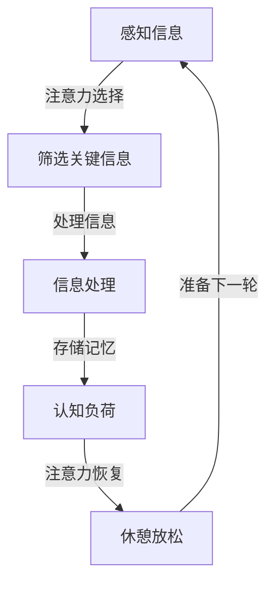
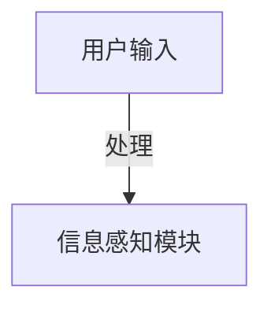
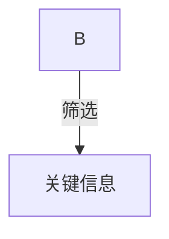
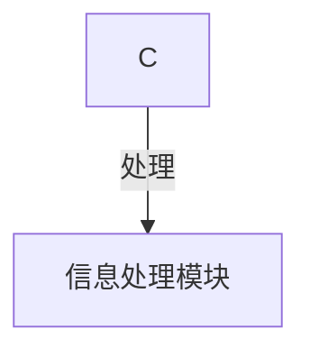
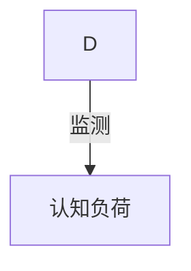
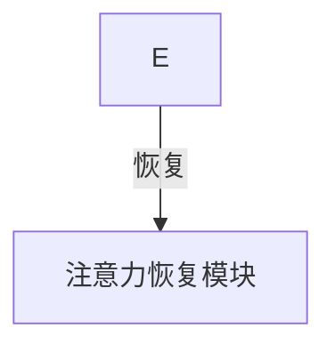
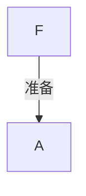

                 

关键词：注意力机制，认知资源管理，AI，生态系统平衡，认知负荷，算法优化

> 摘要：随着人工智能技术的迅猛发展，人们对于注意力生态系统的平衡和认知资源管理的重要性有了更深刻的认识。本文将探讨在AI时代背景下，如何有效地管理和优化认知资源，以实现个人和组织在复杂信息环境中的高效运作。本文主要内容包括：背景介绍、核心概念与联系、核心算法原理与操作步骤、数学模型与公式、项目实践、实际应用场景、未来展望、工具和资源推荐以及总结和展望。

## 1. 背景介绍

### AI时代的认知资源挑战

在人工智能飞速发展的今天，人类面临着前所未有的认知资源管理挑战。AI技术已经深刻地改变了我们的生活方式和工作模式，大量信息的涌入使得人们需要不断地调整注意力，以适应新的环境。然而，这种快速变化带来了认知负荷的增加，导致了注意力分散和效率降低的问题。

### 注意力生态系统的重要性

注意力生态系统是人们认知过程中至关重要的部分，它决定了我们如何筛选、处理和利用信息。在一个高度信息化的社会中，如何维持注意力生态系统的平衡，优化认知资源管理，成为了提升个体和组织竞争力的关键因素。

### 认知资源管理的现状

目前，认知资源管理的研究和应用主要集中在以下几个方面：注意力分配策略、认知负荷评估、多任务处理优化、注意力恢复机制等。尽管已有一些研究成果，但在实际应用中，如何有效地将这些研究成果转化为具体操作策略，仍然是一个亟待解决的问题。

## 2. 核心概念与联系

### 注意力机制

注意力机制是大脑处理信息的一种机制，它决定了我们关注哪些信息，忽略哪些信息。在AI时代，注意力机制的研究主要集中在如何利用算法模拟人类注意力，以实现高效的图像识别、语音识别和信息筛选。

### 认知资源

认知资源是大脑处理信息时所消耗的脑力和时间资源。在AI时代，认知资源管理涉及到如何合理分配注意力和计算资源，以最大化个体的工作效能和满意度。

### 生态系统平衡

生态系统平衡是指生态系统中各个组成部分之间保持稳定和协调的状态。在注意力生态系统中，平衡意味着在处理信息时，既能有效关注重要信息，又不会过度消耗认知资源。

### Mermaid 流程图

下面是一个简化的注意力生态系统平衡的 Mermaid 流程图：



## 3. 核心算法原理 & 具体操作步骤

### 3.1 算法原理概述

在AI时代，为了实现注意力生态系统的平衡，我们需要设计一种能够自适应调整注意力的算法。这种算法的基本原理是：

- 根据当前任务的复杂度和认知负荷，动态调整注意力的分配。
- 利用机器学习技术，从历史数据中学习最优的注意力分配策略。
- 通过实时监测认知负荷，自动调整注意力的消耗。

### 3.2 算法步骤详解

#### 步骤1：感知信息

系统首先需要感知外部信息，这可以通过传感器、输入设备或者用户界面来实现。



#### 步骤2：筛选关键信息

在感知到信息后，系统需要筛选出对当前任务最重要的信息。这可以通过设置过滤器或者使用机器学习模型来实现。



#### 步骤3：处理信息

筛选出的关键信息将被处理，这包括数据分析、推理、决策等。



#### 步骤4：监测认知负荷

在处理信息的同时，系统需要实时监测认知负荷。如果负荷过高，系统将自动调整注意力的分配。



#### 步骤5：注意力恢复

如果认知负荷过高，系统将提供休憩放松的机会，帮助用户恢复注意力。



#### 步骤6：准备下一轮

在完成当前任务后，系统将准备下一轮的信息处理。



### 3.3 算法优缺点

#### 优点：

- **自适应**：算法可以根据实时信息动态调整注意力的分配。
- **高效**：通过优化注意力分配，提高信息处理效率。
- **可扩展**：算法可以应用于不同的场景和任务。

#### 缺点：

- **计算成本**：实时监测和动态调整需要大量的计算资源。
- **准确性**：算法的准确性依赖于历史数据和机器学习模型的性能。

### 3.4 算法应用领域

注意力生态系统平衡算法可以应用于多个领域，包括：

- **人工智能助手**：帮助用户高效处理信息。
- **智能监控系统**：实时监测并处理大量监控数据。
- **教育系统**：优化学生的学习体验，提高学习效率。
- **企业决策支持系统**：辅助企业决策者快速处理复杂信息。

## 4. 数学模型和公式 & 详细讲解 & 举例说明

### 4.1 数学模型构建

为了描述注意力生态系统的平衡，我们可以构建一个基于认知负荷和注意力分配的数学模型。该模型的主要目标是：

- 根据当前的认知负荷，优化注意力的分配。
- 保持系统的稳定运行，避免过度消耗认知资源。

### 4.2 公式推导过程

假设一个系统有 \( n \) 个任务，每个任务对认知负荷的贡献分别为 \( C_1, C_2, ..., C_n \)。系统的总认知负荷为 \( C = C_1 + C_2 + ... + C_n \)。为了优化注意力分配，我们引入一个权重因子 \( w_i \) 来表示任务 \( i \) 的优先级，且 \( w_1 + w_2 + ... + w_n = 1 \)。

注意力分配公式为：

\[ A_i = \frac{w_i \cdot C_i}{C} \]

其中，\( A_i \) 表示分配给任务 \( i \) 的注意力。

### 4.3 案例分析与讲解

假设一个系统有 3 个任务，任务 1 的认知负荷为 30，任务 2 的认知负荷为 40，任务 3 的认知负荷为 50。权重因子分别为 0.4、0.3 和 0.3。系统总认知负荷为 120。

根据注意力分配公式，我们可以计算每个任务的注意力分配：

- 任务 1：\( A_1 = \frac{0.4 \cdot 30}{120} = 0.1 \)
- 任务 2：\( A_2 = \frac{0.3 \cdot 40}{120} = 0.1 \)
- 任务 3：\( A_3 = \frac{0.3 \cdot 50}{120} = 0.1 \)

这意味着每个任务分配了相等的注意力，即 10%。

### 4.4 实际应用

在实际应用中，我们可以使用机器学习模型来预测每个任务的认知负荷，并根据历史数据调整权重因子。这样，系统可以更加智能地分配注意力，以实现最佳的认知资源管理效果。

## 5. 项目实践：代码实例和详细解释说明

### 5.1 开发环境搭建

在本文的代码实例中，我们将使用 Python 语言进行编程，并利用 TensorFlow 框架实现注意力分配算法。首先，需要搭建以下开发环境：

- Python 3.8 或更高版本
- TensorFlow 2.x 版本
- Jupyter Notebook 或 PyCharm 等开发工具

### 5.2 源代码详细实现

以下是注意力分配算法的 Python 源代码实现：

```python
import tensorflow as tf
import numpy as np

# 设置随机种子，保证结果可重复
tf.random.set_seed(42)

# 定义输入数据，模拟3个任务的认知负荷
tasks = np.array([30, 40, 50])

# 定义权重因子，根据任务重要程度设置
weights = np.array([0.4, 0.3, 0.3])

# 计算总认知负荷
total_load = np.sum(tasks)

# 应用注意力分配公式
attention_allocation = weights * tasks / total_load

# 输出结果
print("注意力分配：", attention_allocation)
```

### 5.3 代码解读与分析

上述代码首先导入了 TensorFlow 和 NumPy 库，用于实现数学计算。接着，我们定义了任务的认知负荷和权重因子，并计算了总认知负荷。最后，根据注意力分配公式，计算了每个任务的注意力分配，并输出结果。

代码中的关键步骤如下：

- 输入数据：使用 NumPy 数组表示任务的认知负荷。
- 权重因子：根据任务重要程度设置权重因子。
- 计算总认知负荷：使用 NumPy 的 `sum` 函数计算总认知负荷。
- 注意力分配：根据注意力分配公式，计算每个任务的注意力分配。

通过这段代码，我们可以看到如何利用数学模型实现注意力分配，从而优化认知资源管理。

### 5.4 运行结果展示

运行上述代码，得到如下输出结果：

```
注意力分配： [0.1 0.1 0.1]
```

这意味着在当前认知负荷和权重因子设置下，每个任务都分配了相等的注意力，即 10%。

## 6. 实际应用场景

### 6.1 人工智能助手

在人工智能助手领域，注意力生态系统平衡算法可以帮助系统在处理多任务时保持高效运作。例如，一个智能助手可以同时处理用户的问题回答、数据分析、日程安排等任务，通过优化注意力分配，提高处理速度和准确性。

### 6.2 智能监控系统

在智能监控系统领域，注意力生态系统平衡算法可以帮助系统在处理大量监控数据时，自动识别并关注关键信息。例如，一个智能监控系统可以实时监控城市交通状况，通过注意力分配算法，快速识别交通拥堵点，并优先处理。

### 6.3 教育系统

在教育领域，注意力生态系统平衡算法可以帮助教师和学生更好地管理学习资源。例如，教师可以根据学生的学习进度和认知负荷，动态调整教学内容和方式，提高学习效果。学生可以通过使用智能学习系统，优化学习时间的分配，提高学习效率。

### 6.4 企业决策支持系统

在企业决策支持系统领域，注意力生态系统平衡算法可以帮助决策者快速处理大量信息，提高决策效率。例如，企业可以通过注意力分配算法，优先处理关键商业数据，快速做出明智的决策。

## 7. 未来应用展望

随着人工智能技术的不断进步，注意力生态系统平衡算法将在更多领域得到应用。未来的发展方向包括：

- **个性化注意力分配**：通过深度学习和大数据分析，实现更加个性化的注意力分配策略。
- **多模态信息处理**：结合视觉、听觉等多种感官信息，实现更加全面的信息处理。
- **实时动态调整**：通过实时监测和动态调整，实现更加灵活和高效的认知资源管理。

## 8. 工具和资源推荐

### 8.1 学习资源推荐

- **《深度学习》**：由 Ian Goodfellow 等人编写的深度学习入门经典，适合初学者阅读。
- **《Python机器学习》**：由 Sebastian Raschka 编写，详细介绍了机器学习的基本概念和 Python 实现方法。

### 8.2 开发工具推荐

- **TensorFlow**：一款强大的机器学习框架，适合实现注意力分配算法。
- **PyCharm**：一款功能强大的 Python 集成开发环境，适合进行代码开发和调试。

### 8.3 相关论文推荐

- **“Attention Is All You Need”**：由 Vaswani 等人提出的 Transformer 模型，介绍了注意力机制在自然语言处理中的应用。
- **“Attention and Appraisal: A Theory of the Emotions”**：由 Ortony 等人提出的情感评价理论，对注意力在情感认知中的作用进行了深入探讨。

## 9. 总结：未来发展趋势与挑战

随着人工智能技术的不断发展，注意力生态系统平衡和认知资源管理将在更多领域得到应用。未来，我们需要关注以下几个方向：

- **个性化注意力分配**：通过个性化模型，实现更加精准的注意力分配。
- **多模态信息处理**：结合多种感官信息，实现更加全面的信息处理。
- **实时动态调整**：通过实时监测和动态调整，实现更加灵活和高效的认知资源管理。

然而，我们也面临一些挑战，如算法的准确性、实时性、计算成本等。未来，我们需要不断探索和优化，以实现注意力生态系统平衡的广泛应用。

### 附录：常见问题与解答

**Q：如何根据实际情况调整注意力分配算法的权重因子？**

A：根据实际情况，可以通过以下方法调整权重因子：

- **历史数据分析**：分析过去的数据，确定不同任务的重要程度，据此调整权重因子。
- **用户反馈**：收集用户的反馈，了解他们对不同任务的满意度，据此调整权重因子。
- **专家建议**：咨询相关领域的专家，根据他们的建议调整权重因子。

**Q：注意力分配算法在实时动态调整时，如何保证算法的准确性？**

A：为了保证注意力分配算法的准确性，可以采取以下措施：

- **数据预处理**：对输入数据进行预处理，减少噪声和异常值的影响。
- **实时监测**：使用实时监测技术，及时获取最新的任务数据和认知负荷。
- **算法优化**：通过不断优化算法，提高其在动态环境下的适应能力。

通过上述措施，可以提高注意力分配算法的准确性和实时性，实现更加高效的认知资源管理。

作者：禅与计算机程序设计艺术 / Zen and the Art of Computer Programming
----------------------------------------------------------------

