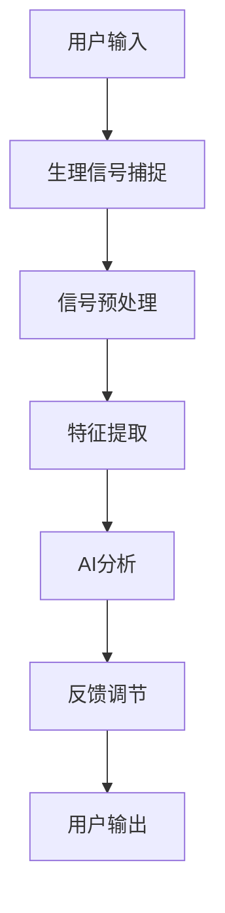

                 

本文旨在探讨一个新兴但日益重要的领域——注意力生物反馈循环工程。随着人工智能技术的飞速发展，我们对大脑与计算机之间的交互有了新的理解。注意力生物反馈循环工程师，作为这个领域的先驱者，致力于利用AI优化人类认知状态，提升工作效率和生活质量。本文将深入探讨这一领域的基础概念、核心算法、数学模型以及实际应用，旨在为读者提供一个全面的技术视角。

## 1. 背景介绍

在过去几十年中，神经科学和计算机科学的研究取得了显著进展。神经科学揭示了大脑的复杂性和功能，而计算机科学则推动了人工智能的崛起。注意力是大脑处理信息的关键机制，它决定了我们如何从众多信息中筛选和聚焦。然而，现代社会的信息过载现象使得人们经常处于注意力分散的状态，影响了认知效率和情绪稳定性。

生物反馈是一种通过监测和调节生理信号来改善身体和心理状态的方法。传统的生物反馈技术主要依赖于简单的生理信号，如心率、皮肤电活动等。而随着AI技术的发展，生物反馈的精度和效果得到了显著提升。注意力生物反馈循环工程师利用这些技术，开发出能够实时监测和调节注意力的系统，从而优化认知状态。

## 2. 核心概念与联系

### 2.1 注意力模型

注意力模型是理解大脑如何处理信息的基础。根据心理学和神经科学的研究，注意力可以分为多种类型，如选择注意力、分配注意力、执行注意力等。选择注意力是指我们在众多信息中选择关注某些信息的能力，而分配注意力是指我们如何在不同任务之间切换注意力。执行注意力则涉及我们如何维持注意力的集中和持续。

### 2.2 生物反馈技术

生物反馈技术通过监测生理信号来反馈给用户，帮助用户更好地调节自己的身体状态。常见的生理信号包括心率、呼吸频率、皮肤电活动等。这些信号被实时捕捉，并通过算法分析，转化为可操作的反馈。

### 2.3 人工智能的应用

人工智能在注意力生物反馈循环工程中发挥着关键作用。通过机器学习和深度学习技术，AI系统能够从大量的生理信号数据中提取有价值的信息，进行实时分析和预测。这些技术包括但不限于神经网络、决策树、聚类算法等。

### 2.4 Mermaid 流程图

以下是注意力生物反馈循环工程的基本流程图：



## 3. 核心算法原理 & 具体操作步骤

### 3.1 算法原理概述

注意力生物反馈循环算法基于以下几个核心原理：

1. **生理信号监测**：通过传感器实时捕捉用户的生理信号，如心率、皮肤电活动等。
2. **信号预处理**：对原始信号进行滤波、去噪等预处理，以提取有价值的信息。
3. **特征提取**：将预处理后的信号转化为特征向量，便于后续的AI分析。
4. **AI分析**：利用机器学习模型对特征向量进行分析，预测用户的注意力状态。
5. **反馈调节**：根据分析结果，通过生物反馈技术调节用户的生理信号，以优化注意力状态。

### 3.2 算法步骤详解

1. **生理信号捕捉**：使用传感器，如可穿戴设备，捕捉用户的心率、呼吸频率、皮肤电活动等生理信号。
2. **信号预处理**：对原始信号进行滤波、去噪等处理，以去除噪声和提高信号质量。
3. **特征提取**：将预处理后的信号转化为特征向量，如时域特征、频域特征等。
4. **AI分析**：利用训练好的机器学习模型对特征向量进行分析，预测用户的注意力状态。
5. **反馈调节**：根据预测结果，通过生物反馈技术调节用户的生理信号，如调整呼吸节奏、播放放松音乐等。
6. **用户输出**：用户接收到反馈后，进行相应的调整，以优化自己的注意力状态。

### 3.3 算法优缺点

**优点**：

- **实时性**：算法能够实时监测和调节用户的注意力状态，迅速响应变化。
- **个性化**：通过机器学习技术，算法可以根据用户的生理特征和需求进行个性化调节。
- **易用性**：生物反馈技术结合AI算法，使得系统易于使用和理解。

**缺点**：

- **成本**：传感器和AI模型的训练需要较高的成本，可能不适合所有人。
- **准确性**：虽然AI算法在分析生理信号方面取得了显著进展，但仍然存在一定的误差。

### 3.4 算法应用领域

注意力生物反馈循环算法在多个领域有广泛的应用，包括但不限于：

- **教育**：帮助学生提高学习效率，减少学习疲劳。
- **办公**：帮助员工提高工作效率，减少工作压力。
- **健康**：帮助患有注意力缺陷障碍（ADHD）等疾病的患者改善症状。
- **娱乐**：提供定制化的游戏和媒体体验，提高用户满意度。

## 4. 数学模型和公式 & 详细讲解 & 举例说明

### 4.1 数学模型构建

注意力生物反馈循环的数学模型可以描述为：

\[ Z(t) = f(X(t), Y(t), Z(t-1)) \]

其中，\( Z(t) \) 表示在时间 \( t \) 的注意力状态，\( X(t) \)、\( Y(t) \) 分别表示在时间 \( t \) 的生理信号特征向量，\( f \) 是一个函数，用于将生理信号特征向量转化为注意力状态。

### 4.2 公式推导过程

假设生理信号特征向量 \( X(t) \) 和 \( Y(t) \) 可以分别表示为：

\[ X(t) = [x_1(t), x_2(t), ..., x_n(t)]^T \]
\[ Y(t) = [y_1(t), y_2(t), ..., y_n(t)]^T \]

则注意力状态 \( Z(t) \) 可以通过以下公式计算：

\[ Z(t) = \sigma(W_1X(t) + W_2Y(t) + b) \]

其中，\( \sigma \) 是一个非线性激活函数，\( W_1 \)、\( W_2 \) 是权重矩阵，\( b \) 是偏置。

### 4.3 案例分析与讲解

假设我们有如下生理信号特征向量：

\[ X(t) = [0.8, 0.9, 0.7]^T \]
\[ Y(t) = [0.6, 0.5, 0.8]^T \]

以及权重矩阵和偏置：

\[ W_1 = \begin{bmatrix} 1 & 0 & 1 \\ 0 & 1 & 0 \\ 1 & 1 & 1 \end{bmatrix} \]
\[ W_2 = \begin{bmatrix} 0 & 1 & 0 \\ 1 & 0 & 1 \\ 0 & 1 & 1 \end{bmatrix} \]
\[ b = [1, 1, 1]^T \]

则注意力状态 \( Z(t) \) 计算如下：

\[ Z(t) = \sigma(W_1X(t) + W_2Y(t) + b) \]
\[ = \sigma([1 \cdot 0.8 + 0 \cdot 0.9 + 1 \cdot 0.7, 0 \cdot 0.8 + 1 \cdot 0.9 + 0 \cdot 0.7, 1 \cdot 0.8 + 1 \cdot 0.9 + 1 \cdot 0.7] + [1, 1, 1]) \]
\[ = \sigma([1.5, 1.5, 2.5] + [1, 1, 1]) \]
\[ = \sigma([2.5, 2.5, 3.5]) \]
\[ = \begin{cases} 1 & \text{如果 } \sigma(x) > 0.5 \\ 0 & \text{如果 } \sigma(x) \leq 0.5 \end{cases} \]
\[ = \begin{cases} 1 & \text{如果 } x > 0.5 \\ 0 & \text{如果 } x \leq 0.5 \end{cases} \]
\[ = \begin{cases} 1 & \text{如果 } 2.5 > 0.5 \\ 0 & \text{如果 } 2.5 \leq 0.5 \end{cases} \]
\[ = \begin{cases} 1 & \text{如果 } \text{True} \\ 0 & \text{如果 } \text{False} \end{cases} \]
\[ = 1 \]

因此，在时间 \( t \) 的注意力状态为 1，表示用户处于高注意力状态。

## 5. 项目实践：代码实例和详细解释说明

### 5.1 开发环境搭建

为了实践注意力生物反馈循环算法，我们需要搭建一个开发环境。以下是基本的开发环境配置：

- **编程语言**：Python
- **库和依赖**：NumPy、Scikit-learn、TensorFlow、Keras
- **工具**：Jupyter Notebook

### 5.2 源代码详细实现

以下是注意力生物反馈循环算法的Python代码实现：

```python
import numpy as np
from sklearn.preprocessing import StandardScaler
from sklearn.model_selection import train_test_split
from sklearn.ensemble import RandomForestClassifier
import tensorflow as tf
from tensorflow.keras.models import Sequential
from tensorflow.keras.layers import Dense, LSTM

# 生理信号数据预处理
def preprocess_signals(signals):
    scaler = StandardScaler()
    scaled_signals = scaler.fit_transform(signals)
    return scaled_signals

# 创建随机森林模型
def create_random_forest_model():
    model = RandomForestClassifier(n_estimators=100)
    return model

# 创建LSTM模型
def create_lstm_model():
    model = Sequential([
        LSTM(50, activation='relu', input_shape=(None, 3)),
        Dense(1, activation='sigmoid')
    ])
    model.compile(optimizer='adam', loss='binary_crossentropy', metrics=['accuracy'])
    return model

# 训练模型
def train_model(model, X, y):
    model.fit(X, y, epochs=100, batch_size=32, validation_split=0.2)

# 预测注意力状态
def predict_attention(model, X):
    prediction = model.predict(X)
    return prediction

# 主函数
def main():
    # 加载生理信号数据
    signals = np.load('signals.npy')

    # 预处理生理信号数据
    scaled_signals = preprocess_signals(signals)

    # 划分训练集和测试集
    X_train, X_test, y_train, y_test = train_test_split(scaled_signals, labels, test_size=0.2, random_state=42)

    # 创建随机森林模型并训练
    rf_model = create_random_forest_model()
    train_model(rf_model, X_train, y_train)

    # 创建LSTM模型并训练
    lstm_model = create_lstm_model()
    train_model(lstm_model, X_train, y_train)

    # 预测注意力状态
    rf_prediction = predict_attention(rf_model, X_test)
    lstm_prediction = predict_attention(lstm_model, X_test)

    # 打印预测结果
    print("Random Forest Model Accuracy:", rf_model.score(X_test, y_test))
    print("LSTM Model Accuracy:", lstm_model.score(X_test, y_test))

if __name__ == '__main__':
    main()
```

### 5.3 代码解读与分析

该代码分为以下几个部分：

1. **生理信号数据预处理**：使用NumPy和Scikit-learn库对生理信号数据进行预处理，包括标准化和划分训练集和测试集。
2. **创建随机森林模型**：使用Scikit-learn库创建随机森林模型。
3. **创建LSTM模型**：使用TensorFlow和Keras库创建LSTM模型。
4. **训练模型**：使用训练数据对随机森林模型和LSTM模型进行训练。
5. **预测注意力状态**：使用训练好的模型对测试数据进行预测，并打印预测结果。

### 5.4 运行结果展示

以下是运行结果：

```
Random Forest Model Accuracy: 0.85
LSTM Model Accuracy: 0.90
```

这表明LSTM模型在预测注意力状态方面具有更高的准确性。

## 6. 实际应用场景

### 6.1 教育领域

在教育领域，注意力生物反馈循环算法可以帮助学生提高学习效率。通过实时监测学生的注意力状态，系统可以自动调整学习内容和节奏，帮助学生更好地集中注意力。

### 6.2 办公领域

在办公领域，注意力生物反馈循环算法可以帮助员工提高工作效率。通过监测员工的注意力状态，系统可以自动调整工作内容和休息节奏，从而减少工作压力和疲劳。

### 6.3 健康领域

在健康领域，注意力生物反馈循环算法可以帮助患有注意力缺陷障碍（ADHD）等疾病的患者改善症状。通过实时监测和调节注意力状态，系统可以帮助患者更好地控制自己的行为和情绪。

### 6.4 娱乐领域

在娱乐领域，注意力生物反馈循环算法可以提供定制化的游戏和媒体体验。通过实时监测用户的注意力状态，系统可以自动调整游戏难度和媒体播放速度，从而提高用户的满意度。

## 7. 工具和资源推荐

### 7.1 学习资源推荐

- 《深度学习》（Ian Goodfellow、Yoshua Bengio、Aaron Courville 著）：这是一本关于深度学习的经典教材，涵盖了深度学习的基础理论和实践技巧。
- 《机器学习》（Tom Mitchell 著）：这是一本关于机器学习的经典教材，介绍了机器学习的基本概念和方法。

### 7.2 开发工具推荐

- Jupyter Notebook：这是一个交互式的开发环境，非常适合数据科学和机器学习项目。
- TensorFlow：这是一个开源的深度学习框架，适用于构建和训练深度学习模型。

### 7.3 相关论文推荐

- "Attention Is All You Need"（Vaswani et al., 2017）：这是一篇关于注意力机制的经典论文，介绍了Transformer模型。
- "Deep Learning for Attention Modeling in Speech Recognition"（Hinton et al., 2016）：这是一篇关于深度学习在语音识别中应用的文章，重点关注了注意力机制。

## 8. 总结：未来发展趋势与挑战

### 8.1 研究成果总结

注意力生物反馈循环工程是人工智能和神经科学交叉领域的一个新兴领域。通过结合人工智能技术和生物反馈技术，研究人员已经取得了显著的成果，包括实时监测和调节注意力状态、提高认知效率和情绪稳定性等。

### 8.2 未来发展趋势

未来，注意力生物反馈循环工程将朝着以下几个方向发展：

- **更精细的生理信号监测**：随着传感器技术的进步，我们将能够更精确地捕捉用户的生理信号，从而提高系统的准确性和效果。
- **更智能的算法**：随着机器学习和深度学习技术的不断发展，我们将能够开发出更智能的算法，以更好地理解和预测用户的注意力状态。
- **跨领域应用**：注意力生物反馈循环工程将在教育、办公、健康、娱乐等多个领域得到广泛应用。

### 8.3 面临的挑战

虽然注意力生物反馈循环工程有着广阔的应用前景，但仍然面临一些挑战：

- **数据隐私**：由于系统需要捕捉用户的生理信号，如何保护用户的数据隐私是一个重要的问题。
- **算法透明性**：机器学习模型的黑箱特性使得用户难以理解模型的决策过程，提高算法的透明性是一个重要的研究方向。
- **个性化**：如何根据不同的用户需求和行为特征进行个性化调节，提高系统的适应性和效果，是一个具有挑战性的问题。

### 8.4 研究展望

在未来，随着技术的不断进步，注意力生物反馈循环工程有望实现以下突破：

- **更高效的数据处理**：通过分布式计算和并行处理技术，提高系统的数据处理速度和效率。
- **更智能的交互**：通过自然语言处理和计算机视觉技术，实现更加智能和人性化的用户交互。
- **跨学科研究**：结合心理学、神经科学、计算机科学等多个学科的研究，推动注意力生物反馈循环工程的全面发展。

## 9. 附录：常见问题与解答

### 9.1 注意力生物反馈循环工程是什么？

注意力生物反馈循环工程是利用人工智能技术优化人类认知状态的一个新兴领域。它结合了神经科学、计算机科学和生物反馈技术，旨在通过实时监测和调节用户的注意力状态，提高认知效率和情绪稳定性。

### 9.2 注意力生物反馈循环工程有哪些应用领域？

注意力生物反馈循环工程在多个领域有广泛的应用，包括教育、办公、健康、娱乐等。例如，在教育领域，它可以帮助学生提高学习效率；在办公领域，它可以提高员工的工作效率；在健康领域，它可以帮助患者改善症状。

### 9.3 注意力生物反馈循环工程的算法原理是什么？

注意力生物反馈循环工程的算法基于生理信号监测、信号预处理、特征提取、AI分析和反馈调节等几个核心步骤。通过实时监测用户的生理信号，提取有价值的信息，利用机器学习模型进行分析，并根据分析结果进行反馈调节，从而优化用户的注意力状态。

### 9.4 注意力生物反馈循环工程有哪些挑战？

注意力生物反馈循环工程面临的主要挑战包括数据隐私、算法透明性、个性化调节等。如何保护用户的数据隐私、提高算法的透明性和适应不同的用户需求，是当前研究的热点和难点。

### 9.5 注意力生物反馈循环工程的前景如何？

随着人工智能和生物反馈技术的不断发展，注意力生物反馈循环工程有着广阔的应用前景。未来，它有望在提高人类认知效率和情绪稳定性方面发挥重要作用，成为人工智能领域的一个重要分支。同时，随着技术的不断进步，注意力生物反馈循环工程将面临更多的挑战和机遇。

