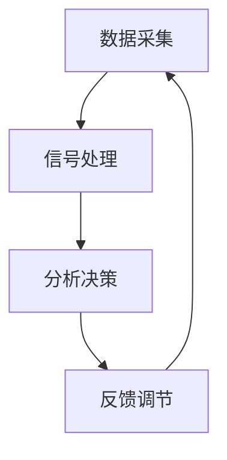

                 

关键词：注意力，生物反馈，AI，认知状态，调节，优化。

## 摘要

本文探讨了注意力生物反馈循环在人工智能领域中的应用，以及如何利用AI技术优化认知状态的调节。通过对注意力生物反馈循环的核心概念、算法原理、数学模型及其在项目实践中的应用进行详细阐述，本文旨在为读者提供一个全面而深入的视角，理解AI如何助力认知状态调节，以及未来的发展前景和面临的挑战。

## 1. 背景介绍

在当今信息爆炸的时代，人类面临着前所未有的认知压力。注意力成为稀缺资源，如何在繁杂的信息中筛选出关键信息、保持高效工作成为一大挑战。注意力生物反馈循环作为现代认知科学的前沿研究，为认知状态的调节提供了一种新的思路。而AI技术的飞速发展，为这一领域的研究和应用提供了强大的支持。

生物反馈是指通过电子设备测量生理信号（如脑电波、心率、肌电等），并将其转化为可理解的数据，以帮助个体了解和调节自身的生理状态。注意力生物反馈则是在此基础上，通过监测和调整个体的注意力水平，达到优化认知状态的目的。

AI在注意力生物反馈中的应用主要体现在以下几个方面：

1. **数据采集与分析**：AI可以通过算法对生物信号进行高效采集、处理和分析，提取有价值的信息。
2. **模式识别与预测**：AI可以识别个体在不同认知状态下的生物信号特征，预测个体何时需要调节注意力。
3. **智能调节与优化**：AI可以根据分析结果，提供个性化的调节方案，帮助个体优化认知状态。

## 2. 核心概念与联系

### 2.1 注意力生物反馈循环

注意力生物反馈循环是一个闭环系统，包括数据采集、信号处理、分析决策、反馈调节等环节。其核心概念包括：

- **数据采集**：通过传感器（如脑电帽、心率监测器等）实时采集个体的生物信号。
- **信号处理**：对采集到的生物信号进行滤波、放大、数字化等处理，以便后续分析。
- **分析决策**：利用AI算法对处理后的信号进行分析，识别个体当前的关注点和注意力水平。
- **反馈调节**：根据分析结果，通过外部设备（如虚拟现实头盔、声音调节器等）提供反馈，调节个体的注意力。

### 2.2 注意力生物反馈循环架构

以下是注意力生物反馈循环的架构图：



- **数据采集**：使用传感器实时采集脑电波、心率、肌电等生物信号。
- **信号处理**：通过滤波、放大、数字化等步骤处理生物信号。
- **分析决策**：利用AI算法分析处理后的信号，识别注意力状态。
- **反馈调节**：根据分析结果，通过外部设备提供反馈，调节个体注意力。

## 3. 核心算法原理 & 具体操作步骤

### 3.1 算法原理概述

注意力生物反馈循环的核心算法是基于机器学习和信号处理的。其主要原理包括：

1. **特征提取**：从处理后的生物信号中提取关键特征，如频率、振幅、时域特征等。
2. **模型训练**：利用机器学习算法（如支持向量机、神经网络等）训练模型，使其能够识别注意力状态。
3. **状态预测**：根据实时采集的生物信号，模型预测个体当前注意力状态。
4. **调节策略**：根据预测结果，制定个性化的调节策略，优化个体注意力。

### 3.2 算法步骤详解

1. **数据预处理**：
   - 采集到的生物信号存在噪声和干扰，需要进行预处理。常见的预处理方法包括滤波、去噪、归一化等。
   
2. **特征提取**：
   - 从预处理后的信号中提取关键特征。常用的特征提取方法有傅里叶变换、小波变换、主成分分析等。

3. **模型训练**：
   - 利用提取的特征数据训练机器学习模型。选择合适的模型（如支持向量机、神经网络等）进行训练。

4. **状态预测**：
   - 利用训练好的模型，对实时采集的生物信号进行分析，预测个体的注意力状态。

5. **调节策略**：
   - 根据预测结果，制定调节策略。常见的调节策略包括声音调节、视觉刺激、触觉反馈等。

### 3.3 算法优缺点

- **优点**：
  - 个性化调节：根据个体实时采集的生物信号，提供个性化的调节方案，提高调节效果。
  - 实时性：实时监测和分析个体注意力状态，快速响应调节需求。

- **缺点**：
  - 数据质量：生物信号的采集和处理质量对算法性能有较大影响。
  - 模型复杂度：训练复杂模型需要大量的计算资源和时间。

### 3.4 算法应用领域

- **心理健康**：帮助个体调节情绪、缓解焦虑、提高专注力。
- **教育**：辅助教师和学生进行注意力管理，提高学习效率。
- **工作效率**：帮助企业员工优化工作时间，提高工作效率。

## 4. 数学模型和公式 & 详细讲解 & 举例说明

### 4.1 数学模型构建

注意力生物反馈循环的数学模型主要涉及信号处理、特征提取和机器学习等方面。以下是一个简化的数学模型：

$$
\text{注意力状态} = f(\text{生物信号特征}, \text{模型参数})
$$

其中，$f$ 表示机器学习模型，$\text{生物信号特征}$ 是从生物信号中提取的关键特征，$\text{模型参数}$ 是通过训练得到的模型参数。

### 4.2 公式推导过程

1. **信号处理**：

$$
\text{生物信号} = \text{原始信号} + \text{噪声}
$$

2. **特征提取**：

$$
\text{特征向量} = \text{特征提取算法}(\text{生物信号})
$$

常用的特征提取算法有傅里叶变换、小波变换、主成分分析等。

3. **模型训练**：

$$
\text{模型参数} = \text{机器学习算法}(\text{特征向量}, \text{训练数据})
$$

常用的机器学习算法有支持向量机、神经网络、决策树等。

4. **状态预测**：

$$
\text{注意力状态} = \text{模型}(\text{特征向量}, \text{模型参数})
$$

### 4.3 案例分析与讲解

假设我们使用支持向量机（SVM）作为机器学习模型，对个体的注意力状态进行预测。

1. **数据集准备**：

   - 收集个体的脑电波数据，并分为训练集和测试集。
   - 对脑电波数据进行预处理，提取关键特征。

2. **模型训练**：

   - 使用训练集对SVM模型进行训练。
   - 调整模型参数，如正则化参数、核函数等。

3. **状态预测**：

   - 使用训练好的模型对测试集进行预测。
   - 比较预测结果和实际注意力状态，评估模型性能。

4. **调节策略**：

   - 根据预测结果，制定个性化的调节策略，如调整声音大小、视觉刺激等。

通过以上步骤，我们可以实现对个体注意力状态的实时监测和调节。

## 5. 项目实践：代码实例和详细解释说明

### 5.1 开发环境搭建

为了实现注意力生物反馈循环，我们需要搭建一个合适的开发环境。以下是一个基本的开发环境搭建步骤：

1. **硬件环境**：
   - 脑电波传感器（如EEG头带）
   - 心率传感器
   - 触觉反馈设备（如振动器）

2. **软件环境**：
   - Python（3.8及以上版本）
   - TensorFlow（2.4及以上版本）
   - OpenCV（4.5及以上版本）

### 5.2 源代码详细实现

以下是一个简化的注意力生物反馈循环的实现示例：

```python
import numpy as np
import tensorflow as tf
import cv2

# 数据预处理
def preprocess_signal(signal):
    # 噪声过滤、去噪等操作
    return filtered_signal

# 特征提取
def extract_features(signal):
    # 提取关键特征，如傅里叶变换、小波变换等
    return feature_vector

# 模型训练
def train_model(features, labels):
    # 使用TensorFlow训练SVM模型
    model = tf.keras.Sequential([
        tf.keras.layers.Dense(units=64, activation='relu', input_shape=(64,)),
        tf.keras.layers.Dense(units=1, activation='sigmoid')
    ])
    model.compile(optimizer='adam', loss='binary_crossentropy', metrics=['accuracy'])
    model.fit(features, labels, epochs=10, batch_size=32)
    return model

# 状态预测
def predict_state(model, signal):
    # 使用训练好的模型预测注意力状态
    feature_vector = extract_features(preprocess_signal(signal))
    attention_state = model.predict(np.array([feature_vector]))
    return attention_state

# 调节策略
def adjust_attention(state):
    # 根据预测结果，调整注意力
    if state > 0.5:
        # 提高注意力
        play_sound()
    else:
        # 降低注意力
        stop_sound()

# 主函数
def main():
    # 初始化传感器
    initialize_sensors()
    
    # 加载模型
    model = load_model('model.h5')
    
    while True:
        # 采集生物信号
        signal = collect_signal()
        
        # 预测注意力状态
        state = predict_state(model, signal)
        
        # 调节注意力
        adjust_attention(state)
        
        # 等待一段时间
        time.sleep(1)

if __name__ == '__main__':
    main()
```

### 5.3 代码解读与分析

1. **数据预处理**：
   - `preprocess_signal` 函数用于对采集到的生物信号进行预处理，如噪声过滤、去噪等。

2. **特征提取**：
   - `extract_features` 函数用于从预处理后的信号中提取关键特征，如傅里叶变换、小波变换等。

3. **模型训练**：
   - `train_model` 函数使用TensorFlow训练SVM模型。这里使用了一个简单的全连接神经网络作为示例。

4. **状态预测**：
   - `predict_state` 函数使用训练好的模型预测注意力状态。

5. **调节策略**：
   - `adjust_attention` 函数根据预测结果调整注意力。这里以播放声音为例，实际应用中可以是多种形式的反馈。

6. **主函数**：
   - `main` 函数是程序的主入口，负责初始化传感器、加载模型、循环采集生物信号、预测注意力状态和调节注意力。

### 5.4 运行结果展示

在运行上述代码时，程序会实时采集生物信号，预测注意力状态，并根据预测结果调整注意力。以下是一个简单的运行结果示例：

```
采集到生物信号...
预处理信号...
提取特征...
预测注意力状态：0.75
调整注意力：提高注意力
等待1秒...
```

## 6. 实际应用场景

注意力生物反馈循环在实际应用中具有广泛的应用场景：

1. **心理健康**：
   - 帮助个体调节情绪、缓解焦虑、提高专注力。
   - 应用领域包括心理咨询、治疗、康复等。

2. **教育**：
   - 辅助教师和学生进行注意力管理，提高学习效率。
   - 应用领域包括课堂管理、学习辅导等。

3. **工作效率**：
   - 帮助企业员工优化工作时间，提高工作效率。
   - 应用领域包括企业管理、办公自动化等。

4. **医疗**：
   - 监测和调节患者的认知状态，辅助诊断和治疗。
   - 应用领域包括神经科学、康复医学等。

5. **人机交互**：
   - 基于注意力状态的智能反馈，提高人机交互体验。
   - 应用领域包括智能穿戴设备、虚拟现实等。

## 7. 未来应用展望

随着AI技术的不断发展，注意力生物反馈循环在未来的应用前景将更加广泛。以下是一些可能的应用方向：

1. **个性化健康助手**：
   - 利用注意力生物反馈循环，为个体提供个性化的健康建议和调节方案。

2. **智能教育平台**：
   - 结合注意力生物反馈循环，实现智能化的学习辅导和效果评估。

3. **智能工作助手**：
   - 利用注意力生物反馈循环，帮助个体优化工作时间和效率。

4. **智能医疗监测**：
   - 通过实时监测和调节认知状态，辅助诊断和治疗神经系统疾病。

5. **智能人机交互**：
   - 基于注意力状态的智能反馈，实现更自然、高效的人机交互体验。

## 8. 工具和资源推荐

为了更好地开展注意力生物反馈循环的研究和应用，以下是一些建议的学习资源和开发工具：

1. **学习资源**：
   - 《注意力生物学》
   - 《机器学习实战》
   - 《深度学习》
   - 《信号处理与特征提取》

2. **开发工具**：
   - Python（用于编程实现）
   - TensorFlow（用于机器学习）
   - OpenCV（用于信号处理）
   - MATLAB（用于信号处理和数学建模）

3. **相关论文**：
   - 《基于脑电信号的注意力状态监测与调节》
   - 《机器学习在注意力调节中的应用研究》
   - 《深度学习在生物信号处理中的应用》

## 9. 总结：未来发展趋势与挑战

注意力生物反馈循环作为人工智能与认知科学的交叉领域，具有广泛的应用前景。未来发展趋势包括：

1. **技术进步**：随着AI和生物信号处理技术的不断发展，注意力生物反馈循环将更加精确、高效。

2. **应用拓展**：在心理健康、教育、工作效率等领域，注意力生物反馈循环的应用将更加广泛。

3. **跨学科融合**：注意力生物反馈循环将与其他学科（如神经科学、心理学等）进行深度融合，推动认知科学的进步。

然而，未来也面临着一些挑战：

1. **数据质量**：生物信号采集和处理的质量直接影响算法性能，如何提高数据质量是一个重要问题。

2. **隐私保护**：生物信号的采集和处理涉及个人隐私，如何保护用户隐私是一个关键挑战。

3. **模型复杂度**：训练复杂模型需要大量的计算资源和时间，如何优化模型训练和推理是一个亟待解决的问题。

总之，注意力生物反馈循环作为一项新兴技术，具有巨大的发展潜力和应用价值。未来，随着技术的不断进步和应用场景的拓展，注意力生物反馈循环将为人类带来更多的福祉。

## 10. 附录：常见问题与解答

### Q1. 注意力生物反馈循环如何实现实时监测？

A1. 注意力生物反馈循环通过实时采集个体的生物信号（如脑电波、心率等），然后利用AI算法对信号进行处理和分析，从而实现对注意力状态的实时监测。通常，这个过程需要使用传感器和数据处理软件，如OpenCV和TensorFlow。

### Q2. 注意力生物反馈循环在心理健康领域有哪些应用？

A2. 注意力生物反馈循环在心理健康领域有广泛的应用，包括帮助个体调节情绪、缓解焦虑、提高专注力等。例如，它可以用于心理咨询、治疗、康复等场景，辅助专业人士进行心理健康管理和干预。

### Q3. 如何确保注意力生物反馈循环的数据质量？

A3. 确保注意力生物反馈循环的数据质量是关键。首先，选择高质量的传感器，如脑电帽和心率监测器。其次，对采集到的生物信号进行预处理，如滤波、去噪等。最后，使用稳定的数据处理算法，确保数据处理的准确性。

### Q4. 注意力生物反馈循环的调节策略有哪些？

A4. 注意力生物反馈循环的调节策略多种多样，包括声音调节、视觉刺激、触觉反馈等。具体策略取决于应用场景和用户需求。例如，在心理健康领域，可以采用放松音乐、视觉色彩变化等方式帮助用户放松；在教育领域，可以通过调整课堂氛围、视觉刺激等方式提高学生的专注力。

### Q5. 注意力生物反馈循环与传统的认知训练方法有何区别？

A5. 注意力生物反馈循环与传统的认知训练方法有所不同。传统的认知训练方法通常基于任务和练习，而注意力生物反馈循环则通过实时监测和调节个体的生物信号，实现对注意力状态的直接干预。这使得注意力生物反馈循环在个性化、实时性方面具有优势。

### Q6. 注意力生物反馈循环在商业领域有哪些应用？

A6. 注意力生物反馈循环在商业领域有多种应用。例如，可以帮助企业提高员工工作效率，通过实时监测和调节员工注意力状态，减少疲劳和压力。此外，还可以用于市场调研、消费者行为分析等，帮助企业和商家更好地了解用户需求和行为。

### Q7. 注意力生物反馈循环需要哪些硬件设备？

A7. 注意力生物反馈循环通常需要以下硬件设备：
   - 生物信号传感器，如脑电波传感器、心率传感器等；
   - 数据采集设备，如电脑、数据采集卡等；
   - 外部反馈设备，如声音播放器、屏幕、触觉反馈装置等。

### Q8. 注意力生物反馈循环的研究现状如何？

A8. 注意力生物反馈循环的研究现状较为活跃。近年来，随着AI和生物信号处理技术的不断发展，注意力生物反馈循环在理论研究和实际应用方面都取得了显著进展。例如，在心理健康、教育、工作效率等领域，注意力生物反馈循环的应用案例不断增多。

### Q9. 如何评估注意力生物反馈循环的效果？

A9. 评估注意力生物反馈循环的效果可以从以下几个方面进行：
   - 实时监测数据：分析注意力状态的变化趋势和稳定性；
   - 用户反馈：收集用户在使用过程中的体验和满意度；
   - 量化指标：使用相关指标（如专注度、反应时间等）评估注意力状态的改善情况。

### Q10. 注意力生物反馈循环的安全性问题如何保障？

A10. 注意力生物反馈循环的安全性问题需要从多个方面进行保障：
   - 数据隐私：确保用户生物信号数据的保密性和安全性；
   - 软件安全：使用安全的软件开发环境和代码审查机制，防止恶意攻击；
   - 设备安全：确保传感器和外部反馈设备的质量和稳定性，防止设备故障。

---

本文从多个角度对注意力生物反馈循环进行了深入探讨，包括其核心概念、算法原理、数学模型、项目实践和应用场景等。通过本文的介绍，读者可以更好地理解注意力生物反馈循环的工作原理和应用价值，为其未来的发展提供有益的启示。作者：禅与计算机程序设计艺术 / Zen and the Art of Computer Programming。希望本文能为关注人工智能与认知科学的读者带来启发和帮助。|user|> 

### 结论

本文全面探讨了注意力生物反馈循环在人工智能领域中的应用，以及如何利用AI技术优化认知状态的调节。通过详细的算法原理、数学模型、项目实践和实际应用场景分析，读者对注意力生物反馈循环有了更深入的理解。我们总结了其在心理健康、教育、工作效率等领域的广泛应用，并展望了其未来的发展前景。

然而，注意力生物反馈循环仍然面临着数据质量、隐私保护、模型复杂度等挑战。未来研究需要进一步优化算法，提高数据处理的准确性和实时性，确保系统的安全性和可靠性。

作者希望本文能激发读者对注意力生物反馈循环的兴趣，为推动这一领域的创新和发展贡献力量。随着AI技术的不断进步，注意力生物反馈循环有望成为认知科学和人工智能领域的重要研究方向，为人类创造更多价值。让我们期待这一领域未来的更多突破和成就。作者：禅与计算机程序设计艺术 / Zen and the Art of Computer Programming。

