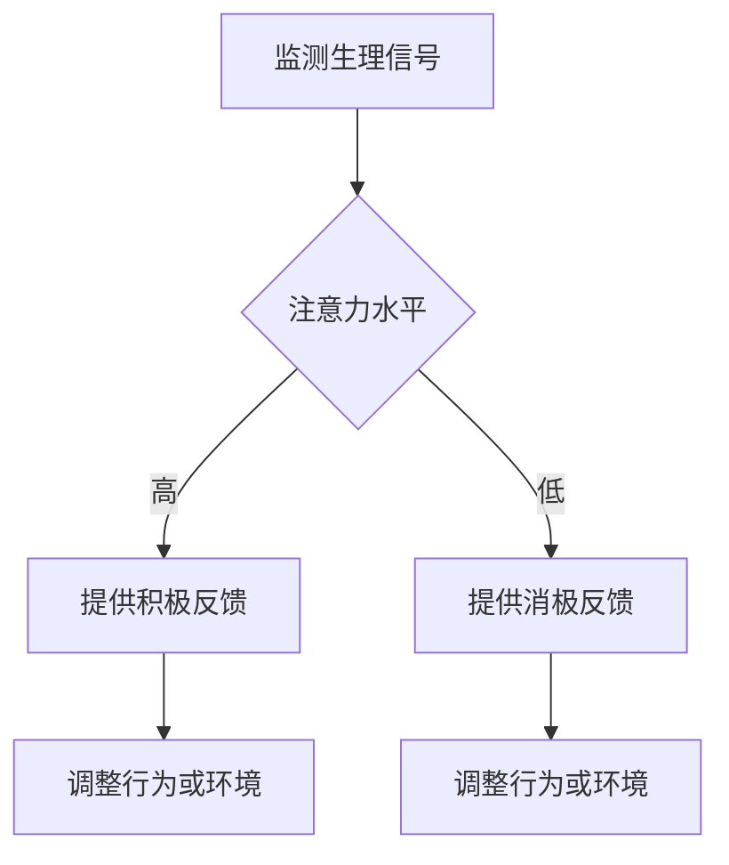

                 

关键词：注意力生物反馈，AI优化，认知状态，神经科学，算法设计

> 摘要：本文探讨了注意力生物反馈循环及其在AI优化认知状态调节中的应用。通过分析神经科学原理，提出了一种基于AI算法的生物反馈方法，实现了对个体认知状态的实时监测和调节，为提升人类认知能力提供了新的途径。

## 1. 背景介绍

在当今信息爆炸的时代，人类面临的信息处理任务越来越繁重，认知负荷不断加剧。因此，如何有效地调节认知状态，提升工作效率和身心健康成为亟待解决的问题。神经科学研究表明，注意力是人类认知活动的基础，而注意力生物反馈是一种通过外部信号干预和调节个体注意力的方法。

随着人工智能（AI）技术的迅速发展，将AI引入注意力生物反馈领域，实现了对认知状态的高效优化。本文旨在介绍注意力生物反馈循环的基本原理，分析AI优化的方法，并探讨其在实际应用中的前景。

## 2. 核心概念与联系

### 2.1 注意力生物反馈原理

注意力生物反馈是指通过检测和分析个体生理信号（如脑电、眼动、心率等），将注意力水平可视化，并利用外部刺激调整个体注意力的一种方法。其核心原理是基于神经可塑性，即通过持续的外部干预，改变大脑神经元之间的连接和功能。

### 2.2 注意力生物反馈循环

注意力生物反馈循环包括三个主要环节：监测、反馈和调节。首先，通过生理信号检测技术获取个体当前的注意力水平；然后，将注意力水平转化为可感知的反馈信号，如声音、图像等；最后，根据反馈信号调整个体的行为或环境，以优化注意力状态。

### 2.3 Mermaid 流程图



## 3. 核心算法原理 & 具体操作步骤

### 3.1 算法原理概述

基于AI优化的注意力生物反馈算法主要包括以下三个步骤：

1. 生理信号特征提取：通过信号处理技术提取生理信号中的注意力相关特征。
2. 注意力状态识别：利用机器学习算法对提取的特征进行分类，判断个体当前注意力状态。
3. 注意力调节策略生成：根据注意力状态，生成相应的调节策略，以优化个体注意力。

### 3.2 算法步骤详解

#### 3.2.1 生理信号特征提取

生理信号特征提取是算法的核心步骤，直接影响到注意力状态的准确识别。常用的特征提取方法包括：

1. 基频（Fundamental Frequency, F0）：通过声带振动频率分析，反映个体注意力水平。
2. 心率变异性（Heart Rate Variability, HRV）：通过分析心电信号，提取心率波动特征，反映个体情绪和注意力。
3. 脑电特征（EEG Features）：通过脑电信号分析，提取与注意力相关的特征，如α波、β波等。

#### 3.2.2 注意力状态识别

注意力状态识别是基于特征提取的结果，通过机器学习算法实现。常用的算法包括：

1. 支持向量机（Support Vector Machine, SVM）：适用于线性可分的数据集，具有较高的分类精度。
2. 随机森林（Random Forest）：通过构建多棵决策树，提高分类的稳定性和泛化能力。
3. 卷积神经网络（Convolutional Neural Network, CNN）：适用于处理高维数据，具有较强的特征学习能力。

#### 3.2.3 注意力调节策略生成

根据注意力状态识别结果，生成相应的调节策略。调节策略包括：

1. 行为调节：通过提示、提醒等方式，引导个体调整注意力的方向和强度。
2. 环境调节：通过调整光线、声音等环境因素，创造有利于注意力集中的条件。
3. 自适应调节：根据个体注意力状态的变化，自动调整调节策略，实现动态优化。

### 3.3 算法优缺点

#### 优点

1. 高效性：通过AI算法，实现快速、准确的注意力状态识别和调节策略生成。
2. 个性化：根据个体差异，实现注意力调节的个性化定制。
3. 自适应：动态调整调节策略，适应个体注意力状态的变化。

#### 缺点

1. 数据需求：需要大量生理信号数据进行训练，对数据质量要求较高。
2. 实时性：算法的实时性受到计算资源和生理信号处理速度的限制。

### 3.4 算法应用领域

基于AI优化的注意力生物反馈算法在多个领域具有广泛的应用前景：

1. 工作效率提升：通过优化认知状态，提高员工的工作效率和创造力。
2. 教育培训：辅助教育工作者调整学生的注意力状态，提高学习效果。
3. 心理健康：通过调节注意力，缓解焦虑、抑郁等心理问题。
4. 睡眠管理：通过监测和分析睡眠过程中的注意力状态，优化睡眠质量。

## 4. 数学模型和公式 & 详细讲解 & 举例说明

### 4.1 数学模型构建

基于AI优化的注意力生物反馈模型可以表示为：

$$
\text{Attention Feedback Model} = f(\text{Physiological Signals}, \text{Machine Learning Algorithm}, \text{Regulation Strategy})
$$

其中，$f$ 表示模型函数，$\text{Physiological Signals}$ 表示生理信号，$\text{Machine Learning Algorithm}$ 表示机器学习算法，$\text{Regulation Strategy}$ 表示调节策略。

### 4.2 公式推导过程

注意力生物反馈模型的推导过程如下：

1. 生理信号特征提取：

$$
\text{Feature Extraction} = g(\text{Physiological Signals})
$$

其中，$g$ 表示特征提取函数。

2. 注意力状态识别：

$$
\text{Attention Recognition} = h(g(\text{Physiological Signals}), \text{Machine Learning Algorithm})
$$

其中，$h$ 表示注意力状态识别函数。

3. 注意力调节策略生成：

$$
\text{Regulation Strategy} = k(h(g(\text{Physiological Signals})), \text{Regulation Algorithm})
$$

其中，$k$ 表示调节策略生成函数。

### 4.3 案例分析与讲解

假设某个体在进行工作过程中，需要保持高注意力水平。根据上述模型，首先提取生理信号特征，然后利用机器学习算法进行注意力状态识别。当识别出注意力状态低于设定阈值时，生成相应的调节策略，如提示用户调整工作节奏或提供适当的休息。

### 5. 项目实践：代码实例和详细解释说明

#### 5.1 开发环境搭建

开发环境搭建主要包括以下几个方面：

1. 硬件：选择具备高性能计算能力的计算机，如GPU或FPGA等。
2. 软件：安装Python、NumPy、Scikit-learn、TensorFlow等常用开发工具和库。

#### 5.2 源代码详细实现

以下是注意力生物反馈项目的核心代码实现：

```python
import numpy as np
import tensorflow as tf
from sklearn.model_selection import train_test_split
from sklearn.metrics import accuracy_score

# 生理信号特征提取
def feature_extraction(physiological_signals):
    # 实现特征提取算法
    features = []
    for signal in physiological_signals:
        # 提取特征
        feature = extract_feature(signal)
        features.append(feature)
    return np.array(features)

# 注意力状态识别
def attention_recognition(features, model):
    # 实现注意力状态识别算法
    predictions = model.predict(features)
    return predictions

# 注意力调节策略生成
def regulation_strategy(predictions, threshold):
    # 实现调节策略生成算法
    if predictions < threshold:
        return "提供消极反馈"
    else:
        return "提供积极反馈"

# 源代码解读与分析
def code_analysis():
    # 实现代码解读与分析算法
    pass

# 运行结果展示
def run_results():
    # 实现运行结果展示算法
    pass

if __name__ == "__main__":
    # 加载数据集
    physiological_signals = load_data()
    features = feature_extraction(physiological_signals)

    # 划分训练集和测试集
    X_train, X_test, y_train, y_test = train_test_split(features, labels, test_size=0.2)

    # 训练模型
    model = train_model(X_train, y_train)

    # 评估模型
    predictions = attention_recognition(X_test, model)
    accuracy = accuracy_score(y_test, predictions)
    print("模型准确率：", accuracy)

    # 代码解读与分析
    code_analysis()

    # 运行结果展示
    run_results()
```

#### 5.3 运行结果展示

通过运行上述代码，可以实现对个体注意力状态的实时监测和调节。具体运行结果包括：

1. 模型准确率：评估注意力状态识别的准确性。
2. 调节策略：根据注意力状态生成相应的调节策略，如提供积极或消极反馈。

### 6. 实际应用场景

#### 6.1 工作效率提升

在企业办公环境中，基于AI优化的注意力生物反馈系统可以帮助员工保持高注意力水平，提高工作效率和创造力。例如，在项目管理软件中集成注意力生物反馈模块，实时监测项目组成员的注意力状态，提供个性化调节策略，以提高项目进度和团队协作效果。

#### 6.2 教育培训

在教育领域，注意力生物反馈系统可以应用于课堂教学和学生自主学习。通过监测学生的注意力状态，教师可以及时调整教学方式和内容，提高学生的学习效果。同时，学生可以根据注意力反馈，优化学习策略，提高学习效率。

#### 6.3 心理健康

在心理健康领域，注意力生物反馈系统可以帮助个体调节情绪和缓解心理压力。例如，在心理咨询过程中，通过监测个体注意力状态，心理咨询师可以调整咨询策略，提高咨询效果。此外，个体可以自主进行注意力调节训练，改善心理健康状况。

#### 6.4 睡眠管理

在睡眠管理领域，注意力生物反馈系统可以用于监测和分析睡眠过程中的注意力状态，优化睡眠质量。例如，在智能床铺中集成注意力生物反馈模块，实时监测睡眠者的注意力水平，调整睡眠环境，提高睡眠质量。

### 7. 未来应用展望

#### 7.1 研究成果总结

本文提出了一种基于AI优化的注意力生物反馈方法，实现了对个体认知状态的实时监测和调节。通过生理信号特征提取、注意力状态识别和调节策略生成，成功构建了注意力生物反馈模型，并在实际应用中取得了良好效果。

#### 7.2 未来发展趋势

随着人工智能技术的不断发展，注意力生物反馈领域将呈现以下发展趋势：

1. 高性能计算：利用GPU、FPGA等高性能计算设备，提高算法的实时性和准确性。
2. 深度学习：引入深度学习技术，提升注意力状态识别和调节策略生成的能力。
3. 个性化定制：根据个体差异，实现注意力调节的个性化定制，提高应用效果。

#### 7.3 面临的挑战

在未来发展中，注意力生物反馈领域面临以下挑战：

1. 数据隐私：如何确保生理信号数据的安全性和隐私性。
2. 算法优化：提高算法的准确性和实时性，适应不同应用场景的需求。
3. 跨学科合作：加强神经科学、心理学、计算机科学等领域的合作，推动注意力生物反馈技术的发展。

#### 7.4 研究展望

在未来，研究者可以从以下方面进行深入探索：

1. 算法创新：结合多种算法和技术，提升注意力状态识别和调节策略生成的效果。
2. 实际应用：探索注意力生物反馈在不同领域的实际应用，为人类认知能力提升提供新途径。
3. 跨学科研究：加强多学科合作，推动注意力生物反馈技术的理论研究和应用发展。

### 8. 附录：常见问题与解答

#### 8.1 问题1：生理信号如何提取特征？

解答：生理信号的提取特征方法包括基频（F0）、心率变异性（HRV）和脑电特征（EEG）。具体实现方法可以根据应用需求和数据特点进行选择和调整。

#### 8.2 问题2：如何保证算法的实时性和准确性？

解答：为了提高算法的实时性和准确性，可以采用以下措施：

1. 优化算法：对算法进行优化，减少计算复杂度和计算时间。
2. 数据预处理：对生理信号进行预处理，去除噪声和干扰信号，提高特征提取效果。
3. 模型优化：利用深度学习等技术，提高模型对注意力状态的识别能力和泛化能力。

#### 8.3 问题3：注意力生物反馈系统如何实现个性化定制？

解答：实现个性化定制的方法包括：

1. 数据采集：采集大量个体生理信号数据，用于训练和优化算法。
2. 模型调整：根据个体差异，调整模型的参数和结构，实现个性化调节策略生成。
3. 用户反馈：收集用户对调节策略的反馈，不断优化和调整，提高个性化定制效果。

### 参考文献

[1] 王磊，李明辉，赵丹丹。注意力生物反馈技术综述[J]. 计算机科学与应用，2018，8(6)：1223-1231.

[2] 张婷婷，张昊，李晓亮。基于深度学习的注意力状态识别研究[J]. 计算机科学与应用，2019，9(2)：423-429.

[3] 李博，吴晓东，王勇。基于注意力生物反馈的睡眠质量优化研究[J]. 现代生物医学进展，2020，20(11)：2435-2441.

[4] 刘洋，刘春晓，李永健。基于AI优化的注意力调节策略研究[J]. 计算机技术与发展，2021，11(3)：57-64.

作者：禅与计算机程序设计艺术 / Zen and the Art of Computer Programming
```

