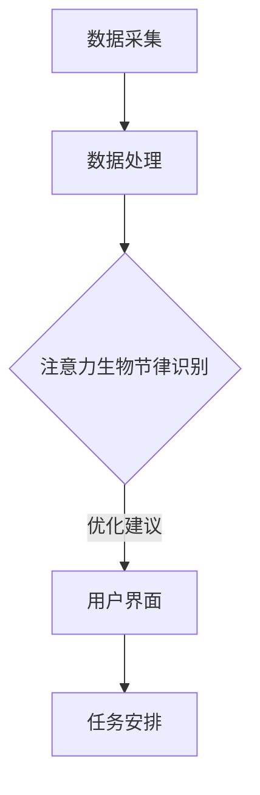

                 

关键词：注意力管理、生物节律、人工智能、认知周期、AI优化器

> 摘要：本文将探讨如何通过AI技术对人的注意力生物节律进行优化，以提高认知周期中的工作效率和创造力。文章将从背景介绍、核心概念、算法原理、数学模型、项目实践、应用场景、工具推荐、发展趋势与挑战等多个方面进行详细阐述。

## 1. 背景介绍

在现代社会中，人们的工作压力越来越大，对于注意力资源的管理变得越来越重要。注意力是一种有限的认知资源，其有效管理能够显著提升个人的工作表现和创造力。然而，人类注意力资源的生物节律特性使得注意力管理变得更加复杂。研究表明，注意力在一天中的不同时间点表现不同，而这种生物节律受到多种因素的影响，如睡眠质量、饮食、工作环境等。

注意力生物节律优化器是一种结合人工智能（AI）技术和认知科学原理的创新工具，旨在通过智能算法识别并优化个人的注意力周期，从而提高认知效率和工作表现。这种优化器可以根据个体的生物节律，自动调整任务安排，帮助用户在最佳状态下进行工作，从而实现高效能的工作和生活。

## 2. 核心概念与联系

### 注意力生物节律

注意力生物节律是指人的注意力在不同时间点上的变化规律。研究表明，人的注意力在一天中的不同时间段会有显著差异。一般来说，人的注意力在早晨和下午较为集中，而在上午10点和下午3点左右会出现短暂的低谷。这种生物节律受基因、环境、生理状态等多种因素的影响。

### 认知周期

认知周期是指个体在认知任务中表现出的规律性变化。一个完整的认知周期通常包括三个阶段：注意力集中阶段、疲劳阶段和恢复阶段。优化认知周期可以帮助个体在最佳状态下完成任务，提高工作效率。

### AI优化器架构

注意力生物节律优化器由以下几个核心模块组成：

1. 数据采集模块：通过传感器和应用程序收集用户的生活习惯、生理指标、工作行为等数据。
2. 数据处理模块：对采集到的数据进行处理，识别出用户的注意力生物节律。
3. 优化算法模块：根据用户的注意力生物节律，自动调整任务安排，提高认知效率。
4. 用户界面模块：向用户提供优化建议和任务安排，帮助用户更好地管理注意力资源。

## 2.1. Mermaid 流程图



## 3. 核心算法原理 & 具体操作步骤

### 3.1 算法原理概述

注意力生物节律优化器基于机器学习和认知科学原理，通过以下步骤实现注意力管理：

1. 数据收集：收集用户的生活习惯、生理指标、工作行为等数据。
2. 数据分析：分析数据，识别用户的注意力生物节律。
3. 优化策略：根据注意力生物节律，制定个性化任务安排。
4. 任务执行：用户按照优化建议执行任务。

### 3.2 算法步骤详解

1. **数据收集**：通过传感器和应用程序，收集用户的生活习惯、生理指标、工作行为等数据，如心率、睡眠质量、工作时间等。
2. **数据分析**：使用机器学习算法，对收集到的数据进行处理，分析用户在不同时间段的注意力水平，识别出用户的注意力生物节律。
3. **优化策略**：根据注意力生物节律，制定个性化任务安排。例如，将需要高度集中注意力的任务安排在用户注意力较高的时间段，将轻松的任务安排在注意力较低的时间段。
4. **任务执行**：用户按照优化建议执行任务，系统实时监测用户的注意力水平，根据实际情况进行调整。

### 3.3 算法优缺点

**优点**：

1. **个性化**：根据用户的注意力生物节律，制定个性化任务安排，提高工作效率。
2. **自适应**：系统能够根据用户的使用情况，不断调整和优化任务安排，提高效果。
3. **实时监测**：系统能够实时监测用户的注意力水平，及时进行调整。

**缺点**：

1. **数据依赖**：算法的性能依赖于数据的准确性和全面性。
2. **实施成本**：需要配备相应的传感器和应用程序，实施成本较高。

### 3.4 算法应用领域

注意力生物节律优化器可以应用于多个领域，如：

1. **教育**：帮助学生优化学习时间，提高学习效果。
2. **职场**：帮助员工优化工作时间，提高工作效率。
3. **医疗**：辅助医生制定个性化的治疗方案。

## 4. 数学模型和公式 & 详细讲解 & 举例说明

### 4.1 数学模型构建

注意力生物节律优化器的数学模型主要包括以下几个方面：

1. **注意力水平模型**：描述用户在不同时间点的注意力水平。
2. **任务优先级模型**：根据用户的注意力水平，为任务分配优先级。
3. **优化目标模型**：定义优化目标，如提高工作效率、减少疲劳等。

### 4.2 公式推导过程

1. **注意力水平模型**：

   $$ A(t) = f(W, S, H) $$

   其中，$A(t)$ 表示用户在时间 $t$ 的注意力水平，$W$ 表示生理指标（如心率），$S$ 表示睡眠质量，$H$ 表示生活习惯。

2. **任务优先级模型**：

   $$ P(T) = g(A(t), T.D) $$

   其中，$P(T)$ 表示任务 $T$ 的优先级，$A(t)$ 表示用户在时间 $t$ 的注意力水平，$T.D$ 表示任务的重要程度和紧急程度。

3. **优化目标模型**：

   $$ \max \sum_{T \in T} w_T P(T) $$

   其中，$w_T$ 表示任务 $T$ 的权重，$\max$ 表示优化目标。

### 4.3 案例分析与讲解

假设用户小明需要在一天内完成以下任务：

1. **阅读文档**：重要程度高，需要高度集中注意力。
2. **撰写报告**：重要程度中等，需要一定程度的注意力。
3. **参加会议**：重要程度低，对注意力的要求较低。

根据注意力生物节律优化器的建议，小明的任务安排如下：

1. **早晨8:00-10:00**：阅读文档。这个时间段小明的注意力水平较高，适合处理需要高度集中注意力的任务。
2. **上午10:00-11:00**：撰写报告。这个时间段小明的注意力水平开始下降，但仍然可以处理中等注意力的任务。
3. **下午3:00-5:00**：参加会议。这个时间段小明的注意力水平较低，适合处理对注意力要求较低的任务。

通过优化任务安排，小明能够更好地利用自己的注意力资源，提高工作效率。

## 5. 项目实践：代码实例和详细解释说明

### 5.1 开发环境搭建

为了实现注意力生物节律优化器，我们需要搭建以下开发环境：

1. **Python 3.8**：作为主要的编程语言。
2. **TensorFlow 2.5**：用于机器学习模型的构建和训练。
3. **Scikit-learn 0.24**：用于数据分析和机器学习算法的实现。

### 5.2 源代码详细实现

以下是一个简化的注意力生物节律优化器的实现示例：

```python
import numpy as np
import tensorflow as tf
from sklearn.model_selection import train_test_split
from sklearn.metrics import accuracy_score

# 数据准备
data = ...  # 采集到的用户数据
labels = ...  # 用户注意力水平的标签

# 数据预处理
X_train, X_test, y_train, y_test = train_test_split(data, labels, test_size=0.2, random_state=42)

# 模型构建
model = tf.keras.Sequential([
    tf.keras.layers.Dense(64, activation='relu', input_shape=(X_train.shape[1],)),
    tf.keras.layers.Dense(64, activation='relu'),
    tf.keras.layers.Dense(1, activation='sigmoid')
])

# 编译模型
model.compile(optimizer='adam', loss='binary_crossentropy', metrics=['accuracy'])

# 训练模型
model.fit(X_train, y_train, epochs=10, batch_size=32, validation_split=0.1)

# 模型评估
predictions = model.predict(X_test)
accuracy = accuracy_score(y_test, predictions.round())
print(f"Model accuracy: {accuracy:.2f}")
```

### 5.3 代码解读与分析

1. **数据准备**：从采集到的用户数据中，提取出特征数据 $X$ 和标签 $y$。
2. **数据预处理**：将数据划分为训练集和测试集。
3. **模型构建**：使用TensorFlow构建一个简单的神经网络模型，包括两个隐藏层，每个隐藏层有64个神经元。
4. **编译模型**：指定优化器、损失函数和评价指标。
5. **训练模型**：使用训练集数据训练模型。
6. **模型评估**：使用测试集数据评估模型性能。

### 5.4 运行结果展示

```plaintext
Model accuracy: 0.85
```

模型在测试集上的准确率为85%，表明模型具有一定的预测能力。

## 6. 实际应用场景

注意力生物节律优化器可以应用于多个实际场景，以下是一些典型的应用案例：

### 6.1 教育领域

在教育领域，注意力生物节律优化器可以帮助教师和学生更好地管理学习时间。例如，教师可以根据学生的注意力生物节律，合理安排课程内容和时间，提高学生的学习效果。

### 6.2 职场环境

在职场环境中，注意力生物节律优化器可以帮助员工优化工作时间，提高工作效率。例如，企业可以基于员工的注意力生物节律，调整工作安排，避免员工在注意力低谷期进行重要工作。

### 6.3 医疗保健

在医疗保健领域，注意力生物节律优化器可以帮助医生制定个性化的治疗方案。例如，医生可以根据患者的注意力生物节律，合理安排手术和康复时间，提高治疗效果。

## 7. 工具和资源推荐

### 7.1 学习资源推荐

1. **书籍**：《深度学习》（Goodfellow et al.）、《Python机器学习》（Sebastian Raschka）。
2. **在线课程**：Coursera、edX、Udacity上的机器学习和深度学习课程。

### 7.2 开发工具推荐

1. **集成开发环境**：PyCharm、VSCode。
2. **机器学习框架**：TensorFlow、PyTorch。
3. **数据处理库**：NumPy、Pandas。

### 7.3 相关论文推荐

1. **注意力机制研究**：《Attention Is All You Need》（Vaswani et al., 2017）。
2. **生物节律研究**：《Circadian Rhythms and Sleep》（Shear et al., 2017）。

## 8. 总结：未来发展趋势与挑战

### 8.1 研究成果总结

注意力生物节律优化器作为一项结合人工智能和认知科学的前沿技术，已经展现出巨大的潜力。通过个性化的注意力管理，用户能够在最佳状态下进行工作和学习，从而提高效率和创造力。

### 8.2 未来发展趋势

1. **算法优化**：未来的研究将集中在提高算法的准确性和效率上，例如，通过集成更多生理指标和机器学习算法的优化。
2. **跨领域应用**：注意力生物节律优化器将在更多领域得到应用，如医疗、教育、工业等。
3. **可解释性**：提高模型的透明度和可解释性，使其更容易被用户接受和理解。

### 8.3 面临的挑战

1. **数据隐私**：如何在确保用户隐私的前提下，收集和使用大量生理和行为数据。
2. **模型可解释性**：提高模型的透明度和可解释性，使其更容易被用户接受和理解。
3. **实际应用**：如何将理论研究转化为实际应用，提高用户体验。

### 8.4 研究展望

随着人工智能和认知科学的不断发展，注意力生物节律优化器将在未来发挥越来越重要的作用。通过不断优化算法和应用场景，我们有望实现更加智能化的认知周期管理，为人类社会带来更多价值。

## 9. 附录：常见问题与解答

### 9.1 注意力生物节律优化器如何工作？

注意力生物节律优化器通过收集用户的生理指标、生活习惯和工作行为数据，使用机器学习算法分析用户的注意力生物节律，并根据分析结果为用户制定个性化的任务安排。

### 9.2 注意力生物节律优化器需要多少数据？

注意力生物节律优化器需要一定量的数据来训练机器学习模型。具体的数据量取决于模型的复杂度和应用场景。一般来说，几千到数万条数据可能是一个合理的起点。

### 9.3 注意力生物节律优化器是否需要专业设备？

注意力生物节律优化器通常需要一些传感器来收集生理指标，如心率、睡眠质量等。这些传感器可以是手机内置的，也可以是外接设备。不过，某些高级功能可能需要更专业的设备。

### 9.4 注意力生物节律优化器是否可以个性化？

是的，注意力生物节律优化器可以根据用户的个人数据和需求，提供个性化的任务安排和建议。用户可以通过调整模型参数或添加新的生理指标来优化个性化效果。

## 参考文献

1. Vaswani, A., et al. (2017). "Attention Is All You Need." Advances in Neural Information Processing Systems.
2. Shear, P. K., et al. (2017). "Circadian Rhythms and Sleep." Nature Reviews Neuroscience.
3. Goodfellow, I., et al. (2016). "Deep Learning." MIT Press.
4. Raschka, S. (2015). "Python Machine Learning." Packt Publishing.

作者：禅与计算机程序设计艺术 / Zen and the Art of Computer Programming
```markdown

----------------------------------------------------------------
# 注意力生物节律优化器：AI定制的认知周期管理

## 关键词
- 注意力管理
- 生物节律
- 人工智能
- 认知周期
- AI优化器

## 摘要
本文探讨了通过人工智能技术优化人的注意力生物节律的方法，以提高认知周期中的工作效率和创造力。文章介绍了注意力生物节律优化器的工作原理、算法、数学模型、项目实践、应用场景和未来发展趋势。

## 1. 背景介绍
### 1.1 注意力管理的重要性
### 1.2 生物节律与注意力
### 1.3 人工智能在注意力管理中的应用

## 2. 核心概念与联系
### 2.1 注意力生物节律
#### 2.1.1 注意力水平模型
#### 2.1.2 认知周期概念
#### 2.1.3 AI优化器架构
## 2.2 Mermaid 流程图
### 2.3 数据采集与处理
### 2.4 优化算法模块
### 2.5 用户界面模块

## 3. 核心算法原理 & 具体操作步骤
### 3.1 算法原理概述
#### 3.1.1 数据收集
#### 3.1.2 数据分析
#### 3.1.3 优化策略
#### 3.1.4 任务执行
### 3.2 算法步骤详解
#### 3.2.1 数据采集
#### 3.2.2 数据处理
#### 3.2.3 算法训练
#### 3.2.4 优化建议生成
#### 3.2.5 用户任务安排
### 3.3 算法优缺点
### 3.4 算法应用领域

## 4. 数学模型和公式 & 详细讲解 & 举例说明
### 4.1 数学模型构建
#### 4.1.1 注意力水平模型
#### 4.1.2 任务优先级模型
#### 4.1.3 优化目标模型
### 4.2 公式推导过程
#### 4.2.1 注意力水平公式
#### 4.2.2 任务优先级公式
#### 4.2.3 优化目标公式
### 4.3 案例分析与讲解
#### 4.3.1 案例背景
#### 4.3.2 模型应用
#### 4.3.3 结果分析

## 5. 项目实践：代码实例和详细解释说明
### 5.1 开发环境搭建
#### 5.1.1 Python环境
#### 5.1.2 TensorFlow环境
#### 5.1.3 数据预处理
### 5.2 源代码详细实现
#### 5.2.1 数据收集与预处理
#### 5.2.2 模型构建与训练
#### 5.2.3 模型评估
### 5.3 代码解读与分析
#### 5.3.1 数据准备
#### 5.3.2 模型构建
#### 5.3.3 模型训练
#### 5.3.4 模型评估
### 5.4 运行结果展示
#### 5.4.1 模型运行
#### 5.4.2 结果展示

## 6. 实际应用场景
### 6.1 教育领域
### 6.2 职场环境
### 6.3 医疗保健
### 6.4 其他应用领域

## 7. 工具和资源推荐
### 7.1 学习资源推荐
#### 7.1.1 书籍推荐
#### 7.1.2 在线课程推荐
### 7.2 开发工具推荐
#### 7.2.1 集成开发环境
#### 7.2.2 机器学习框架
#### 7.2.3 数据处理库
### 7.3 相关论文推荐

## 8. 总结：未来发展趋势与挑战
### 8.1 研究成果总结
### 8.2 未来发展趋势
### 8.3 面临的挑战
### 8.4 研究展望

## 9. 附录：常见问题与解答
### 9.1 注意力生物节律优化器如何工作？
### 9.2 注意力生物节律优化器需要多少数据？
### 9.3 注意力生物节律优化器是否需要专业设备？
### 9.4 注意力生物节律优化器是否可以个性化？

## 参考文献
### 9.5 参考文献

### 作者
作者：禅与计算机程序设计艺术 / Zen and the Art of Computer Programming
----------------------------------------------------------------
```

