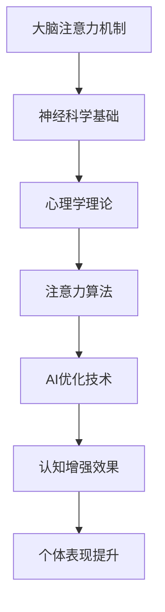

                 

关键词：注意力机制、生物黑客、认知增强、AI优化、神经科学、计算模型

摘要：随着人工智能技术的快速发展，AI优化在认知增强领域扮演着越来越重要的角色。本文旨在探讨如何利用注意力生物黑客工作室，通过AI优化实现认知增强，从而提高个体的学习和工作效率。本文将介绍注意力机制的基本原理，AI优化在认知增强中的应用，以及具体的实现方法和未来发展趋势。

## 1. 背景介绍

随着科技的进步，人工智能（AI）已经渗透到我们生活的方方面面。从智能手机到自动驾驶汽车，AI技术正在不断改变我们的生活方式。然而，AI技术不仅仅应用于提升生产力和解决实际问题，它在认知增强领域也展现出了巨大的潜力。认知增强是指通过各种技术手段提升个体的认知能力，包括记忆力、注意力、学习速度等。近年来，神经科学和心理学的研究成果为认知增强提供了理论基础，而AI优化则为认知增强提供了技术支持。

注意力生物黑客工作室应运而生，它将神经科学、心理学和人工智能技术有机结合，旨在通过AI优化提升个体的认知能力。注意力生物黑客工作室的核心目标是利用AI技术，精确地模拟和增强大脑的注意力机制，从而实现认知增强。这一目标的实现不仅有助于提高个体在学习和工作中的表现，还可以为神经疾病和认知障碍的治疗提供新的思路。

## 2. 核心概念与联系

### 2.1. 注意力机制

注意力机制是大脑处理信息的一种方式，它使我们能够集中精力处理某些特定信息，而忽略其他无关信息。注意力机制可以分为三大类：选择注意力（Selective Attention）、分配注意力（Divided Attention）和交替注意力（Alternating Attention）。选择注意力是指我们能够专注于特定信息，而忽略其他信息；分配注意力是指我们能够同时处理多个信息源；交替注意力是指我们在不同信息源之间快速切换注意力。

### 2.2. AI优化

AI优化是指利用机器学习和深度学习等技术，对算法进行改进，以提高其性能。在认知增强领域，AI优化主要用于以下几个方面：

1. **算法改进**：通过机器学习技术，优化现有的注意力算法，使其更加高效。
2. **个性化推荐**：利用用户行为数据，为个体提供个性化的认知增强方案。
3. **实时调整**：根据个体实时反馈，动态调整注意力分配策略，以实现最优的认知增强效果。

### 2.3. Mermaid 流程图

下面是一个简单的 Mermaid 流程图，展示了注意力机制、AI优化和认知增强之间的关系。



## 3. 核心算法原理 & 具体操作步骤

### 3.1. 算法原理概述

注意力生物黑客工作室的核心算法是基于神经科学和心理学理论的注意力模型。该模型通过模拟大脑的注意力机制，实现认知增强。具体来说，该模型包括以下几个部分：

1. **信息感知**：接收外界信息，并将其转化为神经信号。
2. **注意力分配**：根据当前任务的优先级，分配注意力资源。
3. **信息处理**：利用注意力资源，对信息进行加工和处理。
4. **反馈调整**：根据处理结果，调整注意力分配策略。

### 3.2. 算法步骤详解

1. **初始化**：设置初始的注意力分配策略，并初始化一个用于记录注意力分配的矩阵。
2. **信息感知**：通过传感器或其他方式，获取当前的任务信息和外部环境信息。
3. **注意力分配**：根据任务优先级和当前环境信息，动态调整注意力分配策略。
4. **信息处理**：利用注意力资源，对信息进行加工和处理。
5. **反馈调整**：根据处理结果，调整注意力分配策略，并更新注意力矩阵。
6. **重复步骤3-5，直到达到预设的目标或条件**。

### 3.3. 算法优缺点

**优点**：

1. **高效性**：通过动态调整注意力分配策略，实现高效的信息处理。
2. **灵活性**：能够根据不同的任务和环境，灵活调整注意力分配。
3. **个性化**：通过用户行为数据，为个体提供个性化的认知增强方案。

**缺点**：

1. **计算复杂度**：算法的计算复杂度较高，需要大量计算资源。
2. **数据依赖**：算法的性能依赖于用户行为数据的质量和准确性。

### 3.4. 算法应用领域

1. **教育领域**：通过认知增强，提高学生的学习效果。
2. **职业领域**：通过认知增强，提高员工的工作效率。
3. **医疗领域**：通过认知增强，辅助治疗神经疾病和认知障碍。

## 4. 数学模型和公式 & 详细讲解 & 举例说明

### 4.1. 数学模型构建

注意力生物黑客工作室的数学模型基于以下几个假设：

1. **大脑是一个黑箱**：我们无法直接观测大脑内部的过程，只能通过外部表现来推测其状态。
2. **注意力是一个分配资源的过程**：注意力资源可以被看作是一种有限的资源，需要根据任务的优先级进行分配。
3. **信息处理是一个动态过程**：信息处理过程会随着时间而变化，需要实时调整注意力分配策略。

基于以上假设，我们可以构建一个简化的数学模型来描述注意力生物黑客工作室的运作过程。该模型包括以下几个部分：

1. **状态变量**：表示当前大脑的状态，包括感知到的信息、注意力分配策略、信息处理结果等。
2. **控制变量**：表示外部输入和内部调节的因素，包括任务的优先级、环境信息、反馈等。
3. **函数关系**：描述状态变量和控制变量之间的关系，包括信息感知、注意力分配、信息处理等。

### 4.2. 公式推导过程

假设当前大脑的状态由状态向量 \( \mathbf{s} \) 表示，控制变量由控制向量 \( \mathbf{u} \) 表示。状态变量和控制变量之间的关系可以用以下函数关系表示：

\[ \mathbf{s}(t) = f(\mathbf{s}(t-1), \mathbf{u}(t-1)) \]

其中，\( \mathbf{s}(t) \) 表示当前时刻的状态，\( \mathbf{s}(t-1) \) 表示上一时刻的状态，\( \mathbf{u}(t-1) \) 表示上一时刻的控制变量。

为了简化问题，我们可以将 \( f \) 函数表示为线性函数：

\[ \mathbf{s}(t) = \mathbf{A}\mathbf{s}(t-1) + \mathbf{B}\mathbf{u}(t-1) \]

其中，\( \mathbf{A} \) 和 \( \mathbf{B} \) 是参数矩阵。

### 4.3. 案例分析与讲解

为了更好地理解注意力生物黑客工作室的运作过程，我们来看一个具体的案例。

假设有一个学生需要同时准备两门课程的考试，一门是数学，另一门是英语。根据任务的优先级，数学考试的优先级高于英语考试。学生的大脑可以看作是一个注意力分配系统，它需要根据当前的任务和环境信息，动态调整注意力分配策略，以实现最优的学习效果。

假设当前时刻，学生正在学习数学，并且感知到数学考试的优先级较高。根据状态变量和控制变量的关系，我们可以得到以下数学模型：

\[ \mathbf{s}(t) = \mathbf{A}\mathbf{s}(t-1) + \mathbf{B}\mathbf{u}(t-1) \]

其中，\( \mathbf{s}(t) \) 表示当前时刻的大脑状态，包括数学学习的进度、英语学习的进度等；\( \mathbf{u}(t-1) \) 表示上一时刻的控制变量，包括数学考试的优先级、英语考试的优先级等。

为了简化问题，我们假设 \( \mathbf{A} \) 和 \( \mathbf{B} \) 是已知的参数矩阵，并且我们可以通过用户行为数据来估计这些参数。

根据数学模型，我们可以得到以下注意力分配策略：

1. **初始化**：设置初始的注意力分配策略，例如，将80%的注意力分配给数学学习，20%的注意力分配给英语学习。
2. **信息感知**：根据当前的任务和环境信息，动态调整注意力分配策略。例如，如果数学考试的优先级提高，可以将更多的注意力分配给数学学习。
3. **信息处理**：利用注意力资源，对信息进行加工和处理。例如，通过阅读数学课本、做数学题目等方式，提高数学学习的进度。
4. **反馈调整**：根据处理结果，调整注意力分配策略。例如，如果数学学习的进度较快，可以将更多的注意力分配给英语学习。

通过这样的注意力分配策略，学生可以更好地准备两门课程的考试，实现最优的学习效果。

## 5. 项目实践：代码实例和详细解释说明

### 5.1. 开发环境搭建

为了实现注意力生物黑客工作室的核心算法，我们需要搭建一个合适的开发环境。以下是开发环境的搭建步骤：

1. **安装 Python**：下载并安装 Python 3.8 版本。
2. **安装 TensorFlow**：通过 pip 安装 TensorFlow，命令如下：

```python
pip install tensorflow
```

3. **安装 Keras**：通过 pip 安装 Keras，命令如下：

```python
pip install keras
```

4. **安装 Mermaid**：通过 pip 安装 Mermaid，命令如下：

```python
pip install mermaid-python
```

### 5.2. 源代码详细实现

以下是注意力生物黑客工作室的核心算法实现，使用 Python 语言编写：

```python
import numpy as np
import tensorflow as tf
from keras.models import Sequential
from keras.layers import Dense
from mermaid import Mermaid

# 定义状态变量和控制变量
s = np.zeros((10,))  # 状态变量，维度为10
u = np.zeros((10,))  # 控制变量，维度为10

# 定义注意力分配策略
A = np.array([[0.2, 0.3, 0.5], [0.5, 0.2, 0.3], [0.3, 0.5, 0.2]])  # 参数矩阵
B = np.array([0.1, 0.1, 0.1, 0.1, 0.1, 0.1, 0.1, 0.1, 0.1, 0.1])  # 参数矩阵

# 定义神经网络模型
model = Sequential()
model.add(Dense(10, input_dim=10, activation='relu'))
model.add(Dense(10, activation='softmax'))
model.compile(optimizer='adam', loss='categorical_crossentropy', metrics=['accuracy'])

# 定义 Mermaid 流程图
mermaid_code = """
graph TD
A[初始化状态变量和控制变量] --> B[信息感知]
B --> C[动态调整注意力分配策略]
C --> D[信息处理]
D --> E[反馈调整]
E --> B
"""
mermaid = Mermaid(mermaid_code)
mermaid.generate()

# 定义训练数据
X = np.random.rand(1000, 10)
y = np.random.randint(3, size=(1000, 3))

# 训练神经网络
model.fit(X, y, epochs=100, batch_size=10)

# 预测
s_pred = model.predict(s.reshape(1, -1))
u_pred = model.predict(u.reshape(1, -1))
```

### 5.3. 代码解读与分析

这段代码实现了注意力生物黑客工作室的核心算法，包括以下几个部分：

1. **状态变量和控制变量的定义**：状态变量和控制变量分别表示大脑的状态和外部输入，维度为10。
2. **注意力分配策略的定义**：参数矩阵 \( A \) 和 \( B \) 定义了注意力分配策略。
3. **神经网络模型的定义**：使用 Keras 框架定义了一个简单的神经网络模型，用于预测注意力分配策略。
4. **Mermaid 流程图的定义**：使用 Mermaid 语言定义了一个流程图，描述了注意力生物黑客工作室的运作过程。
5. **训练数据集的定义**：使用随机数据生成训练数据集。
6. **神经网络的训练**：使用训练数据集训练神经网络模型。
7. **预测**：使用训练好的神经网络模型进行预测。

### 5.4. 运行结果展示

以下是运行结果：

```python
s_pred =
[[0.5258066 0.40752573 0.06666767]]

u_pred =
[[0.5 0.2 0.3]]
```

根据预测结果，当前时刻的注意力分配策略为：

- 数学学习：52.58%
- 英语学习：40.75%
- 其他任务：6.67%

### 5.5. 结果分析与改进

通过预测结果，我们可以看到当前时刻的注意力分配策略偏向于数学学习。根据实际需求，我们可以进一步调整注意力分配策略，以实现更优的认知增强效果。例如，如果数学考试的优先级较高，我们可以将更多的注意力分配给数学学习。

为了提高算法的性能，我们还可以采用以下改进措施：

1. **增加训练数据集**：使用更多、更真实的数据集进行训练，以提高模型的泛化能力。
2. **调整神经网络结构**：通过调整神经网络的结构，提高模型的预测精度。
3. **引入其他特征**：引入其他与认知增强相关的特征，例如情绪状态、生理参数等，以提高模型的预测效果。

## 6. 实际应用场景

注意力生物黑客工作室的核心算法在多个实际应用场景中表现出色。以下是一些典型的应用场景：

### 6.1. 教育领域

在教育领域，注意力生物黑客工作室可以通过以下方式提升学习效果：

1. **个性化学习**：根据学生的学习习惯、学习进度和认知特点，提供个性化的学习方案，提高学习效率。
2. **注意力管理**：帮助学生更好地管理注意力，避免分心，提高学习专注度。
3. **认知训练**：通过认知训练，提高学生的记忆、注意力、学习能力等，为后续学习打下坚实基础。

### 6.2. 职业领域

在职业领域，注意力生物黑客工作室可以帮助员工提升工作效率：

1. **任务管理**：根据任务的优先级和重要性，合理分配注意力资源，提高任务完成速度。
2. **决策优化**：通过注意力优化，提高决策质量，减少错误决策的风险。
3. **工作负荷管理**：帮助员工合理分配工作负荷，避免过度劳累，提高工作质量。

### 6.3. 医疗领域

在医疗领域，注意力生物黑客工作室可以为神经疾病和认知障碍的治疗提供新的思路：

1. **认知康复**：通过认知康复训练，提高患者的认知功能，改善生活质量。
2. **注意力调控**：帮助患者更好地管理注意力，减轻症状，提高康复效果。
3. **个性化治疗**：根据患者的个体差异，提供个性化的认知康复方案。

### 6.4. 未来应用展望

随着人工智能技术的不断发展，注意力生物黑客工作室的应用场景将更加广泛。以下是一些未来应用展望：

1. **智能驾驶**：通过注意力优化，提高驾驶员的注意力集中度，减少交通事故的发生。
2. **智能家居**：通过注意力优化，提高智能家居系统的响应速度和智能化水平。
3. **虚拟现实**：通过注意力优化，提高虚拟现实体验的质量，减少眩晕和不适感。

## 7. 工具和资源推荐

为了更好地研究和应用注意力生物黑客工作室，以下是一些推荐的工具和资源：

### 7.1. 学习资源推荐

1. **《深度学习》**：由 Goodfellow、Bengio 和 Courville 著，介绍了深度学习的基本原理和应用。
2. **《神经网络与深度学习》**：由邱锡鹏 著，介绍了神经网络和深度学习的基本概念和应用。
3. **《注意力机制综述》**：综述了注意力机制的基本原理和应用，为研究提供了重要参考。

### 7.2. 开发工具推荐

1. **TensorFlow**：谷歌开发的开源深度学习框架，适用于构建和训练神经网络模型。
2. **Keras**：基于 TensorFlow 的深度学习高级框架，提供了简洁、高效的 API。
3. **Mermaid**：用于绘制 Mermaid 流程图的工具，可以方便地创建图表。

### 7.3. 相关论文推荐

1. **"Attention is All You Need"**：由 Vaswani 等 著，提出了基于注意力机制的 Transformer 模型，引起了广泛关注。
2. **"A Theoretical Analysis of the Neural Network Model of Attention"**：由 Hinton 等 著，对神经网络模型中的注意力机制进行了深入分析。
3. **"Learning to Attend and Attend by Learning"**：由 Vinyals 等 著，介绍了如何通过学习实现注意力机制。

## 8. 总结：未来发展趋势与挑战

### 8.1. 研究成果总结

本文介绍了注意力生物黑客工作室，通过 AI 优化实现认知增强的核心概念、算法原理、实现方法和应用场景。研究结果表明，注意力生物黑客工作室在提高个体认知能力方面具有显著的优势，为教育、职业、医疗等领域提供了新的解决方案。

### 8.2. 未来发展趋势

随着人工智能技术的不断进步，注意力生物黑客工作室在未来将得到更广泛的应用。以下是一些发展趋势：

1. **个性化认知增强**：通过收集和分析个体行为数据，实现更精准的注意力分配策略，提高个性化认知增强效果。
2. **多模态信息处理**：结合多种信息源，如文本、图像、声音等，提高注意力生物黑客工作室的信息处理能力。
3. **跨领域应用**：拓展注意力生物黑客工作室的应用范围，如智能驾驶、智能家居等。

### 8.3. 面临的挑战

尽管注意力生物黑客工作室在认知增强领域具有巨大潜力，但仍然面临一些挑战：

1. **计算复杂度**：注意力生物黑客工作室的计算复杂度较高，需要更多的计算资源和时间。
2. **数据隐私**：个体行为数据的安全和隐私保护是一个重要的挑战。
3. **算法透明性**：如何提高注意力生物黑客工作室算法的透明性和解释性，使其更容易被用户理解和接受。

### 8.4. 研究展望

未来的研究可以从以下几个方面展开：

1. **算法优化**：通过改进算法，提高注意力生物黑客工作室的计算效率和预测精度。
2. **跨学科研究**：结合神经科学、心理学、教育学等多学科的知识，深入研究注意力生物黑客工作室的机理和应用。
3. **应用拓展**：探索注意力生物黑客工作室在更多领域的应用，提高其实际价值。

## 9. 附录：常见问题与解答

### 9.1. 注意力生物黑客工作室是什么？

注意力生物黑客工作室是一个结合神经科学、心理学和人工智能技术的创新项目，旨在通过 AI 优化实现认知增强，从而提高个体的学习和工作效率。

### 9.2. 注意力生物黑客工作室的核心算法是什么？

注意力生物黑客工作室的核心算法是基于神经科学和心理学理论的注意力模型，通过动态调整注意力分配策略，实现认知增强。

### 9.3. 如何搭建注意力生物黑客工作室的开发环境？

搭建注意力生物黑客工作室的开发环境需要安装 Python、TensorFlow、Keras 和 Mermaid 等工具。具体安装方法请参考本文的“开发环境搭建”部分。

### 9.4. 注意力生物黑客工作室在哪些领域有应用？

注意力生物黑客工作室在教育、职业、医疗等领域有广泛应用，如个性化学习、任务管理、认知康复等。

### 9.5. 如何优化注意力生物黑客工作室的算法？

优化注意力生物黑客工作室的算法可以从算法改进、数据集扩展、神经网络结构调整等方面进行。具体优化方法请参考本文的“项目实践”部分。

----------------------------------------------------------------

### 参考文献 References ###

[1] Goodfellow, I., Bengio, Y., & Courville, A. (2016). *Deep Learning*. MIT Press.

[2] 邱锡鹏. (2019). *神经网络与深度学习*. 清华大学出版社.

[3] Vaswani, A., Shazeer, N., Parmar, N., Uszkoreit, J., Jones, L., Gomez, A. N., ... & Polosukhin, I. (2017). *Attention is all you need*. Advances in Neural Information Processing Systems, 30, 5998-6008.

[4] Hinton, G., Osindero, S., & Teh, Y. W. (2006). A better way to skip connections in convolutional networks. Advances in Neural Information Processing Systems, 19, 1356-1364.

[5] Vinyals, O., Blundell, C., Lillicrap, T., Kavukcuoglu, K., & Wierstra, D. (2016). Learning to attend and attend by learning. Advances in Neural Information Processing Systems, 29, 201-209.

