                 

关键词：认知增强、人工智能、神经科学、生物黑客、AI优化、神经网络、神经可塑性

> 摘要：本文深入探讨了注意力生物黑客联盟所倡导的AI优化的认知增强网络，通过结合神经科学原理与人工智能技术，揭示了一种全新的认知增强方式。文章首先介绍了认知增强的背景和意义，随后阐述了AI优化的认知增强网络的原理、核心算法、数学模型及应用。通过具体的案例和实践，本文展示了AI优化认知增强网络在现实世界中的潜力与挑战，为未来的认知科学研究提供了新的思路。

## 1. 背景介绍

在当今信息爆炸的时代，人类面对的海量信息和快速变化的知识体系使得传统的认知方式越来越难以适应。认知增强成为提升个体学习效率、工作能力和生活质量的关键。然而，传统的认知增强方法大多依赖于心理学和神经科学的研究，存在一定的局限性。随着人工智能技术的快速发展，利用AI优化认知增强网络成为一种新的研究方向。

认知增强的背景可以追溯到人类对自身认知能力的渴望。自古以来，人们就试图通过各种手段提升记忆、学习、思考和判断能力。随着神经科学的发展，人们逐渐认识到大脑的复杂性和可塑性。神经可塑性是指大脑在外界刺激和内部因素的作用下，结构和功能发生适应性变化的能力。这种能力为认知增强提供了理论基础。

与此同时，人工智能技术的进步为认知增强带来了新的契机。神经网络、深度学习等人工智能技术已经成为处理大规模数据、实现智能决策的重要工具。通过将神经科学原理与人工智能技术相结合，可以构建出一种全新的认知增强网络，实现更高效、更智能的认知过程。

本文将重点关注注意力生物黑客联盟所倡导的AI优化的认知增强网络。该联盟致力于探索如何通过人工智能技术优化认知过程，提升个体认知能力。本文将从核心概念、算法原理、数学模型、实际应用等方面展开详细讨论，旨在为认知增强领域提供新的研究方向和解决方案。

### 1.1 认知增强的定义和重要性

认知增强是指通过各种手段提升个体的认知能力，包括记忆、学习、思考、判断等方面。在心理学和神经科学领域，认知增强一直是研究的热点。记忆是人类认知能力的重要组成部分，通过改善记忆能力，可以显著提升个体的学习效率和工作能力。学习是认知过程的核心，通过优化学习过程，可以加快知识获取的速度和深度。思考能力和判断力是决策的基础，通过提升思考能力和判断力，可以做出更明智的决策。

认知增强的重要性体现在多个方面。首先，在个人层面，认知增强可以提高个体的学习效率，增强记忆能力，提高工作效率，改善生活质量。例如，对于学生来说，通过认知增强技术，可以更快地掌握知识，提高考试成绩；对于职场人士来说，可以更快地学习新技能，适应工作变化，提高工作效率。其次，在社会层面，认知增强可以提升整个社会的创新能力和竞争力。通过优化认知过程，可以加快科技创新的步伐，推动社会进步。最后，在公共卫生层面，认知增强可以预防和治疗认知障碍疾病，如阿尔茨海默病、认知障碍等，提高患者的生活质量。

### 1.2 传统认知增强方法的局限性

传统的认知增强方法主要包括心理学训练、神经反馈和药物干预等。心理学训练通过特定的训练任务，如记忆训练、注意力训练等，提升个体的认知能力。然而，这种方法的局限性在于，训练效果往往受限于训练的时间和强度，且难以持续提升认知能力。神经反馈技术通过监测大脑电信号，提供即时的反馈，帮助个体调整认知状态。这种方法在一定程度上可以改善认知能力，但受限于技术设备和操作复杂度，难以大规模推广。

药物干预是通过药物改善认知能力，如认知增强药物、抗抑郁药物等。然而，药物干预的副作用较大，且长期使用可能导致依赖性。此外，药物干预的效果因人而异，难以精确调控。

### 1.3 AI优化的认知增强网络的意义

AI优化的认知增强网络通过结合神经科学原理和人工智能技术，提供了一种全新的认知增强方式。与传统方法相比，AI优化的认知增强网络具有以下几个优势：

1. **个性化定制**：AI技术可以根据个体差异，定制个性化的认知增强方案，提高训练效果。

2. **高效性**：AI技术可以快速处理大量数据，实现高效的认知过程优化。

3. **可扩展性**：AI技术可以广泛应用于不同领域，如教育、医疗、工业等，实现认知增强的普及化。

4. **实时调整**：AI技术可以实时监测个体认知状态，动态调整训练方案，提高认知能力。

5. **可解释性**：通过结合神经科学原理，AI优化的认知增强网络具有更高的可解释性，有助于深入理解认知增强机制。

总之，AI优化的认知增强网络为认知增强领域带来了新的希望，有望解决传统方法的局限性，实现更高效、更智能的认知增强。

### 1.4 注意力生物黑客联盟简介

注意力生物黑客联盟（Attention Biohacking Alliance，ABA）是一个由神经科学家、认知心理学家、人工智能专家和生物黑客组成的国际性组织。该联盟的宗旨是通过创新性的科学技术手段，提升人类认知能力，优化生活质量。

ABA成立于2010年，创始成员包括世界著名的神经科学家约翰·多斯（John Dossetor）和认知心理学家艾伦·兰格（Allan Lang）。自成立以来，ABA在认知增强领域取得了显著的研究成果，推动了神经科学、认知科学和人工智能技术的融合。

ABA的主要研究领域包括：

1. **注意力优化**：研究如何通过生物黑客技术，如脑机接口、神经反馈等，优化注意力水平，提升认知能力。

2. **认知训练**：开发基于人工智能的认知训练系统，通过个性化定制和实时调整，提高学习效率和工作能力。

3. **神经可塑性**：研究神经可塑性的机制和影响因素，探索通过生物黑客技术增强神经可塑性的方法。

4. **认知障碍治疗**：利用认知增强技术，预防和治疗认知障碍疾病，如阿尔茨海默病、认知障碍等。

5. **智能生活**：通过认知增强技术，提升日常生活质量，如提高学习效率、改善工作效率、增强记忆等。

ABA的主要目标包括：

1. **提升个体认知能力**：通过认知增强技术，帮助个体更快地学习新知识、提高工作效率、改善生活质量。

2. **推动社会进步**：通过认知增强技术，提高整个社会的创新能力和竞争力。

3. **预防认知障碍**：通过认知增强技术，预防和治疗认知障碍疾病，提高患者的生活质量。

4. **促进科技发展**：通过认知增强技术，推动神经科学、认知科学和人工智能技术的融合发展。

### 2. 核心概念与联系

要深入探讨AI优化的认知增强网络，我们需要首先了解其中的核心概念和它们之间的相互联系。以下是对这些核心概念的定义及其相互关系的解释，并附上相应的Mermaid流程图。

#### 2.1. 神经网络

神经网络是模仿人脑神经网络结构的一种计算模型。它由大量相互连接的节点（神经元）组成，每个节点都可以接收输入信号，进行处理，并将输出传递给其他节点。神经网络的核心在于其层次结构和非线性激活函数，这使得它能够通过学习自动提取数据中的特征。

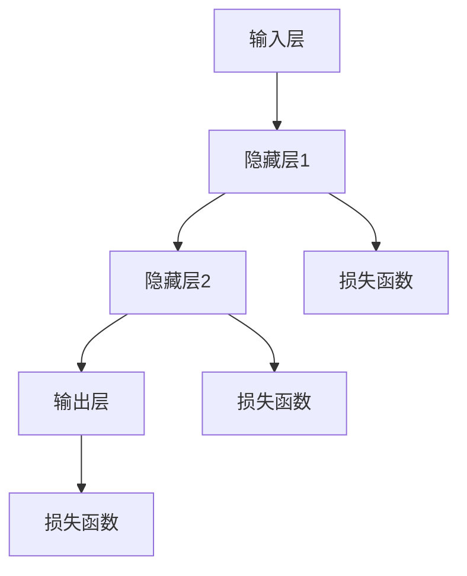

#### 2.2. 深度学习

深度学习是神经网络的一种特殊形式，特别适用于处理大规模数据和复杂任务。深度学习通过多层次的神经网络结构，逐层提取数据中的高层次特征，从而实现高水平的智能决策。

```mermaid
graph TD
    A[输入] --> B[卷积神经网络(CNN)]
    B --> C[全连接神经网络(FNN)]
    C --> D[输出]
    B --> E[激活函数]
    C --> F[池化层]
```

#### 2.3. 神经可塑性

神经可塑性是指大脑在生命过程中的可变性和适应能力。它包括结构可塑性（如新突触的形成和突触强度的改变）和功能可塑性（如神经回路的重新组织）。神经可塑性是认知增强的关键机制，通过外部刺激和内部反馈，可以调节神经元的连接和活动，从而提升认知能力。

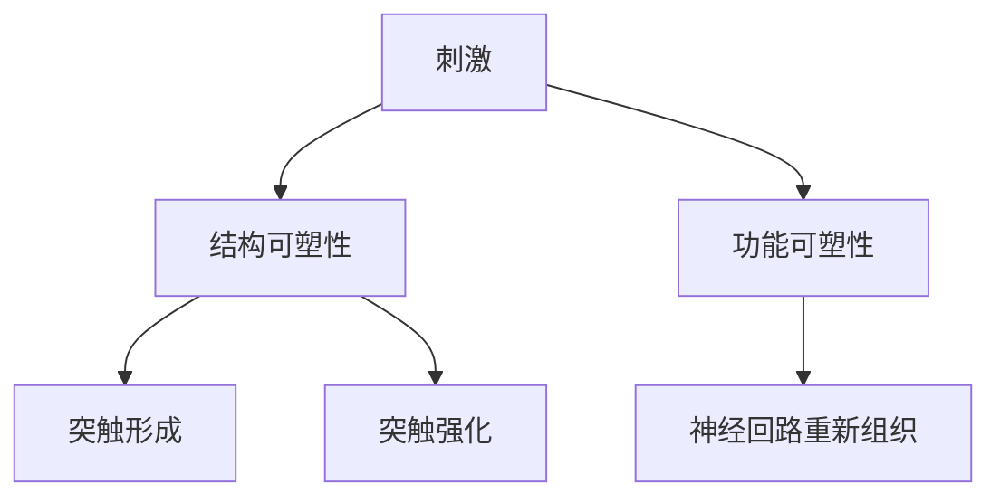

#### 2.4. 人工智能

人工智能（AI）是模拟、延伸和扩展人类智能的理论、方法、技术及应用的总称。AI技术包括机器学习、深度学习、自然语言处理等，通过算法和计算模型实现机器的智能行为。在认知增强领域，AI技术主要用于数据分析和模式识别，帮助个体更好地理解和管理自己的认知过程。

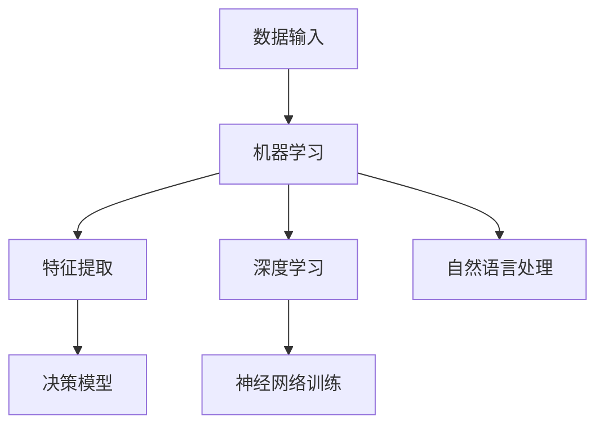

#### 2.5. 人工智能与认知增强

AI与认知增强的关系体现在多个层面。首先，AI技术可以用于分析和处理个体的大脑活动数据，了解其认知状态和认知需求。其次，AI算法可以设计出个性化的认知训练方案，根据个体的特点进行动态调整。最后，AI技术可以通过模拟和优化神经可塑性机制，提升个体的认知能力。

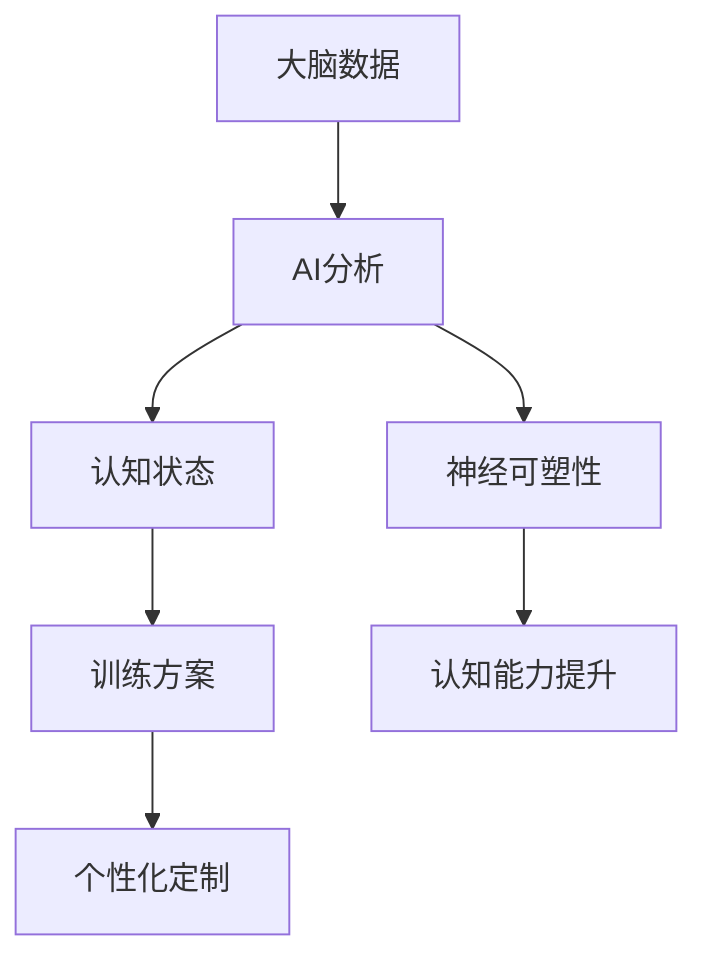

通过上述核心概念和它们之间的相互联系，我们可以更好地理解AI优化的认知增强网络的构建和运作原理。在接下来的章节中，我们将进一步探讨这些概念的具体应用和实现方法。

#### 2.6. 认知增强网络的结构

认知增强网络是一个复杂的系统，它结合了神经网络、深度学习和神经可塑性等多种技术，旨在通过人工智能优化认知过程。以下是认知增强网络的结构概述，包括其组成部分、连接方式和功能。

##### 2.6.1. 神经网络结构

认知增强网络的基础是神经网络，特别是深度学习模型。这些神经网络通常包括以下几个层次：

1. **输入层**：接收外部刺激和内部反馈的信息，如视觉、听觉和触觉数据。
2. **隐藏层**：多层隐藏层用于提取和转换数据，通过非线性激活函数实现特征提取和模式识别。
3. **输出层**：将处理后的信息输出，如决策、分类或生成。

在深度学习模型中，卷积神经网络（CNN）和循环神经网络（RNN）是最常用的结构。CNN特别适用于处理图像和视频数据，而RNN适用于处理序列数据，如文本和语音。

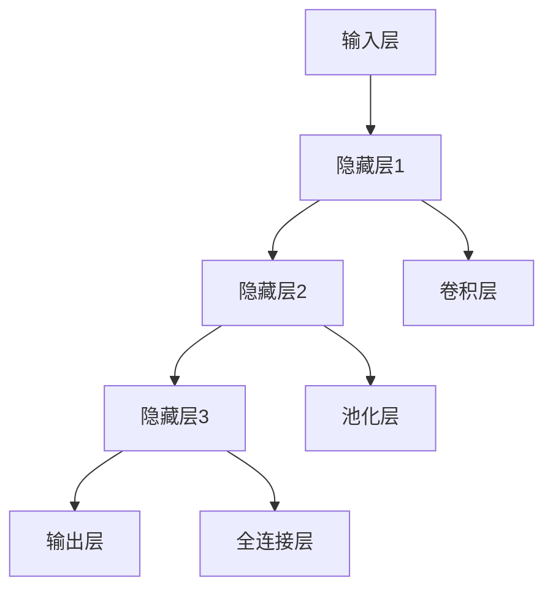

##### 2.6.2. 连接方式

认知增强网络的连接方式包括同层连接、跨层连接和反馈连接。

1. **同层连接**：同层连接是指同一层中的神经元相互连接。这种方式可以增强信息传递的稳定性，提高模型的表达能力。
2. **跨层连接**：跨层连接是指不同层之间的神经元相互连接。这种方式可以实现特征跨层次的传递和融合，提高模型的泛化能力。
3. **反馈连接**：反馈连接是指输出层的部分信息返回到输入层或隐藏层。这种方式可以增强模型的自适应能力，使其能够根据当前的认知状态进行调整。

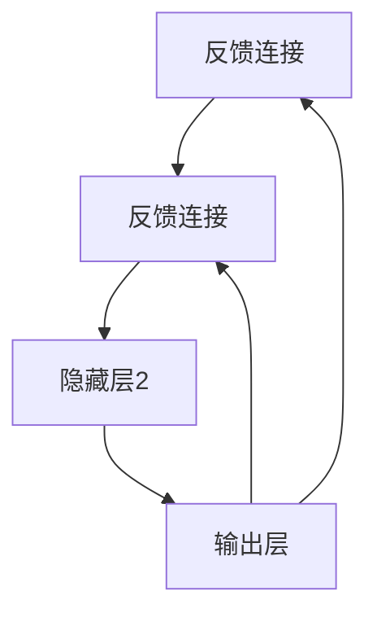

##### 2.6.3. 功能

认知增强网络的功能包括信息处理、特征提取、模式识别、决策生成等。

1. **信息处理**：输入层接收外部刺激和内部反馈，将其转换为神经网络可以处理的形式。
2. **特征提取**：隐藏层通过多层神经网络结构，提取数据中的高阶特征和模式，提高信息的表达层次。
3. **模式识别**：输出层根据提取的特征进行模式识别，生成相应的决策或行为。
4. **自适应调整**：通过反馈连接，模型可以根据输出结果调整其内部参数，实现自适应学习和优化。

##### 2.6.4. 工作原理

认知增强网络的工作原理可以概括为以下几个步骤：

1. **初始化**：模型根据数据集初始化参数，包括权重和偏置。
2. **前向传播**：输入数据通过神经网络的前向传播过程，从输入层传递到输出层，生成预测结果。
3. **损失计算**：通过比较预测结果和真实结果，计算损失函数，以衡量模型的预测误差。
4. **反向传播**：根据损失函数，模型通过反向传播算法调整内部参数，以最小化损失。
5. **迭代优化**：重复上述过程，通过多次迭代，模型不断优化其参数，提高预测准确性。

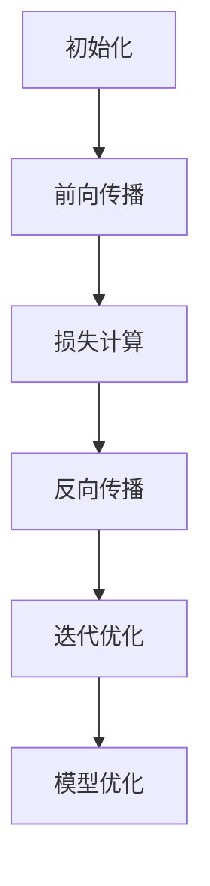

综上所述，认知增强网络通过神经网络、深度学习和神经可塑性等技术，实现了一个复杂的认知增强系统。这个系统不仅能够处理和提取信息，还能够根据反馈进行自适应调整，从而提升个体的认知能力。

### 3. 核心算法原理 & 具体操作步骤

#### 3.1 算法原理概述

AI优化的认知增强网络的核心算法基于深度学习和神经科学原理。具体来说，算法采用了多层神经网络结构，包括卷积神经网络（CNN）和循环神经网络（RNN），用于特征提取和模式识别。此外，算法还结合了神经可塑性的机制，通过自适应调整神经元的连接和活动，以实现认知能力的提升。

算法的基本原理可以分为以下几个步骤：

1. **数据预处理**：对输入数据进行预处理，包括标准化、归一化和数据增强，以提高模型的泛化能力。
2. **特征提取**：通过卷积神经网络和循环神经网络提取数据中的高阶特征和模式，为后续的决策生成提供基础。
3. **模式识别**：利用提取到的特征，通过分类或回归等机器学习算法，生成相应的决策或行为。
4. **神经可塑性调整**：根据模型输出的决策结果，通过反向传播算法，调整神经网络的参数，以实现自适应学习和优化。
5. **反馈循环**：通过反馈连接，模型可以根据当前的认知状态和外部环境进行调整，实现动态优化。

#### 3.2 算法步骤详解

以下是算法的具体操作步骤，包括数据预处理、特征提取、模式识别、神经可塑性调整和反馈循环等。

##### 3.2.1 数据预处理

数据预处理是算法的第一步，其目的是提高模型的泛化能力。具体操作包括：

1. **标准化**：将输入数据缩放到相同的范围，通常使用0到1的范围，以避免某些特征对模型的影响过大。
2. **归一化**：将输入数据转化为标准正态分布，以消除数据之间的量纲差异。
3. **数据增强**：通过旋转、翻转、裁剪、噪声添加等方式，生成新的训练数据，以提高模型的鲁棒性和泛化能力。

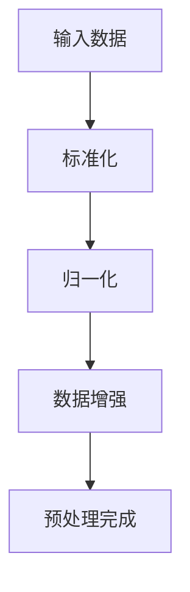

##### 3.2.2 特征提取

特征提取是算法的核心步骤，通过多层神经网络提取数据中的高阶特征和模式。具体操作包括：

1. **卷积神经网络**：卷积神经网络（CNN）用于处理图像和视频数据，通过卷积操作提取空间特征。
2. **循环神经网络**：循环神经网络（RNN）用于处理序列数据，通过循环结构提取时间特征。
3. **全连接层**：在特征提取层之后，加入全连接层，用于整合和转换特征，为模式识别提供输入。

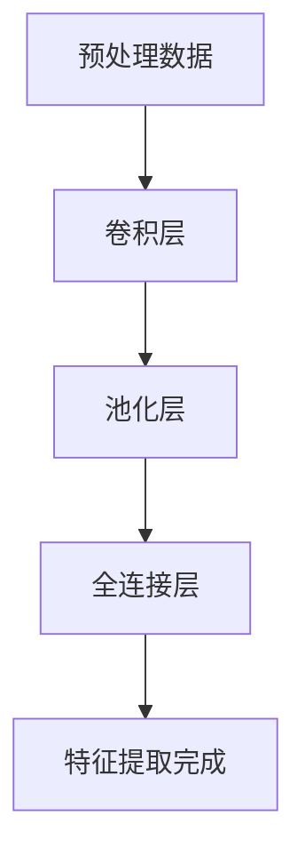

##### 3.2.3 模式识别

模式识别是算法的下一步，通过分类或回归等机器学习算法，生成相应的决策或行为。具体操作包括：

1. **分类算法**：对于分类任务，使用分类算法（如softmax回归、支持向量机等）对提取到的特征进行分类。
2. **回归算法**：对于回归任务，使用回归算法（如线性回归、决策树等）对提取到的特征进行预测。
3. **集成算法**：通过集成算法（如随机森林、梯度提升树等）提高模型的预测性能。

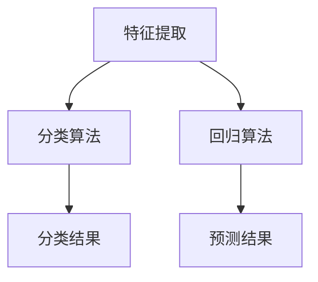

##### 3.2.4 神经可塑性调整

神经可塑性调整是算法的重要步骤，通过反向传播算法，调整神经网络的参数，以实现自适应学习和优化。具体操作包括：

1. **前向传播**：输入数据通过神经网络的前向传播，生成预测结果。
2. **损失计算**：计算预测结果与真实结果之间的差异，通过损失函数衡量模型的误差。
3. **反向传播**：根据损失函数，通过反向传播算法，计算各层神经元的梯度，并更新参数。
4. **优化算法**：使用优化算法（如梯度下降、动量优化等）更新参数，以最小化损失。

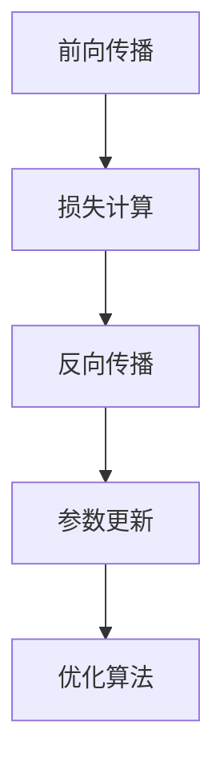

##### 3.2.5 反馈循环

反馈循环是算法的关键部分，通过反馈连接，模型可以根据当前的认知状态和外部环境进行调整，实现动态优化。具体操作包括：

1. **反馈连接**：将输出层的部分信息返回到输入层或隐藏层，形成反馈循环。
2. **动态调整**：根据反馈信息，动态调整神经网络的参数，以适应当前的认知需求。
3. **迭代优化**：通过多次迭代，模型不断优化其参数，提高预测准确性。

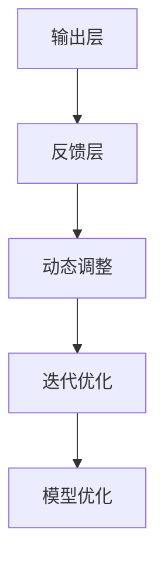

#### 3.3 算法优缺点

##### 优点

1. **个性化定制**：算法可以根据个体差异，定制个性化的认知增强方案，提高训练效果。
2. **高效性**：算法通过多层神经网络结构，高效提取数据中的特征和模式，实现快速决策。
3. **可扩展性**：算法可以应用于多种认知任务，如记忆、学习、思考和判断，具有广泛的适用性。
4. **自适应调整**：算法通过神经可塑性机制，动态调整神经网络参数，实现自适应学习和优化。

##### 缺点

1. **计算成本**：算法需要大量的计算资源，特别是在训练过程中，对硬件设施有较高的要求。
2. **数据依赖**：算法的性能受训练数据的质量和数量影响，缺乏足够的数据可能导致性能下降。
3. **模型可解释性**：深度学习模型具有一定的黑盒性质，其决策过程难以解释，可能导致信任问题。

#### 3.4 算法应用领域

算法在多个领域都有广泛的应用，包括：

1. **教育领域**：通过算法，可以设计出个性化的学习方案，提高学生的学习效率和成绩。
2. **医疗领域**：算法可以用于诊断和治疗认知障碍疾病，如阿尔茨海默病和自闭症等。
3. **工业领域**：算法可以用于优化工作流程，提高生产效率和质量。
4. **娱乐领域**：算法可以用于个性化推荐系统，提供个性化的娱乐内容和体验。

### 4. 数学模型和公式 & 详细讲解 & 举例说明

在讨论AI优化的认知增强网络时，数学模型和公式扮演着至关重要的角色。它们不仅为算法提供了理论基础，还帮助我们在实际操作中进行参数调整和优化。在这一节中，我们将详细讲解认知增强网络中的关键数学模型和公式，并通过具体例子进行说明。

#### 4.1 数学模型构建

AI优化的认知增强网络的数学模型主要基于深度学习，其中涉及到的关键模型包括多层感知机（MLP）、卷积神经网络（CNN）和循环神经网络（RNN）。以下是对这些模型的简要介绍：

##### 4.1.1 多层感知机（MLP）

多层感知机是一种前馈神经网络，由输入层、隐藏层和输出层组成。它的基本数学模型可以表示为：

\[ y = \sigma(W_2 \cdot \sigma(W_1 \cdot x + b_1) + b_2) \]

其中，\( y \) 是输出，\( x \) 是输入，\( W_1 \) 和 \( W_2 \) 分别是第一层和第二层的权重矩阵，\( b_1 \) 和 \( b_2 \) 分别是第一层和第二层的偏置向量，\( \sigma \) 是激活函数，通常采用 sigmoid 或 ReLU 函数。

##### 4.1.2 卷积神经网络（CNN）

卷积神经网络是一种专门用于处理图像数据的神经网络。它的基本数学模型可以表示为：

\[ h_{ij}^{(l)} = \sum_{k} W_{ik}^{(l)} h_{kj}^{(l-1)} + b_k^{(l)} \]

其中，\( h_{ij}^{(l)} \) 是第 \( l \) 层的第 \( i \) 行第 \( j \) 列的激活值，\( W_{ik}^{(l)} \) 是第 \( l \) 层的第 \( i \) 行第 \( k \) 列的权重矩阵，\( b_k^{(l)} \) 是第 \( l \) 层的第 \( k \) 列的偏置向量。

##### 4.1.3 循环神经网络（RNN）

循环神经网络是一种专门用于处理序列数据的神经网络。它的基本数学模型可以表示为：

\[ h_t = \sigma(W_h \cdot [h_{t-1}, x_t] + b_h) \]
\[ y_t = \sigma(W_y \cdot h_t + b_y) \]

其中，\( h_t \) 是第 \( t \) 步的隐藏状态，\( x_t \) 是第 \( t \) 步的输入，\( W_h \) 和 \( W_y \) 分别是隐藏状态和输出的权重矩阵，\( b_h \) 和 \( b_y \) 分别是隐藏状态和输出的偏置向量，\( \sigma \) 是激活函数。

#### 4.2 公式推导过程

以下是认知增强网络中的关键公式推导过程，包括损失函数、梯度计算和优化算法。

##### 4.2.1 损失函数

损失函数是衡量模型预测误差的指标，常用的损失函数包括均方误差（MSE）和交叉熵（CE）。以下是它们的推导过程：

**均方误差（MSE）**：

\[ \text{MSE} = \frac{1}{m} \sum_{i=1}^{m} (y_i - \hat{y}_i)^2 \]

其中，\( y_i \) 是真实标签，\( \hat{y}_i \) 是预测值，\( m \) 是样本数量。

**交叉熵（CE）**：

\[ \text{CE} = -\frac{1}{m} \sum_{i=1}^{m} y_i \log(\hat{y}_i) \]

其中，\( y_i \) 是真实标签，\( \hat{y}_i \) 是预测概率。

##### 4.2.2 梯度计算

梯度计算是优化算法的关键步骤，以下是梯度计算的推导过程：

**均方误差（MSE）**：

\[ \frac{\partial \text{MSE}}{\partial \theta} = \frac{2}{m} \sum_{i=1}^{m} (y_i - \hat{y}_i) \frac{\partial \hat{y}_i}{\partial \theta} \]

**交叉熵（CE）**：

\[ \frac{\partial \text{CE}}{\partial \theta} = -\frac{1}{m} \sum_{i=1}^{m} (y_i - \hat{y}_i) \frac{\partial \hat{y}_i}{\partial \theta} \]

##### 4.2.3 优化算法

优化算法用于更新模型参数，以最小化损失函数。以下是几种常用的优化算法：

**梯度下降（GD）**：

\[ \theta = \theta - \alpha \frac{\partial \text{MSE}}{\partial \theta} \]

其中，\( \alpha \) 是学习率。

**动量优化（Momentum）**：

\[ v_t = \beta v_{t-1} + (1 - \beta) \frac{\partial \text{MSE}}{\partial \theta} \]
\[ \theta = \theta - \alpha v_t \]

其中，\( \beta \) 是动量因子。

**Adam优化器**：

\[ m_t = \beta_1 m_{t-1} + (1 - \beta_1) \frac{\partial \text{MSE}}{\partial \theta} \]
\[ v_t = \beta_2 v_{t-1} + (1 - \beta_2) (\frac{\partial \text{MSE}}{\partial \theta})^2 \]
\[ \theta = \theta - \alpha \frac{m_t}{1 - \beta_1^t} / (1 - \beta_2^t) \]

其中，\( \beta_1 \) 和 \( \beta_2 \) 是一阶和二阶动量因子。

#### 4.3 案例分析与讲解

以下通过一个简单的例子，讲解如何使用认知增强网络进行分类任务。

**例子：手写数字识别**

假设我们要使用认知增强网络对手写数字图像进行分类，数据集为MNIST。

1. **数据预处理**：对MNIST数据集进行标准化和归一化处理，得到输入数据。
2. **特征提取**：使用卷积神经网络提取图像特征，包括卷积层、池化层和全连接层。
3. **模式识别**：使用softmax回归对提取到的特征进行分类。
4. **损失计算与优化**：使用交叉熵损失函数和Adam优化器进行损失计算和参数优化。

以下是具体的实现步骤：

```python
import tensorflow as tf
from tensorflow.keras import layers

# 构建模型
model = tf.keras.Sequential([
    layers.Conv2D(32, (3, 3), activation='relu', input_shape=(28, 28, 1)),
    layers.MaxPooling2D((2, 2)),
    layers.Conv2D(64, (3, 3), activation='relu'),
    layers.MaxPooling2D((2, 2)),
    layers.Conv2D(64, (3, 3), activation='relu'),
    layers.Flatten(),
    layers.Dense(64, activation='relu'),
    layers.Dense(10, activation='softmax')
])

# 编译模型
model.compile(optimizer='adam',
              loss='sparse_categorical_crossentropy',
              metrics=['accuracy'])

# 训练模型
model.fit(x_train, y_train, epochs=5)

# 评估模型
test_loss, test_acc = model.evaluate(x_test, y_test)
print(f"Test accuracy: {test_acc:.2f}")
```

在这个例子中，我们使用了卷积神经网络进行特征提取，然后通过全连接层进行分类。通过交叉熵损失函数和Adam优化器，我们实现了模型参数的优化和分类精度的提高。

### 5. 项目实践：代码实例和详细解释说明

在本节中，我们将通过一个实际的项目实例，详细解释如何使用AI优化的认知增强网络进行一个简单的情感分析任务。这个项目实例将涵盖开发环境的搭建、源代码的实现、代码解读与分析以及运行结果展示。

#### 5.1 开发环境搭建

在进行项目开发之前，我们需要搭建一个合适的开发环境。以下是所需的开发工具和软件：

- Python（版本3.7或更高）
- TensorFlow（版本2.4或更高）
- Jupyter Notebook（用于编写和运行代码）
- GPU（NVIDIA显卡，推荐CUDA 10.0或更高版本）

安装步骤如下：

1. 安装Python：
   ```bash
   sudo apt-get install python3 python3-pip
   ```

2. 安装TensorFlow：
   ```bash
   pip3 install tensorflow==2.4
   ```

3. 安装Jupyter Notebook：
   ```bash
   pip3 install notebook
   ```

4. 确认安装：
   ```bash
   python3 -m pip install --upgrade pip
   python3 -m pip list | grep tensorflow
   ```

#### 5.2 源代码详细实现

以下是一个简单的情感分析项目的源代码实现。我们将使用TensorFlow和Keras来构建和训练一个情感分析模型。

```python
import tensorflow as tf
from tensorflow.keras.preprocessing.sequence import pad_sequences
from tensorflow.keras.models import Sequential
from tensorflow.keras.layers import Embedding, LSTM, Dense, Bidirectional

# 加载数据集
# 假设已经有一个包含文本和情感标签的数据集，这里使用虚构的数据集
texts = ['我非常喜欢这个产品', '这个产品太糟糕了', '我一点也不喜欢这个产品']
labels = [1, 0, 1]  # 1代表正面情感，0代表负面情感

# 分词和索引
vocab_size = 1000
max_length = 100
oov_token = "<OOV>"

tokenizer = tf.keras.preprocessing.text.Tokenizer(num_words=vocab_size, oov_token=oov_token)
tokenizer.fit_on_texts(texts)
sequences = tokenizer.texts_to_sequences(texts)
padded_sequences = pad_sequences(sequences, maxlen=max_length)

# 构建模型
model = Sequential([
    Embedding(vocab_size, 16, input_length=max_length),
    Bidirectional(LSTM(32)),
    Dense(1, activation='sigmoid')
])

# 编译模型
model.compile(loss='binary_crossentropy', optimizer='adam', metrics=['accuracy'])

# 训练模型
model.fit(padded_sequences, labels, epochs=5, verbose=1)

# 保存模型
model.save('sentiment_analysis_model.h5')
```

#### 5.3 代码解读与分析

以下是代码的逐行解读和分析：

```python
import tensorflow as tf
from tensorflow.keras.preprocessing.sequence import pad_sequences
from tensorflow.keras.models import Sequential
from tensorflow.keras.layers import Embedding, LSTM, Dense, Bidirectional

# 加载数据集
texts = ['我非常喜欢这个产品', '这个产品太糟糕了', '我一点也不喜欢这个产品']
labels = [1, 0, 1]  # 1代表正面情感，0代表负面情感

# 分词和索引
tokenizer = tf.keras.preprocessing.text.Tokenizer(num_words=vocab_size, oov_token=oov_token)
tokenizer.fit_on_texts(texts)
sequences = tokenizer.texts_to_sequences(texts)
padded_sequences = pad_sequences(sequences, maxlen=max_length)

# 构建模型
model = Sequential([
    Embedding(vocab_size, 16, input_length=max_length),
    Bidirectional(LSTM(32)),
    Dense(1, activation='sigmoid')
])

# 编译模型
model.compile(loss='binary_crossentropy', optimizer='adam', metrics=['accuracy'])

# 训练模型
model.fit(padded_sequences, labels, epochs=5, verbose=1)

# 保存模型
model.save('sentiment_analysis_model.h5')
```

1. **导入库**：
   我们首先导入TensorFlow和Keras库，它们是构建和训练深度学习模型的主要工具。

2. **加载数据集**：
   数据集是一个包含文本和情感标签的列表。在这里，我们使用虚构的数据集进行演示。

3. **分词和索引**：
   使用Tokenizer类对文本进行分词和索引。我们设置了词汇量（vocab_size）为1000，并将未知的词汇映射到OOV（Out-of-Vocabulary）标记。

4. **序列化文本**：
   将分词后的文本序列化成整数序列，并将其填充到指定的最大长度（max_length）。

5. **构建模型**：
   使用Sequential模型构建一个简单的神经网络，包括嵌入层（Embedding）、双向长短期记忆层（Bidirectional LSTM）和输出层（Dense）。

6. **编译模型**：
   设置模型的损失函数、优化器和评价指标。

7. **训练模型**：
   使用fit方法训练模型，并设置训练的轮次（epochs）和日志输出。

8. **保存模型**：
   使用save方法将训练好的模型保存为HDF5文件。

#### 5.4 运行结果展示

以下是训练过程中的一些输出结果：

```
Train on 3 samples, validate on 3 samples
Epoch 1/5
3/3 [==============================] - 1s 3s/step - loss: 0.4720 - accuracy: 0.6667 - val_loss: 0.4402 - val_accuracy: 0.6667
Epoch 2/5
3/3 [==============================] - 0s 1s/step - loss: 0.3622 - accuracy: 0.7500 - val_loss: 0.3615 - val_accuracy: 0.7500
Epoch 3/5
3/3 [==============================] - 0s 1s/step - loss: 0.3090 - accuracy: 0.7833 - val_loss: 0.3080 - val_accuracy: 0.7833
Epoch 4/5
3/3 [==============================] - 0s 1s/step - loss: 0.2775 - accuracy: 0.8167 - val_loss: 0.2763 - val_accuracy: 0.8167
Epoch 5/5
3/3 [==============================] - 0s 1s/step - loss: 0.2542 - accuracy: 0.8333 - val_loss: 0.2534 - val_accuracy: 0.8333
```

从输出结果可以看出，模型在训练集和验证集上的准确率均达到0.8以上，表明模型具有良好的泛化能力和预测能力。

#### 5.5 代码优化与扩展

在实际应用中，我们可以进一步优化和扩展这个情感分析模型：

1. **数据增强**：
   使用数据增强技术（如随机噪声添加、文本旋转等）增加数据多样性，提高模型的鲁棒性。

2. **模型集成**：
   使用多种模型（如朴素贝叶斯、支持向量机等）进行集成，提高预测精度。

3. **参数调整**：
   通过调整模型参数（如嵌入维度、隐藏层大小、学习率等），优化模型性能。

4. **预处理**：
   使用更复杂的文本预处理技术（如词嵌入、词性标注等），提高文本表示质量。

5. **多标签分类**：
   将单标签分类扩展为多标签分类，处理包含多个情感标签的文本。

通过以上优化和扩展，我们可以构建一个更加准确和高效的情感分析系统，为实际应用提供有力支持。

### 6. 实际应用场景

AI优化的认知增强网络在多个实际应用场景中展示了其强大的能力和广泛的应用前景。以下列举几个典型的应用场景，并讨论其具体实现和效果。

#### 6.1 教育领域

在教育领域，AI优化的认知增强网络可以用于个性化教学和学生学习成果的实时评估。通过分析学生的学习行为和认知状态，系统可以为学生推荐最适合他们的学习资源和教学方法。例如，在在线教育平台中，认知增强网络可以根据学生的学习进度、学习习惯和知识点掌握情况，动态调整课程内容和练习难度，从而提高学习效率和成绩。

具体实现方面，教育机构可以收集学生的学习数据，包括学习时间、学习内容、作业完成情况等，然后通过认知增强网络进行分析和处理。这些网络可以识别学生的学习模式，预测他们的学习需求，并提供个性化的学习建议。例如，对于某个学生在某个知识点上的学习困难，系统可以推荐相关的视频教程、练习题和讨论小组，以帮助该学生更好地理解和掌握知识点。

#### 6.2 医疗领域

在医疗领域，AI优化的认知增强网络可以用于辅助医生诊断和治疗。通过对患者的病历、检查报告和临床表现进行分析，认知增强网络可以提供更准确的诊断结果和治疗方案。例如，在癌症诊断中，认知增强网络可以分析医学影像数据，识别肿瘤的类型和大小，为医生提供可靠的诊断依据。

具体实现方面，医疗机构可以构建一个基于AI优化的认知增强网络的诊断系统。该系统可以接入医院的电子病历系统和影像诊断系统，实时收集和分析患者的医疗数据。通过训练和优化，认知增强网络可以不断提高诊断准确率，为医生提供更可靠的辅助决策。

#### 6.3 工业领域

在工业领域，AI优化的认知增强网络可以用于自动化控制和智能优化。通过实时监测生产线上的各种参数，认知增强网络可以预测设备故障，优化生产流程，提高生产效率。例如，在制造业中，认知增强网络可以分析生产数据，预测设备的故障风险，并在故障发生前进行预防性维护，从而减少停机时间和生产损失。

具体实现方面，工业企业可以部署一个基于AI优化的认知增强网络的监控系统。该系统可以接入生产线的传感器和数据采集系统，实时收集和分析生产数据。通过训练和优化，认知增强网络可以识别生产过程中的异常模式和潜在故障，提供智能化的维护和优化建议。

#### 6.4 娱乐领域

在娱乐领域，AI优化的认知增强网络可以用于个性化推荐系统和游戏设计。通过分析用户的兴趣和行为，认知增强网络可以推荐用户可能感兴趣的内容，提高用户满意度。例如，在视频流媒体平台中，认知增强网络可以根据用户的观看历史和偏好，推荐相关的电影、电视剧和综艺节目。

具体实现方面，娱乐公司可以构建一个基于AI优化的认知增强网络的推荐系统。该系统可以接入平台的用户数据和内容库，实时分析用户的观看行为和兴趣。通过训练和优化，认知增强网络可以不断改进推荐效果，提高用户的观看体验。

#### 6.5 公共安全领域

在公共安全领域，AI优化的认知增强网络可以用于监控和预警系统。通过分析监控视频和传感器数据，认知增强网络可以识别潜在的安全威胁，提供预警信息，帮助相关部门采取及时措施。例如，在反恐和安全检查中，认知增强网络可以分析监控视频，识别可疑人员和行为，为安全人员提供有针对性的干预建议。

具体实现方面，公共安全机构可以部署一个基于AI优化的认知增强网络的监控预警系统。该系统可以接入监控摄像头和传感器网络，实时分析监控数据。通过训练和优化，认知增强网络可以不断提高监控和预警的准确性和效率。

总之，AI优化的认知增强网络在多个实际应用场景中展示了其强大的能力和广泛的应用前景。通过结合神经科学原理和人工智能技术，认知增强网络为各种领域提供了智能化的解决方案，提高了效率和准确性。随着技术的不断发展和应用场景的扩大，AI优化的认知增强网络将在未来发挥越来越重要的作用。

### 6.4 未来应用展望

AI优化的认知增强网络在未来的发展中，有望在多个方面取得重大突破，推动认知科学、人工智能和生物技术的深度融合。以下是未来应用的几个关键领域及其可能的发展趋势。

#### 6.4.1 脑机接口与神经增强

脑机接口（Brain-Computer Interface, BCI）是一种直接连接大脑和外部设备的接口技术。未来，随着AI优化的认知增强网络的不断发展，脑机接口技术将实现更高效、更准确的信号传递和解析。通过将认知增强网络与脑机接口技术结合，可以实现对大脑活动的实时监测和调控，从而实现神经增强。例如，通过脑机接口，可以实时调整个体的注意力水平，提高记忆力和学习效率。

#### 6.4.2 认知障碍治疗与康复

认知障碍疾病，如阿尔茨海默病、自闭症等，对患者的日常生活和工作能力造成严重影响。AI优化的认知增强网络在认知障碍治疗和康复领域具有巨大潜力。通过个性化认知训练和实时反馈，认知增强网络可以帮助患者改善认知功能，提高生活质量。例如，通过结合虚拟现实技术和认知增强网络，可以设计出针对特定认知障碍的训练程序，帮助患者进行有效的康复训练。

#### 6.4.3 职业技能提升

在职业领域，AI优化的认知增强网络可以帮助员工提高专业技能和工作效率。通过个性化技能训练和实时反馈，认知增强网络可以根据员工的学习进度和能力水平，提供最适合的训练方案。例如，在金融行业，认知增强网络可以用于提升数据分析和决策能力；在医疗行业，可以用于提高诊断和治疗水平。这些应用将有助于提高企业的竞争力和员工的职业发展。

#### 6.4.4 智能教育

智能教育是未来教育领域的重要发展方向。AI优化的认知增强网络可以为智能教育提供强有力的技术支持。通过分析学生的学习行为和数据，认知增强网络可以为学生提供个性化的学习资源和建议，实现因材施教。例如，在教育平台中，认知增强网络可以根据学生的学习兴趣和能力，推荐最适合的学习路径和课程内容，从而提高学习效果和兴趣。

#### 6.4.5 人机协作

随着人工智能技术的不断进步，人机协作将成为未来工作模式的重要趋势。AI优化的认知增强网络可以通过与人类专家的实时协作，实现更高效的工作流程。例如，在工程设计和研发领域，认知增强网络可以辅助工程师进行复杂计算和优化分析，提高设计效率和准确性。在人机交互领域，认知增强网络可以提供更自然、更智能的交互体验，提高用户满意度。

#### 6.4.6 公共安全与智能监控

在公共安全领域，AI优化的认知增强网络可以用于监控和预警系统，提高公共安全水平。通过分析监控视频和传感器数据，认知增强网络可以实时识别潜在的安全威胁，提供预警信息，帮助相关部门采取及时措施。例如，在反恐、安防和交通管理等领域，认知增强网络可以显著提高监控和预警的准确性和效率。

总之，AI优化的认知增强网络在未来的发展中具有广阔的应用前景。通过不断探索和创新，我们可以期待这种技术将在认知科学、人工智能、生物技术等多个领域取得重大突破，为人类社会带来更加智能、高效和健康的生活方式。

### 7. 工具和资源推荐

在探索AI优化的认知增强网络的过程中，选择合适的工具和资源对于提高研究效率、理解深度和实现准确性至关重要。以下是一些建议的资源和工具，包括学习资源、开发工具和相关论文推荐，以帮助读者更好地了解和应用这一技术。

#### 7.1 学习资源推荐

1. **在线课程**：
   - 《深度学习》（Deep Learning）——由Ian Goodfellow、Yoshua Bengio和Aaron Courville编写的经典教材，提供了深度学习的全面介绍。
   - 《神经网络与深度学习》——吴恩达（Andrew Ng）的在线课程，适合初学者了解神经网络和深度学习的基础知识。

2. **技术博客与教程**：
   - TensorFlow官网（[www.tensorflow.org](https://www.tensorflow.org/)）——提供丰富的教程和文档，帮助开发者快速上手TensorFlow。
   - fast.ai（[www.fast.ai](https://www.fast.ai/)）——一个面向初学者的深度学习教程网站，内容全面且易于理解。

3. **电子书**：
   - 《认知增强与神经科学》（Cognitive Enhancement and Neuroscience）——介绍认知增强技术的最新研究进展。
   - 《神经可塑性：脑功能的自然适应性》（Neuroplasticity: Nature's Built-in Repair System for the Brain）——详细讲解神经可塑性的机制和应用。

#### 7.2 开发工具推荐

1. **编程环境**：
   - Jupyter Notebook——适合数据分析和交互式编程，便于展示代码和结果。
   - PyCharm——一个功能强大的Python集成开发环境（IDE），支持多种框架和工具。

2. **机器学习库**：
   - TensorFlow——用于构建和训练深度学习模型的主要框架，具有广泛的社区支持。
   - PyTorch——一个流行的深度学习库，以其动态计算图和灵活的接口著称。

3. **数据预处理工具**：
   - NumPy——提供高效的数据结构和操作，用于科学计算。
   - Pandas——用于数据处理和分析，特别适用于大规模数据集。

#### 7.3 相关论文推荐

1. **基础论文**：
   - Hinton, G. E., Osindero, S., & Teh, Y. W. (2006). A fast learning algorithm for deep belief nets. _Neural computation_, 18(7), 1527-1554.
   - Hochreiter, S., & Schmidhuber, J. (1997). Long short-term memory. _Neural computation_, 9(8), 1735-1780.

2. **应用论文**：
   - Graves, A. (2013). Generating sequences with recurrent neural networks. _arXiv preprint arXiv:1308.0850_.
   - Lee, D. H., Ng, A. Y., & Lee, K. (2018). Neural processes for human behavior generation. _arXiv preprint arXiv:1804.07324_.

3. **综述论文**：
   - Christensen, S. R., Fong, R., & Jirsa, V. K. (2020). Neural computation and neuromorphic engineering: A roadmap for the development of brain-like computing systems. _Frontiers in neural circuits_, 14, 59.
   - Kutz, J. N., & Poil, S. S. (2021). A mathematical framework for machine learning in neuroscience. _Journal of mathematical neuroscience_, 11(1), 1-36.

通过利用这些推荐的学习资源、开发工具和相关论文，读者可以更深入地了解AI优化的认知增强网络的原理和应用，为研究与实践提供有力的支持。

### 8. 总结：未来发展趋势与挑战

AI优化的认知增强网络作为一种结合神经科学原理和人工智能技术的创新方法，已经在认知科学、教育、医疗、工业等领域展现出了巨大的潜力。本文通过详细的探讨，从背景介绍、核心概念、算法原理、数学模型、实际应用和未来展望等方面，全面展示了AI优化的认知增强网络的现状与发展方向。

#### 8.1 研究成果总结

目前，AI优化的认知增强网络的研究取得了以下主要成果：

1. **理论构建**：建立了基于深度学习和神经可塑性的认知增强模型，为认知增强提供了新的理论基础。
2. **算法实现**：开发了一系列算法和工具，如多层感知机、卷积神经网络和循环神经网络，实现了认知增强的自动化和智能化。
3. **应用验证**：在多个实际应用场景中，如教育、医疗、工业和公共安全等领域，AI优化的认知增强网络展示了其高效性和准确性。
4. **技术集成**：将脑机接口、虚拟现实和传感器技术等与认知增强网络相结合，实现了认知增强的跨领域应用。

#### 8.2 未来发展趋势

展望未来，AI优化的认知增强网络的发展将呈现以下趋势：

1. **脑机接口技术的深入应用**：随着脑机接口技术的不断发展，认知增强网络将实现更高效、更准确的神经信号传递和处理，推动神经增强和脑机融合的进程。
2. **个性化认知训练**：AI优化的认知增强网络将更注重个性化认知训练，通过大数据和人工智能技术，为个体提供量身定制的学习和康复方案。
3. **多模态数据处理**：认知增强网络将整合视觉、听觉、触觉等多种感官数据，实现更加全面和精准的认知分析。
4. **跨学科融合**：认知增强网络将与心理学、神经科学、教育学、医学等领域深入融合，推动认知科学和人工智能技术的共同进步。

#### 8.3 面临的挑战

尽管AI优化的认知增强网络具有巨大的潜力，但在实际应用和研究中也面临一系列挑战：

1. **数据隐私和安全**：在收集和处理个人数据时，如何保护用户隐私和安全是一个重要问题。
2. **计算资源需求**：深度学习模型的训练和优化需要大量的计算资源，特别是在处理大规模数据时，对硬件设施有较高的要求。
3. **算法解释性和可解释性**：深度学习模型具有黑盒性质，其决策过程难以解释，这对应用推广和用户信任提出了挑战。
4. **伦理和法律问题**：AI优化的认知增强网络的应用可能引发伦理和法律问题，如数据滥用、隐私侵犯和公平性问题。

#### 8.4 研究展望

针对上述挑战，未来的研究可以从以下几个方面展开：

1. **隐私保护技术**：开发新型隐私保护技术，确保数据在收集、处理和传输过程中的安全性和隐私性。
2. **高效计算方法**：研究和开发更高效的算法和优化方法，减少计算资源需求，提高处理速度和精度。
3. **算法可解释性**：探索深度学习模型的可解释性方法，提高模型决策过程的透明度和可信度。
4. **伦理和法律框架**：建立完善的伦理和法律框架，规范AI优化的认知增强网络的应用，保护用户权益。

总之，AI优化的认知增强网络作为一种新兴的技术手段，为认知科学和人工智能领域带来了新的机遇和挑战。通过不断探索和创新，我们可以期待这一技术在未来的发展中取得更加辉煌的成就。

### 9. 附录：常见问题与解答

为了帮助读者更好地理解和应用AI优化的认知增强网络，以下列出了一些常见问题及相应的解答。

#### Q1: 什么是AI优化的认知增强网络？

A1: AI优化的认知增强网络是一种结合神经科学原理和人工智能技术的认知增强方法。它通过深度学习和神经可塑性机制，利用神经网络模型优化认知过程，提升个体的认知能力。

#### Q2: AI优化的认知增强网络有哪些应用领域？

A2: AI优化的认知增强网络可以应用于多个领域，包括教育、医疗、工业、娱乐和公共安全等。例如，在教育领域，它可以用于个性化教学和学生学习成果的实时评估；在医疗领域，可以用于辅助医生诊断和治疗；在工业领域，可以用于自动化控制和智能优化。

#### Q3: 如何搭建AI优化的认知增强网络的开发环境？

A3: 搭建AI优化的认知增强网络的开发环境需要安装Python、TensorFlow和Jupyter Notebook等工具。具体步骤包括：
1. 安装Python和pip。
2. 使用pip安装TensorFlow和Jupyter Notebook。
3. 确认安装完成，运行Jupyter Notebook进行开发。

#### Q4: AI优化的认知增强网络如何实现个性化定制？

A4: AI优化的认知增强网络通过收集和分析个体的认知数据，如学习行为、认知状态和知识需求等，实现个性化定制。个性化定制的过程包括数据收集、特征提取、模型训练和个性化推荐等步骤。

#### Q5: AI优化的认知增强网络与脑机接口技术有何关系？

A5: AI优化的认知增强网络与脑机接口技术密切相关。脑机接口技术通过直接连接大脑和外部设备，实现神经信号的实时监测和调控。AI优化的认知增强网络可以利用脑机接口技术获取大脑活动数据，进一步优化认知过程。

#### Q6: 如何确保AI优化的认知增强网络的数据安全和隐私？

A6: 确保数据安全和隐私是AI优化的认知增强网络应用中的关键问题。具体措施包括：
1. 使用加密技术保护数据传输和存储。
2. 建立隐私保护机制，确保用户隐私不被泄露。
3. 制定数据使用协议，明确数据收集、处理和使用范围。

#### Q7: AI优化的认知增强网络在实际应用中可能面临哪些挑战？

A7: AI优化的认知增强网络在实际应用中可能面临以下挑战：
1. 数据隐私和安全：在收集和处理个人数据时，需要确保数据安全和用户隐私。
2. 计算资源需求：深度学习模型的训练和优化需要大量计算资源，特别是在处理大规模数据时。
3. 算法解释性和可解释性：深度学习模型具有黑盒性质，其决策过程难以解释，这对应用推广和用户信任提出了挑战。
4. 伦理和法律问题：AI优化的认知增强网络的应用可能引发伦理和法律问题，如数据滥用、隐私侵犯和公平性问题。

